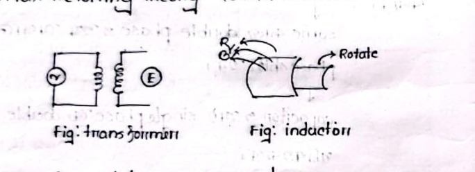
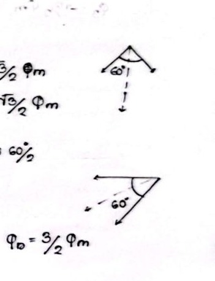
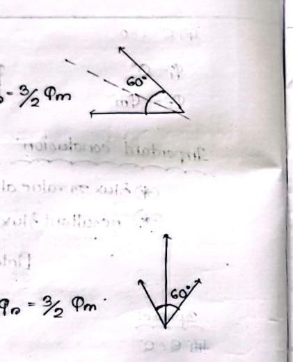

# Class 04: Production of Rotating Magnetic Field (RMF) — Mathematical Proofs

> **Date**: 01.07.2026 | **Instructor**: Fariya Tabassum (FT Mam)  
> **Source Scan Pages**: P08_L (bottom), P08_R, P09 (Left/Right), P10_L  
> [← Previous Class: Class 03](Class_03_Induction_Motor_Basics_and_Stator_Rotor.md) | [📚 Index](00_Index_and_Topic_Map.md) | [Next Class: Class 05 →](Class_05_RMF_Conditions_and_IM_Phasor_Diagram.md)

---

## 1. Transformer vs. Induction Motor Structure

<!-- Page 08_L (bottom) -->

- **Transformer**:
  - The secondary winding does not rotate (it is mechanically stationary).
  - Strictly speaking, it is not a rotating machine, but its primary and secondary operate at identical electrical frequency ($f_1 = f_2$).
  - **Applications**:
    - **Power Transformer**: Used for stepping up or stepping down transmission and distribution voltage levels.
    - **Instrument Transformer (CT / PT)**: Current and potential transformers used for precise measurement and protective relaying at high voltages.
    - **Impedance Matching**: Matching source and load impedances to maximize power transfer (e.g., in audio output stages and RF transmitters).  
      *(Impedance mismatch causes signal reflection and harmonic distortion)*.

- **Induction Machine (Inductor / Motor)**:
  - Polyphase AC electrical power is supplied to the stationary stator windings.
  - Electromagnetic interaction establishes relative motion between stator flux and rotor conductors, causing the rotor to rotate.

---

## 2. Principle of Revolving Magnetic Field

<!-- Page 08_R -->

- **Flux Dynamics**:
  Supplying polyphase AC currents to the stator windings establishes a resultant magnetic flux of constant magnitude that rotates continuously through space at synchronous speed.
  - Standard Grid Frequency: $f = 50\text{ Hz}$
  - Period of 1 Cycle: $T = \frac{1}{50}\text{ s} = 20\text{ ms}$
  - Half-cycle duration: $10\text{ ms}$
  - As alternating phase currents cycle, the direction of conductor currents alternates rapidly:
    $$\text{dot } (\odot) \longleftrightarrow \text{cross } (\otimes)$$
    *(Every $10\text{ ms}$ (half-cycle at $50\text{ Hz}$), a $90^\circ$ spatial orientation shift occurs, creating a seamless revolving field).*

> [!NOTE]
> **Skin Effect Note**
> - **50 Hz Power Frequency (Conductors)**: Current distributes almost uniformly across the cross-sectional area of standard conductors.
> - **High Frequencies (e.g. 15 MHz RF / Wireless)**: Alternating current crowds toward the outer periphery (skin) of the conductor, an electromagnetic phenomenon known as the *skin effect*.

---

## 3. Mathematical Proof: Two-Phase Supply RMF

<!-- Page 09_L & 09_R (top) -->

Consider two stator windings placed $90^\circ$ apart in space, energized by two-phase currents having a $90^\circ$ time phase difference:

$$\Phi_1 = \Phi_m \sin(\omega t + 0^\circ) = \Phi_m \sin\theta$$
$$\Phi_2 = \Phi_m \sin(\omega t + 90^\circ) = \Phi_m \cos\theta$$

### Evaluation at Successive Time Instants ($\Delta\theta = 45^\circ$):

1. **Condition 1: $\theta = 0^\circ$**
   - $\Phi_1 = \Phi_m \sin 0^\circ = 0$
   - $\Phi_2 = \Phi_m \cos 0^\circ = \Phi_m \quad (\text{pointing vertically downward})$
   - **Resultant Flux**: $\Phi_r = \Phi_m$ (pointing downwards along $-\hat{y}$)

2. **Condition 2: $\theta = 45^\circ$**
   - $\Phi_1 = \Phi_m \sin 45^\circ = \frac{\Phi_m}{\sqrt{2}}$
   - $\Phi_2 = \Phi_m \cos 45^\circ = \frac{\Phi_m}{\sqrt{2}}$
   - **Resultant Flux**:
     $$\Phi_r = \sqrt{\left(\frac{\Phi_m}{\sqrt{2}}\right)^2 + \left(\frac{\Phi_m}{\sqrt{2}}\right)^2} = \sqrt{\frac{\Phi_m^2}{2} + \frac{\Phi_m^2}{2}} = \Phi_m$$
   - **Angle**: Shifted by $45^\circ$ in space.

3. **Condition 3: $\theta = 90^\circ$**
   - $\Phi_1 = \Phi_m \sin 90^\circ = \Phi_m$
   - $\Phi_2 = \Phi_m \cos 90^\circ = 0$
   - **Resultant Flux**: $\Phi_r = \Phi_m$ (pointing horizontally along $-\hat{x}$)

4. **Condition 4: $\theta = 135^\circ$**
   - $\Phi_1 = \frac{\Phi_m}{\sqrt{2}}$
   - $\Phi_2 = -\frac{\Phi_m}{\sqrt{2}}$
   - **Resultant Flux**: $\Phi_r = \Phi_m$, shifted by another $45^\circ$.

5. **Condition 5: $\theta = 180^\circ$**
   - $\Phi_1 = 0$
   - $\Phi_2 = -\Phi_m$
   - **Resultant Flux**: $\Phi_r = \Phi_m$ (pointing vertically upward along $+\hat{y}$)

### Important Conclusion for 2-Phase RMF:
1. **Constant Magnitude**: The resultant flux magnitude remains constant at all time instants:
   $$\boxed{\Phi_r = \Phi_m = \text{constant}}$$
2. **Uniform Rotation**: The resultant flux vector rotates uniformly in space at synchronous speed.

---

## 4. Mathematical Proof: Three-Phase Supply RMF

<!-- Page 09_R (bot) & Page 10_L -->

Consider three identical windings displaced $120^\circ$ in space, fed by balanced 3-phase currents displaced $120^\circ$ in time:

$$\Phi_1 = \Phi_m \sin\theta$$
$$\Phi_2 = \Phi_m \sin(\theta - 120^\circ)$$
$$\Phi_3 = \Phi_m \sin(\theta - 240^\circ) = \Phi_m \sin(\theta + 120^\circ)$$

### Evaluation at Successive Electrical Angles:

### Case 1: $\theta = 0^\circ$
- $\Phi_1 = \Phi_m \sin 0^\circ = 0$
- $\Phi_2 = \Phi_m \sin(-120^\circ) = -\frac{\sqrt{3}}{2}\Phi_m$
- $\Phi_3 = \Phi_m \sin(120^\circ) = +\frac{\sqrt{3}}{2}\Phi_m$
- The angle between $-\Phi_2$ and $\Phi_3$ is $60^\circ$. Resolving along the bisector:
  $$\Phi_r = 2 \times \left(\frac{\sqrt{3}}{2}\Phi_m\right) \cos\left(\frac{60^\circ}{2}\right) = \sqrt{3}\Phi_m \cdot \frac{\sqrt{3}}{2} = \boxed{\frac{3}{2}\Phi_m = 1.5\,\Phi_m}$$
  *(pointing vertically downward)*

### Case 2: $\theta = 60^\circ$
- $\Phi_1 = \Phi_m \sin 60^\circ = +\frac{\sqrt{3}}{2}\Phi_m$
- $\Phi_2 = \Phi_m \sin(-60^\circ) = -\frac{\sqrt{3}}{2}\Phi_m$
- $\Phi_3 = \Phi_m \sin(180^\circ) = 0$
- Resolving $\Phi_1$ and $-\Phi_2$ (angle between them is $60^\circ$):
  $$\Phi_r = 2 \times \left(\frac{\sqrt{3}}{2}\Phi_m\right) \cos(30^\circ) = \boxed{\frac{3}{2}\Phi_m = 1.5\,\Phi_m}$$
  *(the resultant has rotated clockwise by $60^\circ$ in space)*

### Case 3: $\theta = 120^\circ$
- $\Phi_1 = \Phi_m \sin 120^\circ = +\frac{\sqrt{3}}{2}\Phi_m$
- $\Phi_2 = \Phi_m \sin(0^\circ) = 0$
- $\Phi_3 = \Phi_m \sin(240^\circ) = -\frac{\sqrt{3}}{2}\Phi_m$
- Resolving $\Phi_1$ and $-\Phi_3$:
  $$\Phi_r = 2 \times \left(\frac{\sqrt{3}}{2}\Phi_m\right) \cos(30^\circ) = \boxed{\frac{3}{2}\Phi_m = 1.5\,\Phi_m}$$
  *(rotated by another $60^\circ$, total $120^\circ$ in space)*

### Case 4: $\theta = 180^\circ$
- $\Phi_1 = \Phi_m \sin 180^\circ = 0$
- $\Phi_2 = \Phi_m \sin(60^\circ) = +\frac{\sqrt{3}}{2}\Phi_m$
- $\Phi_3 = \Phi_m \sin(300^\circ) = -\frac{\sqrt{3}}{2}\Phi_m$
- Resolving $\Phi_2$ and $-\Phi_3$:
  $$\Phi_r = 2 \times \left(\frac{\sqrt{3}}{2}\Phi_m\right) \cos(30^\circ) = \boxed{\frac{3}{2}\Phi_m = 1.5\,\Phi_m}$$
  *(rotated by another $60^\circ$, total $180^\circ$ in space)*

---

## 5. Summary & Exam-Ready Conclusions

$$\begin{array}{|l|c|c|}
\hline
\textbf{Supply System} & \textbf{Magnitude of Resultant Flux } (\Phi_r) & \textbf{Rotational Speed} \\
\hline
\text{2-Phase System} & \Phi_r = \Phi_m & \text{Synchronous Speed } N_s = \frac{120 f}{P} \\
\text{3-Phase System} & \Phi_r = \frac{3}{2}\Phi_m = 1.5\,\Phi_m & \text{Synchronous Speed } N_s = \frac{120 f}{P} \\
\hline
\end{array}$$

> [!IMPORTANT]
> **Exam Key Takeaways**
> 1. The resultant magnetic flux magnitude remains strictly constant at all instants ($1.5\,\Phi_m = \frac{3}{2}\Phi_m$).
> 2. As sinusoidal phase currents cycle, the resultant magnetic flux vector rotates continuously through space at constant angular velocity $\omega$, establishing a true **Rotating Magnetic Field (RMF)**.
> 3. This rotational speed is the **Synchronous Speed** ($N_s = 120f/P$).

---

[← Previous Class: Class 03](Class_03_Induction_Motor_Basics_and_Stator_Rotor.md) | [📚 Back to Index](00_Index_and_Topic_Map.md) | [Next Class: Class 05 →](Class_05_RMF_Conditions_and_IM_Phasor_Diagram.md)
