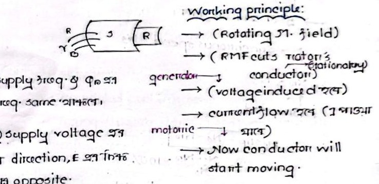
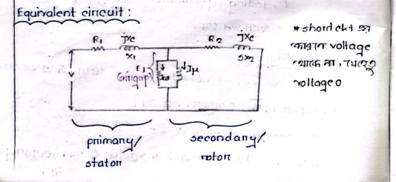
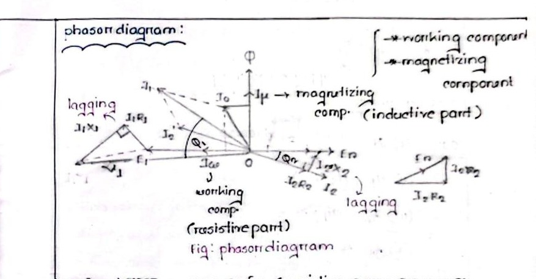

# Class 05: RMF Conditions, Slip, Equivalent Circuit & Phasor Diagram

> **Date**: 07.07.2026 / 08.07.2026 | **Instructor**: Fariya Tabassum (FT Mam)  
> **Source Scan Pages**: P10_R, P11 (Left/Right), P12 (Left/Right)  
> [← Previous Class: Class 04](Class_04_Rotating_Magnetic_Field_RMF_Proof.md) | [📚 Index](00_Index_and_Topic_Map.md) | [Next Class: Class 06 →](Class_06_Slip_Rotor_Frequency_and_Transformer_Analogy.md)

---

## 1. Conditions for Rotating Magnetic Field (RMF)

<!-- Page 10_R -->

- **Two-Phase System**:
  $$\Phi_r = \Phi_m, \quad \text{Speed} = N_{sync}$$
- **Three-Phase System**:
  $$\Phi_r = \frac{3}{2}\Phi_m = 1.5\,\Phi_m, \quad \text{Speed} = N_{sync}$$
- **Synchronous Meaning**:
  > **Speed Determination**: The stator supply frequency ($f$) and the number of stator poles ($P$) strictly determine the output synchronous rotational speed ($N_s = 120f/P$).

---

## 2. Step-by-Step Working Principle of Induction Motor

$$\begin{aligned}
\text{Stator AC Supply} &\longrightarrow \text{Rotating Magnetic Field (RMF) generated} \\
&\longrightarrow \text{RMF cuts stationary rotor conductors} \\
\text{\textbf{[Generator Action]}} &\longrightarrow \text{Voltage is induced in rotor conductors } (E_r) \\
&\longrightarrow \text{Rotor circuit is closed/shorted, hence current flows } (I_r) \\
\text{\textbf{[Motor Action]}} &\longrightarrow \text{Current-carrying conductors in magnetic field experience Lorentz force } (\mathbf{F} = I(\mathbf{l} \times \mathbf{B})) \\
&\longrightarrow \text{Rotor develops mechanical torque and rotates in the direction of RMF!}
\end{aligned}$$

- **Frequency Synchronism**: The supply electrical frequency and the rotational frequency of the RMF are identical.
- **Back EMF & Terminal Voltage**:
  $$V_1 = V_s - [E_b]$$
  - The applied supply voltage and the induced counter-EMF ($E_b$) oppose each other in accordance with Lenz's Law.

> [!IMPORTANT]
> **Why Do We Need a Starter?**
> At standstill ($N_r = 0$), there is **no initial back-EMF** ($E_b = 0$).  
> The armature/rotor winding resistance of any practical electrical machine is exceedingly small ($R < 1\,\Omega$).  
> Applying direct line voltage at standstill produces a dangerously high inrush current ($5 - 7 \times I_{fl}$) that can destroy the winding insulation. Hence, an external **Starter** is mandatory to limit starting current.

---

## 3. Direction of Rotation & Slip

<!-- Page 11_L & 11_R -->

- **Direction of Rotation**:
  > **Direction of Rotation**: In accordance with Lenz's Law, the induced rotor currents exert a torque that attempts to reduce the relative velocity between rotor conductors and stator field; hence the rotor accelerates in the same direction as the RMF ($\Phi_r$).
- **Speed Relationship**:
  $$\text{Rotor speed } (N_r) < \text{Synchronous speed } (N_s)$$
  *(If the rotor ever reached synchronous speed, $N_r = N_s$, relative motion would become zero, no flux would be cut, induced EMF and current would vanish, and driving torque would drop to zero. Thus, an induction motor must always run slower than synchronous speed: $N_r < N_s$).*

### Mathematical Definition of Slip:
$$\boxed{s = \frac{N_s - N_r}{N_s}} \quad \text{or} \quad s = \frac{N_s - N_r}{N_s} \times 100\%$$
$$\boxed{N_r = N_s(1 - s)}$$

- **At Standstill ($N_r = 0$, motor at rest / starting moment)**:
  $$N_r = 0 \implies s = \frac{N_s - 0}{N_s} = 1$$
- **At Synchronous Speed ($N_r = N_s$, theoretical limit)**:
  $$N_r = N_s \implies s = 0$$
- **Normal Running Range**:
  - For standard motoring operation, the operating slip lies within $0 < s < 1$ (typical rated full-load slip is $s \approx 0.02 - 0.05$ or $2\% - 5\%$).

---

## 4. Need for Equivalent Circuit & Phasors

<!-- Page 11_R & Page 12_L -->

- **Why is an Equivalent Circuit Required?**
  1. To calculate and analyze machine operating performance and load characteristics.
  2. To determine machine internal parameters from standardized test data.
- **Phasor Definition**:
  - A phasor is a complex vector representation used to analyze single-frequency **sinusoidal** AC circuits algebraically.
- **Why Sine and Cosine? (Harmonics Analysis)**:
  - According to Fourier theorem, any non-sinusoidal periodic waveform can be decomposed into an infinite series of sinusoidal harmonic components:
    $$f(t) = A_0 + \sum_{n=1}^\infty A_n \sin(n\omega t + \phi_n)$$
  - $1^{\text{st}}$ Harmonic (Fundamental): $A_m \sin\omega t$
  - $3^{\text{rd}}$ Harmonic: $\frac{A_m}{3} \sin 3\omega t$
  - $5^{\text{th}}$ Harmonic: $\frac{A_m}{5} \sin 5\omega t$
  - **System Impact**: The $3^{\text{rd}}$ harmonic causes waveform distortion and is the principal cause of core humming noise in transformers.

---

## 5. Induction Motor Equivalent Circuit & Phasor Diagram

<!-- Page 12_L & Page 12_R -->

### Equivalent Circuit Parameters:
- **Primary / Stator Side**:
  - $R_1$: Stator winding resistance
  - $X_1$: Stator leakage reactance
- **Air-Gap / Magnetizing Branch**:
  - $R_c$: Core loss resistance (drawing working component current $I_w$)
  - $X_m$: Magnetizing reactance (drawing magnetizing component current $I_\mu$)
- **Secondary / Rotor Side**:
  - $R_2$: Rotor resistance
  - $s X_2$: Rotor reactance at slip $s$
  - Short-circuit: Rotor bars are shorted by end rings, so terminal voltage is zero.

### Phasor Diagram Analysis:
- **No-load Current ($I_0$)**:
  $$\mathbf{I}_0 = \mathbf{I}_w + \mathbf{I}_\mu$$
  - $I_w$: **Working component** (resistive / core loss part, in-phase with voltage).
  - $I_\mu$: **Magnetizing component** (inductive part, lagging voltage by $90^\circ$, in-phase with flux $\Phi$).
  - **In Induction Motors**: The presence of the physical air gap demands a much higher magnetizing current ($I_\mu \gg I_w$, typically $30\% - 40\%$ of rated current), resulting in a very low no-load power factor ($\cos\phi_0 \approx 0.1 - 0.2$ lagging).
- **Transformation Ratio & Current Relations**:
  $$I_2' = \frac{I_2}{a}$$
  - Primary (stator): Higher voltage, lower current ($I_2'$ is smaller).
  - Secondary (rotor): Lower voltage, higher current ($I_2$ is larger).

---

[← Previous Class: Class 04](Class_04_Rotating_Magnetic_Field_RMF_Proof.md) | [📚 Back to Index](00_Index_and_Topic_Map.md) | [Next Class: Class 06 →](Class_06_Slip_Rotor_Frequency_and_Transformer_Analogy.md)
