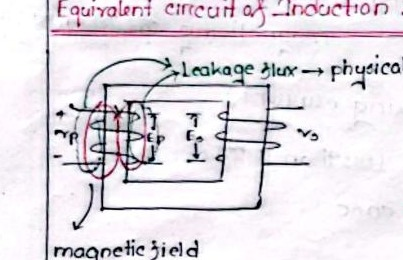
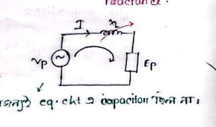

# Class 06: Slip, Rotor Frequency, Leakage Reactance & Transformer Analogy

> **Instructor**: Fariya Tabassum (FT Mam)  
> **Source Scan Pages**: P13 (Left/Right), P14_L  
> [ Previous Class: Class 05](Class_05_RMF_Conditions_and_IM_Phasor_Diagram.md) | [ Index](00_Index_and_Topic_Map.md) | [Next Class: Class 07 ](Class_07_Rotor_Torque_Equation_Derivation.md)

---

## 1. Rotor Frequency and Slip Formulation

<!-- Page 13_L -->

When the rotor is rotating at speed $N_r$, the relative speed between the rotating magnetic field ($N_s$) and the rotor conductors is $(N_s - N_r)$. Hence, the frequency of the induced EMF in the rotor ($f_r$) is directly proportional to this slip speed:

$$\boxed{f_r = s \cdot f_s}$$
- $f_r$: Rotor frequency
- $f_s$: Supply (stator) frequency
- $s$: Fractional slip ($\frac{N_s - N_r}{N_s}$)

### Numerical Calculation Example:
For a 4-pole, $50\text{ Hz}$ machine:
1. **Synchronous Speed**:
   $$N_s = \frac{120 \cdot f_s}{P} = \frac{120 \times 50}{4} = 1500\text{ rpm}$$
2. **Rotor Speed**:
   $$N_r = N_s (1 - s)$$
3. **Rotor Frequency under Running Condition**:
   $$f_r = s \cdot f_s$$
4. **At Standstill / Starting Moment ($s = 1$)**:
   $$f_r = 1 \cdot f_s = 50\text{ Hz}$$
   *(At standstill, $s = 1$, so the rotor frequency equals the stator line frequency: $f_r = f_s$).*

---

## 2. Physical Origin of Leakage Reactance

<!-- Page 13_L (bot) -->



- **Flux and Voltage**:
  > **Flux & Induced Voltage**: As magnetic flux linkage increases, the induced EMF ($E$) increases proportionally in accordance with Faraday's Law ($E \propto \Phi$).
- **Leakage Flux as a Physical Phenomenon**:
  - The magnetic flux that fails to link both windings through the core and instead completes its magnetic circuit through the surrounding air or insulation is termed **Leakage Flux** ($\Phi_l$).
  - The inductive voltage drop caused by this leakage flux is modeled in the equivalent circuit as a series **Leakage Reactance** ($X_L$).



$$\mathbf{V}_p = \mathbf{E}_p + \mathbf{I}_p R_p + j \mathbf{I}_p X_{Lp}$$
*(The terminal supply voltage $V_p$ minus the internal impedance drops across winding resistance and leakage reactance equals the induced counter-EMF $E_p$)*
- **Note**: The machine winding model contains no capacitive elements; it consists strictly of ohmic resistance $R$ and inductive reactance $X_L$.

---

## 3. Practical Transformer and Machine Construction Insights

<!-- Page 13_R -->

- **Rotor Side Short-Circuit**:
  > **Squirrel-Cage Construction**: The rotor bars are permanently short-circuited at both axial ends by heavy conducting end-rings; hence, no external electrical connection or supply can be applied directly to the rotor conductors.
- **Voltage Transformation**:
  $$\text{Step-up Transformer: } V_2 = a \cdot V_1$$
- **Efficiency and Leakage**:
  - No practical transformer or motor is $100\%$ efficient.
  - Inherent leakage flux is always present; in induction motors, the presence of the physical air gap produces significantly higher leakage compared to closed-core transformers.
- **Winding Placement & Safety**:
  - **High Voltage Winding**: Placed on the outer layer (facilitating clearance, cooling, and insulation from the grounded core).
  - **Low Voltage Winding**: Placed directly adjacent to the iron core (minimizing insulation requirements against the core body).
  - Robust dielectric **varnishing and solid barrier insulation** separate the concentric windings.
- **Magnetic Circuit Analogy**:
  - **Reluctance ($\mathcal{R}$)**: The opposition offered by a magnetic circuit to the establishment of magnetic flux ($\mathcal{R} = l / (\mu A)$).
  - **Permeance ($\mathcal{P}$)**: The magnetic analogue to electrical conductance ($\mathcal{P} = 1 / \mathcal{R}$).

---

## 4. Operational Modes of Induction Machines

<!-- Page 14_L -->

```text
Induction Machine Modes
 (1) Motoring Mode    (0 < s < 1,  0 < Nr < Ns)
 (2) Generating Mode  (s < 0,      Nr > Ns)
 (3) Braking Mode     (s > 1,      Rotor rotating opposite to RMF)
```

- **Fundamental Operational Questions**:
  1. **Starting**: How to start the motor safely against high inrush current?
  2. **Speed Control**: How to modulate running speed efficiently?
  3. **Stopping / Braking**: How to achieve fast, controlled electric stopping?

---

[ Previous Class: Class 05](Class_05_RMF_Conditions_and_IM_Phasor_Diagram.md) | [ Back to Index](00_Index_and_Topic_Map.md) | [Next Class: Class 07 ](Class_07_Rotor_Torque_Equation_Derivation.md)
