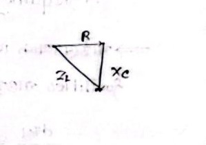

# Class 07: Rotor Torque Equation Derivation & Maximum Starting Torque Condition

> **Date**: 14.07.2026 | **Instructor**: Fariya Tabassum (FT Mam)  
> **Source Scan Pages**: P14_R, P15_L  
> [← Previous Class: Class 06](Class_06_Slip_Rotor_Frequency_and_Transformer_Analogy.md) | [📚 Index](00_Index_and_Topic_Map.md) | [Next Class: Class 08 →](Class_08_Maximum_Torque_and_Torque_Slip_Curve.md)

---

## 1. Rotor Torque Proportionality

<!-- Page 14_R -->

The electromagnetic torque ($T$) developed by an induction motor depends on three fundamental factors:
1. Rotor EMF ($E_2$ or $E_r$)
2. Rotor Current ($I_2$ or $I_r$)
3. Rotor Power Factor ($\cos\phi_2$)

$$\boxed{T \propto E_2 \cdot I_2 \cdot \cos\phi_2}$$

- **Power Factor Considerations**:
  - $\phi_2$: Angle between rotor induced voltage and rotor current.
  - $\phi_2 \rightarrow 0 \implies \cos\phi_2 \rightarrow 1$ (Unity power factor).
  - In purely resistive circuits, the power factor achieves its theoretical maximum ($\cos\phi = 1$).
  - **Power factor improves with increased resistance**: Adding external rotor resistance shifts the rotor current closer into phase with induced rotor EMF, improving the rotor power factor $\cos\phi_2$ and dramatically boosting starting torque.

---

## 2. Derivation of Starting Torque ($T_{st}$)

At standstill ($s = 1$), let per-phase standstill rotor parameters be:
- $E_2$: Standstill induced EMF per phase
- $R_2$: Standstill rotor resistance per phase
- $X_2 = 2\pi f_s L_2$: Standstill rotor reactance per phase

### Rotor Circuit Equations:
1. **Rotor Impedance per Phase**:
   $$Z_2 = \sqrt{R_2^2 + X_2^2}$$
2. **Rotor Current per Phase**:
   $$I_2 = \frac{E_2}{Z_2} = \frac{E_2}{\sqrt{R_2^2 + X_2^2}}$$
3. **Rotor Power Factor**:
   $$\cos\phi_2 = \frac{R_2}{Z_2} = \frac{R_2}{\sqrt{R_2^2 + X_2^2}}$$

### Torque Formulation:
$$T_{st} \propto E_2 \cdot \left(\frac{E_2}{\sqrt{R_2^2 + X_2^2}}\right) \cdot \left(\frac{R_2}{\sqrt{R_2^2 + X_2^2}}\right)$$
$$\boxed{T_{st} = k_1 \cdot \frac{E_2^2 R_2}{R_2^2 + X_2^2}}$$

Where the constant of proportionality $k_1$ is:
$$k_1 = \frac{3}{2\pi N_s}$$
*(for a 3-phase machine, where $N_s$ is synchronous speed in rps)*.

> [!NOTE]
> **Constant Supply Voltage Simplification**
> For a given motor connected to a constant supply voltage, the standstill induced voltage $E_2$ is constant ($E_2 = \text{constant}$):
> $$T_{st} = k_2 \cdot \frac{R_2}{R_2^2 + X_2^2}$$

---

## 3. Condition for Maximum Starting Torque

<!-- Page 15_L -->

### Under What Condition Does an Induction Motor Develop Maximum Starting Torque?

### Why Differentiate with respect to $R_2$?
- **Standstill Reactance ($X_2$) is Constant**: Because supply voltage frequency is fixed ($X_2 = 2\pi f_s L_2$).
- **Rotor Resistance ($R_2$) is Variable**: In slip-ring (wound-rotor) induction motors, external resistance can easily be inserted into the rotor circuit to modulate total rotor resistance.

To find the value of $R_2$ that maximizes $T_{st}$, set $\frac{d T_{st}}{d R_2} = 0$:

$$\frac{d T_{st}}{d R_2} = k_2 \left[ \frac{(R_2^2 + X_2^2)(1) - R_2(2 R_2)}{(R_2^2 + X_2^2)^2} \right] = 0$$

$$\implies R_2^2 + X_2^2 - 2 R_2^2 = 0$$
$$\implies X_2^2 - R_2^2 = 0$$
$$\boxed{R_2 = X_2}$$

> [!IMPORTANT]
> **Maximum Starting Torque Criterion**
> Starting torque achieves its absolute maximum when **rotor resistance per phase equals standstill rotor leakage reactance per phase** ($R_2 = X_2$).  
> *(Note: Rotor inductance given in Henry must always be converted to Ohms ($\Omega$) via $X_2 = 2\pi f_s L_2$ before evaluating the condition)*.

---

[← Previous Class: Class 06](Class_06_Slip_Rotor_Frequency_and_Transformer_Analogy.md) | [📚 Back to Index](00_Index_and_Topic_Map.md) | [Next Class: Class 08 →](Class_08_Maximum_Torque_and_Torque_Slip_Curve.md)
