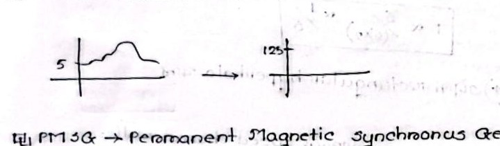

# Class 08: Running Torque, Maximum Breakdown Torque & Torque-Slip Curve

> **Date**: 20.07.2026 | **Instructor**: Fariya Tabassum (FT Mam)  
> **Source Scan Pages**: P15_R, P16 (Left/Right), P17_L  
> [← Previous Class: Class 07](Class_07_Rotor_Torque_Equation_Derivation.md) | [📚 Index](00_Index_and_Topic_Map.md) | [Next Class: Class 09 →](Class_09_Induction_Motor_Testing.md)

---

## 1. Running Torque Formulation ($T_r$)

<!-- Page 15_R -->

Under running condition at fractional slip $s$:
- Rotor Induced EMF per phase: $E_r = s E_2$
- Rotor Reactance per phase: $X_r = s X_2$
- Rotor Impedance per phase: $Z_r = \sqrt{R_2^2 + (s X_2)^2}$
- Rotor Current per phase:
  $$I_r = \frac{E_r}{Z_r} = \frac{s E_2}{\sqrt{R_2^2 + (s X_2)^2}}$$
- Rotor Power Factor:
  $$\cos\phi_r = \frac{R_2}{Z_r} = \frac{R_2}{\sqrt{R_2^2 + (s X_2)^2}}$$

Since $T_r \propto E_r \cdot I_r \cdot \cos\phi_r$:
$$\boxed{T_r = k_1 \cdot \frac{s \cdot E_2^2 \cdot R_2}{R_2^2 + (s X_2)^2}}$$
*(where $k_1 = \frac{3}{2\pi N_s}$)*.

---

## 2. Condition for Maximum Running Torque ($T_{max}$)

<!-- Page 16_L -->

To find the maximum running torque condition, the running torque equation is differentiated with respect to slip ($s$) and set to zero:
$$\frac{d T_r}{d s} = 0$$
- **Why differentiate w.r.t slip $s$?**
  - In normal running operation, any external starting resistance is cut out ($R_2$ remains constant).
  - Because the coil geometry and winding structure are fixed, the standstill inductance and reactance ($X_2$) remain constant.
  - Slip $s$ is the only parameter that varies dynamically with mechanical load variations.

Differentiating $T_r$ with respect to $s$ and equating to zero yields:
$$\boxed{R_2 = s \cdot X_2} \quad \implies \quad \boxed{s_{max} = \frac{R_2}{X_2}}$$

### Substituting $s_{max} = \frac{R_2}{X_2}$ into the Torque Equation:
$$T_{max} = k_1 \cdot \frac{\left(\frac{R_2}{X_2}\right) E_2^2 R_2}{R_2^2 + \left(\frac{R_2}{X_2} X_2\right)^2} = k_1 \cdot \frac{E_2^2 \frac{R_2^2}{X_2}}{2 R_2^2} = \boxed{\frac{k_1 E_2^2}{2 X_2}}$$

> [!IMPORTANT]
> **Crucial Conclusions for $T_{max}$**
> 1. **Independence of $R_2$**: There is no $R_2$ term in the $T_{max}$ equation! Thus, **maximum breakdown torque does not depend on rotor resistance**.
> 2. **Shift of Operating Slip**: Increasing $R_2$ keeps the peak torque value identical, but the maximum torque **shifts to a higher operating slip ($s_{max} \uparrow$)**.
> 3. **Standstill Reactance Dependence**: $T_{max}$ is inversely proportional to standstill reactance ($T_{max} \propto \frac{1}{2 X_2}$); hence, rotor reactance should be kept as low as possible.
> 4. **Voltage Sensitivity**: Since $E_2 \propto V$ (applied stator terminal voltage):
>    $$\boxed{T_{max} \propto V^2}$$
>    *(A slight dip in stator voltage causes a severe quadratic drop in maximum torque)*.

---

## 3. Practical Machine Technologies & Modern Applications

<!-- Page 16_R -->



- **Wind Turbine Cubic Relation**: Wind aerodynamic power $P \propto v^3$ (proportional to the cube of wind velocity).
- **DFIG (Doubly-Fed Induction Generator)**:
  - Extensively deployed in modern wind turbine power generation.
  - Allows variable-speed wind operation by controlling rotor frequency via back-to-back converters to inject a rock-solid, synchronized $50\text{ Hz}$ supply into the grid.
- **PMSG (Permanent Magnet Synchronous Generator)**: High efficiency, direct-drive wind turbines without gearboxes.
- **EV (Electric Vehicles)**: High-torque induction motors and permanent magnet brushless motors are widely adopted.

---

## 4. Torque-Slip and Torque-Speed Characteristics

<!-- Page 17_L -->

$$T = \frac{k \cdot s \cdot E_2^2 R_2}{R_2^2 + (s X_2)^2}$$

### A. Low-Slip Region (Normal Stable Operating Range: $s \approx 0$ to $s_{max}$)
- Near synchronous speed, $s$ is very small, so $(s X_2)^2 \ll R_2^2$ (reactance term is negligible):
  $$T \approx k \cdot \frac{s E_2^2 R_2}{R_2^2} \propto \frac{s}{R_2}$$
- **Behavior**: $T \propto s$ $\longrightarrow$ **Linear region** (torque is directly proportional to slip).

### B. High-Slip Region (Unstable Braking / Breakdown Range: $s_{max}$ to $s = 1$)
- Near standstill, $s$ is large, so $(s X_2)^2 \gg R_2^2$ (resistance term is negligible):
  $$T \approx k \cdot \frac{s E_2^2 R_2}{(s X_2)^2} \propto \frac{1}{s}$$
- **Behavior**: $T \propto \frac{1}{s}$ $\longrightarrow$ **Rectangular Hyperbola** (torque drops rapidly with increasing slip).

```text
Torque (T)
   ^               T_max (Pull-out Torque)
   |                  /\
   |                 /  \
   |  (Linear)      /    \  (Rectangular Hyperbola)
   |    T ∝ s      /      \   T ∝ 1/s
   |              /        \
   |             /          \____ T_st (Starting Torque at s=1)
   |            /
   +-----------+---------------------> Slip (s)
   s=0       s_max                  s=1
 (Synchronous)                    (Standstill)
```

> [!TIP]
> **Torque-Speed as a Mirror Image**
> Since $N_r = N_s(1 - s)$, higher slip corresponds to lower rotor mechanical speed ($N_r$).  
> Therefore, the **Torque-Speed curve** is the exact **Mirror Image** of the Torque-Slip curve along the speed axis!

---

[← Previous Class: Class 07](Class_07_Rotor_Torque_Equation_Derivation.md) | [📚 Back to Index](00_Index_and_Topic_Map.md) | [Next Class: Class 09 →](Class_09_Induction_Motor_Testing.md)
