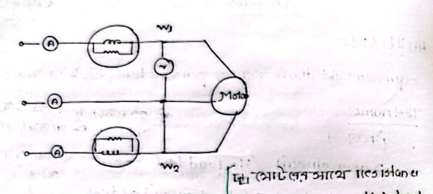
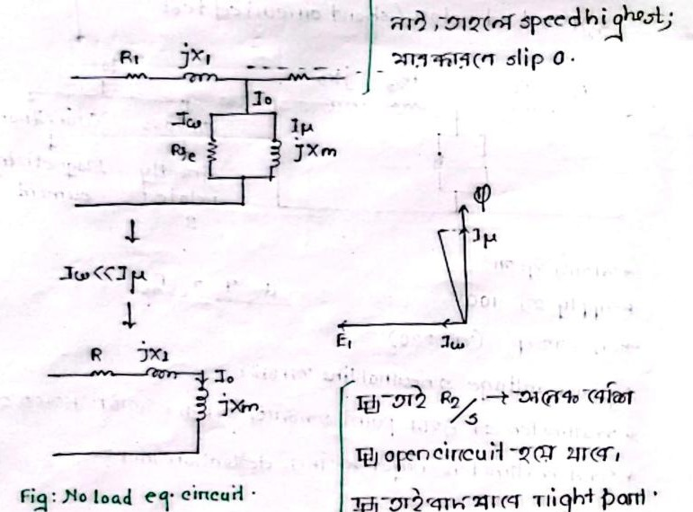
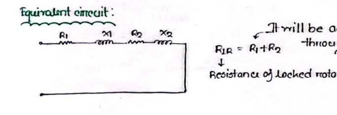

# Class 09: Induction Motor Testing — No-Load, Blocked Rotor & DC Tests

> **Date**: 21.07.2026 / 22.07.2026 | **Instructor**: Fariya Tabassum (FT Mam)  
> **Source Scan Pages**: P17_R, P18 (Left/Right), P19_L  
> [← Previous Class: Class 08](Class_08_Maximum_Torque_and_Torque_Slip_Curve.md) | [📚 Index](00_Index_and_Topic_Map.md) | [Next Class: Class 10 →](Class_10_Power_Stages_and_Efficiency.md)

---

## 1. Overview and Purpose of Testing

<!-- Page 17_R -->

The primary objective of induction motor testing is to experimentally determine the essential parameters of the per-phase equivalent circuit ($R_1, X_1, R_2, X_2, X_m, R_c$):

$$\text{Parameter Determination} \longrightarrow X_1, R_1, X_2, R_2, X_m$$

```text
The Three Interdependent Tests
├── 1. No-Load Test (Open-Circuit Test)      ──> Core loss, friction/windage loss, X_m
├── 2. Blocked-Rotor Test (Short-Circuit)    ──> Equivalent leakage reactance (X_1 + X_2), (R_1 + R_2)
└── 3. DC Resistance Test                   ──> Stator per-phase winding resistance R_1
```

> [!WARNING]
> **Interdependence Rule**
> **No single test can independently determine all circuit parameters.**  
> All three tests must be performed systematically and their results combined.

- **Grid and Voltage Ratings**:
  - Industrial and commercial 3-phase supply: $V_L = 400\text{ V}$ (Line-to-Line).
  - Residential single-phase voltage: $V_p = \frac{V_L}{\sqrt{3}} = \frac{400}{\sqrt{3}} \approx 230\text{ V}$ (Phase-to-Neutral).

---

## 2. No-Load (Open Circuit) Test

<!-- Page 18_L -->



- **Test Condition**:
  - No mechanical load is coupled to the motor shaft ($\text{Load} = 0$).
  - The rotor accelerates to near-synchronous speed ($N_r \approx N_s$).
  - Consequently, slip is extremely small / near zero:
    $$s \approx 0 \implies \frac{R_2}{s} \longrightarrow \infty$$



### Circuit Simplification:
- Since $\frac{R_2}{s} \approx \infty$, the parallel rotor branch acts virtually as an **Open Circuit**.
- Furthermore, $I_w \ll I_\mu$ (the wide air-gap requires a dominant magnetizing current).
- Therefore, the total input power measured by wattmeters comprises:
  $$\boxed{P_{NL} = 3 I_{NL}^2 R_1 + P_{core} + P_{w,f}}$$
  *(Stator copper loss + Core iron loss + Friction and windage losses)*.

---

## 3. Blocked Rotor (Locked Rotor) Test

<!-- Page 18_R -->

- **Test Condition**:
  - The rotor is mechanically clamped/locked so that it cannot rotate:
    $$N_r = 0 \implies s = \frac{N_s - 0}{N_s} = 1$$
  - A **very low reduced voltage** ($10-15\%$ of rated voltage) is applied to the stator to circulate rated full-load current.



### Circuit Simplification:
- Since $s = 1$, the effective rotor resistance is $\frac{R_2}{s} = R_2$ (which is very small).
- Due to the drastically reduced applied voltage, current through the parallel magnetizing branch ($X_m, R_c$) is negligible ($I_0 \approx 0$).
- The entire network simplifies into a simple series circuit:
  $$Z_{BL} = \frac{V_{BL} / \sqrt{3}}{I_{BL}}$$
  $$R_{BL} = R_1 + R_2 = \frac{P_{BL}}{3 I_{BL}^2}$$
  $$X_{BL} = X_1 + X_2 = \sqrt{Z_{BL}^2 - R_{BL}^2}$$
  *(Typically divided equally: $X_1 = X_2 = 0.5 X_{BL}$)*.

---

## 4. DC Stator Resistance Test

<!-- Page 19_L -->

When DC is applied to an inductive coil, the inductive reactance drops to zero ($\omega = 0 \implies X_L = 0$). The inductor behaves as a pure short circuit, leaving only the pure ohmic resistance effective:

$$R_{DC} = \frac{V_{DC}}{I_{DC}}$$
*(Total DC resistance measured between any two line terminals)*.

### Relation Between $R_{DC}$ and Per-Phase Stator Resistance ($R_1$):

1. **For Wye / Star (Y) Connected Stator**:
   Two phase windings are connected in series:
   $$R_{DC} = 2 R_1 \implies \boxed{R_1(\text{wye}) = \frac{R_{DC}}{2}}$$

2. **For Delta ($\Delta$) Connected Stator**:
   One phase winding is connected in parallel with the series combination of the other two phases:
   $$R_{DC} = R_1 \parallel (R_1 + R_1) = \frac{R_1 \cdot 2 R_1}{3 R_1} = \frac{2}{3} R_1$$
   $$\implies \boxed{R_1(\Delta) = 1.5 \cdot R_{DC}}$$

> [!TIP]
> **AC Skin Effect Correction**
> Due to the AC skin effect and non-uniform current distribution, the effective AC resistance is slightly higher than the measured DC resistance:
> $$R_{1(AC)} \approx (1.2 - 1.4) \cdot R_{1(DC)}$$

---

[← Previous Class: Class 08](Class_08_Maximum_Torque_and_Torque_Slip_Curve.md) | [📚 Back to Index](00_Index_and_Topic_Map.md) | [Next Class: Class 10 →](Class_10_Power_Stages_and_Efficiency.md)
