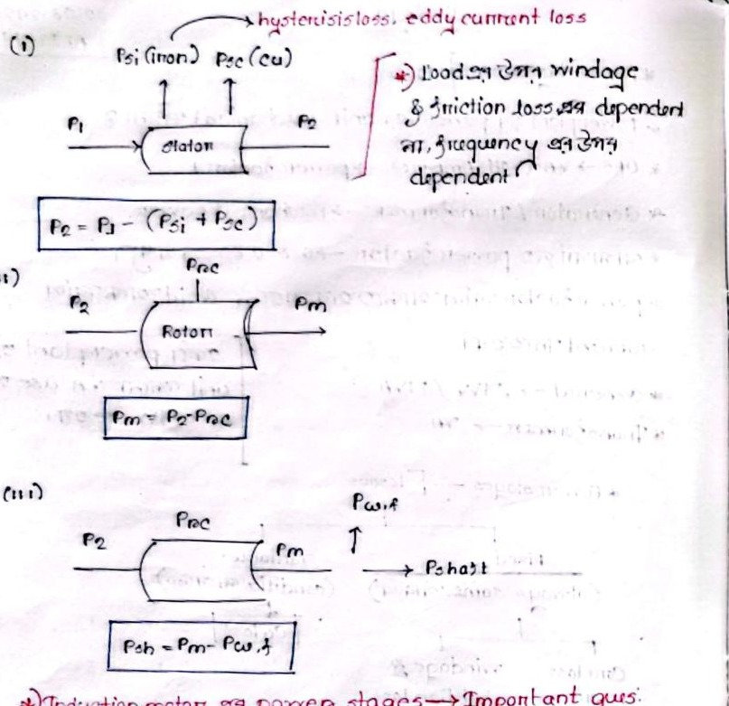

# Class 10: Induction Motor Power Flow Stages, Power Ratios & Efficiency

> **Date**: 05.08.2026 | **Instructor**: Fariya Tabassum (FT Mam)  
> **Source Scan Pages**: P19_R, P20 (Left/Right)  
> [← Previous Class: Class 09](Class_09_Induction_Motor_Testing.md) | [📚 Index](00_Index_and_Topic_Map.md) | [Next Class: Class 11 →](Class_11_Induction_Motor_Starting_Methods.md)

---

## 1. Classification of Losses & Power Ratings

<!-- Page 19_R -->

```text
Machine Losses
├── Fixed Losses (Always Constant)
│    ├── Core Loss / Iron Loss (Hysteresis + Eddy Current)
│    └── Windage & Friction Loss (Speed-dependent, fixed for rated speed)
└── Variable Losses
     └── Copper Loss (I^2 * R, directly dependent on load current)
```

- **Power Units & Industrial Ratings**:
  - **Generator / Power Plant**: Rated in **MW** (real active power) or **MVA**.
  - **Transformer**: Rated in **kVA / MVA** (because heating depends on $V$ and $I$ regardless of power factor).
  - **UPS**: Rated in **VA**.
  - **Residential Power Factor**: Typical residential loads operate with a power factor between $0.80 - 0.85$ lagging.
  - **Power Factor Maintenance**: The closer the power factor is kept to unity ($\to 1$), the less reactive current is drawn from the grid, significantly reducing transmission line losses.

---

## 2. The Three Stages of Induction Motor Power Flow

<!-- Page 20_L -->



### Stage 1: Stator Input to Rotor Airgap ($P_1 \longrightarrow P_2$)
- Total 3-phase electrical input power:
  $$P_1 = \sqrt{3} V_L I_L \cos\theta$$
- Stator losses:
  - Stator core loss: $P_{si}$
  - Stator copper loss: $P_{sc} = 3 I_1^2 R_1$
- **Rotor Input Power (Air-gap Power, $P_2$)**:
  $$\boxed{P_2 = P_1 - (P_{si} + P_{sc})}$$

### Stage 2: Rotor Input to Mechanical Power Developed ($P_2 \longrightarrow P_m$)
- Rotor losses:
  - Rotor copper loss: $P_{rc} = 3 I_2^2 R_2$
- **Gross Mechanical Power Developed ($P_m$)**:
  $$\boxed{P_m = P_2 - P_{rc}}$$

### Stage 3: Mechanical Power to Shaft Output ($P_m \longrightarrow P_{sh}$)
- Mechanical rotational losses:
  - Friction and windage loss: $P_{w,f}$
- **Net Shaft Output Power ($P_{sh}$ / Useful Power)**:
  $$\boxed{P_{sh} = P_m - P_{w,f}}$$

> [!NOTE]
> **Friction & Windage Loss Characteristic**
> Friction and windage losses do not vary with shaft load fluctuations; they depend strictly on the rotor rotational speed and supply frequency.

---

## 3. Fundamental Power Ratio Proof: $1 : (1-s) : s$

<!-- Page 20_L (bot) & Page 20_R -->

This is one of the most critical exam derivations in Induction Motor theory:

$$\begin{aligned}
\text{Rotor Input Power } (P_2) &= \frac{2\pi N_s}{60} \cdot T \\
\text{Mechanical Power Developed } (P_m) &= \frac{2\pi N_r}{60} \cdot T
\end{aligned}$$

Dividing $P_m$ by $P_2$:
$$\frac{P_m}{P_2} = \frac{N_r}{N_s} = \frac{N_s(1 - s)}{N_s} = 1 - s$$
$$\boxed{P_m = (1 - s) P_2}$$

Now calculating Rotor Copper Loss ($P_{rc}$):
$$P_{rc} = P_2 - P_m = P_2 - (1 - s)P_2 = s P_2$$
$$\boxed{P_{rc} = s \cdot P_2}$$

### The Universal Power Proportion:
$$\boxed{P_2 : P_m : P_{rc} = 1 : (1 - s) : s}$$

$$\text{Rotor Input } (P_2) : \text{Mechanical Output } (P_m) : \text{Rotor Copper Loss } (P_{rc})$$

---

## 4. Mechanical Torque & Synchronous Watt Concept

<!-- Page 20_R -->

- **Gross Mechanical Torque Developed ($T_m$)**:
  $$T_m = \frac{P_m}{\omega_r} = \frac{P_m}{2\pi N_r / 60} = \frac{(1 - s)P_2}{(1 - s)\omega_s} = \frac{P_2}{\omega_s}$$
- **Shaft Useful Torque ($T_{sh}$)**:
  $$T_{sh} = \frac{P_{sh}}{2\pi N_r / 60}$$

### Synchronous Watt:
> **Concept**: Synchronous Watt is a practical and convenient unit for expressing the developed mechanical torque of an induction motor.
- **Definition**: It is defined as the torque that would develop $1\text{ Watt}$ of mechanical power if the rotor were rotating at synchronous speed ($N_s$).
- **Equivalence**:
  $$\text{Torque in Synchronous Watts} = \text{Rotor Input Power } (P_2 \text{ in Watts})$$

---

## 5. Modern Power Systems: Smart Grid & Prosumers

<!-- Page 20_R (bot) -->

- **Producer vs Consumer vs Prosumer**:
  - **Prosumer**: An entity that simultaneously generates electricity (e.g., via rooftop solar PV) and consumes electricity from the utility grid.
  - **Peer-to-Peer Energy Trading**:
    - **Blockchain**: Employed to ensure decentralized, transparent, and secure peer-to-peer energy transactions.
    - **Game Theory**: Applied for optimal real-time pricing and strategic bidding in dynamic microgrid energy markets.

---

[← Previous Class: Class 09](Class_09_Induction_Motor_Testing.md) | [📚 Back to Index](00_Index_and_Topic_Map.md) | [Next Class: Class 11 →](Class_11_Induction_Motor_Starting_Methods.md)
