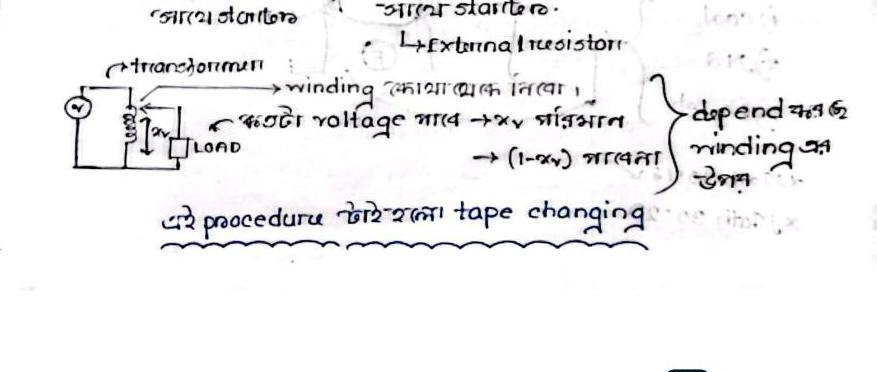

# Class 11: Induction Motor Starting Methods & Starting Current / Torque Formulations

> **Date**: 09.08.2026 | **Instructor**: Fariya Tabassum (FT Mam)  
> **Source Scan Pages**: P21_L, P21_R  
> [← Previous Class: Class 10](Class_10_Power_Stages_and_Efficiency.md) | [📚 Index](00_Index_and_Topic_Map.md) | [Next Class: Class 12 →](Class_12_Speed_Control_and_Electric_Braking.md)

---

## 1. The Starting Problem: Inrush Current

<!-- Page 21_L -->

### Why is Direct-On-Line (DOL) Starting Hazardous for Induction Motors?

1. **Absence of Back EMF**: At standstill ($N_r = 0, s = 1$), there is no induced back-EMF ($E_b = 0$) to oppose the applied voltage.
2. **Low Stator & Rotor Resistance**: The winding impedance is extremely small ($< 1\,\Omega$).
3. **Severe Inrush Current**: The motor draws an enormous surge current of about $5 - 7$ times its rated full-load current ($I_{st} \approx 5 - 7 I_{fl}$).
4. **Thermal and Grid Hazards**: This tremendous inrush current causes severe $I^2 R$ heating, risking winding insulation burn-out, and causes a large voltage dip across the local power distribution network.

> [!IMPORTANT]
> **Starter Function**
> A **Starter** is essentially a protective device (resistor bank, auto-transformer, or reactor/solid-state controller) that limits the starting voltage or current to a safe, acceptable level.

---

## 2. Derivation of Torque Ratio: $\frac{T_{st}}{T_f}$

We know from Class 10 power stage relations:
$$\text{Rotor Input Power } (P_2) = 2\pi N_s T$$
$$\text{Rotor Copper Loss } (P_{rc}) = s \cdot P_2 = 3 I_2^2 R_2$$

Equating the two expressions:
$$3 I_2^2 R_2 = s \cdot (2\pi N_s T) \implies T \propto \frac{I_2^2}{s}$$

Since rotor current is proportional to stator line current ($I_2 \propto I_1$):
$$T \propto \frac{I_1^2}{s} \implies T = k \cdot \frac{I_1^2}{s}$$

### Comparing Starting Torque to Full-Load Torque:
- **At Full Load**: Current is $I_f$, Slip is $s_f$:
  $$T_f = k \cdot \frac{I_f^2}{s_f}$$
- **At Starting Moment**: Current is $I_{st} = I_{sc}$, Slip is $s = 1$:
  $$T_{st} = k \cdot \frac{I_{st}^2}{1} = k \cdot I_{st}^2$$

Dividing $T_{st}$ by $T_f$:
$$\boxed{\frac{T_{st}}{T_f} = \left(\frac{I_{st}}{I_f}\right)^2 \cdot s_f = \left(\frac{I_{sc}}{I_f}\right)^2 \cdot s_f}$$

### Standard Numerical Problem:
$$\text{Given: Starting current is } 7 \times \text{full load current } \left(\frac{I_{st}}{I_f} = 7\right), \text{ and full load slip } s_f = 0.04 \text{ (4\%):}$$
$$\frac{T_{st}}{T_f} = (7)^2 \times 0.04 = 49 \times 0.04 = \boxed{1.96}$$

$$\textbf{"With a current as great as 7 times full load current, we will get only 1.96 times full load torque!" [Proved]}$$

---

## 3. Practical Starting Methods

<!-- Page 21_R -->

```text
Induction Motor Starting Methods
├── (1) Squirrel-Cage Induction Motor (SCIM) ──> Stator Voltage Reduction
│    ├── Direct-On-Line (DOL) Starter         ──> For small motors (< 5 HP) only
│    ├── Star-Delta (Y-Δ) Starter             ──> Reduces starting voltage to 1/√3 (58%)
│    └── Auto-Transformer Starter            ──> Tapping provides adjustable reduced voltage
└── (2) Slip-Ring Induction Motor (SRIM)     ──> Rotor Resistance Insertion
     └── External Rotor Resistance Starter    ──> Increases starting torque while limiting current
```

- **Squirrel Cage Motor**:
  - The rotor bars are permanently short-circuited by end rings; hence, external resistance cannot be physically inserted into the rotor circuit.
  - Voltage reduction must be applied from the **Stator side** via an auto-transformer or star-delta starter.



> [!TIP]
> **Auto-transformer Starter Tapping**
> - By selecting an auto-transformer tapping ratio $x$ (typically $50\%$, $65\%$, or $80\%$ taps), a reduced line voltage of $x \cdot V_L$ is applied across the motor terminals at starting.
> - The line starting current drawn from the supply drops by a factor of $x^2$ ($I_{st} = x^2 I_{sc}$).
> - Once the motor accelerates to approximately $80\%$ of rated speed, a change-over switch disconnects the auto-transformer and connects the motor directly across the full mains supply.

- **Slip-Ring Motor**:
  - External variable resistors can be easily inserted in series with the rotor windings via slip rings and carbon brushes.
  - This simultaneously limits the starting inrush current and significantly enhances starting torque by fulfilling the maximum torque condition ($R_2 = X_2$).

---

[← Previous Class: Class 10](Class_10_Power_Stages_and_Efficiency.md) | [📚 Back to Index](00_Index_and_Topic_Map.md) | [Next Class: Class 12 →](Class_12_Speed_Control_and_Electric_Braking.md)
