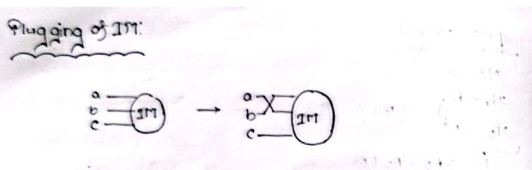
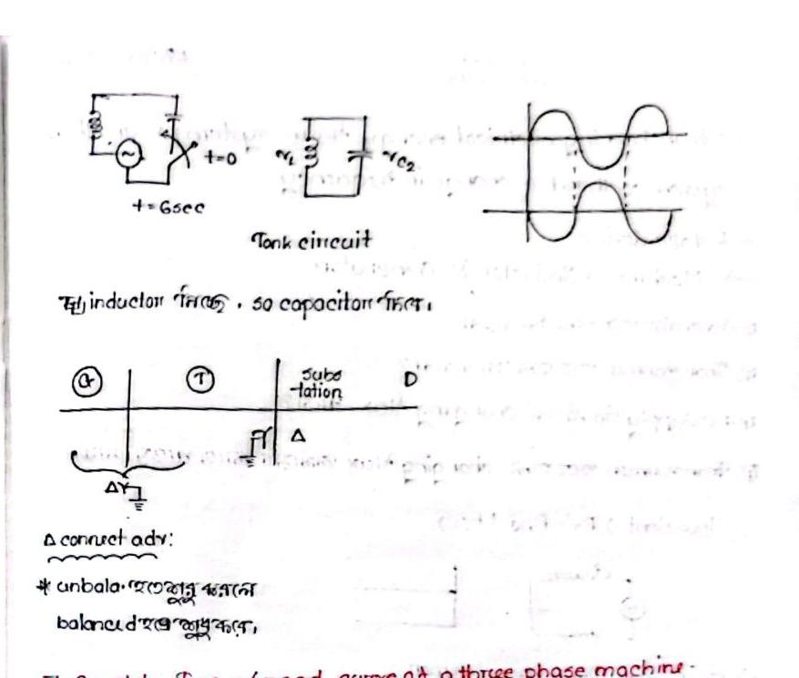

# Class 12: Speed Control Methods, Electric Braking & Induction Generator Operation

> **Date**: 16.08.2026 / 19.08.2026 | **Instructor**: Fariya Tabassum (FT Mam)  
> **Source Scan Pages**: P22 (Left/Right), P23 (Left/Right)  
> [← Previous Class: Class 11](Class_11_Induction_Motor_Starting_Methods.md) | [📚 Index](00_Index_and_Topic_Map.md) | [Next Class: Class 13 →](Class_13_Transformer_Principles_and_Construction.md)

---

## 1. Speed Control Methods of 3-Phase Induction Motor

<!-- Page 22_L -->

Since rotor speed is given by $N_r = N_s(1 - s) = \frac{120 f}{P}(1 - s)$, speed can be controlled from either the stator side or the rotor side:

```text
Induction Motor Speed Control
├── (A) Stator Side Control
│    ├── 1. Stator Voltage Control      ──> Simple but narrow speed range (T ∝ V^2)
│    ├── 2. Supply Frequency Control    ──> V/f constant control maintains peak torque
│    └── 3. Pole Changing Method        ──> Discrete stepped speeds (e.g. 2, 4, 8 poles)
└── (B) Rotor Side Control (Slip-Ring Motors)
     ├── 1. Rotor Rheostat Control      ──> Inserting external resistance R_2
     ├── 2. Cascade / Concatenation     ──> Two mechanically coupled motors
     └── 3. Injected EMF Method         ──> Injecting slip-frequency voltage into rotor
```

---

## 2. Electric Braking of Induction Motors

<!-- Page 22_R & Page 23_L -->

Mechanical friction brakes suffer from wear and tear. Electric braking provides rapid, controlled deceleration by generating electrical counter-torque:

```text
Electric Braking Techniques
├── 1. Regenerative Braking     ──> Nr > Ns (motor acts as generator, feeds power back to grid)
├── 2. Dynamic (Rheostatic)     ──> Stator disconnected from AC and connected to resistive load
├── 3. DC Injection Braking     ──> DC injected into stator winding creates stationary field
└── 4. Plugging (Counter-Current)──> Phase sequence reversal produces massive stopping torque
```

### A. Plugging (Counter-Current Braking)
- **Principle**: While the motor is running, any two supply line leads are interchanged ($a-b-c \longrightarrow a-c-b$).
- **Action**: The rotating magnetic field immediately reverses direction, exerting a massive counter-torque that rapidly decelerates the rotor.



> [!CAUTION]
> **Disconnect at Zero Speed!**
> The instant the motor decelerates to zero speed ($N_r = 0$), the supply must be immediately disconnected via a centrifugal switch or plugging relay; otherwise, the motor will reverse direction and accelerate backwards!

### B. DC Injection Braking:
- The AC supply is disconnected, and a DC voltage (from a rectifier) is injected across the stator windings.
- This establishes a stationary magnetic field in the stator, which rapidly brakes the rotating rotor via eddy-current and induction damping.

### C. Capacitor Braking:
- A 3-phase capacitor bank is connected across the stator terminals. The capacitive reactive current provides self-excitation, establishing dynamic braking.

---

## 3. Induction Generator (IG) Operation

<!-- Page 23_L & 23_R -->


$$
\begin{array}{|l|c|c|}
\hline
\textbf{Property} & \textbf{Induction Motor (IM)} & \textbf{Induction Generator (IG)} \\
\hline
\text{Rotor Speed } (N_r) & N_r < N_s \text{ (below sync speed)} & N_r > N_s \text{ (above sync speed)} \\
\text{Slip } (s) & 0 < s < 1 \text{ (positive)} & s < 0 \text{ (negative)} \\
\text{Active Power } (P) & \text{Absorbs real power from grid} & \text{Supplies real power to grid} \\
\text{Reactive Power } (Q) & \text{Absorbs reactive power} & \textbf{Must absorb reactive power!} \\
\text{Prime Mover} & \text{None (produces mechanical drive)} & \text{Required (Wind turbine, Hydro engine)} \\
\hline
\end{array}
$$

> [!IMPORTANT]
> **Crucial IG Requirement: External Reactive Power**
> An induction generator cannot self-excite or create an initial magnetic field on its own.  
> Therefore, it must either remain interconnected with an active utility grid or be connected to a local **Capacitor Bank (Tank Circuit)** to supply the necessary magnetizing reactive power ($Q$).



- **Grid-Connected Mode**: Absorbs lagging reactive power from the grid while exporting active real power ($P$) to the grid at leading or unity power factor.
- **Isolated / Standalone Mode**: An external 3-phase shunt capacitor bank (LC tank circuit) must be connected across terminals to supply the reactive VARs required for initial voltage build-up and sustained operation.

---

## 4. Complete Torque-Speed Characteristic Curve

Across all speed and slip regimes, a 3-phase induction machine operates in three distinct quadrants:

```text
Torque (T)
     ^                           Generating Region
     |                                (s < 0, Nr > Ns)
     |                                      /
     |            Motoring Region          /
     |             (0 < s < 1)            /
     |                 /\                /
     |                /  \              /
     |  Braking      /    \            /
     |   Region     /      \          /
     |  (s > 1)    /        \        /
-----+------------+----------+------+--------------------> Speed (Nr)
    -Ns           0         N_rated Ns
   (s=2)        (s=1)              (s=0)
```

1. **Braking Region ($s > 1, N_r < 0$)**: The rotor rotates in opposition to the stator RMF (e.g., during plugging).
2. **Motoring Region ($0 < s < 1, 0 < N_r < N_s$)**: Normal motoring operation.
3. **Generating Region ($s < 0, N_r > N_s$)**: An external prime mover drives the rotor faster than the synchronous speed.

---

[← Previous Class: Class 11](Class_11_Induction_Motor_Starting_Methods.md) | [📚 Back to Index](00_Index_and_Topic_Map.md) | [Next Class: Class 13 →](Class_13_Transformer_Principles_and_Construction.md)
