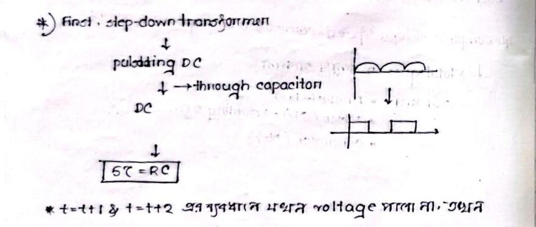
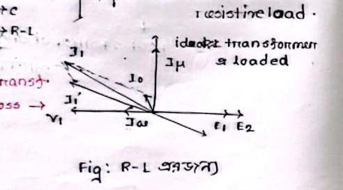
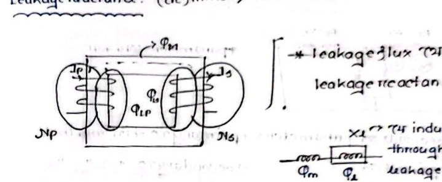

# Class 13: Single-Phase Transformer Fundamentals, No-Load Dynamics & Leakage Reactance

> **Date**: 23.08.2026 / 25.08.2026 / 30.08.2026 | **Instructor**: Fariya Tabassum (FT Mam)  
> **Source Scan Pages**: P24 (Left/Right), P25 (Left/Right)  
> [← Previous Class: Class 12](Class_12_Speed_Control_and_Electric_Braking.md) | [📚 Index](00_Index_and_Topic_Map.md) | [Next Class: Class 14 →](Class_14_Equivalent_Circuit_and_Parameter_Shifting.md)

---

## 1. Definition and Physical Mechanism

<!-- Page 24_L -->

$$\textbf{Transformer is a Static Device}$$
$$\text{Transferring electrical energy from one circuit to another without any physical connection and } \textbf{without a change in frequency.}$$

- **Machine vs Transformer**:
  - Rotating machines (Induction Motors, Generators) convert between mechanical and electrical energy.
  - A transformer is completely static; it contains no moving or rotating parts.

> [!CAUTION]
> **Why DC Supply Cannot Be Applied to a Transformer!**
> 1. Transformer operation relies strictly on Faraday's law of electromagnetic induction, requiring a time-varying magnetic flux ($\frac{d\Phi}{dt} \neq 0$).
> 2. Supplying pure DC creates a constant, time-invariant flux ($\frac{d\Phi}{dt} = 0$), producing zero counter-EMF ($E_1 = 0$).
> 3. Since the primary coil ohmic resistance is negligible ($R_1 \ll 1\,\Omega$), the current is limited only by resistance ($I = \frac{V}{R_1}$), drawing a catastrophic inrush current.
> 4. The magnetic core immediately drives into deep **Magnetic Saturation**, and the excessive $I^2 R$ heating rapidly **burns out the primary winding**.

- **Transient DC Analysis**:
  - In an $R-C$ circuit, the transient duration is $5\tau = 5 RC$.
  - If pulsating DC is applied, voltage is induced only during transient switching edges where ($\frac{di}{dt} \neq 0$); once steady-state DC is reached ($\frac{di}{dt} = 0$), no voltage is induced, rendering the transformer inoperative.

> [!NOTE]
> **Pulsating DC vs Pure DC**
> Unfiltered pulsating DC from a rectifier contains both an AC ripple component and a DC average offset. The persistent DC component drives the core into unidirectional magnetic saturation, drastically reducing inductance and driving primary current to dangerous levels.

---

## 2. No-Load Behavior & Core Losses

<!-- Page 25_L -->

### Why Do Primary Current ($I_0$) and Power Losses Exist Even When the Secondary is Open-Circuited (No-Load)?

- With the secondary open-circuited, secondary load current is zero ($I_2 = 0$).
- Nevertheless, the primary winding continues to draw a small no-load excitation current ($I_0$, typically $2 - 5\%$ of rated full-load current):
  $$\mathbf{I}_0 = \mathbf{I}_w + \mathbf{I}_\mu$$
  - **Working / Core-loss Component ($I_w$)**: Supplies the core losses (Hysteresis and Eddy current losses):
    $$I_w = I_0 \cos\phi_0$$
  - **Magnetizing Component ($I_\mu$)**: Establishes and sustains the alternating magnetic flux $\Phi$ in the core:
    $$I_\mu = I_0 \sin\phi_0$$
  - Total no-load current:
    $$I_0 = \sqrt{I_w^2 + I_\mu^2}$$

---

## 3. Loaded Transformer Phasor Conventions

<!-- Page 25_L (bot) -->

- **Pure Resistive Load ($R$)**: Current $I_2$ is in-phase with voltage $V_2$ ($\phi_2 = 0^\circ$).
- **Pure Inductive Load ($L$)**: Current $I_2$ lags voltage $V_2$ by $90^\circ$.
- **Pure Capacitive Load ($C$)**: Current $I_2$ leads voltage $V_2$ by $90^\circ$.
- **Practical Inductive Load ($R-L$)**: Current $I_2$ lags voltage $V_2$ by angle $\phi_2$ ($0^\circ < \phi_2 < 90^\circ$).

---

## 4. Physical Origin of Leakage Reactance

<!-- Page 25_R -->

- **Mutual Flux ($\Phi_m$)**: The common flux that is confined within the ferromagnetic core and links both windings (Primary $N_p$ and Secondary $N_s$) completely.
- **Leakage Flux ($\Phi_l$)**:
  - The portion of flux that leaks through air paths, linking only its own winding without coupling to the other winding:
    - Primary Leakage Flux: $\Phi_{lp}$
    - Secondary Leakage Flux: $\Phi_{ls}$
- **Leakage Reactance Model**:
  - This leakage flux creates an inductive series voltage drop across the winding.
  - Primary leakage reactance: $X_1$
  - Secondary leakage reactance: $X_2$
- **Effect of Leakage Flux**:
  - Degrades output terminal voltage regulation (causes increased voltage drop under load).
  - Slightly decreases overall transformer efficiency (practical full-load efficiency remains exceptionally high: $\approx 95\% - 99\%$).

---

## 5. Parallels Between Induction Motor and Transformer

$$
\begin{array}{|l|c|c|}
\hline
\textbf{Feature} & \textbf{Transformer} & \textbf{Induction Motor} \\
\hline
\text{Action} & \text{Stationary Induction} & \text{Rotating Induction} \\
\text{Secondary Winding} & \text{Fixed (Stationary)} & \text{Free to rotate (Rotor)} \\
\text{Air-gap} & \text{None (continuous magnetic core)} & \text{Mandatory air-gap between stator and rotor} \\
\text{Magnetizing Current } (I_\mu) & \text{Very small (2--5\% of rated)} & \text{Very large (30--40\% of rated due to airgap)} \\
\text{No-Load Power Factor} & \approx 0.3 - 0.4 \text{ lagging} & \approx 0.1 - 0.2 \text{ lagging} \\
\text{Basic Tests} & \text{Open Circuit (OC), Short Circuit (SC)} & \text{No-Load, Blocked Rotor, DC Test} \\
\hline
\end{array}
$$

---

[← Previous Class: Class 12](Class_12_Speed_Control_and_Electric_Braking.md) | [📚 Back to Index](00_Index_and_Topic_Map.md) | [Next Class: Class 14 →](Class_14_Equivalent_Circuit_and_Parameter_Shifting.md)
