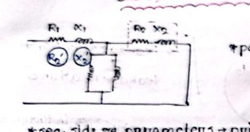
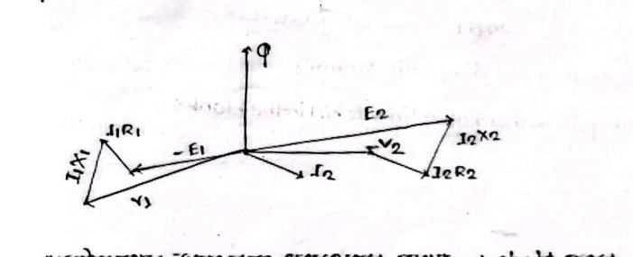

# Class 14: Transformer Transformation Ratio, Parameter Shifting & Equivalent Circuit

> **Date**: 06.09.2026 | **Instructor**: Fariya Tabassum (FT Mam)  
> **Source Scan Pages**: P26_L, P26_R  
> [← Previous Class: Class 13](Class_13_Transformer_Principles_and_Construction.md) | [📚 Index](00_Index_and_Topic_Map.md) | [Next Class: Class 15 →](Class_15_Voltage_Regulation_and_IM_Comparison.md)

---

## 1. Transformation Ratio ($K$)

<!-- Page 26_L -->

The voltage transformation ratio $K$ is defined as:

$$\boxed{K = \frac{N_2}{N_1} = \frac{E_2}{E_1} = \frac{I_1}{I_2}}$$

- **Step-Up Transformer**: $K > 1 \implies N_2 > N_1, V_2 > V_1, I_2 < I_1$
- **Step-Down Transformer**: $K < 1 \implies N_2 < N_1, V_2 < V_1, I_2 > I_1$

---

## 2. Principle of Parameter Shifting

<!-- Page 26_R -->

When referring winding resistance or reactance from one side to another, numerical values cannot be transferred directly. The transformation must be carried out such that the total copper loss ($I^2 R$) remains exactly identical on both sides:

$$I_1^2 \cdot R_2' = I_2^2 \cdot R_2$$

Solving for the shifted resistance referred to primary ($R_2'$):
$$R_2' = \left(\frac{I_2}{I_1}\right)^2 \cdot R_2 = \left(\frac{1}{K}\right)^2 \cdot R_2$$
$$\boxed{R_2' = \frac{R_2}{K^2}}$$

Similarly, for primary resistance shifted to secondary ($R_1'$):
$$I_2^2 \cdot R_1' = I_1^2 \cdot R_1 \implies R_1' = \left(\frac{I_1}{I_2}\right)^2 \cdot R_1$$
$$\boxed{R_1' = K^2 \cdot R_1}$$

### Equivalent Leakage Reactances:
- Secondary reactance shifted to primary:
  $$\boxed{X_2' = \frac{X_2}{K^2}}$$
- Primary reactance shifted to secondary:
  $$\boxed{X_1' = K^2 \cdot X_1}$$

---

## 3. Total Equivalent Circuit Parameters

<!-- Page 26_L (bot) -->

### Referred to Primary Side (Index 01):
1. **Total Equivalent Resistance**:
   $$\boxed{R_{01} = R_1 + R_2' = R_1 + \frac{R_2}{K^2}}$$
2. **Total Equivalent Reactance**:
   $$\boxed{X_{01} = X_1 + X_2' = X_1 + \frac{X_2}{K^2}}$$
3. **Total Equivalent Impedance**:
   $$\boxed{Z_{01} = \sqrt{R_{01}^2 + X_{01}^2}}$$

### Referred to Secondary Side (Index 02):
1. **Total Equivalent Resistance**:
   $$\boxed{R_{02} = R_2 + R_1' = R_2 + K^2 R_1}$$
2. **Total Equivalent Reactance**:
   $$\boxed{X_{02} = X_2 + X_1' = X_2 + K^2 X_1}$$
3. **Total Equivalent Impedance**:
   $$\boxed{Z_{02} = \sqrt{R_{02}^2 + X_{02}^2}}$$

---

## 4. Practical Loaded Transformer Complete Phasor Diagram

<!-- Page 26_R (bot) -->

### Phasor Balance Equations:
- **Secondary Loop (Terminal Voltage $V_2$)**:
  $$\mathbf{E}_2 = \mathbf{V}_2 + \mathbf{I}_2 R_2 + j \mathbf{I}_2 X_2$$
- **Primary Loop (Applied Voltage $V_1$)**:
  $$\mathbf{V}_1 = (-\mathbf{E}_1) + \mathbf{I}_1 R_1 + j \mathbf{I}_1 X_1$$
- **Total Primary Current**:
  $$\mathbf{I}_1 = \mathbf{I}_0 + \mathbf{I}_2'$$

---

[← Previous Class: Class 13](Class_13_Transformer_Principles_and_Construction.md) | [📚 Back to Index](00_Index_and_Topic_Map.md) | [Next Class: Class 15 →](Class_15_Voltage_Regulation_and_IM_Comparison.md)
