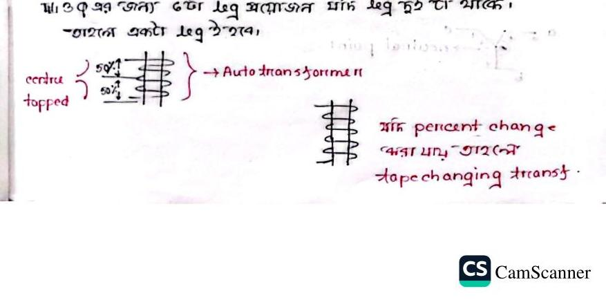
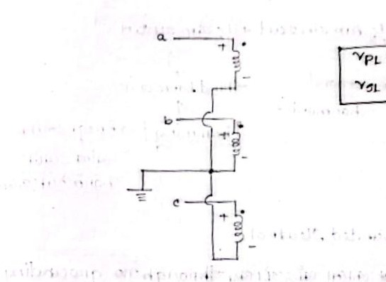

# Class 16: Three-Phase Transformer Configurations, Phase Sequences & Harmonics

> **Date**: 12.09.2026 | **Instructor**: Fariya Tabassum (FT Mam)  
> **Source Scan Pages**: P27_R, P28 (Left/Right), P29_L  
> [← Previous Class: Class 15](Class_15_Voltage_Regulation_and_IM_Comparison.md) | [📚 Index](00_Index_and_Topic_Map.md) | [Next Class: Class 17 →](Class_17_Two_Transformer_Connections_OpenDelta_ScottT.md)

---

## 1. Necessity and Comparison: 3-Phase Bank vs. Single Unit

<!-- Page 27_R -->

```text
Three-Phase Transformation Options
├── (1) Single 3-Phase Unit       ──> Compact, lower weight, lower loss, cheaper initial cost
└── (2) Bank of Three 1-Phase     ──> Larger space, higher initial cost, BUT superior redundancy
```

- **Transmission Preference (Substation Strategy)**:
  - High-voltage transmission substations often prefer a **Bank of Three 1-Phase Transformers** over a single large 3-phase unit.
  - **Reason (Backup & Redundancy Costs)**:
    - If a single 3-phase transformer fails, the entire unit is shut down, requiring a complete, expensive 3-phase spare unit on standby.
    - With a bank of three 1-phase transformers, a failure in one phase requires only a single 1-phase spare unit, drastically reducing standby capital investment.



> [!NOTE]
> **3-Limb Core Flux Return**
> Under balanced 3-phase sinusoidal excitation, the instantaneous sum of magnetic fluxes in the three limbs is identically zero ($\Phi_a + \Phi_b + \Phi_c = 0$). Consequently, no dedicated external return limb or yoke path is required, significantly reducing core material, weight, and footprint.

---

## 2. Voltage and Current Relations in Star ($\text{Y}$) and Delta ($\Delta$)

<!-- Page 28_L -->

### Positive Phase Sequence ($a-b-c$):
- **Star ($\text{Y}$) Connection**:
  $$V_L = \sqrt{3} \cdot V_p \angle +30^\circ, \quad I_L = I_p$$
- **Delta ($\Delta$) Connection**:
  $$V_L = V_p, \quad I_L = \sqrt{3} \cdot I_p \angle -30^\circ$$

### Negative Phase Sequence ($a-c-b$):
- **Star ($\text{Y}$) Connection**:
  $$V_L = \sqrt{3} \cdot V_p \angle -30^\circ, \quad I_L = I_p$$

### Standard 3-Phase Connection Types:
1. **$\text{Y}-\text{Y}$ (Star - Star)**: Provides accessible neutral points on both sides; best suited for small-power, high-voltage applications.
2. **$\text{Y}-\Delta$ (Star - Delta)**: Ideal for step-down applications at generating stations and bulk power substations.
3. **$\Delta-\text{Y}$ (Delta - Star)**: Most widely used for step-up generation substations and commercial 4-wire distribution networks (supplying $400\text{ V}$ 3-phase power and $230\text{ V}$ single-phase lighting loads).
4. **$\Delta-\Delta$ (Delta - Delta)**: Highly reliable for industrial low-voltage, large-current loads; can operate in Open-Delta ($\text{V}-\text{V}$) if one phase is damaged.

---

## 3. Unbalanced Load Impact & Winding Configurations

<!-- Page 28_R -->



- **Primary Current Response to Secondary Load**:
  - Under an unbalanced secondary load, secondary current $I_2$ in one phase increases.
  - By transformer action, the corresponding primary reflected counter-current $I_1'$ changes immediately.
  - Thus, the primary current $\mathbf{I}_1 = \mathbf{I}_0 + \mathbf{I}_1'$ automatically adjusts on each phase to maintain magnetic ampere-turn balance.

---

## 4. The Harmonic Problem: Third Harmonics and Humming

<!-- Page 29_L -->

Due to non-linear ferromagnetic core saturation and the hysteresis loop, the transformer excitation current is non-sinusoidal and rich in odd harmonics:

$$i(t) = A_m \sin\omega t + \frac{1}{2} A_m \sin 2\omega t + \frac{1}{3} A_m \sin 3\omega t + \dots$$

- **Third Harmonics ($3\omega$)**:
  - Third harmonics are identical in phase across all three lines (co-phasal).
  - In an ungrounded $\text{Y}-\text{Y}$ bank without neutral return, third-harmonic currents cannot flow, which forces third-harmonic voltages to appear across the phase windings, causing severe neutral potential oscillation (**Oscillating Neutral**).
  - These high-frequency harmonic fluxes induce significant core heating and produce an audible, loud acoustic **Humming Noise**.

### Mitigation Solutions:
1. **Solidly Grounded Neutral**:
   - Connecting the neutral directly to earth (solid grounding) provides a low-impedance path for co-phasal third-harmonic currents to safely circulate into the ground.
2. **Tertiary Winding (Closed Delta)**:
   - An auxiliary third winding connected in **Closed Delta ($\Delta$)** is wound on the same core limbs alongside the primary and secondary windings.
   - This provides a closed circulation path for third-harmonic currents to circulate internally within the delta, trapping the harmonics and preventing them from distorting system line voltages.

---

[← Previous Class: Class 15](Class_15_Voltage_Regulation_and_IM_Comparison.md) | [📚 Back to Index](00_Index_and_Topic_Map.md) | [Next Class: Class 17 →](Class_17_Two_Transformer_Connections_OpenDelta_ScottT.md)
