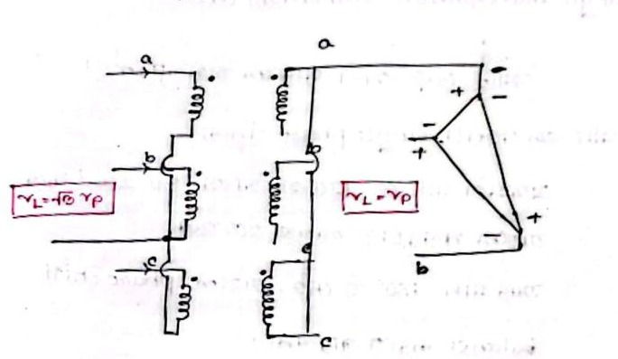
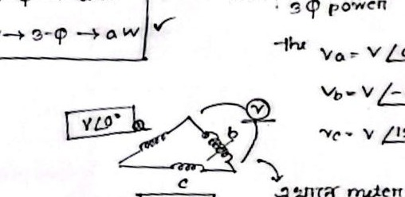
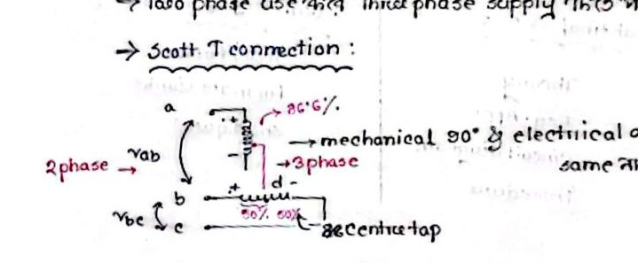

# Class 17: Two-Transformer 3-Phase Connections — Open-Delta (V-V) & Scott-T

> **Date**: 16.09.2026 / 19.09.2026 | **Instructor**: Fariya Tabassum (FT Mam)  
> **Source Scan Pages**: P29_R, P30 (Left/Right), P31 (Left/Right)  
> [← Previous Class: Class 16](Class_16_Three_Phase_Transformers_and_Harmonics.md) | [📚 Index](00_Index_and_Topic_Map.md) | [Next Class: Class 18 →](Class_18_Transformer_Vector_Groups_and_Review.md)

---

## 1. The $30^\circ$ Phase Shift in $\text{Y}-\Delta$ Transformers

<!-- Page 29_R & 30_L -->



- **Voltage Ratios**:
  - Primary Wye ($\text{Y}$): $V_{L1} = \sqrt{3} V_{p1}$
  - Secondary Delta ($\Delta$): $V_{L2} = V_{p2}$
- **Main Drawback**:
  - An inherent $30^\circ$ phase shift (lead or lag) occurs between the primary and secondary line voltages.
  - **Parallel Operation Constraint**:  
    A $\text{Y}-\Delta$ or $\Delta-\text{Y}$ transformer bank can NEVER be connected in parallel with a $\text{Y}-\text{Y}$ or $\Delta-\Delta$ transformer bank; the resulting $30^\circ$ phase difference would cause massive circulating currents, immediately destroying the windings!

---

## 2. Three-Phase Transformation Using Two Transformers

<!-- Page 30_R -->

During emergencies, maintenance, or initial installations with light loads, **a balanced 3-phase supply can be delivered using only two 1-phase transformers**:

```text
Two-Transformer 3-Phase Configurations
├── 1. Open-Delta (V-V) Connection      ──> Emergency operation when 1 unit of Δ-Δ fails
├── 2. Open-Y - Open-Δ Connection       ──> Limited 3-phase supply from 2-phase line
└── 3. Scott-T Connection               ──> 3-Phase to 2-Phase conversion (and vice-versa)
```

---

## 3. Open-Delta (or $\text{V}-\text{V}$) Connection

<!-- Page 30_R & 31_L -->

When one transformer is removed from a 3-phase delta-delta ($\Delta-\Delta$) bank due to fault or maintenance, the remaining two transformers form an open-delta or **$\text{V}-\text{V}$ connection**:



### Mathematical Proof: $\text{V}-\text{V}$ Capacity is $57.7\%$ of $\Delta-\Delta$ Bank

Let per-phase voltage and current rating of each transformer be $V_{ph}$ and $I_{ph}$:

1. **Closed Delta ($\Delta-\Delta$) Bank Total Rating**:
   $$\text{Rating}_{\Delta-\Delta} = 3 \cdot V_{ph} \cdot I_{ph} = \sqrt{3} \cdot V_L \cdot I_L$$

2. **Open Delta ($\text{V}-\text{V}$) Bank Total Rating**:
   In a $\text{V}-\text{V}$ connection, the secondary line current flows directly through the winding coils. Therefore, to prevent thermal overload, the line current must be restricted to the rated phase current capacity of the coils ($I_L = I_{ph}$):
   $$\text{Rating}_{\text{V}-\text{V}} = \sqrt{3} \cdot V_L \cdot I_L = \sqrt{3} \cdot V_{ph} \cdot I_{ph}$$

3. **Ratio of Capacities**:
   $$\boxed{\frac{\text{Rating}_{\text{V}-\text{V}}}{\text{Rating}_{\Delta-\Delta}} = \frac{\sqrt{3} \cdot V_{ph} \cdot I_{ph}}{3 \cdot V_{ph} \cdot I_{ph}} = \frac{\sqrt{3}}{3} = \frac{1}{\sqrt{3}} \approx 0.577 = \mathbf{57.7\% \approx 58\%}}$$

4. **Utilization Factor of the Remaining Two Units**:
   The combined nominal rating of the two remaining transformers is $2 \cdot V_{ph} \cdot I_{ph}$. Their actual utilization factor is:
   $$\frac{\sqrt{3} \cdot V_{ph} \cdot I_{ph}}{2 \cdot V_{ph} \cdot I_{ph}} = \frac{\sqrt{3}}{2} = \mathbf{86.6\%}$$

> [!IMPORTANT]
> **Exam Conclusion**
> When one transformer is removed from a $\Delta-\Delta$ bank, the total available system capacity drops to **$57.7\%$** of the original bank capacity (NOT two-thirds or $66.7\%$), and the remaining two units operate at **$86.6\%$** of their combined individual nameplate ratings.

---

## 4. Scott-T Connection: 3-Phase to 2-Phase Conversion

<!-- Page 31_R -->



The Scott-T connection employs two distinct single-phase transformers:
1. **Main Transformer**:
   - Connected across lines $b$ and $c$ of the 3-phase supply.
   - Its primary winding features a **Centre-Tap ($d$)** located precisely at its $50\%$ midpoint.
2. **Teaser Transformer**:
   - Connected between line $a$ of the 3-phase supply and the centre-tap $d$ of the main transformer.

### Crucial Question: Why is an 86.6% Tap Required on the Teaser Transformer?
Consider balanced line voltages with $V_{bc}$ along reference:
$$V_{ab} = V_L \angle 120^\circ$$
$$V_{bc} = V_L \angle 0^\circ$$

The voltage across the centre tap $d$ to line $b$ is half of $V_{bc}$:
$$V_{bd} = \frac{1}{2} V_{bc} = \frac{1}{2} V_L \angle 0^\circ$$

The voltage across the teaser transformer ($V_{ad}$) is:
$$V_{ad} = V_{ab} + V_{bd} = V_L \angle 120^\circ + \frac{1}{2} V_L \angle 0^\circ$$
$$V_{ad} = V_L \left( -\frac{1}{2} + j \frac{\sqrt{3}}{2} \right) + \frac{1}{2} V_L = j \frac{\sqrt{3}}{2} V_L = \frac{\sqrt{3}}{2} V_L \angle 90^\circ$$

$$\boxed{V_{ad} = 0.866 \cdot V_L \angle 90^\circ}$$

> [!IMPORTANT]
> **Why 86.6% Turns?**
> The voltage across the teaser transformer is in exact **$90^\circ$ time quadrature** with the main transformer voltage, but its magnitude is only $\frac{\sqrt{3}}{2} = 86.6\%$ of the main line voltage.  
> To obtain two secondary output voltages of exactly equal magnitudes in $90^\circ$ phase quadrature (a true balanced 2-phase system), **the primary turns of the teaser transformer must be tapped at exactly $86.6\%$ ($\frac{\sqrt{3}}{2}$) of the main transformer primary turns!**

---

[← Previous Class: Class 16](Class_16_Three_Phase_Transformers_and_Harmonics.md) | [📚 Back to Index](00_Index_and_Topic_Map.md) | [Next Class: Class 18 →](Class_18_Transformer_Vector_Groups_and_Review.md)
