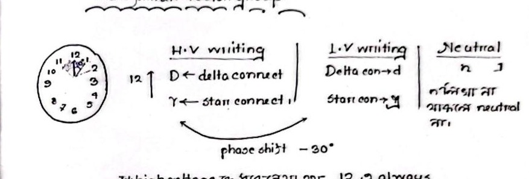

# Class 18: Transformer Vector Groups, Clock Convention & Semester Review

> **Date**: 20.09.2026 | **Instructor**: Fariya Tabassum (FT Mam)  
> **Source Scan Pages**: P32_L, P32_R  
> [← Previous Class: Class 17](Class_17_Two_Transformer_Connections_OpenDelta_ScottT.md) | [📚 Index](00_Index_and_Topic_Map.md)

---

## 1. Summary of Three-Phase Transformation Proofs

<!-- Page 32_L -->

The proofs for the four standard 3-phase transformer winding connections are completed:

1. **$\text{Y}-\text{Y}$ Proof**: Line voltage $V_L = \sqrt{3} V_{ph}$, Phase shift $= 0^\circ$ (or $180^\circ$ reversed).
2. **$\text{Y}-\Delta$ Proof**: Line voltage ratio $\frac{V_{L1}}{V_{L2}} = \sqrt{3} \cdot \frac{N_1}{N_2}$, Phase shift $= -30^\circ$ (or $+30^\circ$).
3. **$\Delta-\text{Y}$ Proof**: Line voltage ratio $\frac{V_{L1}}{V_{L2}} = \frac{1}{\sqrt{3}} \cdot \frac{N_1}{N_2}$, Phase shift $= +30^\circ$ (or $-30^\circ$).
4. **$\Delta-\Delta$ Proof**: Line voltage $V_L = V_{ph}$, Line current $I_L = \sqrt{3} I_{ph}$, Phase shift $= 0^\circ$.

---

## 2. Examination Structure & Practical Guidelines

- **Lab Final Exam Structure (Exp 2 – 5)**:
  1. **Theory**: Basic operating principles and relevant mathematical formulas.
  2. **Required Apparatus**: Specification and list of meters, transformers, and variacs.
  3. **Circuit Diagram**: Clear, properly labeled schematic with polarities.
  4. **Procedure & Calculation**: Step-by-step experimental measurement procedure.
- **Quiz Structure (Exp 1 – 6)**:
  - True / False conceptual questions.
  - Fill in the blanks (technical terms, formula constants).
  - Short analytical questions.

---

## 3. Transformer Vector Groups & Clock Convention

<!-- Page 32_R -->

In three-phase transformers, the phase displacement between the primary and secondary line voltages is standardized internationally using the **Clock Convention** (IEC 60076-1):

### Standard Notations:
- **Reference Phasor**:
  The High Voltage (H.V.) line phasor is always taken as the fixed reference pointing at 12 o'clock (the minute hand at 12 o'clock).
- **High Voltage Winding (Uppercase Letters)**:
  - $D$ = Delta connection
  - $Y$ = Star (Wye) connection
- **Low Voltage Winding (Lowercase Letters)**:
  - $d$ = Delta connection
  - $y$ = Star (Wye) connection
- **Neutral Terminal Notation**:
  - $N$ = High voltage side neutral brought out.
  - $n$ = Low voltage side neutral brought out.
  - *(If omitted, the neutral terminal is not brought out)*.

### Clock Numbers & Angular Displacement:
Each hour on the clock dial corresponds to a $30^\circ$ angular phase displacement ($1\text{ hour} = \frac{360^\circ}{12} = 30^\circ$):

$$\begin{array}{|l|c|l|}
\hline
\textbf{Clock Number} & \textbf{Phase Displacement} & \textbf{Description} \\
\hline
\mathbf{0} & 0^\circ & \text{L.V. and H.V. are in-phase (e.g. Yy0, Dd0)} \\
\mathbf{1} & -30^\circ \text{ (lag)} & \text{L.V. lags H.V. by } 30^\circ \text{ (at 1 o'clock)} \\
\mathbf{6} & 180^\circ & \text{L.V. and H.V. in complete phase opposition (e.g. Yyn6)} \\
\mathbf{11} & +30^\circ \text{ (lead)} & \text{L.V. leads H.V. by } 30^\circ \text{ (at 11 o'clock)} \\
\hline
\end{array}$$

### Example Case: $\text{Yyn6}$
- **$Y$**: High-voltage side star connection.
- **$y$**: Low-voltage side star connection.
- **$n$**: Low-voltage neutral brought out.
- **$6$**: $6 \times 30^\circ = 180^\circ$ phase reversal (lead / lag).

> [!IMPORTANT]
> **Parallel Operation Golden Rule**
> **For Parallel Operation:** Only transformers belonging to the **exact same vector group** (or groups with compatible phase displacement) can be connected in parallel.  
> Connecting transformers with incompatible vector groups creates large circulating currents that will immediately destroy the units!

---

## 4. Semester Course Architecture & Literature References

- **Syllabus Division**:
  - **Section A**: Transformers (Classes 13 – 18)
  - **Section B**: Induction Motors (Classes 01 – 12)
- **Primary Reference Texts**:
  - *Electric Machinery Fundamentals* — Stephen J. Chapman
  - *Direct and Alternating Current Machinery* — Jack Rosenblatt & M. Harold Friedman
  - Faculty Mathematics and Lecture Presentation Slides

---

[← Previous Class: Class 17](Class_17_Two_Transformer_Connections_OpenDelta_ScottT.md) | [📚 Back to Index](00_Index_and_Topic_Map.md)
