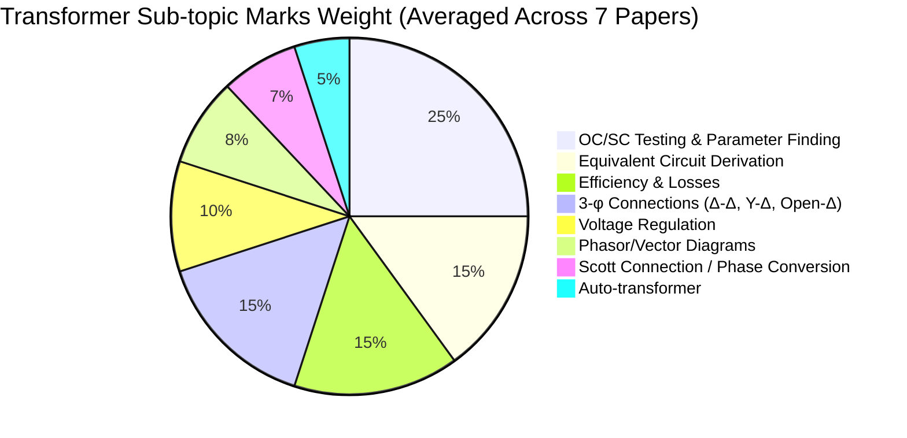
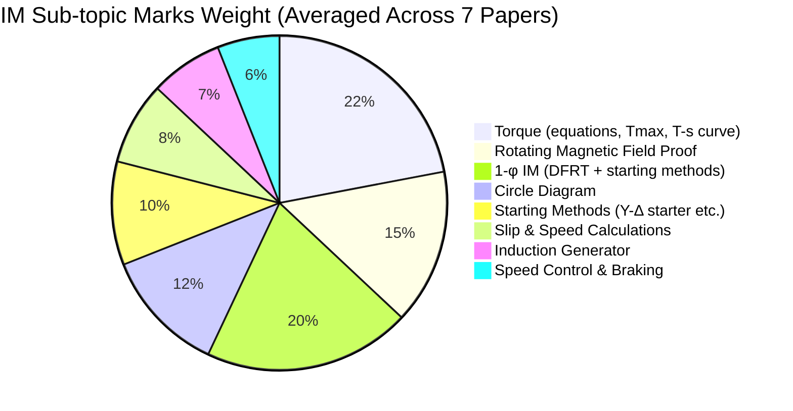

# ECE 2207 — Electrical Machines I: Previous Year Question Analysis

> **Papers Analyzed:** 7 years — [2017](file:///home/azaz/AntigravityxStudy/SemesterFinal_2_2/ECE_2207/PrevYearQuestions/2017.md), [2018](file:///home/azaz/AntigravityxStudy/SemesterFinal_2_2/ECE_2207/PrevYearQuestions/2018.md), [2019](file:///home/azaz/AntigravityxStudy/SemesterFinal_2_2/ECE_2207/PrevYearQuestions/2019.md), [2020](file:///home/azaz/AntigravityxStudy/SemesterFinal_2_2/ECE_2207/PrevYearQuestions/2020.md), [2021](file:///home/azaz/AntigravityxStudy/SemesterFinal_2_2/ECE_2207/PrevYearQuestions/2021.md), [2023](file:///home/azaz/AntigravityxStudy/SemesterFinal_2_2/ECE_2207/PrevYearQuestions/2023.md), [2024](file:///home/azaz/AntigravityxStudy/SemesterFinal_2_2/ECE_2207/PrevYearQuestions/2024.md)
> **Missing:** 2022 paper not available
> **Syllabus:** [Syllabus.md](file:///home/azaz/AntigravityxStudy/SemesterFinal_2_2/ECE_2207/Syllabus.md)

---

## 1. Exam Format & Structure

| Property | 2017–2021 | 2023–2024 |
|:---|:---|:---|
| **Course Code** | ECE 2107 | ECE 2207 |
| **Total Marks** | 72 | 60 |
| **Duration** | 3 Hours | 3 Hours |
| **Total Questions** | 8 (4 per section) | 8 (4 per section) |
| **Questions to Attempt** | 6 (3 from each section) | 6 (3 from each section) |
| **Marks per Question** | 12 | 10 |
| **Sections** | A (Transformer) + B (IM) | A (Transformer) + B (IM) |

> [!IMPORTANT]
> Starting from 2022, RUET adopted the **OBE (Outcome-Based Education) curriculum**. This restructured the exam: marks dropped from **72 → 60** (each question from 12 → 10 marks), the course code changed from ECE 2107 → ECE 2207, and **CO (Course Outcome) mapping** was introduced per sub-question. The 2022 paper (the first under OBE) is the one we're missing.

---

## 2. Section-to-Topic Mapping (Consistent Across All Years)

| Section | Syllabus Topics | Typical Question Nos. |
|:---|:---|:---|
| **Section A** | Transformers (ideal, actual, equivalent circuit, testing, 3-φ connections, vector groups, phase conversion, auto-transformer) | Q1–Q4 |
| **Section B** | 3-φ Induction Motor + 1-φ Induction Motor (rotating field, equivalent circuit, torque-speed, testing, starting, braking, speed control, induction generator) | Q5–Q8 |

---

## 3. Topic Frequency Heatmap (7 Papers)

### 3.1 SECTION A — Transformer Topics

| Topic | '17 | '18 | '19 | '20 | '21 | '23 | '24 | **Total (out of 7)** |
|:---|:---:|:---:|:---:|:---:|:---:|:---:|:---:|:---:|
| **EMF Equation / Induced EMF derivation** | | | ✅ | | ✅ | ✅ | ✅ | **4** |
| **Equivalent circuit (step-by-step)** | ✅ | ✅ | | ✅ | | | ✅ | **4** |
| **OC & SC Test (procedure / parameter finding)** | ✅ | ✅ | ✅ | ✅ | ✅ | ✅ | ✅ | **7 🔥** |
| **Efficiency calculation** | ✅ | ✅ | ✅ | | | ✅ | | **4** |
| **All-day efficiency** | | ✅ | ✅ | | | ✅ | | **3** |
| **Max efficiency when Cu loss = Fe loss** | | | ✅ | | | ✅ | | **2** |
| **Voltage regulation** | | ✅ | ✅ | | ✅ | ✅ | ✅ | **5** |
| **Phasor / Vector diagram** | ✅ | ✅ | | | ✅ | | ✅ | **4** |
| **No-load operation / No-load current** | | | ✅ | ✅ | | | ✅ | **3** |
| **Open-Δ (V-V) connection / 57.7% proof** | ✅ | ✅ | ✅ | ✅ | ✅ | ✅ | | **6 🔥** |
| **Y-Y limitations** | | | | | ✅ | ✅ | | **2** |
| **Parallel operation conditions** | ✅ | | | | ✅ | ✅ | | **3** |
| **Auto-transformer (copper saving proof)** | | | | ✅ | | ✅ | | **2** |
| **Scott (T-T) connection** | | ✅ | ✅ | | | | ✅ | **3** |
| **Vector groups / Dyn notation** | | | ✅ | | ✅ | | | **2** |
| **3-φ transformer connections (Y-Δ, Δ-Y, etc.)** | | ✅ | | | | | ✅ | **2** |
| **Transformer breathing** | | | ✅ | | | | | **1** |
| **Instrument transformer / PT** | ✅ | | | | | | | **1** |
| **Inrush current (first connected to line)** | ✅ | | | | | | | **1** |
| **Frequency/flux effects** | | ✅ | | | | | | **1** |
| **Shell-type core economy (reverse winding)** | | | ✅ | | | | | **1** |
| **Magnetizing current non-sinusoidal** | | | | | | | ✅ | **1** |
| **Transformer classification** | | ✅ | | | | | | **1** |
| **SC test on HV side — why?** | | | | | | | ✅ | **1** |
| **3-φ to 2-φ conversion (general)** | | | ✅ | | | | | **1** |
| **Ideal transformer properties** | | | | | ✅ | | ✅ | **2** |
| **Laminating core purpose** | | | | ✅ | | | | **1** |
| **Hysteresis & Eddy current losses** | ✅ | | | | | | | **1** |

### 3.2 SECTION B — Induction Motor Topics

| Topic | '17 | '18 | '19 | '20 | '21 | '23 | '24 | **Total (out of 7)** |
|:---|:---:|:---:|:---:|:---:|:---:|:---:|:---:|:---:|
| **Rotating magnetic field (3-φ or 2-φ) proof** | ✅ | ✅ | | | ✅ | ✅ | ✅ | **5 🔥** |
| **Why IM = rotating transformer** | ✅ | | ✅ | ✅ | | | | **3** |
| **Slip definition / IM can't run at Ns proof** | | | | ✅ | ✅ | ✅ | ✅ | **4** |
| **Torque-speed / Torque-slip curve** | | | | ✅ | ✅ | ✅ | ✅ | **4** |
| **Torque equation / Max torque derivation** | ✅ | | ✅ | | ✅ | | ✅ | **4** |
| **Tf/Tmax ratio derivation** | ✅ | | | | | | | **1** |
| **Max torque to full-load torque ratio (numerical)** | ✅ | | ✅ | | | | ✅ | **3** |
| **Equivalent circuit of IM** | ✅ | | | ✅ | | ✅ | | **3** |
| **Circle diagram** | ✅ | ✅ | ✅ | | ✅ | | | **4** |
| **Plugging / Braking definitions** | ✅ | ✅ | ✅ | ✅ | | | | **4** |
| **Speed control methods** | ✅ | | ✅ | | | ✅ | | **3** |
| **Star-delta starter** | | ✅ | | ✅ | | ✅ | | **3** |
| **Double field revolving theory (1-φ IM)** | | ✅ | ✅ | ✅ | ✅ | ✅ | | **5 🔥** |
| **1-φ IM not self-starting — why?** | ✅ | | ✅ | | | | | **2** |
| **1-φ IM starting methods (capacitor-start, split-phase, etc.)** | ✅ | ✅ | ✅ | ✅ | ✅ | ✅ | | **6 🔥** |
| **Capacitor value for max starting torque** | | ✅ | | | ✅ | | | **2** |
| **Power stages / rotor power division** | | ✅ | | ✅ | | | | **2** |
| **Synchronous watt** | | | | | ✅ | ✅ | | **2** |
| **Rotor efficiency** | | | | | ✅ | ✅ | | **2** |
| **Induction generator (IM as IG)** | | ✅ | | | | ✅ | ✅ | **3** |
| **Single phasing effect** | | ✅ | ✅ | | | | | **2** |
| **Direct-on-line starting effects (>25kW)** | | | ✅ | | | | | **1** |
| **Synchronous motor (not self-starting / V-curves)** | | | | ✅ | | | | **1** |
| **Crawling and Cogging** | | | | | | ✅ | | **1** |
| **Asynchronous generator capacitance calc** | | ✅ | | | | | ✅ | **2** |
| **Rotor resistance speed control (numerical)** | | | | | ✅ | | | **1** |
| **1-φ IM vector/phasor diagram** | | | | | | | ✅ | **1** |
| **IM tests for circuit model** | | | | | | | ✅ | **1** |

---

## 4. Most Repeated Questions — "Golden Questions" ⭐

These exact questions (or near-identical variants) have appeared **3+ times**. Master these for guaranteed marks.

### 4.1 Transformer (Section A)

| # | Question Pattern | Years Appeared | Priority |
|:---|:---|:---|:---:|
| 1 | **OC/SC test data → find equivalent circuit parameters, efficiency, voltage regulation** | '17, '18, '19, '20, '21, '23, '24 | 🔴 MUST |
| 2 | **Open-Δ connection — prove 57.7% capacity / show continuity of supply when 1 phase burns** | '17, '18, '19, '20, '21, '23 | 🔴 MUST |
| 3 | **Voltage regulation — derive for leading, lagging, unity pf** | '18, '19, '21, '23, '24 | 🔴 MUST |
| 4 | **EMF equation derivation** $E = 4.44 f N \Phi_m$ | '19, '21, '23, '24 | 🟠 HIGH |
| 5 | **Equivalent circuit — step-by-step derivation** | '17, '18, '20, '24 | 🟠 HIGH |
| 6 | **Transformer phasor/vector diagram (loaded, lagging pf)** | '17, '18, '21, '24 | 🟠 HIGH |
| 7 | **Efficiency calculation — half load, full load, various pf** | '17, '18, '19, '23 | 🟠 HIGH |
| 8 | **All-day efficiency (with load schedule)** | '18, '19, '23 | 🟡 MEDIUM |
| 9 | **Scott (T-T) connection — voltage/current ratings, KVA calculation** | '18, '19, '24 | 🟡 MEDIUM |
| 10 | **Parallel operation conditions for 3-φ transformers** | '17, '21, '23 | 🟡 MEDIUM |
| 11 | **Auto-transformer copper saving proof** | '20, '23 + partial in '20 | 🟡 MEDIUM |
| 12 | **Max efficiency occurs when Cu loss = Fe loss — proof** | '19, '23 | 🟡 MEDIUM |

### 4.2 Induction Motor (Section B)

| # | Question Pattern | Years Appeared | Priority |
|:---|:---|:---|:---:|
| 1 | **Double field revolving theory for 1-φ IM** | '18, '19, '20, '21, '23 | 🔴 MUST |
| 2 | **1-φ IM starting methods (capacitor-start, split-phase, etc.)** | '17, '18, '19, '20, '21, '23 | 🔴 MUST |
| 3 | **Rotating magnetic field proof** (resultant flux = 1.5Φ_m, constant magnitude, synchronous speed) | '17, '18, '21, '23, '24 | 🔴 MUST |
| 4 | **Slip definition + IM cannot run at synchronous speed — proof** | '20, '21, '23, '24 | 🔴 MUST |
| 5 | **Circle diagram construction from NL & BR test data** | '17, '18, '19, '21 | 🟠 HIGH |
| 6 | **Torque-speed / Torque-slip characteristic curve** | '20, '21, '23, '24 | 🟠 HIGH |
| 7 | **Max torque derivation / Tmax formula proof** | '17, '19, '21, '24 | 🟠 HIGH |
| 8 | **Ratio of Tmax to Tf (numerical)** — nearly identical problem repeated | '17, '19, '24 | 🟠 HIGH |
| 9 | **Star-delta starter explanation / proof** (equivalent to 1/√3 autotransformer) | '18, '20, '23 | 🟡 MEDIUM |
| 10 | **Induction motor as induction generator** + capacitance calculation | '18, '23, '24 | 🟡 MEDIUM |
| 11 | **Why IM is called rotating transformer** | '17, '19, '20 | 🟡 MEDIUM |
| 12 | **Plugging / braking definitions** | '17, '18, '19, '20 | 🟡 MEDIUM |

---

## 5. Nearly Identical Numerical Problems (Copy-Paste Questions)

These numerical problems were repeated with **identical or near-identical data**:

### 5.1 Transformer Numericals

| Problem | Appearances | Data |
|:---|:---|:---|
| **OC/SC test → parameters of 20 kVA, 2400/240V transformer** | [2018](file:///home/azaz/AntigravityxStudy/SemesterFinal_2_2/ECE_2207/PrevYearQuestions/2018.md) Q2, [2021](file:///home/azaz/AntigravityxStudy/SemesterFinal_2_2/ECE_2207/PrevYearQuestions/2021.md) Q2 | V=72V, W=275-300W, I=rated; regulation at 0.8 lag |
| **No-load test: 220V/110V, 0.5A, 30W → magnetizing & loss current** | [2020](file:///home/azaz/AntigravityxStudy/SemesterFinal_2_2/ECE_2207/PrevYearQuestions/2020.md) Q2d, [2024](file:///home/azaz/AntigravityxStudy/SemesterFinal_2_2/ECE_2207/PrevYearQuestions/2024.md) Q3c | Identical data — 220V, 110V, 0.5A, 30W |
| **Scott connection: 3300V→440V, 33 KVA** | [2018](file:///home/azaz/AntigravityxStudy/SemesterFinal_2_2/ECE_2207/PrevYearQuestions/2018.md) Q4b, [2024](file:///home/azaz/AntigravityxStudy/SemesterFinal_2_2/ECE_2207/PrevYearQuestions/2024.md) Q4c | Identical: 440V, 33KVA, 3300V supply |
| **Circle diagram: 415V, 29.84 kW, delta motor** | [2017](file:///home/azaz/AntigravityxStudy/SemesterFinal_2_2/ECE_2207/PrevYearQuestions/2017.md) Q3b, [2019](file:///home/azaz/AntigravityxStudy/SemesterFinal_2_2/ECE_2207/PrevYearQuestions/2019.md) Q6a | Identical: NL(415V, 21A, 1250W), BR(100V, 45A, 2730W) |

### 5.2 Induction Motor Numericals

| Problem | Appearances | Data |
|:---|:---|:---|
| **8-pole, 50Hz, 2% slip → Tmax/Tf ratio + speed at Tmax** | [2017](file:///home/azaz/AntigravityxStudy/SemesterFinal_2_2/ECE_2207/PrevYearQuestions/2017.md) Q2d, [2019](file:///home/azaz/AntigravityxStudy/SemesterFinal_2_2/ECE_2207/PrevYearQuestions/2019.md) Q8c | Identical: R₂=0.001Ω, X₂=0.005Ω |
| **8-pole, 50Hz, 4% slip → Tmax/Tf ratio** | [2024](file:///home/azaz/AntigravityxStudy/SemesterFinal_2_2/ECE_2207/PrevYearQuestions/2024.md) Q7c | Variant: R₂=0.01Ω, X₂=0.1Ω (same ratio!) |
| **IM as IG: 440V, 4-pole, 1470rpm, 30kW, 40A, pf=85%** | [2018](file:///home/azaz/AntigravityxStudy/SemesterFinal_2_2/ECE_2207/PrevYearQuestions/2018.md) Q5c, [2024](file:///home/azaz/AntigravityxStudy/SemesterFinal_2_2/ECE_2207/PrevYearQuestions/2024.md) Q8c | Identical data in both papers |

> [!TIP]
> **The examiner clearly recycles numerical data.** If you solve every unique numerical from these 7 papers (≈20 distinct problems), you will almost certainly encounter something identical or trivially similar in your exam.

---

## 6. Topic-wise Marks Distribution Pattern

### 6.1 Section A — Transformer (Per Paper)

### 6.2 Section B — Induction Motor (Per Paper)

---

## 7. Year-over-Year Trend Analysis

### 7.1 Shifting Patterns

| Trend | Details |
|:---|:---|
| **Circle diagram declining** | Common in '17–'21 (appeared 4 times); **absent** in '23 and '24. May be de-emphasized or could return. |
| **Induction generator rising** | Appeared only once in '18, then came back in both '23 and '24. Now a **hot topic**. |
| **DFRT is evergreen** | Double field revolving theory appeared in 5 out of 7 papers. Only missing in '17 and '24. |
| **OC/SC test is guaranteed** | Appeared in ALL 7 papers. The single most certain question in the exam. |
| **Auto-transformer** | Appeared in '20 and '23. Was not asked in '17, '18, '19, '21, '24. Could be due for a return. |
| **Vector groups / Dyn notation** | Only '19 and '21. Niche but specifically in the [syllabus](file:///home/azaz/AntigravityxStudy/SemesterFinal_2_2/ECE_2207/Syllabus.md). |
| **Crawling & Cogging** | Only '23. New addition — may return in future papers. |
| **SC test on HV side — why?** | Only '24. Short-answer conceptual question — new pattern. |

### 7.2 Examiner Behavior

- **Strong recycling tendency**: The same examiner appears to set many papers (identical phrasing, same numerical data across years).
- **2-3-4 or 3-4-5 marks split**: Sub-questions are almost always split into 2–5 mark chunks, with a mix of:
  - **Define/Short note** (1–3 marks) — definitions, brief explanations
  - **Derive/Prove** (3–5 marks) — mathematical derivations
  - **Numerical** (3–6 marks) — calculation-heavy problems
- **"Justify" style questions increasing**: '23 and '24 papers show more open-ended "justify" / "explain it" style questions vs. the older formulaic pattern.

---

## 8. Coverage Gap Analysis vs. [Syllabus](file:///home/azaz/AntigravityxStudy/SemesterFinal_2_2/ECE_2207/Syllabus.md)

| Syllabus Topic | Exam Coverage | Risk |
|:---|:---|:---|
| Ideal transformer — transformation ratio | Well covered | ✅ Safe |
| No-load and load vector diagrams | Well covered | ✅ Safe |
| Equivalent circuit | Well covered | ✅ Safe |
| Voltage regulation | Well covered | ✅ Safe |
| OC / SC testing | Well covered | ✅ Safe |
| 3-φ connections | Well covered | ✅ Safe |
| **Vector groups of 3-φ transformers** | Only '19, '21 | ⚠️ Under-tested, could appear |
| Phase conversion (Scott) | Moderately covered | ✅ Safe |
| RMF | Well covered | ✅ Safe |
| IM equivalent circuit | Moderately covered | ✅ Safe |
| IM vector diagram | Only '24 | ⚠️ Under-tested |
| Torque-speed characteristics | Well covered | ✅ Safe |
| **Effect of changing R₂ and X₂ on T-s curves** | Rarely asked explicitly | ⚠️ Under-tested |
| Motor torque & developed rotor power | Covered | ✅ Safe |
| NL test / Blocked rotor test (IM) | Circle diagram covers this | ✅ Safe |
| Starting methods, braking, speed control | Well covered | ✅ Safe |
| Induction generator | Rising trend | ✅ Safe |
| **1-φ IM equivalent circuit** | Never asked explicitly! | 🔴 **Gap** |
| 1-φ IM theory (DFRT) | Well covered | ✅ Safe |
| 1-φ IM starting methods | Well covered | ✅ Safe |

> [!WARNING]
> The **1-φ IM equivalent circuit** is in the syllabus but has NEVER been directly asked in any of these 7 papers. It could appear — or the examiner may continue to focus on DFRT and starting methods. Similarly, **vector groups** and **effect of R₂/X₂ on T-s curves** are syllabus topics that are under-represented in past papers.

---

## 9. Question Type Distribution

| Type | Avg. per Paper | Examples |
|:---|:---:|:---|
| **Define / Short note** (1–3 marks) | 2–3 | "Define plugging", "Define slip", "What is synchronous watt?" |
| **Explain / Describe** (3–4 marks) | 2–3 | "Explain DFRT", "Describe Y-Δ starter" |
| **Derive / Prove** (3–5 marks) | 2–3 | "Prove Tmax formula", "Derive EMF equation", "Prove 57.7%" |
| **Draw diagram** (2–4 marks) | 1–2 | "Draw equivalent circuit", "Draw phasor diagram", "Draw T-s curve" |
| **Numerical** (3–9 marks) | 3–4 | OC/SC test calculations, torque/slip calculations, circle diagram |

---

## 10. Strategic Exam Preparation Guide

### 🔴 Tier 1 — NON-NEGOTIABLE (Appear every or almost every year)

1. **OC/SC test → equivalent circuit parameters + efficiency + regulation** — Practice ALL unique numerical variants from the 7 papers
2. **Open-Δ connection: prove 57.7% / what happens when one phase burns**
3. **Double field revolving theory** — full explanation with diagrams
4. **1-φ IM starting methods** — capacitor-start, split-phase, permanent-split capacitor
5. **Rotating magnetic field proof** — 3-φ produces constant-magnitude rotating flux
6. **Slip definition + proof IM can't run at Ns**

### 🟠 Tier 2 — HIGH PRIORITY (Appear frequently)

7. **EMF equation derivation** ($E = 4.44 f N \Phi_m$)
8. **Voltage regulation** derivation for lagging, leading, unity pf
9. **Torque-speed / Torque-slip curve** — draw and explain all regions
10. **Max torque derivation** + Tmax/Tf ratio numerical
11. **Transformer equivalent circuit** — step-by-step referred to primary
12. **Transformer phasor diagram** under load (lagging pf)
13. **Circle diagram** — construction from test data
14. **Efficiency at half/full load** for various power factors

### 🟡 Tier 3 — SHOULD KNOW

15. **Scott connection** — diagram + voltage/current/KVA calculations
16. **Parallel operation conditions** for 3-φ transformers
17. **Y-Δ starter** — explanation + proof (equivalent to 1/√3 autotransformer)
18. **Induction generator** — how IM operates as IG + capacitance calculation
19. **All-day efficiency** with load schedule
20. **Auto-transformer** — copper saving proof
21. **Plugging, braking definitions**
22. **Speed control methods**
23. **Why IM = rotating transformer**

### 🟢 Tier 4 — BONUS PREPARATION

24. Vector groups / Dyn notation
25. 1-φ IM equivalent circuit (syllabus gap)
26. Crawling and Cogging
27. Effect of R₂ and X₂ variation on torque-speed curves
28. Instrument transformers
29. Inrush current

---

## 11. Critical Numerical Bank — Practice These Specific Problems

> [!TIP]
> These are the **distinct numerical problem types** extracted from all 7 papers. Solving each of these once gives you coverage of every numerical pattern that has appeared.

| # | Problem Type | Source (Example) |
|:---|:---|:---|
| 1 | OC/SC test → R₀, X₀, R_eq, X_eq, Z_eq, efficiency, regulation | [2024 Q2c](file:///home/azaz/AntigravityxStudy/SemesterFinal_2_2/ECE_2207/PrevYearQuestions/2024.md) |
| 2 | No-load current → magnetizing & loss components | [2024 Q3c](file:///home/azaz/AntigravityxStudy/SemesterFinal_2_2/ECE_2207/PrevYearQuestions/2024.md) |
| 3 | No-load current decomposition (with load given, find I₀ by phasor subtraction) | [2023 Q1c](file:///home/azaz/AntigravityxStudy/SemesterFinal_2_2/ECE_2207/PrevYearQuestions/2023.md) |
| 4 | Transformer efficiency at full/half load, unity & 0.8 lag | [2019 Q2c](file:///home/azaz/AntigravityxStudy/SemesterFinal_2_2/ECE_2207/PrevYearQuestions/2019.md) |
| 5 | All-day efficiency with variable load schedule | [2023 Q3b](file:///home/azaz/AntigravityxStudy/SemesterFinal_2_2/ECE_2207/PrevYearQuestions/2023.md) |
| 6 | Primary current with step-down transformer under load (phasor addition) | [2020 Q1d](file:///home/azaz/AntigravityxStudy/SemesterFinal_2_2/ECE_2207/PrevYearQuestions/2020.md) |
| 7 | Open-Δ: max load on two transformers vs. closed Δ with three | [2020 Q4c](file:///home/azaz/AntigravityxStudy/SemesterFinal_2_2/ECE_2207/PrevYearQuestions/2020.md) |
| 8 | Scott connection: coil ratings + KVA | [2024 Q4c](file:///home/azaz/AntigravityxStudy/SemesterFinal_2_2/ECE_2207/PrevYearQuestions/2024.md) |
| 9 | 3-φ secondary voltage with impedance and regulation | [2023 Q4c](file:///home/azaz/AntigravityxStudy/SemesterFinal_2_2/ECE_2207/PrevYearQuestions/2023.md) |
| 10 | Y-Δ transformer bank: KVA/phase, coil voltages and currents | [2018 Q3b](file:///home/azaz/AntigravityxStudy/SemesterFinal_2_2/ECE_2207/PrevYearQuestions/2018.md) |
| 11 | IM slip, speed, frequency from given poles/supply | [2019 Q5c](file:///home/azaz/AntigravityxStudy/SemesterFinal_2_2/ECE_2207/PrevYearQuestions/2019.md) |
| 12 | Tmax/Tf ratio + speed at Tmax | [2024 Q7c](file:///home/azaz/AntigravityxStudy/SemesterFinal_2_2/ECE_2207/PrevYearQuestions/2024.md) |
| 13 | Rotor current at given slip + slip at Tmax | [2024 Q6c](file:///home/azaz/AntigravityxStudy/SemesterFinal_2_2/ECE_2207/PrevYearQuestions/2024.md) |
| 14 | Rotor power input → slip, speed, Cu losses, mechanical power | [2020 Q6d](file:///home/azaz/AntigravityxStudy/SemesterFinal_2_2/ECE_2207/PrevYearQuestions/2020.md) |
| 15 | Circle diagram from test data → IL, slip, η, pf, Tmax | [2021 Q8c](file:///home/azaz/AntigravityxStudy/SemesterFinal_2_2/ECE_2207/PrevYearQuestions/2021.md) |
| 16 | Star-delta starter: starting torque / full-load torque ratio | [2023 Q7b](file:///home/azaz/AntigravityxStudy/SemesterFinal_2_2/ECE_2207/PrevYearQuestions/2023.md) |
| 17 | Capacitor value for max starting torque (1-φ IM) | [2021 Q7c](file:///home/azaz/AntigravityxStudy/SemesterFinal_2_2/ECE_2207/PrevYearQuestions/2021.md) |
| 18 | IM as IG: capacitance per phase + engine speed | [2024 Q8c](file:///home/azaz/AntigravityxStudy/SemesterFinal_2_2/ECE_2207/PrevYearQuestions/2024.md) |
| 19 | External resistance for speed reduction at constant torque (slip-ring IM) | [2021 Q4c](file:///home/azaz/AntigravityxStudy/SemesterFinal_2_2/ECE_2207/PrevYearQuestions/2021.md) |
| 20 | Developed torque at full load, max torque, speed at max torque | [2018 Q6c](file:///home/azaz/AntigravityxStudy/SemesterFinal_2_2/ECE_2207/PrevYearQuestions/2018.md) |

---

## 12. Predicted High-Probability Questions for Your Exam

Based on the 7-year trend analysis, the following topics have the **highest probability** of appearing:

### Section A (Pick 3 from 4)

| Q | Likely Content | Confidence |
|:---|:---|:---:|
| Q1 | EMF equation derivation + No-load behavior + Numerical (OC data or no-load current) | 90% |
| Q2 | Phasor diagram (loaded transformer) + OC/SC test numerical → equivalent circuit + regulation | 95% |
| Q3 | Open-Δ / Y-Y limitations / parallel operation + All-day efficiency or efficiency numerical | 85% |
| Q4 | Scott connection OR vector groups OR auto-transformer + 3-φ numerical | 75% |

### Section B (Pick 3 from 4)

| Q | Likely Content | Confidence |
|:---|:---|:---:|
| Q5 | RMF proof + Slip definition/proof + Speed/frequency numerical | 90% |
| Q6 | Torque-speed curve + Torque derivation/numerical (Tmax/Tf ratio) | 85% |
| Q7 | Y-Δ starter + Circle diagram OR starting torque numerical | 80% |
| Q8 | DFRT + 1-φ IM starting methods + IG operation OR capacitor numerical | 90% |

> [!CAUTION]
> **The 2022 paper is missing — and it was the first OBE exam.** The transition from ECE 2107 (72 marks, old curriculum) to ECE 2207 (60 marks, OBE) happened in 2022. That paper likely set the template for the new format that '23 and '24 follow. Try to source it from classmates or the department — it would fill a critical gap in this analysis.

---

## 13. Summary Statistics

| Metric | Value |
|:---|:---|
| Total papers analyzed | 7 |
| Total questions across all papers | 56 (8 × 7) |
| Total sub-questions | ~175 |
| Distinct topic clusters (Section A) | 20+ |
| Distinct topic clusters (Section B) | 20+ |
| Questions repeated ≥3 times (exact/near-identical) | **12 in Section A, 12 in Section B** |
| Numericals repeated with identical data | **6 specific problems** |
| Topics in syllabus never directly tested | 1–3 (1-φ IM eq. circuit, R₂/X₂ effect on T-s) |
