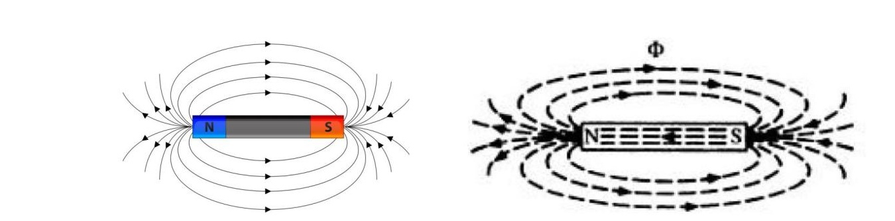
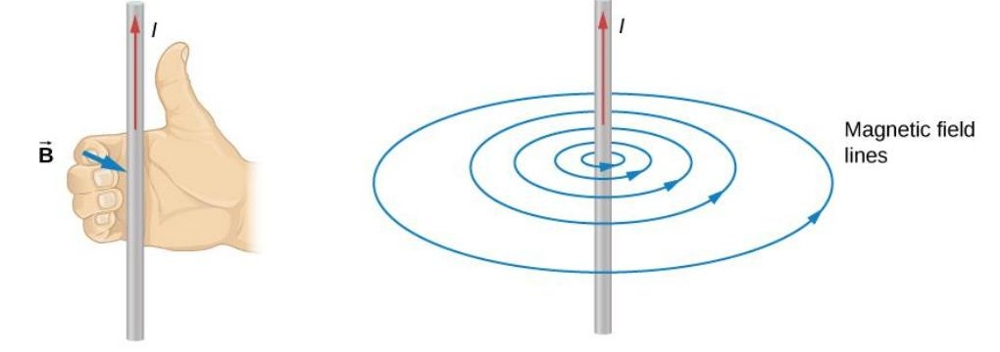
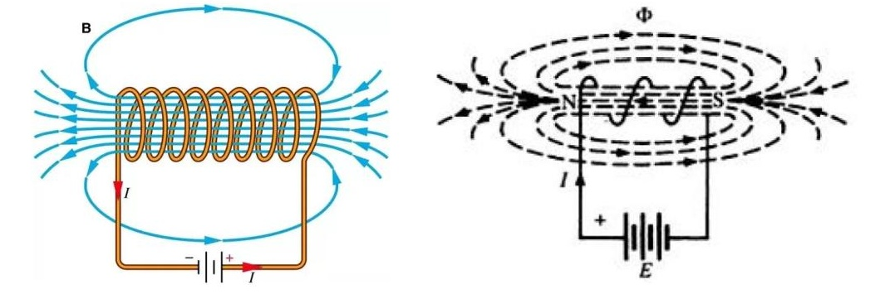
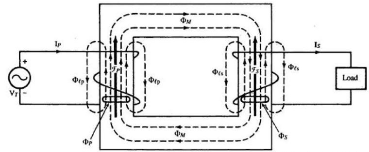
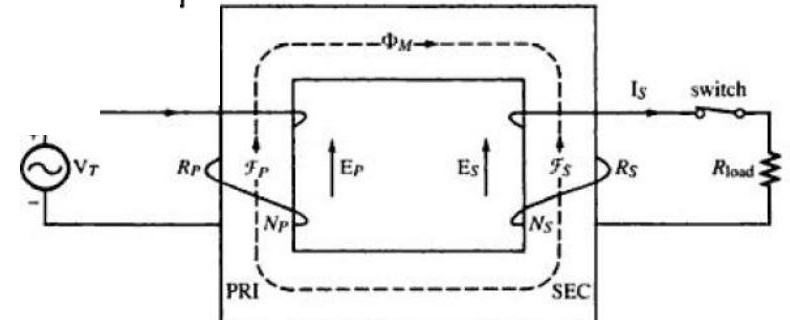
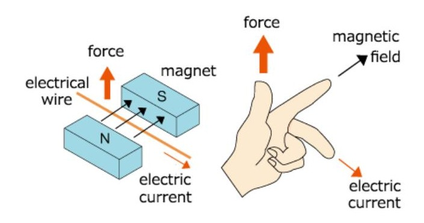
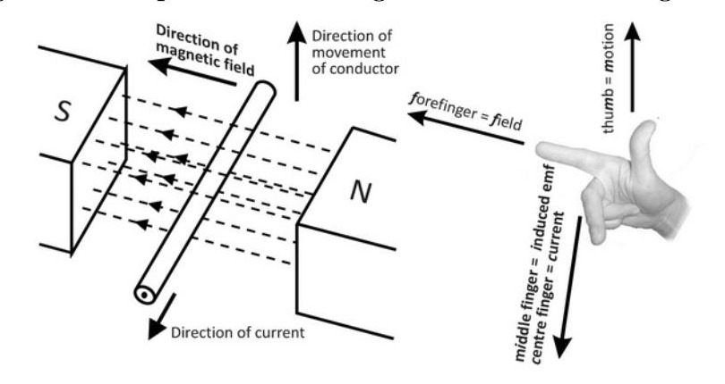

<!-- Slide 1 -->
# Electrical Machines-I
## ECE-2207

**Fariya Tabassum**  
Assistant Professor, Dept. of Electrical & Computer Engineering  
Rajshahi University of Engineering & Technology, Rajshahi-6204

---

<!-- Slide 2 -->
## “Read! In the name of thy Lord and Cherisher, Who created-”.

[Sura Al-’Alaq ]

---

<!-- Slide 3 -->
## Study Materials

### For Basic Knowledge
- **Electric Machines -Theory, Operation, Application and Control**  
  Charles I. Hubert
- **Electric Machinery Fundamentals**  
  Stephen J. Chapman

### For Govt. Job of BD
- **A text Book of Electrical Technology (Volume II)**  
  B. L. Theraza, A. K. Theraza
- **Principles of Electrical Machines**  
  V. K. Mehta, Rohit Mehta

---

<!-- Slide 4 -->
## Magnetic Field is the Heart of Electrical Machines

So, Let’s see how it can be generated!

---

<!-- Slide 5 -->
## Magnetic Field

Magnetic field can be generated by

### a. A permanent magnet

The direction of the magnetic field supplied by a magnet is from the north pole to the south pole but is **south to north within the magnet** itself, i.e., the flux forms a closed loop.

---

<!-- Slide 6 -->
## Magnetic Field

### b. A current (both static and time varying) carrying conductor

The direction of the magnetic field around a current can be determined by the **right-hand rule**: Grasp the conductor with the right hand, with the thumb pointing in the direction of conventional current and the fingers will curl in the direction of the magnetic field.

---

<!-- Slide 7 -->
## Magnetic Field

### c. A current (both static and time varying) carrying coil of wire

The direction of the magnetic field generated by a current through a coil of wire is also determined by the **right-hand rule**. Grasp the coil with the right hand, with the finger curled in the direction of the current and the thumb will point in the direction of the magnetic field.

---

<!-- Slide 8 -->
## Magnetic Field

**Magnetic fields** are the fundamental mechanism by which **energy is converted** from one form to another in **motors**, **generators** and **transformers**. The basic principles that describe how magnetic fields are used in these devices are:

- A time-changing **magnetic field** induces a voltage in a coil of wire if it passes through that col. **(Basis of transformer action.)**
- A current-carrying wire in the presence of a **magnetic field** has a force induced on it. **(Basis of motor action.)**
- A moving wire in the presence of a **magnetic field** has a voltage induced in it. **(Basis of generator action.)**

---

<!-- Slide 9 -->
## Basis of Transformer Action

A time-changing magnetic field induces a voltage in a coil of wire if it passes through that col.

**The Direction of the Induced Voltage is determined by Lenz’s Law**

---

<!-- Slide 10 -->
## Basis of Motor Action

A current-carrying wire in the presence of a magnetic field has a force induced on it.

### Fleming’s **Left** Hand Rule for Motor

---

<!-- Slide 11 -->
## Basis of Generator Action

A moving wire in the presence of a magnetic field has a voltage induced in it.

### Fleming’s **Right** Hand Rule for Generator
