<!-- Slide 1 -->
# Electrical Machines-I
## ECE-2207

#### *Induction Motor-SL1*

**Fariya Tabassum**  
Assistant Professor, Dept. of Electrical & Computer Engineering  
Rajshahi University of Engineering & Technology, Rajshahi-6204

---

<!-- Slide 2 -->
## “My lord, increase me in knowledge”.

[Sura Ta Ha]

---

<!-- Slide 3 -->
## Important Terms Used in Electrical Machines

- Electrical machines (generator and motor) have **two** main parts, i. e., its **stator** and **rotor**. **Stator** is the **stationary or non-moving** part and **rotor** is the **rotating or moving** part. **Stator** is the **outer** part while **rotor** is the **inner** part.

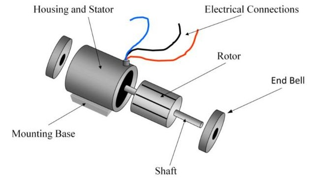

- The part of the machine from where the output is taken is called **“Armature”**. It can be either stationary **(stator)** or rotating **(rotor)**.

---

<!-- Slide 4 -->
## AC Motor

- **Synchronous Motor**
- **Asynchronous Motor**
  - **Induction Motor**
    - Squirrel cage Induction Motor
    - Slip-ring Induction Motor
  - **Commutator Motor**

Mostly the **Induction Motor** is Known as **Asynchronous Motor**

---

<!-- Slide 5 -->
## DC Motor

Electric power is **conducted** directly to the armature (rotor) through brushes and commutator.

### Induction Motor:

The rotor does not receive electric power by conduction but by **induction** in exactly the same way as the secondary of a 2-winding transformer receives its power from the primary. It requires no electrical connections to the rotating member, the transfer of energy from the stationary member to the rotating member is by means of electromagnetic induction. **A rotating magnetic field, produced by stator, induces an alternating emf and current in the rotor. The resultant interaction of the induced rotor current with the rotating field of the stator winding produces motor torque.** That is why such motors are known as induction motor. In fact, an **induction motor** can be treated as a **rotating transformer**, i. e., one in which primary winding is stationary but the secondary is free to rotate.

---

<!-- Slide 6 -->
## Induction Motor

Watch the attached video termed as **“V-01”** to be familiar with the parts of an induction motor

For further information about the parts you can go through the articles 34.3, 34.4 and 34.5 of the book written by **“B. L. Theraza”**

---

<!-- Slide 7 -->
## Induction Motor

### Advantages:
- It has very simple and extremely rugged, almost unbreakable construction (especially squirrel cage type).
- Its cost is low and it is very reliable.
- It has sufficiently high efficiency. In normal running condition no brushes are needed, hence frictional losses are reduced. It has a reasonably good power factor.
- It requires minimum of maintenance.
- It starts up from rest and needs no extra starting motor and has not to be synchronized. Its starting arrangement is simple especially for squirrel cage type motor.

### Disadvantages:
- Its speed cannot be varied without sacrificing some of its efficiency.
- Just like a dc shunt motor, its sped decreases with increase in load.
- Its starting torque is somewhat inferior to that of a dc shunt motor.

---

<!-- Slide 8 -->
## Induction Motor

### Flux revolving theory

---

<!-- Slide 9 -->
## Rotating Magnetic Field

- First condition for the rotation of induction motor is to generate a **rotating magnetic field** at the stator.
- **Single-phase** ac supply alone **cannot** produce a rotating magnetic field. At least **two-phase** supply is needed.

### Production of rotating magnetic field by 2-$\phi$ supply

Let the fluxes produced by 2-$\phi$ supply are:

$$\varphi_1 = \varphi_m \sin \theta$$
$$\varphi_2 = \varphi_m \sin(\theta - 90^\circ)$$

The assumed positive direction of fluxes is shown in the figure.

Interval of $0^\circ, 45^\circ, 90^\circ, 135^\circ$ and $180^\circ$ is considered

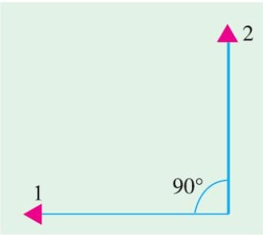

---

<!-- Slide 10 -->
## Rotating Magnetic Field

### i. When $\theta = 0^\circ$

$$\varphi_1 = \varphi_m \sin 0^\circ = 0$$
$$\varphi_2 = \varphi_m \sin (0^\circ - 90^\circ) = -\varphi_m$$

Resultant flux, $\varphi_r = \varphi_m$ and is in negative direction

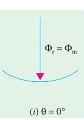

### ii. When $\theta = 45^\circ$

$$\varphi_1 = \varphi_m \sin 45^\circ = \frac{\varphi_m}{\sqrt{2}}$$
$$\varphi_2 = \varphi_m \sin (45^\circ - 90^\circ) = \frac{-\varphi_m}{\sqrt{2}}$$

$$\text{Resultant flux, } \varphi_r = \sqrt{\left(\varphi_m / \sqrt{2}\right)^2 + \left(\varphi_m / \sqrt{2}\right)^2} = \varphi_m$$

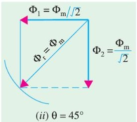

### iii. When $\theta = 90^\circ$

$$\varphi_1 = \varphi_m \sin 90^\circ = \varphi_m$$
$$\varphi_2 = \varphi_m \sin (90^\circ - 90^\circ) = 0$$

Resultant flux, $\varphi_r = \varphi_m$ and is in positive direction

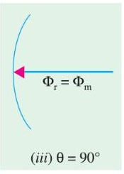

### iv. When $\theta = 135^\circ$

$$\varphi_1 = \varphi_m \sin 135^\circ = \frac{\varphi_m}{\sqrt{2}}$$
$$\varphi_2 = \varphi_m \sin (135^\circ - 90^\circ) = \frac{\varphi_m}{\sqrt{2}}$$

$$\text{Resultant flux, } \varphi_r = \sqrt{\left(\varphi_m / \sqrt{2}\right)^2 + \left(\varphi_m / \sqrt{2}\right)^2} = \varphi_m$$

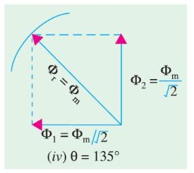

---

<!-- Slide 11 -->
## Rotating Magnetic Field

### v. When $\theta = 180^\circ$

$$\varphi_1 = \varphi_m \sin 180^\circ = 0$$
$$\varphi_2 = \varphi_m \sin (180^\circ - 90^\circ) = \varphi_m$$

Resultant flux, $\varphi_r = \varphi_m$ and is in positive direction

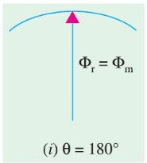

Note the direction of the resultant flux for the previous mentioned conditions. It is **rotating**

### Important Conclusion

- The magnitude of the resultant flux is constant and is equal to $\varphi_m$ that is the maximum flux due to either phase.
- The resultant flux rotates at **synchronous speed**. [i.e. the interval among 2 conditions is considered as $45^\circ$ and the resultant flux also rotates by $45^\circ$]

For preparing your answer you can go through the article 34.6 of the book written by **“B. L. Theraza”**

---

<!-- Slide 12 -->
## Rotating Magnetic Field

### Production of rotating magnetic field by 3-$\phi$ supply

Let the fluxes produced by 3-$\phi$ supply are:

$$\varphi_1 = \varphi_m \sin \theta$$
$$\varphi_2 = \varphi_m \sin (\theta - 120^\circ)$$
$$\varphi_3 = \varphi_m \sin (\theta + 120^\circ)$$

The assumed positive direction of fluxes is shown in the figure.

Interval of $0^\circ, 60^\circ, 120^\circ$ and $180^\circ$ is considered

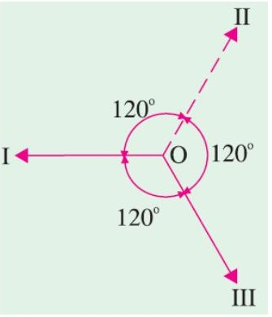

---

<!-- Slide 13 -->
## Rotating Magnetic Field

### i. When $\theta = 0^\circ$

$$\varphi_1 = \varphi_m \sin 0^\circ = 0$$
$$\varphi_2 = \varphi_m \sin (0^\circ - 120^\circ) = \frac{-\sqrt{3}}{2} \varphi_m$$
$$\varphi_3 = \varphi_m \sin (\theta + 120^\circ) = \frac{\sqrt{3}}{2} \varphi_m$$

$$\text{Resultant flux, } \varphi_r = 2 \times \frac{\sqrt{3}}{2} \varphi_m \cos \frac{60^\circ}{2} = \frac{3}{2} \varphi_m$$

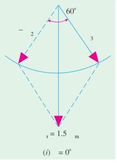

### ii. When $\theta = 60^\circ$

$$\varphi_1 = \varphi_m \sin 60^\circ = \frac{\sqrt{3}}{2} \varphi_m$$
$$\varphi_2 = \varphi_m \sin (0^\circ - 120^\circ) = \frac{-\sqrt{3}}{2} \varphi_m$$
$$\varphi_3 = \varphi_m \sin (\theta + 120^\circ) = 0$$

$$\text{Resultant flux, } \varphi_r = 2 \times \frac{\sqrt{3}}{2} \varphi_m \cos \frac{60^\circ}{2} = \frac{3}{2} \varphi_m$$

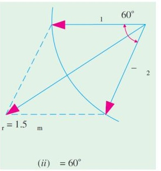

---

<!-- Slide 14 -->
## Rotating Magnetic Field

### iii. When $\theta = 120^\circ$

$$\varphi_1 = \varphi_m \sin 120^\circ = \frac{\sqrt{3}}{2} \varphi_m$$
$$\varphi_2 = \varphi_m \sin (0^\circ - 120^\circ) = 0$$
$$\varphi_3 = \varphi_m \sin (\theta + 120^\circ) = \frac{-\sqrt{3}}{2} \varphi_m$$

$$\text{Resultant flux, } \varphi_r = \frac{3}{2} \varphi_m$$

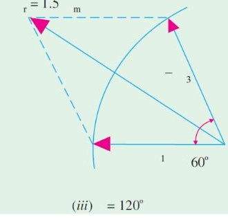

### Important Conclusion

- The magnitude of the resultant flux is of constant value and is equal to $\frac{3}{2} \varphi_m = \mathbf{1.5}$ times the maximum flux due to either phase.
- The resultant flux rotates at **synchronous speed**. [i.e. the interval among 2 conditions is considered as $60^\circ$ and the resultant flux also rotates by $60^\circ$]

### iv. When $\theta = 180^\circ$

$$\varphi_1 = \varphi_m \sin 60^\circ = 0$$
$$\varphi_2 = \varphi_m \sin (0^\circ - 120^\circ) = \frac{\sqrt{3}}{2} \varphi_m$$
$$\varphi_3 = \varphi_m \sin (\theta + 120^\circ) = \frac{-\sqrt{3}}{2} \varphi_m$$

$$\text{Resultant flux, } \varphi_r = \frac{3}{2} \varphi_m$$

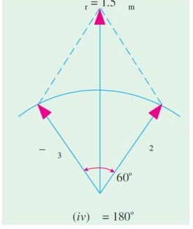

For preparing your answer you can go through the article 34.7 of the book written by **“B. L. Theraza”** or article 8.3 of the book written by **“V. K. Mehta”**
