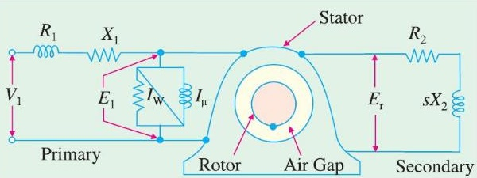
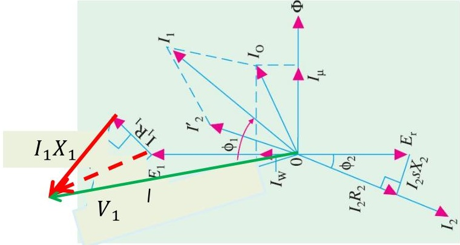
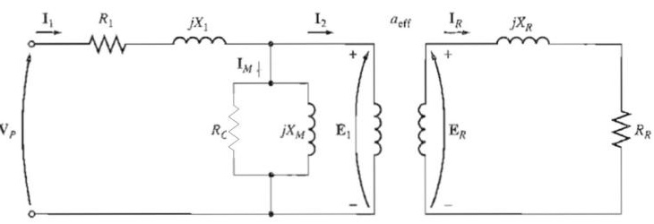
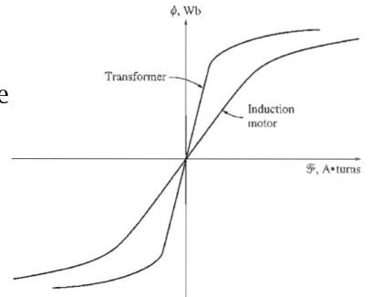
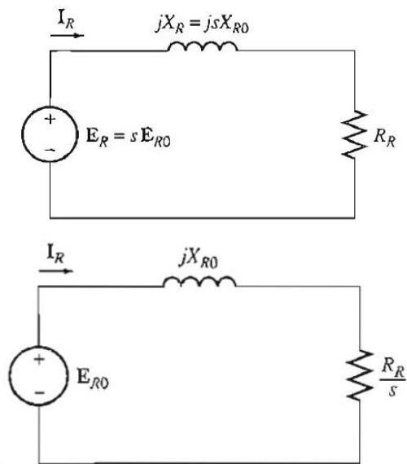
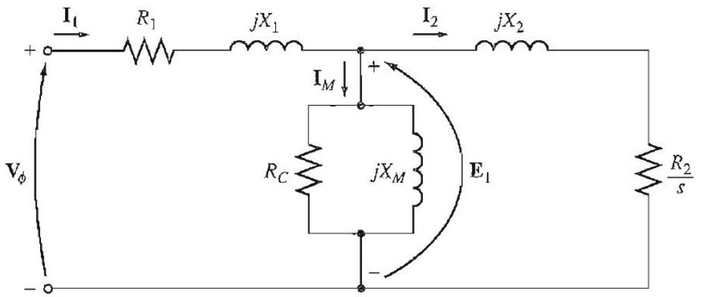

<!-- Slide 1 -->
# Electrical Machines-I
## ECE-2107

#### *Induction Motor-SL2*

**Fariya Tabassum**  
Assistant Professor, Dept. of Electrical & Computer Engineering  
Rajshahi University of Engineering & Technology, Rajshahi-6204

---

<!-- Slide 2 -->
## “Verily, with every difficulty there is relief”.

[Sura Ash-Sharh]

---

<!-- Slide 3 -->
## Synchronous Speed

In motor, the speed of the rotating flux is called synchronous speed. Depending on the motor design, the actual mechanical speed may be **same (synchronous motor)** or slightly **smaller (asynchronous motor)**. It is directly proportional to the supply frequency and inversely proportional to the number of pairs of poles. As poles occur in pair, its mathematical expression is

$$n_s = \frac{f_s}{P/2} = \frac{2 \times f_s}{P} \quad \text{r/s}$$

$$n_s = \frac{120 \times f_s}{P} \quad \text{r/min}$$

---

<!-- Slide 4 -->
## Why Does the Rotor Rotate

The **operating principle** of the 3-$\varphi$ induction motor can be explained as follows:

- When 3-phase stator winding is energized from **3-phase supply**, a rotating magnetic field is set up which rotates round the stator at synchronous speed **Ns (= 120 f/P)**.
- The rotating field passes through the air gap and **cuts** the rotor conductors, which as yet, are stationary. Due to the **relative speed** between the rotating flux and the stationary rotor, e.m.f.s are induced in the rotor conductors. Since the rotor circuit is short-circuited, currents start flowing in the rotor conductors.

---

<!-- Slide 5 -->
## Why the Rotor Rotates

- The **current-carrying** rotor conductors are placed in the **magnetic field** produced by the stator. Consequently, **mechanical force** acts on the rotor conductors. The sum of the mechanical forces on all the rotor conductors produces a torque which tends to move the rotor in the same direction as the rotating field.
- The fact that rotor is urged to follow the stator field (i.e., rotor moves in the direction of stator field) can be explained by Lenz’s law. According to this law, the direction of rotor currents will be such that they tend to oppose the cause producing them. Now, the **cause** producing the rotor currents is the **relative speed** between the rotating field and the stationary rotor conductors. Hence to **reduce** this relative speed, the rotor starts running in the same direction as that of stator field and tries to catch it.

---

<!-- Slide 6 -->
## Rotor Slip

Two terms are commonly used for defining the relative motion of the rotor and the magnetic fields. One is **slip speed** and other is **slip**.

The difference between the synchronous speed of the rotating flux and the speed of the rotor is called **slip speed**.

$$n_{slip} = n_{sync} - n_r$$

where: $n_{slip} =$ slip speed of machine (r/min)  
$n_{sync} =$ synchronous speed of the magnetic fields  
$n_r =$ rotor speed (r/min)

---

<!-- Slide 7 -->
## Rotor Slip

The ratio of the sleep speed to synchronous speed is called **slip**. It is expressed in per-unit or percentage basis.

$$s = \frac{n_{slip}}{n_{sync}} (\times 100\%)$$

$$s = \frac{n_{sync} - n_r}{n_{sync}} (\times 100\%)$$

If the rotor turns at synchronous speed, then $s = 0$, while if the rotor is stationary, then $s = 1$. so, all the normal speed falls between these two limits. Now, the rotor (motor) speed can be written as

$$n_r = n_{sync}(1 - s)$$

---

<!-- Slide 8 -->
## Frequency of Rotor Current

Let at any slip-speed, the frequency of the rotor current be, $f_r$. Then,

$$n_{sync} - n_r = \frac{120 f_r}{P} \quad (1)$$

$$\text{Also, } n_{sync} = \frac{120 f}{P} \quad (2)$$

By dividing equation (1) by (2)

$$\frac{f_r}{f} = \frac{n_{sync} - n_r}{n_{sync}} = s$$

$$f_r = s f$$

**Relation between supply frequency and rotor current frequency**

When the rotor is **stationary** ($s = 1$), the **frequency of rotor current is same** as the **supply frequency**.

For preparing your answer go through the article 34.11 of the book written by **“B. L. Theraza”**

---

<!-- Slide 9 -->
## Problems

Practice example **34.3, 34.4, 34.5** of B. L. Theraza and also the related tutorial problem.

---

<!-- Slide 10 -->
## Vector Diagram of Induction Motor

The transfer of energy from stator to the rotor of an induction motor takes place entirely inductively, with the help of a flux mutually linking the two. Hence, an induction motor is essentially a transformer with stator forming the primary and rotor forming (the short-circuited) rotating secondary and the vector diagram is similar to that of a transformer.

---

<!-- Slide 11 -->
## Vector Diagram of Induction Motor

In the vector diagram $V_1$ is the applied voltage per stator phase, $R_1$ and $X_1$ are the stator resistance and leakage reactance per phase respectively. The applied voltage $V_1$ produces a magnetic flux which links both primary and secondary thereby producing an e.m.f $E_1$ at primary and a mutually induced e.m.f. $E_r$ at secondary. There is no secondary terminal voltage $V_2$ in secondary because whole of the induced e.m.f is used up in circulating the rotor current as the rotor is closed upon itself (equivalent to its being short-circuited).

Now

$$V_1 = E_1 + I_1 R_1 + j I_1 X_1$$

And

$$E_r = I_2 Z_2 = I_2 (R_2 + j s X_2)$$

---

<!-- Slide 12 -->
## Vector Diagram of Induction Motor

In the vector diagram $I_0$ is the no-load primary current. It has two components (i) the working or iron loss component, $I_w$ and (ii) the magnetizing component, $I_\mu$.

$$\text{Obviously } I_0 = \sqrt{\left({I_w}^2 + {I_\mu}^2\right)}$$

For preparing your answer you can go through the article 34.47 of the book written by **“B. L. Theraza”**

---

<!-- Slide 13 -->
## Equivalent Circuit of Induction Motor

Before proceeding recall that an **induction motor** can be treated as a **rotating transformer**, i. e., one in which primary winding is stationary but the secondary is free to rotate.

### The Transformer Model of an Induction Motor:

A transformer (per-phase) equivalent circuit, representing the operation of an induction motor is sown in above figure. As in any transformer, there is a certain **resistance** and **self-inductance** in the primary **(stator)** windings, which must be represented in the equivalent circuit of the machine. The stator resistance will be called $R_1$, and the stator leakage reactance will be called $X_1$. These two components appear right at the input to the machine model.

---

<!-- Slide 14 -->
## Equivalent Circuit of Induction Motor

Also, like any transformer with an iron core, the flux in the machine is related to the integral of the applied voltage $E_1$.

The curve of magnetomotive force versus flux (magnetization curve) for this machine is compared to a similar curve for a power transformer in the figure. Here, the slope of the induction motor's magnetomotive force-flux curve is much shallower than the curve of a good transformer. This is Because there must be an **air gap** in an induction motor, which greatly **increases** the reluctance of the flux path and therefore **reduces** the coupling between primary and secondary windings. The higher reluctance caused by the air gap means that a **higher magnetizing current** is required to obtain a given flux level. Therefore, the magnetizing reactance $X_M$ in the equivalent circuit will have a much **smaller** value than it would in an ordinary transformer.

---

<!-- Slide 15 -->
## Equivalent Circuit of Induction Motor

Also, The primary internal stator voltage $E_1$ is coupled to the secondary $E_R$ by an ideal transformer with an effective turns ratio. The voltage $E_R$ produced in the rotor in turn produces a current which flows in the shorted rotor (or secondary) circuit of the machine. The primary impedances and the magnetization current of the induction motor are very similar to the corresponding components in a transformer equivalent circuit.

An induction motor equivalent circuit **differs** from a transformer equivalent circuit primarily because of the **rotating secondary (rotor)** which have slip.

---

<!-- Slide 16 -->
## Equivalent Circuit of Induction Motor

### Rotor circuit model

In an induction motor, when the voltage is applied to the stator windings, a voltage is induced in the rotor windings of the machine. In general, the **greater the relative motion** between the rotor and the stator magnetic fields, the **greater the resulting rotor voltage** and **rotor frequency**. The **largest** relative motion occurs when the rotor is stationary (**slip=1**), called the locked-rotor or blocked-rotor condition, so the largest voltage and rotor frequency are induced in the rotor at that condition. The smallest voltage (**0 V**) and frequency (**0 Hz**) occur when the rotor moves at the same speed as the stator magnetic field, resulting in **no relative motion**. The magnitude and frequency of the voltage induced in the rotor at any speed between these extremes is directly **proportional** to the **slip** of the rotor.

---

<!-- Slide 17 -->
## Equivalent Circuit of Induction Motor

If the magnitude of the induced rotor voltage at locked-rotor conditions is called $E_{R0}$, the magnitude of the induced voltage at any slip will be given by the equation

$$E_R = s E_{R0}$$

and the frequency of the induced voltage at any slip will be given by the equation

$$f_r = s f$$

This voltage is induced in a rotor containing both resistance and reactance. The rotor resistance $R_R$ is a constant (except for the skin effect), **independent** of slip, while the rotor reactance is affected in a more complicated way by slip. With a rotor inductance of $L_R$, the rotor reactance is given by

$$X_R = \omega_r L_R = 2\pi f_r L_R$$
$$= 2\pi s f L_R$$
$$= s(2\pi f L_R)$$
$$= s X_{R0}$$

where $X_{R0}$ is the blocked-rotor rotor reactance.

---

<!-- Slide 18 -->
## Equivalent Circuit of Induction Motor

The resulting rotor equivalent circuit is shown in the figure.

The rotor Current flow can be found as

$$I_R = \frac{E_R}{R_R + jX_R}$$

$$I_R = \frac{s E_{R0}}{R_R + j s X_{R0}}$$

$$I_R = \frac{E_{R0}}{R_R / s + j X_{R0}}$$

The equivalent rotor impedance from this point of view is

$$Z_{R\text{eq}} = R_R / s + j X_{R0}$$

and the rotor equivalent circuit using this convention is shown in figure

---

<!-- Slide 19 -->
## Equivalent Circuit of Induction Motor

To produce the final per-phase equivalent circuit for an induction motor, it is necessary to refer the rotor part of the model over to the stator side. If the effective turns ratio of an induction motor is $a_{\text{eff}}$, then the transformed rotor voltage becomes

$$E_1 = E'_R = a_{\text{eff}} E_{R0}$$

the rotor current becomes

$$I_2 = \frac{I_R}{a_{\text{eff}}}$$

And the rotor input impedance becomes

$$Z_2 = {a_{\text{eff}}}^2 \left(\frac{R_R}{s} + j X_{R0}\right)$$

Now if the following definitions are made:

$$R_2 = {a_{\text{eff}}}^2 R_R$$
$$X_2 = {a_{\text{eff}}}^2 X_{R0}$$

then the **final per-phase** equivalent circuit of the induction motor is as shown in the following figure

---

<!-- Slide 20 -->
## Equivalent Circuit of Induction Motor

