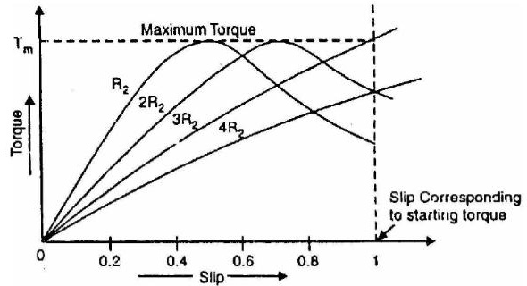
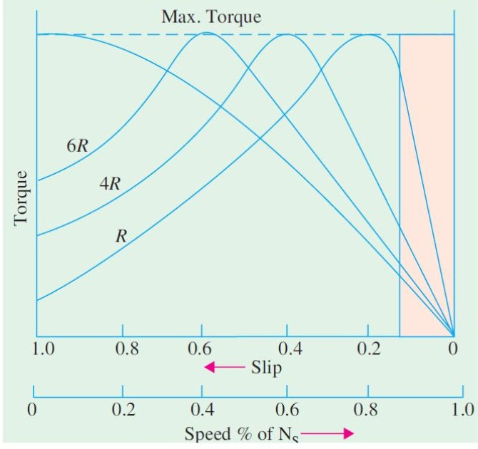

<!-- Slide 1 -->
# Electrical Machines-I
## ECE-2107

#### *Induction Motor-SL3*

**Fariya Tabassum**  
Assistant Professor, Dept. of Electrical & Computer Engineering  
Rajshahi University of Engineering & Technology, Rajshahi-6204

---

<!-- Slide 2 -->
## “Allah does not burden a soul beyond that it can bear”.

[Sura Baqarah]

---

<!-- Slide 3 -->
## Rotor Torque

The torque T developed by the rotor is directly proportional to

- Rotor current
- Rotor e.m.f
- Power factor of the rotor circuit

$$\therefore \quad T \propto E_2 I_2 \cos \varphi_2$$

$$\text{Or } T = K E_2 I_2 \cos \varphi_2$$

Where,  
$I_2 =$ Rotor current at standstill  
$E_2 =$ Rotor e.m.f at standstill  
$\cos \varphi_2 =$ Rotor power factor at standstill

---

<!-- Slide 4 -->
## Starting Torque

The torque developed by the motor at the time of starting is known as **starting torque** of the motor.

Let, $E_2 =$ rotor e.m.f. per phase at **standstill**  
$R_2 =$ rotor resistance per phase  
$X_2 =$ rotor reactance per phase at **standstill**  

$$Z_2 = \sqrt{\left({R_2}^2 + {X_2}^2\right)} = \text{rotor impedance per phase at \textbf{standstill}}$$

$$\text{Then, rotor current } I_2 = \frac{E_2}{Z_2} = \frac{E_2}{\sqrt{\left({R_2}^2 + {X_2}^2\right)}}$$

$$\text{power factor } \cos \varphi_2 = \frac{R_2}{Z_2} = \frac{R_2}{\sqrt{\left({R_2}^2 + {X_2}^2\right)}}$$

$$\text{Now, the starting torque } T_{st} = K_1 E_2 I_2 \cos \varphi_2$$

$$\text{or } T_{st} = K_1 E_2 \frac{E_2}{\sqrt{\left({R_2}^2 + {X_2}^2\right)}} \frac{R_2}{\sqrt{\left({R_2}^2 + {X_2}^2\right)}} = K_1 \frac{{E_2}^2 R_2}{{R_2}^2 + {X_2}^2}$$

---

<!-- Slide 5 -->
## Starting Torque

If the supply voltage is constant, then the flux $\varphi$ and hence $E_2$ both are constant.

$$\therefore \quad T_{st} = K_2 \frac{R_2}{{R_2}^2 + {X_2}^2} = \frac{K_2 R_2}{{Z_2}^2}$$

$$\text{It can be shown that, } K_1 = \frac{3}{2\pi N_s}$$

$$\therefore \quad T_{st} = \frac{3}{2\pi N_s} \frac{{E_2}^2 R_2}{{R_2}^2 + {X_2}^2}$$

Where, $N_s =$ Synchronous speed in r.p.s

For preparing your answer you can go through the article 34.13 of the book written by **“B. L. Theraza”**

---

<!-- Slide 6 -->
## Condition for Maximum Starting Torque

It can be proved that **starting torque** will be maximum when rotor **resistance/phase** is equal to standstill rotor **reactance/phase**.

$$\text{We know the staring torque, } T_{st} = K_2 \frac{R_2}{{R_2}^2 + {X_2}^2} \quad \text{(i)}$$

Differentiating equation (i) w.r.t $R_2$ and equating the result to zero we get,

$$\frac{d T_{st}}{d R_2} = K_2 \left[ \frac{1}{{R_2}^2 + {X_2}^2} - \frac{R_2(2R_2)}{({R_2}^2 + {X_2}^2)^2} \right] = 0$$

$$\text{Or } {R_2}^2 + {X_2}^2 = 2{R_2}^2$$

$$\therefore R_2 = X_2$$

---

<!-- Slide 7 -->
## Problems

Practice example **34.6, 34.7, 34.8, 34.9** and **34.11** of B. L. Theraza and also the related tutorial problem.

---

<!-- Slide 8 -->
## Torque Under Running Conditions

Let the rotor at standstill have per phase induced e.m.f. $E_2$, reactance $X_2$ and resistance $R_2$. Then under running conditions at slip s

$$\text{Rotor e.m.f per phase } E_r = s E_2$$

$$\text{Rotor reactance per phase } X_r = s X_2$$

$$\text{Rotor impedance per phase } Z_r = \sqrt{\left({R_2}^2 + (s X_2)^2\right)}$$

$$\text{Rotor current per phase } I_r = \frac{E_r}{Z_r} = \frac{s E_2}{\sqrt{\left({R_2}^2 + (s X_2)^2\right)}}$$

$$\text{power factor } \cos \varphi_r = \frac{R_2}{Z_r} = \frac{R_2}{\sqrt{\left({R_2}^2 + (s X_2)^2\right)}}$$

---

<!-- Slide 9 -->
## Torque Under Running Conditions

$$\text{Then, running torque } T_r \propto E_r I_r \cos \varphi_r$$

$$T_r \propto \varphi I_r \cos \varphi_r$$

$$\propto \varphi \frac{s E_2}{\sqrt{\left({R_2}^2 + (s X_2)^2\right)}} \frac{R_2}{\sqrt{\left({R_2}^2 + (s X_2)^2\right)}}$$

$$\propto \varphi \frac{s E_2 R_2}{{R_2}^2 + (s X_2)^2}$$

$$= K \varphi \frac{s E_2 R_2}{{R_2}^2 + (s X_2)^2}$$

$$= \frac{K_1 s {E_2}^2 R_2}{{R_2}^2 + (s X_2)^2}$$

If the stator supply voltage is constant, then stator flux and hence $E_2$ will be constant.

---

<!-- Slide 10 -->
## Torque Under Running Conditions

$$\therefore T_r = \frac{K_2 s R_2}{{R_2}^2 + (s X_2)^2}$$

Where, $K_2$ is another constant.

It may be seen that running torque is

- Directly proportional to the slip i.e., if slip increases (motor speed decreases), the torque will increase and vice-versa.
- Directly **proportional** to **square of supply voltage (***)**

---

<!-- Slide 11 -->
## Torque Under Running Conditions

$$\text{It can be shown that, } K_1 = \frac{3}{2\pi N_s}$$

Where, $N_s =$ Synchronous speed in r.p.s

$$\therefore T_r = \frac{3}{2\pi N_s} \frac{s {E_2}^2 R_2}{{R_2}^2 + (s X_2)^2} = \frac{3}{2\pi N_s} \frac{s {E_2}^2 R_2}{{Z_r}^2}$$

$$\text{At standstill, when s=1, } T_r = \frac{K_1 {E_2}^2 R_2}{{R_2}^2 + (s X_2)^2} \left(\text{or } = \frac{3}{2\pi N_s} \frac{{E_2}^2 R_2}{{R_2}^2 + (s X_2)^2}\right)$$

**Same as the starting torque.**

---

<!-- Slide 12 -->
## Condition for Maximum Torque Under Running Conditions

The torque of a rotor under running condition is

$$T_r = K \varphi \frac{s E_2 R_2}{{R_2}^2 + (s X_2)^2} = \frac{K_1 s {E_2}^2 R_2}{{R_2}^2 + (s X_2)^2}$$

The condition for maximum torque may be obtained by differentiating the above expression w.r.t to slip, s and then putting it equal to zero. However, it is simpler to put $Y = \frac{1}{T_r}$ and then differentiate it.

$$\therefore Y = \frac{{R_2}^2 + (s X_2)^2}{K \varphi s E_2 R_2} = \frac{R_2}{K \varphi s E_2} + \frac{s {X_2}^2}{K \varphi E_2 R_2}$$

$$\therefore \frac{dY}{ds} = \frac{-R_2}{K \varphi s^2 E_2} + \frac{{X_2}^2}{K \varphi E_2 R_2} = 0$$

$$\therefore \frac{R_2}{K \varphi s^2 E_2} = \frac{{X_2}^2}{K \varphi E_2 R_2} \text{ or } {R_2}^2 = s^2 {X_2}^2 \text{ or } R_2 = s X_2$$

---

<!-- Slide 13 -->
## Condition for Maximum Torque Under Running Conditions

Hence **torque under running** condition is **maximum** at that slip which makes rotor reactance per phase equal to rotor resistance per phase. This slip is sometimes written as $s_b$ and the maximum torque as $T_b$.

$$\text{The slip corresponding to maximum torque is } s = {}^{R_2}/_{X_2}$$

After putting $R_2 = s X_2$ in the expression of torque, we get

$$T_{max} = \frac{K \varphi s^2 E_2 X_2}{2 s^2 {X_2}^2} \left(\text{or } \frac{K \varphi s E_2 R_2}{2 {R_2}^2}\right)$$

$$\text{Or } T_{max} = \frac{K \varphi E_2}{2 X_2} \left(\text{or } \frac{K \varphi s E_2}{2 {R_2}^2}\right)$$

---

<!-- Slide 14 -->
## Condition for Maximum Torque Under Running Conditions

$$\text{Substituting value of } s = {}^{R_2}/_{X_2} \text{ in another expression of torque, we get}$$

$$T_{max} = K_1 \frac{(R_2 / X_2) {E_2}^2 R_2}{{R_2}^2 + (R_2 / X_2)^2 {X_2}^2} = K_1 \frac{{E_2}^2}{2 X_2}$$

$$\text{Since } K_1 = \frac{3}{2\pi N_s}, \text{ we have } T_{max} = \frac{3}{2\pi N_s} \frac{{E_2}^2}{2 X_2} \text{ N-m}$$

It is evident from the above expression that,

- The value of **rotor resistance does not** alter the value of the **maximum torque** but only the value of **slip** at which it occurs.
- The maximum torque varies inversely as the standstill reactance. Therefore it should be kept as small as possible.
- The **maximum torque** varies directly with the **square of the applied voltage** .
- To obtain maximum torque at starting, the **rotor resistance** must be made equal to rotor **reactance** at standstill.

---

<!-- Slide 15 -->
## Torque-slip characteristics

If a curve is drawn between the torque and slip for a particular value of rotor resistance $R_2$, the graph thus obtained is called torque-slip characteristic.

It shows a family of torque-slip characteristics for a slip-range from s = 0 to s = 1 for various values of rotor resistance.

$$\text{We know that torque, } T = \frac{K \varphi s E_2 R_2}{{R_2}^2 + (s X_2)^2}$$

The following points may be noted carefully

- At s = 0, T = 0 so that torque-slip curve starts from the **origin**.
- At normal speed, slip is small so that $s X_2$ is negligible as compared to $R_2$.

$$\therefore T \propto s / R_2$$
$$\propto s \quad [\text{as } R_2 \text{ is constant}]$$

Hence torque slip curve is a straight line from zero slip to a slip that corresponds to full-load.

---

<!-- Slide 16 -->
## Torque-slip characteristics

As slip increases beyond full-load slip, the torque increases and becomes maximum at $s = R_2 / X_2$. This maximum torque in an induction motor is called **pull-out** torque or **break down** torque.

- As the slip further increases (i.e. motor speed falls) with further increase in motor load, then $R_2$ becomes negligible as compared to $s X_2$ Therefore, for large values of slip

$$T \propto \frac{s}{(s X_2)^2} \propto \frac{1}{s}$$

Thus the torque is now inversely proportional to slip. Hence torque-slip curve is a rectangular hyperbola.

- The maximum torque remains the same and is independent of the value of rotor resistance. Therefore, the addition of resistance to the rotor circuit does not change the value of maximum torque but it only changes the value of slip at which maximum torque occurs.

---

<!-- Slide 17 -->
## Torque-speed characteristics

