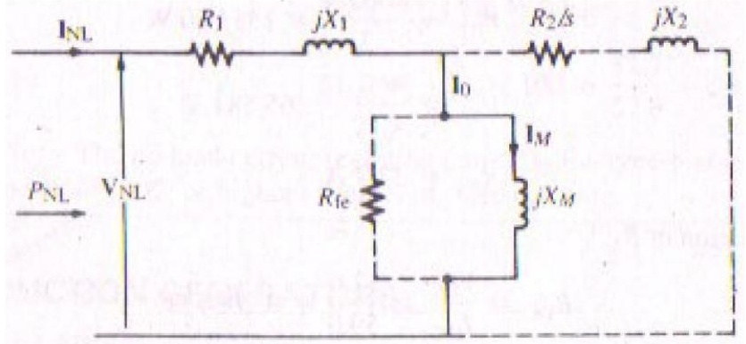
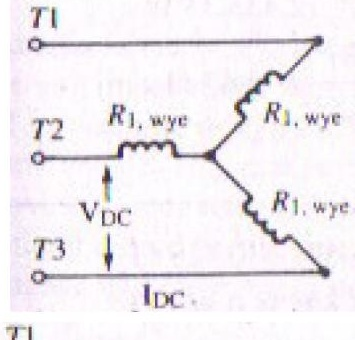
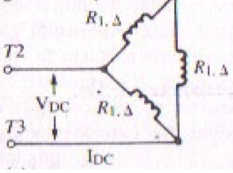

<!-- Slide 1 -->
# Electrical Machines-I
## ECE-2107

### Induction Motor-SL4

**Fariya Tabassum**  
Assistant Professor, Dept. of Electrical & Computer Engineering  
Rajshahi University of Engineering & Technology, Rajshahi-6204

---
<!-- Slide 2 -->
“So which of the favors of your lord would you deny”.

[Sura Ar-Rahman]

---
<!-- Slide 3 -->
# Determining Circuit Model Parameters of Induction Motor

The equivalent circuit of an induction motor is a very useful tool for determining the motor's response to changes in load. The cases where induction motor parameters ($R_1, R_2, X_1, X_2, X_M$) are not readily available from the manufacturer they can be approximated from a DC test, no-load test and blocked-rotor test. The tests must be performed under precisely controlled conditions.

---

<!-- Slide 4 -->
# No-load Test

The no-load test is used to determine the magnetizing reactance $X_M$ and the combined core friction and windage losses. These losses are essentially constant for all load conditions. The power input is measured by two wattmeters, current by an ammeter and voltage by the voltmeter as shown in the following figure.

---

<!-- Slide 5 -->
# No-load Test

At no-load, the operating speed is very close to synchronous speed; the slip is $\approx 0$, causing the current in the $R_2/s$ to be very large. For this reason, the $R_2/s$ branch is drawn with dotted lines as shown in the following figure and omitted from the no-load current calculations.

---

<!-- Slide 6 -->
# No-load Test

Moreover, since $I_M \gg I_{fe}$, $I_o \approx I_M$, thus the $R_{fe}$ is also drawn with dotted lines as shown in the figure and omitted from the no-load current calculations. Referring to the approximate equivalent circuit for the no-load test, the apparent input power per phase is

$$S_{NL} = V_{NL} I_{NL}$$

The reactive power per phase is determined by

$$S_{NL} = \sqrt{P_{NL}^2 + Q_{NL}^2}$$

$$Q_{NL} = \sqrt{S_{NL}^2 - P_{NL}^2}$$

---

<!-- Slide 7 -->
# No-load Test

Expressing the reactive power in terms of current and reactance, and solving for the equivalent reactance at no-load

$$Q_{NL} = I_{NL}^2 X_{NL}$$

Thus

$$X_{NL} = \frac{Q_{NL}}{I_{NL}^2}$$

For the reduced equivalent circuit it can be written that

$$X_{NL} = X_1 + X_M$$

Substituting the value of $X_1$ as determined from the **blocked rotor test**, permits the determination of $X_M$.

---

<!-- Slide 8 -->
# No-load Test

The input power per phase at no load includes the small staror copper loss, core loss and loss due to friction and windage. That is,

$$P_{NL} = I_{NL}^2 R_1 + P_{core} + P_{w,f}$$

---

<!-- Slide 9 -->
# Blocked Rotor Test

It is sometimes known as locked-rotor test. In this test the rotor is locked or blocked so that it cannot move. To perform the locked-rotor test, an ac voltage is applied to the stator, and the current flow is adjusted to be approximately full-load value, When the current is full-load value, the voltage, current, and power flowing into the motor are measured. Since, the rotor is not moving, $\text{slip} = 1$ and so the rotor resistance $R_2/s$ is just equal to $R_2$ (quite a small value). Since $R_2$ and $X_2$ are so small, almost all the input current will flow through them instead of through the much larger magnetizing reactance $X_M$. Therefore the circuit under these conditions looks like a series combination of $R_1$, $X_1$, $R_2$ and $X_2$.

---

<!-- Slide 10 -->
# Blocked Rotor Test

After a test voltage and frequency have been set up, the current flow in the motor is quickly adjusted to about the rated value and the input power voltage and current are measured before the rotor can heat up too much. The input power to the motor is given by

$$P_{in} = \sqrt{3} V_T I_L \cos\theta$$

So the locked rotor power factor can be found as

$$PF = \cos\theta = \frac{P_{in}}{\sqrt{3} V_T I_L}$$

The magnitude of the total impedance in the motor circuit at this time is

$$|Z_{LR}| = \frac{V_{T\phi}}{\sqrt{3} I_L}$$

---

<!-- Slide 11 -->
# Blocked Rotor Test

Again

$$Z_{LR} = R_{LR} + jX'_{LR}$$

$$= |Z_{LR}| \cos\theta + j|Z_{LR}| \sin\theta$$

The locked rotor resistance $R_{LR}$ is equal to $R_{LR} = R_1 + R_2$

While the locked rotor reactance $X'_{LR}$ is equal to $X'_{LR} = X'_1 + X'_2$

Where $X'_1$ and $X'_2$ are the stator and rotor reactances at the test frequency respectively.

The rotor resistance $R_2$ can now be found as

$$R_2 = R_{LR} - R_1$$

Where $R_1$ can be determined from the dc test. The total rotor reactance referred to the stator can also be found. Since the reactance is directly proportional to the frequency, the total equivalent reactance at the normal operating frequency can be found as

$$X_{LR} = \frac{f_{rated}}{f_{test}} (X_1 + X_2)$$

---

<!-- Slide 12 -->
# DC Test for Stator Resistance

The rotor resistance $R_2$ plays an extremely critical role in the operation of an induction motor. Among other things this resistance determines the shape of the torque-speed curve, determining the speed at which the pullout torque occurs. A standard motor test called the locked-rotor test can be used to determine the total motor circuit resistance. However, this test finds only the total resistance. To find out the rotor resistance $R_2$ accurately, it is necessary to know $R_1$ so that it can be subtracted from the total.

There is a test for $R_1$ independent of $R_2$, $X_1$ and $X_2$. This test is called the DC test. Basically, a DC voltage is applied to the stator windings of an induction motor. Because the current is DC, there is no induced voltage in the rotor circuit and no resulting rotor current flows. Also, the reactance of the motor is zero at direct current. Therefore, the only quantity limiting current flow in the motor is the stator resistance, and that resistance can be determined.

---

<!-- Slide 13 -->
# DC Test for Stator Resistance

The purpose of the DC test is to determine $R_1$. This is accomplished by connecting any two stator leads to a variable voltage DC source as shown in the following figure. The DC source is adjusted to provide approximately rated stator current and the resistance between two stator leads is determined from the voltmeter and ammeter readings. Thus

$$R_{DC} = \frac{V_{DC}}{I_{DC}}$$

---

<!-- Slide 14 -->
# DC Test for Stator Resistance

If the stator is Y connected

$$R_{DC} = 2R_{1,\text{wye}}$$

$$R_{1,\text{wye}} = \frac{R_{DC}}{2}$$

If the stator is $\Delta$ connected

$$R_{DC} = \frac{R_{1,\Delta}^2}{3R_{1,\Delta}} + \frac{R_{1,\Delta}^2}{3R_{1,\Delta}}$$

$$R_{DC} = \frac{2R_{1,\Delta}}{3}$$

$$R_{1,\Delta} = 1.5 R_{DC}$$

---

<!-- Slide 15 -->
# Problems

The following data were obtained from no-load, blocked-rotor, and DC tests of a three-phase, wye-connected, 40-hp, 60-Hz, 460-V, design B induction motor whose rated current is 57.8 A. The blocked-rotor test was made at 15 Hz.

| Blocked Rotor | No-Load | DC |
| :--- | :--- | :--- |
| $V_{line} = 36.2\text{ V}$ | $V_{line} = 460.0\text{ V}$ | $V_{DC} = 12.0\text{ V}$ |
| $I_{line} = 58.0\text{ A}$ | $I_{line} = 32.7\text{ A}$ | $I_{DC} = 59.0\text{ A}$ |
| $P_{3\text{ phase}} = 2573.4\text{ W}$ | $P_{3\text{ phase}} = 4664.4\text{ W}$ | |

(a) Determine $R_1, X_1, R_2, X_2, X_M$, and the combined core, friction, and windage loss.  
(b) Express the no-load current as a percent of rated current.

### Solution

(a) Converting the AC test data to corresponding phase values for a wye-connected motor,

$$P_{BR, 15} = \frac{2573.4}{3} = 857.80\text{ W}$$

$$V_{BR, 15} = \frac{36.2}{\sqrt{3}} = 20.90\text{ V}$$

$$I_{BR, 15} = 58.0\text{ A}$$

$$P_{NL} = \frac{4664.4}{3} = 1554.80\text{ W}$$

$$V_{NL} = \frac{460}{\sqrt{3}} = 265.581\text{ V}$$

$$I_{NL} = 32.7\text{ A}$$

#### Determination of $R_1$:

$$R_{DC} = \frac{V_{DC}}{I_{DC}} = \frac{12.0}{59.0} = 0.2034\ \Omega$$

$$R_{1,\text{wye}} = \frac{R_{DC}}{2} = \frac{0.2034}{2} = 0.102\ \Omega/\text{phase}$$

#### Determination of $R_2$:

$$Z_{BR, 15} = \frac{V_{BR, 15}}{I_{BR, 15}} = \frac{20.90}{58.0} = 0.3603\ \Omega$$

$$R_{BR, 15} = \frac{P_{BR, 15}}{I_{BR, 15}^2} = \frac{857.8}{(58)^2} = 0.2550\ \Omega/\text{phase}$$

$$R_2 = R_{BR, 15} - R_{1,\text{wye}} = 0.2550 - 0.102 = 0.153\ \Omega/\text{phase}$$

#### Determination of $X_1$ and $X_2$:

$$X'_{BR, 15} = \sqrt{Z_{BR, 15}^2 - R_{BR, 15}^2} = \sqrt{(0.3603)^2 - (0.255)^2} = 0.2545\ \Omega$$

$$X_{BR, 60} = \frac{60}{15} X'_{BR, 15} = \frac{60}{15}(0.2545) = 1.0182\ \Omega$$

From Table 5.10, for a design B machine,

$$X_1 = 0.4 X_{BR, 60} = 0.4(1.0182) = 0.4073\ \Omega/\text{phase}$$

$$X_2 = 0.6 X_{BR, 60} = 0.6(1.0182) = 0.6109\ \Omega/\text{phase}$$

#### Determination of $X_M$:

$$S_{NL} = V_{NL} I_{NL} = 265.581(32.7) = 8684.50\text{ VA}$$

$$Q_{NL} = \sqrt{S_{NL}^2 - P_{NL}^2} = \sqrt{(8684.50)^2 - (1554.8)^2} = 8544.19\text{ var}$$

$$X_{NL} = \frac{Q_{NL}}{I_{NL}^2} = \frac{8544.19}{(32.7)^2} = 7.99\ \Omega$$

$$X_{NL} = X_1 + X_M \implies 7.99 = 0.4073 + X_M$$

$$X_M = 7.58\ \Omega/\text{phase}$$

#### Determination of combined friction, windage, and core loss:

$$P_{NL} = I_{NL}^2 R_{1,\text{wye}} + P_{core} + P_{f,w}$$

$$1554.8 = (32.7)^2(0.102) + P_{core} + P_{f,w}$$

$$P_{core} + P_{f,w} = 1446\text{ W/phase}$$

(b)

$$\% I_{NL} = \frac{I_{NL}}{I_{rated}} \times 100 = \frac{32.7}{57.8} = 56.6\%$$

*Note: The no-load current (exciting current) of a three-phase induction motor is large, generally 40% or higher in terms of rated current.*
