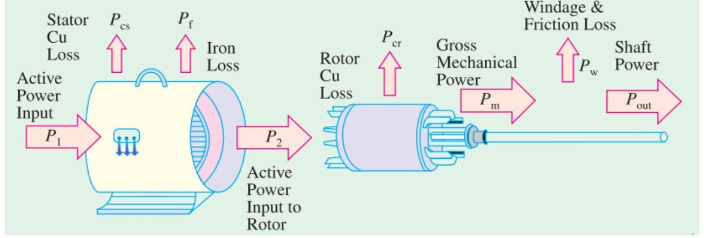
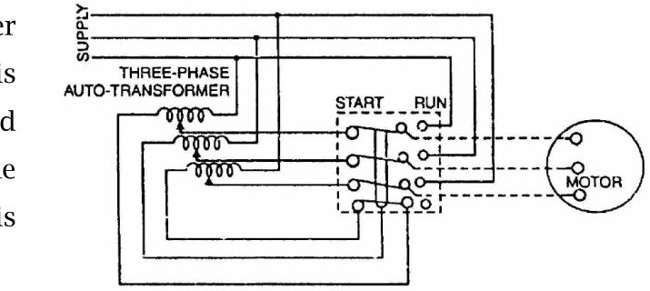
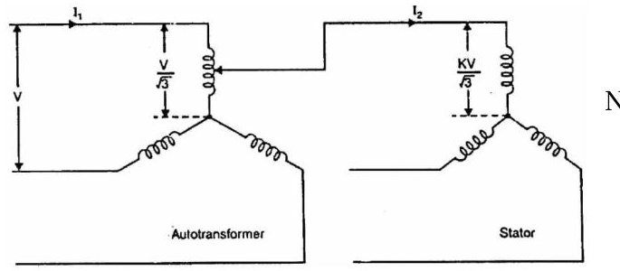
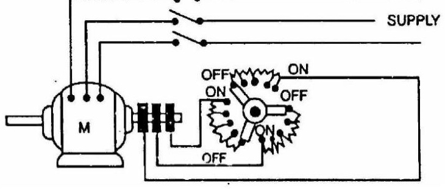

<!-- Slide 1 -->
# Electrical Machines-I
## ECE-2107
### Induction Motor-SL5

**Fariya Tabassum**  
Assistant Professor, Dept. of Electrical & Computer Engineering  
Rajshahi University of Engineering & Technology, Rajshahi-6204

---

<!-- Slide 2 -->
# [Quranic Inscription]

“Truly, Allah is with those who fear him and those who are Muhsinun (good-doers)”.

[Sura An-Nahl]

---

<!-- Slide 3 -->
# Power Stages in an Induction Motor

The input electric power fed to the stator of the motor is converted into mechanical power at the shaft of the motor. The various losses during the energy conversion are:

- **Fixed losses**
  1. Stator iron loss (consisting of **eddy** and **hysteresis** loss)
  2. Friction and windage losss

The **rotor iron loss** is **negligible** because the frequency of rotor currents under normal running condition is small.

- **Variable losses** **see article 7.4+ examle 7.2 of chapman, page 395**
  1. Stator copper loss
  2. Rotor copper loss

---

<!-- Slide 4 -->
# Power Stages in an Induction Motor

The following figure shows how electric power fed to the stator of an induction motor suffers losses and finally converted into mechanical power.

---

<!-- Slide 5 -->
# Power Stages in an Induction Motor

The following points may be noted from the previous diagam

(i) Stator input, $P_i = \text{Stator output} + \text{Stator losses}$  
$= \text{Stator output} + \text{Stator iron loss} + \text{Stator Cu loss}$

(ii) Rotor input, $P_r = \text{Stator output}$

(iii) Mechanical power available, $P_m = P_r - \text{Rotor Cu loss}$  
This mechanical power available is the gross rotor output and will produce a gross torque $T_g$.

(iv) Mechanical power at shaft, $P_{out} = P_m - \text{Friction and windage loss}$  
Mechanical power available at the shaft produces a shaft torque $T_{sh}$.

$$P_m - P_{out} = \text{Friction and windage loss}$$

---

<!-- Slide 6 -->
# Torque Developed by an Induction Motor

The gross torque $T_g$ can be represented by the gross power $P_m$ as follows

$$T_g = \frac{P_m}{\omega} = \frac{P_m}{2\pi N}$$

The shaft torque $T_{sh}$ is due to the output power $P_{out}$ which is less than $P_m$ because of the friction and windage losses.

$$T_{sh} = \frac{P_{out}}{\omega} = \frac{P_{out}}{2\pi N}$$

In the above expressions $N$ is in r.p.s, if it is in r.p.m then the above expressions become

$$T_g = \frac{P_m}{\omega/60} = \frac{60 P_m}{2\pi N} = 9.55 \frac{P_m}{N}\text{ N}-\text{M}$$

$$T_{sh} = \frac{P_{out}}{\omega/60} = \frac{60 P_{out}}{2\pi N} = 9.55 \frac{P_{out}}{N}\text{ N}-\text{M}$$

---

<!-- Slide 7 -->
# Rotor Output

From the figure at slide no. 4,  
Stator input, $P_1 = \text{Stator output} + \text{Stator losses}$  
Obviously, rotor input, $P_2 = \text{Stator output}$  
Rotor gross output, $P_m = \text{rotor input, } P_2 - \text{Rotor Cu loss}$  
This rotor output is converted into mechanical energy and gives rise to gross torque, $T_g$. Out of this gross torque developed, some is lost due to windage and friction losses in the rotor and the rest appears as useful or shaft torque $T_{sh}$.

$$T_g = \frac{P_m}{2\pi N} \quad (1)$$

If there were no copper losses in the rotor then rotor output will equal rotor input and the rotor will run at synchronous speed.

$$T_g = \frac{P_2}{2\pi N_s} \quad (2)$$

---

<!-- Slide 8 -->
# Rotor Output

Rotor gross output, $P_m = T_g\omega = T_g \times 2\pi N$  
Rotor input, $P_2 = T_g\omega_s = T_g \times 2\pi N_s \quad (3)$  
The difference of these two equals rotor Cu loss  
$\therefore \text{Rotor Cu loss} = P_2 - P_m = T_g \times 2\pi(N_s - N) \quad (4)$  
From (3) and (4)

$$\frac{\text{Rotor Cu loss}}{\text{Rotor input}} = \frac{(N_s - N)}{N_s} = s$$

$\text{Rotor Cu loss} = s \times \text{Rotor input} = s P_2$  
$\text{Also rotor input} = \text{rotor Cu loss}/s$  
Rotor gross output, $P_m = \text{input, } P_2 - \text{rotor Cu loss} = P_2 - sP_2 = P_2(1 - s)$

$$\frac{\text{Rotor gross output, } P_m}{\text{Rotor input, } P_2} = 1 - s = \frac{N}{N_s}$$

---

<!-- Slide 9 -->
# Rotor Output

$$\text{Rotor efficiency} = \frac{N}{N_s} = 1 - s$$

Hence the approximate efficiency of an induction motor is $1 - s$. Thus if the slip of an induction motor is 0.125, then its approximate efficiency is $= 1 - 0.125 = 0.875$ or 87.5%.

Is some power $P_2$ is delivered to a rotor then, a part $sP_2$ is lost in the rotor itself as Cu loss (and appears as heat) and the remaining $(1 - s)P_2$ appears as gross mechanical power $P_m$ (including friction and windage losses).

$$\therefore P_2 : P_m : I^2 R \quad \text{or} \quad 1 : (1 - s) : s$$

---

<!-- Slide 10 -->
# Synchronous Watt

$$T_{sw} = \frac{\text{Rotor input, } P_2}{2\pi N_s}$$

Synchronous watt is that which, at the synchronous speed of machine under consideration would develop a power of 1 watt.

By defining a new unit of torque we can say that the rotor torque equals rotor input. The new unit is synchronous watt. When we say that a motor is developing a torque of 1,000 synchronous watts, we mean that the rotor input is 1,000 watt and that the torque is such that power developed would be 1,000 watts provided that the rotor was running synchronously and developing the same torque.

---

<!-- Slide 11 -->
# Starting of Induction Motor

**Go for the article 35.9 of the book written by B. L. Theraza**

---

<!-- Slide 12 -->
# Direct Switching or Line Starting of Induction Motor

With a current as great as **7 times** the full-load current, the motor develops a **starting torque** which is only **1.96 times** the full load value.

**Go for the article 35.10 of the book written by B. L. Theraza**

---

<!-- Slide 13 -->
# Starting Methods of Induction Motor

- **Squirrel-cage Motors**
  1. Primary resistors (or rheostat) or reactors
  2. Auto-transformer (or autostarter)
  3. Star-delta switches

In all of these methods the **terminal voltage** of the squirrel-cage motor **is reduced** during starting

- **Slip-ring Motors**
  1. Rotor rheostat

---

<!-- Slide 14 -->
# Starting of Squirrel-cage Motor

### Primary resistors

**Relation between starting and full load torque:**

The ratio of starting torque to full load torque is $x^2$ of that obtained with direct switching or across the line starting. This method is useful for the smooth starting of small machines only.

**Go for the article 35.11 (a) of the book written by B. L. Theraza**

---

<!-- Slide 15 -->
# Starting of Squirrel-cage Motor

### Auto-transformer

This method aims at connecting the induction motor to a reduced supply at starting and then connecting it to the full voltage as the motor picks up sufficient speed. Following Figure shows the circuit arrangement for autotransformer starting. The tapping on the autotransformer is so set that when it is in the circuit, 65% to 80% of line voltage is applied to the motor.

At the instant of starting, the change-over switch is thrown to “start” position. This puts the autotransformer in the circuit and thus reduced voltage is applied to the circuit. Consequently, starting current is limited to safe value.

---

<!-- Slide 16 -->
# Starting of Squirrel-cage Motor

When the motor attains about 80% of normal speed, the changeover switch is thrown to “run” position. This takes out the autotransformer from the circuit and puts the motor to full line voltage. Autotransformer starting has several advantages viz low power loss, low starting current and less radiated heat. For large machines (over 25 H.P.), this method of starting is often used. This method can be used for both star and delta connected motors.

### Relation between starting and full load torque:

Let us consider a star-connected squirrel-cage induction motor. If $V$ is the line voltage, then voltage across motor phase on direct switching is $V/\sqrt{3}$ and starting current is $I_{st} = I_{sc}$. In case of autotransformer, if a tapping of transformation ratio $K$ (a fraction) is used, then phase voltage across motor is $KV/\sqrt{3}$ and $I_{st} = K I_{sc}$

---

<!-- Slide 17 -->
# Starting of Squirrel-cage Motor

Now

$$\frac{T_{st}}{T_f} = \left(\frac{I_{st}}{I_f}\right)^2 \times s_f = \left(\frac{K I_{sc}}{I_f}\right)^2 \times s_f = K^2 \left(\frac{I_{sc}}{I_f}\right)^2 \times s_f$$

$$\therefore \frac{T_{st}}{T_f} = K^2 \left(\frac{I_{sc}}{I_f}\right)^2 \times s_f$$

**Practice example 34.10 of B. L. Theraza and also the related tutorial problem.**

---

<!-- Slide 18 -->
# Starting of Squirrel-cage Motor

### Star-delta starting

**Relation between starting and full load torque:**

$$\frac{T_{st}}{T_f} = \frac{1}{3} \left(\frac{I_{sc}}{I_f}\right)^2 \times s_f$$

The star-delta switch is equivalent to an autotransformer of ratio $1/\sqrt{3}$ or **58%** approximately.

**Go for the article 35.11 (c) of the book written by B. L. Theraza**

---

<!-- Slide 19 -->
# Starting of Slip-ring Motor

### Rotor rheostat

Slip-ring motors are invariably started by rotor resistance starting. In this method, a variable star-connected rheostat is connected in the rotor circuit through slip rings and full voltage is applied to the stator winding as shown in figure.

---

<!-- Slide 20 -->
# Starting of Slip-ring Motor

1) At starting, the handle of rheostat is set in the OFF position so that maximum resistance is placed in each phase of the rotor circuit. This reduces the starting current and at the same time starting torque is increased.

2) As the motor picks up speed, the handle of rheostat is gradually moved in clockwise direction and cuts out the external resistance in each phase of the rotor circuit. When the motor attains normal speed, the change-over switch is in the ON position and the whole external resistance is cut out from the rotor circuit.
