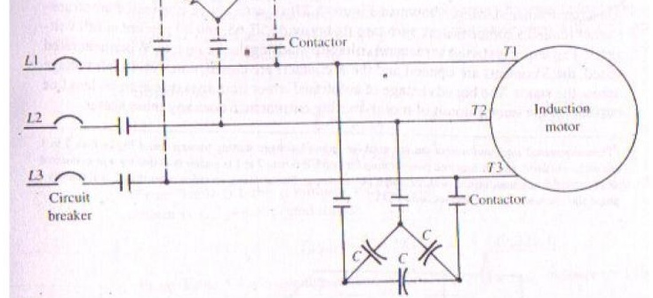
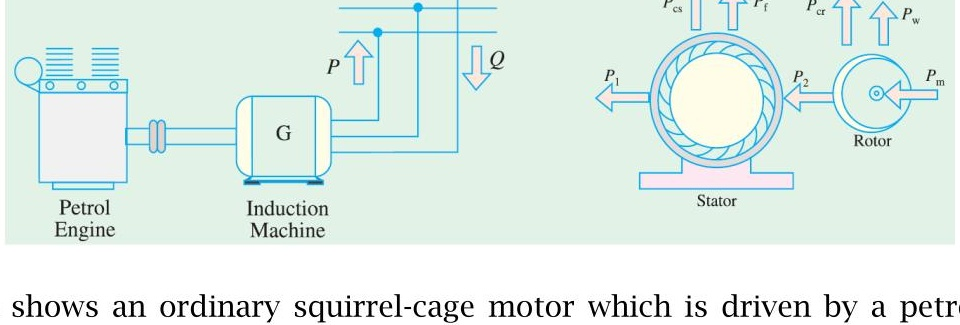
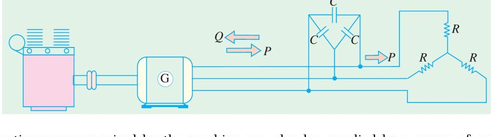
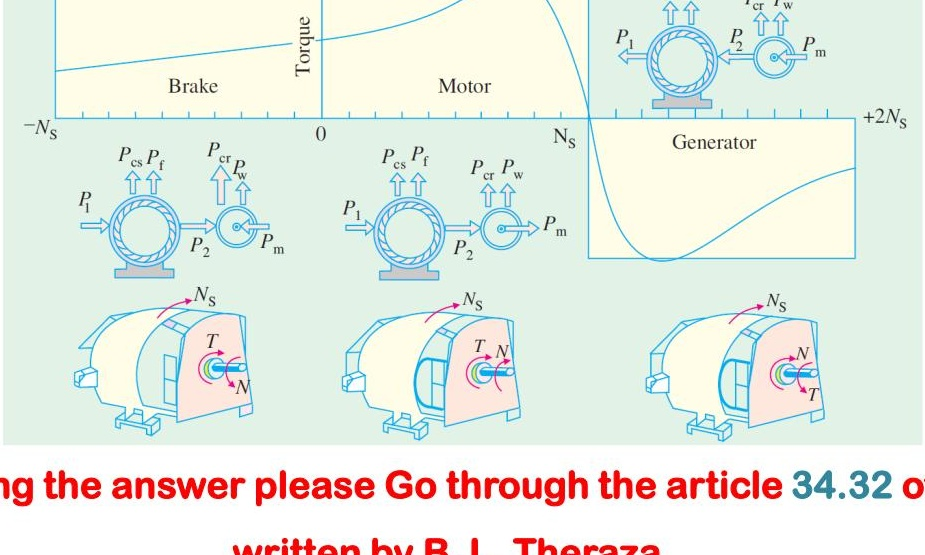
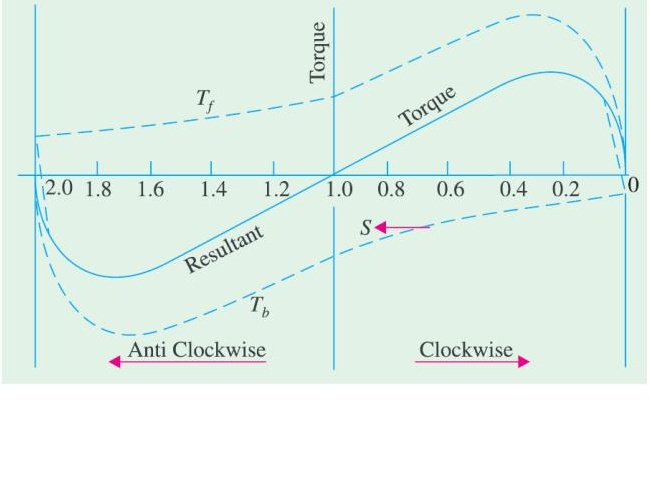
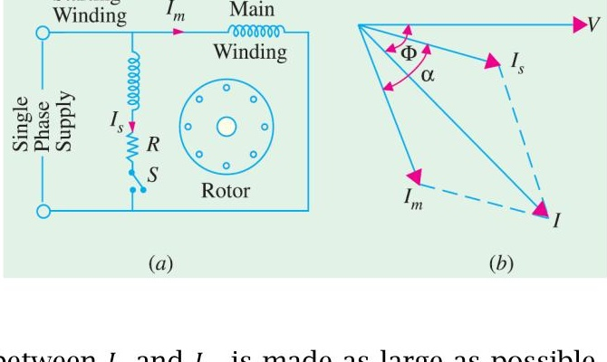
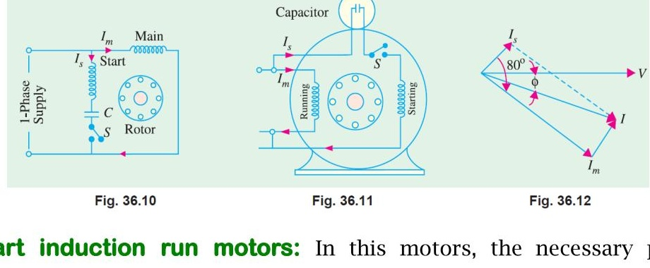
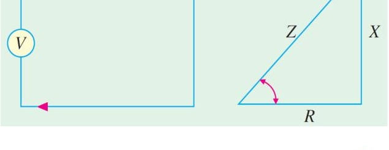
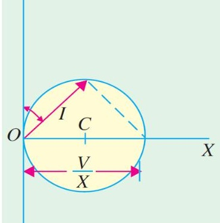

<!-- Slide 1 -->
# Electrical Machines-I
## ECE-2107
### Induction Motor-SL6

**Fariya Tabassum**  
Assistant Professor, Dept. of Electrical & Computer Engineering  
Rajshahi University of Engineering & Technology, Rajshahi-6204

---

<!-- Slide 2 -->
# [Quranic Inscription]

“He (Allah) grants Hikmah (wisdom) to whom He pleases”.

[Sura Al-Baqarah]

---

<!-- Slide 3 -->
# Speed Control of Induction Motor

- **Control from stator side**
  1. By changing the applied voltage
  2. By changing the applied frequency
  3. By changing the number of stator poles

- **Control from rotor side**
  1. Rotor rheostat control
  2. By operating two motors in concatenation or cascade
  3. By injecting an e.m.f in the rotor circuit

---

<!-- Slide 4 -->
# Speed Control of Induction Motor

**Go through the article 35.18 of the book written by B. L. Theraza for the brief description of each method**

---

<!-- Slide 5 -->
# Problems

Practice example **35.29** and **35.30** of B. L. Theraza and also the related tutorial problem.

---

<!-- Slide 6 -->
# Dynamic Braking of Induction Motor

Dynamic braking is the slowing down of a machine by converting the kinetic energy stored in the rotating mass to heat energy in the rotor and/or stator windings. To do this, the motor is switched from the line to a braking circuit that causes the motor to behave as a **generator** with a connected load; the load is the resistance of the rotor and/or stator windings. Dynamic braking of induction motors may be accomplished by **DC injection** and/or **capacitor braking**

**This type of braking does not provide holding torque at the end of the braking period, hence, where required a mechanical brake must be used to hold the shaft.**

---

<!-- Slide 7 -->
# DC injection

In DC injection the motor is disconnected from the line and a **DC source** supplied by a **rectifier** is then connected to any **two** terminals of the **stator** through a **current limiting resistor**. The direct current in the stator winding sets up a stationary magnetic field that generates a voltage in the windings of the spinning rotor. The resultant current in the closed loops formed by the rotor dissipates the **rotational** energy as $I^2R$ losses, rapidly slowing the rotor. The rate of the deceleration by DC injection may be adjusted by adjusting the resistor or by using a thyristor control circuit in place of the resistor.

---

<!-- Slide 8 -->
# Capacitor Braking

In capacitor braking the motor is disconnected from the line and the capacitor bank is then connected to the stator terminals, as shown in the figure. When braking, the motor behaves as a self-excited induction generator. During capacitive braking the rotational energy is dissipated as $I^2R$ losses in both **stator** and **rotor** windings. The braking effect can be increased by adding a resistor as shown with dotted lines.

---

<!-- Slide 9 -->
# Plugging of an Induction Motor

An induction motor can be quickly stopped by simply **inter-changing** any of its **two** stator leads. It **reverses** the **direction** of the revolving flux which produces a torque in the **reverse** direction, thus applying brake on the motor. During this **plugging** period, the motor acts as a **brake**. The associated power is dissipated as heat in the **rotor**. At the same time the rotor also continues to receive power from stator which is also dissipated as heat. Consequently, plugging produces **large** rotor $I^2R$ losses.

---

<!-- Slide 10 -->
# Induction Motor operating as Generator

When run faster than its synchronous speed, an induction motor runs as a generator called Induction generator.

It converts mechanical energy into electrical energy and this energy is **released** by the **stator**. In induction generator applications, however, where the machine is not started as motor and hence does not require a high starting torque, induction generators are generally designed with lower resistance values to provide lower slip and a higher efficiency at rated load. Induction generators are suitable for operation by wind turbines, hydraulic turbines, steam turbines, gas engines powered by natural gas or biogas. They can range in size from a few kilowatts to 10 MW or higher.

---

<!-- Slide 11 -->
# Induction Motor operating as Generator

The Figure shows an ordinary squirrel-cage motor which is driven by a petrol engine and is connected to a 3-phase line. As soon as motor speed exceeds its synchronous speed, it starts delivering active power, $P$ to the 3-phase line. However for creating its own magnetic field, it absorbes reactive power, $Q$ from the line to which it is connected. The active power is directly proportional to slip above the synchronous speed. The reactive power required by the machine can also be supplied by a group of capacitors connected across its terminals.

---

<!-- Slide 12 -->
# Induction Motor operating as Generator

The reactive power required by the machine can also be supplied by a group of capacitors connected across its terminals. This arrangement can be used to supply a 3-phase load without using an external source. The frequency generated is slightly less than that corresponding to the speed of rotation. The terminal voltage increases with capacitance. If capacitance is insufficient, the generator voltage will not build up. Hence capacitor bank must be large enough to supply the reactive power normally drawn by the motor.

---

<!-- Slide 13 -->
# Complete Torque/speed curve of a three-phase machine

**For preparing the answer please Go through the article 34.32 of the book written by B. L. Theraza**

---

<!-- Slide 14 -->
# Problems

Practice example **34.26** of B. L. Theraza and also the related tutorial problem.

---

<!-- Slide 15 -->
# Single Phase Induction Motor

When fed from a single-phase supply, its stator winding produces a flux / field which is only alternating i.e. one which alternates along one space axis only. It is not a synchronously revolving or rotating flux as in the case of two or three phase stator winding fed from a two or three phase supply. But an alternating or pulsating flux acting on a stationary rotor cannot produce rotation. That is why a single phase motor is **not self starting**.

---

<!-- Slide 16 -->
# Single Phase Induction Motor

The Figure shows both the forward and backward torques along with the resultatn torque for slip between 0 and +2. At standstill, $s=1$ at that time $T_f$ and $T_b$ are numerically equal but being oppositely directed produce no resultant torque. That explains why there is no starting torque in a single phase induction motor.

However, if the rotor is started somehow, say, in the clock-wise direction, the clock-wise torque starts increasing and at the same time the anticlockwise torque starts decreasing. Hence there is a certain amount of net torque in the clockwise direction which accelerates the motor to full speed.

---

<!-- Slide 17 -->
# Making Single Phase Induction Motor Self-staring

As single phase induction motor is not self starting, to overcome this drawback and make the motor self-starting, it is temporarily converted into a **two phase** motor during starting period. For this purpose, the stator of single phase motor is provided with an **extra winding**, known as **starting** or **auxiliary** winding in addition to the **main** or **running** winding. The two windings are spaced $90^\circ$ electrically apart and are connected in parallel across the single phase supply.

It is so arranged that the phase difference between the currents in the two stator windings is very large (ideal value being $90^\circ$). Hence, the motor behaves like a two phase motor. These two currents produce a revolving flux and hence make the motor self-starting.

---

<!-- Slide 18 -->
# Making Single Phase Induction Motor Self-staring

### Split-phase machine:

in split-phase machine as shown in the figure (a) the main winding has low resistance but high reactance whereas the starting winding has a high resistance but low reactance. Hence, as shown in figure (b), the current $I_s$ drawn by the starting winding lags behind the applied voltage $V$ by a small angle whereas current $I_m$ taken by the main winding lags behind $V$ by a very large angle. Phase angle between $I_s$ and $I_m$ is made as large as possible because the starting torque of a split-phase motor is proportional to $\sin\alpha$.

---

<!-- Slide 19 -->
# Making Single Phase Induction Motor Self-staring

### Capacitor start induction run motors:

In this motors, the necessary phase difference between $I_s$ and $I_m$ is produced by connecting a capacitor in series with the starting winding as shown in Figure 36.10. the capacitor is generally of the electrolytic type and is usually mounted on the outside of the motor as a separate unit (Figure 36.11).

---

<!-- Slide 20 -->
# Making Single Phase Induction Motor Self-staring

As shown in Figure 36.12, current $I_m$ drawn by the main winding lags the supply voltage $V$ by a large angle whereas $I_s$ leads $V$ by a certain angle. The two currents are out of phase with each other by about $80^\circ$ (for a 200-W 50 Hz motor) as compared to nearly $30^\circ$ for a split-phase motor. Their resultant current $I$ is small and is almost in phase with $V$ as shown in Figure 36.12. Since the torque developed by a split-phase motor is proportional to the sine of the angle between $I_s$ and $I_m$, it is obvious that the increase in the angle (from $30^\circ$ to $80^\circ$) alone increases the starting torque to nearly twice the value developed by a standard split-phase induction motor.

---

<!-- Slide 21 -->
# Making Single Phase Induction Motor Self-staring

### Capacitor start and run motor:

This motor is similar to the capacitor start motor except that the starting winding and capacitor are connected in the circuit at all times. The advantages of leaving the capacitor permanently in the circuit are

i. Improvement of over load capacity of the motor  
ii. A higher power factor  
iii. Higher efficiency and  
iv. Quieter running of the motor which is so much desirable for small power drives in offices and laboratories.

Some of these motors which start and run with one value of capacitance in the circuit are called single-value capacitor run motors. Other which start with high value of capacitance but run with low value of capacitance are known as two-value capacitor run motors.

---

<!-- Slide 22 -->
# Circle Diagram

A circle diagram is a graphical representation of the performance of an electrical machine. It is commonly used to illustrate the performance of transformer, alternators, synchronous motors and induction motors.

### Circle Diagram for a Series Circuit:

It will be shown that the end of the **current** vector is a **circle** for a series circuit with constant reactance and voltage but has a variable resistance.

$$\text{Now } I = \frac{V}{Z} = \frac{V}{\sqrt{R^2+X^2}}$$

$$= \frac{V}{X} \times \frac{X}{\sqrt{R^2+X^2}} = \frac{V}{X}\sin\varphi$$

---

<!-- Slide 23 -->
# Circle Diagram

The equation of rotor circuit current is

$$I_r = \frac{E_{BR}}{Z_{r/s}} = \frac{E_{BR}}{\sqrt{(R_r/s)^2 + X_{BR}^2}} = \frac{E_{BR}}{X_{BR}}\sin\theta_r$$

The above equation is the polar equation for a circle that is tangent to the horizontal axis at the origin and whose diameter is $\frac{E_{BR}}{X_{BR}}$

---

<!-- Slide 24 -->
# Problems

Practice example **35.3**, **35.5**, **35.6**, **35.8**, **35.9** of B. L. Theraza and also the related tutorial problem.
