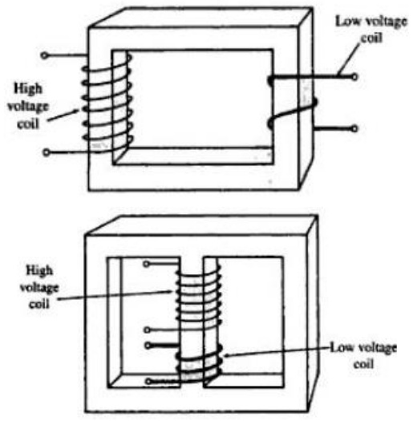
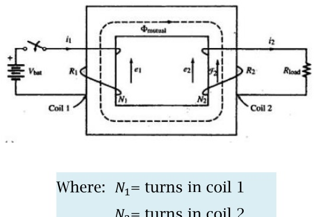
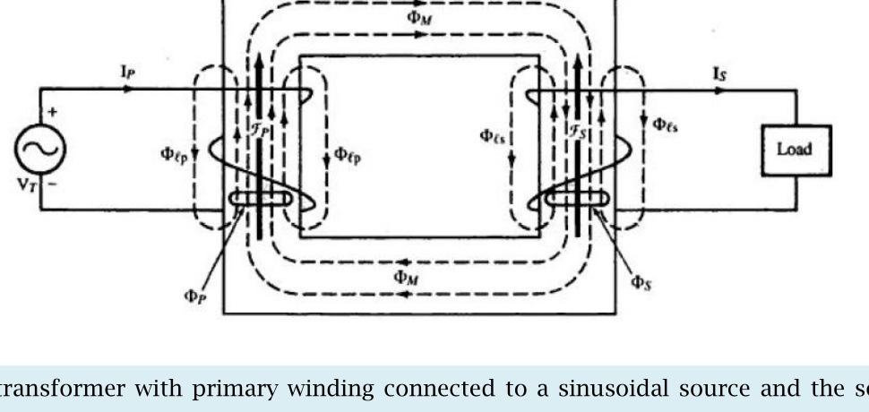

<!-- Slide 1 -->
# Electrical Machines-I
## ECE-2107
### Transforer-SL1

**Fariya Tabassum**  
Assistant Professor, Dept. of Electrical & Computer Engineering  
Rajshahi University of Engineering & Technology, Rajshahi-6204

---

<!-- Slide 2 -->
# [Quranic Inscription]

“Never have I been in my supplication to You, my lord, unhappy”.

[Sura Maryam]

---

<!-- Slide 3 -->
# Transformer
## Study Materials

- Direct and Alternating Current Machinery  
  **Rosenblatt, Friedman**

---

<!-- Slide 4 -->
# Transformer

Transformer is a device for **transferring** electrical **energy** from one circuit to another **without** a change in **frequency**.

---

<!-- Slide 5 -->
# Transformer
## Uses

- They are used to **raise** or **lower** **voltage** in AC transmission and distribution systems
- Are used to provide **reduced** voltage at the **starting** of AC **motors**
- Are used to **isolate** one **electric circuit** from another
- Are used to **superimpose** an **alternating** voltage on a DC circuit
- Are used to provide **low voltage** for **solid** state control
- Are used for **impedance matching** purpose in communication network

---

<!-- Slide 6 -->
# Power Transformer

**High Voltage Side:**  
The coils are wound with a **greater** number of **turns** of smaller cross-section conductor

**Low Voltage Side:**  
The coils are wound with a **small** number of **turns** of large cross-section conductor

**Core:**  
The core material is made of nonaging, cold-rolled, **high-permeability** silicon steel **laminations**; each lamination is insulated with a varnish or oxide coating to reduce **eddy** currents. The coils are wound with insulated aluminum conductor or insulated copper conductor, depending on design considerations.

**Cooling:**  
Cooling is provided by air convection, forced air, insulating liquids or gas.

---

<!-- Slide 7 -->
# Power Transformer

**There are two basic types of transformer used for power and distribution application**

**Core type:** The primary and secondary coils wound on **different** legs. The wider spacing between primary and secondary in this type transformer gives advantages in **high-voltage** applications.

**Shell type:** Both the primary and secondary coils wound on the **same** leg. It has the advantage of **less leakage** flux

---

<!-- Slide 8 -->
# Efficiency of Transformer

The **transformer** accomplishes the **change** in **voltage** **without** the use of **moving parts** and therein lies its great advantage. The **cost** per kilowatt is comparatively **low** and the **efficiency** is **high**. As a matter of fact, the transformer is the most efficient piece of electrical machinery and **efficiencies** of **98** and **99** percent are no at all uncommon. Another important consideration is that, since there are **no moving** parts, **maintenance** is simpler and cheaper and the required insulation for the **extremely high voltages** obtained can more easily be constructed.

---

<!-- Slide 9 -->
# Principle of Transformer Action

### Transformer with transient DC input:

Where:  
$N_1 = \text{turns in coil 1}$  
$N_2 = \text{turns in coil 2}$

The coil 1 is connected to a battery through a switch and coil 2 is connected to a resistor. Closing the switch causes a clockwise buildup of flux in the iron core, generating a **voltage** in each coil that is **proportional** to

- **the number of turns in the coil**
- **The rate of change of flux through the respective coils.**

Assuming no leakage, the same flux (mutual flux) exists in both coils. Thus,

$$e_1 = N_1 \frac{d\varphi}{dt}$$

$$e_2 = N_2 \frac{d\varphi}{dt}$$

---

<!-- Slide 10 -->
# Principle of Transformer Action

### Transformer with transient input:

### Direction finding:

In accordance with Lenz’s law, the voltage generated in each coil will be induced in a direction that opposes the action that caused it.

The induced emf in coil 1 must be opposite in direction to the battery voltage. This opposing voltage, shown as $e_1$ is called counter-emf (cemf)

For coil 2, the induced emf and associated current must be in a direction that will develop a counterclockwise mmf to oppose the buildup of flux in its window. Thus, with the direction of mmf known, the direction of induced emf and associated current may be determined by applying the right-hand rule to coil 2.

---

<!-- Slide 11 -->
# Principle of Transformer Action

### Transformer with transient input:

### Important Note:

“The induced emfs and secondary current in the figure are transients. When $\varphi_{mutual}$ reaches steady state, $\frac{d\varphi}{dt} = 0$, the induced $emfs = 0$ and $i_2 = 0$”

---

<!-- Slide 12 -->
# Principle of Transformer Action

Watch the attached video termed as  
**“Transformers working & 3 phase transformer”**

---

<!-- Slide 13 -->
# Principle of Transformer Action

### Transformer with sinusoidal input:

Figure shows a transformer with primary winding connected to a sinusoidal source and the secondary winding connected to a load. The currents and voltages are expressed as phasors. The direction of the induced voltages are determined as the same manner.

---

<!-- Slide 14 -->
# Principle of Transformer Action

### Transformer with sinusoidal input:

The following assumptions are made:

- The permeability of the core is constant over the range of transformer operation and thus reluctance of the core is constant
- There is no leakage flux, hence the same flux links both primary and secondary windings.

The voltage induced in the primary and secondary windings by the sinusoidal variation of flux in the respective coil, expressed in terms of rms values, are

$$E_p = 4.44 N_p f \varphi_{max}$$

$$E_s = 4.44 N_s f \varphi_{max}$$

Dividing the above two equations

$$\frac{E_p}{E_s} = \frac{N_p}{N_s}$$

Where:  
$E_p = \text{voltage induced in primary (V)}$  
$E_s = \text{voltage induced in secondary (V)}$  
$N_p = \text{turns in primary coil}$  
$N_s = \text{turns in secondary coil}$

**For preparing answer please go through Book written by “HUBERT” chapter 1, section 1.12**
