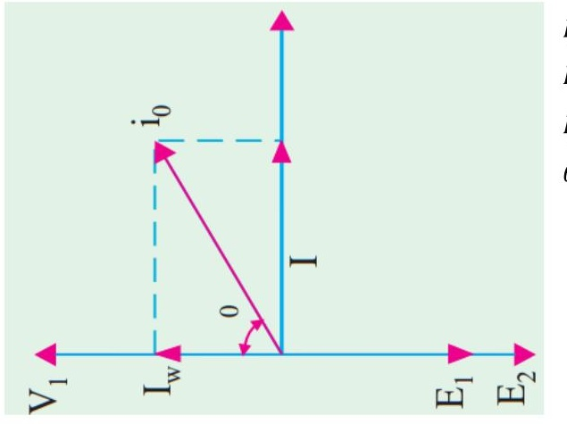
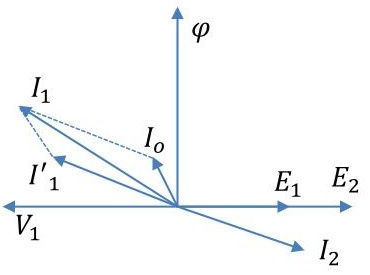

<!-- Slide 1 -->
# Electrical Machines-I
## ECE-2107
### Transforer-SL2

**Fariya Tabassum**  
Assistant Professor, Dept. of Electrical & Computer Engineering  
Rajshahi University of Engineering & Technology, Rajshahi-6204

---

<!-- Slide 2 -->
# [Quranic Inscription]

“Guide us to the straight path—”.

[Sura Fatihah]

---

<!-- Slide 3 -->
# Transformer Construction

Go through the article **32.2, 32.3, 32.4** of the book written by **B. L. Theraza** to have a look at the transformer construction.

---

<!-- Slide 4 -->
# Transformer Phasor Diagram

Two cases are consider
- When transformer is on no load
- When it is loaded

> When an actual transformer is put on load, there is iron loss in the core and copper loss in the windings (both primary and secondary) and these losses are not entirely negligible. Even when the transformer is on no-load, the primary input current is not **wholly reactive**.

---

<!-- Slide 5 -->
# Transformer Phasor Diagram

### No load condition

$I_0 = \text{Energizing current/ primary input current}$  
$I_w = \text{Iron loss current}$  
$I_\mu = \text{magnetizing current}$  
$\theta_0 = \text{No load power factor angle}$

---

<!-- Slide 6 -->
# Transformer Phasor Diagram

### No load condition

No-load input power $W_0 = V_1 I_0 \cos\theta_0$  
Iron loss current $I_w = I_0 \cos\theta_0$  
magnetizing current $I_\mu = I_0 \sin\theta_0$

**For preparing your answer you can go through the article 14.5 of the book written by “Rosenblatt”**

---

<!-- Slide 7 -->
# Transformer Phasor Diagram

### No load condition

The followings should be noted:

- The no-load primary current $I_0$ is very small as compared to the full-load primary current. It is about **1 %** of the **full-load** current.
- As the permeability of the core varies with the instantaneous value of the exciting current, the wave of the exciting or magnetizing **current** is not **truly sinusoidal** and should not be represented by a **vector**.

---

<!-- Slide 8 -->
# Transformer Phasor Diagram

### No load condition

- As $I_0$ is very **small**, the no-load primary **Cu loss** is negligibly **small** which means that no-load primary input is practically equal to the iron loss in the transformer.
- As it is principally the **core-loss** which is responsible for **shift** in the current vector, angle $\theta_0$ is known as hysteresis angle of advance.

---

<!-- Slide 9 -->
# Problems

Practice example **14.4** of **Rosenblatt** and **32.9** of B. L. **Theraza** and also the related tutorial problem.

---

<!-- Slide 10 -->
# Transformer Phasor Diagram

### Loaded condition

- When **load** is applied to the **secondary** terminals, in accordance with the Lenz’s law, the current that flows through the windings must act in such a direction as to **oppose** the flux set up by the **primary current**.
- When the flux is momentarily **reduced**, the induced **emf** in the **primary** winding is also **reduced** and as a result **more current** flows in the **primary** winding.
- The **increased primary current** will cause the flux to increase to its **original** value. When more load current flows in the secondary, the process is repeated and the primary current will again increase.

---

<!-- Slide 11 -->
# Transformer Phasor Diagram

### Loaded condition

- The load current $I_2$ is shown lagging the secondary induced voltage $E_2$. $I'_1$ is the current that flows in the primary winding to balance the demagnetizing effect of $I_2$.
- Since flux $\varphi$ remains constant, $I_0$ must be the same current that energizes the transformer at no-load.
- $I_1$, the actual current that flows in the primary, is therefore the phasor sum of currents $I'_1$ and $I_0$

---

<!-- Slide 12 -->
# Transformer Phasor Diagram

### Loaded condition

**When the load is purely resistive**

**For preparing your answer you can go through the article 32.10 of the book written by “B. L. Theraza”**

---

<!-- Slide 13 -->
# Problems

Practice example **32.12, 32.13** and **32.14** of B. L. **Theraza** and also the related tutorial problem.
