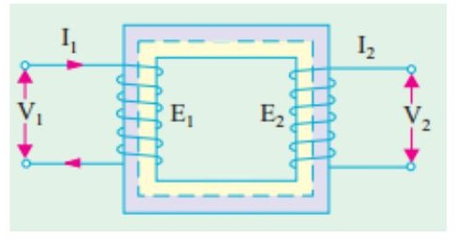
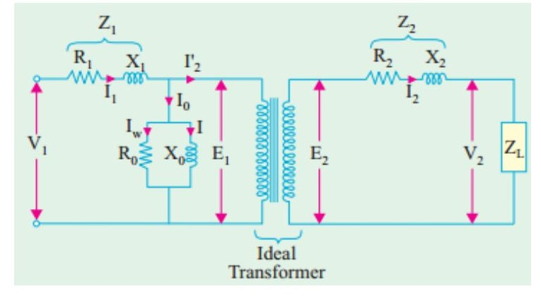
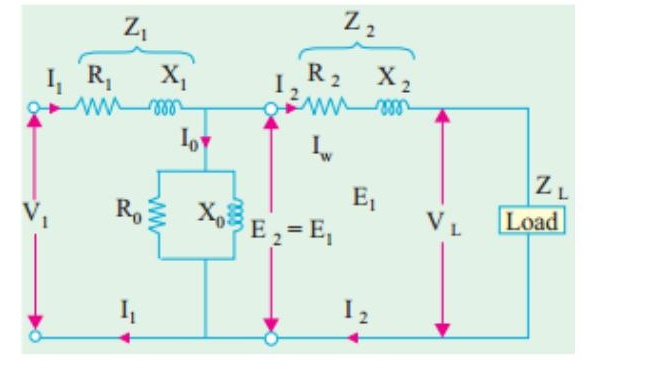
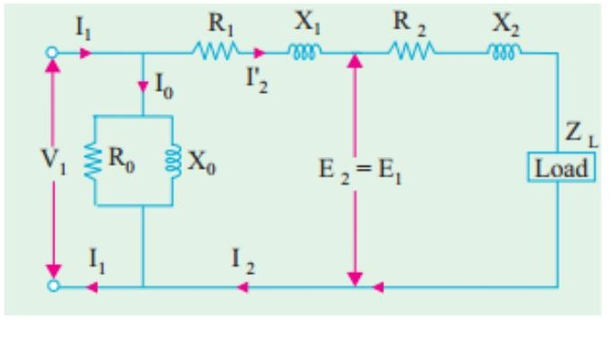
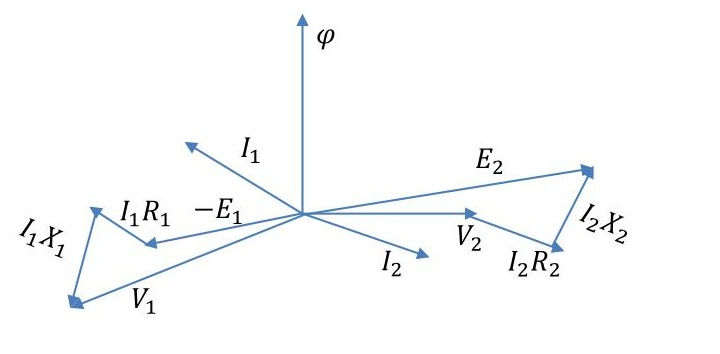
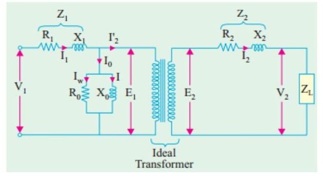

<!-- Slide 1 -->
# Electrical Machines-I
## ECE-2107

### *Transforer-SL3*

Fariya Tabassum  
Assistant Professor, Dept. of Electrical & Computer Engineering  
Rajshahi University of Engineering & Technology, Rajshahi-6204

---
<!-- Slide 2 -->
"And [remember] when your Lord proclaimed, If you are grateful, I will surely increase you [in favour] ".

[Sura Ibraheem]

---
<!-- Slide 3 -->
### Leakage Reactance:

The **flux** which **leaks** out of the core and **does not** link **both windings** is known as **leakage** flux. The flux which does pass completely through the core and **links both** windings is known as the **mutual** flux.

The **voltages** caused by the two **leakage** fluxes react as if they were induced in separate coils which are in **series** with each of the transformer windings. Because of this, the leakage fluxes may be replaced by pure **reactances** and known as the leakage reactances.

> [!NOTE]
> For preparing your answer you have to go through the article 14.8 of the book written by “Rosenblatt”

---
<!-- Slide 4 -->
### Effect of leakage flux

All of the flux in a real transformer is not common to both primary and secondary windings. The flux in a real transformer has three components: mutual flux, primary leakage flux and secondary leakage flux.

---
<!-- Slide 5 -->
### Effect of leakage flux

The primary leakage flux (caused by primary current) links only the primary turns. The secondary leakage flux (caused by secondary current) links only the secondary turns and the mutual flux (due to the magnetizing component of the exciting current) links both windings.

The relationship between coil flux, leakage flux and mutual flux for the respective primary and secondary coils are:

$$\varphi_P = \varphi_M + \varphi_{lp}$$
$$\varphi_S = \varphi_M - \varphi_{ls}$$

where:  
$\varphi_P =$ net flux in window of primary coil  
$\varphi_S =$ net flux in window of secondary coil  
$\varphi_M =$ mutual flux  
$\varphi_{lp} =$ leakage flux associated with the primary coil  
$\varphi_{ls} =$ leakage flux associated with the secondary coil  

---
<!-- Slide 6 -->
### Effect of leakage flux

$$\varphi_P = \varphi_M + \varphi_{lp}$$
$$\varphi_S = \varphi_M - \varphi_{ls}$$

The above equations illustrate how the leakage flux in both windings serves to reduce the output voltage of the secondary; the mutual flux is less than the available primary flux because of primary leakage and the net flux in the secondary is the mutual flux less the secondary leakage. Less flux in the secondary coil results in a lower secondary voltage than if no leakage were present.

---
<!-- Slide 7 -->
### Effect of leakage flux

The voltage drop caused by leakage flux is proportional to the load current. The greater the load current, the greater the magnitudes of both the primary and secondary ampere turns and hence the greater the respective leakage fluxes in both primary and secondary windings. Although leakage flux has an adverse effect on the transformer output voltage it proves an asset under severe short-circuit conditions, the large voltage drop caused by the intense leakage flux limits the current to a lower value than would otherwise occur if no leakage were present and thus helps to avoid damage to the transformer.

---
<!-- Slide 8 -->
### Transformation Ratio

The r.m.s value of thr induced emf in the entire primary winding, $E_1 = 4.44 f N_1 \varphi_M$ \tag{1}

Similarly,

The r.m.s value of thr induced emf in the entire primary winding, $E_2 = 4.44 f N_2 \varphi_M$ \tag{2}

From equations (2) and (1), we can write

$$\frac{E_2}{E_1} = \frac{N_2}{N_1} = K$$

This constant K is known as voltage transformation ratio.

If $N_2 > N_1$ i. e. $K > 1$ then transformer is step-up  
$N_2 < N_1$ i. e. $K < 1$ then transformer is step-down  

For ideal transformer, $V_1 = E_1$ and $E_2 = V_2$ i.e. the VA=output VA

$$V_1 I_1 = V_2 I_2 \text{ or } \frac{I_2}{I_1} = \frac{V_1}{V_2} = \frac{1}{K}$$

Hence, currents are in the inverse ratio of the transformation ratio.

---
<!-- Slide 9 -->
### Equivalent Circuit

- #### Equivalent Resistance

The **equivalent secondary** resistance as referred to **primary** is $R'_2 = \frac{R_2}{K^2}$

The **equivalent primary** resistance as referred to **secondary** is $R'_1 = K^2 R_1$

Equivalent or **effective** resistance of the transformer as referred to **primary**

$$R_{01} = R_1 + R'_2 = R_1 + \frac{R_2}{K^2}$$

Equivalent or **effective** resistance of the transformer as referred to **secondary**

$$R_{02} = R_2 + R'_1 = R_2 + K^2 R_1$$

> [!NOTE]
> For preparing your answer you can go through the article 32.12 of the book written by “B. L. Theraza”

---
<!-- Slide 10 -->
### Equivalent Circuit

- #### Equivalent leakage reactances

The **equivalent secondary** reactance as referred to **primary** is $X'_2 = \frac{X_2}{K^2}$

The **equivalent secondary** reactance as referred to **secondary** is $X'_1 = K^2 X_1$

Equivalent or **effective** reactance of the transformer as referred to **primary**

$$X_{01} = X_1 + X'_2 = X_1 + \frac{X_2}{K^2}$$

Equivalent or **effective** reactance of the transformer as referred to **secondary**

$$X_{02} = X_2 + X'_1 = X_2 + K^2 X_1$$

> [!NOTE]
> For preparing your answer you can go through the article 32.14 of the book written by “B. L. Theraza”

---
<!-- Slide 11 -->
### Equivalent Circuit

The **primary equivalent** of the **secondary** induced voltage is $E'_2 = \frac{E_2}{K} = E_1$

The **primary equivalent** of the **secondary** terminal or output voltage is $V'_2 = \frac{V_2}{K}$

**primary equivalent** of the **secondary** current is $I'_2 = K I_2$

---
<!-- Slide 12 -->
### Equivalent Circuit

---
<!-- Slide 13 -->
### Equivalent Circuit

---
<!-- Slide 14 -->
### Phasor/ vector diagram with resistance and leakage reactance

> [!NOTE]
> For preparing your answer you can go through the article 14.10 of the book written by “Rosenblatt”

---
<!-- Slide 15 -->
### Phasor/ vector diagram with resistance and leakage reactance

When the load is resistive and capacitive

> [!NOTE]
> For preparing your answer you can go through the article 32.14 of the book written by “B. L. Theraza”

---
<!-- Slide 16 -->
### Transformer Regulation

As a real transformer has series impedances within it, the output voltage of a transformer varies with the load even if the input voltage remains constant. To conveniently compare transformers in this respect, it is customary to define a ( quantity called voltage regulation (VR). Full-load voltage regulation is a quantity that compares the output voltage of the transformer at no load with the output voltage at full load . It is defined by the equation

$$VR = \frac{V_{S,nl}-V_{S,fl}}{V_{S,fl}} \times 100\%$$

---
<!-- Slide 17 -->
### Transformer Tests

#### Open circuit or No load test:

- High voltage side is left open
- Cu loss is negligible
- Wattmeter gives the core loss
- Ammeter gives the no load primary current, $I_0$

$$W = V_1 I_0 \cos \varphi_0; \cos \varphi_0 = {^W}/_{V_1 I_0}$$
$$I_\mu = I_0 \sin \varphi_0; I_w = I_0 \cos \varphi_0$$
$$X_0 = {^{V_1}}/_{I_\mu}; R_0 = {^{V_1}}/_{I_w}$$

> [!NOTE]
> For preparing your answer you can go through the article 32.20 of the book written by “B. L. Theraza”

---
<!-- Slide 18 -->
### Transformer Tests

#### Short circuit test:

- Low voltage side is short-circuited
- Core loss is negligible
- Wattmeter gives the combined primary and secondary Cu losses
- Equivalent impedance, leakage reactance and total resistance can be determined.

$$W = I_1^2 R_{01}; \cos \varphi_0 = {^W}/_{V_1 I_0}$$

$$X_{01} = \sqrt{(Z_{01}^2 - R_{01}^2)}$$

> [!NOTE]
> For preparing your answer you can go through the article 32.22 of the book written by “B. L. Theraza”

---
<!-- Slide 19 -->
### Problems

Practice example **14.7, 14.8, 14.9, 14.10** of **Rosenblatt** and **32.27, 32.35, 32.36, 32.40** of B. L. **Theraza** and also the related tutorial problem.
