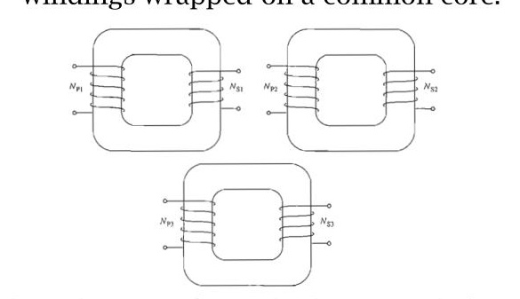
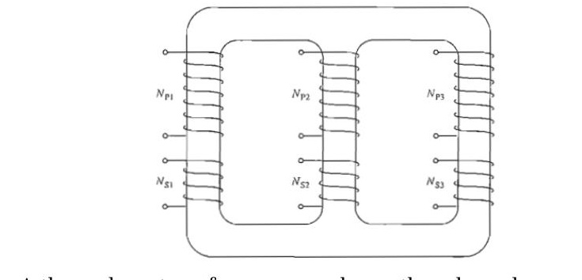
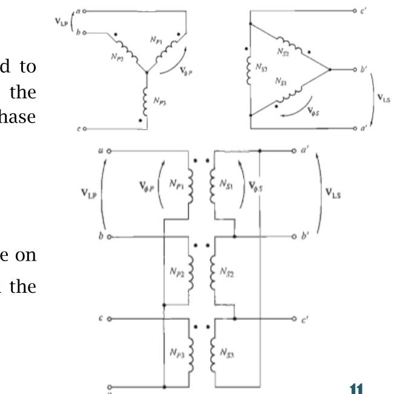
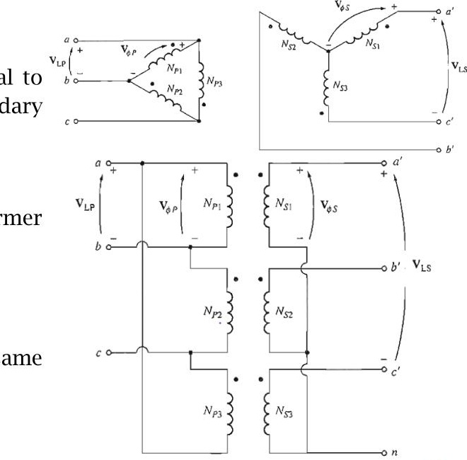
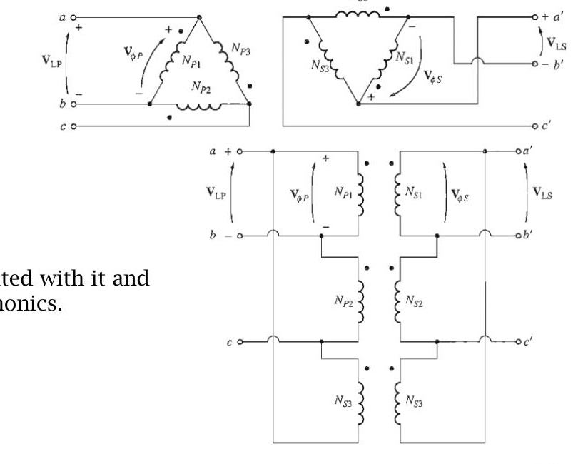
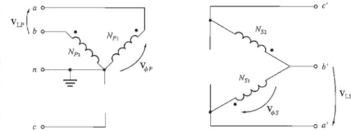
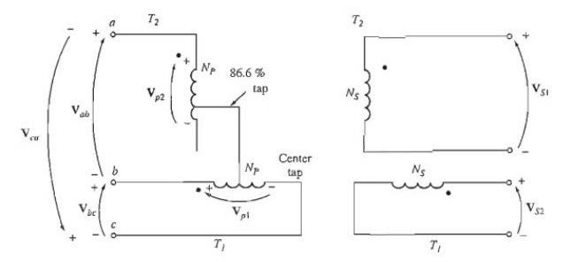
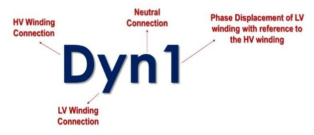

<!-- Slide 1 -->
# Electrical Machines-I
## ECE-2107

### *Transforer-SL4*

Fariya Tabassum  
Assistant Professor, Dept. of Electrical & Computer Engineering  
Rajshahi University of Engineering & Technology, Rajshahi-6204

---
<!-- Slide 2 -->
“Say, “Have you considered: if your water was to become sunken [into the earth], then who could bring you flowing water””.

[Sura al-Mulk]

---
<!-- Slide 3 -->
### Three-phase transformers

#### Necessity of three-phase transformers

Almost all the major power generation and distribution systems in the world today are three-phase ac systems.

> [!NOTE]
> For preparing your answer you can to go through the article 33.1 of the book written by “B. L. Theraza”

---
<!-- Slide 4 -->
### Three-phase transformers

Transformers for three-phase circuits can be constructed in **two ways**.

- One approach is simply to take **three single-phase** transformers and connect them in a three-phase bank.
- An alternative approach is to make a **three-phase** transformer consisting of three sets of windings wrapped on a common core.

*A three phase transformer bank composed of independent transformers*

*A three phase transformer wound on a three-legged core*

---
<!-- Slide 5 -->
### Three-phase transformers

- A **single three-phase** transformer is lighter, smaller, cheaper, and slightly more efficient
- using **three separate** single-phase transformers has the advantage that each unit in the bank could be replaced individually in the event of trouble. A utility would only need to stock a single spare single-phase transformer to back up all three phases, potentially saving money.

---
<!-- Slide 6 -->
### Three-phase transformer Connections

The primaries and secondaries of any three-phase transformer can be independently connected in either a wye (Y) or a delta ($\Delta$). This gives a total of **four possible connections** for a three-phase transformer bank:

1. Wye- wye (Y- Y)
2. Wye-delta (Y- $\Delta$)
3. Delta-wye ($\Delta$ -Y)
4. Delta-delta ($\Delta$ - $\Delta$)

---
<!-- Slide 7 -->
### Three-phase transformer Connections

#### Y-Y connections:

In a Y-Y connection, the primary voltage on each phase of the transformer is given by $V_{\varphi P} = {^{V_{LP}}}/_{\sqrt{3}}$.

The primary-phase voltage is related to the secondary-phase voltage by the turns ratio of the transformer.

The phase voltage on the secondary is then related to the line voltage on the secondary by $V_{LS} = \sqrt{3}V_{\varphi S}$ Therefore, overall the voltage ratio on the transformer is

---
<!-- Slide 8 -->
### Three-phase transformer Connections

#### Y-Y connections:

Therefore, overall the voltage ratio on the transformer is $\frac{V_{LP}}{V_{LS}} = \frac{\sqrt{3}V_{\varphi P}}{\sqrt{3}V_{\varphi S}} = a$

The Y-Y connection has two very serious problems:

1. If loads on the transformer circuit are **unbalanced**, then the **voltages** on the phases of the transformer can become severely unbalanced.
2. **Third-harmonic** voltages can be large.

---
<!-- Slide 9 -->
### Three-phase transformer Connections

#### Y-Y connections:

Both the unbalance problem and the third-harmonic problem can be solved using one of two techniques:

1. **Solidly ground** the neutrals of the transformers, especially the primary winding's neutral. This connection permits the additive third-harmonic components to cause a current flow in the neutral instead of building up large voltages. The neutral also provides a return path for any current imbalances in the load.
2. Add a **third** (tertiary) **winding** connected in $\Delta$ to the transformer bank. If a third $\Delta$ connected winding is added to the transformer. then the third-harmonic components of voltage in the $\Delta$ will add up, causing a circulating current flow within the winding. This suppresses the third-harmonic components of voltage in the same manner as grounding the transformer neutrals.

---
<!-- Slide 10 -->
### Three-phase transformer Connections

#### Y-Y connections:

The Y-Y connection is rarely used for large amounts of power, but is not found too objectionable for local power distribution, especially within local industrial plants, where a neutral is required on both primary and secondary circuits, and where the neutral is grounded. One of the above techniques must be used any time a Y - Y transformer is installed. In practice, very few Y- Y transformers are used, since the same jobs can be done by one of the other types of three-phase transformers.

---
<!-- Slide 11 -->
### Three-phase transformer Connections

#### Y- $\Delta$ connections:

In this connection, the primary line voltage is related to the primary phase voltage by $V_{LP} = \sqrt{3}V_{\varphi P}$, while the secondary line voltage is equal to the secondary phase voltage $V_{LS} = V_{\varphi S}$

The voltage ratio of each phase is $\frac{V_{\varphi P}}{V_{\varphi S}} = a$

Therefore, overall relationship between the line voltage on the primary side of the bank and the line voltage on the secondary side of the bank is $\frac{V_{LP}}{V_{LS}} = \frac{\sqrt{3}V_{\varphi P}}{V_{\varphi S}} = \sqrt{3}a$

---
<!-- Slide 12 -->
### Three-phase transformer Connections

#### Y- $\Delta$ connections:

The Y- $\Delta$ connection has **no problem** with **third-harmonic** components in its voltages, since they are consumed in a circulating current on the a side. This connection is also more stable with respect to unbalanced loads, since they partially redistributes any imbalance that occurs.

This arrangement does have **one problem**, though. Because of the connection, the secondary voltage is shifted $30^\circ$ relative to the primary voltage of the transformer. The fact that a phase shift has occurred can cause problems in **paralleling** the secondaries of two transformer banks together. The phase angles of transformer secondaries must be equal if they are to be paralleled, which means that attention must be paid to the direction of the $30^\circ$ phase shift occurring in each transformer bank to be paralleled together.

---
<!-- Slide 13 -->
### Three-phase transformer Connections

#### $\Delta$ -Y connections:

In a $\Delta$ -Y connection, the primary line voltage is equal to the primary-phase voltage $V_{LP} = V_{\varphi P}$, while the secondary voltages are related by $V_{LS} = \sqrt{3}V_{\varphi S}$

Therefore, the line-to-line voltage ratio of this transformer connection is

$$\frac{V_{LP}}{V_{LS}} = \frac{V_{\varphi P}}{\sqrt{3}V_{\varphi S}} = \frac{a}{\sqrt{3}}$$

This connection has the same advantages and the same phase shift as the Y- $\Delta$ transformer

---
<!-- Slide 14 -->
### Three-phase transformer Connections

#### $\Delta$ - $\Delta$ connections:

In a $\Delta$ - $\Delta$ connection, $V_{LP} = V_{\varphi P}$ and $V_{LS} = V_{\varphi S}$, so the relationship between primary and secondary line voltages is

$$\frac{V_{LP}}{V_{LS}} = \frac{V_{\varphi P}}{V_{\varphi S}} = a$$

This transformer has no phase shift associated with it and no problems with unbalanced loads or harmonics.

---
<!-- Slide 15 -->
### Three-phase transformation using two transformer

In addition to the standard three-phase transformer connections, there are ways to perform **three-phase** transformation with only **two** transformers. All techniques that create three phase power with only two transformers involve a **reduction** in the **power-handling** capability of the transformers, but they may be justified by certain economic situations. Some of the more important two-transformer connections are:

1. The open- $\Delta$ (or V-V) connection
2. The open-Y- open- $\Delta$ connection
3. The Scott-T connection
4. The three-phase T connection

---
<!-- Slide 16 -->
### The open- $\Delta$ (or V-V) connection

In some situations a full transformer bank may not be used to accomplish three phase transformation. For example, suppose that a $\Delta$- $\Delta$ transformer bank composed of separate transformers has a damaged phase that must be removed for repair as shown in figure. If the two remaining secondary voltages are $V_A = V\angle 0^\circ\text{ V}$ and $V_B = V\angle -120^\circ\text{ V}$, then the voltage across the gap where the third transformer used to be is given by $V_C = -V_A - V_B$

$$= -V\angle 0^\circ - V\angle -120^\circ$$
$$= -V - (0.5\text{ }V - j0.0866\text{ }V)$$
$$= -0.5\text{ }V + j0.0866\text{ }V$$
$$= V\angle 120^\circ\text{ V}$$

---
<!-- Slide 17 -->
### The open- $\Delta$ (or V-V) connection

It may seem obvious that removal of one transformer would permit the remaining **two** to carry **two-thirds** of the load. This, however is not the case. If the rated secondary voltage and current of the transformers are $V_L$ and $I_S$, respectively, the line current to the load of a closed $\Delta$ is $\sqrt{3}I_S$. Therefore,

$$\text{Closed- }\Delta\text{ kVA} = \frac{\sqrt{3}V_L \sqrt{3}I_S}{1000} = \frac{3V_L I_S}{1000}$$

When one transformer is removed, the line is in series with the transformer coil and the line current is limited to the rated current of the transformer. Therefore

$$\text{Open- }\Delta\text{ kVA} = \frac{\sqrt{3}V_L I_S}{1000}$$

---
<!-- Slide 18 -->
### The open- $\Delta$ (or V-V) connection

The ratio of the open- $\Delta$ kVA to the closed- $\Delta$ kVA is

$$\frac{\text{open- }\Delta\text{ kVA}}{\text{closed- }\Delta\text{ kVA}} = \frac{\sqrt{3}V_L I_S}{3V_L I_S} = \frac{\sqrt{3}}{3} = 0.577$$

It is thus seen that if one transformer of a closed- $\Delta$ system is removed, the remaining two transformer continue to supply three phase power. The load that can be carried without exceeding the ratings of the transformer is **57.7%** of the original load rather than the expected **66.7 %** (i.e. 2/3)

---
<!-- Slide 19 -->
### Problems

Practice example **14.4, 14.5** of **Rosenblatt** and also the related tutorial problem.

---
<!-- Slide 20 -->
### The open-Y open- $\Delta$ connection

The open-wye-open-delta connection is very similar to the open delta connection except that the primary voltages are derived from two phases and the neutral. It is used to serve small commercial customers needing three-phase service in rural areas where all three phases are not yet present on the power poles. With this connection, a customer can get three phase service in a makeshift fashion until demand requires installation of the third phase on the power poles. A major disadvantage of this connection is that a very large return current must flow in the neutral of the primary circuit.

---
<!-- Slide 21 -->
### The Scott-T connection

The Scott-T connection is a way to derive **two** phases **$90^\circ$** apart from a three-phase power supply. In the early history of ac power transmission, **two** phase and **three** phase power systems were quite common. In those days, it was routinely necessary to **interconnect** two- and three-phase power systems, and the Scott-T transformer connection was developed for that purpose.

Today, two-phase power is primarily limited to certain control applications, but the Scott T is still used to produce the power needed to operate them.

---
<!-- Slide 22 -->
### The Scott-T connection

The **Scott** T consists of **two single-phase** transformers with **identical** ratings. One has a tap on its primary winding at 86.6 percent of full-load Voltage. They are connected as shown in Figure. The 86.6 percent tap of transformer T2, is connected to the center tap of transformer T1.

---
<!-- Slide 23 -->
### The Scott-T connection

$$V_{ad} = V_{ab} + V_{bd}$$

$$= V_L \angle -120^\circ + \frac{1}{2} V_L \angle 0^\circ$$

$$= V_L (-0.5 - j0.866) + 0.5V_L$$

$$= -j0.866V_L$$

$$= 0.866V_L \angle 90^\circ$$

The voltage impressed across the T2 is 86.6 % of that across the main and lags it by $90^\circ$ and result in a two phase output.

---
<!-- Slide 24 -->
### Three phase T connection

The **Scott-T** connection uses two transformers to convert three-phase power to two-phase power at a **different** voltage level. By a simple modification of that connection, the same two transformers can also convert three-phase power to three-phase power at a different voltage level.

Here both the primary and the secondary windings of transformer T, are tapped at the 86.6 percent point, and the taps are connected to the center taps of the corresponding windings on transformer **T1**. In this connection **T1** is called the **main** transformer and **T2** is called the **teaser** transformer. One major **advantage** of the three-phase T connection over the other three phase two transformer connections (the open-delta and open-wye-open-delta) is that a **neutral** can be connected to both the primary side and the secondary side of the transformer bank.

---
<!-- Slide 25 -->
### Vector group of transformer

The vector group **indicates** the **phase difference** between the **primary** and **secondary** sides, introduced due to that particular configuration of transformer windings connection. The transformer vector group is indicated on the Name Plate of transformer by the manufacturer.

The Determination of vector group of transformers is very **important** before connecting two or more transformers in **parallel**. If two transformers of different vector groups are connected in parallel then phase difference exist between the secondary of the transformers and large **circulating** current flows between the two transformers which is very detrimental.

---
<!-- Slide 26 -->
### Vector group of transformer

**Note:** The vector for the HV winding is taken as the reference vector and set at 12 o’clock. Displacement of the vectors of other windings from the reference vector, with anticlockwise rotation, is represented by the use of clock hour figure.

The hour indicator is used as the indicating phase displacement angle. Because there are 12 hours on a clock, and a circle consists out of $360^\circ$, each hour represents $30^\circ$. Thus $1 = 30^\circ$, $2 = 60^\circ$, $3 = 90^\circ$, $6 = 180^\circ$ and $12 = 0^\circ$ or $360^\circ$.

---
<!-- Slide 27 -->
### Vector group of transformer

#### Common Symbol Designation

Y or y – star winding  
D or d – delta winding  
N or n – neutral  
0 to 12 – phase displacement in terms of clock position in multiples of $30^\circ$

According to the standard, the notation should follow **HV-LV**-Phase displacement sequence with the **HV** winding in **uppercase** and **LV** winding in **lowercase**.

---
<!-- Slide 28 -->
### Vector group of transformer

for example a winding configuration is shown in figure. As shown, the HV winding is connected in delta while the LV winding is connected in wye. This configuration belongs to the vector group of transformer Dyn1 where the LV lags the HV by $30^\circ$.

---
<!-- Slide 29 -->
### Vector group of transformer

#### Example:

- Digit $0 = 0^\circ$ that the LV phasor is in phase with the HV phasor  
  Digit $1 = 30^\circ$ lagging (LV lags HV with $30^\circ$) because rotation is anti-clockwise.
- Digit $11 = 330^\circ$ lagging or $30^\circ$ leading (LV leads HV with $30^\circ$)
- Digit $5 = 150^\circ$ lagging (LV lags HV with $150^\circ$)
- Digit $6 = 180^\circ$ lagging (LV lags HV with $180^\circ$)

#### Dyn11

Transformer has a delta connected primary winding (D) (HV) a star connected secondary (y) (LV) with the star point brought out (n) and a phase shift of 30 deg leading (11) (LV leading HV by 30 degree)
