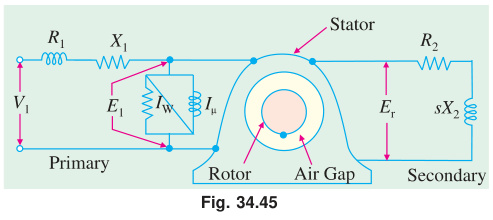

*(start)* | [🏠 Index](README.md) | [2018 Answer →](2018_answer.md)

---

# ECE 2207: 2017 Semester Final: Exam Style Answers
**RUET · ECE Dept · 2nd Year Odd Semester 2017**
**Full Marks:** 72 · **Time:** 3 Hours · **Attempt any 6 (3 from each section)**

> ⚠️ **Note:** In 2017, Section A = Induction Motors, Section B = Transformers (reversed from later years).

---

## SECTION - A (Induction Motors: Q1 to Q4)

### Question 1

**(a) Why is the induction motor called a rotating transformer? [03]**

**Analogy:**
An induction motor operates on the same principle of mutual electromagnetic induction as a 2-winding static transformer:
1. **Stator acts as Primary:** Connected to the 3-phase AC supply, it sets up the magnetizing flux and draws primary current ($I_1$).
2. **Rotor acts as Secondary:** Completely physically isolated from the stator; induced EMF ($E_r = sE_2$) drives secondary current through the rotor conductors.
3. **Air Gap acts as Magnetic Medium:** Replaces the continuous iron core; the rotating magnetic field (RMF) links stator and rotor across the air gap.
4. **Short-Circuited Secondary:** The rotor winding/bars are permanently short-circuited by end rings. At standstill ($s = 1$), it is literally a static transformer with a shorted secondary.

**Key differences:**
- The secondary (rotor) is free to rotate mechanically on bearings.
- The induced rotor currents interact with the air-gap flux to produce mechanical torque (energy conversion is electrical $\to$ mechanical).
- The secondary circuit operates at slip frequency ($f_r = s \cdot f$).

---

**(b) Show how a uniformly rotating magnetic flux of constant value is produced in the stationary coils of a 3-φ induction motor. [04]**

Three-phase windings are placed 120° apart in space. Supply:
$$\Phi_R = \Phi_m\sin\omega t, \quad \Phi_Y = \Phi_m\sin(\omega t - 120°), \quad \Phi_B = \Phi_m\sin(\omega t + 120°)$$

Resolving into X and Y components:
$$\Phi_x = \frac{3}{2}\Phi_m\sin\omega t, \qquad \Phi_y = -\frac{3}{2}\Phi_m\cos\omega t$$

Resultant magnitude:
$$\Phi_r = \sqrt{\Phi_x^2 + \Phi_y^2} = \frac{3}{2}\Phi_m = 1.5\Phi_m = \text{constant}$$

Space angle: $\theta = \omega t - 90°$ → rotates at $\omega = 2\pi f$ rad/s → synchronous speed:
$$N_s = \frac{120f}{P} \text{ rpm}$$

The flux has constant magnitude $1.5\Phi_m$ and rotates at synchronous speed. *(Shown)*

---

**(c) 6-pole, 50 Hz motor, rotor driven at 1000 rpm. Find rotor voltage, frequency, slip, and torque developed. Can it run at this speed by itself? [04]**

**Given:** $P = 6$, $f = 50$ Hz, $N = 1000$ rpm

**i) Synchronous speed:**
$$N_s = \frac{120 \times 50}{6} = 1000 \text{ rpm}$$

**ii) Slip:**
$$s = \frac{N_s - N}{N_s} = \frac{1000 - 1000}{1000} = 0$$

**iii) Rotor frequency:** $f_r = sf = 0 \times 50 = 0$ Hz

**iv) Rotor voltage:** $E_{2s} = sE_2 = 0 \times E_2 = 0$ V

**v) Torque developed:** At $s = 0$, no EMF → no rotor current → **torque = 0**

**Can it run at this speed by itself?** No. At synchronous speed, slip = 0, rotor EMF = 0, rotor current = 0, torque = 0. No torque means it cannot sustain this speed against friction. An induction motor always runs at $N < N_s$.

---

**(d) What happens if the slip of a 3-φ induction motor becomes negative? [01]**

If $N > N_s$, slip is negative ($s < 0$). The motor acts as an **induction generator**. It delivers electrical power back to the supply instead of consuming it.

---

### Question 2

**(a) Define: (i) Plugging (ii) Pull-out torque [02]**

**Plugging:** A braking method. The phase sequence of stator supply is reversed while the motor is running. The motor develops a torque opposing rotation. The motor decelerates and stops quickly. The supply must be cut off at zero speed or the motor reverses direction.

**Pull-out torque:** The maximum torque a motor can develop at any operating speed. Also called breakdown torque or maximum torque ($T_{\max}$). If the load torque exceeds this, the motor stalls.

---

**(b) For full load and maximum torque show: $\frac{T_f}{T_{\max}} = \frac{2as_f}{a^2 + s_f^2}$ where $a = s_{mT}$. [03]**

Torque at any slip:
$$T = \frac{ksE_2^2 R_2}{R_2^2 + s^2 X_2^2}$$

Maximum torque (at $s_{mT} = R_2/X_2 = a$):
$$T_{\max} = \frac{kE_2^2}{2X_2}$$

Full load torque at slip $s_f$:
$$T_f = \frac{ks_f E_2^2 R_2}{R_2^2 + s_f^2 X_2^2}$$

Taking ratio $T_f / T_{\max}$ and substituting $a = R_2/X_2$:

$$\frac{T_f}{T_{\max}} = \frac{ks_f E_2^2 R_2 / (R_2^2 + s_f^2 X_2^2)}{kE_2^2 / (2X_2)}$$

$$= \frac{s_f R_2 \cdot 2X_2}{R_2^2 + s_f^2 X_2^2} = \frac{2s_f (R_2/X_2)}{(R_2/X_2)^2 + s_f^2} = \boxed{\frac{2as_f}{a^2 + s_f^2}}$$
*(Shown)*

---

**(c) Mention speed control methods and discuss any one. [04]**

Speed control methods for a 3-phase induction motor:
1. Stator voltage control
2. Supply frequency control (V/f control)
3. Pole changing
4. Rotor resistance control (slip-ring motors only)

**Rotor resistance control:**

For a slip-ring induction motor, external resistance is added to the rotor circuit through slip rings. From the torque equation, slip $s$ increases when $R_2$ increases (to maintain the same torque). Since $N = N_s(1 - s)$, higher slip means lower speed.

Disadvantage: Power $= s \times P_{\text{air gap}}$ is wasted in the external resistors. Efficiency drops. Used where step-speed control and good starting torque are needed (e.g., cranes, hoists).

---

**(d) 8-pole, 50 Hz, full load slip = 2%, $R_2 = 0.001\,\Omega$, $X_2 = 0.005\,\Omega$. Find: (i) $T_{\max}/T_f$ ratio, (ii) speed at maximum torque. [03]**

**Given:** $P = 8$, $f = 50$ Hz, $s_f = 0.02$, $R_2 = 0.001\,\Omega$, $X_2 = 0.005\,\Omega$

$$N_s = \frac{120 \times 50}{8} = 750 \text{ rpm}$$

**Slip at max torque:**
$$s_{mT} = \frac{R_2}{X_2} = \frac{0.001}{0.005} = 0.2$$

**Torque ratio (using $a = s_{mT} = 0.2$, $s_f = 0.02$):**
$$\frac{T_f}{T_{\max}} = \frac{2 \times 0.2 \times 0.02}{0.2^2 + 0.02^2} = \frac{0.008}{0.04 + 0.0004} = \frac{0.008}{0.0404} = 0.198$$

$$\boxed{\frac{T_{\max}}{T_f} = \frac{1}{0.198} \approx 5.05}$$

**Speed at max torque:**
$$N_{mT} = N_s(1 - s_{mT}) = 750(1 - 0.2) = \boxed{600 \text{ rpm}}$$

---

### Question 3

**(a) Draw the step-by-step equivalent circuit of a 3-φ induction motor. [03]**

**1. Stator Model and Standstill Rotor ($s=1$):**
At standstill, the motor acts like a transformer. Stator has $R_1, X_1$ and shunt branch $R_c, X_m$. Rotor has $R_2$ and $X_2$ at frequency $f$.

**2. Rotor at Running Slip $s$:**
Rotor frequency is $sf$, induced EMF is $sE_2$, and reactance is $sX_2$.
$$I_2 = \frac{sE_2}{R_2 + jsX_2}$$

**3. Frequency Transformation:**
Divide the current equation by $s$ to refer the rotor to stator frequency $f$:
$$I_2 = \frac{E_2}{R_2/s + jX_2}$$
The rotor resistance is modeled as a variable resistance $R_2/s$.

**4. Power Separation:**
Split $R_2/s$ into actual copper loss and mechanical load components:
$$\frac{R_2}{s} = R_2 + R_2\left(\frac{1-s}{s}\right)$$
$R_2$ causes heat ($P_{cu}$), and $R_L = R_2(1-s)/s$ represents gross mechanical power ($P_m$).

**5. Exact Equivalent Circuit (Referred to Stator):**
Refer rotor parameters to stator using turns ratio $a = N_1/N_2$:
$$R_2' = a^2R_2, \quad X_2' = a^2X_2, \quad R_L' = R_2'\left(\frac{1-s}{s}\right)$$

**6. Approximate Equivalent Circuit:**
Since stator voltage drop is small, the shunt branch can be shifted to the input terminals.

---

**(b) Circle diagram problem: 415V, 29.84 kW, 50 Hz, delta-connected motor. No-load: 415V, 21A, 1250W. Locked rotor: 100V, 45A, 2730W. [09]**

**Step 1: No-load data (referred to full voltage):**

Line voltage $V = 415$ V (delta), so phase voltage $= 415$ V.

No-load current per phase: $I_0 = 21/\sqrt{3} = 12.12$ A (line to phase for delta: $I_{\text{phase}} = I_{\text{line}}/\sqrt{3}$)

No-load input power $W_0 = 1250$ W
$$\cos\phi_0 = \frac{W_0}{\sqrt{3} V I_0} = \frac{1250}{\sqrt{3} \times 415 \times 21} = \frac{1250}{15094} = 0.0828$$

No-load phase: $\phi_0 = \cos^{-1}(0.0828) = 85.25°$

**Step 2: Blocked rotor data (referred to full voltage):**

At 100V, $I_{sc} = 45$ A, $W_{sc} = 2730$ W.

Scale to full voltage (415V):
$$I_{sc,\text{full}} = 45 \times \frac{415}{100} = 186.75 \text{ A}$$

$$\cos\phi_{sc} = \frac{W_{sc}}{\sqrt{3} \times 100 \times 45} = \frac{2730}{7794} = 0.35$$

$\phi_{sc} = \cos^{-1}(0.35) = 69.5°$

**Step 3: Equivalent circuit constants from the two tests**

No-load branch at rated voltage. The motor is **Δ**, so $V_{ph} = V_L$ and $I_{ph} = I_L/\sqrt3$:
$$I_{0,ph} = \frac{21}{\sqrt3} = 12.124\ \text{A},\quad I_c = I_{0,ph}\cos\phi_0 = 1.004\ \text{A},\quad I_m = \sqrt{I_{0,ph}^2 - I_c^2} = 12.083\ \text{A}$$
$$R_c = \frac{3V_{ph}^2}{W_0} = \frac{3 \times 415^2}{1250} = 413.3\ \Omega,\qquad X_m = \frac{V_{ph}}{I_m} = \frac{415}{12.083} = 34.35\ \Omega$$

Blocked-rotor branch. Again Δ, so at 100 V the per-phase current is $I_{ph} = 45/\sqrt3 = 25.98$ A:
$$Z_{sc} = \frac{100}{25.98} = 3.849\ \Omega$$
$$R_{sc} = \frac{W_{sc}}{3I_{ph}^2} = \frac{2730}{3 \times 25.98^2} = \frac{2730}{2025} = 1.348\ \Omega$$
$$X_{sc} = \sqrt{3.849^2 - 1.348^2} = 3.605\ \Omega$$

*(Check: $3 \times 25.98^2 \times 1.348 = 2730$ W ✓)*

Stator and rotor copper losses are **equal at standstill** (given), so $P_{cu1} = P_{cu2} = 1365$ W and the series impedance splits evenly:
$$R_1 = R_2' = 0.674\ \Omega,\qquad X_1 = X_2' = 1.803\ \Omega$$

**Step 4: Locate the rated-load point**

Rated output is 29.84 kW. With $P_{ag} = \dfrac{3V_{ph}^2 (R_2'/s)}{(R_1 + R_2'/s)^2 + (X_1 + X_2')^2}$ and $P_{out} = P_{ag}(1-s)$, solving gives
$$s_f = 0.0475,\qquad |I_2'| = \frac{415}{\sqrt{14.865^2 + 3.605^2}} = \frac{415}{15.296} = 27.12\ \text{A},\qquad \varphi_2 = \tan^{-1}\frac{3.605}{14.865} = 13.63^\circ$$

$$\vec{I}_1 = \vec{I}_0 + \vec{I}_2' = (1.004 - j12.083) + 27.12\angle -13.63^\circ = (27.38 - j18.48)\ \text{A}$$

**(i) Line current and power factor at rated output:**
$$|I_{1,ph}| = 33.01\ \text{A} \implies \boxed{I_L = \sqrt3 \times 33.01 = 57.2\ \text{A}}$$
$$\cos\varphi = \frac{27.38}{33.01} = \boxed{0.83\ \text{lagging}}$$

*Power balance check:* $P_{in} = 3 \times 415 \times 27.38 = 34.06$ kW, and
$P_{out} + P_{fe} + P_{cu1} + P_{cu2} = 29.84 + 1.25 + 1.49 + 1.49 = 34.07$ kW ✓
so $\eta = 29840/34065 = 87.6\%$ — reasonable for a 40 hp machine, which confirms the operating point.

**Step 5: Maximum torque**

Slip at maximum torque:
$$s_m = \frac{R_2'}{\sqrt{R_1^2 + (X_1 + X_2')^2}} = \frac{0.674}{\sqrt{0.454 + 13.00}} = \frac{0.674}{3.667} = 0.184$$

$$P_{ag,max} = \frac{3V_{ph}^2 \sqrt{R_1^2 + X^2}}{(R_1 + \sqrt{R_1^2 + X^2})^2 + X^2} = \frac{516\,675 \times 3.667}{4.341^2 + 3.605^2} = \frac{1\,894\,647}{31.85} = 59.5\ \text{kW}$$

Since torque is proportional to air-gap power at fixed frequency,
$$\boxed{\frac{T_{max}}{T_{fl}} = \frac{P_{ag,max}}{P_{ag,fl}} = \frac{59.5}{31.33} = 1.9}$$

> **The paper does not state the number of poles**, so $T_{max}$ cannot be reduced to a unique value in N·m — that needs $N_s = 120f/P$. What the data *does* fix is the ratio $T_{max} \approx 1.9\,T_{fl}$. For the usual 6-pole reading ($N_s = 1000$ rpm, $\omega_s = 104.7$ rad/s): $T_{fl} = 31\,327/104.7 = 299$ N·m and $T_{max} = 59\,501/104.7 = \mathbf{568}$ N·m.

---

### Question 4

**(a) Briefly explain why the single-phase induction motor inherently produces no starting torque. [04]**

A single-phase supply creates a **pulsating** magnetic field, not a rotating one. This pulsating field can be resolved into two equal RMFs rotating in opposite directions at synchronous speed (double-field revolving theory).

At standstill, both the forward and backward rotating fields produce equal and opposite torques. Net torque = 0. So the motor cannot start by itself.

Once running in either direction (given a starting push), the slip for the forward field becomes small and for the backward field becomes nearly 2. Forward torque dominates. The motor sustains its rotation. But without a push, it cannot start.

---

**(b) Why does the permanent-split capacitor motor run more quietly than the capacitor-start motor? [04]**

In a **capacitor-start motor**, the auxiliary winding and capacitor are connected only during starting. A centrifugal switch disconnects them at about 75% of synchronous speed. When this switch opens, there is a mechanical click and a small current surge. The motor then runs on the main winding only: producing a pulsating field: causing vibration and noise.

In a **permanent-split capacitor motor**, the auxiliary winding and capacitor remain connected at all times. The motor operates as a true two-phase machine (90° phase shift) during both starting and running. This produces a smoother, more nearly rotating field at all speeds. No switch is needed. No click or surge occurs. So it runs more quietly and smoothly.

---

**(c) Explain how an auxiliary winding provides starting torque for single-phase induction motors. [04]**

A single-phase IM has a main winding (M) and an auxiliary (starting) winding (A). The two windings are placed 90° apart in space.

The auxiliary winding has either:
- Higher resistance (resistance split-phase): current in A lags less → phase difference between $I_m$ and $I_a$.
- Capacitor in series (capacitor-start): current in A leads → better phase split.

If the two currents are displaced in time (phase angle $\alpha$), they set up a rotating magnetic field. The rotating field produces a starting torque, just like in a 3-phase motor.

For maximum starting torque, the two currents should be 90° apart in time. This is achieved with a capacitor of proper value. Once the motor reaches about 75% of speed, the auxiliary winding is switched off (by centrifugal switch). The motor then runs on the main winding only.

---

## SECTION - B (Transformers: Q5 to Q8)

### Question 5

**(a) What is a transformer? Write down its advantages. [04]**

A transformer is a static electromagnetic device. It transfers electrical energy from one AC circuit to another at the same frequency but different voltage and current levels. Transfer happens through mutual electromagnetic induction between two or more windings wound on a common magnetic core.

**Advantages:**
1. Voltage can be stepped up or down as needed.
2. Electrical power can be transmitted efficiently at high voltage (low current → less $I^2R$ loss).
3. No moving parts → highly reliable, low maintenance.
4. Very high efficiency (98–99% for large power transformers).
5. Electrically isolates two circuits (safety).
6. Economical: simple construction, long service life.

---

**(b) Explain the operating principle of an ideal transformer. [04]**

An ideal transformer has no resistance, no leakage flux, and no core losses.

When AC voltage $v_1$ is applied to the primary ($N_1$ turns), an alternating current $i_0$ flows. This creates an alternating mutual flux $\Phi$ in the core.

By Faraday's Law, the alternating flux induces EMF in both windings:
$$e_1 = -N_1 \frac{d\Phi}{dt}, \qquad e_2 = -N_2 \frac{d\Phi}{dt}$$

Dividing: $\frac{e_1}{e_2} = \frac{N_1}{N_2} = \frac{1}{K}$

For an ideal transformer (no drops): $V_1 = E_1$, $V_2 = E_2$.

So: $\frac{V_1}{V_2} = \frac{N_1}{N_2}$

Since input power = output power (lossless): $V_1 I_1 = V_2 I_2$

$$\frac{I_1}{I_2} = \frac{V_2}{V_1} = \frac{N_2}{N_1}$$

---

**(c) 25 kVA, 2000/200V transformer, iron loss = 350W, full-load Cu loss = 400W. Find efficiency. [04]**

**Full-load VA:** 25000 VA, **$P_{Fe}$** = 350 W, **$P_{Cu,FL}$** = 400 W

**At full load:**

**(i) Unity pf ($\cos\phi = 1.0$):**
$$\eta = \frac{25000 \times 1.0}{25000 \times 1.0 + 350 + 400} = \frac{25000}{25750} = \boxed{97.09\%}$$

**(ii) 0.8 lagging pf:**
$$\eta = \frac{25000 \times 0.8}{25000 \times 0.8 + 350 + 400} = \frac{20000}{20750} = \boxed{96.39\%}$$

**At half load:** Cu loss at half load $= (0.5)^2 \times 400 = 100$ W

**(i) Half load, unity pf:**
$$\eta = \frac{12500 \times 1.0}{12500 + 350 + 100} = \frac{12500}{12950} = \boxed{96.53\%}$$

**(ii) Half load, 0.8 lagging pf:**
$$\eta = \frac{12500 \times 0.8}{12500 \times 0.8 + 350 + 100} = \frac{10000}{10450} = \boxed{95.69\%}$$

---

### Question 6

**(a) Draw the full-load phasor diagram of a single-phase transformer. [03]**

---

**(b) Short notes on: (i) Hysteresis loss (ii) Eddy current loss [04]**

**(i) Hysteresis loss:**
When the core is subjected to alternating magnetic flux, the magnetic domains in the iron reverse direction each half-cycle. Energy is spent overcoming the molecular friction during this reversal. This energy appears as heat. It is called hysteresis loss.

$$P_h = K_h f B_m^{1.6} V \text{ (Steinmetz formula)}$$

where $K_h$ = material constant, $f$ = frequency, $B_m$ = peak flux density, $V$ = core volume. Reduced by using high-grade silicon steel (low $K_h$).

**(ii) Eddy current loss:**
The alternating core flux also induces EMFs in the iron core itself. These EMFs drive circulating currents (eddy currents) within the iron. These currents cause $I^2R$ heating.

$$P_e = K_e f^2 B_m^2 t^2 V$$

where $t$ = lamination thickness. Reduced by laminating the core (thin sheets insulated from each other). Each lamination has higher resistance, so eddy currents are small.

---

**(c) 2300/208V, 500 kVA, 50 Hz. OC test (LV side): 208V, 85A, 1800W. SC test (HV side): 95V, 217.4A, 8200W. Find $R_{02}$ and other parameters. [05]**

**OC Test (LV side = secondary, 208V):**

$$\cos\phi_0 = \frac{W_0}{V_0 I_0} = \frac{1800}{208 \times 85} = 0.1018$$

$$R_{c2} = \frac{V_0^2}{W_0} = \frac{208^2}{1800} = 24.04\,\Omega$$

$$I_m = I_0 \sin\phi_0 = 85 \times \sqrt{1 - 0.1018^2} = 84.52 \text{ A}$$

$$X_{m2} = \frac{V_0}{I_m} = \frac{208}{84.52} = 2.46\,\Omega$$

**SC Test (HV side = primary):**

Turns ratio: $a = 2300/208 = 11.058 \implies a^2 = 122.27$

$$R_{01} = \frac{W_{sc}}{I_{sc}^2} = \frac{8200}{217.4^2} = 0.1735\,\Omega$$

$$Z_{01} = \frac{V_{sc}}{I_{sc}} = \frac{95}{217.4} = 0.4370\,\Omega$$

$$X_{01} = \sqrt{Z_{01}^2 - R_{01}^2} = \sqrt{0.4370^2 - 0.1735^2} = \sqrt{0.1910 - 0.0301} = 0.4011\,\Omega$$

Referring to LV side (divide by $a^2 = 122.27$):

$$\boxed{R_{02} = \frac{R_{01}}{a^2} = \frac{0.1735}{122.27} = \mathbf{1.419 \times 10^{-3}\,\Omega}}$$
*(or $1.414 \times 10^{-3}\,\Omega$ if rounded as $0.173 / 122.3$)*

$$X_{02} = \frac{X_{01}}{a^2} = \frac{0.4011}{122.27} = 3.28 \times 10^{-3}\,\Omega$$

$$Z_{02} = \frac{Z_{01}}{a^2} = \frac{0.4370}{122.27} = 3.57 \times 10^{-3}\,\Omega$$

---

### Question 7

**(a) Explain why open-Δ is limited to 57.7% of normal Δ-Δ bank. [04]**

In a Δ-Δ bank of three transformers (each rated $S$ kVA), total capacity = $3S$ kVA.

If one transformer is removed, the remaining two form a V-V (open-Δ) connection. Each transformer still handles its rated current. But now only two transformers supply a 3-phase load.

Total output of open-Δ = $\sqrt{3} \times S$ (each transformer contributes $S/\sqrt{3}$ to total).

$$\text{Ratio} = \frac{\sqrt{3}S}{3S} = \frac{1}{\sqrt{3}} = 0.577 = 57.7\%$$

Also, in an open-Δ bank, each transformer operates at a power factor lower than in the closed-Δ bank (one at $\cos(30° + \phi)$ and one at $\cos(30° - \phi)$ for a balanced load). So the utilization is also less per transformer.

---

**(b) Conditions for parallel operation of 3-phase transformers. [04]**

1. Same voltage ratio (same turns ratio, primary and secondary voltages must match).
2. Same percentage (or per-unit) impedance (for proper load sharing).
3. Same polarity (terminals must have the same instantaneous polarity).
4. Same phase sequence (for 3-phase transformers).
5. Same vector group or phase displacement (zero phase angle difference between secondary voltages, e.g., both Dy11 or both Yy0).

If conditions 4 or 5 are violated, circulating currents flow even at no load, which can damage the transformers.

---

**(c) 18 kVA, 20000/480V, 60 Hz transformer. Can it safely supply 15 kVA at 415V load at 50 Hz? [04]**

**Key consideration:** The transformer is rated at 60 Hz. If used at 50 Hz:

The EMF equation: $E = 4.44 f N \Phi_m$. For the same applied voltage $V_1 = 20000$ V but $f = 50$ Hz instead of 60 Hz:

$$\Phi_m \propto \frac{V}{f}$$

At 50 Hz: $\Phi_{m,50} = \Phi_{m,60} \times \frac{60}{50} = 1.2 \times \Phi_{m,60}$

The flux increases by 20%. This pushes the core deeper into saturation, so the magnetizing current rises sharply. The core losses behave differently at constant applied voltage:

$$P_h \propto f B_m^{1.6} \implies \frac{50 \times 1.2^{1.6}}{60 \times 1} = 1.11 \quad\Rightarrow\ \text{increases by } 11\%$$
$$P_e \propto f^2 B_m^2 \implies \frac{50^2 \times 1.2^2}{60^2 \times 1} = 1.00 \quad\Rightarrow\ \text{unchanged (eddy loss is independent of } f \text{ at constant } V)$$

So hysteresis loss worsens, while eddy-current loss stays exactly where it was — the extra heating comes from saturation current, not from the eddy term.

**To hold the flux at its rated value at 50 Hz, the applied voltage must drop in the same ratio:**
$$V_{1,50} = 20000 \times \frac{50}{60} = 16{,}667 \text{ V}, \qquad V_{2,50} = 480 \times \frac{50}{60} = 400 \text{ V}$$

**But the load needs 415 V, not 400 V.** To put 415 V on the secondary the primary must be raised to
$$V_1 = 415 \times \frac{20000}{480} = 17{,}292 \text{ V}$$
which gives a flux $17\,292/50$ against the rated $20\,000/60$ — only **3.75 % over-flux**. That is a mild excursion (the core is not deeply saturated), so it is acceptable.

**kVA available at 50 Hz:** the windings still carry their rated current, so capacity is limited by voltage:
$$S = V_2 \times I_{2,\text{rated}} = 415 \times \frac{18\,000}{480} = 15.6\ \text{kVA}$$

**Conclusion:** $\boxed{\text{Yes}}$ — the transformer can supply 15 kVA at 415 V, 50 Hz. Note that the exact-fit figure in the question comes from the textbook derating: $18 \times \frac{50}{60} = 15$ kVA is the capacity *at the fully derated 400 V*. At the 415 V the load actually wants, there is slightly more headroom (15.6 kVA) at the cost of 3.75 % over-flux.

---

### Question 8

**(a) What is an instrument transformer? Explain the Potential Transformer (PT) in brief. [03]**

**Instrument transformer:** A transformer designed specifically to scale high voltages or currents down to safe, measurable levels for instruments (voltmeters, ammeters, energy meters, relays). They provide electrical isolation between the high-power circuit and the measuring instruments.

Two types: Potential Transformer (PT) for voltage measurement, Current Transformer (CT) for current measurement.

**Potential Transformer (PT):**
A step-down transformer. Primary is connected to the high-voltage circuit. Secondary (usually rated 110V) is connected to the voltmeter or relay. The high-voltage side is insulated to withstand the line voltage. Actual voltage $= $ voltmeter reading $\times$ PT ratio. The secondary must never be short-circuited (unlike CT).

---

**(b) What happens when a transformer is first connected to the power line? Can it be mitigated? [04]**

**Inrush current (magnetizing inrush):**
When a transformer is first energized, a large transient current called inrush current flows, which can be 8–15 times the rated full-load current.

**Why it happens:** At the instant of switching, the core may have residual (remnant) flux. If switching happens at voltage zero crossing with maximum residual flux, the required flux to balance the voltage drives the core deep into saturation. Saturated core has very low inductance, so current spikes to very large values. The inrush decays over a few cycles as core flux settles.

**Mitigation:**
1. **Pre-insertion resistors:** Insert resistance in series with the primary at switching; bypass after a few cycles.
2. **Controlled switching:** Use circuit breakers with closing-angle control to switch at the voltage peak (minimizes flux offset).
3. **Soft starting relays:** Monitor waveform asymmetry (inrush has DC offset) to distinguish from fault current.

---

**(c) 200/400V step-up transformer, parameters referred to LV side: $R_{eq} = 0.15\,\Omega$, $X_{eq} = 0.37\,\Omega$, $R_c = 600\,\Omega$, $X_m = 300\,\Omega$. Load: 10A at 0.8 pf lag (secondary). Find: (i) primary current, (ii) secondary terminal voltage. [05]**

**Given:** Turns ratio $a = N_1/N_2 = 200/400 = 0.5$ (step-up), all parameters on LV (primary) side.

Load referred to primary side:
- Secondary current $I_2 = 10$ A. Referred to primary: $I_2' = I_2/a = 10/0.5 = 20$ A (but we need to be careful: referred secondary current to primary = $I_2 \times (N_2/N_1) = 10 \times 2 = 20$ A).

Wait: parameters are referred to LV side. Secondary current (HV side) = 10 A. Referred to LV (primary): $I_2' = 10 \times (N_2/N_1) = 10 \times 2 = 20$ A at pf $= 0.8$ lag.

**Taking the applied primary voltage as reference:** $V_1 = 200$ V is the voltage given in the question, so $\vec{V}_1 = 200\angle 0°$ V.

$$\vec{I}_2' = 20\angle -36.87° = 20(0.8 - j0.6) = 16 - j12 \text{ A}$$

**(i) Primary current (including magnetizing branch):**

$$I_c = \frac{V_1}{R_c} = \frac{200}{600} = 0.333 \text{ A (in phase with }V_1)$$
$$I_m = \frac{V_1}{X_m} = \frac{200}{300} = 0.667 \text{ A (lagging }V_1\text{ by 90°)}$$

No-load current: $\vec{I}_0 = I_c - jI_m = 0.333 - j0.667$

$$\vec{I}_1 = \vec{I}_0 + \vec{I}_2' = (0.333 - j0.667) + (16 - j12) = 16.333 - j12.667$$

$$|I_1| = \sqrt{16.333^2 + 12.667^2} = \sqrt{266.8 + 160.5} = \sqrt{427.3} \approx \boxed{20.67 \text{ A}}$$

Primary pf $= 16.333/20.67 = 0.79$ lag.

**(ii) Secondary terminal voltage:**

The series drop referred to the primary side, at $\cos\phi_2 = 0.8$ lag:
$$\Delta V_1 = I_2'(R_{eq}\cos\phi_2 + X_{eq}\sin\phi_2) = 20(0.15 \times 0.8 + 0.37 \times 0.6) = 20(0.12 + 0.222) = 6.84 \text{ V}$$

$$V_2' = V_1 - \Delta V_1 = 200 - 6.84 = 193.2 \text{ V}$$

Referred back to the secondary ($K = N_2/N_1 = 2$):
$$V_2 = K V_2' = 2 \times 193.2 = \boxed{386.3 \text{ V}}$$

Note the load terminal voltage sits below the 400 V no-load value. The 200 V is the applied primary voltage, not the on-load secondary referred value.

---

*Source:* [PrevYearQuestions/2017.md](../PrevYearQuestions/2017.md)

---

*(start)* | [🏠 Index](README.md) | [2018 Answer →](2018_answer.md)
