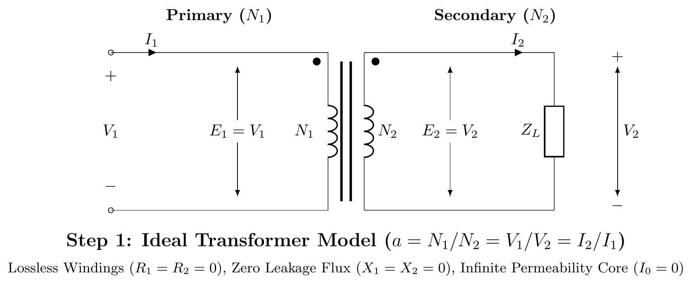
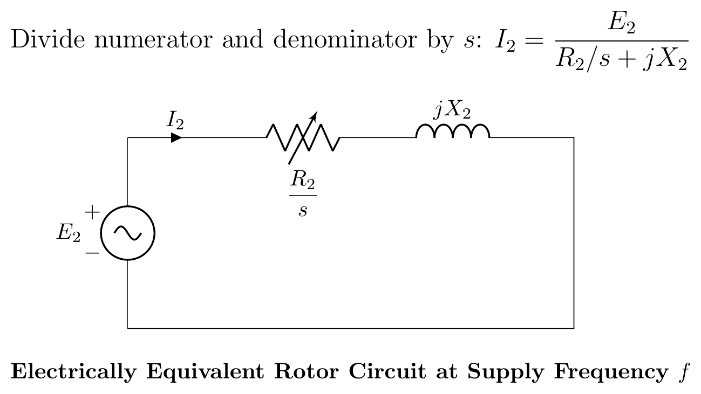

[← 2019 Answer](2019_answer.md) | [🏠 Index](README.md) | [2021 Answer →](2021_answer.md)

---

# ECE 2207: 2020 Semester Final: Exam Style Answers
**RUET · ECE Dept · 2nd Year Odd Semester 2020**
**Full Marks:** 72 · **Time:** 3 Hours · **Attempt any 6 (3 from each section)**

---

## SECTION - A (Transformers: Q1 to Q4)

### Question 1

**(a) What is the purpose of laminating the core in a transformer? [02]**

The iron core sits in an alternating magnetic field. This induces EMFs in the core itself, driving circulating currents called eddy currents. These currents cause $I^2R$ heating and waste energy.

Laminating the core (cutting it into thin sheets insulated from each other) breaks the low-resistance path for eddy currents. Each lamination has high resistance across its thickness. So eddy currents are confined to each thin sheet. Since power loss $\propto t^2$ (lamination thickness), thin laminations drastically reduce eddy current losses.

Typical lamination thickness: 0.3–0.5 mm for power frequency (50/60 Hz) transformers.

---

**(b) Derive the equivalent circuit of a single-phase two-winding transformer. [04]**

**Step 1: Ideal transformer with no losses, no leakage:**
$$\frac{V_1}{V_2} = \frac{N_1}{N_2} = a, \qquad I_1 = \frac{I_2}{a}$$

**Step 2: Add core loss and magnetizing current (shunt branch):**
Primary draws no-load current $I_0 = I_c + jI_m$ even at no load.
- $I_c$ in phase with $V_1$: represented by $R_c = V_1/I_c$ in shunt.
- $I_m$ lags $V_1$ by 90°: represented by $X_m = V_1/I_m$ in shunt.

**Step 3: Add primary winding resistance and leakage reactance:**
Series elements $R_1$ and $jX_1$ on the primary side.

**Step 4: Refer secondary to primary:**
Replace $R_2$, $jX_2$ with $a^2 R_2 = R_2'$, $ja^2 X_2 = jX_2'$ on the primary side.

**Step 5: Final approximate equivalent circuit (shunt branch at input):**

$$V_1 \to [R_1 + jX_1 + R_2' + jX_2'] \to E_1$$

Shunt branch ($R_c \| jX_m$) connected across $V_1$.

For simplicity, combine series elements:
$$R_{01} = R_1 + R_2', \quad X_{01} = X_1 + X_2'$$

---

**(c) Explain the working of a transformer under no-load with neat sketch. [03]**

When primary voltage $V_1$ is applied with secondary open ($I_2 = 0$):

1. Primary current $I_0$ flows (small, 2–10% of rated).
2. $I_0$ has two components:
   - **Magnetizing component $I_m$** (90° lagging from $V_1$): sets up the alternating core flux $\Phi_m$.
   - **Core-loss component $I_c$** (in phase with $V_1$): supplies hysteresis and eddy current losses.
3. Core flux $\Phi_m$ induces primary EMF $E_1 = 4.44 f N_1 \Phi_m$ (opposing $V_1$).
4. Same flux induces secondary EMF $E_2 = 4.44 f N_2 \Phi_m$.
5. Since secondary is open, $V_2 = E_2$. No output current flows.

$$I_0 = \sqrt{I_c^2 + I_m^2}, \qquad \cos\phi_0 = \frac{I_c}{I_0} = \frac{P_0}{V_1 I_0}$$

---

**(d) Transformer: turns ratio 4:1 step-down. No-load: 10A at pf 0.2 lag. Secondary load: 200A at 0.85 pf lag. Find primary current and pf. [03]**

**Given:** $I_0 = 10$ A, $\cos\phi_0 = 0.2$, $a = 4$ (step-down), $I_2 = 200$ A, $\cos\phi_2 = 0.85$ lag.

**No-load current components:**
$$I_c = I_0\cos\phi_0 = 10 \times 0.2 = 2.0 \text{ A}$$
$$I_m = I_0\sin\phi_0 = 10 \times \sin(78.46°) = 10 \times 0.9798 = 9.798 \text{ A}$$

**Secondary current referred to primary:** $I_2' = I_2/a = 200/4 = 50$ A at $\phi_2 = 31.79°$ lag.

**Phasor addition** (taking $V_1$ as reference, lagging components negative):

| Component | In-phase (A) | Quadrature (A) |
|:---|:---:|:---:|
| $I_0$ | $+2.0$ | $-9.798$ |
| $I_2'$ | $+50 \times 0.85 = +42.5$ | $-50 \times 0.527 = -26.35$ |
| $I_1$ total | $+44.5$ | $-36.15$ |

$$I_1 = \sqrt{44.5^2 + 36.15^2} = \sqrt{1980.25 + 1306.82} = \sqrt{3287.07} = \boxed{57.33 \text{ A}}$$

$$\cos\phi_1 = \frac{44.5}{57.33} = \boxed{0.776 \text{ lagging}}$$

---

### Question 2

**(a) Compare two-winding transformer and auto-transformer. [03]**

| Feature | Two-Winding Transformer | Auto-Transformer |
|:---|:---|:---|
| Windings | Two separate windings | Single winding with a tap |
| Isolation | Primary and secondary are electrically isolated | No galvanic isolation |
| Copper used | More | Less (saving = $1 - k$ fraction) |
| Efficiency | Slightly lower | Higher (part of power conducted directly) |
| Size/Weight | Larger | Smaller and lighter |
| Cost | Higher | Lower |
| Voltage ratio | Any ratio practical | Better for close ratios ($k \approx 1$) |
| Short-circuit current | Limited by leakage | Higher (less impedance) |
| Application | Power transmission, isolation needed | Starters, lab variacs, close-ratio power |

---

**(b) Prove: copper saved in auto-transformer = $(1-k)$ times that in ordinary transformer. [04]**

For a two-winding transformer of rating $VA$, secondary voltage $V_2$, secondary current $I_2$:
- Total copper used $\propto$ total conductor volume $\propto N_1 I_1 + N_2 I_2$
- Since $N_1 I_1 = N_2 I_2 = S/V$ (approximate for ideal): copper $\propto 2 \cdot N \cdot I \propto$ total ampere-turns.

For an auto-transformer with $k = V_2/V_1$ (step-down, $k < 1$):

The common winding (shared section) carries current $(I_2 - I_1)$.
The series winding carries current $I_1$.

Copper in auto-transformer:
$$W_{auto} \propto N_1 I_1 + N_2(I_2 - I_1)$$

$$= N_1 I_1 + N_2 I_2 - N_2 I_1 = N_1 I_1(1 + \frac{N_2}{N_1}) - N_2 I_1$$

Since $N_1 I_1 = N_2 I_2$ (approximately):
$$W_{auto} \propto N_2(I_2 - I_1) + N_1 I_1 = \text{ampere-turns of common section + series section}$$

Ratio of copper used:
$$\frac{W_{auto}}{W_{ordinary}} = 1 - k$$

Therefore:
$$\text{Copper saved} = W_{ordinary} - W_{auto} = W_{ordinary} - (1-k) W_{ordinary} = \boxed{k \cdot W_{ordinary}}$$

Or equivalently: copper in auto-transformer is $(1-k)$ fraction of ordinary transformer copper. *(Proved)*

---

**(c) Draw circuit diagrams for OC and SC tests on a single-phase transformer. [02]**

**1. Open-Circuit (OC) / No-Load Test:**
- **Connections:** LV winding connected to rated supply voltage ($V_1$) via Voltmeter ($V$), Ammeter ($A$), and LPF Wattmeter ($W$). HV winding is left **open-circuited**.
- **Yields:** Core loss ($W_0 \approx P_{core}$) and shunt branch parameters ($R_0, X_0$).

**2. Short-Circuit (SC) / Impedance Test:**
- **Connections:** LV winding is **solidly short-circuited** with a thick conductor strip. Reduced AC voltage ($5\text{--}10\%$ rated) is applied to HV winding via a Variac until rated current ($I_{sc}$) circulates.
- **Yields:** Full-load copper loss ($W_{sc} \approx P_{cu}$) and equivalent series impedance ($R_{01}, X_{01}, Z_{01}$).

---

**(d) No-load test: Primary = 220V, Secondary = 110V, $I_0 = 0.5$ A, Power = 30W. Find: (i) magnetizing current, (ii) loss component, (iii) iron loss. [03]**

*(Same as Q1(d) above: identical data and method.)*

$$P_{Fe} = 30 \text{ W}, \quad I_c = 0.136 \text{ A}, \quad I_m = 0.481 \text{ A}$$

---

### Question 3

**(a) Why are transformers rated in kVA? [02]**

Transformer losses are:
1. **Iron (core) loss:** Depends on supply voltage only. Independent of load current.
2. **Copper loss:** Depends on current squared ($I^2R$). Depends on load current, not on load power factor.

The total loss, and hence temperature rise and efficiency, depend on voltage and current: not on the power factor of the load. Since different loads connected to the same transformer have different power factors, the transformer can handle a given $V \times I$ product regardless of whether the load is resistive, inductive, or capacitive. So its rating is expressed in volt-amperes (VA or kVA), not in watts (kW).

---

**(b) What is an auto-transformer? Show copper saving compared to ordinary transformer. [05]**

**Auto-transformer:** A transformer in which a single winding acts as both primary and secondary. A tap on the winding divides it into a series section and a common section. Power is transferred partly by conduction (direct electrical connection) and partly by induction (magnetic coupling).

$$k = \frac{V_2}{V_1} = \frac{N_2}{N_1} \quad (\text{transformation ratio})$$

**Copper saving proof:**

In an ordinary transformer, total copper $W_T \propto (N_1 I_1 + N_2 I_2)$.

For the same kVA rating: $V_1 I_1 = V_2 I_2 = S$

In an auto-transformer:
- Series winding carries $I_1$, has $(N_1 - N_2)$ turns → copper $\propto (N_1 - N_2)I_1$
- Common winding carries $(I_2 - I_1)$, has $N_2$ turns → copper $\propto N_2(I_2 - I_1)$

Total auto copper:
$$W_A \propto (N_1 - N_2)I_1 + N_2(I_2 - I_1) = N_1 I_1 - N_2 I_1 + N_2 I_2 - N_2 I_1$$
$$= N_1 I_1 + N_2 I_2 - 2N_2 I_1 = W_T - 2N_2 I_1$$

Since $N_2/N_1 = k$ and $I_2/I_1 = 1/k$:

$$\frac{W_A}{W_T} = 1 - k$$

$$\boxed{\text{Copper saved} = k \cdot W_T}$$

Greater saving for $k \to 1$ (small voltage difference). Auto-transformers are most economical when the voltage ratio is close to 1 (e.g., 400/415V boosters, 3300/11000V is less efficient as auto-transformer).

---

**(c) Step-by-step equivalent circuit of a transformer referred to primary**1. Ideal Transformer Core Model:**
Start with an ideal core (zero winding resistance, zero leakage flux, infinite permeability, zero core loss).
$$E_1 = aE_2, \quad I_1 = I_2/a \quad \text{where } a = N_1/N_2$$

**2. Winding Resistances and Leakage Reactances:**
Add practical winding series resistance ($R_1, R_2$) and leakage reactance ($X_1, X_2$) on both sides.
$$V_1 = E_1 + I_1(R_1 + jX_1), \quad E_2 = V_2 + I_2(R_2 + jX_2)$$

**3. Core Excitation Shunt Branch:**
Add a parallel branch across $E_1$ to model core iron loss ($R_c$) and magnetizing reactance ($X_m$). The total no-load current is $I_0 = I_c + I_m$.

**4. Transferring Secondary to Primary (Exact Equivalent Circuit):**
To eliminate the ideal transformer, transfer secondary parameters to the primary using $a^2$:
$$R_2' = a^2R_2, \quad X_2' = a^2X_2, \quad V_2' = aV_2, \quad I_2' = I_2/a$$

**5. Approximate Equivalent Circuit:**
Since $I_0$ is small and the primary voltage drop $I_0(R_1+jX_1)$ is negligible, move the shunt branch to the primary terminals. The series impedances combine to $R_{01} = R_1 + R_2'$ and $X_{01} = X_1 + X_2'$.

---

### Question 4

**(a) Fields of application of auto-transformer. [03]**

1. **Starting of induction motors:** Reduced-voltage starting (auto-transformer starter).
2. **Laboratory variacs:** Variable voltage AC supplies for testing.
3. **Power transmission inter-ties:** Close-voltage-ratio interconnections between two power systems (e.g., 400kV/345kV).
4. **Railway traction:** 25kV/12.5kV boosters along the track.
5. **Voltage stabilizers:** Automatic voltage regulators for small consumers.
6. **Fluorescent lamp ballasts and dimmers:** Voltage adjustment.

---

**(b) 3-phase supply continuity with one burnt phase. Open-delta 57.7% proof. [05]**

**Yes: continuity is possible** using the **open-delta (V-V) connection**.

If one transformer in a Δ-Δ bank burns out, the remaining two can be reconnected in open-delta. Three-phase power still reaches the load, though at reduced capacity.

**Proof that open-Δ = 57.7% of closed-Δ:**

Let each transformer be rated $S$ kVA.

**Closed-Δ (3 transformers):** Total capacity $= 3S$ kVA.

**Open-Δ (2 transformers):**
Each transformer carries rated current $I$ at rated voltage $V$.
Each transformer delivers $S = VI$ kVA.
But for a balanced 3-phase load, the power factor of each transformer in open-Δ differs:
- One transformer supplies at power factor $\cos(30° + \phi)$
- The other at $\cos(30° - \phi)$

For unity load pf ($\phi = 0$):
Each transformer works at pf $= \cos 30° = \sqrt{3}/2$.

Output of each transformer $= V \cdot I \cdot \frac{\sqrt{3}}{2}$

Total open-Δ output $= 2 \times V \cdot I \cdot \frac{\sqrt{3}}{2} = \sqrt{3} \cdot VI = \sqrt{3} \cdot S$

$$\frac{\text{Open-Δ}}{\text{Closed-Δ}} = \frac{\sqrt{3}S}{3S} = \frac{1}{\sqrt{3}} = 0.577 = \boxed{57.7\%}$$

*(Proved)*

---

**(c) Two 25 kVA transformers in open-Δ, supply 220V balanced 3-phase load. [04]**

**(i) Total load without overloading:**

Open-Δ rating $= \sqrt{3} \times 25 = 43.3$ kVA.

Check: Each transformer handles 25 kVA. Two transformers in open-Δ: $2 \times 25 \times \cos 30° = 2 \times 25 \times 0.866 = 43.3$ kVA.

$$\boxed{\text{Load without overloading} = 43.3 \text{ kVA}}$$

**(ii) When third 25 kVA transformer closes the Δ:**

Closed-Δ rating $= 3 \times 25 = 75$ kVA.

$$\boxed{\text{Total load with closed-Δ} = 75 \text{ kVA}}$$

---

## SECTION - B (Induction Motors: Q5 to Q8)

### Question 5

**(a) Classify AC motors. [02]**

---

**(b) Why is an asynchronous motor treated as a rotating transformer? [04]**

| Feature | Transformer | Induction Motor (Asynchronous Motor) |
|:---|:---|:---|
| Primary | Primary winding | Stator winding |
| Secondary | Secondary winding | Rotor bars/winding |
| Medium | Static iron core | Rotating air gap |
| Power transfer | By mutual induction | By rotating magnetic field |
| Secondary circuit | Short-circuited (loaded) | Short-circuited (end rings) |
| Secondary current | Load current | Rotor current → produces torque |

The stator is the "primary": it receives power from the supply. The rotor is the "secondary": it receives power by induction and converts it to mechanical work. At standstill, a 3-phase IM is essentially a 3-phase transformer with a short-circuited secondary. When the rotor runs at slip $s$, the rotor EMF = $sE_2$ and rotor frequency = $sf$: exactly like a transformer operating at reduced frequency.

---

**(c) How can the equivalent circuit model of an induction motor be obtained? [06]**

**1. Stator Model and Standstill Rotor ($s=1$):**
At standstill, the motor acts like a transformer. Stator has $R_1, X_1$ and shunt branch $R_c, X_m$. Rotor has $R_2$ and $X_2$ at frequency $f$.

**2. Rotor at Running Slip $s$:**
Rotor frequency is $sf$, induced EMF is $sE_2$, and reactance is $sX_2$.
$$I_2 = \frac{sE_2}{R_2 + jsX_2}$$

**3. Frequency Transformation:**
Divide the current equation by $s$ to refer the rotor to stator frequency $f$:
$$I_2 = \frac{E_2}{R_2/s + jX_2}$$
The rotor resistance is modeled as a variable resistance $R_2/s$.

**4. Power Separation:**
Split $R_2/s$ into actual copper loss and mechanical load components:
$$\frac{R_2}{s} = R_2 + R_2\left(\frac{1-s}{s}\right)$$
$R_2$ causes heat ($P_{cu}$), and $R_L = R_2(1-s)/s$ represents gross mechanical power ($P_m$).

**5. Exact Equivalent Circuit (Referred to Stator):**
Refer rotor parameters to stator using turns ratio $a = N_1/N_2$:
$$R_2' = a^2R_2, \quad X_2' = a^2X_2, \quad R_L' = R_2'\left(\frac{1-s}{s}\right)$$

**6. Approximate Equivalent Circuit:**
Since stator voltage drop is small, the shunt branch can be shifted to the input terminals.

---

### Question 6

**(a) How can the direction of rotation of a 3-phase IM be reversed? [02]**

Interchange any two of the three supply phase connections to the stator terminals. For example, swap phase A and phase B connections.

This reverses the phase sequence (A-B-C → B-A-C), which reverses the direction of the rotating magnetic field. Since the rotor follows the RMF, the rotor also reverses direction.

---

**(b) Starting from equivalent circuit, derive power equations of an induction motor. [04]**

From the equivalent circuit, per-phase power flow:

**Stator input power:**
$$P_1 = 3V_1 I_1 \cos\phi_1$$

**Stator copper loss:**
$$P_{s,Cu} = 3 I_1^2 R_1$$

**Stator iron loss:**
$$P_{Fe} = 3 V_1^2/R_c \approx 3 E_1^2/R_c$$

**Air-gap power (power transferred to rotor):**
$$P_g = P_1 - P_{s,Cu} - P_{Fe} = 3 I_2^2 \cdot \frac{R_2}{s}$$

**Rotor copper loss:**
$$P_{r,Cu} = 3 I_2^2 R_2 = s \cdot P_g$$

**Gross mechanical power:**
$$P_m = P_g - P_{r,Cu} = P_g(1-s) = 3 I_2^2 R_2 \frac{1-s}{s}$$

**Net output power:**
$$P_{out} = P_m - P_{friction+windage}$$

**Summary ratios:** $P_g : P_{r,Cu} : P_m = 1 : s : (1-s)$

---

**(c) Why is a synchronous motor not self-starting? [02]**

A synchronous motor requires the rotor to rotate in synchronism with the stator RMF. At starting:

1. The stator RMF immediately rotates at synchronous speed $N_s = 120f/P$ rpm.
2. The rotor (with field winding energized) is at rest.
3. The stator field grabs the rotor poles and tries to pull them around.
4. But the rotor has inertia. Before it can respond, the stator field has already rotated 180° and is now pulling in the opposite direction.
5. Net average torque over one cycle = 0.

So a synchronous motor cannot self-start. A damper winding (squirrel-cage bars on the rotor pole faces) is used to start it as an induction motor. Then the field winding is energized to pull it into synchronism.

---

**(d) 400V, 50 Hz, 6-pole, 3-φ IM. Rotor power input = 75 kW. Rotor EMF makes 100 alternations per minute. Find: (i) slip, (ii) rotor speed, (iii) rotor Cu losses per phase, (iv) mechanical power. [04]**

**Given:** $P_g = 75$ kW, $P = 6$, $f = 50$ Hz

Rotor EMF frequency: 100 alternations per minute = 100/60 Hz $= 5/3$ Hz

**(i) Slip:**
$$f_r = sf \implies s = \frac{f_r}{f} = \frac{100/60}{50} = \frac{100}{3000} = \boxed{0.0333 = 3.33\%}$$

**(ii) Synchronous speed:**
$$N_s = \frac{120 \times 50}{6} = 1000 \text{ rpm}$$

**Rotor speed:**
$$N = N_s(1-s) = 1000(1 - 0.0333) = \boxed{966.7 \text{ rpm}}$$

**(iii) Rotor copper losses (total):**
$$P_{r,Cu} = s \times P_g = 0.0333 \times 75000 = 2500 \text{ W}$$

**Per phase:**
$$P_{r,Cu,\text{phase}} = \frac{2500}{3} = \boxed{833.3 \text{ W}}$$

**(iv) Mechanical power:**
$$P_m = (1-s)P_g = (1 - 0.0333) \times 75000 = 0.9667 \times 75000 = \boxed{72500 \text{ W} = 72.5 \text{ kW}}$$

---

### Question 7

**(a) Describe any one method for making single-phase IM self-starting. [03]**

**Capacitor-start method:**

A single-phase IM has a main winding (M) and an auxiliary (starting) winding (A) placed 90° apart in space. A capacitor is connected in series with the auxiliary winding.

The capacitor advances the phase of the auxiliary winding current. If the capacitor value is chosen correctly, the auxiliary current leads the main current by nearly 90° in time. This 90° time-phase shift between $I_m$ and $I_a$, combined with the 90° space separation of the windings, produces a rotating magnetic field. This RMF develops a starting torque.

Once the motor reaches about 75% of synchronous speed, a centrifugal switch opens and disconnects the auxiliary winding. The motor continues to run on the main winding alone.

**Starting torque:** $\approx 200$–400% of full-load torque.

---

**(b) Show that maximum torque varies proportionally with $V^2$. [04]**

The rotor EMF at standstill $E_2 \propto V$ (supply voltage), since $E_2 = K \cdot V$ (transformation ratio).

Maximum torque:
$$T_{\max} = \frac{kE_2^2}{2X_2}$$

Since $E_2 \propto V$:
$$T_{\max} \propto E_2^2 \propto V^2$$

$$\boxed{T_{\max} \propto V^2}$$

This means a 10% voltage drop reduces maximum torque by about 19% (since $(0.9)^2 = 0.81$, a drop to 81% of original). Voltage sags are therefore very damaging to motor performance. *(Shown)*

---

**(c) Prove that star-delta starter is equivalent to an auto-transformer of ratio $1/\sqrt{3}$ (58%). [05]**

**Direct-on-line (DOL) starting: delta connection:**

Each stator phase sees full line voltage $V_L$. Per-phase starting impedance $Z_s$. Starting current per phase:
$$I_{\phi,DOL} = \frac{V_L}{Z_s}$$

Line current (delta connection): $I_{L,DOL} = \sqrt{3} I_{\phi,DOL} = \frac{\sqrt{3} V_L}{Z_s}$

**Star-delta starting: star connection:**

Each phase sees $V_L/\sqrt{3}$. Starting current per phase:
$$I_{\phi,Y} = \frac{V_L/\sqrt{3}}{Z_s} = \frac{V_L}{\sqrt{3} Z_s}$$

Line current (star connection) = phase current:
$$I_{L,Y} = I_{\phi,Y} = \frac{V_L}{\sqrt{3} Z_s}$$

**Ratio of starting line currents:**
$$\frac{I_{L,Y}}{I_{L,DOL}} = \frac{V_L/(\sqrt{3} Z_s)}{\sqrt{3} V_L/Z_s} = \frac{1}{3}$$

Starting current is reduced to $1/3$ of DOL current.

**Auto-transformer equivalence:**

For an auto-transformer with ratio $x = V_2/V_1$, the supply current is $x^2$ times the DOL current.

Here: $x^2 = 1/3 \implies x = 1/\sqrt{3} = 0.577 \approx 58\%$

$$\boxed{\text{Star-delta starter} \equiv \text{Auto-transformer starter with ratio } \frac{1}{\sqrt{3}} = 57.7\%}$$

*(Proved)*

---

### Question 8

**(a) Define: (i) Plugging, (ii) Slip. [02]**

**(i) Plugging:** An electric braking method. The phase sequence of the stator supply is reversed while the motor is running. The motor develops a torque opposing its current direction of rotation. The motor decelerates rapidly. The supply must be disconnected when speed reaches zero, otherwise the motor reverses.

**(ii) Slip:** The fractional difference between synchronous speed and rotor speed:
$$s = \frac{N_s - N}{N_s}$$

At standstill: $s = 1$. At synchronous speed: $s = 0$ (never reached in practice). Normal full-load: $s = 0.02$–$0.05$ (2–5%).

---

**(b) Derive torque-slip characteristics of 3-phase IM and explain. [03]**

Torque equation:
$$T = \frac{k s E_2^2 R_2}{R_2^2 + s^2 X_2^2}$$

**Key points on the curve:**

- At $s = 0$ (synchronous speed): $T = 0$.
- As $s$ increases from 0: torque increases (because $sE_2^2 R_2$ grows faster than denominator initially).
- At $s = s_{mT} = R_2/X_2$: $T = T_{\max}$ (maximum torque, pull-out torque).
- For $s > s_{mT}$: torque decreases (denominator grows faster).
- At $s = 1$ (standstill): $T = T_{st}$ (starting torque, usually 1.5–2 × full-load torque for typical motors).

**The motor operates stably only in the region $0 < s < s_{mT}$** (positive slope of T-s curve). In this region, if load increases, speed drops (slip increases), torque increases to meet the load: a stable equilibrium. In the region $s > s_{mT}$, the motor is unstable and will stall.

---

**(c) Explain the double-field revolving theory for single-phase IM. [04]**

A single-phase stator winding carries alternating current $i = I_m\sin\omega t$. It creates a pulsating magnetic flux along one fixed axis:
$$\Phi = \Phi_m\sin\omega t$$

**Decomposition:** This pulsating flux can be resolved into two equal halves rotating in opposite directions:

$$\Phi = \underbrace{\frac{\Phi_m}{2}\sin(\omega t - \theta)}_{\text{Forward field}} + \underbrace{\frac{\Phi_m}{2}\sin(\omega t + \theta)}_{\text{Backward field}}$$

In vector form:
- **Forward RMF ($\Phi_f$):** Magnitude $\Phi_m/2$, rotates at $+N_s$ (counterclockwise).
- **Backward RMF ($\Phi_b$):** Magnitude $\Phi_m/2$, rotates at $-N_s$ (clockwise).

**Torques produced:**

At rotor speed $N$, slip for forward field $s_f = (N_s - N)/N_s = s$.
Slip for backward field $s_b = (N_s + N)/N_s = (2 - s)$.

- $T_f = f(s)$: forward torque (positive direction)
- $T_b = f(2-s)$: backward torque (negative direction)

**At standstill ($s = 1$):** $s_f = 1$, $s_b = 1$, so $T_f = T_b$. Net torque $= 0$.

**When running (given a push):** At $s < 1$: $s_f < s_b$, so $T_f > T_b$. Net torque $> 0$ in forward direction. Motor continues to run.

**Conclusion:** A single-phase IM has zero starting torque. It needs an auxiliary starting arrangement.

---

**(d) How is the V-curve for a synchronous motor obtained? [03]**

A V-curve shows the relationship between armature current $I_a$ and field current $I_f$ at constant load (constant mechanical output).

**Procedure:**
1. Run the synchronous motor at constant mechanical load.
2. Vary the field current $I_f$ from underexcited (low $I_f$) to overexcited (high $I_f$).
3. Record armature current $I_a$ at each field current setting.

**Shape of curve:**
- At unity power factor (certain value of $I_f$): $I_a$ is minimum. This is the bottom of the V.
- Below unity pf (underexcited): $I_a$ increases and lags voltage (lagging pf).
- Above unity pf (overexcited): $I_a$ increases and leads voltage (leading pf, acts as capacitor bank).

---

*Source:* [PrevYearQuestions/2020.md](../PrevYearQuestions/2020.md)

---

[← 2019 Answer](2019_answer.md) | [🏠 Index](README.md) | [2021 Answer →](2021_answer.md)
