[← 2021 Answer](2021_answer.md) | [🏠 Index](README.md) | [2024 Answer →](2024_answer.md)

---

# ECE 2207: 2023 Semester Final: Exam Style Answers
**RUET · ECE Dept · 2nd Year Even Semester Examination, 2023**
**Course No:** ECE 2207 | **Course Title:** Electrical Machines I | **Full Marks:** 60 | **Time:** 3 Hours
**Answer SIX questions taking any THREE from each section. Each question carries 10 marks.**

> [!info] Format
> Section A (Q1–Q4) is transformers. Section B (Q5–Q8) is induction motors. Each question is 10 marks split into three sub-parts, and every sub-part carries its own Course Outcome tag. The marks and CO shown in each heading below are taken from the question paper margin.
>
> Question source: [PrevYearQuestions/2023.md](../PrevYearQuestions/2023.md)

---

# SECTION - A

## Question 1

### **(a) Show that the rms value of the induced emf in the whole of primary winding is $E_1 = 4.44\, f N_1 B_m A$. [CO1, Marks: 03]**

Let the core flux be sinusoidal:
$$\Phi(t) = \Phi_m \sin \omega t, \qquad \omega = 2\pi f$$

where $\Phi_m = B_m A$ is the peak flux, $B_m$ is the peak flux density and $A$ is the net cross-sectional area of the core.

**Step 1. Apply Faraday's law to all $N_1$ turns.**

The same mutual flux links every primary turn, so the emf of the whole winding is $N_1$ times the emf per turn:
$$e_1 = -N_1 \frac{d\Phi}{dt} = -N_1 \omega \Phi_m \cos \omega t$$

**Step 2. Pick off the peak value.**
$$E_{m1} = N_1 \omega \Phi_m = 2\pi f N_1 \Phi_m$$

**Step 3. Convert to rms.** For a sine wave, rms $=$ peak$/\sqrt{2}$:
$$E_1 = \frac{2\pi f N_1 \Phi_m}{\sqrt{2}} = \sqrt{2}\,\pi f N_1 \Phi_m = 4.44\, f N_1 \Phi_m$$

**Step 4. Put the flux in terms of flux density.** Since $\Phi_m = B_m A$:

$$\boxed{E_1 = 4.44\, f N_1 B_m A \ \text{volt}}$$

> [!success] Alternative route (average-value method)
> The flux swings from $-\Phi_m$ to $+\Phi_m$ in half a cycle, so it takes $T/4 = 1/4f$ second to go from $0$ to $\Phi_m$.
> Average rate of change $= \Phi_m / (1/4f) = 4f\Phi_m$, so average emf per turn $= 4f\Phi_m$.
> For a sine wave the form factor is $1.11$, so $E_1 = 1.11 \times 4 f N_1 \Phi_m = 4.44 f N_1 \Phi_m$.

The same argument on the secondary gives $E_2 = 4.44 f N_2 B_m A$. Also note $e_1$ lags $\Phi$ by $90°$.

---

### **(b) Briefly describe the effect of variation of load on core flux and primary current of a transformer. [CO1, Marks: 03]**

**1. Core flux stays practically constant at every load.**

From the emf equation, $V_1 \approx E_1 = 4.44 f N_1 \Phi_m$. Both $V_1$ and $f$ are fixed by the supply. So
$$\Phi_m \approx \frac{V_1}{4.44 f N_1} = \text{constant}$$

A transformer is therefore a **constant-flux machine**.

**2. The m.m.f. balance is what keeps it constant.**

When load current $I_2$ starts to flow, its m.m.f. $N_2 I_2$ opposes the core flux by Lenz's law. The flux dips a little. So $E_1$ drops a little. The gap $(V_1 - E_1)$ widens, and the primary at once draws an extra current $I_2'$ large enough to cancel the secondary m.m.f.:
$$N_1 I_2' = N_2 I_2 \implies I_2' = K I_2, \qquad K = \frac{N_2}{N_1}$$

The net m.m.f. on the core goes back to $N_1 I_0$, so the flux is restored.

**3. Primary current rises almost in step with the load.**
$$\vec{I}_1 = \vec{I}_0 + \vec{I}_2'$$

$I_0$ is small and fixed. $I_2'$ is proportional to load. So $I_1$ grows nearly linearly from $I_0$ at no load up to rated value at full load. The primary power factor also improves from the very poor $\cos\phi_0$ toward the load power factor.

**4. Effect on losses.**

| Quantity | Behaviour with load |
|:---|:---|
| Core flux $\Phi_m$ | Constant |
| Iron loss $P_{Fe}$ | Constant (depends on $\Phi_m$ and $f$ only) |
| Primary current $I_1$ | Rises with load |
| Copper loss $P_{Cu}$ | Rises as $I_1^2$ |

---

### **(c) Define voltage transformation ratio. A transformer has a primary winding of 800 turns and a secondary winding of 200 turns. When the load current on the secondary is 80 A at 0.8 P.F. lagging, the primary current is 25 A at 0.707 P.F. lagging. Determine the no-load current of the transformer and its phase with respect to the voltage. [CO3, Marks: 04]**

**Definition.** The voltage transformation ratio $K$ is the ratio of secondary to primary induced emf, which equals the turns ratio:
$$K = \frac{E_2}{E_1} = \frac{N_2}{N_1} = \frac{I_1}{I_2}$$

$K > 1$ means step-up, $K < 1$ means step-down.

**Given:** $N_1 = 800$, $N_2 = 200$, $I_2 = 80\text{ A}$ at $\cos\phi_2 = 0.8$ lag, $I_1 = 25\text{ A}$ at $\cos\phi_1 = 0.707$ lag.

**Step 1. Transformation ratio and load component of primary current.**
$$K = \frac{200}{800} = 0.25$$
$$I_2' = K I_2 = 0.25 \times 80 = 20\text{ A}$$

**Step 2. Resolve both currents with $V_1$ as reference.**

$\phi_2 = \cos^{-1} 0.8 = 36.87°$, so $\sin\phi_2 = 0.6$.
$\phi_1 = \cos^{-1} 0.707 = 45°$, so $\sin\phi_1 = 0.707$.

$$\vec{I}_2' = 20\angle{-36.87°} = (16 - j12)\text{ A}$$
$$\vec{I}_1 = 25\angle{-45°} = (17.68 - j17.68)\text{ A}$$

**Step 3. Use $\vec{I}_1 = \vec{I}_0 + \vec{I}_2'$.**
$$\vec{I}_0 = \vec{I}_1 - \vec{I}_2' = (17.68 - 16) + j(-17.68 + 12) = (1.675 - j5.680)\text{ A}$$

**Step 4. Magnitude and phase.**
$$I_0 = \sqrt{1.675^2 + 5.680^2} = \sqrt{2.806 + 32.26} = 5.92\text{ A}$$
$$\phi_0 = \tan^{-1}\frac{5.680}{1.675} = 73.6°\ \text{lagging}$$

$$\boxed{I_0 = 5.92\text{ A, lagging } V_1 \text{ by } 73.6° \quad (\cos\phi_0 = 0.283)}$$

> [!info] Sanity check
> $I_0$ is about 24% of $I_1$ and its power factor is very poor. Both are what a no-load current should look like, since it is nearly all magnetising current.

---

## Question 2

### **(a) Define power transformer. Prove that, the efficiency of a transformer will be maximum when copper loss is equal to iron loss. [CO2, Marks: 03]**

**Power transformer.** A power transformer is a large, high-rating static transformer used in generating stations and transmission substations to step voltage up or down at bulk power levels. It runs near full load for most of the day, is designed for the highest possible full-load efficiency, and is usually oil-immersed with forced cooling.

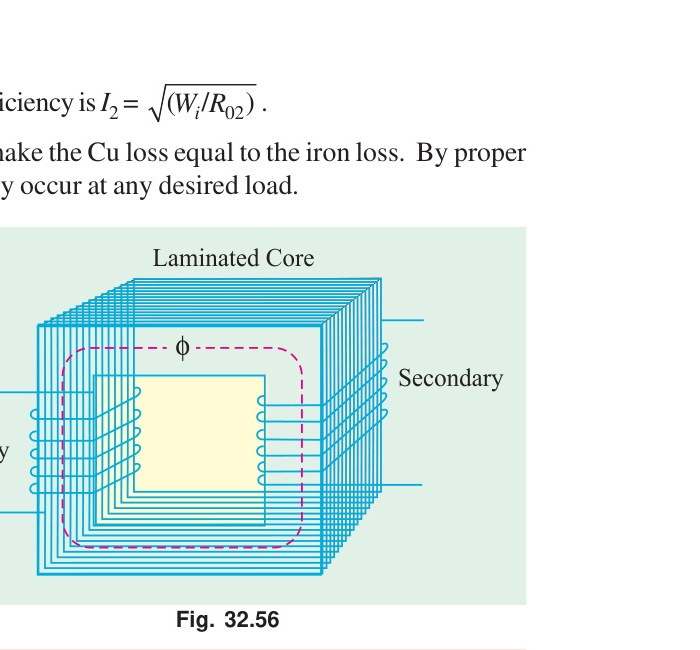

**Proof.** Let the secondary carry current $I_2$ at terminal voltage $V_2$ and power factor $\cos\phi$. Let $P_i$ be the iron loss and $R_{02}$ the total resistance referred to the secondary.

$$\eta = \frac{\text{output}}{\text{output} + \text{losses}} = \frac{V_2 I_2 \cos\phi}{V_2 I_2 \cos\phi + P_i + I_2^2 R_{02}}$$

Divide numerator and denominator by $I_2$:
$$\eta = \frac{V_2 \cos\phi}{V_2 \cos\phi + \dfrac{P_i}{I_2} + I_2 R_{02}}$$

$V_2$ and $\cos\phi$ are held constant. So $\eta$ is maximum when the denominator is minimum, which means
$$\frac{d}{dI_2}\left(\frac{P_i}{I_2} + I_2 R_{02}\right) = 0$$
$$-\frac{P_i}{I_2^2} + R_{02} = 0$$
$$\therefore\ I_2^2 R_{02} = P_i$$

$$\boxed{\text{Copper loss} = \text{Iron loss at maximum efficiency}}$$

The second derivative is $2P_i/I_2^3 > 0$, so this is a true minimum of the loss term and a maximum of $\eta$.

**Load at which it happens.** If $P_{Cu,FL}$ is the full-load copper loss, the load fraction $x$ for maximum efficiency follows from $x^2 P_{Cu,FL} = P_i$:
$$x = \sqrt{\frac{P_i}{P_{Cu,FL}}}, \qquad \text{kVA}_{\eta\max} = \text{kVA}_{FL}\sqrt{\frac{P_i}{P_{Cu,FL}}}$$

---

### **(b) The corrected instrument readings obtained from open and short-circuit tests on 10-kVA, 450/120 V, 50-Hz transformer are: [CO3, Marks: 04]**
> **O.C. test:** $V_1 = 120\text{ V}$; $I_1 = 4.2\text{ A}$; $W_1 = 80\text{ W}$ (read on the low voltage side).
> **S.C. test:** $V_1 = 9.65\text{ V}$; $I_1 = 22.2\text{ A}$; $W_1 = 120\text{ W}$ (with low-voltage winding short circuited).
>
> Compute **(i)** Equivalent circuit constants, **(ii)** Efficiency and voltage regulation for an 80% lagging p.f. load.

**Which side is which.** Rated HV current $= 10000/450 = 22.2\text{ A}$ and rated LV current $= 10000/120 = 83.3\text{ A}$. The S.C. reading of 22.2 A is therefore the HV (450 V, primary) side. The O.C. test is on the LV (120 V) side.

#### (i) Equivalent circuit constants

**From the O.C. test (shunt branch, LV side):**
$$\cos\phi_0 = \frac{W_0}{V I_0} = \frac{80}{120 \times 4.2} = 0.159, \qquad \sin\phi_0 = 0.987$$
$$I_w = I_0 \cos\phi_0 = 4.2 \times 0.159 = 0.667\text{ A}, \qquad I_\mu = I_0 \sin\phi_0 = 4.2 \times 0.987 = 4.147\text{ A}$$
$$R_0' = \frac{120}{0.667} = 180\ \Omega, \qquad X_0' = \frac{120}{4.147} = 28.9\ \Omega \quad \text{(LV side)}$$

Refer to the primary with $a = 450/120 = 3.75$, so $a^2 = 14.06$:
$$\boxed{R_0 = 180 \times 14.06 = 2531\ \Omega \approx 2525\ \Omega, \qquad X_0 = 28.9 \times 14.06 = 407\ \Omega \approx 406\ \Omega}$$

Iron loss $P_i = 80\text{ W}$.

**From the S.C. test (series branch, referred to primary):**
$$Z_{01} = \frac{V_{sc}}{I_{sc}} = \frac{9.65}{22.2} = 0.435\ \Omega$$
$$R_{01} = \frac{W_{sc}}{I_{sc}^2} = \frac{120}{22.2^2} = \frac{120}{492.8} = 0.243\ \Omega$$
$$X_{01} = \sqrt{Z_{01}^2 - R_{01}^2} = \sqrt{0.435^2 - 0.243^2} = \sqrt{0.1892 - 0.0590} = 0.361\ \Omega$$

$$\boxed{R_{01} = 0.243\ \Omega, \quad X_{01} = 0.361\ \Omega, \quad Z_{01} = 0.435\ \Omega}$$

Full-load copper loss $P_{Cu} = 120\text{ W}$.

#### (ii) Efficiency and voltage regulation at 80% lagging p.f.

**Efficiency (full load):**
$$\text{Output} = 10000 \times 0.8 = 8000\text{ W}$$
$$\text{Total loss} = P_i + P_{Cu} = 80 + 120 = 200\text{ W}$$
$$\eta = \frac{8000}{8000 + 200} \times 100\%$$

$$\boxed{\eta = 97.56\%}$$

**Voltage regulation.** Full-load primary current $I_1 = 10000/450 = 22.2\text{ A}$, $\cos\phi = 0.8$, $\sin\phi = 0.6$:
$$\text{Drop} = I_1 (R_{01}\cos\phi + X_{01}\sin\phi) = 22.2\,(0.243 \times 0.8 + 0.361 \times 0.6) = 22.2 \times 0.4112 = 9.13\text{ V}$$
$$\%\text{Reg} = \frac{9.13}{450} \times 100\%$$

$$\boxed{\text{Voltage regulation} = 2.03\% \ \text{(lagging, so it is a voltage drop)}}$$

> [!info] Cross-check
> Working on the LV side instead gives $R_{02} = 0.0173\ \Omega$, $X_{02} = 0.0256\ \Omega$, $I_2 = 83.3\text{ A}$, drop $= 2.43\text{ V}$ out of 120 V, which is the same 2.03%.

---

### **(c) Prove that less copper is used in auto-transformer than in an ordinary transformer. [CO2, Marks: 03]**

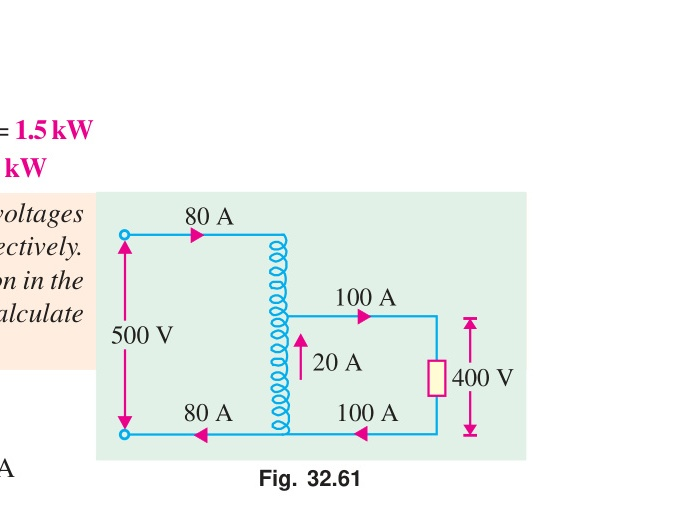

**Basis.** The weight of copper in a winding is proportional to (number of turns) $\times$ (current it carries), since turns fix the length and current fixes the cross-section:
$$W \propto N I$$

**Two-winding transformer.** It has two separate windings:
$$W_o \propto N_1 I_1 + N_2 I_2$$

**Auto-transformer (step-down, $N_1$ total turns, tapped at $N_2$).** It has one winding in two sections:
- Series section $AB$: $(N_1 - N_2)$ turns carrying $I_1$
- Common section $BC$: $N_2$ turns carrying $(I_2 - I_1)$

$$W_a \propto (N_1 - N_2) I_1 + N_2 (I_2 - I_1)$$

**Take the ratio.**
$$\frac{W_a}{W_o} = \frac{(N_1 - N_2)I_1 + N_2(I_2 - I_1)}{N_1 I_1 + N_2 I_2} = \frac{N_1 I_1 + N_2 I_2 - 2 N_2 I_1}{N_1 I_1 + N_2 I_2}$$

Now use the m.m.f. balance $N_1 I_1 = N_2 I_2$. The denominator becomes $2 N_1 I_1$ and the numerator becomes $2N_1 I_1 - 2 N_2 I_1$:
$$\frac{W_a}{W_o} = \frac{2 I_1 (N_1 - N_2)}{2 N_1 I_1} = 1 - \frac{N_2}{N_1} = 1 - K$$

$$\boxed{W_a = (1 - K)\,W_o \qquad \text{Saving of copper} = K \, W_o}$$

Since $0 < K < 1$ always, $W_a < W_o$. So an auto-transformer always uses less copper. The saving grows as $K \to 1$. For $K = 0.9$ the saving is 90%.

---

## Question 3

### **(a) Is it possible to continue $3-\varphi$ power supply when one phase is burn out? If "yes" then explain one method. [CO1, Marks: 04]**

**Yes, it is possible.** The method is the **open-delta (V-V) connection**.

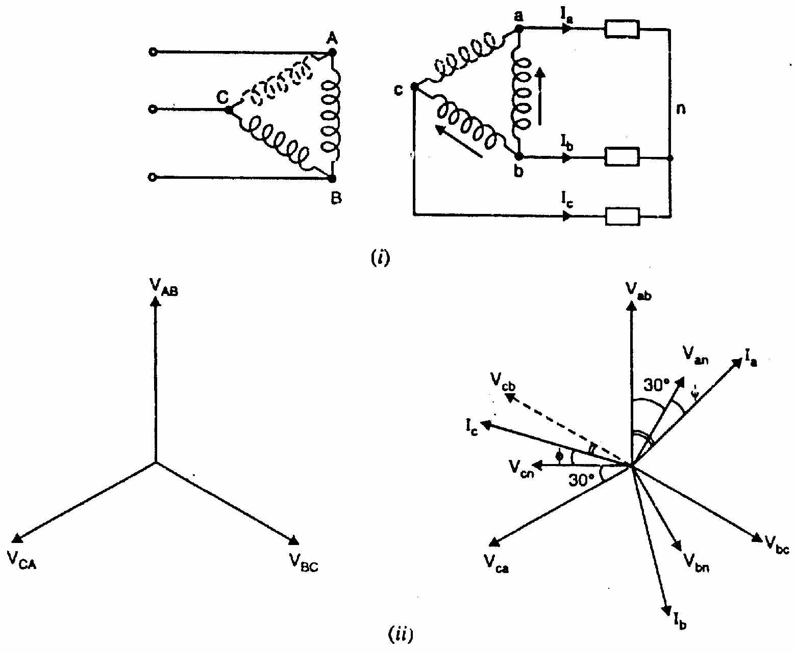

**How it works.** Start from a $\Delta$–$\Delta$ bank of three single-phase transformers. If one unit burns out, disconnect and remove it. The remaining two are left connected in a "V" shape on both sides.

The two healthy transformers still produce two line voltages directly. The third line voltage appears across the open corner, because in a balanced 3-phase system the three line voltages sum to zero:
$$\vec{V}_{CA} = -(\vec{V}_{AB} + \vec{V}_{BC})$$

So the load still sees three balanced line voltages, $120°$ apart. Supply continues without interruption.

**Capacity.** Let $V$ and $I$ be the rated winding voltage and current of one transformer.

Closed $\Delta$–$\Delta$ bank:
$$S_{\Delta\Delta} = 3 V I$$

In open delta the line current is limited to the winding current of one transformer, so $I_L = I$ and $V_L = V$:
$$S_{VV} = \sqrt{3}\, V_L I_L = \sqrt{3}\, V I$$

$$\frac{S_{VV}}{S_{\Delta\Delta}} = \frac{\sqrt{3} V I}{3 V I} = \frac{1}{\sqrt{3}} = 0.577$$

$$\boxed{\text{Open-delta capacity} = 57.7\%\ \text{of the original } \Delta\text{--}\Delta \text{ bank}}$$

The two surviving units are each loaded to
$$\frac{\sqrt{3} V I}{2 V I} = \frac{\sqrt{3}}{2} = 86.6\%\ \text{of their own rating}$$

**Limitations.** The two transformers work at unequal power factors, $\cos(30° - \phi)$ and $\cos(30° + \phi)$. Secondary voltages fall slightly out of balance on load. It is an emergency or light-load arrangement only.

---

### **(b) Define all day efficiency of a transformer. A 100-kVA lighting transformer has a full-load loss of 3 kW, the losses being equally divided between iron and copper. During a day, the transformer operates on full load for 3 hours, one-half load for 4 hours, the output being negligible for the remainder of the day. Calculate the all day efficiency. [CO3, Marks: 04]**

**Definition.** All-day (or energy) efficiency is the ratio of energy output in kWh to energy input in kWh over 24 hours:
$$\eta_{\text{all-day}} = \frac{\text{kWh output in 24 h}}{\text{kWh output} + \text{kWh iron loss} + \text{kWh copper loss}}$$

It is used for distribution transformers, which stay energised all day but are loaded only part of the day. The iron loss then runs for 24 hours while the copper loss runs only while loaded.

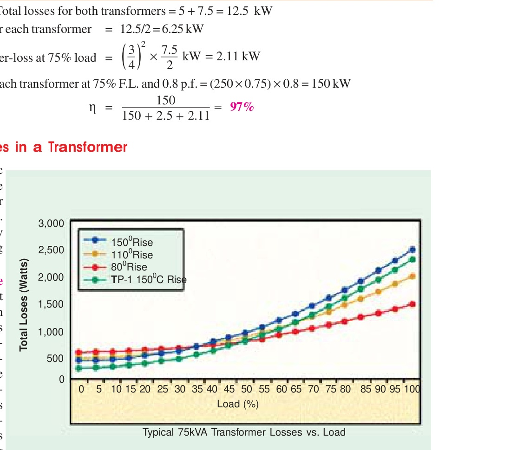

**Given:** 100 kVA, full-load loss $= 3\text{ kW}$ shared equally, so
$$P_{Fe} = P_{Cu,FL} = 1.5\text{ kW}$$

A lighting load is treated as unity power factor, so 100 kVA gives 100 kW.

**Step 1. Energy output in 24 h.**

| Period | Load | Output (kW) | Hours | kWh |
|:---|:---|---:|---:|---:|
| Full load | 100% | 100 | 3 | 300 |
| Half load | 50% | 50 | 4 | 200 |
| Rest | negligible | 0 | 17 | 0 |
| **Total** | | | **24** | **500** |

$$\text{Output} = 300 + 200 = 500\text{ kWh}$$

**Step 2. Iron loss for the full 24 hours.** The transformer stays energised, so
$$\text{kWh}_{Fe} = 1.5 \times 24 = 36\text{ kWh}$$

**Step 3. Copper loss, which follows the square of load.**
$$\text{kWh}_{Cu} = \underbrace{1.5 \times 3}_{\text{full load}} + \underbrace{1.5 (0.5)^2 \times 4}_{\text{half load}} = 4.5 + 0.375 \times 4 = 4.5 + 1.5 = 6\text{ kWh}$$

**Step 4. All-day efficiency.**
$$\eta_{\text{all-day}} = \frac{500}{500 + 36 + 6} = \frac{500}{542}$$

$$\boxed{\eta_{\text{all-day}} = 92.25\%}$$

> [!info] Why it is so much lower than full-load efficiency
> At full load, $\eta = 100/(100+1.5+1.5) = 97.1\%$. Over the day the 36 kWh of iron loss dominates, because the transformer is magnetised for 24 hours but delivers useful output for only 7 of them.

---

### **(c) Mention the limitations of a Y-Y connected transformer. [CO1, Marks: 02]**

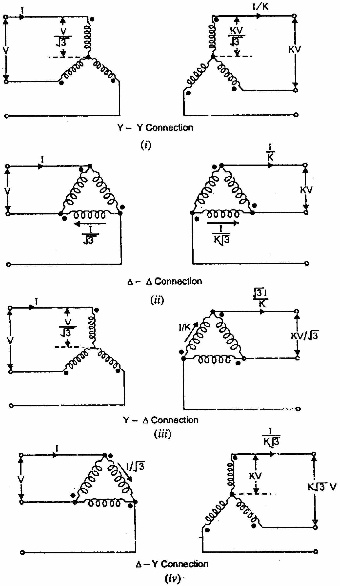

1. **Third-harmonic trouble.** The magnetising current needs a third-harmonic component. In Y-Y with isolated neutrals there is no closed path for it, so the flux wave is distorted and a large third-harmonic voltage (up to about 5 times normal) appears in each phase voltage.

2. **Neutral shifting on unbalanced load.** With an unbalanced or single-phase load and no neutral wire, the star point moves. Phase voltages become unequal, so some loads see over-voltage and others see under-voltage.

3. **Needs a neutral or a tertiary winding.** Both faults above are cured only by solidly earthing the neutrals or by adding a third delta (tertiary) winding. That adds cost.

4. **No emergency open-delta operation.** If one unit fails, a Y-Y bank cannot run as open delta. Supply is lost.

5. **Insulation cost.** Each winding must be insulated for $V_L/\sqrt{3}$, which is an advantage, but surge and harmonic stresses offset it.

> [!success] Exam line
> Y-Y is rarely used in practice. $\Delta$-Y, Y-$\Delta$ and $\Delta$-$\Delta$ are preferred.

---

## Question 4

### **(a) Write down the conditions of parallel operation of two $3-\varphi$ transformers. [CO1, Marks: 03]**

**Essential conditions (must be met, or the bank cannot be paralleled):**

1. **Same line voltage ratio.** The no-load secondary line voltages must match in magnitude, so no circulating current flows on no load.
2. **Same polarity.** Wrong polarity puts the two secondaries in series across each other. That is a dead short circuit and destroys the windings.
3. **Same phase sequence.** Both banks must give the same rotation, $R$-$Y$-$B$ for example.
4. **Zero relative phase displacement.** The secondary line voltages must be in phase, which means both units must belong to the same vector group. A $\Delta$-Y bank ($30°$ shift) cannot be paralleled with a $\Delta$-$\Delta$ bank ($0°$ shift).

**Desirable conditions (needed for correct load sharing):**

5. **Equal per-unit (percentage) impedance.** Then each transformer picks up load in proportion to its own kVA rating.
6. **Equal $X/R$ ratio.** Then both units work at the same power factor, so their currents add arithmetically instead of vectorially and there is no needless extra heating.

$$\text{Load sharing: } \quad \frac{S_A}{S_B} = \frac{Z_B}{Z_A} \quad \text{(in ohms, same base)}$$

---

### **(b) Prove that closed-$\Delta$ kVA is $\sqrt{3}$ times higher than that open-$\Delta$ kVA. [CO1, Marks: 03]**

Let each single-phase transformer be rated at winding voltage $V$ and winding current $I$.

**Closed $\Delta$–$\Delta$ (three transformers).**

In delta, $V_L = V_{ph} = V$ and $I_L = \sqrt{3} I_{ph} = \sqrt{3} I$. So
$$S_{\Delta} = \sqrt{3}\, V_L I_L = \sqrt{3} \times V \times \sqrt{3} I = 3 V I$$

This is simply three times the rating of one transformer, as expected.

**Open $\Delta$ (V-V, two transformers).**

Here each winding sits directly in a line, so the line current cannot exceed the winding rating:
$$I_L = I, \qquad V_L = V$$
$$S_{V} = \sqrt{3}\, V_L I_L = \sqrt{3}\, V I$$

**Ratio.**
$$\frac{S_{\Delta}}{S_{V}} = \frac{3 V I}{\sqrt{3} V I} = \frac{3}{\sqrt{3}} = \sqrt{3}$$

$$\boxed{S_{\Delta} = \sqrt{3}\, S_{V} \qquad \text{or} \qquad S_{V} = 0.577\, S_{\Delta}}$$

> [!example] Numerical feel
> Three 10 kVA units in $\Delta$-$\Delta$ give 30 kVA. Remove one and the two left give $\sqrt{3} \times 10 = 17.32$ kVA, which is $57.7\%$ of 30 kVA. Each of the two is then loaded to $17.32/2 = 8.66$ kVA, that is $86.6\%$ of its own 10 kVA.

---

### **(c) A $3-\varphi$ transformer, ratio $33/6.6\text{ kV}$, $\Delta/\text{Y}$, 2-MVA has a primary resistance of $8\ \Omega$ per phase and a secondary resistance of $0.08\ \Omega$ per phase. The percentage impedance is 7%. Calculate the secondary voltage with rated primary voltage for full-load 0.75 p.f lagging conditions. [CO1, Marks: 04]**

**Step 1. Per-phase quantities.**

Primary is in delta at 33 kV, so $V_{1,ph} = 33000\text{ V}$.
Secondary is in star at 6.6 kV line, so
$$V_{2,ph} = \frac{6600}{\sqrt{3}} = 3810.5\text{ V}$$

Full-load secondary current (star, so line $=$ phase):
$$I_2 = \frac{2 \times 10^6}{\sqrt{3} \times 6600} = 174.95\text{ A}$$

**Step 2. Per-phase transformation ratio.**
$$K = \frac{V_{2,ph}}{V_{1,ph}} = \frac{3810.5}{33000} = 0.11547, \qquad K^2 = 0.013333$$

**Step 3. Total resistance referred to the secondary.**
$$R_{02} = R_2 + K^2 R_1 = 0.08 + 0.013333 \times 8 = 0.08 + 0.10667 = 0.1867\ \Omega$$

**Step 4. Total impedance from the 7% figure.**
$$\%Z = \frac{I_2 Z_{02}}{V_{2,ph}} \times 100 = 7 \implies Z_{02} = \frac{0.07 \times 3810.5}{174.95} = 1.5246\ \Omega$$

**Step 5. Leakage reactance.**
$$X_{02} = \sqrt{Z_{02}^2 - R_{02}^2} = \sqrt{1.5246^2 - 0.1867^2} = \sqrt{2.3244 - 0.0348} = 1.5131\ \Omega$$

**Step 6. Voltage drop at 0.75 p.f. lagging.**

$\cos\phi = 0.75$, $\sin\phi = \sqrt{1 - 0.5625} = 0.6614$.
$$\Delta V = I_2 (R_{02}\cos\phi + X_{02}\sin\phi) = 174.95\,(0.1867 \times 0.75 + 1.5131 \times 0.6614)$$
$$= 174.95\,(0.1400 + 1.0009) = 174.95 \times 1.1409 = 199.6\text{ V per phase}$$

**Step 7. Secondary voltage on load.**
$$V_{2,ph} = 3810.5 - 199.6 = 3610.9\text{ V}$$
$$V_{2,\text{line}} = \sqrt{3} \times 3610.9 = 6254\text{ V}$$

$$\boxed{V_2 = 6254\text{ V} \approx 6.25\text{ kV (line)}, \quad \text{regulation} = 5.24\%}$$

> [!info] Percentage cross-check
> $\%R = \dfrac{174.95 \times 0.1867}{3810.5} \times 100 = 0.857\%$, so $\%X = \sqrt{7^2 - 0.857^2} = 6.947\%$.
> $\%\text{Reg} = 0.857 \times 0.75 + 6.947 \times 0.6614 = 5.24\%$, giving $V_2 = 6600(1 - 0.0524) = 6254\text{ V}$. Same answer.

---

# SECTION - B

## Question 5

### **(a) Draw the electrical equivalent circuit of an induction motor. Also draw the complete torque-speed curve of a 3-phase induction motor. [CO3, Marks: 03]**

**Equivalent circuit (per phase, referred to the stator).**

| Element | Meaning |
|:---|:---|
| $R_1, X_1$ | Stator resistance and leakage reactance |
| $R_0, X_0$ | Core loss resistance and magnetising reactance |
| $R_2', X_2'$ | Rotor resistance and standstill reactance, referred to stator |
| $R_2'/s$ | Rotor branch resistance under running conditions |
| $R_2'\left(\dfrac{1-s}{s}\right)$ | Fictitious resistance that carries the mechanical power |

The whole slip dependence sits in the single term $R_2'/s$. Splitting it as
$$\frac{R_2'}{s} = R_2' + R_2'\left(\frac{1-s}{s}\right)$$
separates the rotor copper loss from the gross mechanical power.

**Complete torque-speed curve.**

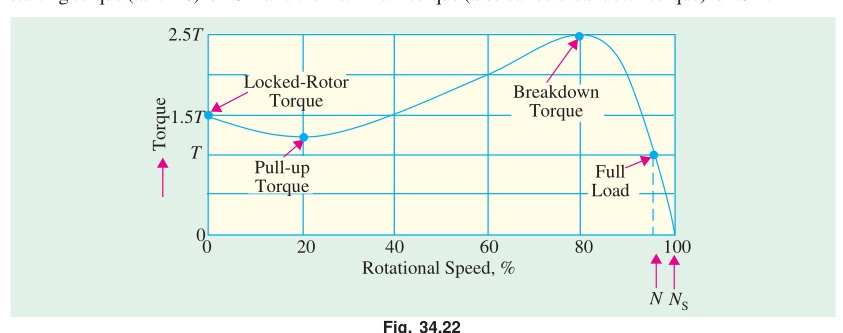

| Region | Speed | Slip | Machine action |
|:---|:---|:---|:---|
| Braking (plugging) | $-N_s < N < 0$ | $1 < s < 2$ | Brake |
| Motoring | $0 < N < N_s$ | $0 < s < 1$ | Motor |
| Generating | $N > N_s$ | $s < 0$ | Induction generator |

Key points on the motoring part: starting torque at $s = 1$, breakdown (maximum) torque at $s = s_{maxT} = R_2/X_2$, then a steep, nearly straight stable run from $T_{max}$ down to zero torque at $N_s$.

---

### **(b) Define slip. Prove that an induction motor can not run at synchronous speed. [CO3, Marks: 03]**

**Slip.** Slip is the difference between synchronous speed and actual rotor speed, expressed as a fraction of synchronous speed:
$$s = \frac{N_s - N}{N_s}, \qquad \%s = \frac{N_s - N}{N_s} \times 100, \qquad N_s = \frac{120 f}{P}$$

The difference $(N_s - N)$ is the slip speed. It is the speed at which the rotating field slips past the rotor.

**Proof that $N = N_s$ is impossible.** Assume the rotor somehow reaches synchronous speed, so $N = N_s$ and $s = 0$. Then follow the chain:

1. Relative speed between the rotating field and the rotor is $N_s - N = 0$.
2. No flux cuts the rotor conductors, so the rotor emf vanishes:
$$E_{2r} = s E_2 = 0$$
3. With zero emf, the rotor current is zero:
$$I_{2r} = \frac{s E_2}{\sqrt{R_2^2 + (s X_2)^2}} = 0$$
4. Torque needs rotor current:
$$T = k \Phi I_{2r} \cos\phi_2 = 0$$

So at synchronous speed the motor develops **no torque at all**. But friction and windage always demand some torque. With zero torque the rotor must slow down. As soon as it slows, $s > 0$, emf and current reappear, and torque is produced again.

$$\boxed{N < N_s \text{ always, so } s > 0. \text{ An induction motor is an asynchronous machine.}}$$

> [!success] One-line answer
> Zero slip means zero relative motion, zero induced emf, zero rotor current and therefore zero torque. The rotor cannot sustain synchronous speed.

---

### **(c) Prove that, the magnitude of resultant flux is constant and equal to $\frac{3}{2}\Phi_m$, due to any phase in an induction motor of $3-\varphi$ stator supply system with necessary figures. [CO2, Marks: 04]**

**Setup.** Three identical stator windings are spaced $120°$ apart in space. They carry currents $120°$ apart in time, so each produces a pulsating flux along its own axis:
$$\Phi_1 = \Phi_m \sin \omega t, \qquad \Phi_2 = \Phi_m \sin(\omega t - 120°), \qquad \Phi_3 = \Phi_m \sin(\omega t - 240°)$$

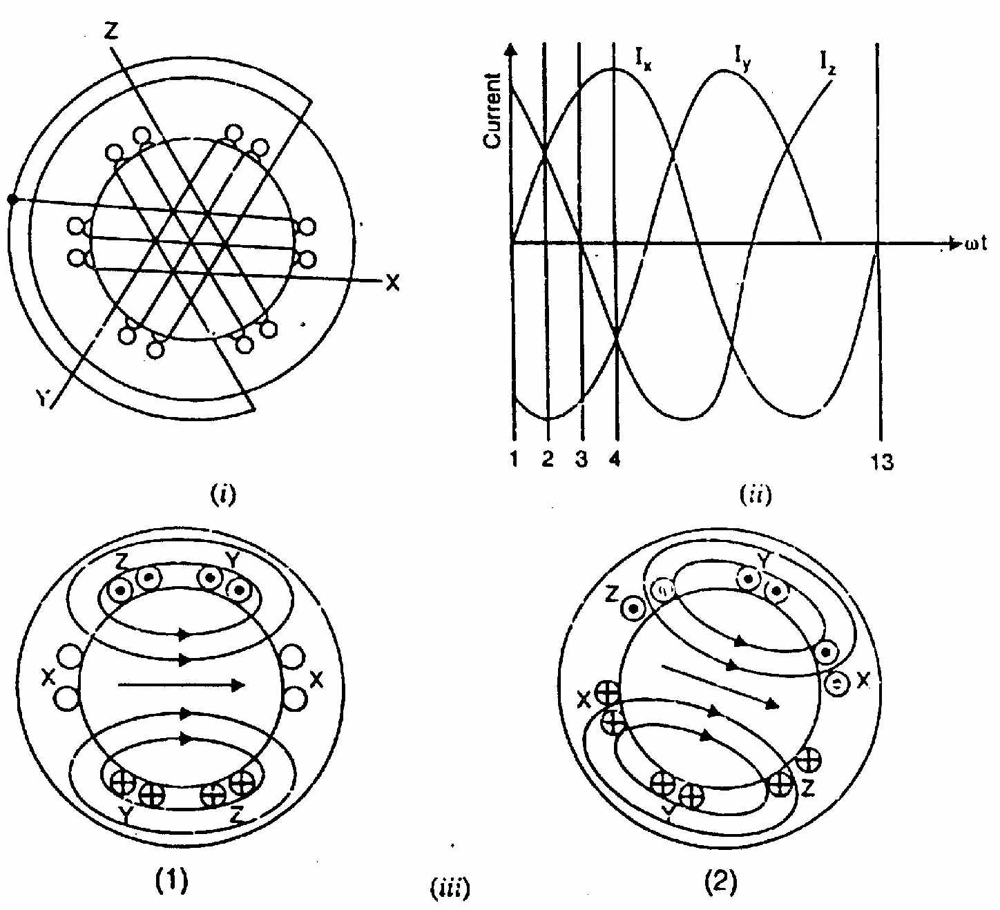

**Phasor method, instant by instant.** Add the three flux phasors along their own space axes at four instants.

**(i) At $\omega t = 0°$:**
$$\Phi_1 = 0, \quad \Phi_2 = \Phi_m \sin(-120°) = -0.866\Phi_m, \quad \Phi_3 = \Phi_m \sin(-240°) = +0.866\Phi_m$$

The two non-zero fluxes are $60°$ apart in space. Their resultant bisects that angle:
$$\Phi_r = 2 \times 0.866 \Phi_m \cos\frac{60°}{2} = 2 \times 0.866 \times 0.866\, \Phi_m = \frac{3}{2}\Phi_m$$

**(ii) At $\omega t = 60°$:**
$$\Phi_1 = +0.866\Phi_m, \quad \Phi_2 = -0.866\Phi_m, \quad \Phi_3 = 0$$
$$\Phi_r = 2 \times 0.866 \Phi_m \cos 30° = \frac{3}{2}\Phi_m$$

The magnitude is unchanged, but the resultant has turned through $60°$.

**(iii) At $\omega t = 120°$ and (iv) $\omega t = 180°$:** the same arithmetic repeats, each time giving $\Phi_r = \frac{3}{2}\Phi_m$ turned a further $60°$.

**Analytical proof.** Resolve all three along a reference axis and its quadrature:
$$\Phi_x = \Phi_1 + \Phi_2 \cos 120° + \Phi_3 \cos 240° = \frac{3}{2}\Phi_m \sin\omega t$$
$$\Phi_y = \Phi_2 \sin 120° + \Phi_3 \sin 240° = \frac{3}{2}\Phi_m \cos\omega t$$
$$\therefore\ \Phi_r = \sqrt{\Phi_x^2 + \Phi_y^2} = \frac{3}{2}\Phi_m \sqrt{\sin^2\omega t + \cos^2\omega t}$$

$$\boxed{\Phi_r = \frac{3}{2}\Phi_m = 1.5\,\Phi_m \ \text{(constant), rotating at } N_s = \frac{120f}{P}}$$

The direction angle is $\tan^{-1}(\Phi_y/\Phi_x) = (90° - \omega t)$, which decreases steadily with time. So the resultant is a constant-magnitude flux rotating at a uniform angular speed $\omega$. One full electrical cycle turns it through one pole pair.

---

## Question 6

### **(a) Define synchronous watt. Derive an expression of rotor efficiency of a $3-\varphi$ induction motor. [CO2, Marks: 04]**

**Synchronous watt.** One synchronous watt is that torque which, acting at synchronous speed, would develop a power of one watt. Torque expressed in synchronous watts is numerically equal to the rotor input power:
$$T_g \ (\text{in synchronous watts}) = P_2 \ (\text{in watts})$$
$$T_g \ (\text{N-m}) = \frac{\text{torque in synchronous watts}}{2\pi N_s / 60} = \frac{P_2}{\omega_s}$$

It is a handy unit because torque and rotor input are then the same number.

**Rotor efficiency.**

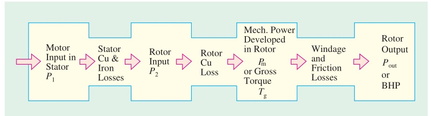

Let $P_2$ be the rotor input (power crossing the air gap), $P_{cu2}$ the rotor copper loss and $P_m$ the gross mechanical power developed.

**Step 1. Rotor copper loss in terms of slip.** The rotor emf per phase when running is $sE_2$, and the rotor current is $I_{2r}$:
$$P_{cu2} = 3 I_{2r}^2 R_2 = 3 (s E_2) I_{2r} \cos\phi_2$$

The rotor input is the product of the standstill emf and the in-phase current:
$$P_2 = 3 E_2 I_{2r} \cos\phi_2$$

Dividing:
$$\boxed{P_{cu2} = s P_2}$$

**Step 2. Mechanical power developed.** By energy balance,
$$P_m = P_2 - P_{cu2} = P_2 - s P_2 = (1 - s) P_2$$

**Step 3. Power ratio.**
$$P_2 : P_m : P_{cu2} = 1 : (1 - s) : s$$

**Step 4. Rotor efficiency.**
$$\eta_{\text{rotor}} = \frac{P_m}{P_2} = \frac{(1-s)P_2}{P_2} = 1 - s$$

Since $s = (N_s - N)/N_s$, we also have $1 - s = N/N_s$:

$$\boxed{\eta_{\text{rotor}} = 1 - s = \frac{N}{N_s}}$$

> [!example] Quick use
> At 4% slip the rotor efficiency is 96%. The remaining 4% of the air-gap power is lost as rotor copper loss. This is why an induction motor cannot be run at large slip for long.

---

### **(b) Draw the equivalent circuit of an induction motor as a generalized transformer. [CO1, Marks: 03]**

An induction motor is a transformer whose secondary is free to rotate and is short-circuited on itself.

| Transformer | Induction motor |
|:---|:---|
| Primary winding | Stator winding |
| Secondary winding | Rotor winding |
| Secondary load impedance | Mechanical load on the shaft |
| Secondary open ($I_2 = 0$) | Rotor at synchronous speed ($s = 0$) |
| Secondary shorted | Rotor at standstill ($s = 1$) |

**The one difference.** In a transformer both windings see the same frequency. In an induction motor the rotor sees slip frequency $f_2 = s f$. So the rotor quantities become
$$E_{2r} = s E_2, \qquad X_{2r} = s X_2, \qquad R_2 \text{ unchanged}$$
$$I_{2r} = \frac{s E_2}{\sqrt{R_2^2 + (s X_2)^2}}$$

**Removing the frequency difference.** Divide numerator and denominator by $s$:
$$I_{2r} = \frac{E_2}{\sqrt{(R_2/s)^2 + X_2^2}}$$

The current is unchanged, but now every quantity is at supply frequency. The rotating machine has become an ordinary static transformer with its secondary resistance changed from $R_2$ to $R_2/s$.

Splitting the rotor resistance shows where the power goes:
$$\frac{R_2}{s} = \underbrace{R_2}_{\text{rotor copper loss}} + \underbrace{R_2\left(\frac{1-s}{s}\right)}_{\text{gross mechanical power}}$$

---

### **(c) Determine the average torque of an induction motor if the rotor is assumed to be fully inductive. [CO3, Marks: 03]**

**Torque relation.** For an induction motor,
$$T \propto \Phi\, I_2 \cos\phi_2 \qquad \text{or} \qquad T = k\, \Phi\, I_2 \cos\phi_2$$

where $\phi_2$ is the angle between the rotor emf and the rotor current, and
$$\phi_2 = \tan^{-1}\frac{X_2}{R_2}$$

**Fully inductive rotor means $R_2 = 0$, so $\phi_2 = 90°$.**

**Point-by-point proof.** Let the stator flux density wave be sinusoidal in space:
$$B(\theta) = B_m \sin\theta$$

The rotor emf follows the flux density, and with a purely inductive rotor the current lags that emf by $90°$:
$$i(\theta) = I_m \sin(\theta - 90°) = -I_m \cos\theta$$

The force on a conductor is $F \propto B\, i\, l$, so the torque contribution at angle $\theta$ is
$$t(\theta) \propto B_m I_m \sin\theta \cdot (-\cos\theta) = -\frac{B_m I_m}{2} \sin 2\theta$$

Average over one pole pitch ($0$ to $\pi$):
$$T_{av} \propto -\frac{B_m I_m}{2} \cdot \frac{1}{\pi}\int_0^{\pi} \sin 2\theta \; d\theta = -\frac{B_m I_m}{2\pi}\left[\frac{-\cos 2\theta}{2}\right]_0^{\pi} = 0$$

**Same result from the torque formula:**
$$T = k \Phi I_2 \cos 90° = 0$$

$$\boxed{T_{av} = 0 \ \text{when the rotor is fully inductive } (\phi_2 = 90°)}$$

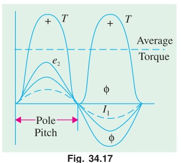

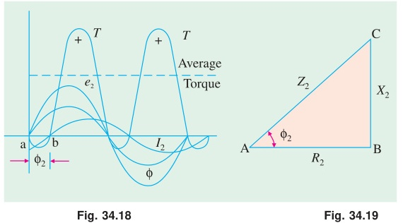

**Physical reading of the figures.**

| Case | $\phi_2$ | Torque over a pole pitch | Average torque |
|:---|:---:|:---|:---|
| Non-inductive | $0°$ | Always positive | Maximum |
| Partly inductive | $0 < \phi_2 < 90°$ | Mostly positive, small reversed band $ab$ | Reduced |
| Fully inductive | $90°$ | Forward half exactly cancels reverse half | **Zero** |

So an induction motor must have resistance in the rotor circuit. A rotor with zero resistance would produce no net torque at all.

> [!success] Exam takeaway
> The rotor power factor, not just the rotor current, decides torque. This is why $\cos\phi_2$ appears in $T = k\Phi I_2 \cos\phi_2$ while a d.c. motor needs only $T \propto \Phi I_a$.

---

## Question 7

### **(a) Explain the $\text{Y}-\Delta$ starter to start $3-\varphi$ induction motor with the help of neat sketch. [CO3, Marks: 03]**

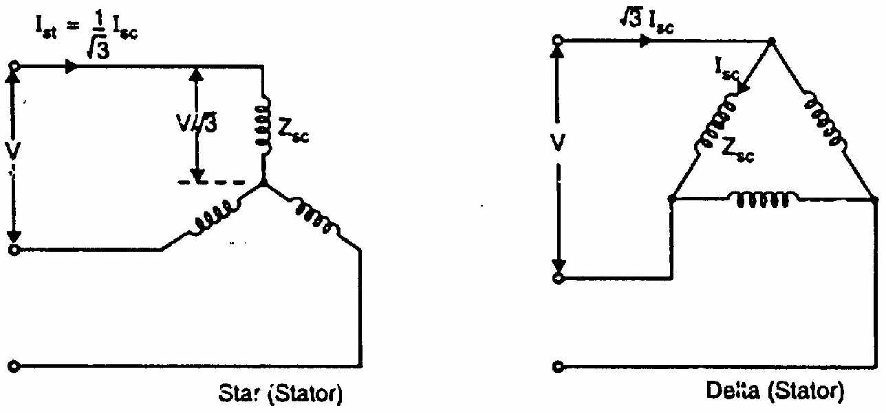

**Where it is used.** Only on motors built to run with a **delta-connected stator**, and whose six winding ends are brought out to the terminal box.

**Operation.** A two-way changeover switch (or two contactors with a timer) does the work.

1. **START position.** The switch connects the three winding ends to a common point, so the stator is in **star**. Each phase then gets
$$V_{ph} = \frac{V_L}{\sqrt{3}} = 0.577\, V_L$$
2. **RUN position.** After the motor reaches about 80% of full speed, the switch is thrown over. The windings are reconnected in **delta**, so each phase now gets the full line voltage $V_L$.

**Effect on current and torque.**

Let $I_{sc}$ be the per-phase short-circuit current the delta-connected motor would draw on direct switching.

$$I_{st}\ \text{per phase} = \frac{1}{\sqrt{3}}\, I_{sc}\ \text{per phase}$$

In star, line current equals phase current, so
$$\frac{\text{line } I_{st}}{\text{line } I_{sc}} = \frac{1}{3}$$

Since $T \propto V_{ph}^2$,
$$\frac{T_{st,Y}}{T_{st,\Delta}} = \left(\frac{1}{\sqrt{3}}\right)^2 = \frac{1}{3}$$

$$\boxed{\text{Starting current} = \tfrac{1}{3}\ \text{of DOL} \qquad \text{Starting torque} = \tfrac{1}{3}\ \text{of DOL}}$$

**Torque to full-load torque:**
$$\frac{T_{st}}{T_f} = \frac{1}{3}\left(\frac{I_{sc}}{I_f}\right)^2 s_f$$

**Merits and limits.** Cheap, simple and effective. It is equivalent to an auto-transformer starter with a 58% tap. But the starting torque is only one third of DOL, so it suits light-starting loads only, such as machine tools, pumps and motor-generator sets. There is also a current surge at changeover.

---

### **(b) A 15 Hp, $3-\varphi$, 6-pole, 50 Hz, 400 V, $\Delta-$connected induction motor runs at 960 rpm on full load. If it takes 84.6 A on direct starting, find the ratio of starting torque to full load torque with a star-delta starter. Full load efficiency and power factor are 88% and 0.85, respectively. [CO3, Marks: 04]**

**Given:** $P_{out} = 15\text{ Hp}$, $P = 6$, $f = 50\text{ Hz}$, $V_L = 400\text{ V}$, $\Delta$-connected, $N = 960\text{ rpm}$, $I_{sc} = 84.6\text{ A}$ (line, on direct start), $\eta = 0.88$, $\cos\phi = 0.85$.

**Step 1. Synchronous speed and full-load slip.**
$$N_s = \frac{120 f}{P} = \frac{120 \times 50}{6} = 1000\text{ rpm}$$
$$s_f = \frac{N_s - N}{N_s} = \frac{1000 - 960}{1000} = 0.04$$

**Step 2. Full-load line current.**
$$P_{out} = 15 \times 746 = 11190\text{ W}$$
$$\text{Input} = \frac{11190}{0.88} = 12716\text{ W}$$
$$\sqrt{3}\, V_L I_f \cos\phi = 12716$$
$$I_f = \frac{12716}{\sqrt{3} \times 400 \times 0.85} = \frac{12716}{588.9} = 21.59\text{ A (line)}$$

**Step 3. Starting current with the star-delta starter.**

On direct (delta) start the line current would be 84.6 A. In star the line starting current is one third of that:
$$I_{st} = \frac{84.6}{3} = 28.2\text{ A (line)}$$

**Step 4. Torque ratio.** For a star-delta starter,
$$\frac{T_{st}}{T_f} = \frac{1}{3}\left(\frac{I_{sc}}{I_f}\right)^2 s_f$$
$$\frac{I_{sc}}{I_f} = \frac{84.6}{21.59} = 3.918$$
$$\frac{T_{st}}{T_f} = \frac{1}{3} \times (3.918)^2 \times 0.04 = \frac{1}{3} \times 15.35 \times 0.04 = 0.2047$$

$$\boxed{\frac{T_{st}}{T_f} = 0.205 \quad \text{i.e. } 20.5\% \text{ of full-load torque}}$$

> [!info] Cross-check with per-phase values
> $I_{sc}$ per phase $= 84.6/\sqrt{3} = 48.84\text{ A}$, so $I_{st}$ per phase $= 48.84/\sqrt{3} = 28.2\text{ A}$.
> Full-load phase current $= 21.59/\sqrt{3} = 12.47\text{ A}$.
> $T_{st}/T_f = (28.2/12.47)^2 \times 0.04 = 5.117 \times 0.04 = 0.205$. Same answer.

The starting torque is only about one fifth of full-load torque. This motor can only be star-delta started against a very light load.

---

### **(c) Explain the double field revolving theory for the operation of $1-\varphi$ induction motor. [CO1, Marks: 03]**

**Statement.** Any alternating (pulsating) flux can be resolved into two rotating fluxes of equal magnitude, each half the peak of the pulsating flux, revolving in opposite directions at synchronous speed.

**Mathematical form.** The single stator winding produces
$$\Phi = \Phi_m \cos\omega t$$

Write it as the sum of two counter-rotating vectors of magnitude $\Phi_m/2$:
$$\Phi = \underbrace{\frac{\Phi_m}{2}\angle{+\omega t}}_{\text{forward field } \Phi_f} + \underbrace{\frac{\Phi_m}{2}\angle{-\omega t}}_{\text{backward field } \Phi_b}$$

Their components across the winding axis always cancel. Their components along the axis always add to $\Phi_m \cos\omega t$. So the two rotating fields are an exact equivalent of the one pulsating field.

**Torque production.**

Let the rotor turn at speed $N$. The two fields see different slips:
$$s_f = \frac{N_s - N}{N_s} = s \qquad \text{(forward field)}$$
$$s_b = \frac{N_s - (-N)}{N_s} = 2 - s \qquad \text{(backward field)}$$

Each field produces its own torque. The forward torque $T_f$ is positive, the backward torque $T_b$ is negative, and the net torque is
$$T = T_f - T_b$$

**At standstill ($N = 0$, $s = 1$):** both fields see the same slip of 1. So $T_f = T_b$ and
$$T_{st} = 0$$

$$\boxed{\text{A 1-}\varphi \text{ induction motor has zero starting torque and is not self-starting.}}$$

**Once it is turning:** suppose the rotor is pushed forward. Then $s < 1$ for the forward field and $2 - s > 1$ for the backward field. The forward torque grows and the backward torque shrinks. The net torque is positive and the motor runs up to near $N_s$. It keeps running in whichever direction it was started.

So a single-phase induction motor will run on its own but will not start on its own.

---

## Question 8

### **(a) Briefly explain crawling and cogging of an induction motor. Also, mention one method of speed control of an induction motor. [CO3, Marks: 03]**

#### Crawling

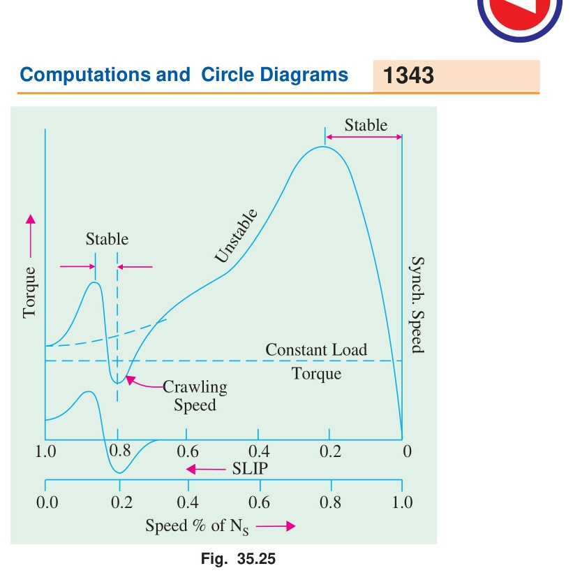

A squirrel-cage motor sometimes settles down and runs stably at about **one seventh of synchronous speed** instead of accelerating to normal speed. This is called crawling.

**Cause.** The stator m.m.f. wave is not a pure sine wave. It carries odd space harmonics. The $n$th harmonic sets up its own field rotating at $N_s/n$, and so develops its own harmonic torque of magnitude about $1/n^2$ of the fundamental.

- Third harmonic: absent in a balanced 3-phase system, so no torque.
- Fifth harmonic: rotates backward at $N_s/5$, acting as a braking torque.
- Seventh harmonic: rotates **forward** at $N_s/7$ and is the troublemaker.

The 7th harmonic torque falls to zero at $N = N_s/7$. The resultant torque curve therefore has a deep dip just below $N_s/7$. If the load torque line cuts the motor curve inside that dip, the motor locks on there and crawls.

**Remedy.** Skew the rotor slots to suppress tooth-ripple harmonics.

#### Cogging (magnetic locking)

The rotor refuses to start at all, especially at reduced voltage. It happens when the number of rotor slots $S_2$ equals the number of stator slots $S_1$, or is an integral multiple of it.

**Cause.** With $S_1 = S_2$ the air-gap reluctance is lowest when the rotor teeth face the stator teeth squarely. The rotor locks into that minimum-reluctance position. If the starting torque is less than this alignment torque, the motor cannot break free.

**Remedies.**
1. Make the number of rotor slots prime to the number of stator slots.
2. **Skew the rotor slots**, so no two teeth can align over the full length.

#### One method of speed control

From $N = N_s(1-s) = \dfrac{120f}{P}(1-s)$, three handles exist: $f$, $P$ and $s$.

**Rotor rheostat control (slip control, for slip-ring motors).** Add external resistance through the slip rings. Extra rotor resistance increases the slip needed to carry the same torque, so the motor slows down:
$$T \propto \frac{s E_2^2 R_2}{R_2^2 + (s X_2)^2}$$

Maximum torque is unchanged, because $T_{max} = k E_2^2/(2X_2)$ does not contain $R_2$. Only the slip at which it occurs moves, since $s_{maxT} = R_2/X_2$.

Speed control is simple and smooth and gives a high starting torque. But the extra $I_2^2R$ loss is wasted as heat, so efficiency falls as speed falls. Modern practice prefers **V/f (variable frequency) control**, which holds $V/f$ constant so the flux stays constant while frequency sets the speed.

---

### **(b) With the help of schematic arrangements, describe how IM can be operated as IG? [CO3, Marks: 03]**

**Principle.** Drive the rotor **above** synchronous speed with a prime mover. Then $N > N_s$, so
$$s = \frac{N_s - N}{N_s} < 0$$

With negative slip the rotor emf, rotor current and torque all reverse. The machine now opposes the prime mover, absorbs mechanical power at the shaft and feeds electrical power out through the stator. It has become an **induction generator**.

#### Arrangement 1: Grid-connected induction generator

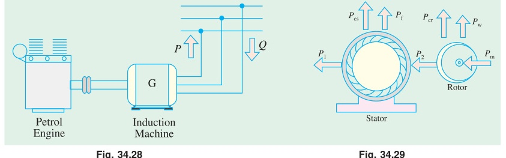

The stator stays connected to a live 3-phase line. The line fixes the voltage and the frequency, and supplies the magnetising (reactive) power.

- **Active power $P$** flows out of the stator into the line.
- **Reactive power $Q$** flows from the line into the machine, because the generator needs it to set up its own field.

So the machine delivers $P$ and absorbs $Q$ at the same time, and the two flow in opposite directions.

#### Arrangement 2: Self-excited induction generator

For an isolated load there is no line to draw $Q$ from. Connect a **capacitor bank** across the stator terminals instead. The capacitors supply the reactive power:
$$Q_C = \text{capacitor output} \ \geq \ Q \ \text{required by machine and load}$$

Residual magnetism in the rotor starts the build-up. Voltage grows until the capacitor line crosses the machine magnetising curve.

**Characteristics.**

| Feature | Grid-connected | Self-excited |
|:---|:---|:---|
| Source of $Q$ | The line | Capacitor bank |
| Voltage and frequency set by | The line | Speed and capacitance |
| Voltage regulation | Good | Poor |

**Merits.** No d.c. field winding, no brushes, no synchronising needed, rugged and cheap, and it cannot be overloaded because torque falls off beyond the breakdown point.

**Limits.** Cannot supply reactive power. Cannot work alone without capacitors. Voltage and frequency are not independently controllable. Used for small hydro and wind plants.

---

### **(c) How is a single phase induction motor is made self-starting? Describe two methods of making a single phase induction motor self-starting. [CO3, Marks: 04]**

**The core idea.** A single winding gives a pulsating field, which splits into two equal and opposite rotating fields, so the starting torque is zero. To get a starting torque, the field at standstill must be made to **rotate**, not pulsate.

That needs two conditions together:
1. **Two windings displaced in space**, ideally by $90°$ electrical.
2. **Their currents displaced in time**, ideally by $90°$.

A main winding plus an auxiliary (starting) winding, fed through a phase-splitting element, produces an unbalanced two-phase supply. That gives a rotating field and a real starting torque. The auxiliary winding is then cut out by a **centrifugal switch** at about 75% of full speed.

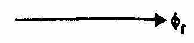

#### Method 1: Split-phase (resistance-start) motor

**Construction.** The starting winding is wound with fewer turns of thin wire, so it has **high resistance and low reactance**. The main winding has many turns of thick wire, so it has **low resistance and high reactance**. Both are across the same supply, and a centrifugal switch is in series with the starting winding.

**Working.**
- $I_s$ in the high-resistance starting winding is nearly in phase with $V$.
- $I_m$ in the highly inductive main winding lags $V$ by a large angle.
- The phase split is about $25°$ to $30°$, which is enough to produce a rotating field.

$$\alpha \approx 25°\text{--}30°, \qquad T_{st} \approx 1.5\text{ to } 2 \times T_{FL}$$

At about 75% of full speed the centrifugal switch opens and the motor carries on with the main winding alone.

**Uses.** Fans, blowers, small grinders, office machinery. Cheap, but low starting torque.

#### Method 2: Capacitor-start motor

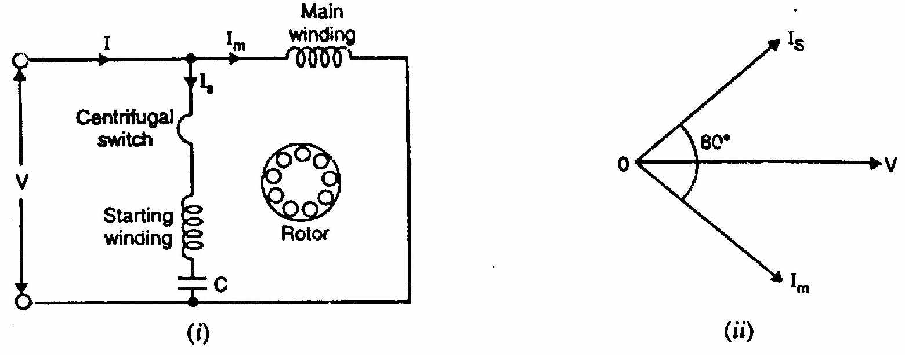

**Construction.** A **capacitor** is put in series with the starting winding, along with the centrifugal switch. An electrolytic capacitor is used because it is needed only for a few seconds.

**Working.** The capacitive branch makes $I_s$ **lead** the supply voltage, while $I_m$ still lags it. So the phase split is far larger:
$$\alpha \approx 80°\text{--}90°$$

With the split close to the ideal $90°$, the field at standstill is almost a true two-phase rotating field:
$$T_{st} \approx 3\text{ to } 4.5 \times T_{FL}$$

**Uses.** Compressors, pumps, refrigerators, air conditioners, conveyors. Anywhere a high starting torque is needed.

#### Comparison

| Feature | Split-phase | Capacitor-start |
|:---|:---|:---|
| Phase-splitting element | High-resistance winding | Series capacitor |
| Phase split $\alpha$ | $25°$–$30°$ | $80°$–$90°$ |
| Starting torque | $1.5$–$2\, T_{FL}$ | $3$–$4.5\, T_{FL}$ |
| Starting current | High | Moderate |
| Cost | Low | Higher |
| Typical use | Fans, blowers | Compressors, pumps |

> [!success] Other methods worth naming
> Capacitor-start capacitor-run (two capacitors, better running power factor), permanent-split capacitor, and shaded-pole (a copper shading ring gives a weak sweeping field, used in tiny fans).

---

[← 2021 Answer](2021_answer.md) | [🏠 Index](README.md) | [2024 Answer →](2024_answer.md)
