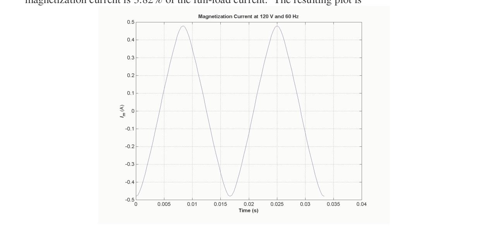
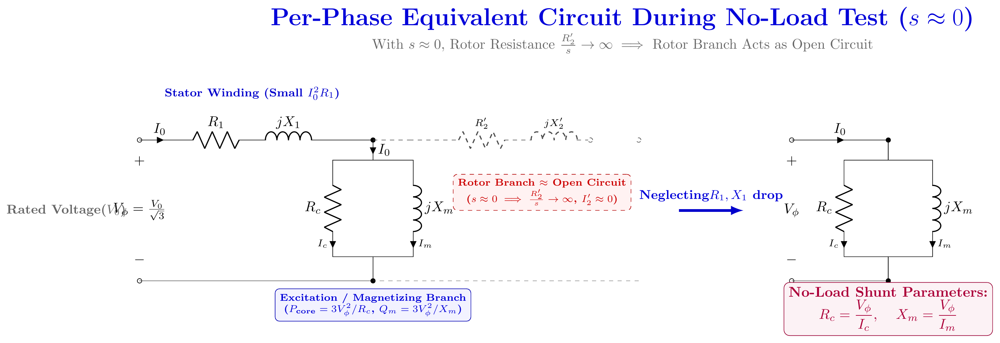

[← 2023 Answer](2023_answer.md) | [🏠 Index](README.md) | *(end)*

---

# ECE 2207: 2024 Semester Final: Exam Style Answers
**RUET · ECE Dept · 2nd Year Even Semester Examination, 2024**
**Course No:** ECE 2207 | **Course Title:** Electrical Machines I | **Full Marks:** 60 | **Time:** 3 Hours
**Answer SIX questions taking any THREE from each section. Each question carries 10 marks.**

> [!info] Format
> Section A (Q1–Q4) is transformers. Section B (Q5–Q8) is induction motors. Each question is 10 marks split into three sub-parts, and every sub-part carries its own Course Outcome tag. The marks and CO shown in each heading below are taken from the question paper margin.
>
> Question source: [PrevYearQuestions/2024.md](../PrevYearQuestions/2024.md) · This is the **last paper** in the 2017–2024 sequence (2022 is not available).
>
> Working is transcribed from the verified key in [`scratch/2024_solution_key.md`](../scratch/2024_solution_key.md). Two traps are flagged in place: **Q2(c)** must scale the S.C. wattmeter reading to full load, and **Q3(c)(iv)** must subtract the primary copper loss before quoting the iron loss.

---

# SECTION - A

## Question 1

### **(a) Enlist some practical applications of transformer. [CO1, Marks: 02]**

A transformer is a static, no-loss-rotating device that transfers electrical energy from one circuit to another at the **same frequency**, by electromagnetic induction. Its practical uses follow directly from its two special powers — voltage change and current change.


| Application | Why it is used |
|:---|:---|
| **Step-up in generating stations** | $11\text{ kV} \to 220/400\text{ kV}$ for transmission; cuts line current and hence $I^2R$ loss, so a thinner, cheaper conductor is needed |
| **Step-down in substations** | $400\text{ kV} \to 33\text{ kV} \to 11\text{ kV} \to 440/230\text{ V}$, in graded stages down to the consumer |
| **Voltage transformation for machinery** | $400\text{ V} \to 230\text{ V}$ or $415\text{ V}$, and $11\text{ kV} \to 415\text{ V}$ for large motors, so each machine gets its rated voltage |
| **Instrument transformers** | CTs scale down current for ammeters and relays; PTs scale down voltage for voltmeters and protective relays — and give electrical isolation |
| **Impedance / voltage matching** | Matching the source impedance to the load in audio, electronic and telephone circuits so that maximum power is delivered |
| **Isolation and safety** | An isolation transformer breaks the galvanic connection between a mains circuit and a hand-held tool or a bench supply |
| **Frequent starting** | Motor supply transformers raise the starting voltage for frequent on-load starts without disturbing the rest of the system |
| **Furnace and welding transformers** | Very large current at a few volts, obtained by stepping the voltage right down (arc furnaces are fed through a Scott-T bank) |
| **Rectifier transformers** | Step the a.c. supply to the voltage the rectifier needs, and provide the mid-point/tap voltages for a full-wave bridge |
| **Frequency conversion** | A frequency changer (rotary or a static cycloconverter) turns a.c. of one frequency into a.c. of another, e.g. for induction heating |
| **Frequency and voltage stabilisers** | A saturable-core or electronic voltage regulator keeps the output steady against supply fluctuation |
| **D.C. generator excitation** | A small auxiliary transformer feeds the field winding of a d.c. generator or alternator from the station bus |

> [!success] One-line summary
> Every use is either **energy transmission** (step up / step down), **measurement and protection** (CT, PT), **impedance matching**, or **isolation / regulation**.

---

### **(b) When a power transformer is excited as a manner shown in following figure, then describe the induced voltage phenomena — [CO2, Marks: 04]**


**Step 1. The circuit.** Two coils sit on the two limbs of one closed iron core. Coil 1 carries $N_1$ turns and is connected to a source $v$ through a single-pole switch; coil 2 carries $N_2$ turns and is closed through a resistive load $R$. The two coils are joined only by the common **mutual flux** $\Phi_{mutual}$ in the core — there is no electrical connection between them.

> [!warning] Note the source first
> In the figure the source is a **d.c. battery with a switch**. So this is a *switching-on transient*, not steady-state a.c. That is why Faraday's and Lenz's laws must be used in their raw differential form $e = -N\,d\Phi/dt$, not the rms phasor equation $E = 4.44\,f\,N\,\Phi_m$.

**Step 2. Before the switch is closed.** No current, no flux, no emf:
$$i_1 = 0, \qquad \Phi = 0, \qquad e_1 = 0, \qquad e_2 = 0$$

**Step 3. Closing the switch — flux is established.** The applied voltage drives a current $i_1(t)$ into coil 1. Its m.m.f. $N_1 i_1$ magnetises the core, so the mutual flux $\Phi(t)$ grows along the dashed closed path and links **both** windings:
$$v = i_1 R_1 + N_1\frac{d\Phi}{dt}$$

The flux cannot jump instantly to its final value — it rises with the time constant $L_1/R_1$.

**Step 4. Self-induction in coil 1 (opposes the rise).**

$$e_1 = -N_1\frac{d\Phi}{dt}$$

The minus sign is Lenz's law: $e_1$ is a *counter*-emf that opposes the very change producing it, so it points against the applied voltage (arrow $\uparrow e_1$ in the figure). It absorbs most of $v$, which is why $i_1$ does **not** jump to its steady value the instant the switch is closed. This is self-inductance.

**Step 5. Mutual induction in coil 2 — the induced voltage in the secondary.** The *same* changing mutual flux cuts the $N_2$ turns of coil 2:

$$e_2 = -N_2\frac{d\Phi}{dt}$$

and therefore

$$\boxed{\frac{e_2}{e_1} = \frac{N_2}{N_1}}$$

The two induced voltages are **in phase** with each other (they are produced by the same $d\Phi/dt$), and both *lag* the flux by $90°$. Note $e_2 \ne 0$ even though coil 2 is a closed loop with no source of its own — the voltage is created purely by the changing flux.

**Step 6. Secondary current and the load.** $e_2$ drives a current $i_2$ through the load $R$ in the direction shown (out of the upper terminal, $\rightarrow i_2$):

$$i_2 = \frac{e_2}{R}$$

This is exactly how an ordinary transformer works — except that here the "source" is a d.c. battery switching event rather than an a.c. supply.

**Step 7. Secondary reaction flux.** $i_2$ flowing in $N_2$ turns sets up its own flux $\Phi_2$, whose direction by Lenz's law **opposes the rate of change of the core flux**. It tends to hold back the build-up of $\Phi$. The primary immediately compensates by drawing a slightly larger $i_1$ until the m.m.f. balance is restored:

$$N_1 i_1 = N_2 i_2 \quad\Longrightarrow\quad i_2' = \frac{N_2}{N_1} i_2$$

**Step 8. Steady state on d.c.** If the battery is left connected, $\Phi$ becomes constant, so $d\Phi/dt = 0$ and $e_1 = e_2 = 0$; only the small d.c. current $i_1 = v/R_1$ remains. So with the d.c. source shown, the induced voltages exist **only while the flux is changing** — during the switching transient.

| Step | Event | Consequence |
|:---|:---|:---|
| 1 | Switch open | $i_1=0,\ \Phi=0,\ e_1=e_2=0$ |
| 2 | Switch closed | $i_1$ rises, $\Phi(t)$ builds along the core |
| 3 | In coil 1 | $e_1 = -N_1 d\Phi/dt$ — self-induction, opposes the rise |
| 4 | In coil 2 | $e_2 = -N_2 d\Phi/dt$ — mutual induction, $e_2/e_1 = N_2/N_1$ |
| 5 | Load $R$ | $i_2 = e_2/R$ flows out of the upper terminal |
| 6 | Reaction | $\Phi_2$ opposes $d\Phi/dt$; $i_1$ rises to balance $N_1 i_1 = N_2 i_2$ |
| 7 | Flux steady | $d\Phi/dt = 0 \Rightarrow e_1 = e_2 = 0$ |

> [!success] The two phenomena named in the question
> **Self-induction** in coil 1 ($e_1 = -N_1 d\Phi/dt$, *self*-flux) and **mutual induction** in coil 2 ($e_2 = -N_2 d\Phi/dt$, *common mutual* flux linking both windings), with $e_2/e_1 = N_2/N_1$ and $i_2$ being opposed by the secondary reaction flux.

---

### **(c) A 2,200/200 — V transformer draws a no-load primary current of 0.6A and absorbs 400W. Find the magnetizing and iron loss currents. Now, consider a 2,200/250 — V transformer takes 0.5A at a p.f. of 0.3 on open circuit. Find magnetizing and working components of no-load primary current. [CO2, Marks: 04]**


**No-load current decomposition.** On open circuit the secondary current is zero, so the primary draws only the magnetising current:

$$\vec{I}_0 = \vec{I}_w + \vec{I}_m$$

- $I_w$ — **working / iron-loss (core-loss) component**, in phase with $V_1$. It supplies the hysteresis and eddy-current loss.
- $I_m$ — **magnetising component**, in quadrature with $V_1$ (lags $V_1$ by $90°$). It establishes the flux.

#### (i) 2,200/200 V, $I_0 = 0.6$ A, $W_0 = 400$ W

**Step 1. No-load power factor.**
$$\cos\phi_0 = \frac{W_0}{V_1 I_0} = \frac{400}{2200 \times 0.6} = \frac{400}{1320} = 0.30303$$

**Step 2. Working (iron-loss) component.**
$$I_w = I_0\cos\phi_0 = 0.6 \times 0.30303 = 0.1818\text{ A}$$

**Step 3. Magnetising component.**
$$I_m = \sqrt{I_0^2 - I_w^2} = \sqrt{0.6^2 - 0.1818^2} = \sqrt{0.36 - 0.03305} = \sqrt{0.32694} = 0.5718\text{ A}$$

$$\boxed{I_m = 0.572\text{ A (magnetising)}, \qquad I_w = 0.182\text{ A (iron loss)}}$$

#### (ii) 2,200/250 V, $I_0 = 0.5$ A at $0.3$ p.f.

**Step 1. Working component.**
$$I_w = I_0\cos\phi_0 = 0.5 \times 0.3 = 0.15\text{ A}$$

**Step 2. Magnetising component.**
$$I_m = \sqrt{I_0^2 - I_w^2} = \sqrt{0.5^2 - 0.15^2} = \sqrt{0.25 - 0.0225} = \sqrt{0.2275} = 0.4770\text{ A}$$

$$\boxed{I_m = 0.477\text{ A (magnetising)}, \qquad I_w = 0.15\text{ A (working / iron loss)}}$$

> [!info] Reading the answers
> Both parts ask for the *same* pair; only the order differs. The magnetising component is by far the larger one (about 95 % of $I_0$), which is why a transformer on no load has such a poor power factor. In part (i) the 400 W absorbed is itself the iron loss, and in part (ii) $I_w \times 2200 = 0.15 \times 2200 = 330$ W would be the iron loss on that transformer.

---

## Question 2

### **(a) "The magnetizing current of power transformer is not fully sinusoidal" — justify it. [CO1, Marks: 02]**



**Justification.** The flux in a transformer core is (very nearly) **sinusoidal**, because the applied voltage is sinusoidal and $\Phi_m \propto V/f$. The magnetising current, however, is whatever the core demands in order to produce that flux — and the core is **non-linear**.

**1. Non-linear B–H curve (the main reason).** For a linear core, $B \propto H \propto i_m$, so a sinusoidal flux would need a sinusoidal current. But the $B$–$H$ curve bends sharply at the knee and flattens into saturation. Since $H$ must rise very steeply near the flux peaks,

$$i_m = \frac{l}{N_1}\int H\,dB \;\Rightarrow\; i_m \text{ becomes pointed (peaked) at the instants of maximum flux}$$

The magnetising current is therefore a **flat-topped, spiky wave**, not a sine wave. Only its *fundamental* component is roughly in quadrature with the flux.

**2. Hysteresis and eddy-current loss.** Part of the no-load current must be in phase with the applied voltage to supply the core loss, so $i_m$ cannot be a pure quadrature sine wave either. This working (core-loss) component adds to the pointed wave.

**3. Harmonics.** A non-sinusoidal $i_m$ must contain harmonics — predominantly the 3rd, 5th and 7th. Conversely, a distorted flux drives a distorted current. The 3rd harmonic is the important one, because triplen harmonics add in the neutral and are absent from the line currents of a balanced 3-phase Y-Y bank, so they cannot flow — leading to third-harmonic flux and induced voltages (the reason for a delta tertiary winding).

| Component | Waveform / position | Purpose |
|:---|:---|:---|
| Fundamental $I_{m1}$ | Roughly $90°$ behind $V_1$ | Establishes the main flux |
| Hysteresis $I_{mh}$ | In phase with $\Phi$ | Supplies hysteresis loss |
| Saturation $I_{ms}$ | Spikes at $\pm\Phi_{max}$ | Extra magnetising ampere-turns at the knee |
| Core-loss $I_w$ | In phase with $V_1$ | Supplies eddy-current loss |

$$\boxed{i_m \text{ is pointed, not sinusoidal, because the } B\text{–}H \text{ curve is non-linear}}$$

> [!warning] Consequences in the machine
> The rms value of the magnetising current is much larger than its fundamental component, so $\cos\phi_0$ is very poor (0.3 or less), and the inrush current on switching a large transformer is several times rated because of this saturation peak.

---

### **(b) Draw and explain the phasor diagram of a power transformer, when the transformer is loaded with "R-L" load. [CO1, Marks: 04]**


**Convention.** Take the **mutual flux $\Phi$ as the reference vector**, drawn horizontally to the right. Then $E_1$ and $E_2$, being induced at $90°$ to $\Phi$, both point **vertically downward**; $E_1$ is drawn **upward** in the "counter-emf" sense, because it opposes $V_1$.

**Step 1. Draw $E_1$ and $E_2$.**

$$E_1 = 4.44 f N_1 \Phi_m \angle -90^\circ, \qquad E_2 = 4.44 f N_2 \Phi_m \angle -90^\circ, \qquad \frac{E_2}{E_1} = \frac{N_2}{N_1} = K$$

**Step 2. Draw the secondary side.** The load is **R–L**, so $I_2$ lags $V_2$ by $\phi_2$. Start from $E_2$ and work backwards:

$$\vec{E}_2 = \vec{V}_2 + \vec{I}_2 R_2 + j\vec{I}_2 X_2 = \vec{V}_2 + \vec{I}_2 Z_2$$

- $\vec{I}_2 R_2$ is drawn **parallel** to $\vec{I}_2$ (resistive drop).
- $j\vec{I}_2 X_2$ is drawn **perpendicular** to $\vec{I}_2$, leading it by $90°$.
- $\vec{V}_2$ is obtained by completing the polygon.

**Step 3. Refer the load to the primary.** The secondary current reflected to the primary is **opposite** in phase to $I_2$, because it must produce a counter-m.m.f.:

$$\vec{I}_2' = -K \vec{I}_2 \quad\left(= -\frac{N_2}{N_1}\vec{I}_2\right)$$

**Step 4. Add the no-load current and close the primary.**
$$\vec{I}_1 = \vec{I}_0 + \vec{I}_2'$$
$$\vec{V}_1 = -\vec{E}_1 + \vec{I}_1 R_1 + j\vec{I}_1 X_1 = -\vec{E}_1 + \vec{I}_1 Z_1$$

with $\vec{I}_0 = \vec{I}_m + \vec{I}_w$ drawn nearly at right angles to $V_1$.

| Vector | Direction relative to what it belongs to |
|:---|:---|
| $E_1, E_2$ | Lag $\Phi$ by $90°$ |
| $-E_1$ | Leads $\Phi$ by $90°$ |
| $V_2$ | Fixed by the load |
| $I_2$ | Lags $V_2$ by $\phi_2$ (lagging load) |
| $I_2R_2$ | In phase with $I_2$ |
| $jI_2X_2$ | Leads $I_2$ by $90°$ |
| $I_2' = -KI_2$ | Exactly opposite to $I_2$ |
| $I_1R_1$ | In phase with $I_1$ |
| $jI_1X_1$ | Leads $I_1$ by $90°$ |
| $I_0$ | Lags $V_1$ by nearly $90°$ |

**Step 5. Read the regulation and the power factor.** With an R–L load the drop $I_1R_1\cos\phi_1 + I_1X_1\sin\phi_1$ makes $|V_1| > |V_2|$ referred over, so regulation is **positive**: the secondary terminal voltage falls on load. Also $I_1$ is pulled away from the no-load position $\phi_0 \approx 90°$ toward the load angle, so the **primary power factor improves with load** — at full load it is nearly the load power factor.

> [!success] Contrast worth remembering
> For a **capacitive** load $I_2$ leads $V_2$, the reactive drop $jI_2X_2$ subtracts, and the regulation becomes **negative** (the secondary voltage rises on load).

---

### **(c) A 50 KVA, 2200/110 V transformer when tested gave the following results: — O.C. test (L. V. side): 400W, 10A, 110V; S. C. test (H. V. side): 808W, 20.5A, 90V. Compute all the parameters of the equivalent circuit referred to the H. V. side and draw the resultant circuit. [CO2, Marks: 04]**


**Given.** $S = 50\text{ kVA}$, $V_1 = 2200\text{ V}$ (H.V.), $V_2 = 110\text{ V}$ (L.V.).
O.C. on L.V. side: $400\text{ W},\ 10\text{ A},\ 110\text{ V}$. S.C. on H.V. side: $808\text{ W},\ 20.5\text{ A},\ 90\text{ V}$.

**Step 0. Transformation ratio and rated currents.**
$$a = \frac{2200}{110} = 20, \qquad a^2 = 400$$
$$I_{1,rated} = \frac{50000}{2200} = 22.727\text{ A}, \qquad I_{2,rated} = \frac{50000}{110} = 454.55\text{ A}$$

#### Excitation branch from the O.C. test (measured on L.V., referred to H.V.)

**Step 1. No-load power factor and current components.**
$$\cos\phi_0 = \frac{W_0}{V I_0} = \frac{400}{110 \times 10} = 0.36364 \quad (\phi_0 \approx 68.7°)$$
$$I_w = 10 \times 0.36364 = 3.636\text{ A}, \qquad I_m = \sqrt{10^2 - 3.636^2} = \sqrt{86.78} = 9.3156\text{ A}$$

**Step 2. Shunt-branch parameters on the L.V. side.**
$$R_0(LV) = \frac{110}{3.636} = 30.25\ \Omega, \qquad X_0(LV) = \frac{110}{9.3156} = 11.807\ \Omega$$

**Step 3. Refer them to the H.V. side ($\times a^2 = 400$).**
$$\boxed{R_0(HV) = 30.25 \times 400 = 12100\ \Omega, \qquad X_0(HV) = 11.807 \times 400 = 4723\ \Omega}$$

Iron loss from the O.C. test: $P_{Fe} = 400\text{ W}$.

#### Series branch from the S.C. test (already on the H.V. side)

**Step 4. Equivalent impedance, resistance and reactance.**
$$Z_{eq} = \frac{V_{sc}}{I_{sc}} = \frac{90}{20.5} = 4.3902\ \Omega$$
$$R_{eq} = \frac{W_{sc}}{I_{sc}^2} = \frac{808}{20.5^2} = \frac{808}{420.25} = 1.9227\ \Omega$$
$$X_{eq} = \sqrt{Z_{eq}^2 - R_{eq}^2} = \sqrt{4.3902^2 - 1.9227^2} = \sqrt{15.577} = 3.9468\ \Omega$$

$$\boxed{R_{eq} = 1.923\ \Omega, \qquad X_{eq} = 3.947\ \Omega, \qquad Z_{eq} = 4.390\ \Omega \quad \text{(H.V. side)}}$$

#### The trap: 808 W is **not** the full-load copper loss

> [!warning] Read this before quoting any loss figure
> The S.C. test was carried out at **20.5 A**, but the rated H.V. current is **22.73 A**. Copper loss goes as $I^2$, so the wattmeter reading must be scaled up to full load before it is used as the full-load copper loss:
> $$\frac{P_{Cu,FL}}{808} = \left(\frac{22.727}{20.5}\right)^2 = (1.1086)^2 = 1.2287$$
> $$P_{Cu,FL} = 808 \times 1.2287 = 992.8 \approx 993\text{ W}$$
> Quoting 808 W directly would understate the full-load copper loss by about **19 %**. Note that $R_{eq}$ is **not** affected — it comes from the test's own $V_{sc}$ and $I_{sc}$, so it is correct as it stands.

**Step 5. Check the scaled loss against $I^2R$.**
$$P_{Cu,FL} = I_{1,rated}^2 R_{eq} = (22.727)^2 \times 1.9227 = 516.5 \times 1.9227 = 993\text{ W} \quad ✓$$

**Step 6. Total loss at full load.**
$$P_{loss,FL} = P_{Fe} + P_{Cu,FL} = 400 + 993 = 1393\text{ W}$$

#### Resultant equivalent circuit referred to the H.V. side


| Parameter | Value (H.V. side) | Obtained from |
|:---|---:|:---|
| $R_0$ (core loss) | $12100\ \Omega$ | O.C. test, $\times a^2$ |
| $X_0$ (magnetising) | $4723\ \Omega$ | O.C. test, $\times a^2$ |
| $R_{eq} = R_1 + R_2'$ | $1.9227\ \Omega$ | S.C. test |
| $X_{eq} = X_1 + X_2'$ | $3.9468\ \Omega$ | S.C. test |
| $Z_{eq}$ | $4.3902\ \Omega$ | S.C. test |
| Iron loss $P_{Fe}$ | $400\text{ W}$ | O.C. test |
| Full-load copper loss | $993\text{ W}$ | S.C. test, scaled to $22.73$ A |

> [!info] Percentage values as a sanity check
> The base impedance on the HV side is
> $$Z_{\text{base}} = \frac{V_L^2}{S} = \frac{2200^2}{50000} = 96.8\ \Omega$$
> so $\%Z = \dfrac{4.3902}{96.8}\times 100 = 4.54\%$, $\%R = \dfrac{1.9227}{96.8}\times 100 = 1.99\%$, and $\%X = \dfrac{3.9468}{96.8}\times 100 = 4.08\%$. These close on $\sqrt{\%R^2+\%X^2} = 4.54\%$.
> Cross-check $\%R$ from the loss side: $\dfrac{993}{50000}\times 100 = 1.99\%$. Same answer.
> Had the raw 808 W been used instead, $\%R$ would have come out as $\dfrac{808}{50000}\times 100 = 1.62\%$, which contradicts $R_{eq} = 1.9227\ \Omega$ — that resistance at the 22.73 A rating dissipates $1.9227 \times 22.727^2 = 993$ W, not 808 W. The scaling is what removes the discrepancy, which is exactly why the trap is worth guarding against.

---

## Question 3

### **(a) Define voltage regulation of transformer. [CO1, Marks: 02]**


**Definition.** Voltage regulation of a transformer is the **change in the secondary terminal voltage between no load and full load, at constant primary voltage and frequency**, expressed as a percentage of the full-load (or no-load) secondary voltage:

$$\%\text{Voltage Regulation} = \frac{V_{2,NL} - V_{2,FL}}{V_{2,FL}} \times 100\%$$

The same quantity can be written from the vector diagram:

$$\%\text{V.R.} = \frac{I_2(R_{02}\cos\phi_2 \pm X_{02}\sin\phi_2)}{V_2} \times 100\%$$

**Explanation.** On load the primary draws more current, so additional drops $I_2 R_{02}$ and $jI_2 X_{02}$ appear in the secondary circuit. From $\vec{E}_2 = \vec{V}_2 + \vec{I}_2 R_2 + j\vec{I}_2 X_2$, the terminal voltage $V_2$ is less than the induced emf. Equivalently, at constant $V_1$ the internal induced emf falls because of the primary drop. Hence $V_{2,FL} < V_{2,NL}$ and the regulation is positive for a lagging load.

| Load power factor | Sign of $X_{02}\sin\phi$ term | Regulation |
|:---|:---|:---|
| 0 (pure reactive, lagging) | $+$ | Maximum positive |
| Lagging | $+$ | Positive |
| Unity | $+$ | Small positive |
| Leading | $-$ | Can be zero or **negative** |

> [!success] Why regulation matters
> A large regulation means the consumer's voltage sags badly at peak load. It is the reason distributors prefer a high secondary voltage and why an on-load tap changer is fitted on distribution transformers.

---

### **(b) Explain with the help of vector diagram, how three 1-$\varphi$ transformers can be used to design a 3-$\varphi$ transformer. [CO1, Marks: 04]**

> **Correction to the paper tag:** this sub-part is printed **[Marks: 04, CO: 2]** in the 2024 paper.


**Construction.** A 3-phase transformer is nothing but a **bank of three identical single-phase transformers**. Each is wound on one limb of a common 3-limb (or 5-limb) core, and each pair of windings is displaced $120°$ **electrical** from the other two. The three primary windings are then connected in Y or $\Delta$, and the three secondaries in Y or $\Delta$.


**The vector diagram.** Let the three induced emfs be

$$\vec{E}_A = E\angle 0°, \qquad \vec{E}_B = E\angle -120°, \qquad \vec{E}_C = E\angle +120°$$

so that each is $120°$ apart in space and in time, and $\vec{E}_A + \vec{E}_B + \vec{E}_C = 0$.

**In star (Y):**
$$\vec{V}_{AB} = \vec{E}_A - \vec{E}_B, \qquad V_L = \sqrt{3}\, V_{ph}$$

The line voltage **leads** the corresponding phase emf by $30°$. Neutral current $I_A + I_B + I_C = 0$ for a balanced load.

**In delta ($\Delta$):**
$$V_L = V_{ph}, \qquad I_L = \sqrt{3}\, I_{ph} \quad\text{and leads the phase current by } 30°$$

**Mixed connections (Y–$\Delta$, $\Delta$–Y).** The line-voltage ratio differs from the turns ratio:

| Connection | Line voltage ratio | Phase displacement between LV and HV line voltages |
|:---|:---:|:---|
| Y–Y | $N_2/N_1$ | $0°$ |
| $\Delta$–$\Delta$ | $N_2/N_1$ | $0°$ |
| Y–$\Delta$ | $\sqrt{3}\,\dfrac{N_2}{N_1}$ | $30°$ |
| $\Delta$–Y | $\dfrac{1}{\sqrt{3}}\,\dfrac{N_2}{N_1}$ | $30°$ |

This $30°$ shift is exactly what the **vector-group notation** records — Yy0, Dd0, Yd1, Dy11 and so on.

> [!warning] The vector diagram must also explain the third harmonic
> The magnetising current needs a **third-harmonic** component. In **Y–Y with an isolated neutral** the three $i_3$ are in phase, so there is no closed path for them in the line (they cancel in the neutral). The third-harmonic flux is then forced into the core and can raise the phase voltage to about 5 times normal. The remedies are a **delta tertiary winding** (a closed path for $i_3$) or a solidly earthed neutral. This is the standard reason Y–Y is avoided for large machines.

> [!success] Advantages of the three-phase bank over three separate transformers
> Less copper, less iron and less floor space (one common magnetic circuit); easier transport and erection in units; and cheaper to maintain, since only one unit need be removed. A $\Delta$ winding also lets a **V–V (open-delta)** bank keep the supply alive after one unit burns out.

---

### **(c) In no-load test of single-phase transformer, the following test data were obtained: — Resistance of primary winding = 0.6 Ω; Primary voltage: 220 V; Secondary voltage: 110 V; Primary current: 0.5 A; Power input: 30 W. Find the followings: i) The turn ratio ii) The magnetizing component of no-load current iii) Its working (or loss) component iv) The iron loss [CO2, Marks: 04]**


**Given.** $R_1 = 0.6\ \Omega$, $V_1 = 220\text{ V}$, $V_2 = 110\text{ V}$, $I_0 = 0.5\text{ A}$, $W_0 = 30\text{ W}$.


#### (i) Turn ratio

$$a = \frac{N_1}{N_2} = \frac{V_1}{V_2} = \frac{220}{110}$$

$$\boxed{a = 2 \quad (N_1:N_2 = 2:1)}$$

#### (ii) Magnetising component of the no-load current

**Step 1. No-load power factor.**
$$\cos\phi_0 = \frac{W_0}{V_1 I_0} = \frac{30}{220 \times 0.5} = \frac{30}{110} = 0.2727$$

**Step 2. Magnetising component.**
$$I_m = I_0 \sin\phi_0 = \sqrt{I_0^2 - I_w^2} = \sqrt{0.5^2 - 0.13636^2} = \sqrt{0.25 - 0.0186} = \sqrt{0.2314} = 0.4811$$

$$\boxed{I_m = 0.481\text{ A}}$$

#### (iii) Working (or loss) component

$$I_w = I_0 \cos\phi_0 = \frac{W_0}{V_1} = \frac{30}{220} = 0.13636$$

$$\boxed{I_w = 0.1364\text{ A}}$$

#### (iv) Iron loss

The wattmeter on no load reads the iron loss **plus** the small primary copper loss, so the iron loss must have $I_0^2 R_1$ removed:

$$P_{Fe} = W_0 - I_0^2 R_1 = 30 - (0.5)^2 \times 0.6 = 30 - 0.15$$

$$\boxed{P_{Fe} = 29.85\text{ W}}$$

> [!warning] Why not simply 30 W?
> The paper deliberately supplies $R_1 = 0.6\ \Omega$, so the intended answer is **29.85 W**, not 30 W. 30 W is the usual approximation, valid only because $I_0^2R_1$ is negligible compared with the core loss. Here $I_0^2R_1 = 0.15$ W — small, but the data makes it computable, so quote the corrected value.

**Optional extras.** The shunt parameters referred to the primary follow directly:
$$R_0 = \frac{220}{0.13636} = 1613.3\ \Omega, \qquad X_0 = \frac{220}{0.48105} = 457.3\ \Omega$$

---

## Question 4

### **(a) In performing the short circuit test of a transformers, HV side is usually short circuited — explain it. [CO2, Marks: 02]**


**Step 1. What the test needs.** To find $Z_{01}$, $R_{01}$, $X_{01}$ and the full-load copper loss, only **rated current** and a **small voltage** are required — because $Z_{01}$ is only a few per cent of rated voltage:
$$V_{sc} \approx (5 \text{ to } 10)\% \text{ of rated voltage}$$

**Step 2. Why the H.V. side is the one short-circuited.** With the H.V. winding shorted by a thick conductor, the winding that is *energised* carries the whole test at a small fraction of its own rated voltage:

- Only about 5 % of rated voltage appears across the winding under test, so ordinary low-range instruments (a 0–10 V voltmeter, a standard ammeter, a low-power-factor wattmeter) are accurate enough, and there is no risk of over-stressing the winding insulation or endangering the operator.
- The short-circuiting conductor carries the **rated current of the shorted side**, and the H.V. side has the *smaller* rated current, so the short-circuit link and the ammeter in that lead are smaller and easier to handle.
- Increasing the applied voltage gradually till **rated current** flows automatically gives the **full-load copper loss**:
$$W_{sc} = I_{1,rated}^2 R_{01}$$
- Because the applied voltage is so small, the mutual flux is only a few per cent of normal, so the iron loss is negligible and the wattmeter reading is essentially copper loss alone.

**Step 3. Which side the instruments go on.** Either side may be used; the parameters come out referred to the side carrying the meters and are then multiplied by $a^2$ or divided by it to reach the other side. The usual practice is to energise the H.V. winding at the reduced voltage with the L.V. winding shorted — which is the same argument seen from the other side: **the side being energised only ever sees a few per cent of its rated voltage.**

> [!success] One-line answer
> Because the test voltage is only 5–10 % of rated, short-circuiting the H.V. winding lets the test be carried out at a safe, small voltage with ordinary instruments while rated current flows, so the wattmeter reads the full-load copper loss and the iron loss stays negligible.

---

### **(b) Is it possible to maintain 3-$\varphi$ power supply when one phase of a 3-$\varphi$ transformer is burned out? If 'Yes', justify the answer. If 'Not', then also justify your answer. [CO1, Marks: 04]**

**Yes, it is possible**, by running the healthy units in the **open-delta (V–V) connection**.


**Step 1. Start from a closed $\Delta$–$\Delta$ bank.** Three single-phase transformers form the usual $\Delta$–$\Delta$ bank, giving full rating
$$S_{\Delta\Delta} = 3 V I$$

**Step 2. Remove the burnt-out unit.** Disconnect it and reconnect the two survivors in a **V** on both sides. Each surviving winding now sits directly in a line, so

$$V_L = V, \qquad I_L = I$$

**Step 3. The third line voltage still exists.** The two healthy transformers still produce $V_{AB}$ and $V_{BC}$ directly, and because in a balanced 3-phase system the three line voltages sum to zero, the third appears across the open corner:

$$\vec{V}_{CA} = -(\vec{V}_{AB} + \vec{V}_{BC})$$

So the load still sees three balanced line voltages $120°$ apart. Supply continues without interruption.

**Step 4. The capacity that remains.**
$$\frac{S_{VV}}{S_{\Delta\Delta}} = \frac{\sqrt{3} V I}{3 V I} = \frac{1}{\sqrt{3}} = 0.577$$

$$\boxed{\text{Open-delta capacity} = 57.7\% \text{ of the original bank}}$$

Each surviving unit is loaded to
$$\frac{\sqrt{3} V I}{2 V I} = 86.6\% \text{ of its own rating}$$

> [!warning] Limitations
> The two transformers work at **unequal power factors**, $\cos(30° - \phi)$ and $\cos(30° + \phi)$, secondary line voltages fall slightly out of balance on load, and the bank is an emergency or light-load arrangement only. A **Y–Y bank cannot be run open-delta at all**, because the removal of a unit breaks the neutral path — which is one reason Y–Y is avoided.

---

### **(c) Two T-connected transformers are used to supply a 440 V, 33KVA balanced load from a balanced 3-$\varphi$ supply of 3300 V. Calculate — i) voltage and current rating of each coil. ii) KVA rating of the main and teaser transformer. [CO2, Marks: 04]**

**The T-T connection.** Two single-phase transformers interconnected in T (Scott connection) transform 3-phase power to 3-phase power:
- **Main transformer ($T_1$):** Connected directly across two lines. Its center-tap $M$ (50% tap) serves as the connection point for the teaser.
- **Teaser transformer ($T_2$):** Connected between the third line terminal and the center-tap $M$ of the main transformer.

**Step 1. System line currents.**
- Primary line voltage $V_{1L} = 3300\text{ V}$, secondary line voltage $V_{2L} = 440\text{ V}$, balanced load $S = 33\text{ kVA}$.
- Primary line current:
  $$I_{1L} = \frac{S}{\sqrt{3} V_{1L}} = \frac{33000}{\sqrt{3} \times 3300} = \frac{10}{\sqrt{3}} = 5.77\text{ A}$$
- Secondary line current:
  $$I_{2L} = \frac{S}{\sqrt{3} V_{2L}} = \frac{33000}{\sqrt{3} \times 440} = \frac{75}{\sqrt{3}} = 43.30\text{ A}$$

#### (i) Voltage and current rating of each coil

**1. Main Transformer ($T_1$):**
- Primary coil connects across lines A–B:
  $$V_{1,\text{main}} = V_{1L} = 3300\text{ V}, \qquad I_{1,\text{main}} = I_{1L} = 5.77\text{ A}$$
- Secondary coil connects across load lines a–b:
  $$V_{2,\text{main}} = V_{2L} = 440\text{ V}, \qquad I_{2,\text{main}} = I_{2L} = 43.30\text{ A}$$

**2. Teaser Transformer ($T_2$):**
- The teaser is connected between the third line and the center tap of the main winding. In an equilateral voltage triangle of side $V_L$, the altitude (distance from the midpoint of a side to the opposite vertex) is $\frac{\sqrt{3}}{2} V_L \approx 0.866 V_L$:
  $$V_{1,\text{teaser}} = \frac{\sqrt{3}}{2} V_{1L} = 0.86603 \times 3300 = 2858\text{ V} \quad (\approx 2857.9\text{ V})$$
  $$V_{2,\text{teaser}} = \frac{\sqrt{3}}{2} V_{2L} = 0.86603 \times 440 = 381\text{ V} \quad (\approx 381.05\text{ V})$$
- The outer ends of the teaser coils connect directly in series with the third line (phase C on primary and phase c on secondary), so each coil carries the full line current:
  $$I_{1,\text{teaser}} = I_{1L} = 5.77\text{ A}$$
  $$I_{2,\text{teaser}} = I_{2L} = 43.30\text{ A}$$

| Transformer | Coil | Voltage Rating | Current Rating |
|:---|:---|:---:|:---:|
| **Main ($T_1$)** | Primary | $3300\text{ V}$ | $5.77\text{ A}$ |
| | Secondary | $440\text{ V}$ | $43.30\text{ A}$ |
| **Teaser ($T_2$)** | Primary | $\dfrac{\sqrt{3}}{2} \times 3300 = 2858\text{ V}$ | $5.77\text{ A}$ |
| | Secondary | $\dfrac{\sqrt{3}}{2} \times 440 = 381\text{ V}$ | $43.30\text{ A}$ |

#### (ii) kVA rating of the main and teaser transformer

**Operating (calculated) kVA ratings:**
$$\text{kVA}_{T_1} = \frac{V_{1,\text{main}} \times I_{1,\text{main}}}{1000} = \frac{3300 \times 5.7735}{1000} = 19.05\text{ kVA} \quad\left(= \frac{440 \times 43.301}{1000}\right)$$

$$\text{kVA}_{T_2} = \frac{V_{1,\text{teaser}} \times I_{1,\text{teaser}}}{1000} = \frac{2857.9 \times 5.7735}{1000} = 16.50\text{ kVA} \quad\left(= \frac{381.05 \times 43.301}{1000}\right)$$

$$\boxed{\text{Main } (T_1) = 19.05\text{ kVA}, \qquad \text{Teaser } (T_2) = 16.50\text{ kVA}}$$

> [!success] Commercial / Identical Transformer Rating (15.5 % Oversize)
> In practice, to make both transformers **interchangeable**, the teaser transformer is constructed identically to the main transformer (with an 86.6 % tap provided on both windings). In that case:
> - Rating of each transformer = $19.05\text{ kVA}$
> - Total installed capacity = $19.05 + 19.05 = 38.10\text{ kVA}$
> - Ratio of installed kVA to load kVA = $\dfrac{38.10}{33} = \dfrac{2}{\sqrt{3}} = 1.155$ (the classic **15.5 % oversize** of the T-connection).

---

# SECTION - B

## Question 5

### **(a) Explain how a rotating field is produced when a balanced 3-$\varphi$ induction motor is connected to a balanced 3-$\varphi$ supply. [CO3, Marks: 03]**


**Step 1. The windings.** Three identical stator windings are placed on the stator bore **120° apart in space** (electrically).

**Step 2. The currents.** A balanced 3-phase supply puts three sinusoidal currents through them, also **120° apart in time**:

$$i_a = I_m \sin\omega t, \qquad i_b = I_m \sin(\omega t - 120°), \qquad i_c = I_m \sin(\omega t - 240°)$$

$$i_a + i_b + i_c = 0 \quad \text{at every instant}$$

Each winding therefore produces a **pulsating** flux along its own axis. The three together produce a **rotating resultant** — the rotating magnetic field (RMF).

**Step 3. Add the three flux vectors instant by instant.**

| Instant | $\Phi_a$ | $\Phi_b$ | $\Phi_c$ | Resultant |
|:---|:---|:---|:---|:---|
| $\omega t = 0°$ | $0$ | $-0.866\Phi_m$ | $+0.866\Phi_m$ | $1.5\Phi_m$ |
| $\omega t = 60°$ | $+0.866\Phi_m$ | $-0.866\Phi_m$ | $0$ | $1.5\Phi_m$ |
| $\omega t = 120°$ | $+0.866\Phi_m$ | $0$ | $-0.866\Phi_m$ | $1.5\Phi_m$ |
| $\omega t = 180°$ | $0$ | $+0.866\Phi_m$ | $-0.866\Phi_m$ | $1.5\Phi_m$ |


**Step 4. Read the two conclusions.**

- The magnitude of the resultant is **constant** at $1.5\Phi_m$ in every position — the flux never dies and never changes strength.
- The resultant **turns through $60°$ in every $60°$ of time**, i.e. it rotates uniformly at synchronous speed.

**Analytical confirmation.**

$$\Phi_x = \Phi_a + \Phi_b\cos 120° + \Phi_c\cos 240° = \frac{3}{2}\Phi_m \sin\omega t$$
$$\Phi_y = \Phi_b \sin 120° + \Phi_c \sin 240° = \frac{3}{2}\Phi_m \cos\omega t$$
$$\Phi_r = \sqrt{\Phi_x^2 + \Phi_y^2} = \frac{3}{2}\Phi_m = \text{constant}$$

$$\boxed{\Phi_r = 1.5\,\Phi_m \text{ (constant), rotating at } N_s = \frac{120 f}{P}\text{ rpm in the direction of the phase sequence}}$$

**Step 5. Direction.** The field turns in the direction of the **phase sequence** $R\!-\!Y\!-\!B$ (or $R\!-\!B\!-\!Y$). Interchange any two supply leads and the field — and therefore the motor — reverses.

**Step 6. Why this matters.** The rotor of a squirrel-cage motor has closed conductors. As this field sweeps past them it induces an emf in them, current flows, and the interaction of rotor current with the field produces a starting torque in the direction of rotation of the field. The rotor therefore chases the field and runs just below it.

> [!info] Order of the flux peaks
> $a \rightarrow b \rightarrow c \rightarrow a \dots$, so the peak of the resultant moves $a \to b \to c$. One full electrical cycle rotates the field through one pole pair, giving $P$ pole pairs and $N_s = 120f/P$.

---

### **(b) Define slip. Prove that an induction motor cannot run at synchronous speed. [CO3, Marks: 03]**


**Definition.** Slip is the difference between the synchronous speed (speed of the rotating field) and the actual rotor speed, expressed as a fraction of the synchronous speed:

$$s = \frac{N_s - N}{N_s}, \qquad \%s = \frac{N_s - N}{N_s}\times 100, \qquad N_s = \frac{120 f}{P}$$

The difference $(N_s - N)$ is the **slip speed** — the rate at which the rotating field slips past the rotor conductors. As slip goes from 1 (standstill) to 0, the motor moves from start to synchronous speed.

**Proof that $N = N_s$ is impossible.** Suppose the rotor somehow reached synchronous speed. Then $N = N_s$, so $s = 0$. Follow the chain of consequences:

1. The relative speed between the rotating field and the rotor becomes
$$N_s - N = 0 \quad\Rightarrow\quad \text{no flux cuts the rotor conductors}$$

2. The rotor emf therefore vanishes. At slip $s$ the rotor emf is $sE_2$, so
$$E_{2r} = sE_2 = 0$$

3. With zero emf there is no rotor current:
$$I_{2r} = \frac{sE_2}{\sqrt{R_2^2 + (sX_2)^2}} = \frac{0}{\sqrt{R_2^2}} = 0$$

4. Torque requires rotor current, since $T = k\,\Phi\,I_{2r}\cos\phi_2$:
$$T = k\,\Phi \times 0 \times \cos\phi_2 = 0$$

5. But the losses — friction, windage, core loss and stray load — always demand a **non-zero** driving torque. With zero torque developed, the rotor must slow down.

6. The instant it slows, $s > 0$ again: rotor emf, rotor current and torque all reappear, and the torque is then sufficient to hold the rotor at a small positive slip.

$$\boxed{N < N_s \text{ always, so } s > 0. \text{ An induction motor is therefore an asynchronous machine.}}$$

> [!success] One-line answer
> Zero slip means zero relative motion, zero induced emf, zero rotor current and therefore zero torque. Since a small torque is always needed to overcome losses, the rotor cannot sustain synchronous speed.

> [!info] Same proof explains regeneration
> If a rotor is pushed **above** $N_s$, then $s < 0$, the rotor emf reverses, and the machine develops torque that opposes the prime mover — it becomes an **induction generator**. See Q8.

---

### **(c) A 12 pole, 3-$\varphi$ alternator driven at a speed of 500 r.p.m supplies power to an 8-pole, 3-$\varphi$ induction motor. If the slip of the motor, at full load is 3%, calculate the full-load speed of the motor. [CO3, Marks: 04]**


**Step 1. Frequency of the alternator output.** $P = 12$, $N = 500$ rpm:
$$f = \frac{P N}{120} = \frac{12 \times 500}{120} = \frac{6000}{120} = 50\text{ Hz}$$

**Step 2. Synchronous speed of the 8-pole motor.**
$$N_s = \frac{120 f}{P} = \frac{120 \times 50}{8} = \frac{6000}{8} = 750\text{ rpm}$$

**Step 3. Apply the slip.**
$$s = \frac{N_s - N}{N_s} = 0.03 \quad\Rightarrow\quad N = N_s(1 - s)$$

**Step 4. Full-load speed.**
$$N = 750 \times (1 - 0.03) = 750 \times 0.97 = 727.5\text{ rpm}$$

$$\boxed{N_{FL} = 727.5\text{ rpm}}$$

> [!info] Slip speed as a check
> Slip speed $= N_s - N = 750 - 727.5 = 22.5$ rpm, and $22.5/750 = 0.03 = 3\%$ ✓. A slip of only 3 % is normal for a full-load running motor, and it confirms the rotor is just below synchronous speed.

---

## Question 6

### **(a) Define starting and running torque of an induction motor (IM). [CO1, Marks: 02]**


**Starting torque (locked-rotor torque, $T_{st}$).** The torque developed by the motor at the instant of starting, i.e. at **standstill**, when $s = 1$. It is the torque available to accelerate the rotor and overcome the opposing load torque (friction, and the load itself) at zero speed:

$$T_{st} = k\,\Phi\,I_{2,st}\cos\phi_{2,st}, \qquad I_{2,st} = \frac{E_2}{\sqrt{R_2^2 + X_2^2}}$$

Since $s = 1$, the rotor sees the full standstill emf and reactance. A high starting torque is needed to start loads such as elevators, cranes and conveyors against a load torque that does **not** fall with speed.

**Running torque ($T$).** The torque developed by the motor at any running speed, i.e. at slip $s < 1$. The **full-load running torque** is the torque at rated (full-load) slip $s_f$, and it is in balance with the load torque plus the rotational losses:

$$T = k\,\Phi\,I_{2r}\cos\phi_2 = \frac{3 s E_2^2 R_2}{\omega_s\left(R_2^2 + (sX_2)^2\right)}$$

| Quantity | Slip | Where it appears |
|:---|:---|:---|
| Starting (locked-rotor) torque $T_{st}$ | $s = 1$ | Left-hand end of the torque–slip curve |
| Running torque $T$ | $0 < s < 1$ | Along the whole motoring branch |
| Full-load torque $T_{FL}$ | $s = s_f$ | Steady operating point |
| Breakdown (maximum) torque $T_{max}$ | $s = R_2/X_2$ | Peak of the curve |

> [!warning] The starting problem
> Because $I_2 \propto E_2/\sqrt{R_2^2 + X_2^2}$ and $X_2$ is large at standstill while the rotor power factor $\cos\phi_2$ is very poor, $T_{st}$ is only about **1.5 to 2.5 times** full-load torque even though the starting current is 5 to 7 times rated. Hence the need for star–delta, autotransformer or rotor-resistance starters.

---

### **(b) Following step by step process, draw and describe the vector diagram of a 1-$\varphi$ IM. [CO1, Marks: 04]**


The vector (phasor) diagram of a 1-φ IM is built from the double-field revolving theory, one step at a time.

**Step 1. Split the pulsating flux.** A single stator winding gives a pulsating flux
$$\Phi = \Phi_m\cos\omega t = \underbrace{\frac{\Phi_m}{2}\angle+\omega t}_{\text{forward field } \Phi_f} + \underbrace{\frac{\Phi_m}{2}\angle-\omega t}_{\text{backward field } \Phi_b}$$

Each component has magnitude $\Phi_m/2$ and both revolve at synchronous speed $N_s = 120f/P$, in **opposite** directions.

**Step 2. Note the two slips.** With the rotor turning at $N$ in the forward direction:
$$s_f = \frac{N_s - N}{N_s} = s, \qquad s_b = \frac{N_s - (-N)}{N_s} = 2 - s$$

The backward field always sees a slip between 1 and 2, so it always acts as a brake.

**Step 3. Draw the forward-field rotor phasors.** Take $\vec{E}_{2f}$ (the emf induced by the forward field) as the local reference. The forward rotor current lags it by $\phi_{2f}$:
$$\vec{I}_{2f} = \frac{s E_2}{\sqrt{R_2^2 + (sX_2)^2}}\angle\left(-\tan^{-1}\frac{sX_2}{R_2}\right)$$

**Step 4. Draw the backward-field rotor phasors**, using $\vec{E}_{2b}$ as its own local reference. Its current lags it by a **larger** angle, since its slip $(2-s) > 1$:
$$\vec{I}_{2b} = \frac{(2-s)E_2}{\sqrt{R_2^2 + ((2-s)X_2)^2}}\angle\left(-\tan^{-1}\frac{(2-s)X_2}{R_2}\right)$$

**Step 5. Hang both on the flux reference.** Take the forward flux $\vec{\Phi}_f$ as the master reference. Since $e$ lags $\Phi$ by $90°$, draw $\vec{E}_{2f}$ and $\vec{E}_{2b}$ at $90°$ to it, the backward one sense-reversed. The two rotor currents $\vec{I}_{2f}$ and $\vec{I}_{2b}$ are then added **vectorially** to give the resultant rotor current.


**Step 6. Refer the rotor quantities to the stator and close the primary.**
$$\vec{I}_1 = \vec{I}_0 + \vec{I}_2', \qquad \vec{V}_1 = \vec{E}_1 + \vec{I}_1(R_1 + jX_1)$$

with $\vec{I}_0 = \vec{I}_w + \vec{I}_m$ and $\vec{I}_m$ in quadrature with $\vec{V}_1$.

**Step 7. Read off the torques.** Each field develops its own torque, $T_f$ forward and $T_b$ backward, and the net torque is

$$T = T_f - T_b$$


| Branch | Slip | Rotor resistance term | Impedance seen |
|:---|:---|:---|:---|
| Forward | $s$ | $R_2/s$ | $Z_f = \dfrac{R_2}{s} + jX_2$ |
| Backward | $2 - s$ | $R_2/(2-s)$ | $Z_b = \dfrac{R_2}{2-s} + jX_2$ |

**Step 8. The key reading.** At standstill ($s = 1$) both fields see a slip of 1, so $Z_f = Z_b$, $I_{2f} = I_{2b}$ and

$$T_{st} = T_f - T_b = 0$$

$$\boxed{\text{A 1-}\varphi\text{ induction motor has zero starting torque and is not self-starting.}}$$

Once the rotor is turning, $s < 1$ while $2 - s > 1$, so the forward torque grows and the backward torque shrinks; the net torque becomes positive and the motor runs up close to $N_s$. It will keep running in whichever direction it was first turned.

> [!success] Consequence
> Making a 1-φ IM self-starting requires breaking the symmetry between the two fields — by adding an auxiliary winding displaced in space, fed through a phase-splitting element (resistance or capacitor). See the split-phase and capacitor-start motors.

---

### **(c) A 3-$\varphi$, slip-ring IM with star-connected rotor has an induced emf of 120 volts between slip-rings at standstill with normal voltage applied to the stator. The rotor winding has a resistance per phase of $0.3\ \Omega$ and stand-still leakage reactance per phase of $1.5\ \Omega$. Determine — i) Rotor current/phase when running short circuited with 4% slip and ii) The slip and rotor current per phase when the rotor is developing maximum torque. [CO2, Marks: 04]**


**Given.** $E_{2,LL} = 120\text{ V}$ between slip rings at standstill, star-connected rotor, $R_2 = 0.3\ \Omega/\text{ph}$, $X_2 = 1.5\ \Omega/\text{ph}$ (standstill).

**Step 0. Standstill emf per phase.** In star, the line voltage between slip rings is $\sqrt{3}$ times the phase voltage:

$$E_2 = \frac{120}{\sqrt{3}} = 69.28\text{ V per phase}$$

**General expression.** At slip $s$ the rotor emf is $sE_2$ and the leakage reactance is $sX_2$, so with the rotor short-circuited:

$$I_{2r} = \frac{sE_2}{\sqrt{R_2^2 + (sX_2)^2}} = \frac{E_2}{\sqrt{(R_2/s)^2 + X_2^2}}$$

#### (i) Rotor current per phase at 4 % slip

**Step 1. Rotor emf at $s = 0.04$.**
$$E_{2r} = 0.04 \times 69.28 = 2.771\text{ V}$$

**Step 2. Rotor reactance at $s = 0.04$.**
$$X_{2r} = 0.04 \times 1.5 = 0.06\ \Omega$$

**Step 3. Rotor impedance and current.**
$$Z_{2r} = \sqrt{0.3^2 + 0.06^2} = \sqrt{0.09 + 0.0036} = \sqrt{0.0936} = 0.30594\ \Omega$$
$$I_{2r} = \frac{2.771}{0.30594} = 9.057\text{ A}$$

$$\boxed{I_{2r} = 9.06\text{ A per phase at } 4\% \text{ slip}}$$

> [!info] Equivalent form
> Dividing numerator and denominator by $s$: $I_{2r} = \dfrac{69.28}{\sqrt{(0.3/0.04)^2 + 1.5^2}} = \dfrac{69.28}{\sqrt{56.25 + 2.25}} = \dfrac{69.28}{7.649} = 9.06$ A — the rotor is a static transformer with its secondary resistance raised to $R_2/s = 7.5\ \Omega$.

#### (ii) Slip and rotor current per phase at maximum torque

**Step 1. Slip for maximum torque.** The torque expression is proportional to $\dfrac{s}{R_2^2 + (sX_2)^2}$, which is maximum when

$$s_m = \frac{R_2}{X_2} = \frac{0.3}{1.5} = 0.2$$

$$\boxed{s_m = 0.2 = 20\%}$$

**Step 2. Rotor emf and reactance at that slip.**
$$E_{2r} = 0.2 \times 69.28 = 13.856\text{ V}, \qquad X_{2r} = 0.2 \times 1.5 = 0.3\ \Omega$$

**Step 3. Rotor impedance and current.**
$$Z_{2r} = \sqrt{0.3^2 + 0.3^2} = 0.3\sqrt{2} = 0.42426\ \Omega$$
$$I_{2r} = \frac{13.856}{0.42426} = 32.66\text{ A}$$

$$\boxed{I_{2r} = 32.7\text{ A per phase, at } s = 20\%}$$

> [!success] Physical reading
> At $s_m = 20\%$ the rotor power factor is unity ($\phi_{2r} = 45°$), so the current is at its largest for a given air-gap power — the breakdown condition. Since $s_m = R_2/X_2$ and $T_{max} = \dfrac{3}{2\pi N_s}\cdot\dfrac{E_2^2}{2X_2}$ is **independent of $R_2$**, inserting external rotor resistance through the slip rings moves the point of maximum torque up in speed without changing its value — the whole basis of rotor-resistance speed control.

---

## Question 7

### **(a) Enlist the test's name used for determining circuit model parameters of an IM. [CO1, Marks: 02]**


Two tests are used, and they are the exact analogues of the two transformer tests:

| Test | Other name | Instruments on | Reading gives |
|:---|:---|:---|:---|
| **No-load test** | Open-circuit test | stator, at rated voltage, rotor free to run | $R_c$ (or $R_0$), $X_m$, and the **core (iron) loss** |
| **Blocked-rotor test** | **Short-circuit test**, locked-rotor test, standstill test | stator, at 10–15 % rated voltage, rotor **clamped** | $R_1$, $X_1$, $R_2'$, $X_2'$ (i.e. $R_{eq}$, $X_{eq}$) |




**Why only these two.**

- On **no load**, $s \approx 0$, so $R_2'/s \to \infty$ and the rotor branch is effectively an open circuit. The meter then sees only $R_1 + jX_1$ in series with the shunt branch $R_c \parallel jX_m$ — from which the core loss and the excitation parameters are calculated.
- With the rotor **blocked**, $s = 1$ and the shunt branch draws only a few per cent of the input, so it can be neglected. The meter sees only the series branch $R_{01} = R_1 + R_2'$ and $X_{01} = X_1 + X_2'$, and the reduced voltage needed is just 10–15 % of rated.

| From no-load test | From blocked-rotor test |
|:---|:---|
| $I_0$, $V_0$, $W_0$ at rated $V$ | $I_{sc}$, $V_{sc}$, $W_{sc}$ at rated $I$ |
| $I_c = W_0/3V_{ph}$, $R_c = 3V_{ph}^2/W_0$ | $Z_{01} = V_{ph}/I_{sc}$, $R_{01} = W_{sc}/3I_{sc}^2$ |
| $I_m = \sqrt{I_0^2 - I_c^2}$, $X_m = V_{ph}/I_m$ | $X_{01} = \sqrt{Z_{01}^2 - R_{01}^2}$ |

> [!info] Practical notes
> Readings are normally taken by the **two-wattmeter method** on a 3-phase machine. The rotor must be clamped by the brake for the blocked-rotor test, and the applied voltage is raised from a variac until the stator current equals rated.

---

### **(b) Prove that, $T_{\max} = \frac{3}{2\pi N_s} \frac{E_2^2}{2X_2}\ \text{N-m}$. Variables having their usual meanings. [CO1, Marks: 04]**

**Step 1. Start from the torque expression.** For a 3-phase induction motor with $N_s$ in rev/s, so that the synchronous angular speed is $\omega_s = 2\pi N_s$ rad/s, and air-gap power $P_2 = 3 I_{2r}^2 R_2/s$:

$$T = \frac{P_2}{\omega_s} = \frac{3 I_{2r}^2 R_2}{s\,\omega_s}$$

**Step 2. Substitute the rotor current.** At slip $s$, $I_{2r} = \dfrac{sE_2}{\sqrt{R_2^2 + (sX_2)^2}}$, so

$$T = \frac{3}{\omega_s}\cdot\frac{s^2E_2^2}{R_2^2 + s^2X_2^2}\cdot\frac{R_2}{s} = \frac{3}{\omega_s}\cdot\frac{sE_2^2R_2}{R_2^2 + s^2X_2^2}$$

**Step 3. Maximise with respect to $s$.** Only the slip-dependent factor needs differentiating:

$$f(s) = \frac{s}{R_2^2 + s^2X_2^2} \quad\Rightarrow\quad \frac{df}{ds} = \frac{(R_2^2 + s^2X_2^2) - s(2sX_2^2)}{(R_2^2 + s^2X_2^2)^2} = \frac{R_2^2 - s^2X_2^2}{(R_2^2 + s^2X_2^2)^2}$$

Setting the derivative to zero:
$$R_2^2 - s^2X_2^2 = 0 \quad\Rightarrow\quad \boxed{s_m = \frac{R_2}{X_2}}$$

**Step 4. Substitute back.** With $s_mX_2 = R_2$:

$$T_{max} = \frac{3}{\omega_s}\cdot\frac{\dfrac{R_2}{X_2}E_2^2R_2}{R_2^2 + R_2^2} = \frac{3}{\omega_s}\cdot\frac{E_2^2}{2X_2}$$

Since $\omega_s = 2\pi N_s$:

$$\boxed{T_{\max} = \frac{3}{2\pi N_s}\,\frac{E_2^2}{2X_2}\ \text{N-m}}$$

where $N_s$ = synchronous speed in rev/s, $E_2$ = standstill rotor emf per phase and $X_2$ = standstill rotor reactance per phase.

**Step 5. Read off the important consequence.** $R_2$ does **not** appear in $T_{max}$. So adding external resistance to a slip-ring rotor

- **raises the slip at which maximum torque occurs**, $s_m = R_2/X_2$ — the peak torque moves left, towards starting;
- **leaves the magnitude of maximum torque unchanged.**

This is the entire basis of rotor-resistance speed control, and it is why a high-resistance rotor is preferred for cranes and elevators (high starting torque).

**Step 6. Kloss's form**, which follows from the same algebra and is used for numericals:

$$\frac{T}{T_{max}} = \frac{2}{\dfrac{s}{s_m} + \dfrac{s_m}{s}} = \frac{2R_2 s_{max}}{R_2 s + s_m^2 R_2} \cdot\frac{1}{1}$$

---

### **(c) A 50 Hz, 8 pole induction motor has F.L. slip of 4%. The rotor resistance/phase = 0.01 Ω and stand still reactance/phase = 0.1 Ω. Find the ratio of maximum to full-load torque and the speed at which the maximum torque occurs. [CO3, Marks: 04]**


**Given.** $f = 50\text{ Hz}$, $P = 8$, $s_f = 4\% = 0.04$, $R_2 = 0.01\ \Omega$, $X_2 = 0.1\ \Omega$ (standstill).

**Step 1. Synchronous speed.**
$$N_s = \frac{120 f}{P} = \frac{120 \times 50}{8} = 750\text{ rpm}$$

**Step 2. Slip at which maximum torque occurs.**
$$s_m = \frac{R_2}{X_2} = \frac{0.01}{0.1} = 0.1 \quad (= 10\%)$$

**Step 3. Full-load torque as a fraction of maximum torque (Kloss's formula).**
$$\frac{T_{FL}}{T_{max}} = \frac{2}{\dfrac{s_f}{s_m} + \dfrac{s_m}{s_f}} = \frac{2}{\dfrac{0.04}{0.1} + \dfrac{0.1}{0.04}} = \frac{2}{0.4 + 2.5} = \frac{2}{2.9} = 0.6897$$

$$\frac{T_{max}}{T_{FL}} = \frac{1}{0.6897} = 1.45$$

$$\boxed{\frac{T_{max}}{T_{FL}} = 1.45}$$

**Step 4. Speed at which maximum torque occurs.**
$$N_{T_{max}} = N_s(1 - s_m) = 750 \times (1 - 0.1) = 750 \times 0.9$$

$$\boxed{N_{T_{max}} = 675\text{ rpm}}$$

**Step 5. For reference, the full-load speed.**
$$N_{FL} = 750 \times (1 - 0.04) = 750 \times 0.96 = 720\text{ rpm}$$

> [!info] Interpretation
> The breakdown torque is only **1.45 times** full-load torque, so the maximum torque occurs at 675 rpm — just 45 rpm (6 %) below the 720 rpm full-load speed. A motor with this much margin can carry a sudden overload of about 45 % before the torque falls away and it stalls. In a high-resistance rotor (small $R_2$) the ratio $T_{max}/T_{FL}$ would be much larger, with $T_{max}$ occurring close to standstill — which is what crane and elevator motors need.

---

## Question 8

### **(a) Draw the torque ~ slip of 3-$\varphi$ induction machine. [CO1, Marks: 02]**


**Torque–slip curve for all three regions.** Take slip on the horizontal axis from $-1$ (or $-\infty$) to $+2$, and torque on the vertical axis.

```
 Torque
  ^
  |            .-' '-.
Tmax|        .'       '.                    (s = R2/X2, motoring)
  |       .'           '.
  |     .'               '.
Tst|  .'                   '----.                (s = 1, standstill)
  |.'                            '.
  +----------|------|------------|------------------> slip
           s=0    s=1          s=2
           (Ns)              (plugging)
     generating |  motoring  |  braking
```

| Region | Slip | Speed | Machine action | Torque |
|:---|:---|:---|:---|:---|
| **Generating** | $s < 0$ | $N > N_s$ | Induction **generator** | Negative, opposes the prime mover |
| **Motoring** | $0 < s < 1$ | $0 < N < N_s$ | **Motor** | Positive |
| **Braking (plugging)** | $1 < s < 2$ | $-N_s < N < 0$ | Dynamic **brake** | Negative |

**Key points to mark on the curve.**

1. $s = 1$: standstill. Torque $= T_{st}$, the **locked-rotor torque**.
2. $s = R_2/X_2$: **breakdown (maximum) torque** $T_{max}$.
3. Just beyond breakdown lies the **pull-up (pull-out) torque**, the small hump before the curve falls away — this is where a loaded motor can fail to accelerate through.
4. $s = 0$, $N = N_s$: torque $= 0$. The motor is not driving, and on load it cannot sustain this speed (see Q5(b)).
5. $s = 2$, $N = -N_s$: the extreme of the braking region; the torque there equals the standstill torque in magnitude.

> [!success] Physical reason for the shape
> Torque $T \propto \dfrac{sE_2^2R_2}{R_2^2 + s^2X_2^2}$. The numerator rises with $s$ but the denominator grows faster once $sX_2 > R_2$, so the torque rises to a peak and then collapses — which is also why the motor cannot run at synchronous speed, and why $T_{max}$ does not depend on $R_2$.

---

### **(b) Describe the process following which an IM can be operated as IG. [CO2, Marks: 04]**

**The process.** Couple the rotor of the induction machine to a **prime mover** (engine, turbine, water wheel) and drive it **faster than its synchronous speed**. Then

$$N > N_s \quad\Rightarrow\quad s = \frac{N_s - N}{N_s} < 0$$

With negative slip:

- the rotor emf $sE_2$ **reverses** in phase;
- the rotor current $I_2$ **reverses**;
- the developed torque **reverses**, so it now opposes the direction of rotation.

The prime mover therefore does mechanical work **against** the electromagnetic torque, and that work plus the power crossing the air gap is delivered **out of the stator** into the supply. The machine has become an **induction generator (IG)**.


**Arrangement 1: Grid-connected IG.** The stator stays connected to a live 3-phase line, which fixes the voltage and frequency and supplies the magnetising (reactive) power. Active power $P$ flows **out** of the stator into the line; reactive power $Q$ flows **from** the line **into** the machine, because the generator needs it to set up its own field. The machine therefore delivers $P$ and absorbs $Q$ simultaneously, and the two flow in opposite directions.

**Arrangement 2: Self-excited IG.** For an isolated load there is no line to draw $Q$ from, so connect a **capacitor bank** across the stator terminals:

$$Q_C = \text{capacitor output} \;\geq\; Q \text{ required by machine and load}$$

The build-up sequence is: residual magnetism in the rotor → a small generated voltage → that voltage drives current through the capacitors → the capacitors supply leading reactive power that reinforces the rotor flux → the flux and hence the generated voltage increase. The process continues until the capacitor characteristic intersects the machine magnetising curve, giving a stable operating voltage.


| Feature | Grid-connected | Self-excited |
|:---|:---|:---|
| Source of $Q$ | The line | Capacitor bank |
| Voltage and frequency set by | The line | Speed and capacitance |
| Voltage regulation | Good | Poor |
| Residual magnetism needed | No | Yes (build-up) |

**Conditions and limitations.**

1. The prime mover must hold the speed **above** $N_s$; at exactly $N_s$ the generated voltage and hence the current collapse to zero.
2. There is **no excitation control**. Over-excitation or a load drop can pull the machine out of synchronism with its own field and it will then run as a motor or stall — unless the prime mover keeps forcing it above $N_s$.
3. Grid-connected machines draw a very large magnetising current from the line (only 2–5 % of rating is normally allowed), so the rating as an IG is limited to about **20–25 % of its motor rating**.
4. **Merits:** no d.c. field winding, no brushes, no exciter, no synchronising, rugged, cheap, and no maintenance. It cannot be overloaded, because torque falls off sharply beyond the breakdown point.
5. **Used for:** small hydro plants, wind-driven sets, and standby/emergency supplies alongside a diesel engine.

> [!success] One-line answer
> Drive the rotor above synchronous speed so that the slip becomes negative: rotor emf, rotor current and torque all reverse, the machine absorbs mechanical power at the shaft and delivers electrical power out of the stator, with reactive power supplied either by the grid or by a capacitor bank.

---

### **(c) A 440V, 4-pole, 1470 rpm, 30-kW, 3-$\varphi$ IM is to be used as IG, the rated current of the motor is 40A and full-load power factor is 85%. Now, calculate — i) Capacitance required per phase if capacitors are connected in delta. ii) Speed of the driving engine for generating a frequency of 50Hz. [CO2, Marks: 04]**

**Given.** $V_L = 440\text{ V}$, $P = 4$ poles, $N = 1470$ rpm, $I_L = 40\text{ A}$, $\cos\phi = 0.85$. (This is the same numerical as 2018 Q5(c) — identical data, identical answers.)

**Step 0. Synchronous speed at 50 Hz, 4 poles.**
$$N_s = \frac{120 \times 50}{4} = 1500\text{ rpm}$$

#### (i) Capacitance required per phase, delta connected

**Step 1. Phase difference from the power factor.**
$$\sin\phi = \sqrt{1 - \cos^2\phi} = \sqrt{1 - 0.85^2} = \sqrt{1 - 0.7225} = \sqrt{0.2775} = 0.5268$$

**Step 2. Total reactive power that the machine draws (and the capacitors must supply).**
$$Q = \sqrt{3}\,V_L I_L \sin\phi = \sqrt{3} \times 440 \times 40 \times 0.5268 = 1.732 \times 440 \times 40 \times 0.5268$$
$$= 16065\text{ VAR} \approx 16.07\text{ kVAR}$$

**Step 3. Reactive power per phase.**
$$Q_{\text{phase}} = \frac{Q}{3} = \frac{16065}{3} = 5355\text{ VAR}$$

**Step 4. Capacitive reactance per phase.** In delta the capacitors sit directly across the line, so $V_{\text{phase}} = V_L = 440\text{ V}$:

$$Q_{\text{phase}} = \frac{V_{\text{phase}}^2}{X_C} \implies X_C = \frac{V_{\text{phase}}^2}{Q_{\text{phase}}} = \frac{440^2}{5355} = \frac{193600}{5355} = 36.15\ \Omega$$

**Step 5. Capacitance.**
$$C = \frac{1}{2\pi f X_C} = \frac{1}{2\pi \times 50 \times 36.15} = \frac{1}{11357}\text{ F}$$

$$\boxed{C = 88.1\text{--}88.2\ \mu\text{F per phase}\;(\Delta\text{-connected})}$$

#### (ii) Speed of the driving engine for generating a frequency of 50 Hz

**Step 1. Slip at the motor's rated speed.**
$$s = \frac{N_s - N}{N_s} = \frac{1500 - 1470}{1500} = \frac{30}{1500} = 0.02$$

At 1470 rpm the machine is **below** synchronous speed, so it is still motoring. As a generator it must be driven **above** 1500 rpm, and the slip is negative with the same magnitude:

$$s_{gen} = -0.02$$

**Step 2. Required rotor (engine) speed.**
$$N_{\text{rotor}} = N_s(1 - s_{gen}) = 1500\left(1 - (-0.02)\right) = 1500 \times 1.02$$

$$\boxed{N_{\text{engine}} = 1530\text{ rpm}}$$

> [!success] Check
> At 1530 rpm the slip magnitude is again $(1530 - 1500)/1500 = 0.02$, so the generated voltage and frequency match those of the machine's rated operating point, and the same 88.2 µF per phase continues to supply the reactive power. The prime mover must supply **more** than the 30 kW rated output, to cover the machine's own losses as well.

---

[← 2023 Answer](2023_answer.md) | [🏠 Index](README.md) | *(end)*
