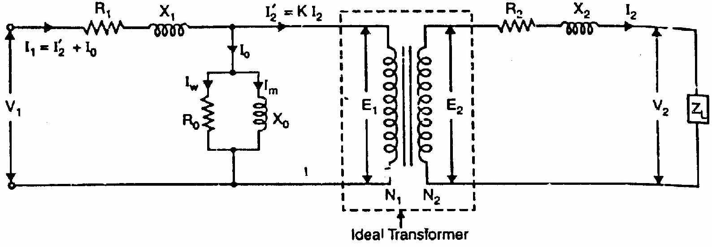
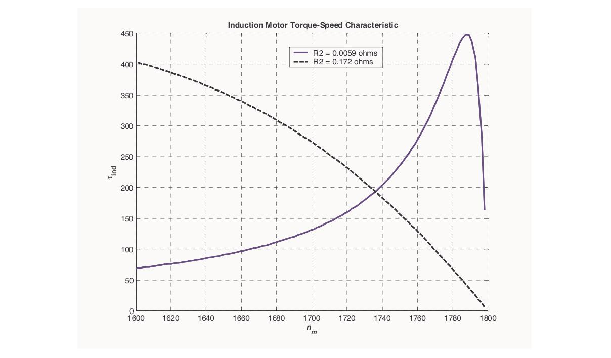

[← 2023 Answer](2023_answer.md) | [🏠 Index](README.md) | *(end)*

---

# ECE 2207: 2024 Semester Final: Exam Style Answers
**RUET · ECE Dept · 2nd Year Even Semester (Session 2023-24)**
**Course Code:** ECE 2207 | **Full Marks:** 60 | **Time:** 3 Hours
**Attempt any 5 questions out of 8. All questions carry equal marks (12 each).**

---

## Question 1

**(a) Show how the schematic representation of a 1-phase transformer connects to a sinusoidal source on the primary and a load on the secondary. Identify and label all variables on both sides. [06, CO1]**

**Schematic:**

**Primary side variables:**

| Symbol | Description |
|:---:|:---|
| $v_1(t)$, $V_1$ | Instantaneous and RMS applied terminal voltage |
| $i_1(t)$, $I_1$ | Instantaneous and RMS primary current |
| $N_1$ | Number of primary turns |
| $e_1(t)$, $E_1 = 4.44fN_1\Phi_m$ | Self-induced counter-EMF (lags $\Phi$ by 90°) |

**Secondary side variables:**

| Symbol | Description |
|:---:|:---|
| $N_2$ | Number of secondary turns |
| $e_2(t)$, $E_2 = 4.44fN_2\Phi_m$ | Mutually induced EMF |
| $v_2(t)$, $V_2$ | Secondary terminal voltage |
| $i_2(t)$, $I_2$ | Secondary load current |
| $Z_L = R_L + jX_L$ | Load impedance |

**Core variables:**

| Symbol | Description |
|:---:|:---|
| $\Phi(t) = \Phi_m\sin\omega t$ | Mutual core flux |
| $\Phi_m$ | Peak mutual flux (Wb) |
| $f$ | Supply frequency (Hz) |
| $K = N_2/N_1 = E_2/E_1$ | Transformation ratio |

---

**(b) Explain the no-load operation of a 1-phase transformer with a neat phasor diagram. [06, CO1]**

**Operation at no-load ($I_2 = 0$):**

When primary voltage $V_1$ is applied and the secondary is open, a small no-load current $I_0$ flows in the primary. This current has two components:

1. **Magnetizing component $I_m$:** In quadrature with $V_1$ (lagging by 90°). Creates the alternating core flux $\Phi_m$.

2. **Core-loss component $I_c$:** In phase with $V_1$. Supplies hysteresis and eddy current losses in the core.

$$I_0 = \sqrt{I_c^2 + I_m^2}, \qquad \cos\phi_0 = \frac{I_c}{I_0} = \frac{W_0}{V_1 I_0}$$

The core flux $\Phi_m$ induces:
$$E_1 = 4.44fN_1\Phi_m \approx V_1, \qquad E_2 = 4.44fN_2\Phi_m = V_2 \text{ (open secondary)}$$

**Phasor diagram (no-load):**

Key relationships:
- $V_1 \approx E_1$ (small $I_0R_1$ drop neglected for ideal core)
- $V_2 = E_2$ (secondary open, no drop)
- $V_2/V_1 = N_2/N_1 = K$

---

## Question 2

**(a) Draw the phasor diagram of a R-L loaded ideal transformer, stating each step. [06, CO1]**

**Ideal transformer assumptions:** $R_1 = R_2 = X_1 = X_2 = 0$, $I_0 = 0$, so $V_2 = E_2$ and $V_1 = -E_1$.

For R-L load: secondary current lags secondary voltage by $\theta_2 = \tan^{-1}(X_L/R_L)$.

**Step 1:** Draw reference $\vec{\Phi}_m$ horizontal (along +X axis).

**Step 2:** Draw $\vec{E}_1$ and $\vec{E}_2$ vertically downward (lagging $\vec{\Phi}_m$ by 90°).

**Step 3:** Since ideal: $\vec{V}_2 = \vec{E}_2$ (downward).

**Step 4:** R-L load: $\vec{I}_2$ lags $\vec{V}_2$ by $\theta_2$. Draw $\vec{I}_2$ clockwise from $\vec{E}_2$ by $\theta_2$.

**Step 5:** Ampere-turn balance: $N_1\vec{I}_1 = -N_2\vec{I}_2 \Rightarrow \vec{I}_1 = -(N_2/N_1)\vec{I}_2$. So $\vec{I}_1$ is $180°$ opposite to $\vec{I}_2$.

**Step 6:** $\vec{V}_1 = -\vec{E}_1$ (vertically upward, +Y direction).

**Step 7:** Angle between $\vec{V}_1$ and $\vec{I}_1$ is $\theta_1 = \theta_2$. Primary power factor equals load power factor.

**Phasor summary table:**

| Phasor | Angle |
|:---:|:---:|
| $\vec{\Phi}_m$ | 0° |
| $\vec{E}_1, \vec{E}_2, \vec{V}_2$ | −90° |
| $\vec{V}_1$ | +90° |
| $\vec{I}_2$ | $-90° - \theta_2$ |
| $\vec{I}_1$ | $+90° - \theta_1$ |

---

**(b) Explain leakage flux and its effect on transformer operation. Include a schematic. [06, CO1]**

**Three types of flux:**
- $\Phi_M$ (or $\Phi_m$): Mutual flux through the iron core linking both primary and secondary windings. Transfers power.
- $\Phi_{\ell p}$ (or $\Phi_{l1}$): Primary leakage flux, linking only primary turns $N_1$, completing path through air.
- $\Phi_{\ell s}$ (or $\Phi_{l2}$): Secondary leakage flux, linking only secondary turns $N_2$, completing path through air.

**Effects on operation:**

1. **Leakage reactances:** Leakage flux $\Phi_{l1} \propto I_1$ (air path, constant permeability). Induces self-EMF lagging current by 90°. Appears as series reactance:
   $$X_1 = 2\pi f L_{l1}, \quad X_2 = 2\pi f L_{l2}$$

2. **Voltage equations with leakage:**
   $$V_1 = E_1 + I_1 R_1 + jI_1 X_1$$
   $$V_2 = E_2 - I_2 R_2 - jI_2 X_2$$

3. **Worsened voltage regulation:** Under lagging pf load, reactive drop $jI_2X_2$ reduces $V_2$.

4. **Fault current limiting (beneficial):** Short circuit fault current is limited by $X_{01} = X_1 + X_2'$.

---

## Question 3

**(a) Why are OC and SC tests preferred to direct load test for finding efficiency and voltage regulation of a transformer? [04, CO1]**

**Direct load test problems:**
1. Requires a full-rated load (resistive, inductive, or capacitive): difficult to arrange and expensive for large transformers.
2. The load must absorb the full kVA during the test.
3. Full losses must be supplied continuously. For a 500 kVA transformer, maintaining a full test for hours is costly and wasteful.
4. The test gives results only at one load condition.

**OC and SC test advantages:**
1. **Low power consumption:** OC test uses rated voltage but only no-load current (~2-10% of rated). SC test uses only ~5% of rated voltage. Power consumed is only the losses: orders of magnitude smaller.
2. **Economical:** No large load needed.
3. **Accurate:** Direct measurement of losses (core loss from OC, copper loss from SC). No estimation.
4. **Multiple results:** Using these parameters, efficiency and VR can be calculated for any load and any power factor without repeating the test.
5. **Safe:** No thermal stress from full-load currents sustained for long.

---

**(b) 20 kVA, 2000/400V, OC test (HV open): 400V, 1.5A, 160W. SC test (LV short): 60V, rated I, 300W. Find: (i) parameters of equivalent circuit referred to HV side, (ii) efficiency and VR at full-load 0.8 pf lag. [08, CO1]**

**Turns ratio:** $a = 2000/400 = 5$

**Rated HV current:** $I_{1,\text{rated}} = 20000/2000 = 10$ A

**OC test (LV side = secondary, 400V):**

$$\cos\phi_0 = \frac{W_0}{V_0 I_0} = \frac{160}{400 \times 1.5} = \frac{160}{600} = 0.2667$$

$$I_c = 1.5 \times 0.2667 = 0.400 \text{ A}, \quad I_m = 1.5\sin(\cos^{-1}0.2667) = 1.5 \times 0.9638 = 1.446 \text{ A}$$

Referred to HV side ($\times a^2 = 25$):
$$R_{c1} = \frac{V_{0,HV}^2}{W_0} = \frac{2000^2}{160} = 25000\,\Omega$$

$$X_{m1} = \frac{V_{0,HV}}{I_{m,HV}} = \frac{2000}{1.446/5} = \frac{2000}{0.289} = 6920\,\Omega$$

(Or: $R_{c1} = a^2 R_{c,LV} = 25 \times (400^2/160) = 25 \times 1000 = 25000\,\Omega$ ✓)

**SC test (HV side):**

$$R_{01} = \frac{W_{sc}}{I_{sc}^2} = \frac{300}{10^2} = 3.0\,\Omega$$

$$Z_{01} = \frac{V_{sc}}{I_{sc}} = \frac{60}{10} = 6.0\,\Omega$$

$$X_{01} = \sqrt{6.0^2 - 3.0^2} = \sqrt{36 - 9} = \sqrt{27} = 5.196\,\Omega$$

**Equivalent circuit parameters (referred to HV):**
- Shunt: $R_{c1} = 25000\,\Omega$, $X_{m1} = 6920\,\Omega$
- Series: $R_{01} = 3.0\,\Omega$, $X_{01} = 5.196\,\Omega$

**Efficiency at full load, 0.8 pf lag:**

$$\eta = \frac{S\cos\phi}{S\cos\phi + P_{Fe} + P_{Cu,FL}} = \frac{20000 \times 0.8}{16000 + 160 + 300} = \frac{16000}{16460} = \boxed{97.20\%}$$

**Voltage regulation at full load, 0.8 pf lag:**

$$\text{VR\%} = \frac{I_1(R_{01}\cos\phi + X_{01}\sin\phi)}{V_1} \times 100$$

$$= \frac{10(3.0 \times 0.8 + 5.196 \times 0.6)}{2000} \times 100 = \frac{10(2.4 + 3.118)}{2000} \times 100$$

$$= \frac{10 \times 5.518}{2000} \times 100 = \frac{55.18}{2000} \times 100 = \boxed{2.76\%}$$

---

## Question 4

**(a) Under assumptions of constant permeability and no leakage flux, derive the transformer EMF equation. [06, CO1]**

**Assumptions:**
- Constant core permeability → constant reluctance → $\Phi \propto I_1$ (linear magnetic circuit).
- Zero leakage flux → same flux $\Phi(t)$ links all $N_1$ primary and $N_2$ secondary turns.

Let: $\Phi(t) = \Phi_m\sin(2\pi ft)$

**Primary EMF:**
$$e_1(t) = -N_1\frac{d\Phi}{dt} = -N_1 \cdot 2\pi f\Phi_m\cos(2\pi ft) = N_1(2\pi f)\Phi_m\sin(2\pi ft - 90°)$$

Peak: $E_{m1} = 2\pi f N_1\Phi_m$

RMS: $E_1 = \frac{2\pi f N_1\Phi_m}{\sqrt{2}} = \sqrt{2}\pi f N_1\Phi_m = 4.44 f N_1\Phi_m$

**Secondary EMF:**
$$\boxed{E_1 = 4.44 f N_1\Phi_m, \qquad E_2 = 4.44 f N_2\Phi_m}$$

**Alternative (form factor method):**

In quarter-cycle ($T/4 = 1/4f$), flux rises from $0$ to $\Phi_m$:
$$\text{Avg EMF per turn} = \frac{\Phi_m}{1/(4f)} = 4f\Phi_m$$

Form factor of sine wave: $K_f = \text{RMS}/\text{Avg} = \pi/(2\sqrt{2}) = 1.11$

RMS EMF per turn $= 1.11 \times 4f\Phi_m = 4.44f\Phi_m$

Multiply by turns: $E_1 = 4.44fN_1\Phi_m$, $E_2 = 4.44fN_2\Phi_m$ ✓

---

**(b) 50 Hz, 6.6 kV/400V transformer. Cross-section = 25 cm². Max flux density = 1.2 T. Find number of turns on each side. [03, CO1]**

**Peak flux:**
$$\Phi_m = B_m \times A = 1.2 \times 25 \times 10^{-4} = 3 \times 10^{-3} \text{ Wb} = 3 \text{ mWb}$$

**Primary turns ($E_1 = V_1 = 6600$ V):**
$$N_1 = \frac{E_1}{4.44 f \Phi_m} = \frac{6600}{4.44 \times 50 \times 3 \times 10^{-3}} = \frac{6600}{0.666} = \boxed{9910 \text{ turns}}$$

**Secondary turns ($E_2 = V_2 = 400$ V):**
$$N_2 = \frac{E_2}{4.44 f \Phi_m} = \frac{400}{0.666} = \boxed{600 \text{ turns}}$$

**Check:** $N_1/N_2 = 9910/600 = 16.52 \approx 6600/400 = 16.5$ ✓

---

**(c) Obtain the equivalent circuit of a transformer referred to the primary side. [03, CO1]**

**Referring secondary to primary:**

Replace all secondary quantities with primary-referred (primed) values:
$$R_2' = a^2 R_2, \quad X_2' = a^2 X_2, \quad E_2' = aE_2 = E_1, \quad Z_L' = a^2 Z_L$$

**Final equivalent circuit referred to primary:**

Series branch: $R_{01} = R_1 + R_2'$, $X_{01} = X_1 + X_2'$ (total series impedance).

Shunt branch: $R_c \| jX_m$ (at primary terminals: approximate circuit).

In the approximate equivalent circuit, the shunt branch is moved to the primary input terminals (before $R_1$, $X_1$). This simplifies calculation without significant error for most power transformers.

---

## Question 5

**(a) A 3-phase IM is connected to a balanced 3-phase supply. Prove that the resultant flux produced by the stator currents is constant in magnitude ($= 1.5\Phi_m$) and rotates at synchronous speed. [08, CO2]**

**Setup:** Stator windings 120° apart in space. Balanced 3-phase supply:
$$\Phi_R = \Phi_m\sin\omega t, \quad \Phi_Y = \Phi_m\sin(\omega t - 120°), \quad \Phi_B = \Phi_m\sin(\omega t + 120°)$$

**Resolve into X (horizontal) and Y (vertical) components:**

Take R-phase axis as +X. Y-phase axis is at 120° from X. B-phase axis is at 240° from X.

**X-component:**
$$\Phi_x = \Phi_R(1) + \Phi_Y\cos 120° + \Phi_B\cos 240°$$
$$= \Phi_m\sin\omega t + \Phi_m\sin(\omega t - 120°)(-\tfrac{1}{2}) + \Phi_m\sin(\omega t + 120°)(-\tfrac{1}{2})$$

Using $\sin(A-B) + \sin(A+B) = 2\sin A\cos B$:
$$= \Phi_m\sin\omega t - \frac{1}{2}\Phi_m \cdot 2\sin\omega t\cos 120° = \Phi_m\sin\omega t - \frac{1}{2}\Phi_m \cdot 2\sin\omega t \cdot (-\frac{1}{2})$$
$$= \Phi_m\sin\omega t + \frac{1}{2}\Phi_m\sin\omega t = \frac{3}{2}\Phi_m\sin\omega t$$

**Y-component:**
$$\Phi_y = \Phi_Y\sin 120° + \Phi_B\sin 240°$$
$$= \Phi_m\sin(\omega t - 120°)\cdot\frac{\sqrt{3}}{2} + \Phi_m\sin(\omega t + 120°)\cdot(-\frac{\sqrt{3}}{2})$$
$$= \frac{\sqrt{3}}{2}\Phi_m[\sin(\omega t - 120°) - \sin(\omega t + 120°)]$$

Using $\sin(A-B) - \sin(A+B) = -2\cos A\sin B$:
$$= \frac{\sqrt{3}}{2}\Phi_m \cdot (-2\cos\omega t\sin 120°) = \frac{\sqrt{3}}{2}\Phi_m \cdot (-2\cos\omega t \cdot \frac{\sqrt{3}}{2}) = -\frac{3}{2}\Phi_m\cos\omega t$$

**Magnitude:**
$$\Phi_r = \sqrt{\Phi_x^2 + \Phi_y^2} = \sqrt{\left(\frac{3}{2}\Phi_m\right)^2(\sin^2\omega t + \cos^2\omega t)} = \boxed{\frac{3}{2}\Phi_m = 1.5\Phi_m = \text{constant}}$$

**Space angle:**
$$\theta = \tan^{-1}\!\left(\frac{\Phi_y}{\Phi_x}\right) = \tan^{-1}\!\left(\frac{-\cos\omega t}{\sin\omega t}\right) = \omega t - 90°$$

$$\frac{d\theta}{dt} = \omega = 2\pi f \implies N_s = \frac{120f}{P} \text{ rpm}$$

**Conclusion:** Resultant flux = $1.5\Phi_m$ (constant magnitude), rotating at synchronous speed $N_s$. *(Proved)*

---

**(b) Show that the rotor copper loss = $s \times$ air gap power. Also show $P_m : P_{r,Cu} : P_g = (1-s) : s : 1$. [04, CO2]**

From equivalent circuit, air-gap power:
$$P_g = 3 I_2^2 \cdot \frac{R_2}{s}$$

Rotor copper loss:
$$P_{r,Cu} = 3 I_2^2 R_2 = s \cdot 3 I_2^2 \cdot \frac{R_2}{s} = s \cdot P_g$$

$$\boxed{P_{r,Cu} = s P_g}$$

Mechanical power:
$$P_m = P_g - P_{r,Cu} = P_g - sP_g = (1-s)P_g$$

**Ratio:**
$$P_m : P_{r,Cu} : P_g = (1-s)P_g : sP_g : P_g = \boxed{(1-s) : s : 1}$$

*(Proved)*

---

## Question 6

**(a) Derive the expression for maximum torque of a 3-phase IM and show it is independent of rotor resistance. [07, CO2]**

Torque equation:
$$T = \frac{ksE_2^2 R_2}{R_2^2 + s^2 X_2^2}, \qquad k = \frac{3}{2\pi n_s}$$

**Condition for maximum torque:**

Differentiate $T$ with respect to $s$ and equate to zero. Equivalently, maximize $f(s) = \frac{sR_2}{R_2^2 + s^2 X_2^2}$.

Using quotient rule, setting numerator of $df/ds$ to zero:
$$R_2^2 + s^2 X_2^2 - 2s^2 X_2^2 = 0 \implies R_2^2 = s^2 X_2^2 \implies s_{mT} = \frac{R_2}{X_2}$$

**Value of maximum torque:**

Substitute $s = s_{mT} = R_2/X_2$ into the torque equation:

Numerator: $s_{mT} E_2^2 R_2 = \frac{R_2}{X_2} E_2^2 R_2 = \frac{R_2^2 E_2^2}{X_2}$

Denominator: $R_2^2 + s_{mT}^2 X_2^2 = R_2^2 + \frac{R_2^2}{X_2^2} X_2^2 = 2R_2^2$

$$T_{\max} = k \cdot \frac{R_2^2 E_2^2 / X_2}{2R_2^2} = \boxed{\frac{kE_2^2}{2X_2}}$$

$R_2$ cancels completely. $T_{\max}$ depends only on $E_2$ (supply voltage) and $X_2$ (standstill reactance).

**Conclusion:**
- Rotor resistance determines where max torque occurs: $s_{mT} = R_2/X_2$.
- Rotor resistance has no effect on the value of max torque: $T_{\max} = kE_2^2/(2X_2)$.
- Adding rotor resistance in a wound-rotor motor shifts torque peak to higher slip without reducing it.

*(Proved)*

---

**(b) 6-pole, 400V, 50 Hz, star-connected IM. $R_2' = 0.5\,\Omega$, $X_2' = 2.0\,\Omega$ (standstill, referred to stator). Full-load slip = 4%. Find: starting torque, full-load torque, max torque, efficiency if mechanical losses = 500 W. [05, CO2]**

$$N_s = \frac{120 \times 50}{6} = 1000 \text{ rpm} = \frac{50}{3} \text{ rps}$$

$$k = \frac{3}{2\pi \times 50/3} = \frac{3}{104.72} = 0.02865$$

Phase voltage: $V_\phi = 400/\sqrt{3} = 231.0$ V. Take $E_2' = V_\phi = 231.0$ V.

**Starting torque ($s = 1$):**
$$T_{st} = \frac{k \times 1 \times 231^2 \times 0.5}{0.5^2 + 1^2 \times 2^2} = \frac{0.02865 \times 53361 \times 0.5}{0.25 + 4.0} = \frac{764.7}{4.25} = \boxed{179.9 \text{ N-m}}$$

**Full-load torque ($s = 0.04$):**
$$T_{FL} = \frac{0.02865 \times 0.04 \times 53361 \times 0.5}{0.25 + 0.04^2 \times 4} = \frac{0.02865 \times 0.04 \times 26680}{0.25 + 0.0064} = \frac{30.55}{0.2564} = \boxed{119.2 \text{ N-m}}$$

**Maximum torque:**
$$T_{\max} = \frac{k E_2^2}{2X_2} = \frac{0.02865 \times 53361}{2 \times 2.0} = \frac{1528.9}{4.0} = \boxed{382.2 \text{ N-m}}$$

**Efficiency at full load:**

Air-gap power: $P_g = T_{FL} \times \omega_s = 119.2 \times (2\pi \times 1000/60) = 119.2 \times 104.72 = 12483$ W

Rotor copper loss: $P_{r,Cu} = s P_g = 0.04 \times 12483 = 499.3$ W

Mechanical power: $P_m = (1-s) P_g = 0.96 \times 12483 = 11983$ W

Net output: $P_{out} = P_m - P_{fric} = 11983 - 500 = 11483$ W

Stator losses ($P_{Fe}$ and $P_{Cu1}$) are not given. Assuming they are negligible ($P_{input} \approx P_g$):

$$P_{input} \approx 12483 \text{ W}$$

$$\eta = \frac{P_{out}}{P_{input}} \times 100 \approx \frac{11483}{12483} \times 100 = \boxed{92.0\%}$$

---

## Question 7

**(a) Explain the no-load and blocked rotor tests for a 3-phase IM. From these tests, determine the equivalent circuit parameters. [09, CO3]**

**No-Load Test:**
Motor runs uncoupled at rated voltage and frequency. Since slip $s \approx 0$, the rotor branch is effectively an open circuit. The motor draws a small no-load current $I_0$ to supply core loss and friction/windage loss.
- **Measurements:** $V_0$ (line voltage), $I_0$ (line current), $P_0$ (3-phase power).
- **Parameters found:** Shunt branch ($R_c$, $X_m$).
$$R_c = \frac{V_\phi}{I_c}, \quad X_m = \frac{V_\phi}{I_m} \quad \text{where } I_c = I_0 \cos\phi_0, I_m = I_0 \sin\phi_0$$

**Blocked-Rotor Test:**
Rotor is mechanically blocked ($s = 1$). A reduced voltage (10-15% of rated) is applied to circulate rated full-load current. At such low voltage, core loss is negligible. Input power equals full-load copper loss.
- **Measurements:** $V_{sc}$ (line voltage), $I_{sc}$ (line current), $P_{sc}$ (3-phase power).
- **Parameters found:** Equivalent series resistance and reactance ($R_{01}, X_{01}$).
$$Z_{01} = \frac{V_{sc}/\sqrt{3}}{I_{sc}}, \quad R_{01} = \frac{P_{sc}}{3 I_{sc}^2}, \quad X_{01} = \sqrt{Z_{01}^2 - R_{01}^2}$$
Assuming $X_1 = X_2' = X_{01}/2$.

**DC Test (for $R_2'$):**
Measure stator resistance $R_1$ using a DC source. Then rotor resistance referred to stator is $R_2' = R_{01} - R_1$.

---

**(b) Explain the effect of rotor resistance on the torque-speed characteristic curve. [03, CO3]**

From $s_{mT} = R_2/X_2$ and $T_{\max} = kE_2^2/(2X_2)$:

**Increasing rotor resistance $R_2$ (wound-rotor motor with external resistance):**

1. $s_{mT}$ increases: the peak torque shifts to higher slip (lower speed).
2. $T_{\max}$ remains unchanged (no $R_2$ in the formula).
3. The starting torque $T_{st}$ increases as $R_2$ increases (up to the point $R_2 = X_2$, at which $T_{st} = T_{\max}$).

**Practical use:** By selecting appropriate external resistance, the wound-rotor motor can develop maximum torque at any desired speed. This is used for step-speed control and smooth starting of heavy loads.

---

## Question 8

**(a) Explain the principle of operation of a 1-phase induction motor and why it is not self-starting (with double revolving field theory). [06, CO4]**

A single-phase induction motor has:
- One stator winding (main winding) carrying single-phase AC.
- A squirrel-cage rotor.

**Why it is not self-starting:**

A single-phase AC current creates a pulsating magnetic flux, not a rotating one:
$$\Phi = \Phi_m\sin\omega t$$

By the **double revolving field theory (Ferraris theorem):**

This pulsating field decomposes into two counter-rotating RMFs of equal magnitude $\Phi_m/2$:

$$\Phi = \underbrace{\frac{\Phi_m}{2}\sin(\omega t - \theta)}_{\text{Forward field}} + \underbrace{\frac{\Phi_m}{2}\sin(\omega t + \theta)}_{\text{Backward field}}$$

Each produces a torque on the squirrel-cage rotor:
- Forward field produces $T_f$ (positive)
- Backward field produces $T_b$ (negative)

**At standstill ($N = 0$):** Both fields see the same slip ($s = 1$). So $T_f = T_b$ and net torque $= 0$.

**When running (pushed to forward speed $N$):**
- Slip for forward field: $s_f = (N_s - N)/N_s$ (small)
- Slip for backward field: $s_b = (N_s + N)/N_s = 2 - s_f$ (close to 2)
- $T_f > T_b$ → motor continues running in the pushed direction.

**Conclusion:** Zero starting torque → not self-starting. The motor needs a starting mechanism.

---

**(b) Describe two types of single-phase induction motors commonly used in practice. [06, CO4]**

**Type 1: Capacitor-Start, Capacitor-Run Motor (Two-Value Capacitor Motor):**

This motor has:
- Main winding (M): always in circuit.
- Auxiliary winding (A): permanently in circuit.
- Starting capacitor $C_s$: in circuit only during starting (switched out by centrifugal switch after ~75% speed).
- Running capacitor $C_r$: permanently in circuit.

**Starting:** $C_s + C_r$ (combined large capacitance) gives nearly 90° phase split between $I_m$ and $I_a$. High starting torque (200-350% of FL).

**Running:** $C_s$ disconnected. $C_r$ (smaller value) is optimized for running. Better running efficiency, power factor, and quieter operation compared to single capacitor motors.

**Applications:** Refrigerator compressors, pumps, air conditioners, power tools.

---

**Type 2: Shaded-Pole Motor:**

This is the simplest single-phase induction motor. It has:
- Salient poles (projecting poles like a DC machine).
- A short-circuited copper band (shading ring) placed around a portion of each pole face.

**Operating principle:**

The alternating flux in each pole induces a current in the shading ring. By Lenz's Law, this current opposes the flux change in the shaded portion. The flux in the shaded portion lags behind the flux in the unshaded portion in time, though they are in the same physical space. This time lag produces a sweeping effect from unshaded to shaded portion, like a weak rotating field. This gives a small, unidirectional starting torque.

The rotor (squirrel-cage) follows this sweeping field from unshaded → shaded, and keeps running.

**Characteristics:**
- Very low starting torque (40-60% of FL)
- Very low efficiency (copper ring always dissipates heat)
- Very simple and reliable: no capacitors, no switches, no auxiliary winding
- Only for small sizes (fans, relays, small appliances)
- Fixed rotation direction (cannot be reversed without mechanical modification)

**Applications:** Small cooling fans, hair dryers, small exhaust fans, record turntables, display motors.

---

*Source:* [PrevYearQuestions/2024.md](../PrevYearQuestions/2024.md)

---

[← 2023 Answer](2023_answer.md) | [🏠 Index](README.md) | *(end)*
