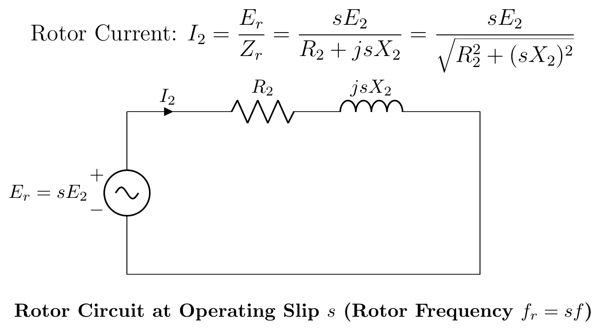

# ECE 2207: 2017 Semester Final: Explanation Style Answers
**RUET · ECE Dept · 2nd Year Odd Semester 2017**

> Deep tutorial-style explanations focusing on first-principles physics, "why over what", step-by-step logic, and practical engineering intuition.
> Core cross-cutting theory topics are detailed in [2018_2024_answer.md](2018_2024_answer.md).

---

## SECTION - A (Induction Motors: Q1 to Q4)

### Question 1

#### Q1(a): Why is an Induction Motor Called a "Rotating Transformer"?

#### The Physical Analogy:
A conventional static transformer transfers energy between two electrically isolated circuits via mutual electromagnetic induction through a stationary magnetic core.
The 3-phase induction motor operates on the exact same fundamental mechanism across an air gap:
1. **Primary Circuit (Stator)**: Connects to the AC power grid, drawing alternating current that establishes mutual magnetic flux across the air gap.
2. **Secondary Circuit (Rotor)**: Consists of closed, short-circuited conducting bars. The mutual magnetic field induces secondary voltages and circulating secondary currents by Faraday's Law.
3. **Standstill Identity ($s = 1.0$)**:
   When the rotor is locked, the rotor frequency equals the supply frequency ($f_r = f$). The machine is mathematically and physically identical to a short-circuited 3-phase transformer.
4. **The Distinction ("Rotating")**:
   In a transformer, the secondary winding is fixed to the iron core. In an induction motor, the secondary conductors are housed on a freely rotating cylindrical rotor. Part of the induced electrical energy is converted into mechanical kinetic energy, and the frequency of induced rotor EMF is throttled down by slip: $f_r = s f$.

---

#### Q1(b): Proof That 3-Phase Stator Windings Produce a Uniformly Rotating Flux

#### Setup:
Three identical stator coils displaced 120° apart in space around the cylindrical stator periphery carry balanced 3-phase currents displaced 120° apart in time:
$$\Phi_R = \Phi_m \sin\omega t, \quad \Phi_Y = \Phi_m \sin(\omega t - 120°), \quad \Phi_B = \Phi_m \sin(\omega t + 120°)$$

#### Resolving into Orthogonal Spatial Components:
Taking the R-phase spatial axis as horizontal (+X axis):
- **Horizontal ($X$) Component**:
  $$\Phi_x = \Phi_R + \Phi_Y \cos 120° + \Phi_B \cos 240°$$
  $$\Phi_x = \Phi_m \sin\omega t - \frac{1}{2}\Phi_m [\sin(\omega t - 120°) + \sin(\omega t + 120°)]$$
  Using $\sin(A-B) + \sin(A+B) = 2\sin A\cos B$:
  $$\sin(\omega t - 120°) + \sin(\omega t + 120°) = 2\sin\omega t \cos 120° = -\sin\omega t$$
  $$\Phi_x = \Phi_m \sin\omega t - \frac{1}{2}\Phi_m(-\sin\omega t) = \mathbf{\frac{3}{2}\Phi_m \sin\omega t}$$

- **Vertical ($Y$) Component**:
  $$\Phi_y = \Phi_Y \sin 120° + \Phi_B \sin 240° = \frac{\sqrt{3}}{2}\Phi_m [\sin(\omega t - 120°) - \sin(\omega t + 120°)]$$
  Using $\sin(A-B) - \sin(A+B) = -2\cos A\sin B$:
  $$\Phi_y = \frac{\sqrt{3}}{2}\Phi_m \left[-2\cos\omega t \left(\frac{\sqrt{3}}{2}\right)\right] = \mathbf{-\frac{3}{2}\Phi_m \cos\omega t}$$

- **Resultant Flux Magnitude and Spatial Rotation**:
  $$\Phi_r = \sqrt{\Phi_x^2 + \Phi_y^2} = \sqrt{\left(\frac{3}{2}\Phi_m\right)^2(\sin^2\omega t + \cos^2\omega t)} = \mathbf{1.5\Phi_m = \text{constant}}$$
  $$\theta = \tan^{-1}\left(\frac{\Phi_y}{\Phi_x}\right) = \tan^{-1}\left(\frac{-\cos\omega t}{\sin\omega t}\right) = \omega t - 90°$$
  The resultant flux has constant magnitude $1.5\Phi_m$ and sweeps smoothly around the stator bore at synchronous speed $\omega = 2\pi f$ electrical rad/s ($N_s = \frac{120f}{P}$ rpm).

---

#### Q1(c): 6-Pole, 50 Hz Induction Motor Driven Mechanically at 1000 rpm

#### Given Data:
- Poles $P = 6$, Frequency $f = 50\text{ Hz}$
- Driven rotor speed $N = 1000\text{ rpm}$

#### Step-by-Step Analysis:
1. **Synchronous Speed of Stator RMF**:
   $$N_s = \frac{120 f}{P} = \frac{120 \times 50}{6} = \mathbf{1000\text{ rpm}}$$
2. **Operating Slip**:
   $$s = \frac{N_s - N}{N_s} = \frac{1000 - 1000}{1000} = \mathbf{0}$$
3. **Induced Rotor EMF Frequency and Magnitude**:
   $$f_r = s f = 0 \times 50 = \mathbf{0\text{ Hz}}$$
   $$E_{2s} = s E_2 = 0\text{ V}$$
4. **Physical Explanation**:
   When the rotor is driven at the exact same speed and direction as the rotating magnetic field, there is **zero relative velocity** between the stator magnetic flux lines and the rotor conductors. The conductors never cut any flux lines ($d\Phi/dt = 0$). By Faraday's Law, no EMF is induced in the rotor bars, no rotor current flows, and electromagnetic torque is zero. The motor neither absorbs nor produces electrical power.

---

### Question 2

#### Q2(a): Torque-Slip Characteristic and the Impact of Rotor Resistance

The torque equation of an induction motor is:
$$T = \frac{k s E_2^2 R_2}{R_2^2 + s^2 X_2^2}$$
1. **Low-Slip Zone ($s < s_{mT}$)**: Rotor reactance is negligible ($s X_2 \ll R_2$). Torque is roughly proportional to slip: $T \propto \frac{s}{R_2}$. Higher rotor resistance reduces torque in this linear operating region.
2. **High-Slip Zone ($s > s_{mT}$)**: Rotor reactance dominates ($s X_2 \gg R_2$). Torque is inversely proportional to slip: $T \propto \frac{R_2}{s X_2^2}$. Higher rotor resistance increases torque in this region.
3. **Effect of Increasing $R_2$ on the Curve**:
   - The breakdown torque magnitude $T_{\max} = \frac{k E_2^2}{2 X_2}$ remains **completely unchanged**.
   - The slip at which peak torque occurs shifts upward: $s_{mT} = \frac{R_2}{X_2}$.
   - Starting torque ($s = 1.0$) increases significantly until $R_2 = X_2$, where starting torque reaches the absolute breakdown torque limit ($T_{st} = T_{\max}$).

---

#### Q2(b): Proof: $\frac{T_f}{T_{\max}} = \frac{2 a s_f}{a^2 + s_f^2}$

Torque at full-load slip $s_f$:
$$T_f = \frac{k s_f E_2^2 R_2}{R_2^2 + s_f^2 X_2^2}$$
Maximum breakdown torque occurs at $s_{mT} = \frac{R_2}{X_2} = a$:
$$T_{\max} = \frac{k E_2^2}{2 X_2}$$
Dividing $T_f$ by $T_{\max}$:
$$\frac{T_f}{T_{\max}} = \frac{\frac{k s_f E_2^2 R_2}{R_2^2 + s_f^2 X_2^2}}{\frac{k E_2^2}{2 X_2}} = \frac{2 s_f R_2 X_2}{R_2^2 + s_f^2 X_2^2}$$
Divide both numerator and denominator by $X_2^2$:
$$\frac{T_f}{T_{\max}} = \frac{2 s_f \left(\frac{R_2}{X_2}\right)}{\left(\frac{R_2}{X_2}\right)^2 + s_f^2} = \boxed{\frac{2 a s_f}{a^2 + s_f^2}}$$
where $a = \frac{R_2}{X_2} = s_{mT}$. *(Proved)*

---

#### Q2(c): Numerical: 4-Pole, 50 Hz IM Torque Ratio and Speed

#### Given Data:
- Poles $P = 4, f = 50\text{ Hz} \implies N_s = 1500\text{ rpm}$
- Rotor parameters: $R_2 = 0.04\,\Omega, X_2 = 0.20\,\Omega$
- Full-load speed $N = 1440\text{ rpm}$

#### Step-by-Step Solution:
1. **Full-Load Operating Slip**:
   $$s_f = \frac{1500 - 1440}{1500} = \frac{60}{1500} = \mathbf{0.04}$$
2. **Slip and Speed at Maximum Torque**:
   $$a = s_{mT} = \frac{R_2}{X_2} = \frac{0.04}{0.20} = \mathbf{0.20 \quad (20\% \text{ slip})}$$
   $$N_{mT} = N_s (1 - s_{mT}) = 1500 \times (1 - 0.20) = \mathbf{1200\text{ rpm}}$$
3. **Ratio of Maximum Torque to Full-Load Torque ($T_{\max}/T_{FL}$)**:
   $$\frac{T_{FL}}{T_{\max}} = \frac{2 a s_f}{a^2 + s_f^2} = \frac{2 \times 0.20 \times 0.04}{(0.20)^2 + (0.04)^2} = \frac{0.016}{0.040 + 0.0016} = \frac{0.016}{0.0416} \approx 0.3846$$
   $$\frac{T_{\max}}{T_{FL}} = \frac{1}{0.3846} = \mathbf{2.60}$$

---

### Question 3

#### Q3(a): Step-by-Step Development of Induction Motor Equivalent Circuit

1. **Step 1**: Transformer model at standstill ($s = 1$). Both stator and rotor operate at line frequency $f$.
2. **Step 2**: Rotor at slip $s$. Induced EMF is $s E_2$, frequency is $s f$, and reactance is $s X_2$.
3. **Step 3**: Divide rotor impedance by $s$ to refer frequency to line frequency $f$. The rotor resistance becomes fictitious variable resistance $R_2/s$.
4. **Step 4**: Split $R_2/s$ into internal copper loss resistance $R_2$ and mechanical load resistance $R_L = R_2\left(\frac{1-s}{s}\right)$.
5. **Step 5**: Eliminate the ideal transformer by referring rotor parameters to the stator side ($R_2' = a^2 R_2, X_2' = a^2 X_2$).
6. **Step 6**: Approximate circuit formed by shifting the shunt magnetizing branch to the input terminals.

---

#### Q3(b): Power Flow Equation: $P_g : P_{r,Cu} : P_m = 1 : s : (1-s)$

> See full derivation in [IM-01: Air-Gap Power Ratios](2018_2024_answer.md#im-01-air-gap-power-ratios-p_g--p_rcu--p_m--1--s--1-s).

- Total air-gap power transferred into rotor: $P_g = 3 I_2^2 \frac{R_2}{s}$.
- Rotor copper loss dissipated as heat: $P_{r,Cu} = 3 I_2^2 R_2 = s P_g$.
- Net developed mechanical power: $P_m = P_g - P_{r,Cu} = (1-s) P_g$.
- Ratio: $\boxed{P_g : P_{r,Cu} : P_m = 1 : s : (1-s)}$.

---

#### Q3(c): Circle Diagram Construction and Practical Significance

The circle diagram is a graphical circle locus representing the locus of the stator current phasor as slip varies from $0 \to 1 \to \infty$.
- **Test Data Required**:
  1. *No-load test*: Determines no-load current $I_0$ and phase angle $\phi_0$ (locates point $O'$).
  2. *Blocked-rotor test*: Scaled to full rated voltage to find short-circuit current $I_{sc}$ and phase angle $\phi_{sc}$ (locates point $S$).
  3. *Stator resistance $R_1$*: Divides the vertical drop at $S$ into stator copper loss and rotor copper loss.
- **Why It Is Useful**:
  From this single circular drawing, engineers can read off stator current, power factor, slip, efficiency, rotor copper loss, mechanical power, and breakdown torque for any operating point without performing complex AC algebra.

---

### Question 4

#### Q4(a): Why Single-Phase Induction Motors Inherently Produce No Starting Torque

> See detailed breakdown in [IM-03: Single-Phase Induction Motor: Double Revolving Field Theory](2018_2024_answer.md#im-03-single-phase-induction-motor-double-revolving-field-theory).

- A single stator winding produces a pulsating flux $\Phi(t) = \Phi_m \sin\omega t$ along a single axis.
- By Ferraris' theorem, this decomposes into two equal and opposite counter-rotating fields ($\Phi_f = \Phi_m/2$ at $+N_s$ and $\Phi_b = \Phi_m/2$ at $-N_s$).
- At standstill ($N = 0$), both forward and backward slips are $1.0$ ($s_f = s_b = 1.0$).
- Forward torque $T_f$ and backward torque $T_b$ are identical in magnitude and opposite in direction.
- Resultant net torque is **strictly zero ($T_{\text{net}} = T_f - T_b = 0$)**.

---

#### Q4(b): Why Permanent-Split Capacitor Motors Run More Quietly Than Capacitor-Start Motors

1. **Capacitor-Start Motor**:
   - Uses an electrolytic capacitor in the auxiliary branch during starting.
   - At ~75% speed, a centrifugal switch disconnects the auxiliary winding.
   - During running, the motor operates solely on its single main winding. The magnetic field collapses into a pulsating single-phase field, producing double-frequency torque pulsations (100 Hz hum in a 50 Hz system) and mechanical vibration.
2. **Permanent-Split Capacitor (PSC) Motor**:
   - The auxiliary winding and a continuous-duty oil-filled AC capacitor remain connected permanently during both starting and running.
   - The motor operates continuously as a **true two-phase machine**.
   - With two windings 90° apart in space carrying currents 90° apart in time, the stator produces a continuous, smooth, circular rotating magnetic field at all times.
   - Torque pulsations are practically eliminated, there is no mechanical centrifugal switch to click or fail, and the motor runs with whisper-quiet smoothness.

---

#### Q4(c): How an Auxiliary Winding Provides Starting Torque

To convert a stationary pulsating field into a rotating magnetic field, an auxiliary winding is introduced:
- **Spatial Displacement**: Wound on the stator displaced by 90° electrical space from the main winding.
- **Temporal Phase Displacement**: Current in the auxiliary winding is forced out of phase with main current by:
  - Higher resistance ($R/L$ split-phase).
  - Series capacitor (capacitor-start).
- If main current is $i_m(t) = I_m \sin\omega t$ and auxiliary current is $i_a(t) = I_a \sin(\omega t + 90°)$, the resultant flux vector rotates around the air gap, dragging the rotor along and developing starting torque.

---

## SECTION - B (Transformers: Q5 to Q8)

### Question 5

#### Q5(a): Transformer Definition and Engineering Advantages

A static electromagnetic apparatus that transforms AC electrical energy between circuits at identical frequency through mutual inductive coupling.
- **Advantages**:
  1. *Transmission Efficiency*: Stepping voltage up to hundreds of kilovolts slashes line current, drastically reducing $I^2 R$ transmission line losses ($P_{\text{loss}} \propto 1/V^2$).
  2. *Near-Zero Maintenance*: Having zero moving parts eliminates mechanical friction, bearing wear, and spark generation.
  3. *Unmatched Efficiency*: Large transformers achieve 98% to 99.5% efficiency.
  4. *Galvanic Isolation*: Isolates high-voltage utility transmission lines from low-voltage consumer distribution circuits.

---

#### Q5(b): Operating Principle of an Ideal Transformer

An ideal transformer assumes zero winding resistances, zero leakage flux, zero core losses, and infinite core permeability:
1. Applied AC voltage $v_1(t)$ establishes alternating core flux $\Phi(t) = \Phi_m \sin\omega t$.
2. By Faraday's Law:
   $$e_1(t) = -N_1 \frac{d\Phi}{dt}, \qquad e_2(t) = -N_2 \frac{d\Phi}{dt}$$
3. Voltage transformation:
   $$\frac{V_1}{V_2} = \frac{E_1}{E_2} = \frac{N_1}{N_2} = a$$
4. Since the ideal machine is completely lossless, instantaneous input power equals output power ($v_1 i_1 = v_2 i_2$):
   $$\frac{I_1}{I_2} = \frac{V_2}{V_1} = \frac{N_2}{N_1} = \frac{1}{a}$$

---

#### Q5(c): Efficiency Calculations: 25 kVA Transformer

#### Given Data:
- Rating $S = 25\text{ kVA} = 25{,}000\text{ VA}$
- Iron loss $P_{Fe} = 350\text{ W}$ (constant)
- Full-load copper loss $P_{Cu,FL} = 400\text{ W}$

#### 1. Full-Load Performance ($x = 1.0$):
- **Unity Power Factor ($\cos\phi = 1.0$)**:
  $$P_{\text{out}} = 25{,}000 \times 1.0 = 25{,}000\text{ W}$$
  $$P_{\text{loss}} = 350 + 400 = 750\text{ W} \implies \eta = \frac{25{,}000}{25{,}750} \times 100\% = \mathbf{97.09\%}$$
- **0.8 Lagging Power Factor ($\cos\phi = 0.8$)**:
  $$P_{\text{out}} = 25{,}000 \times 0.8 = 20{,}000\text{ W}$$
  $$P_{\text{loss}} = 750\text{ W} \implies \eta = \frac{20{,}000}{20{,}750} \times 100\% = \mathbf{96.39\%}$$

#### 2. Half-Load Performance ($x = 0.5$):
- Half-load copper loss: $P_{Cu} = (0.5)^2 \times 400 = 0.25 \times 400 = 100\text{ W}$.
- Total losses: $P_{\text{loss}} = 350 + 100 = 450\text{ W}$.
- **Unity Power Factor**:
  $$P_{\text{out}} = 12{,}500\text{ W} \implies \eta = \frac{12{,}500}{12{,}950} \times 100\% = \mathbf{96.53\%}$$
- **0.8 Lagging Power Factor**:
  $$P_{\text{out}} = 10{,}000\text{ W} \implies \eta = \frac{10{,}000}{10{,}450} \times 100\% = \mathbf{95.69\%}$$

---

### Question 6

#### Q6(a): Complete Full-Load Phasor Diagram

Shows core flux $\vec{\Phi}$ reference, induced EMFs $\vec{E}_1, \vec{E}_2$ lagging by 90°, secondary load drop triangle $\vec{V}_2 + \vec{I}_2 R_2 + j \vec{I}_2 X_2 = \vec{E}_2$, and primary voltage equation $\vec{V}_1 = -\vec{E}_1 + \vec{I}_1 R_1 + j \vec{I}_1 X_1$.

---

#### Q6(b): Hysteresis Loss and Eddy Current Loss

1. **Hysteresis Loss ($P_h$)**: Energy dissipated as heat due to the friction of microscopic magnetic domains aligning and realigning each AC half-cycle. Governed by the Steinmetz equation:
   $$P_h = K_h f B_m^{1.6} V_{\text{core}}$$
   Minimized by selecting silicon alloy steel with a narrow $B-H$ hysteresis loop.
2. **Eddy Current Loss ($P_e$)**: Ohmic $I^2 R$ loss caused by circulating currents induced within the conductive steel laminations by the alternating flux:
   $$P_e = K_e f^2 B_m^2 t^2 V_{\text{core}}$$
   Minimized by slicing the core into thin ($t \approx 0.35\text{ mm}$), varnish-insulated laminations.

---

#### Q6(c): 500 kVA, 2300/208V Parameter Extraction Referred to Secondary

#### Given Data:
- Rating: $500\text{ kVA}, 2300/208\text{ V}, 50\text{ Hz}$
- Turns ratio: $a = \frac{2300}{208} = 11.0577 \implies a^2 = 122.27$
- OC Test (LV side, 208 V): $V_0 = 208\text{ V}, I_0 = 85\text{ A}, W_0 = 1800\text{ W}$
- SC Test (HV side, 2300 V): $V_{sc} = 95\text{ V}, I_{sc} = 217.4\text{ A}, W_{sc} = 8200\text{ W}$

#### 1. Series Parameters on HV Side:
$$Z_{01} = \frac{V_{sc}}{I_{sc}} = \frac{95}{217.4} = \mathbf{0.4370\,\Omega}$$
$$R_{01} = \frac{W_{sc}}{I_{sc}^2} = \frac{8200}{(217.4)^2} = \frac{8200}{47{,}262.76} = \mathbf{0.1735\,\Omega}$$
$$X_{01} = \sqrt{Z_{01}^2 - R_{01}^2} = \sqrt{(0.4370)^2 - (0.1735)^2} = \sqrt{0.1910 - 0.0301} = \mathbf{0.4011\,\Omega}$$

#### 2. Series Parameters Referred to Secondary (LV Side):
Divide all series impedances by $a^2 = 122.27$:
$$R_{02} = \frac{R_{01}}{a^2} = \frac{0.1735}{122.27} = \mathbf{1.419 \times 10^{-3}\,\Omega = 1.419\text{ m}\Omega}$$
$$X_{02} = \frac{X_{01}}{a^2} = \frac{0.4011}{122.27} = \mathbf{3.280 \times 10^{-3}\,\Omega = 3.280\text{ m}\Omega}$$
$$Z_{02} = \frac{Z_{01}}{a^2} = \frac{0.4370}{122.27} = \mathbf{3.574 \times 10^{-3}\,\Omega = 3.574\text{ m}\Omega}$$

---

### Question 7

#### Q7(a): Why Open-Delta is Limited to 57.7% of Normal Δ-Δ Capacity

> See detailed proof and vector diagrams in [T-04: Open-Delta Connection: Why 57.7% and When to Use It](2018_2024_answer.md#t-04-open-delta-connection-why-577-and-when-to-use-it).

- Closed delta bank rating: $S_{\Delta} = 3 V I$.
- Open delta rating: $S_{V} = \sqrt{3} V I$.
- Capacity ratio: $\frac{S_V}{S_\Delta} = \frac{1}{\sqrt{3}} = \mathbf{57.7\%}$.
- Transformer utilization factor: $\frac{\sqrt{3} V I}{2 V I} = \frac{\sqrt{3}}{2} = \mathbf{86.6\%}$.

---

#### Q7(b): Parallel Operation Conditions of 3-Phase Transformers

1. Equal Voltage Ratio (prevents no-load circulating currents).
2. Identical Polarity (prevents dead short-circuits).
3. Equal Per-Unit Impedances (ensures proportional load sharing).
4. Equal $X/R$ Ratio (ensures equal operating power factor).
5. Identical Phase Sequence and Zero Relative Phase Shift / Same Vector Group (prevents catastrophic line-to-line circulating currents).

---

#### Q7(c): 60 Hz Transformer Operated on 50 Hz Supply

#### Physical Impact:
From $E \approx V = 4.44 f N \Phi_m$:
$$\Phi_m \propto \frac{V}{f}$$
If a transformer designed for 60 Hz is connected to a 50 Hz system at rated voltage:
$$\frac{\Phi_{m,50}}{\Phi_{m,60}} = \frac{60}{50} = \mathbf{1.20}$$
1. Core flux increases by **20%**, pushing the silicon steel deep into **magnetic saturation**.
2. Magnetizing current spikes dramatically, causing core overheating and humming noise.
3. Hysteresis loss increases ($\propto f B_m^{1.6}$), but eddy current loss stays roughly constant ($\propto f^2 B_m^2 \propto f^2 (V/f)^2 = \text{const}$).
4. **Feasibility of Supplying 15 kVA at 415 V**:
   - The load of 15 kVA is below the 18 kVA rated capacity (83.3% load), leaving substantial thermal margin in the copper conductors.
   - Operating at reduced secondary voltage (415 V vs rated 480 V) reduces excitation stress.
   - **Conclusion**: The transformer can safely supply the 15 kVA load, provided core temperature is monitored to avoid thermal runaway from saturation heating.

---

### Question 8

#### Q8(a): Instrument Transformers and the Potential Transformer (PT)

- **Instrument Transformers**: Specialized precision transformers that step down lethal voltages and massive currents to standardized, safe metering levels (110 V for PTs, 5 A for CTs), isolating personnel and instruments from high-voltage switchgear.
- **Potential Transformer (PT)**: An extremely accurate step-down transformer connected in parallel across high-voltage power lines. Its secondary is terminated with high-impedance voltmeters or protection relays. The secondary must **never be short-circuited**, as a short circuit draws destructive current across the small winding impedance.

---

#### Q8(b): Magnetizing Inrush Current and Mitigation

- **Why Inrush Current Occurs**:
  When an unloaded transformer is switched onto an AC line, the core flux $\Phi(t) = \int v(t) dt$ requires a transient DC offset to satisfy initial boundary conditions.
  If the breaker closes at voltage zero crossing, and the core carries residual flux ($\Phi_r$), the required flux can peak at:
  $$\Phi_{\text{peak}} \approx 2\Phi_m + \Phi_r \approx 2.5\text{ to }2.8\Phi_m$$
  This drives the iron core deep into saturation, reducing core permeability to that of air ($\mu_r \to 1$). With core inductance collapsed, a massive inrush current (8 to 15 times full-load rated current) surges into the primary, decaying over several cycles.
- **Mitigation Techniques**:
  1. *Point-on-Wave (POW) Controlled Switching*: Closing circuit breaker poles at the crest of the AC voltage wave (where required flux starts at zero).
  2. *Pre-Insertion Resistors*: Dampening the inrush current transient via series resistors bypassed after 2–3 cycles.

---

#### Q8(c): 200/400V Step-Up Transformer Numerical Problem

#### Given Data:
- Primary rating $V_1 = 200\text{ V}$, Secondary $V_2 = 400\text{ V}$ (step-up)
- Turns ratio: $a = \frac{N_1}{N_2} = \frac{200}{400} = 0.5$
- Parameters referred to LV (primary) side:
  $R_{eq} = 0.15\,\Omega, X_{eq} = 0.37\,\Omega, R_c = 600\,\Omega, X_m = 300\,\Omega$
- Secondary load: $I_2 = 10\text{ A}$ at $\cos\phi_2 = 0.8\text{ lagging}$ ($\sin\phi_2 = 0.6$).

#### Step-by-Step Solution:
1. **Reflect Secondary Current to Primary (LV) Side**:
   $$I_2' = \frac{I_2}{a} = \frac{10}{0.5} = \mathbf{20\text{ A}}$$
   With secondary terminal voltage referred to primary taken as reference:
   $$\vec{V}_2' = V_2' \angle 0° = 200 \angle 0°\text{ V}$$
   $$\vec{I}_2' = 20 \angle -\cos^{-1}(0.8) = 20 (0.8 - j0.6) = \mathbf{16.0 - j12.0\text{ A}}$$
2. **Primary Terminal Voltage ($\vec{V}_1$)**:
   $$\vec{V}_1 = \vec{V}_2' + \vec{I}_2' (R_{eq} + jX_{eq})$$
   $$\vec{I}_2' (R_{eq} + jX_{eq}) = (16 - j12)(0.15 + j0.37) = (2.40 + 4.44) + j(5.92 - 1.80) = \mathbf{6.84 + j4.12\text{ V}}$$
   $$\vec{V}_1 = (200 + 6.84) + j4.12 = 206.84 + j4.12\text{ V}$$
   $$V_1 = \sqrt{(206.84)^2 + (4.12)^2} = \mathbf{206.88\text{ V}}$$
3. **Core Excitation Current ($\vec{I}_0$)**:
   $$I_c = \frac{V_1}{R_c} = \frac{206.88}{600} = 0.3448\text{ A}, \qquad I_m = \frac{V_1}{X_m} = \frac{206.88}{300} = 0.6896\text{ A}$$
   $$\vec{I}_0 = 0.3448 - j0.6896\text{ A}$$
4. **Total Primary Input Current ($\vec{I}_1$)**:
   $$\vec{I}_1 = \vec{I}_0 + \vec{I}_2' = (0.3448 - j0.6896) + (16.0 - j12.0) = \mathbf{16.3448 - j12.6896\text{ A}}$$
   $$I_1 = \sqrt{(16.3448)^2 + (12.6896)^2} = \sqrt{267.15 + 161.03} = \sqrt{428.18} = \mathbf{20.69\text{ A}}$$
5. **Secondary Terminal Voltage**:
   $$V_2 = \frac{V_2'}{a} = \frac{200}{0.5} = \mathbf{400.0\text{ V}}$$

---

*Source:* [PrevYearQuestions/2017.md](../PrevYearQuestions/2017.md)
*Writing guideline:* [writing_guideline.md](../.agents/rules/writing_style.md)
