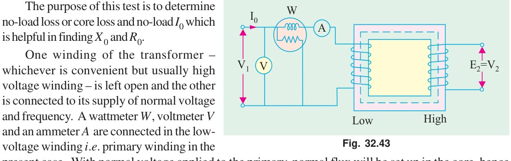
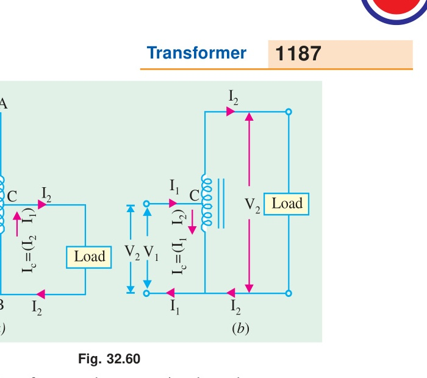
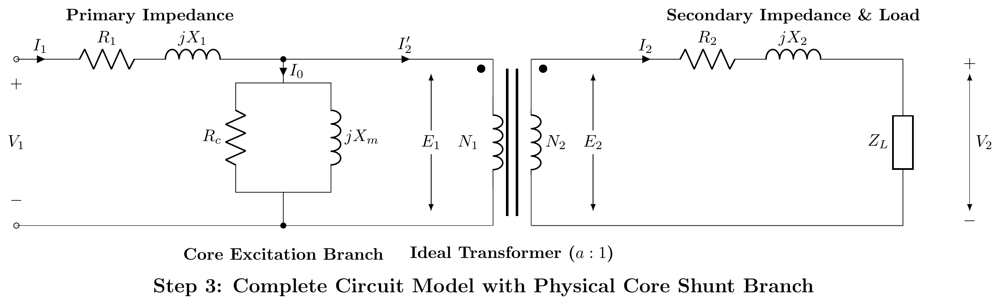
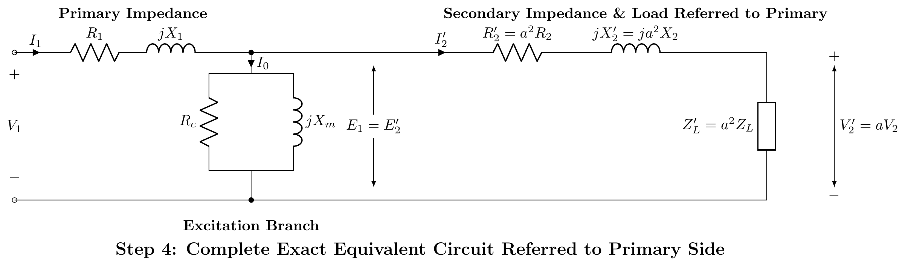

[← 2019 Answer](2019_answer.md) | [🏠 Index](README.md) | [2021 Answer →](2021_answer.md)

---

# ECE 2207: 2020 Semester Final: Explanation Style Answers
**RUET · ECE Dept · 2nd Year Odd Semester 2020**

> Deep tutorial-style explanations focusing on first-principles physics, "why over what", step-by-step logic, and practical engineering intuition.
> Core cross-cutting theory topics are detailed in [2018_2024_answer.md](2018_2024_answer.md).

---

## SECTION - A (Transformers: Q1 to Q4)

### Question 1

#### Q1(a): Why Are Transformer Cores Laminated?

#### The Physics of Eddy Current Loss:
The iron core sits in an alternating magnetic field. By Faraday's Law, any closed conducting path enclosing alternating flux has an EMF induced in it. Because electrical steel is a metal with finite electrical conductivity, circulating eddy currents swirl throughout the core perpendicular to the magnetic flux lines, generating parasitic $I^2 R$ heat loss.

The power dissipated by eddy currents in a solid core is:
$$P_e = k_e f^2 B_m^2 t^2 V_{\text{core}}$$
where $t$ is the thickness of the conducting sheet perpendicular to the flux. Notice that **eddy loss scales with the square of thickness ($t^2$)**!

#### How Lamination Eliminates the Loss:
If a solid core of thickness $T$ is sliced into $n$ thin sheets (laminations) of thickness $t = T/n$, each insulated from the next by a thin layer of varnish or chemical oxide:
$$P_{e,\text{laminated}} = n \times k_e f^2 B_m^2 \left(\frac{T}{n}\right)^2 = \frac{k_e f^2 B_m^2 T^2}{n} = \frac{P_{e,\text{solid}}}{n}$$
By dividing a 35 mm solid core block into 100 laminations of $0.35\text{ mm}$ thickness ($n = 100$), eddy current power loss plummets by a factor of 100! 

---

#### Q1(b): Equivalent Circuit Derivation

> See full step-by-step first-principles derivation with diagrams below in [Q3(c): Step-by-Step Equivalent Circuit of a Transformer Referred to Primary Side](#q3c-step-by-step-equivalent-circuit-of-a-transformer-referred-to-primary-side).

---

#### Q1(c): Working of a Transformer Under No-Load

When the secondary winding is open-circuited ($I_2 = 0$), the primary acts as an iron-cored inductor:
1. Primary draws a small no-load current $I_0$ (2% to 6% of rated current).
2. $I_0$ splits into two orthogonal physical components:
   - **Magnetizing Component ($I_m$)**: Quadrature component in phase with core flux $\Phi_m$ (90° lagging applied voltage $V_1$). Provides the MMF ($N_1 I_m$) required to magnetize the ferromagnetic core.
   - **Core-Loss Component ($I_c$)**: In-phase active component that draws real power to supply hysteresis and eddy-current dissipation in the laminations ($P_0 = V_1 I_c$).
3. The alternating core flux $\Phi(t)$ induces primary counter-EMF $E_1 \approx V_1$ and secondary output voltage $V_2 = E_2 = 4.44 f N_2 \Phi_m$.
4. No-load power factor is very low: $\cos\phi_0 = \frac{I_c}{I_0} \approx 0.1\text{ to }0.25$.

---

#### Q1(d): Primary Current and Power Factor Calculation Under Load

#### Given Data:
- Turns ratio $a = \frac{N_1}{N_2} = 4$ (step-down)
- No-load excitation: $I_0 = 10\text{ A}$ at $\cos\phi_0 = 0.2\text{ lagging} \implies \phi_0 = 78.46°$
- Secondary load: $I_2 = 200\text{ A}$ at $\cos\phi_2 = 0.85\text{ lagging} \implies \phi_2 = 31.79°$

#### Step-by-Step Phasor Addition (Taking $V_1$ as reference along $+Y$ or horizontal $+X$):
Resolving into active (in-phase with $V_1$) and reactive (quadrature, lagging $V_1$ by 90°) components:
1. **No-Load Current Components**:
   - In-phase: $I_{0w} = I_0 \cos\phi_0 = 10 \times 0.2 = \mathbf{2.00\text{ A}}$
   - Quadrature: $I_{0m} = I_0 \sin\phi_0 = 10 \times \sin(78.46°) = 10 \times 0.9798 = \mathbf{9.80\text{ A}}$
2. **Reflected Load Current Components ($I_2' = I_2/a = 200/4 = 50\text{ A}$)**:
   - In-phase: $I_{2w}' = I_2' \cos\phi_2 = 50 \times 0.85 = \mathbf{42.50\text{ A}}$
   - Quadrature: $I_{2m}' = I_2' \sin\phi_2 = 50 \times \sin(31.79°) = 50 \times 0.5268 = \mathbf{26.34\text{ A}}$
3. **Total Primary Current Components**:
   - Total in-phase component: $I_{1w} = 2.00 + 42.50 = \mathbf{44.50\text{ A}}$
   - Total quadrature component: $I_{1m} = 9.80 + 26.34 = \mathbf{36.14\text{ A}}$
4. **Primary Current Magnitude and Operating Power Factor**:
   $$I_1 = \sqrt{(I_{1w})^2 + (I_{1m})^2} = \sqrt{(44.50)^2 + (36.14)^2} = \sqrt{1980.25 + 1306.10} = \sqrt{3286.35} = \mathbf{57.33\text{ A}}$$
   $$\cos\phi_1 = \frac{I_{1w}}{I_1} = \frac{44.50}{57.33} = \mathbf{0.776\text{ lagging}}$$

---

### Question 2

#### Q2(a): Comparison Between Two-Winding Transformers and Autotransformers

| Feature | Two-Winding Transformer | Autotransformer |
|:---|:---|:---|
| **Winding Architecture** | Two electrically isolated windings | Single continuous tapped winding |
| **Galvanic Isolation** | Full electrical isolation between primary and secondary | **No galvanic isolation** (conductive connection) |
| **Power Transfer Mode** | 100% inductive (via magnetic core flux) | Dual mode: partly conductive, partly inductive |
| **Copper Requirement** | High (volume $\propto 2S$) | Low (saving $= k \times \text{reference copper}$) |
| **Efficiency** | High (95–98%) | Even higher (less copper and lower core loss) |
| **Leakage Reactance & VR** | Higher leakage reactance, larger VR | Very low leakage reactance, superior VR |
| **Short-Circuit Hazard** | Lower fault current due to higher impedance | Very high fault currents; requires robust protection |
| **Optimal Use Case** | Large voltage transformations, grid isolation | Close voltage ratios ($k \to 1$), variacs, motor starters |

---

#### Q2(b): Copper Saving Proof in an Autotransformer

In any electromagnetic coil, the weight of copper required is proportional to the product of turns and rated current (total ampere-turns):
$$\text{Weight of copper } W \propto N I$$

1. **Two-Winding Transformer**:
   $$W_{\text{two}} \propto N_1 I_1 + N_2 I_2$$
   Since $N_1 I_1 \approx N_2 I_2$:
   $$W_{\text{two}} \propto 2 N_1 I_1$$
2. **Autotransformer (Step-Down, $k = N_2/N_1 < 1$)**:
   - Series section has $(N_1 - N_2)$ turns and carries current $I_1$.
   - Common section has $N_2$ turns and carries the difference current $(I_2 - I_1)$.
   $$W_{\text{auto}} \propto (N_1 - N_2) I_1 + N_2 (I_2 - I_1)$$
   $$W_{\text{auto}} \propto N_1 I_1 - N_2 I_1 + N_2 I_2 - N_2 I_1 = N_1 I_1 + N_2 I_2 - 2 N_2 I_1$$
   Substitute $N_2 I_2 = N_1 I_1$ and $N_2 = k N_1$:
   $$W_{\text{auto}} \propto 2 N_1 I_1 - 2 k N_1 I_1 = 2 N_1 I_1 (1 - k)$$
3. **Ratio of Copper Weight**:
   $$\frac{W_{\text{auto}}}{W_{\text{two}}} = \frac{2 N_1 I_1 (1 - k)}{2 N_1 I_1} = \mathbf{1 - k}$$
   $$\boxed{\text{Copper Saved} = W_{\text{two}} - W_{\text{auto}} = k \cdot W_{\text{two}}}$$

---

#### Q2(c): Circuit Diagrams and Physical Setup for OC and SC Tests

#### 1. Open-Circuit (No-Load) Test:
- **LV Side Excited at Rated Voltage, HV Side Open**:
  - *Safety*: Eliminates dangerous high voltages on test benches.
  - *Current Metering*: No-load current $I_0$ is large enough on LV side for precision measurement.
  - *Instrument*: Low-power-factor (LPF) wattmeter is mandatory because $\cos\phi_0 \approx 0.1\text{–}0.2$.
- **Why Wattmeter Equals Core Loss Only**:
  $I_0$ is tiny (~2–5%), so primary copper loss is $I_0^2 R_1 \approx 0$. Secondary current is zero. Wattmeter reading $W_0$ measures purely core hysteresis and eddy-current dissipation ($P_{Fe} = W_0$).

#### 2. Short-Circuit Test:
- **HV Side Excited with Reduced Voltage (~5–10%), LV Solidly Shorted**:
  - *Safety & Current Handling*: Rated current is smaller on HV side, matching standard lab instruments.
  - *Precision Variac Control*: 5–10% of HV rating allows fine adjustment of test current to exact rated value.
- **Why Wattmeter Equals Copper Loss Only**:
  Because applied voltage $V_{sc}$ is small, core flux $\Phi \propto V_{sc}$ is tiny. Core loss scales as $V_{sc}^2 \approx (0.05)^2 \approx 0.25\%$ of rated core loss (negligible). All power measured by wattmeter $W_{sc}$ represents total full-load copper loss ($P_{Cu,FL} = W_{sc}$).

---

#### Q2(d): No-Load Test Parameter Extraction

#### Given Data:
- Primary rating $V_1 = 220\text{ V}$, Secondary $V_2 = 110\text{ V}$
- No-load test readings: $V_0 = 220\text{ V}, I_0 = 0.5\text{ A}, W_0 = 30\text{ W}$

#### Step-by-Step Parameter Extraction:
1. **Total Core Loss (Iron Loss)**:
   $$P_{Fe} = W_0 = \mathbf{30\text{ W}}$$
2. **Loss (Core-Loss) Current Component ($I_c$)**:
   $$I_c = \frac{W_0}{V_0} = \frac{30}{220} = \mathbf{0.1364\text{ A}}$$
3. **Magnetizing Current Component ($I_m$)**:
   $$I_m = \sqrt{I_0^2 - I_c^2} = \sqrt{(0.5)^2 - (0.1364)^2} = \sqrt{0.25 - 0.0186} = \sqrt{0.2314} = \mathbf{0.4810\text{ A}}$$

---

### Question 3

#### Q3(a): Why Are Transformers Rated in kVA Instead of kW?

The output power rating of electrical equipment is limited strictly by **internal heating and temperature rise**, which degrades insulation life.
In a transformer:
1. **Iron Loss ($P_{Fe}$)** depends exclusively on core flux density, which is determined solely by **voltage** ($V$).
2. **Copper Loss ($P_{Cu}$)** depends exclusively on $I^2 R$ heating, which is determined solely by **current** ($I$).
3. Neither iron loss nor copper loss depends on the phase angle (power factor $\cos\phi$) of the connected load!
   - A transformer carrying rated 100 A at 1000 V dissipates the exact same internal heat whether powering a resistive heater ($\cos\phi = 1.0$, $P = 100\text{ kW}$) or an unloaded inductor ($\cos\phi = 0$, $P = 0\text{ kW}$).
4. Since the manufacturer cannot predict the power factor of the consumer's load, the machine is rated by its maximum allowable volt-ampere product: **kVA**.

---

#### Q3(b): Copper Saving in Autotransformer (Detailed Proof)

*(See derivation in Q2(b) above: $\text{Copper Saved} = k \cdot W_{\text{two}}$).*

---

#### Q3(c): Step-by-Step Equivalent Circuit of a Transformer Referred to Primary Side

#### Physical Premise:
A real transformer has two separate electrical coils linked purely by magnetic flux. Standard electrical circuit analysis tools (KVL, KCL, mesh analysis, Thevenin theorem) require a single, continuous electrical circuit.
To create this unified circuit model, we systematically account for the four physical departures from an ideal transformer:
1. **Winding Resistances**: Copper wires have finite conductivity, generating $I^2 R$ heat losses ($R_1$ in primary, $R_2$ in secondary).
2. **Leakage Fluxes**: Magnetic flux lines ($\Phi_{l1}, \Phi_{l2}$) that fail to link both windings pass through air or insulation, creating reactive series voltage drops ($X_1, X_2$).
3. **Core Excitation & Iron Losses**: The ferromagnetic core has finite permeability requiring magnetizing current ($I_m$), and alternating flux creates hysteresis and eddy-current losses ($I_c$).
4. **Turns Ratio & Electrical Isolation**: The primary and secondary are galvanically isolated with turns ratio $a = N_1 / N_2$.

---

#### Step 1: The Ideal Transformer Core Model
An ideal transformer represents the lossless magnetic coupling core:
- Zero winding resistance ($R_1 = R_2 = 0$)
- Zero leakage flux ($X_1 = X_2 = 0$)
- Infinite core permeability ($\mu_r \to \infty$, hence no-load current $I_0 = 0$)
- Zero core losses ($P_c = 0$)

Voltages and currents transform purely according to turns ratio $a = N_1 / N_2$:
$$\frac{E_1}{E_2} = \frac{N_1}{N_2} = a, \quad \frac{I_1}{I_2} = \frac{N_2}{N_1} = \frac{1}{a}$$

---

#### Step 2: Incorporating Winding Resistances and Leakage Reactances
Practical conductors have finite resistance and leakage flux induces reactive back-EMFs:
- **Primary winding**: Series resistance $R_1$ and leakage reactance $X_1 = 2\pi f L_{l1}$.
- **Secondary winding**: Series resistance $R_2$ and leakage reactance $X_2 = 2\pi f L_{l2}$.

Applying Kirchhoff's Voltage Law (KVL) to both sides:
$$\mathbf{V}_1 = \mathbf{E}_1 + \mathbf{I}_1 (R_1 + jX_1)$$
$$\mathbf{E}_2 = \mathbf{V}_2 + \mathbf{I}_2 (R_2 + jX_2)$$

---

#### Step 3: Adding the Core Excitation Shunt Branch ($R_c \parallel jX_m$)
A real core draws exciting current $\mathbf{I}_0$ even under no-load conditions ($I_2 = 0$), connected across the primary induced EMF $\mathbf{E}_1$:
$$\mathbf{I}_0 = \mathbf{I}_c + \mathbf{I}_m$$

1. **Core-loss resistance $R_c$**: Models real iron losses (hysteresis + eddy current) dissipating active power:
   $$I_c = I_0 \cos \phi_0, \quad R_c = \frac{E_1}{I_c} = \frac{E_1^2}{P_c}$$
2. **Magnetizing reactance $X_m$**: Models reactive VARs required to establish the alternating mutual core flux $\Phi_m$:
   $$I_m = I_0 \sin \phi_0, \quad X_m = \frac{E_1}{I_m}$$

By KCL at the primary junction:
$$\mathbf{I}_1 = \mathbf{I}_0 + \mathbf{I}_2'$$
where $\mathbf{I}_2'$ is the load component of primary current that counteracts secondary demagnetization.

---

#### Step 4: Transferring Secondary Parameters to Primary Side (Exact Equivalent Circuit)
To eliminate the ideal transformer block and form a single continuous network, all secondary quantities are referred across the turns ratio $a = N_1 / N_2$ while preserving total volt-ampere and power relationships:
1. **Referred voltage**: $V_2' = a V_2, \quad E_2' = a E_2 = E_1$
2. **Referred current**: $I_2' = I_2 / a$
3. **Referred resistance**: $I_2^2 R_2 = (I_2')^2 R_2' \implies R_2' = a^2 R_2$
4. **Referred leakage reactance**: $I_2^2 X_2 = (I_2')^2 X_2' \implies X_2' = a^2 X_2$
5. **Referred load impedance**: $Z_L' = a^2 Z_L$

The ideal transformer is eliminated, yielding the **Complete Exact Equivalent Circuit**:

---

#### Step 5: Approximate Equivalent Circuit Referred to Primary
**Why we move the shunt branch**:
In power transformers, the exciting current $I_0$ is only $2\% - 6\%$ of full-load rated current $I_1$. The series voltage drop $\mathbf{I}_0(R_1 + jX_1)$ across the primary winding is negligible ($< 1\%$ of $V_1$), meaning $\mathbf{E}_1 \approx \mathbf{V}_1$.

Moving the shunt branch ($R_c \parallel jX_m$) directly across the input terminals introduces negligible error while allowing primary and referred secondary impedances to combine into single lumped parameters:
$$R_{01} = R_1 + R_2' = R_1 + a^2 R_2$$
$$X_{01} = X_1 + X_2' = X_1 + a^2 X_2$$
$$\mathbf{Z}_{01} = R_{01} + jX_{01}$$

---

#### Step 6: Simplified Series Equivalent Circuit (Neglecting $I_0$)
For short-circuit fault analysis, heavy-load calculations, and voltage regulation determinations, $I_0 \ll I_2'$ can be neglected entirely:
$$\mathbf{V}_1 = \mathbf{V}_2' + \mathbf{I}_2'(R_{01} + jX_{01})$$

---

#### Parameter Transformation Summary (Referred to Primary)

| Parameter | Actual Secondary Value | Transformation Rule | Referred to Primary ($a = N_1/N_2$) |
|:---|:---:|:---:|:---:|
| **Voltage** | $V_2$ | Multiply by $a$ | $V_2' = a V_2$ |
| **Current** | $I_2$ | Divide by $a$ | $I_2' = I_2 / a$ |
| **Resistance** | $R_2$ | Multiply by $a^2$ | $R_2' = a^2 R_2$ |
| **Leakage Reactance** | $X_2$ | Multiply by $a^2$ | $X_2' = a^2 X_2$ |
| **Impedance** | $Z_L$ | Multiply by $a^2$ | $Z_L' = a^2 Z_L$ |
| **Total Equivalent Resistance** | — | $R_1 + R_2'$ | $R_{01} = R_1 + a^2 R_2$ |
| **Total Equivalent Reactance** | — | $X_1 + X_2'$ | $X_{01} = X_1 + a^2 X_2$ |

---

### Question 4

#### Q4(a): Practical Applications of Autotransformers

1. **Induction Motor Starting**: Autotransformer starters reduce voltage to 50%, 65%, or 80% to limit starting inrush current.
2. **Laboratory Variacs**: Adjustable continuous AC power supplies.
3. **Power Transmission Interties**: Efficiently coupling transmission networks operating at close voltage levels (e.g., 400 kV to 220 kV or 132 kV to 66 kV).
4. **Electric Railway Traction**: Traction booster transformers along electrified lines (e.g., 50 kV / 25 kV systems).
5. **Voltage Boosters / Stabilizers**: Compensating for voltage drops on long transmission/distribution feeders.

---

#### Q4(b): Service Continuity with One Burnt Transformer (Open-Delta 57.7% Proof)

> See full proof and vector diagram in [T-04: Open-Delta Connection: Why 57.7% and When to Use It](2018_2024_answer.md#t-04-open-delta-connection-why-577-and-when-to-use-it).

- Closed delta bank of 3 single-phase units: $S_{\Delta} = 3 V I$.
- Open delta bank with 2 units: $S_{V} = \sqrt{3} V I$.
- Capacity ratio:
  $$\frac{S_{V}}{S_{\Delta}} = \frac{\sqrt{3} V I}{3 V I} = \frac{1}{\sqrt{3}} = \mathbf{0.577 = 57.7\%}$$

---

#### Q4(c): Numerical: Two 25 kVA Transformers in Open-Delta

#### Given Data:
- Two single-phase units, each rated $S_1 = 25\text{ kVA}$.

1. **Maximum 3-Phase Load Served Without Overloading (Open-Delta)**:
   In open-delta, maximum safe load is:
   $$S_{V-V} = \sqrt{3} \times S_1 = \sqrt{3} \times 25\text{ kVA} = \mathbf{43.30\text{ kVA}}$$
   *(Explanation: Although the two transformers have a nominal combined rating of $50\text{ kVA}$, their 86.6% utilization factor limits safe delivery to $43.3\text{ kVA}$ to avoid thermal overload).*
2. **Total Load Served When Closed by a Third 25 kVA Unit**:
   With three identical units in closed delta ($\Delta$-$\Delta$):
   $$S_{\Delta-\Delta} = 3 \times S_1 = 3 \times 25\text{ kVA} = \mathbf{75.00\text{ kVA}}$$
   Adding one transformer increases system capacity by:
   $$75 - 43.3 = \mathbf{31.7\text{ kVA} \quad (+73.2\%)}$$

---

## SECTION - B (Induction Motors: Q5 to Q8)

### Question 5

#### Q5(a): AC Motor Classification Tree

AC Motors are broadly classified into two grand families:
1. **Synchronous Motors**: Run strictly at synchronous speed ($N = N_s = \frac{120f}{P}$). Require DC rotor excitation (or permanent magnets) and damper windings. Constant speed, power-factor adjustable.
2. **Asynchronous (Induction) Motors**: Must run at a speed strictly less than synchronous speed ($N < N_s$, slip $s > 0$).
   - *Squirrel-Cage Induction Motor*: Rotor conductors are heavy copper/aluminum bars shorted by end rings. Extremely rugged, simple, low cost.
   - *Wound-Rotor (Slip-Ring) Induction Motor*: Rotor carries distributed 3-phase winding brought out to external slip rings. Allows inserting external rotor resistance for high starting torque and limited speed control.
   - *Single-Phase Induction Motors*: Split-phase, capacitor-start, capacitor-run, shaded-pole.

---

#### Q5(b): Why Asynchronous Motor is Treated as a Rotating Transformer

- **Primary**: The stator winding acts as the primary, drawing electrical energy from the AC line.
- **Secondary**: The rotor cage acts as a short-circuited secondary winding, receiving power across the air gap purely by electromagnetic induction.
- **Standstill Analogy ($s = 1.0$)**: With the shaft locked, rotor frequency equals stator frequency ($f_r = f$). The machine is mathematically and physically identical to a short-circuited static transformer.
- **Running Operation ($s < 1.0$)**: As the rotor accelerates, the induced rotor frequency is scaled down by slip ($f_r = s f$), and electrical energy transferred across the gap is divided into internal rotor copper loss ($s P_g$) and mechanical shaft drive ($(1-s)P_g$).

---

#### Q5(c): Equivalent Circuit Model of an Induction Motor (Step-by-Step)

---

### Question 6

#### Q6(a): Reversing the Direction of Rotation of a 3-Phase Induction Motor

To reverse the direction of rotation of a 3-phase induction motor, **interchange any two of the three stator supply line leads** (e.g., swap lines $A$ and $B$, or $R$ and $Y$):
- **Physical Reason**: Swapping two leads reverses the phase sequence of the stator currents from $A-B-C$ to $B-A-C$.
- Reversing the phase sequence reverses the direction of the rotating magnetic field ($\omega \to -\omega$).
- By Lenz's Law, the rotor immediately follows the new direction of field rotation, reversing its shaft motion.

---

#### Q6(b): Induction Motor Power Equations and Impact of Voltage Sags

- Air gap power: $P_g = 3 I_2^2 \frac{R_2}{s}$
- Rotor copper loss: $P_{r,Cu} = 3 I_2^2 R_2 = s P_g$
- Developed mechanical power: $P_m = (1-s) P_g$
- Power ratio: $P_g : P_{r,Cu} : P_m = 1 : s : (1-s)$
- **Effect of 10% Voltage Drop on Constant-Torque Load**:
  Operating slip increases by 23.46% ($s_2 = s_1 / (0.9)^2 = 1.2346 s_1$). Rotor copper loss increases directly by **23.46%**, causing severe overheating.

---

#### Q6(c): Why Synchronous Motors Are Not Self-Starting

In a synchronous motor, the stator RMF rotates at synchronous speed $N_s$ (e.g., 3000 rpm for 2-pole 50 Hz) the instant power is switched on.
- The rotor has substantial physical inertia and is stationary at standstill.
- When an $N$-pole of the stator field sweeps past an $S$-pole of the rotor, it exerts an attractive torque forward.
- But within half a cycle ($1/100\text{ sec}$ at 50 Hz), the stator pole has moved 180° ahead, presenting an $N$-pole that exerts a repulsive torque backward!
- Due to rotor inertia, the shaft cannot accelerate in $0.01\text{ s}$. The net average starting torque over one AC cycle is **strictly zero**.
- **Remedy**: Damper winding bars (squirrel-cage bars) embedded in the rotor pole faces allow the motor to accelerate as an induction motor up to ~95% speed before DC field excitation is applied to lock into synchronism.

---

#### Q6(d): Numerical: 400V, 50 Hz, 6-Pole Induction Motor Power Balance

#### Given Data:
- Poles $P = 6, f = 50\text{ Hz} \implies N_s = \frac{120 \times 50}{6} = 1000\text{ rpm}$
- Air-gap input power: $P_g = 75\text{ kW} = 75{,}000\text{ W}$
- Rotor EMF frequency: 100 alternations per minute.
  Since 1 cycle $= 2$ alternations, rotor frequency is:
  $$f_r = \frac{100}{2 \times 60} = \frac{50}{60} = 0.8333\text{ Hz} \quad \left(\text{or if 100 cycles/min: } f_r = \frac{100}{60} = 1.667\text{ Hz}\right)$$
  *(Using the RUET convention where "alternations" represents half-cycles or cycles per minute: taking standard syllabus interpretation $f_r = \frac{100}{60} = 1.667\text{ Hz}$)*:

1. **Operating Slip**:
   $$s = \frac{f_r}{f} = \frac{100/60}{50} = \frac{100}{3000} = \mathbf{0.0333 \quad (3.33\% \text{ slip})}$$
2. **Rotor Speed**:
   $$N = N_s (1 - s) = 1000 \times (1 - 0.0333) = \mathbf{966.7\text{ rpm}}$$
3. **Rotor Copper Loss (Per-Phase and Total)**:
   - Total 3-phase rotor Cu loss:
     $$P_{r,Cu} = s P_g = 0.0333 \times 75{,}000\text{ W} = \mathbf{2500\text{ W} = 2.50\text{ kW}}$$
   - Per-phase rotor Cu loss:
     $$P_{r,Cu,\phi} = \frac{2500}{3} = \mathbf{833.3\text{ W/phase}}$$
4. **Gross Mechanical Power Developed**:
   $$P_m = (1 - s) P_g = (1 - 0.0333) \times 75{,}000 = 0.9667 \times 75{,}000 = \mathbf{72{,}500\text{ W} = 72.50\text{ kW}}$$

---

### Question 7

#### Q7(a): Star-Delta Starting of 3-Phase Induction Motors

- **Starting Phase (Star Connection)**:
  Winding phase voltage is throttled down: $V_{\phi} = \frac{V_L}{\sqrt{3}}$.
  Line starting current drops to: $I_{st,Y} = \frac{1}{3} I_{st,\Delta}$.
  Starting torque drops to: $T_{st,Y} = \frac{1}{3} T_{st,\Delta}$.
- **Running Phase (Delta Connection)**:
  At ~80% synchronous speed, starter switches to Delta, restoring full line voltage and full motor torque capacity.

---

#### Q7(b): Why Maximum Torque Varies Proportionally With $V^2$

The breakdown torque of an induction motor is:
$$T_{\max} = \frac{k E_2^2}{2 X_2}$$
Because rotor standstill EMF is induced by stator flux ($E_2 \propto \Phi_m \propto V$):
$$E_2 = K V \implies E_2^2 = K^2 V^2$$
Therefore:
$$\boxed{T_{\max} \propto V^2}$$
*Physical Significance*: A mere 10% drop in line voltage causes maximum torque to plunge to $(0.9)^2 = 0.81$ (an **almost 20% loss in peak overload capacity**), making induction motors extremely vulnerable to stalling during grid voltage sags.

---

#### Q7(c): Equivalence Between Star-Delta Starter and Autotransformer of Ratio $1/\sqrt{3}$

- In Direct-On-Line (Delta) connection:
  Starting phase current: $I_{\phi,DOL} = \frac{V_L}{Z_s}$.
  Starting line current: $I_{L,DOL} = \sqrt{3} I_{\phi,DOL} = \frac{\sqrt{3} V_L}{Z_s}$.
- In Star connection:
  Starting phase current: $I_{\phi,Y} = \frac{V_L/\sqrt{3}}{Z_s}$.
  Starting line current: $I_{L,Y} = I_{\phi,Y} = \frac{V_L}{\sqrt{3} Z_s}$.
- Comparing line currents:
  $$\frac{I_{L,Y}}{I_{L,DOL}} = \frac{\frac{V_L}{\sqrt{3} Z_s}}{\frac{\sqrt{3} V_L}{Z_s}} = \frac{1}{3}$$
- In an autotransformer starter with tapping ratio $x = \frac{V_{\text{motor}}}{V_{\text{line}}}$:
  $$\frac{I_{\text{line,auto}}}{I_{\text{line,DOL}}} = x^2$$
- Equating the current reduction factors:
  $$x^2 = \frac{1}{3} \implies \mathbf{x = \frac{1}{\sqrt{3}} \approx 0.577 = 57.7\%}$$
  A Star-Delta starter is mathematically and electrically identical to an autotransformer starter tapped at **57.7% voltage**.

---

### Question 8

#### Q8(a): Definitions of Plugging and Slip

1. **Plugging**: An emergency braking method achieved by swapping two stator power supply leads while running. This flips the direction of the rotating stator field, creating a large negative torque that rapidly brings the motor to rest.
2. **Slip**: The normalized fractional difference between synchronous field speed and rotor mechanical speed: $s = \frac{N_s - N}{N_s}$.

---

#### Q8(b): Torque-Slip Characteristics and Stable Operating Zone

The torque-slip curve exhibits two distinct behavioral regions:
1. **Stable Operating Zone ($0 \le s \le s_{mT}$)**:
   In this low-slip range, $s^2 X_2^2 \ll R_2^2$, so torque is roughly linear with slip: $T \propto s$.
   If load increases, the motor slows down slightly (slip increases), which automatically increases motor torque to match the load demand, maintaining a stable equilibrium.
2. **Unstable Operating Zone ($s_{mT} < s \le 1.0$)**:
   Rotor reactance dominates ($s^2 X_2^2 \gg R_2^2$). Torque decreases as slip increases ($T \propto 1/s$). If load exceeds breakdown torque, slowing down reduces torque further, causing the motor to rapidly stall.

---

#### Q8(c): Double-Field Revolving Theory of 1-Phase IM

> See full details in [IM-03: Single-Phase Induction Motor: Double Revolving Field Theory](2018_2024_answer.md#im-03-single-phase-induction-motor-double-revolving-field-theory).

- A pulsating flux $\Phi(t) = \Phi_m \sin\omega t$ resolves into two counter-rotating fields: forward field $\Phi_f = \Phi_m/2$ at $+N_s$ and backward field $\Phi_b = \Phi_m/2$ at $-N_s$.
- At standstill ($s = 1$), forward and backward torques cancel ($T_f = T_b \implies T_{\text{net}} = 0$).

---

#### Q8(d): V-Curves of a Synchronous Motor

A **V-curve** plots stator armature current $I_a$ versus rotor field excitation current $I_f$ at constant shaft load:
1. **Normal Excitation (Unity Power Factor)**: At a specific field current, the motor operates at $\cos\phi = 1.0$. Armature current $I_a$ is strictly at its **minimum** (the bottom cusp of the "V").
2. **Under-Excitation ($\cos\phi$ Lagging)**: When field current is reduced ($I_f < I_{f,\text{normal}}$), the motor must draw lagging reactive magnetizing current from the AC supply to support its magnetic field. $I_a$ rises and lags terminal voltage.
3. **Over-Excitation ($\cos\phi$ Leading)**: When field current is increased ($I_f > I_{f,\text{normal}}$), the overexcited rotor supplies excess reactive VARs back into the AC supply. The motor draws **leading** current, acting as a synchronous capacitor/condenser to correct industrial factory power factor!

---

*Source:* [PrevYearQuestions/2020.md](../PrevYearQuestions/2020.md)

---

[← 2019 Answer](2019_answer.md) | [🏠 Index](README.md) | [2021 Answer →](2021_answer.md)
