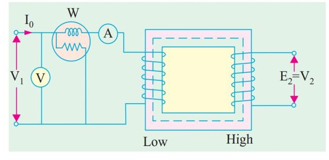
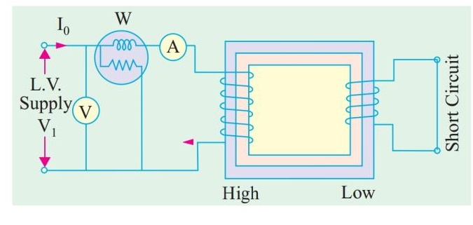
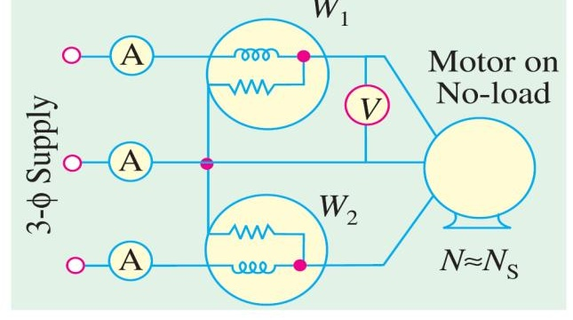
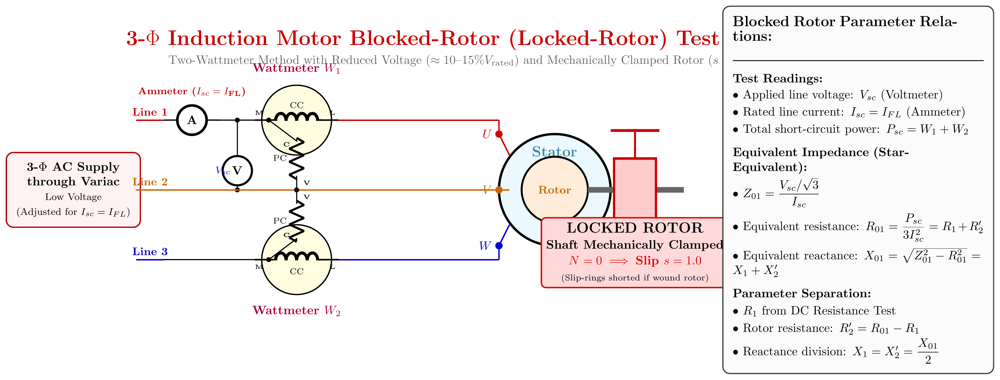
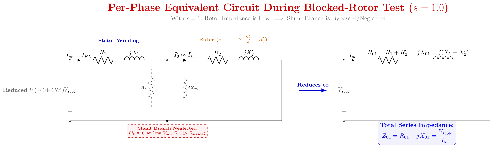
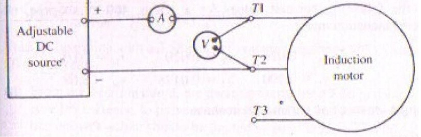

# ECE 2207: 2023 Semester Final: Explanation Style Answers
**RUET · ECE Dept · 2nd Year Even Semester (Session 2022-23)**

> Deep tutorial-style explanations focusing on first-principles physics, "why over what", step-by-step logic, and practical engineering intuition.
> Core cross-cutting theory topics are detailed in [2018_2024_answer.md](2018_2024_answer.md).

---

## Question 1

### Q1(a): Transformer Definition and Variable Identification

#### What is a transformer physically?
A transformer is a static, stationary electromagnetic machine that transfers AC electrical energy between two or more electrically isolated circuits through magnetic flux linkage. It operates strictly at constant frequency ($f_1 = f_2$), converting alternating voltage and current levels inversely: stepping up voltage while stepping down current, or vice versa, such that apparent power ($S = V I$) is conserved.

#### Physical role of variables:
- **$v_1(t), V_1$ (Applied Primary Terminal Voltage)**: Provides the electrical driving potential that forces primary excitation current into winding $N_1$.
- **$e_1(t), E_1$ (Primary Counter-EMF)**: Self-induced in $N_1$ turns by the alternating mutual core flux $\Phi(t)$. In accordance with Lenz's law, $e_1$ directly opposes $V_1$, acting as an automatic self-governor that throttles primary current to only what is needed by the core and load.
- **$\Phi(t) = \Phi_m \sin\omega t$ (Mutual Core Flux)**: The magnetic vehicle connecting primary and secondary. Established within the laminated silicon-steel core, it links all turns of both windings with minimal reluctance.
- **$e_2(t), E_2$ (Secondary Induced EMF)**: Mutually induced in winding $N_2$ by the same core flux. The induced EMF per turn is strictly equal in both coils: $\frac{E_1}{N_1} = \frac{E_2}{N_2} = 4.44 f \Phi_m$.
- **$v_2(t), V_2$ (Secondary Output Terminal Voltage)**: The potential available across load terminals. Under load, $V_2 = E_2 - I_2 Z_2$, dropping slightly below $E_2$ due to internal winding resistance and leakage reactance.
- **$i_2(t), I_2$ (Secondary Load Current)**: Driven through load impedance $Z_L$. Its magnitude and phase angle $\phi_2$ are dictated entirely by the load.
- **$K = \frac{N_2}{N_1} = \frac{E_2}{E_1}$ (Transformation Ratio)**: The turns ratio determining whether the machine steps up ($K > 1$) or steps down ($K < 1$) voltage.

---

### Q1(b): Proof of the Transformer EMF Equation

> For the comprehensive derivation, physical picture, and design implications see [T-01: EMF Equation: $E = 4.44 f N \Phi_m$](2018_2024_answer.md#t-01-emf-equation-e--444-f-n-phi_m-full-derivation-and-intuition).

#### Physical Summary:
- When a sinusoidal voltage is impressed across the primary, it establishes a sinusoidal mutual flux $\Phi(t) = \Phi_m \sin\omega t$.
- By Faraday's Law of Induction, the instantaneous EMF induced in any winding of $N$ turns is $e(t) = -N \frac{d\Phi}{dt} = -N \omega \Phi_m \cos\omega t = N (2\pi f) \Phi_m \sin(\omega t - 90°)$.
- The peak induced EMF is $E_m = 2\pi f N \Phi_m$.
- Because the induced EMF is purely sinusoidal, its root-mean-square (RMS) value is:
  $$E = \frac{E_m}{\sqrt{2}} = \frac{2\pi f N \Phi_m}{\sqrt{2}} = \sqrt{2}\pi f N \Phi_m \approx 4.44 f N \Phi_m$$
- Both primary and secondary share the exact same flux, so:
  $$\boxed{E_1 = 4.44 f N_1 \Phi_m, \qquad E_2 = 4.44 f N_2 \Phi_m}$$

---

## Question 2

### Q2(a): All-Day Efficiency of Distribution Transformers

> For full theoretical background see [T-03: Efficiency and All-Day Efficiency](2018_2024_answer.md#t-03-efficiency-and-all-day-efficiency).

#### Why Ordinary Efficiency Fails for Distribution Transformers:
- An ordinary commercial efficiency is defined on instantaneous power: $\eta = \frac{P_{\text{out}}}{P_{\text{in}}}$.
- Distribution transformers remain energized 24 hours a day to supply residential and commercial consumers, but their load varies wildly throughout the day: heavy during evening peak hours, moderate during daytime, and almost zero in the middle of the night.
- **Iron loss ($P_i$)** occurs continuously for all 24 hours as long as the transformer is plugged into the grid, regardless of load.
- **Copper loss ($P_{Cu}$)** occurs only when load current flows, scaling with the square of the load fraction: $P_{Cu}(x) = x^2 P_{Cu,FL}$.
- Therefore, performance must be evaluated based on **total energy delivered vs total energy consumed over 24 hours**:
  $$\eta_{\text{all-day}} = \frac{\text{Energy Output (kWh in 24 hours)}}{\text{Energy Input (kWh in 24 hours)}} \times 100\%$$

#### Numerical Walkthrough:
Given: $S = 100\text{ kVA}$, Iron loss $P_i = 1\text{ kW}$, Full-load copper loss $P_{Cu,FL} = 1\text{ kW}$.
Daily Load Cycle (assuming unity power factor for simplicity):
1. **Energy Output Calculation**:
   - 4 hours at No-load ($x = 0$): $0\text{ kW} \times 4\text{ h} = 0\text{ kWh}$
   - 12 hours at Half-load ($x = 0.5$): $(0.5 \times 100\text{ kW}) \times 12\text{ h} = 50 \times 12 = 600\text{ kWh}$
   - 8 hours at Full-load ($x = 1.0$): $(1.0 \times 100\text{ kW}) \times 8\text{ h} = 100 \times 8 = 800\text{ kWh}$
   - **Total Energy Output** $= 0 + 600 + 800 = \mathbf{1400\text{ kWh}}$
2. **Energy Lost in Iron (24 hours constant)**:
   $$W_{Fe} = P_i \times 24\text{ h} = 1\text{ kW} \times 24\text{ h} = \mathbf{24\text{ kWh}}$$
3. **Energy Lost in Copper (Load-dependent)**:
   - 4 hours at No-load: $0^2 \times 1\text{ kW} \times 4\text{ h} = 0\text{ kWh}$
   - 12 hours at Half-load: $(0.5)^2 \times 1\text{ kW} \times 12\text{ h} = 0.25 \times 12 = 3\text{ kWh}$
   - 8 hours at Full-load: $(1.0)^2 \times 1\text{ kW} \times 8\text{ h} = 1.0 \times 8 = 8\text{ kWh}$
   - **Total Copper Loss Energy** $= 0 + 3 + 8 = \mathbf{11\text{ kWh}}$
4. **Total Losses & All-Day Efficiency**:
   $$W_{\text{loss}} = W_{Fe} + W_{Cu} = 24 + 11 = 35\text{ kWh}$$
   $$W_{\text{in}} = W_{\text{out}} + W_{\text{loss}} = 1400 + 35 = 1435\text{ kWh}$$
   $$\eta_{\text{all-day}} = \frac{1400}{1435} \times 100\% = \mathbf{97.56\%}$$

*Design Rule:* Distribution transformers are deliberately engineered with small core cross-sections and high-grade silicon steel to minimize 24-hour iron loss, achieving maximum efficiency at 50% to 70% load rather than at full load.

---

### Q2(b): Equivalent Circuit Parameters Referred to Secondary

#### Physical Setup and Data Interpretation:
- Rating: $2.2\text{ kV} / 220\text{ V} \implies V_1 = 2200\text{ V}, V_2 = 220\text{ V}$.
- Turns ratio: $a = \frac{2200}{220} = 10$.
- **OC Test**: Conducted on the **Secondary (LV) side** ($220\text{ V}$) with primary open.
  Readings: $V_0 = 220\text{ V}, I_0 = 0.8\text{ A}, W_0 = 80\text{ W}$.
- **SC Test**: Conducted on the **Secondary side** with primary short-circuited.
  Readings: $V_{sc} = 12\text{ V}, I_{sc} = 10\text{ A}, W_{sc} = 40\text{ W}$.

Notice: Because both tests were measured on the secondary side, all calculations directly produce secondary-referred parameters without needing $a^2$ conversions!

#### 1. Shunt Parameters (Core Branch) from OC Test:
- No-load power factor:
  $$\cos\phi_0 = \frac{W_0}{V_0 I_0} = \frac{80}{220 \times 0.8} = \frac{80}{176} = 0.4545$$
- Core-loss current:
  $$I_c = I_0 \cos\phi_0 = 0.8 \times 0.4545 = 0.3636\text{ A}$$
- Magnetizing current:
  $$I_m = \sqrt{I_0^2 - I_c^2} = \sqrt{0.8^2 - 0.3636^2} = \sqrt{0.64 - 0.1322} = \sqrt{0.5078} = 0.7126\text{ A}$$
- Shunt resistance and reactance referred to secondary:
  $$R_{c2} = \frac{V_0}{I_c} = \frac{220}{0.3636} = \mathbf{604.4\,\Omega}$$
  $$X_{m2} = \frac{V_0}{I_m} = \frac{220}{0.7126} = \mathbf{308.7\,\Omega}$$

#### 2. Series Parameters (Winding Branch) from SC Test:
- Total equivalent resistance referred to secondary:
  $$R_{02} = \frac{W_{sc}}{I_{sc}^2} = \frac{40}{10^2} = \mathbf{0.40\,\Omega}$$
- Total equivalent impedance referred to secondary:
  $$Z_{02} = \frac{V_{sc}}{I_{sc}} = \frac{12}{10} = \mathbf{1.20\,\Omega}$$
- Total equivalent leakage reactance referred to secondary:
  $$X_{02} = \sqrt{Z_{02}^2 - R_{02}^2} = \sqrt{1.2^2 - 0.4^2} = \sqrt{1.44 - 0.16} = \sqrt{1.28} = \mathbf{1.131\,\Omega}$$

#### Summary:
The per-phase equivalent circuit referred to the secondary consists of:
- Shunt branch across secondary terminals: $R_{c2} = 604.4\,\Omega$ in parallel with $X_{m2} = 308.7\,\Omega$.
- Series branch in line with load: $R_{02} = 0.40\,\Omega$ in series with $X_{02} = 1.131\,\Omega$.

---

## Question 3

### Q3(a): Voltage Regulation Derivation and Phasor Diagrams

#### Physical Meaning of Voltage Regulation:
When an electrical load is connected to a transformer, current $I_2$ flows through the windings. Because windings possess resistance $R_{02}$ and leakage reactance $X_{02}$, internal voltage drops occur:
- An ohmic resistance drop $I_2 R_{02}$ in phase with current.
- An inductive leakage reactance drop $j I_2 X_{02}$ leading current by 90°.

Voltage Regulation (VR) measures the percentage change in secondary terminal voltage when rated full-load is thrown off while primary voltage remains fixed:
$$\text{VR\%} = \frac{V_{2,\text{no-load}} - V_{2,\text{full-load}}}{V_{2,\text{rated}}} \times 100\% = \frac{E_2 - V_2}{V_2} \times 100\%$$

#### Derivation of the Approximate Formula:
Referring all quantities to the secondary side, the no-load EMF $\vec{E}_2$ is related to terminal voltage $\vec{V}_2$ and load current $\vec{I}_2$ by KVL:
$$\vec{E}_2 = \vec{V}_2 + \vec{I}_2 R_{02} + j \vec{I}_2 X_{02}$$

Taking secondary terminal voltage $\vec{V}_2 = V_2 \angle 0°$ as reference phasor:
- For a **lagging** load at power factor $\cos\phi_2$, current lags voltage: $\vec{I}_2 = I_2 \angle -\phi_2 = I_2 (\cos\phi_2 - j\sin\phi_2)$.
- Expanding $\vec{E}_2$:
  $$\vec{E}_2 = V_2 + I_2(\cos\phi_2 - j\sin\phi_2)(R_{02} + jX_{02})$$
  $$\vec{E}_2 = (V_2 + I_2 R_{02}\cos\phi_2 + I_2 X_{02}\sin\phi_2) + j(I_2 X_{02}\cos\phi_2 - I_2 R_{02}\sin\phi_2)$$
- In practice, internal voltage drops are only a small fraction (2–5%) of rated voltage. The imaginary (quadrature) component is negligible compared to the real (in-phase) component:
  $$E_2 \approx V_2 + I_2 R_{02}\cos\phi_2 + I_2 X_{02}\sin\phi_2$$
- Therefore, the voltage drop is:
  $$\Delta V = E_2 - V_2 \approx I_2 R_{02}\cos\phi_2 \pm I_2 X_{02}\sin\phi_2$$
  where:
  - **$+$ sign** is used for **lagging power factor**.
  - **$-$ sign** is used for **leading power factor**.

$$\boxed{\text{VR\%} \approx \frac{I_2 (R_{02}\cos\phi_2 \pm X_{02}\sin\phi_2)}{V_2} \times 100\%}$$

#### Why Lagging, Unity, and Leading Power Factors Behave Differently:

1. **Lagging PF (Inductive Load)**:
   Current lags voltage. The reactive drop $j I_2 X_{02}$ rotates forward by 90°, pointing almost directly along the voltage axis, adding directly to the resistive drop. Consequently, $E_2 > V_2$, terminal voltage drops under load, and **VR is positive and largest**.
2. **Unity PF (Pure Resistive Load)**:
   $\cos\phi_2 = 1, \sin\phi_2 = 0$. The drop is predominantly resistive: $\Delta V \approx I_2 R_{02}$. The reactive drop is in perfect quadrature with $V_2$, causing almost purely a phase shift (power angle) rather than a magnitude drop. **VR is positive but small**.
3. **Leading PF (Capacitive Load)**:
   Current leads voltage. The reactive drop $j I_2 X_{02}$ points backward relative to the voltage phasor, subtracting from $V_2$. If $I_2 X_{02} \sin\phi_2 > I_2 R_{02} \cos\phi_2$, the net voltage drop becomes negative! Terminal voltage actually **rises under load ($V_2 > E_2$)**, giving **negative voltage regulation**.

---

### Q3(b): 50 kVA, 3300/220V Voltage Regulation Problem

#### Given Data:
- $S = 50\text{ kVA} = 50{,}000\text{ VA}$
- $V_1 = 3300\text{ V}, \quad V_2 = 220\text{ V}$
- Turns ratio $a = \frac{3300}{220} = 15$
- Primary resistance $R_1 = 3.96\,\Omega$, Secondary resistance $R_2 = 0.0176\,\Omega$
- Primary reactance $X_1 = 15.8\,\Omega$, Secondary reactance $X_2 = 0.07\,\Omega$
- Load power factor: $\cos\phi = 0.8\text{ lagging} \implies \sin\phi = 0.6$

#### Step-by-Step Solution:
1. **Refer all parameters to the Primary side**:
   $$R_2' = a^2 R_2 = (15)^2 \times 0.0176 = 225 \times 0.0176 = 3.96\,\Omega$$
   $$R_{01} = R_1 + R_2' = 3.96 + 3.96 = \mathbf{7.92\,\Omega}$$

   $$X_2' = a^2 X_2 = (15)^2 \times 0.07 = 225 \times 0.07 = 15.75\,\Omega$$
   $$X_{01} = X_1 + X_2' = 15.8 + 15.75 = \mathbf{31.55\,\Omega}$$

2. **Calculate Rated Primary Current**:
   $$I_1 = \frac{S}{V_1} = \frac{50{,}000}{3300} = \mathbf{15.152\text{ A}}$$

3. **Compute Approximate Voltage Drop referred to Primary**:
   $$\Delta V_1 = I_1 (R_{01}\cos\phi + X_{01}\sin\phi)$$
   $$\Delta V_1 = 15.152 \times (7.92 \times 0.8 + 31.55 \times 0.6)$$
   $$\Delta V_1 = 15.152 \times (6.336 + 18.93) = 15.152 \times 25.266 = \mathbf{382.83\text{ V}}$$

4. **Percentage Voltage Regulation**:
   $$\text{VR\%} = \frac{\Delta V_1}{V_1} \times 100\% = \frac{382.83}{3300} \times 100\% = \mathbf{11.60\%}$$

---

## Question 4

### Q4(a): Open-Delta (V-V) Transformer Bank Capacity Proof

> For full physical derivation and vector diagrams see [T-04: Open-Delta Connection: Why 57.7% and When to Use It](2018_2024_answer.md#t-04-open-delta-connection-why-577-and-when-to-use-it).

#### Physical Insight:
When one transformer in a $\Delta$-$\Delta$ bank is damaged or removed for maintenance, the two surviving transformers can continue to supply balanced 3-phase power to the load in an open-delta (V-V) configuration.
- **Why it still delivers 3-phase voltages**: In a delta loop, the sum of three balanced line voltages is zero: $\vec{V}_{ab} + \vec{V}_{bc} + \vec{V}_{ca} = 0$. Even if phase $ca$ is physically missing, the voltage across the open terminals is automatically synthesized by KVL: $\vec{V}_{ca} = -(\vec{V}_{ab} + \vec{V}_{bc})$. The load sees a complete, balanced 3-phase set of voltages.
- **Why capacity drops to 57.7%**:
  In a closed delta bank of 3 transformers, each rated $S_1 = V I$, the line current is $\sqrt{3} I_{\text{phase}}$, giving total bank capacity:
  $$S_{\Delta-\Delta} = 3 S_1 = 3 V I$$
  In an open-delta bank, the two transformers are in series with the external lines. The current flowing through each transformer winding is the full line current ($I_{\text{line}} = I$).
  The 3-phase volt-ampere rating delivered to the load is:
  $$S_{V-V} = \sqrt{3} V_L I_L = \sqrt{3} V I$$
  Comparing the open-delta capacity to the original closed-delta bank capacity:
  $$\frac{S_{V-V}}{S_{\Delta-\Delta}} = \frac{\sqrt{3} V I}{3 V I} = \frac{1}{\sqrt{3}} = 0.577 = \mathbf{57.7\%}$$
- **Transformer Utilization Factor**:
  The two transformers have a combined physical rating of $2 S_1 = 2 V I$. But they can only safely deliver $\sqrt{3} V I$ without overheating. Their utilization factor is:
  $$\frac{\sqrt{3} V I}{2 V I} = \frac{\sqrt{3}}{2} = 0.866 = \mathbf{86.6\%}$$
  *Physical Cause:* Because of the open delta geometry, even at a unity power factor load ($\cos\theta = 1.0$), one transformer operates at power factor $\cos(30° - \theta) = \cos 30° = 0.866$ leading, while the other operates at $\cos(30° + \theta) = \cos 30° = 0.866$ lagging. Each unit delivers active power plus internal circulating reactive power, reducing effective utilization to 86.6%.

---

### Q4(b): Essential Conditions for Parallel Operation of Transformers

Connecting two transformers in parallel without satisfying the required electrical conditions causes severe circulating currents, unequal load sharing, and potential fire hazards.

| Condition | Requirement Type | Physical Reason / Consequence if Violated |
|:---|:---:|:---|
| **1. Same Voltage Ratio & Rating** | **Mandatory** | If secondary terminal voltages are unequal ($E_{2A} \neq E_{2B}$), an internal circulating current $I_c = \frac{E_{2A} - E_{2B}}{Z_A + Z_B}$ flows between the two transformers even at zero external load. This circulating current produces unnecessary copper loss and overheats the windings. |
| **2. Same Polarity** | **Strictly Mandatory** | Paralleling transformers with reversed polarities connects their induced secondary EMFs in additive series ($E_{2A} + E_{2B}$), resulting in a dead short-circuit that creates destructive current surges. |
| **3. Identical Per-Unit Impedances ($Z_{pu}$)** | **Desirable for Optimal Loading** | Transformers share total load current inversely proportional to their impedances: $S_A = S_{\text{total}} \frac{Z_B}{Z_A + Z_B}$. If per-unit impedances are equal, transformers share load in exact proportion to their kVA ratings. If unequal, the transformer with lower $Z_{pu}$ overloads while the other remains underutilized. |
| **4. Equal $X/R$ Ratio** | **Desirable** | Ensures that the output currents of both transformers operate at the exact same power factor angle as the load, preventing reactive circulating currents between units. |
| **5. Identical Phase Sequence & Zero Phase Shift (3-Phase)** | **Strictly Mandatory** | In 3-phase banks, both units must belong to the same vector group (e.g., both Dy11 or both Yd1). Any phase angle difference creates a massive net voltage difference between corresponding phases, causing catastrophic inter-phase short-circuits. |

---

## Question 5

### Q5(a): Derivation of Induction Motor Torque-Slip Equation

#### Physical Story of Torque Production:
An induction motor produces torque through the interaction between the rotating stator magnetic field ($\Phi$) and the currents induced in the rotor bars ($I_2$).
1. **Rotor Quantities at Slip $s$**:
   At running speed $N$, the relative speed between stator RMF and rotor conductors is the slip speed: $s N_s$.
   - The frequency of induced rotor EMF is throttled down: $f_r = s f$.
   - The magnitude of induced rotor EMF per phase is: $E_{2s} = s E_2$ (where $E_2$ is standstill EMF).
   - The rotor inductive leakage reactance is: $X_{2s} = 2\pi f_r L_2 = s (2\pi f L_2) = s X_2$.
   - Rotor resistance $R_2$ remains constant (neglecting skin effect).
2. **Rotor Current and Power Factor**:
   $$\vec{Z}_{2s} = R_2 + j s X_2 \implies |\vec{Z}_{2s}| = \sqrt{R_2^2 + s^2 X_2^2}$$
   $$I_2 = \frac{E_{2s}}{Z_{2s}} = \frac{s E_2}{\sqrt{R_2^2 + s^2 X_2^2}}$$
   $$\cos\phi_2 = \frac{R_2}{\sqrt{R_2^2 + s^2 X_2^2}}$$
3. **Air-Gap Power ($P_g$)**:
   The 3-phase power transferred electromagnetically across the air gap from stator to rotor is:
   $$P_g = 3 I_2^2 \frac{R_2}{s} = 3 \left(\frac{s E_2}{\sqrt{R_2^2 + s^2 X_2^2}}\right)^2 \frac{R_2}{s} = \frac{3 s E_2^2 R_2}{R_2^2 + s^2 X_2^2}$$
4. **Electromagnetic Torque ($T$)**:
   Torque is mechanical air-gap power divided by mechanical synchronous angular velocity $\omega_s = 2\pi n_s$:
   $$T = \frac{P_g}{\omega_s} = \frac{3 s E_2^2 R_2}{2\pi n_s (R_2^2 + s^2 X_2^2)}$$
   Defining the constant $k = \frac{3}{2\pi n_s}$:
   $$\boxed{T = \frac{k s E_2^2 R_2}{R_2^2 + s^2 X_2^2}}$$

---

### Q5(b): 8-Pole, 50 Hz IM Numerical Problem

#### Given Data:
- Poles $P = 8$, Frequency $f = 50\text{ Hz}$
- Standstill rotor parameters: $R_2 = 0.4\,\Omega, X_2 = 2.0\,\Omega$
- Full-load slip $s_f = 2.5\% = 0.025$

#### 1. Synchronous Speed:
$$N_s = \frac{120 f}{P} = \frac{120 \times 50}{8} = \mathbf{750\text{ rpm}}$$

#### 2. Slip and Speed at Maximum Torque:
- The maximum (breakdown) torque occurs at the slip where rotor reactance equals rotor resistance:
  $$s_{mT} = \frac{R_2}{X_2} = \frac{0.4}{2.0} = \mathbf{0.20 \quad (20\% \text{ slip})}$$
- Rotor speed at maximum torque:
  $$N_{mT} = N_s (1 - s_{mT}) = 750 \times (1 - 0.20) = 750 \times 0.80 = \mathbf{600\text{ rpm}}$$

#### 3. Ratio of Maximum Torque to Full-Load Torque ($T_{\max}/T_{FL}$):
The ratio of torque at any slip $s$ to maximum torque $T_{\max}$ is given by the standard formula:
$$\frac{T}{T_{\max}} = \frac{2 s_{mT} s}{s_{mT}^2 + s^2}$$
Substitute $s_{mT} = 0.20$ and full-load slip $s = 0.025$:
$$\frac{T_{FL}}{T_{\max}} = \frac{2 \times 0.20 \times 0.025}{(0.20)^2 + (0.025)^2} = \frac{0.010}{0.040 + 0.000625} = \frac{0.010}{0.040625} \approx 0.24615$$

Invert to obtain the ratio of maximum to full-load torque:
$$\frac{T_{\max}}{T_{FL}} = \frac{1}{0.24615} = \mathbf{4.06 \approx 4.07}$$

---

## Question 6

### Q6(a): Power Ratio Derivation and Power Flow Diagram

> For comprehensive derivation and power tree see [IM-01: Air-Gap Power Ratios](2018_2024_answer.md#im-01-air-gap-power-ratios-p_g--p_rcu--p_m--1--s--1-s).

#### Derivation Summary:
In the per-phase equivalent circuit of an induction motor:
- Total power transferred across the air gap into the rotor is: $P_g = 3 I_2^2 \frac{R_2}{s}$.
- Rotor winding copper loss dissipated as heat is: $P_{r,Cu} = 3 I_2^2 R_2 = s \left(3 I_2^2 \frac{R_2}{s}\right) = s P_g$.
- Electromechanical power converted into mechanical rotation is: $P_m = P_g - P_{r,Cu} = P_g - s P_g = (1-s) P_g$.
- Expressing in ratio form:
  $$P_g : P_{r,Cu} : P_m = P_g : s P_g : (1-s) P_g = \mathbf{1 : s : (1-s)}$$
  Or equivalently:
  $$\boxed{P_m : P_{r,Cu} : P_g = (1-s) : s : 1}$$

---

### Q6(b): Improving Power Factor of Induction Motors at Light Loads

#### Why Power Factor Plummets at Light Loads:
An induction motor draws an alternating current composed of two orthogonal vectors:
1. **Working Current ($I_w$)**: Converts electrical energy into shaft torque. Highly load-dependent: large at full load, tiny at light loads.
2. **Magnetizing Current ($I_m$)**: Creates the air-gap magnetic flux. Because the air gap presents high magnetic reluctance, $I_m$ is large (typically 30% to 40% of rated full-load current) and stays nearly constant regardless of shaft load.

At light load, $I_w$ drops near zero, while lagging magnetizing current $I_m$ persists unabated. The resulting stator current vector lags the voltage by a wide angle $\approx 75°\text{–}85°$, causing the power factor to sink to an abysmal $\cos\phi \approx 0.1\text{–}0.3$.

#### Practical Remedial Methods:
1. **Shunt Capacitor Banks**: Installing static power factor correction capacitors at the motor terminals. Capacitors draw leading reactive current that directly cancels the lagging magnetizing current locally, relieving the electrical supply lines.
2. **Proper Motor Sizing**: Replacing oversized motors. An oversized motor running permanently at 25% rated load is a prime cause of low factory power factor. Matching rated motor HP to actual continuous load ensures operation near the optimal 80–100% full-load zone where power factor is high (0.85–0.90).
3. **Variable Frequency Drives (VFDs with Flux Optimization)**: Modern VFDs reduce terminal voltage automatically during light-load operation (reducing $V/f$ ratio). Lower voltage reduces core flux density, slashing magnetizing current $I_m$ and restoring high power factor.
4. **Automatic De-energization**: Implementing PLC control to de-energize or idle motors during machine non-productive cycles.

---

### Q6(c): Rotor Efficiency Derivation

#### Definition:
Rotor electrical efficiency ($\eta_{\text{rotor}}$) is the ratio of mechanical power internally developed by the rotor ($P_m$) to the total electrical power transferred across the air gap into the rotor ($P_g$):
$$\eta_{\text{rotor}} = \frac{P_m}{P_g}$$

#### Derivation:
From the fundamental power ratio:
$$P_m = (1-s) P_g$$
Substituting $P_m$:
$$\eta_{\text{rotor}} = \frac{(1-s) P_g}{P_g} = \boxed{1 - s}$$

#### Physical Significance:
- At normal full load, slip is very small ($s \approx 0.03\text{ to }0.05$). Rotor efficiency is extraordinarily high: $\eta_{\text{rotor}} = 1 - 0.04 = 96\%$.
- Conversely, at starting ($s = 1.0$), rotor efficiency is $1 - 1.0 = 0\%$, meaning 100% of air-gap power is instantly converted into rotor winding heat!
- This mathematical relationship proves why an induction motor must never be operated continuously at high slip: running at $s = 0.20$ would mean $20\%$ of all air-gap power is incinerated as heat in the rotor, leading to catastrophic thermal burnout.

---

## Question 7

### Q7(a): Induction Motor Testing and Parameter Extraction

> For full testing procedure, theory, and measurement steps see [IM-04: Blocked Rotor Test: Full Procedure and Why It's Needed](2018_2024_answer.md#im-04-blocked-rotor-test-full-procedure-and-why-its-needed).

#### Summary of the Three Complementary Tests:
1. **No-Load Test ($s \approx 0$)**: Motor runs uncoupled at rated voltage. Because $R_2'/s \to \infty$, the rotor branch acts as an open circuit. Test isolates fixed rotational losses ($P_{\text{core}} + P_{w,f}$) and determines magnetizing shunt parameters $R_c$ and $X_m$.
2. **Blocked-Rotor Test ($s = 1.0$)**: Shaft is clamped, and low voltage (~15%) is applied to circulate rated current. Core loss is negligible ($\propto V^2$). Input power represents total full-load copper loss, yielding series equivalent parameters $R_{01} = R_1 + R_2'$ and $X_{01} = X_1 + X_2'$.
3. **DC Stator Resistance Test**: DC voltage applied across stator terminals gives $R_1$, enabling clean separation of $R_2' = R_{01} - R_1$.

---

### Q7(b): Blocked-Rotor Test Numerical Problem

#### Given Data:
- 3-Phase, Star-connected Induction Motor
- Blocked-Rotor readings: $V_{sc} = 75\text{ V}$ (line), $I_{sc} = 38\text{ A}$ (line), $P_{sc} = 4000\text{ W}$ (total 3-phase power)
- Stator resistance per phase: $R_1 = 0.5\,\Omega$

#### Step-by-Step Parameter Extraction:
1. **Per-Phase Blocked-Rotor Quantities (Star Connection)**:
   - Per-phase applied voltage:
     $$V_{sc,\phi} = \frac{V_{sc}}{\sqrt{3}} = \frac{75}{\sqrt{3}} = 43.301\text{ V}$$
   - Per-phase line current: $I_{sc,\phi} = I_{sc} = 38\text{ A}$
2. **Equivalent Series Impedance**:
   $$Z_{01} = \frac{V_{sc,\phi}}{I_{sc}} = \frac{43.301}{38} = \mathbf{1.1395\,\Omega}$$
3. **Equivalent Series Resistance**:
   $$R_{01} = \frac{P_{sc}}{3 I_{sc}^2} = \frac{4000}{3 \times (38)^2} = \frac{4000}{3 \times 1444} = \frac{4000}{4332} = \mathbf{0.9234\,\Omega}$$
4. **Equivalent Series Leakage Reactance**:
   $$X_{01} = \sqrt{Z_{01}^2 - R_{01}^2} = \sqrt{(1.1395)^2 - (0.9234)^2} = \sqrt{1.2985 - 0.8526} = \sqrt{0.4459} = \mathbf{0.6678\,\Omega}$$
5. **Rotor Resistance Referred to Stator ($R_2'$)**:
   $$R_2' = R_{01} - R_1 = 0.9234 - 0.5000 = \mathbf{0.4234\,\Omega \approx 0.423\,\Omega}$$
6. **Stator and Rotor Leakage Reactances ($X_1, X_2'$)**:
   Under standard power frequency (50 Hz), leakage reactances are allocated equally between stator and rotor:
   $$X_1 = X_2' = \frac{X_{01}}{2} = \frac{0.6678}{2} = \mathbf{0.3339\,\Omega \approx 0.334\,\Omega}$$

---

## Question 8

### Q8(a): Single-Phase IM Operation and Double Revolving Field Theory

> For full mathematical formulation and torque-speed curve see [IM-03: Single-Phase Induction Motor: Double Revolving Field Theory](2018_2024_answer.md#im-03-single-phase-induction-motor-double-revolving-field-theory).

#### First-Principles Intuition:
- A single-phase stator winding carries alternating current $i(t) = I_m \sin\omega t$.
- This sets up a stationary pulsating magnetic flux along the coil axis: $\Phi(t) = \Phi_m \sin\omega t$.
- By Ferraris' theorem, any pulsating scalar flux can be resolved into two counter-rotating space vectors of half magnitude ($\Phi_m/2$), rotating in opposite directions at synchronous speed ($+N_s$ and $-N_s$):
  $$\Phi(t) = \frac{\Phi_m}{2}\sin(\omega t - \theta) + \frac{\Phi_m}{2}\sin(\omega t + \theta)$$
- **Standstill Condition ($N = 0$)**:
  Both the forward-revolving field ($\Phi_f$) and the backward-revolving field ($\Phi_b$) rotate past the stationary rotor at synchronous speed. Both fields experience the identical slip:
  $$s_f = s_b = \frac{N_s - 0}{N_s} = 1.0$$
  The rotor develops equal and opposite induction torques: $T_f = T_b$. The resultant starting torque is strictly **zero ($T_{\text{net}} = 0$)**. The motor only vibrates without turning.
- **Running Condition ($N > 0$)**:
  If the rotor is spun in the forward direction:
  - Forward slip drops to a small operating value: $s_f = \frac{N_s - N}{N_s} \ll 1$ (e.g., $0.05$).
  - Backward slip surges: $s_b = \frac{N_s - (-N)}{N_s} = 2 - s_f \approx 1.95$.
  - Because torque is high in the low-slip region and nearly zero in the high-slip region, forward torque vastly overpowers backward torque: $T_f \gg T_b$.
  - A net accelerating torque is established, driving the motor up to operating speed in whichever direction it was started.

---

### Q8(b): Two Practical Methods of Starting Single-Phase Induction Motors

#### 1. Capacitor-Start Induction Motor

##### Operating Mechanism:
- The stator is wound with two windings displaced by 90° in space: the **Main Winding** and an **Auxiliary (Starting) Winding**.
- A high-capacitance AC electrolytic capacitor ($C_s \approx 200\text{–}400\,\mu\text{F}$) is wired in series with the auxiliary winding.
- Because the main winding has high inductive reactance, its current $I_M$ lags terminal voltage $V$ by ~70° to 80°.
- The series capacitor in the auxiliary branch overcomes the auxiliary winding inductance, forcing current $I_A$ to lead the applied voltage $V$ by ~10° to 20°.
- The net phase difference between the two winding currents becomes:
  $$\alpha = \theta_M + \theta_A \approx 75° + 15° = 90°$$
- Two windings 90° apart in space carrying currents 90° apart in time establish a **pure rotating magnetic field**, generating a powerful starting torque (typically 250% to 350% of full-load torque).
- Once the motor spins up to ~75% of synchronous speed, an internal **centrifugal switch** opens, disconnecting the auxiliary winding and capacitor to protect the short-duty electrolytic capacitor from burning out. The motor continues running solely on its main winding.

---

#### 2. Shaded-Pole Induction Motor

##### Operating Mechanism:
- The shaded-pole motor uses salient (projecting) pole construction. About one-third of each pole face is physically slotted and wrapped with a heavy, closed single-turn copper band called a **shading ring**.
- When alternating current flows in the main field winding around the pole, magnetic flux begins to rise:
  1. *Flux Growth*: The rising flux induces an opposing eddy current in the shorted copper shading ring (Lenz's Law). The MMF of this shading current repels flux away from the shaded portion, concentrating magnetic flux into the unshaded portion of the pole.
  2. *Flux Peak*: As the sine wave reaches its crest, rate of flux change drops to zero ($d\Phi/dt = 0$). No current is induced in the shading ring, and flux spreads uniformly across the entire pole face.
  3. *Flux Decay*: When the main current decreases, the collapsing flux induces a current in the shading ring that tries to sustain the dying flux. Flux collapses swiftly in the unshaded section while persisting in the shaded section.
- **Resulting Motion**: The magnetic flux crest physically sweeps across each pole face from the **unshaded segment toward the shaded segment**. This sweeping wave acts as a crude rotating field that drags the squirrel-cage rotor along, creating a modest unidirectional starting torque (40% to 60% of full load).
- **Practical Merits**: Has no centrifugal switch, no capacitors, and no auxiliary winding. It is virtually indestructible, highly reliable, and very inexpensive, making it ideal for low-power applications (small fans, hair dryers, toys).

---

*Source:* [PrevYearQuestions/2023.md](../PrevYearQuestions/2023.md)
*Writing guideline:* [writing_guideline.md](../.agents/rules/writing_style.md)
