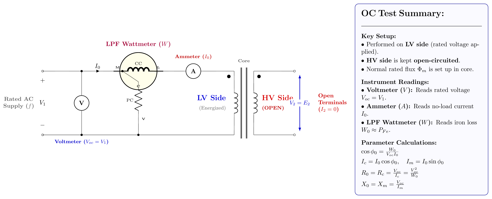
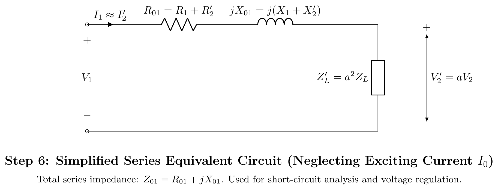
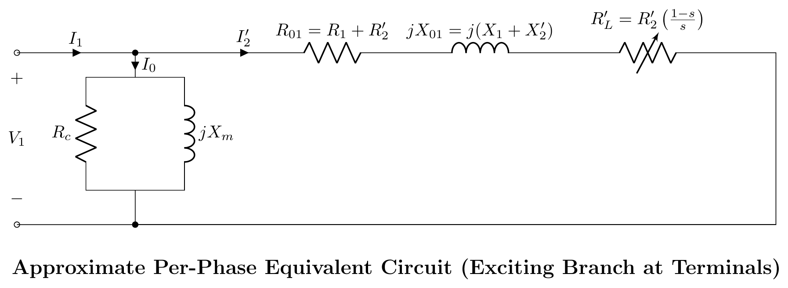

[← 2021 Answer](2021_answer.md) | [🏠 Index](README.md) | [2024 Answer →](2024_answer.md)

---

# ECE 2207: 2023 Semester Final: Explanation Style Answers
**RUET · ECE Dept · 2nd Year Even Semester Examination, 2023**
**Course No:** ECE 2207 | **Course Title:** Electrical Machines I | **Full Marks:** 60 | **Time:** 3 Hours
**Answer SIX questions taking any THREE from each section. Each question carries 10 marks.**

> Tutorial-style answers to the same paper covered in [../answers_exam_style/2023_answer.md](../answers_exam_style/2023_answer.md). Same questions, same final numbers, but every step says **why** it works.
> Section A (Q1–Q4) is transformers. Section B (Q5–Q8) is induction motors. Marks and CO tags are taken from the question paper margin.
> Question source: [../PrevYearQuestions/2023.md](../PrevYearQuestions/2023.md). Cross-cutting theory is in [2018_2024_answer.md](2018_2024_answer.md).

---

# SECTION - A

## Question 1

### Q1(a): Show that $E_1 = 4.44\, f N_1 B_m A$ **[CO1, Marks: 03]**

#### What the question is really asking

The transformer has no moving parts. So the only way it can induce a voltage is by changing the flux in time. The question wants the rms voltage that appears across the **whole** primary winding, written in terms of things a designer actually chooses: frequency, turns, peak flux density and core area.

#### Why the flux is sinusoidal in the first place

The supply voltage is sinusoidal. The primary induced emf must balance it almost exactly, because the winding resistance is tiny. An emf proportional to $d\Phi/dt$ can only be sinusoidal if $\Phi$ itself is sinusoidal. So we may write
$$\Phi(t) = \Phi_m \sin\omega t, \qquad \omega = 2\pi f$$

Note the logic direction. The applied voltage forces the flux, not the other way round. That single fact drives nearly every transformer result in this paper.

#### Step 1: Faraday's law applied to all turns at once

The question says "the whole of primary winding", and that word matters. Because the core has high permeability, the **same** mutual flux threads every one of the $N_1$ turns. The turns are in series, so their individual emfs add:
$$e_1 = -N_1 \frac{d\Phi}{dt}$$

If the flux did not link every turn equally, we could not pull $N_1$ outside the derivative. That is exactly the "no leakage" assumption.

$$e_1 = -N_1 \frac{d}{dt}(\Phi_m \sin\omega t) = -N_1 \omega \Phi_m \cos\omega t$$

The minus sign is Lenz's law. The induced emf opposes the change that made it. Physically this is the **back emf** that stops the primary from drawing a huge current.

#### Step 2: Peak value

A cosine has peak value 1, so
$$E_{m1} = N_1 \omega \Phi_m = 2\pi f N_1 \Phi_m$$

#### Step 3: Why we convert to rms

Meters read rms, and power calculations need rms. For any sinusoid, rms $=$ peak$/\sqrt{2}$:
$$E_1 = \frac{2\pi f N_1 \Phi_m}{\sqrt{2}} = \sqrt{2}\,\pi f N_1 \Phi_m$$

Evaluate the constant: $\sqrt{2}\pi = 1.4142 \times 3.1416 = 4.44$. That is where the famous 4.44 comes from. It is not a fudge factor. It is $\pi\sqrt{2}$.
$$E_1 = 4.44\, f N_1 \Phi_m$$

#### Step 4: Swap flux for flux density

Designers do not think in webers. They think in tesla, because the steel saturates at about 1.6 T to 1.8 T. Since flux density is flux per unit area,
$$\Phi_m = B_m A$$

where $A$ is the **net** iron cross-section, that is the gross area minus the varnish between laminations.

$$\boxed{E_1 = 4.44\, f N_1 B_m A \ \text{volt}}$$

#### The alternative derivation, and why it gives the same number

Some books avoid calculus. In a quarter cycle, lasting $T/4 = 1/4f$ seconds, the flux climbs from $0$ to $\Phi_m$. So the average rate of change is
$$\frac{\Phi_m}{1/4f} = 4 f \Phi_m$$

That gives the **average** emf per turn as $4f\Phi_m$. To get rms, multiply by the form factor of a sine wave, $1.11$:
$$E_1 = 1.11 \times 4 f N_1 \Phi_m = 4.44 f N_1 \Phi_m$$

Both routes agree because $1.11 = \pi/(2\sqrt{2})$ exactly, and $4 \times \pi/(2\sqrt{2}) = \sqrt{2}\pi = 4.44$.

#### What this equation tells an engineer

| Observation | Consequence |
|:---|:---|
| $E_1 \propto f$ | Run a 50 Hz transformer on 25 Hz at rated voltage and the flux doubles. The core saturates and burns. |
| $\Phi_m = V_1/(4.44 f N_1)$ | With $V_1$ and $f$ fixed by the supply, flux is fixed. The transformer is a constant-flux machine. |
| $E_1/N_1 = E_2/N_2$ | Volts per turn is identical on both windings. That gives the turns ratio at once. |
| $e_1$ has a $\cos$ while $\Phi$ has a $\sin$ | The emf lags the flux by exactly $90°$. |

---

### Q1(b): Effect of load variation on core flux and primary current **[CO1, Marks: 03]**

#### The surprising answer first

Load the transformer from no load to full load, and the core flux barely changes at all. Students usually expect the opposite, since more load means more current and more current should mean more flux. The core flux stays put. Understanding **why** is the whole answer.

#### Why the flux is locked

Go back to part (a). The applied voltage and the induced emf must stay in near-balance:
$$V_1 \approx E_1 = 4.44 f N_1 \Phi_m \implies \Phi_m \approx \frac{V_1}{4.44 f N_1}$$

Everything on the right is fixed. $V_1$ is set by the grid. $f$ is set by the generators. $N_1$ was set in the factory. So $\Phi_m$ has no freedom to change. The flux is clamped by the supply, not by the load.

#### The self-correcting mechanism, step by step

The flux does not stay constant by magic. There is a fast feedback loop:

1. **Load current appears.** Close the secondary switch and $I_2$ flows. Its m.m.f. is $N_2 I_2$.
2. **It fights the flux.** By Lenz's law, $N_2 I_2$ acts to **reduce** the core flux. So $\Phi$ dips momentarily.
3. **The back emf weakens.** Since $E_1 \propto \Phi_m$, a smaller flux means a smaller $E_1$.
4. **The gap opens.** $E_1$ was the only thing holding the primary current back. Now $(V_1 - E_1)$ is larger, so more current rushes in through the small primary impedance.
5. **The extra current exactly cancels the intruder.** The primary draws $I_2'$ until the two m.m.f.s balance:
$$N_1 I_2' = N_2 I_2 \implies I_2' = K I_2, \qquad K = \frac{N_2}{N_1}$$
6. **Flux is restored.** Net m.m.f. on the core is back to $N_1 I_0$, exactly what it was at no load.

The whole loop settles in a fraction of a cycle. The dip in flux during the transient is what *causes* the extra primary current, so it is a real effect, just a very small and very brief one.

#### What happens to the primary current

$$\vec{I}_1 = \vec{I}_0 + \vec{I}_2'$$

Two parts, with completely different jobs:

- $\vec{I}_0$, the **no-load current**, is fixed. Its job is to magnetise the core and supply the iron loss. Since the flux is constant, this job never changes, so $I_0$ never changes.
- $\vec{I}_2'$, the **load component**, is a mirror of the secondary current. It is zero at no load and rises in direct proportion to the load.

So $I_1$ climbs almost linearly from a small $I_0$ at no load up to rated current at full load.

The power factor improves too. At no load the current is almost pure magnetising current, so $\cos\phi_0$ is maybe 0.15. As $I_2'$ grows it swamps $I_0$, and the primary power factor converges on the **load** power factor.

#### The practical payoff

| Quantity | How it varies with load | Why |
|:---|:---|:---|
| Core flux $\Phi_m$ | Constant | Clamped by $V_1$ and $f$ |
| Iron loss $P_{Fe}$ | Constant | Depends only on $\Phi_m$ and $f$ |
| Primary current $I_1$ | Rises with load | $I_2' = K I_2$ |
| Copper loss $P_{Cu}$ | Rises as (load)$^2$ | $P_{Cu} = I^2 R$ |
| Primary p.f. | Approaches the load p.f. | $I_2'$ swamps $I_0$ |

That split between a constant loss and a square-law loss is exactly what makes maximum efficiency happen where they cross, which is Q2(a). It is also why all-day efficiency in Q3(b) comes out so low.

---

### Q1(c): Voltage transformation ratio and the no-load current **[CO3, Marks: 04]**

#### Definition and what it means

$$K = \frac{E_2}{E_1} = \frac{N_2}{N_1} = \frac{I_1}{I_2}$$

The voltage transformation ratio is the ratio of secondary to primary induced emf. It equals the turns ratio because, as part (a) showed, volts per turn is the same in both windings. Current transforms **inversely**, because the transformer cannot create power.

#### Reading the problem

The problem hands us the total primary current and the secondary current. From part (b) we know
$$\vec{I}_1 = \vec{I}_0 + \vec{I}_2'$$

So the no-load current is whatever is left after we subtract the load component:
$$\vec{I}_0 = \vec{I}_1 - \vec{I}_2'$$

This **must** be a phasor subtraction, not an arithmetic one. The two currents have different phase angles (45° and 36.87°), so subtracting magnitudes would give $25 - 20 = 5$ A, which is wrong. The whole point of the question is to test whether you remember that.

#### Step 1: Turns ratio and the reflected current

$$K = \frac{N_2}{N_1} = \frac{200}{800} = 0.25$$

The load component of primary current is the secondary current scaled by $K$:
$$I_2' = K I_2 = 0.25 \times 80 = 20\text{ A}$$

Sanity check on direction: the secondary has fewer turns, so it is a step-down transformer. A step-down transformer has a **larger** secondary current, and indeed 80 A out against 20 A reflected in. Correct.

#### Step 2: Choose a reference and resolve

Take the supply voltage $V_1$ along the real axis. Both currents lag it.

$$\phi_2 = \cos^{-1}(0.8) = 36.87° \implies \sin\phi_2 = 0.6$$
$$\phi_1 = \cos^{-1}(0.707) = 45° \implies \sin\phi_1 = 0.707$$

Why does $I_2'$ lag $V_1$ by the **load** angle $36.87°$? Because $I_2'$ is the exact mirror of the secondary current, and the load sets the secondary phase angle. The primary simply copies it.

$$\vec{I}_2' = 20\angle{-36.87°} = 20(0.8 - j0.6) = (16 - j12)\text{ A}$$
$$\vec{I}_1 = 25\angle{-45°} = 25(0.707 - j0.707) = (17.68 - j17.68)\text{ A}$$

#### Step 3: Subtract

$$\vec{I}_0 = \vec{I}_1 - \vec{I}_2' = (17.68 - 16) + j(-17.68 + 12)$$
$$\vec{I}_0 = (1.675 - j5.680)\text{ A}$$

Look at the two parts before doing any arithmetic. The real (in-phase) part is small at 1.675 A. The imaginary (quadrature) part is large at 5.680 A. That is the fingerprint of a no-load current, which is mostly magnetising current with only a small core-loss component.

#### Step 4: Magnitude and angle

$$I_0 = \sqrt{1.675^2 + 5.680^2} = \sqrt{2.806 + 32.26} = \sqrt{35.07} = 5.92\text{ A}$$
$$\phi_0 = \tan^{-1}\frac{5.680}{1.675} = \tan^{-1}(3.391) = 73.6°\ \text{lagging}$$

$$\boxed{I_0 = 5.92\text{ A, lagging } V_1 \text{ by } 73.6°, \quad \cos\phi_0 = 0.283}$$

#### Does the answer make sense?

Three checks, all of which a marker will look for:

1. **Magnitude.** $I_0$ is $5.92/25 = 24\%$ of the primary current. Typical values run 2% to 10%, so this is on the high side but plausible for a small transformer.
2. **Power factor.** $\cos\phi_0 = 0.283$ is very poor, as it should be. A no-load transformer is almost a pure inductor.
3. **Components.** $I_w = 1.675$ A supplies the iron loss. $I_\mu = 5.680$ A magnetises the core. $I_\mu \gg I_w$ is exactly right.

If you had wrongly subtracted magnitudes you would have got 5 A at an undefined angle, and the power factor check would have caught it.

---

## Question 2

### Q2(a): Power transformer, and maximum efficiency at $P_{Cu} = P_{Fe}$ **[CO2, Marks: 03]**

#### Defining a power transformer

A **power transformer** is a high-rating static transformer used at generating stations and transmission substations to step voltage up or down at bulk power levels, typically above a few MVA.

What separates it from a distribution transformer is its **duty cycle**. A power transformer runs at or near full load almost all the time. So it is designed to put its efficiency peak right at full load, which (as we are about to prove) means it is designed with iron loss equal to full-load copper loss. A distribution transformer, by contrast, sits lightly loaded most of the day, so it is deliberately built with a **low** iron loss, which pushes its efficiency peak down to around half load. Q3(b) shows why that choice matters.

#### Setting up the proof

Efficiency is output over input, and input is output plus losses:
$$\eta = \frac{V_2 I_2 \cos\phi}{V_2 I_2 \cos\phi + P_i + I_2^2 R_{02}}$$

Two different kinds of loss sit in that denominator, and that is the key to the whole proof:

- $P_i$, the **iron loss**, is **constant**. Part (b) of Q1 explained why: the flux is clamped by $V_1$ and $f$, so hysteresis and eddy-current losses never change with load.
- $I_2^2 R_{02}$, the **copper loss**, grows as the **square** of load current.

One loss is flat, the other is a rising parabola. A flat curve plus a rising parabola, divided into a linearly rising output, must have a maximum somewhere. Finding it is now a one-line calculus problem.

#### The trick that makes the calculus easy

Divide the numerator and the denominator by $I_2$:
$$\eta = \frac{V_2\cos\phi}{V_2\cos\phi + \dfrac{P_i}{I_2} + I_2 R_{02}}$$

Now the numerator is a **constant** (we are holding $V_2$ and $\cos\phi$ fixed and varying only the load current). So maximising $\eta$ means minimising the denominator. And the only part of the denominator that varies is
$$g(I_2) = \frac{P_i}{I_2} + I_2 R_{02}$$

#### Minimise it

$$\frac{dg}{dI_2} = -\frac{P_i}{I_2^2} + R_{02} = 0$$
$$\implies I_2^2 R_{02} = P_i$$

$$\boxed{\text{Copper loss} = \text{Iron loss at maximum efficiency}}$$

Confirm it is a minimum of the loss and not a maximum:
$$\frac{d^2 g}{dI_2^2} = \frac{2P_i}{I_2^3} > 0 \quad \text{for all } I_2 > 0 \ \checkmark$$

#### Why the result is intuitive

You can see it without calculus. Think of the two losses as two curves. Below the crossing point, iron loss dominates and spreading it over more output helps, so efficiency rises. Above the crossing point, copper loss dominates and it grows faster than the output does, so efficiency falls. The turning point is where they are equal.

This is also an instance of the general AM-GM result: for $a/x + bx$, the sum is least when the two terms are equal.

#### Finding the load that achieves it

Copper loss at a load fraction $x$ of full load is $x^2 P_{Cu,FL}$. Set that equal to $P_i$:
$$x^2 P_{Cu,FL} = P_i \implies x = \sqrt{\frac{P_i}{P_{Cu,FL}}}$$
$$\text{kVA at } \eta_{max} = \text{Full-load kVA} \times \sqrt{\frac{P_i}{P_{Cu,FL}}}$$

And the peak value itself:
$$\eta_{max} = \frac{x \times \text{kVA}_{FL} \times \cos\phi}{x \times \text{kVA}_{FL} \times \cos\phi + 2P_i}$$

The $2P_i$ is a neat shortcut. At the peak, total loss is just twice the iron loss.

---

### Q2(b): O.C. and S.C. tests on a 10-kVA, 450/120 V transformer **[CO3, Marks: 04]**

> **O.C. test:** $V_1 = 120\text{ V}$, $I_1 = 4.2\text{ A}$, $W_1 = 80\text{ W}$ (read on the low voltage side)
> **S.C. test:** $V_1 = 9.65\text{ V}$, $I_1 = 22.2\text{ A}$, $W_1 = 120\text{ W}$ (with low-voltage winding short circuited)
> Find (i) equivalent circuit constants, (ii) efficiency and voltage regulation at 80% lagging p.f.

#### First, work out which side each test was done on

The question does not say outright, and getting this wrong ruins the answer. Compute both rated currents:
$$I_{HV} = \frac{10000}{450} = 22.2\text{ A}, \qquad I_{LV} = \frac{10000}{120} = 83.3\text{ A}$$

The S.C. reading of 22.2 A is a dead match for the HV rated current. And the problem says the **low-voltage winding is short circuited**, which means the instruments must be on the HV side. So the S.C. test is a **HV-side** test. The O.C. test is stated to be on the LV side, consistent with its 120 V reading.

So: shunt-branch constants come out on the **LV** base, series-branch constants come out on the **HV** base. They must be brought to a common base before use.

#### Why each test isolates what it does

**Open-circuit test.** Rated voltage, no load current. Two consequences:
- Rated voltage means rated flux, so the iron loss is the full normal iron loss.
- The current is only $I_0$, maybe 5% of rated, so the copper loss is $(0.05)^2 = 0.25\%$ of normal. Utterly negligible.

**So the wattmeter reads iron loss alone.** The test is run on the LV side purely for convenience, since 120 V is easy to source and the current is small enough for ordinary meters.

**Short-circuit test.** Rated current, but only a few percent of rated voltage. The mirror image:
- Rated current means normal full-load copper loss.
- Only $9.65/450 = 2.1\%$ of rated voltage means only 2.1% of rated flux, so iron loss is roughly $(0.021)^2$ of normal. Negligible.

**So the wattmeter reads full-load copper loss alone.** The test is run from the HV side so the applied voltage is a workable 9.65 V rather than a hard-to-set 2.6 V.

This clean separation is the entire reason both tests exist.

#### (i) Equivalent circuit constants

**Shunt branch, from the O.C. test (LV base).**

The no-load power factor comes straight from the wattmeter:
$$\cos\phi_0 = \frac{W_0}{V I_0} = \frac{80}{120 \times 4.2} = \frac{80}{504} = 0.159$$
$$\sin\phi_0 = \sqrt{1 - 0.159^2} = 0.987$$

A power factor of 0.159 is dreadful, and that is exactly what we expect. At no load the transformer is almost a pure inductor.

Split $I_0$ into its two physical jobs:
$$I_w = I_0\cos\phi_0 = 4.2 \times 0.159 = 0.667\text{ A} \quad \text{(supplies iron loss)}$$
$$I_\mu = I_0\sin\phi_0 = 4.2 \times 0.987 = 4.147\text{ A} \quad \text{(magnetises the core)}$$

Each branch element is voltage over its own current:
$$R_0' = \frac{120}{0.667} = 180\ \Omega, \qquad X_0' = \frac{120}{4.147} = 28.9\ \Omega$$

Cross-check on $R_0'$: it should also equal $V^2/W_0 = 14400/80 = 180\ \Omega$. It does.

**Refer them to the primary (HV) side.** Impedance scales as the square of the turns ratio, because voltage scales by $a$ and current scales by $1/a$:
$$a = \frac{450}{120} = 3.75, \qquad a^2 = 14.06$$
$$\boxed{R_0 = 180 \times 14.06 = 2531\ \Omega \approx 2525\ \Omega}$$
$$\boxed{X_0 = 28.9 \times 14.06 = 407\ \Omega \approx 406\ \Omega}$$

Iron loss $P_i = 80\text{ W}$, and it stays 80 W at every load.

**Series branch, from the S.C. test (already on the HV base).**

$$Z_{01} = \frac{V_{sc}}{I_{sc}} = \frac{9.65}{22.2} = 0.435\ \Omega$$

Resistance comes from the wattmeter, because $W_{sc}$ is pure $I^2R$:
$$R_{01} = \frac{W_{sc}}{I_{sc}^2} = \frac{120}{492.8} = 0.243\ \Omega$$

Reactance from Pythagoras, since $Z^2 = R^2 + X^2$:
$$X_{01} = \sqrt{0.435^2 - 0.243^2} = \sqrt{0.1892 - 0.0590} = \sqrt{0.1302} = 0.361\ \Omega$$

$$\boxed{R_{01} = 0.243\ \Omega, \quad X_{01} = 0.361\ \Omega, \quad Z_{01} = 0.435\ \Omega}$$

Full-load copper loss $P_{Cu} = 120\text{ W}$.

Notice the scale. $X_{01} > R_{01}$, so the leakage path is mainly inductive. And both are tiny next to $R_0 = 2531\ \Omega$. That huge ratio is exactly why the approximate circuit, which shifts the shunt branch to the terminals, loses almost nothing.

#### (ii) Efficiency at 80% lagging p.f., full load

Full load means rated current, which means the copper loss is the 120 W measured in the S.C. test. The iron loss is the 80 W measured in the O.C. test, and it is the same at any load.

$$\text{Output} = \text{kVA} \times \cos\phi = 10000 \times 0.8 = 8000\text{ W}$$
$$\text{Total loss} = 80 + 120 = 200\text{ W}$$
$$\eta = \frac{\text{output}}{\text{output} + \text{loss}} = \frac{8000}{8200}$$

$$\boxed{\eta = 97.56\%}$$

Worth noticing: this transformer's maximum efficiency is **not** at full load. Using Q2(a),
$$x = \sqrt{\frac{80}{120}} = 0.816$$

So it peaks at about 82% load. The designer leaned slightly toward light-load performance.

#### (ii) Voltage regulation at 80% lagging p.f.

**What regulation means.** It is the drop in secondary terminal voltage from no load to full load, as a fraction of the no-load value. It matters because customers need steady voltage.

**Why the formula has that shape.** The exact expression needs a phasor diagram. But $R_{01}$ and $X_{01}$ are so small compared with $V_1$ that the drop phasor is almost parallel to $V_1$. Projecting the drop onto $V_1$ gives the approximation:
$$\%\text{Reg} = \frac{I(R_{01}\cos\phi \pm X_{01}\sin\phi)}{V_1} \times 100$$

The sign is $+$ for a **lagging** load and $-$ for a leading load. With a lagging load, the current lags both the resistive and the reactive drops in a way that makes them add, so the voltage falls. With a leading load the reactive term subtracts, and with enough capacitance the voltage can actually **rise**. Our load is 0.8 lagging, so we use $+$.

$$I_1 = \frac{10000}{450} = 22.2\text{ A}, \qquad \cos\phi = 0.8, \quad \sin\phi = 0.6$$
$$\text{Drop} = 22.2\,(0.243 \times 0.8 + 0.361 \times 0.6) = 22.2\,(0.1944 + 0.2166) = 22.2 \times 0.4112 = 9.13\text{ V}$$
$$\%\text{Reg} = \frac{9.13}{450} \times 100$$

$$\boxed{\text{Voltage regulation} = 2.03\%}$$

Look at which term dominates. The reactive part contributes 0.2166 and the resistive part only 0.1944, even though $\sin\phi$ is smaller than $\cos\phi$. That is because $X_{01}$ is about 1.5 times $R_{01}$. In large transformers $X \gg R$, so the reactive drop dominates completely and regulation is nearly $\%X \sin\phi$.

#### Cross-check on the other side

A good habit. Refer the series constants down to the LV side by dividing by $a^2 = 14.06$:
$$R_{02} = \frac{0.243}{14.06} = 0.0173\ \Omega, \qquad X_{02} = \frac{0.361}{14.06} = 0.0256\ \Omega$$
$$I_2 = 83.3\text{ A}, \qquad \text{Drop} = 83.3\,(0.0173 \times 0.8 + 0.0256 \times 0.6) = 2.43\text{ V}$$
$$\%\text{Reg} = \frac{2.43}{120} \times 100 = 2.03\% \ \checkmark$$

Same answer, as it must be. Regulation is a ratio, so it is independent of which side you compute it on.

---

### Q2(c): Why an auto-transformer uses less copper **[CO2, Marks: 03]**

#### The physical reason, before the algebra

A two-winding transformer keeps its two circuits electrically separate. Every watt it delivers must be pushed across the air gap as magnetic flux, so both windings must be sized for the full power.

An auto-transformer shares one winding between input and output. Part of the power therefore travels **conductively**, straight down the copper, without ever becoming flux. Only the remaining part is transformed inductively. Less transformed power means less copper. That is the whole idea, and the algebra just puts a number on it.

#### Why weight goes as $N \times I$

Two separate effects:
- **Turns $N$** fix the total **length** of wire.
- **Current $I$** fixes the required **cross-sectional area**, because current density must stay within a safe limit.

Volume is length times area, so
$$W \propto N \times I$$

#### Case 1: Ordinary two-winding transformer

Two completely separate windings:
$$W_o \propto N_1 I_1 + N_2 I_2$$

And by m.m.f. balance $N_1 I_1 = N_2 I_2$, so this is just $2 N_1 I_1$. Each winding carries the full burden.

#### Case 2: Auto-transformer

Take a step-down auto-transformer with $N_1$ total turns, tapped at $N_2$ turns from one end. It has two **sections**, not two windings:

| Section | Turns | Current it carries | Why |
|:---|:---|:---|:---|
| Series part $AB$ | $N_1 - N_2$ | $I_1$ | Only the input current flows here |
| Common part $BC$ | $N_2$ | $I_2 - I_1$ | Input and output currents flow in **opposite** directions and partly cancel |

That cancellation in the common section is the key. The two currents oppose, so the common section carries only their difference. A much thinner conductor will do.

$$W_a \propto (N_1 - N_2) I_1 + N_2 (I_2 - I_1)$$

#### Take the ratio

$$\frac{W_a}{W_o} = \frac{(N_1 - N_2)I_1 + N_2(I_2 - I_1)}{N_1 I_1 + N_2 I_2}$$

Expand the numerator:
$$N_1 I_1 - N_2 I_1 + N_2 I_2 - N_2 I_1 = N_1 I_1 + N_2 I_2 - 2N_2 I_1$$

Now use $N_1 I_1 = N_2 I_2$ to clean both parts up:
- Denominator: $N_1 I_1 + N_2 I_2 = 2 N_1 I_1$
- Numerator: $2N_1 I_1 - 2N_2 I_1 = 2 I_1 (N_1 - N_2)$

$$\frac{W_a}{W_o} = \frac{2 I_1 (N_1 - N_2)}{2 N_1 I_1} = \frac{N_1 - N_2}{N_1} = 1 - \frac{N_2}{N_1} = 1 - K$$

$$\boxed{W_a = (1 - K)\, W_o \qquad \text{Saving of copper} = K\, W_o}$$

#### Reading the result

Since $0 < K < 1$ in a step-down unit, $(1-K) < 1$ always, so $W_a < W_o$ always. The auto-transformer **always** wins on copper.

| $K$ | Copper used | Saving | Comment |
|:---|:---|:---|:---|
| 0.1 | 90% | 10% | Barely worth it, ratios far apart |
| 0.5 | 50% | 50% | 230/115 V unit |
| 0.9 | 10% | 90% | Huge saving, ratios close |
| $\to 1$ | $\to 0$ | $\to 100\%$ | Limiting case |

So the closer the two voltages are, the bigger the win. This is why auto-transformers are used for interconnecting 220 kV and 132 kV systems, for induction motor starting, and for Variac laboratory supplies.

**And the catch.** There is no electrical isolation. A break in the common section puts the full primary voltage onto the secondary terminals. So an auto-transformer is never used where a large ratio or user safety is involved.

---

## Question 3

### Q3(a): Continuing 3-phase supply with one phase burnt out **[CO1, Marks: 04]**

#### The answer, and the idea behind it

**Yes.** The method is the **open-delta** or **V-V connection**.

The reason it works lies in a property of balanced 3-phase systems rather than in anything clever about the transformers. In any closed loop of three line voltages,
$$\vec{V}_{AB} + \vec{V}_{BC} + \vec{V}_{CA} = 0$$

So any **two** of them determine the third completely:
$$\vec{V}_{CA} = -(\vec{V}_{AB} + \vec{V}_{BC})$$

Two transformers can therefore produce all three line voltages. The third appears across the gap left by the missing unit, free of charge.

#### What you physically do

1. Start from a $\Delta$–$\Delta$ bank of three single-phase transformers.
2. One unit burns out. Isolate and remove it from both the primary and secondary sides.
3. Leave the remaining two connected. They now form a "V" on each side.
4. Re-energise. The load sees three balanced line voltages $120°$ apart and keeps running.

No rewiring of the surviving units is needed. This is why $\Delta$-$\Delta$ is favoured where supply continuity matters.

#### Why the capacity drops to 57.7%, derived carefully

Let $V$ and $I$ be the rated winding voltage and winding current of **one** transformer.

**Closed $\Delta$–$\Delta$.** In delta, line voltage equals phase voltage but line current is $\sqrt{3}$ times phase current:
$$S_{\Delta\Delta} = \sqrt{3} V_L I_L = \sqrt{3} \times V \times \sqrt{3} I = 3VI$$

That is simply three transformers each doing $VI$, which is the sanity check.

**Open delta.** Here is the subtle part. With the third unit gone, each remaining winding sits **directly in a line**. There is no longer a parallel path to share the current. So the line current cannot exceed the winding rating:
$$I_L = I \quad \text{(not } \sqrt{3}I)$$
$$S_{VV} = \sqrt{3} V_L I_L = \sqrt{3} V I$$

$$\frac{S_{VV}}{S_{\Delta\Delta}} = \frac{\sqrt{3}VI}{3VI} = \frac{1}{\sqrt{3}} = 0.577$$

$$\boxed{\text{Open-delta capacity} = 57.7\% \text{ of the original bank}}$$

#### The 57.7% versus 86.6% confusion

Students mix these two up constantly. They answer different questions.

| Question | Calculation | Answer |
|:---|:---|:---|
| How much of the **original three-transformer bank** is left? | $\sqrt{3}VI \div 3VI$ | **57.7%** |
| How hard are the **two surviving units** being worked? | $\sqrt{3}VI \div 2VI$ | **86.6%** |

Both are right. The bank lost 42.3% of its capacity, yet the two survivors are each loaded to only 86.6% of their own rating, not 100%. The missing 13.4% is lost to the phase relationships, not to any physical limit of the transformers.

#### Why the survivors cannot be worked to 100%

In the V-V bank the two transformers do **not** operate at the load power factor. One works at $\cos(30° - \phi)$ and the other at $\cos(30° + \phi)$.

| Load p.f. | Transformer 1 p.f. | Transformer 2 p.f. |
|:---|:---|:---|
| 1.0 ($\phi = 0°$) | 0.866 | 0.866 |
| 0.866 lag ($\phi = 30°$) | 1.0 | 0.5 |
| 0.5 lag ($\phi = 60°$) | 0.866 | 0 |

At 0.5 lagging power factor, one transformer delivers no real power at all. It is carrying current and getting hot while contributing nothing. This unequal sharing is what caps the bank at 86.6% per unit.

#### Practical limits

Secondary voltages drift slightly out of balance as load increases, because the two units have different internal drops at their different power factors. Open delta is an **emergency** or **light-load** arrangement, acceptable until the failed unit can be replaced. It is also used deliberately where a load is expected to grow, by installing two units now and the third later.

---

### Q3(b): All-day efficiency of a 100-kVA lighting transformer **[CO3, Marks: 04]**

#### Why ordinary efficiency is the wrong measure here

Commercial efficiency is a snapshot. It answers "what fraction of input power comes out, at this instant, at this load". For a distribution transformer that is close to meaningless, because the load changes all day and is zero for much of it.

At zero load, commercial efficiency is literally **zero**. The transformer draws iron loss and delivers nothing. Yet the transformer is not broken. The metric is just wrong for the job.

**All-day efficiency** fixes it by integrating over 24 hours:
$$\eta_{\text{all-day}} = \frac{\text{kWh output in 24 h}}{\text{kWh output} + \text{kWh iron loss} + \text{kWh copper loss}}$$

The asymmetry this exposes is the point of the whole topic:
- **Iron loss runs for 24 hours.** The transformer stays energised whether or not anyone is drawing load, so the flux and the iron loss are always there.
- **Copper loss runs only while loaded,** and scales as the square of the load.

#### Reading the given data

100 kVA, full-load loss 3 kW, divided equally:
$$P_{Fe} = P_{Cu,FL} = \frac{3}{2} = 1.5\text{ kW}$$

The phrase "lighting transformer" tells us to treat the load as **unity power factor**. Incandescent and similar lighting loads are resistive. So 100 kVA delivers 100 kW.

Also notice what "equally divided" means for the design. By Q2(a), $x = \sqrt{P_i/P_{Cu,FL}} = \sqrt{1} = 1$. So this transformer peaks at **full load**, which (as we will see) is the wrong design choice for its duty.

#### Step 1: Energy delivered in 24 hours

| Period | Load | Output | Hours | Energy |
|:---|:---|---:|---:|---:|
| Full load | 100% | 100 kW | 3 | 300 kWh |
| Half load | 50% | 50 kW | 4 | 200 kWh |
| Idle | negligible | 0 kW | 17 | 0 kWh |
| **Total** | | | **24** | **500 kWh** |

$$\text{Output} = 300 + 200 = 500\text{ kWh}$$

The 17 idle hours come from $24 - 3 - 4$. The problem's phrase "output being negligible for the remainder of the day" means zero output but **still energised**, which is the whole trap.

#### Step 2: Iron loss energy

Constant 1.5 kW, running for the entire 24 hours because the transformer is never switched off:
$$\text{kWh}_{Fe} = 1.5 \times 24 = 36\text{ kWh}$$

#### Step 3: Copper loss energy

Copper loss is $I^2 R$, so at a load fraction $x$ it is $x^2 P_{Cu,FL}$. It must be computed separately for each loading period.

$$\text{Full load } (x=1): \quad 1.5 \times (1)^2 \times 3\text{ h} = 4.5\text{ kWh}$$
$$\text{Half load } (x=0.5): \quad 1.5 \times (0.5)^2 \times 4\text{ h} = 0.375 \times 4 = 1.5\text{ kWh}$$
$$\text{Idle } (x=0): \quad 0\text{ kWh}$$
$$\text{kWh}_{Cu} = 4.5 + 1.5 + 0 = 6\text{ kWh}$$

The most common error is using $1.5 \times 0.5$ instead of $1.5 \times 0.5^2$ for the half-load period. Halving the load quarters the copper loss, because the loss follows the **square**.

#### Step 4: Combine

$$\eta_{\text{all-day}} = \frac{500}{500 + 36 + 6} = \frac{500}{542} = 0.9225$$

$$\boxed{\eta_{\text{all-day}} = 92.25\%}$$

#### Why the answer is so much worse than full-load efficiency

At full load the commercial efficiency is
$$\eta_{FL} = \frac{100}{100 + 1.5 + 1.5} = 97.1\%$$

The all-day figure is almost **five points** lower. Look at where the energy went:

| Loss | kWh | Share of total loss |
|:---|---:|---:|
| Iron | 36 | 86% |
| Copper | 6 | 14% |

Iron loss accounts for 86% of all the energy wasted, purely because it runs for 24 hours while the transformer delivers useful output for only 7 of them.

#### The design lesson

To raise the all-day figure, cut the iron loss, even at the price of a higher copper loss. A distribution transformer should be built with
$$P_{Fe} \ll P_{Cu,FL}$$

so its efficiency peak sits at around half load instead of full load. Concretely, this means using better core steel (CRGO or amorphous), a lower working flux density, and thinner laminations. The 50-50 split given in this problem is a power-transformer design being misapplied to a distribution duty, which is exactly why the all-day number comes out mediocre.

---

### Q3(c): Limitations of the Y-Y connection **[CO1, Marks: 02]**

Y-Y looks like the obvious choice. Both sides need only $V_L/\sqrt{3}$ of insulation, and a neutral is available on both sides. In practice it is the least used of the four, for the reasons below.

#### 1. The third-harmonic problem (the serious one)

Iron saturates, so the B-H curve is non-linear. To force a **sinusoidal** flux through a non-linear core, the magnetising current must itself be non-sinusoidal. It needs a strong **third-harmonic** component, typically 5% to 10% of the fundamental.

Third-harmonic currents in the three phases are all **in phase** with one another (they are zero-sequence), so they cannot circulate around a star point unless there is a neutral return. In a Y-Y bank with isolated neutrals there is nowhere for them to go.

Blocked from flowing, the third-harmonic magnetising current cannot be drawn. The flux wave then becomes flat-topped instead of sinusoidal, and a flat-topped flux induces a **peaky** emf containing a large third-harmonic voltage. Phase voltages can be badly distorted, and the neutral oscillates at third-harmonic frequency.

A delta winding anywhere in the bank solves this instantly, because third-harmonic currents can circulate freely around the closed delta loop. Y-Y has no delta.

#### 2. Neutral shifting on unbalanced load

With a single-phase or otherwise unbalanced load and no neutral wire, the star point drifts away from the centre of the voltage triangle. Phase voltages become unequal. The lightly loaded phases see **over-voltage** and the heavily loaded one sees **under-voltage**.

This matters because unbalanced loading is normal in distribution, where single-phase lighting loads are tapped between phase and neutral.

#### 3. It needs help to work at all

Both problems above are cured only by either
- solidly earthing both neutrals and running a four-wire system, or
- adding a third **tertiary delta** winding purely to give harmonics a circulating path.

Either fix costs money and complexity, which is the practical objection.

#### 4. No emergency open-delta operation

A $\Delta$-$\Delta$ bank can lose one unit and carry on at 57.7% capacity, as Q3(a) showed. A Y-Y bank cannot. Lose one unit and the supply is gone.

#### 5. Over-voltage and resonance risk

The combination of harmonic voltages with the line capacitance can produce resonant over-voltages on long lines.

> [!success] Which connection is used instead
> $\Delta$-Y for stepping **up** at generating stations, since the delta handles harmonics and the star gives a neutral for the transmission line.
> Y-$\Delta$ for stepping **down** at substations.
> $\Delta$-$\Delta$ for large low-voltage, high-current duty, and where open-delta backup is wanted.

---

## Question 4

### Q4(a): Conditions for parallel operation of two 3-phase transformers **[CO1, Marks: 03]**

#### Why transformers are paralleled at all

Three reasons. Load has grown past one unit's rating. Reliability demands that one unit can be taken out for maintenance without a shutdown. Or efficiency improves if a lightly loaded period can be served by one unit while the other is switched out, avoiding needless iron loss.

#### The single governing principle

Put two voltage sources in parallel. Any difference between their no-load emfs appears across the series loop made by their two internal impedances. Since those impedances are deliberately small, even a tiny mismatch drives a large **circulating current**:
$$\vec{I}_{circ} = \frac{\vec{E}_A - \vec{E}_B}{\vec{Z}_A + \vec{Z}_B}$$

That current flows whether or not any load is connected. It produces pure loss and heat.

So the essential conditions all say the same thing in different ways: **make $\vec{E}_A$ and $\vec{E}_B$ identical, in magnitude and in phase.** A phasor is equal to another only if magnitude, phase and sense all match, which is why there are four separate essential conditions rather than one.

#### Essential conditions (violate these and the bank fails)

**1. Same line voltage ratio.** If the turns ratios differ, the no-load secondary voltages differ in magnitude and a circulating current flows even at no load. In practice a small mismatch is tolerated, because the resulting circulating current is limited by $Z_A + Z_B$, but it wastes capacity.

**2. Same polarity.** This one is catastrophic, not merely wasteful. With correct polarity the two secondary emfs oppose each other around the loop and the net driving voltage is zero. With reversed polarity they **add**, putting $2E$ across $(Z_A + Z_B)$, which is close to a dead short circuit. The windings can be destroyed within seconds. Always verify polarity before closing the switch.

**3. Same phase sequence.** Both banks must deliver the same rotation, R-Y-B for example. If one is R-Y-B and the other R-B-Y, two of the three phases are effectively shorted together through the transformers. The result is the same as wrong polarity.

**4. Zero relative phase displacement.** This is the condition unique to **three-phase** transformers, and the one students forget. Different connections introduce different phase shifts between primary and secondary line voltages:

| Connection | Phase shift | Vector group |
|:---|:---|:---|
| $\Delta$-$\Delta$ | $0°$ | Dd0 |
| Y-Y | $0°$ | Yy0 |
| $\Delta$-Y | $30°$ | Dy1 |
| Y-$\Delta$ | $-30°$ | Yd11 |

A $\Delta$-Y bank cannot be paralleled with a $\Delta$-$\Delta$ bank, even with identical ratios and ratings, because the $30°$ difference puts a voltage of $2E\sin 15° = 0.52E$ around the loop. Units must share the same **vector group**.

#### Desirable conditions (violate these and the bank works badly)

**5. Equal per-unit (percentage) impedance.** This governs how load is shared. Transformers in parallel see the same terminal voltage, so they divide current **inversely** as their impedances:
$$\frac{S_A}{S_B} = \frac{Z_B}{Z_A}$$

For each unit to pick up load in proportion to its **own rating**, their impedances must be in inverse proportion to their ratings, which is the same as saying their **per-unit** impedances are equal. If they are not, the unit with the lower per-unit impedance hogs the load and reaches full load while the other is still part loaded. The bank can never reach its combined rating.

**6. Equal $X/R$ ratio.** This governs power factor. If the two impedance angles differ, the two currents are out of phase with each other. Their phasor sum is then less than their arithmetic sum, so each unit carries more current than the delivered load justifies. The result is extra copper loss and heating with no extra output.

> [!info] Rule of thumb
> Conditions 1 to 4 are about **not destroying anything**. Conditions 5 and 6 are about **getting full value**. An exam answer should name all six and label which group each belongs to.

---

### Q4(b): Closed-$\Delta$ kVA is $\sqrt{3}$ times open-$\Delta$ kVA **[CO1, Marks: 03]**

#### Set up a fair comparison

The proof only works if both cases use the **same transformers**. So fix the rating of one single-phase unit at winding voltage $V$ and winding current $I$. That gives each unit a rating of $VI$ volt-amperes, and we ask what a bank of three and a bank of two can deliver.

#### Closed delta, three transformers

In a delta connection the winding sits across a line pair, so
$$V_L = V_{ph} = V$$

But each line connects to **two** windings, so the line current is the phasor sum of two winding currents $120°$ apart:
$$I_L = \sqrt{3} I_{ph} = \sqrt{3} I$$

$$S_{\Delta} = \sqrt{3} V_L I_L = \sqrt{3} \times V \times \sqrt{3} I = 3VI$$

Sanity check: three units, each rated $VI$, giving $3VI$ in total. The bank gives exactly the sum of its parts.

#### Open delta, two transformers

The voltage situation is unchanged, since the third line voltage is still produced by the closing of the phasor triangle:
$$V_L = V$$

The **current** situation is what changes. Remove the third transformer and each remaining winding now sits alone in its line. There is no second winding to share with:
$$I_L = I_{ph} = I$$

This is the whole proof in one line. The $\sqrt{3}$ that multiplied the current in closed delta is gone.

$$S_{V} = \sqrt{3} V_L I_L = \sqrt{3} V I$$

#### Take the ratio

$$\frac{S_{\Delta}}{S_{V}} = \frac{3VI}{\sqrt{3}VI} = \frac{3}{\sqrt{3}} = \sqrt{3}$$

$$\boxed{S_{\Delta} = \sqrt{3}\, S_{V}, \qquad S_{V} = \frac{1}{\sqrt{3}} S_{\Delta} = 0.577\, S_{\Delta}}$$

#### Where the missing capacity went

Removing one of three transformers removes 33% of the installed iron and copper. Yet capacity falls by 42.3%, not 33%. Why the extra 9%?

Because the two survivors can no longer work at the load power factor. As Q3(a) showed, they run at $\cos(30° - \phi)$ and $\cos(30° + \phi)$. Even at unity load power factor, each operates at $\cos 30° = 0.866$. That factor of 0.866 is exactly the gap:
$$\frac{2VI \times 0.866}{3VI} = \frac{1.732}{3} = 0.577 \ \checkmark$$

So the loss splits cleanly into two parts: one third from removing a transformer, and a further 0.866 factor from the unavoidable power-factor penalty on those that remain.

> [!example] Worked feel for the numbers
> Three 10 kVA units in $\Delta$-$\Delta$: bank rating $= 30$ kVA.
> Remove one. Open-delta rating $= \sqrt{3} \times 10 = 17.32$ kVA, which is $57.7\%$ of 30 kVA.
> Each surviving unit then carries $17.32/2 = 8.66$ kVA, that is $86.6\%$ of its own 10 kVA plate rating.
> **Not** 100%, because of the power-factor penalty just described.

---

### Q4(c): Secondary voltage of a 2-MVA, 33/6.6 kV $\Delta$/Y transformer at full load, 0.75 p.f. lagging **[CO1, Marks: 04]**

#### What makes this one tricky

Three things are deliberately mixed together:
1. The two sides have **different connections**, delta on the primary and star on the secondary. So the per-phase voltages are not simply the line voltages.
2. Resistances are given per phase on **both** sides, so they must be combined onto one side.
3. The impedance is given as a **percentage**, not in ohms.

Work entirely in **per-phase, secondary-referred** quantities and it all falls out.

#### Step 1: Sort out the per-phase voltages

**Primary is delta at 33 kV.** In delta, phase voltage equals line voltage:
$$V_{1,ph} = 33000\text{ V}$$

**Secondary is star at 6.6 kV.** In star, phase voltage is line voltage over $\sqrt{3}$:
$$V_{2,ph} = \frac{6600}{\sqrt{3}} = 3810.5\text{ V}$$

This is the most common place to slip. The stated ratio 33/6.6 kV is a **line-to-line** ratio, and because the connections differ, it is not the per-phase ratio.

#### Step 2: Full-load secondary current

In star, line current equals phase current:
$$I_2 = \frac{S}{\sqrt{3} V_L} = \frac{2 \times 10^6}{\sqrt{3} \times 6600} = \frac{2 \times 10^6}{11431.5} = 174.95\text{ A}$$

#### Step 3: The per-phase transformation ratio

This is where the connection difference bites:
$$K = \frac{V_{2,ph}}{V_{1,ph}} = \frac{3810.5}{33000} = 0.11547$$

Note this is **not** $6.6/33 = 0.2$. The per-phase ratio differs from the line ratio by exactly the $\sqrt{3}$ introduced by the star connection: $0.2/\sqrt{3} = 0.11547$. Using 0.2 here would scale the referred primary resistance by $(0.2/0.11547)^2 = 3$, which is a factor-of-three error.

$$K^2 = 0.013333$$

#### Step 4: Combine the resistances on the secondary side

To refer a primary resistance to the secondary, multiply by $K^2$. The reason is that the referred resistance must dissipate the same power: $I_1^2 R_1 = I_2^2 (K^2 R_1)$ when $I_1 = K I_2$.

$$R_{02} = R_2 + K^2 R_1 = 0.08 + 0.013333 \times 8 = 0.08 + 0.10667 = 0.1867\ \Omega$$

Both windings contribute roughly equally, which is normal good design. A well-designed transformer splits its copper loss about evenly between the two windings.

#### Step 5: Convert the 7% impedance into ohms

Percentage impedance is defined as the drop across the internal impedance at rated current, as a percentage of rated voltage:
$$\%Z = \frac{I_2 Z_{02}}{V_{2,ph}} \times 100$$

That definition is per-phase, and it is the same number on either side, which is why percentage notation is used. Rearranging:
$$Z_{02} = \frac{\%Z \times V_{2,ph}}{100 \times I_2} = \frac{0.07 \times 3810.5}{174.95} = \frac{266.74}{174.95} = 1.5246\ \Omega$$

#### Step 6: Extract the reactance

$$X_{02} = \sqrt{Z_{02}^2 - R_{02}^2} = \sqrt{1.5246^2 - 0.1867^2} = \sqrt{2.3244 - 0.0348} = \sqrt{2.2896} = 1.5131\ \Omega$$

Look at the ratio: $X_{02}/R_{02} = 8.1$. In a 2 MVA transformer the leakage reactance dominates heavily, which is typical for large units. That tells us before we calculate anything that the regulation will be driven almost entirely by $\sin\phi$.

#### Step 7: Voltage drop at 0.75 p.f. lagging

$$\cos\phi = 0.75, \qquad \sin\phi = \sqrt{1 - 0.5625} = \sqrt{0.4375} = 0.6614$$
$$\Delta V = I_2 (R_{02}\cos\phi + X_{02}\sin\phi)$$
$$= 174.95\,(0.1867 \times 0.75 + 1.5131 \times 0.6614)$$
$$= 174.95\,(0.1400 + 1.0009)$$
$$= 174.95 \times 1.1409 = 199.6\text{ V per phase}$$

The reactive term (1.0009) is over seven times the resistive term (0.1400), exactly as the $X/R$ ratio predicted. Lagging power factor is bad news for voltage regulation, and this is why.

#### Step 8: The answer

$$V_{2,ph}\big|_{\text{load}} = 3810.5 - 199.6 = 3610.9\text{ V}$$

Convert back to a line value, since the question asks for "the secondary voltage" of a system rated in line volts:
$$V_{2,\text{line}} = \sqrt{3} \times 3610.9 = 6254\text{ V}$$

$$\boxed{V_2 = 6254\text{ V} \approx 6.25\text{ kV (line)}, \qquad \text{regulation} = 5.24\%}$$

#### Cross-check using percentages only

A faster route, and a good way to catch arithmetic slips. Work entirely in percent:
$$\%R = \frac{I_2 R_{02}}{V_{2,ph}} \times 100 = \frac{174.95 \times 0.1867}{3810.5} \times 100 = 0.857\%$$
$$\%X = \sqrt{(\%Z)^2 - (\%R)^2} = \sqrt{49 - 0.734} = 6.947\%$$
$$\%\text{Reg} = \%R\cos\phi + \%X\sin\phi = 0.857 \times 0.75 + 6.947 \times 0.6614 = 0.643 + 4.595 = 5.24\%$$
$$V_2 = 6600\,(1 - 0.0524) = 6254\text{ V} \ \checkmark$$

Same answer by a different path. Note the percentage method skips the $\sqrt{3}$ conversions entirely, because a ratio is the same for phase and line quantities in a balanced system.

---

# SECTION - B

## Question 5

### Q5(a): Equivalent circuit and complete torque-speed curve **[CO3, Marks: 03]**

#### The equivalent circuit, and why it looks like a transformer

An induction motor is a transformer with a rotating, short-circuited secondary. That is why the circuit has the familiar shape.

| Element | Physical meaning |
|:---|:---|
| $R_1$ | Stator winding resistance, gives stator copper loss |
| $X_1$ | Stator leakage reactance, flux that misses the rotor |
| $R_0$ | Core loss resistance, hysteresis and eddy currents |
| $X_0$ | Magnetising reactance, sets up the rotating field |
| $R_2'$ | Rotor resistance referred to stator |
| $X_2'$ | Rotor standstill leakage reactance referred to stator |
| $R_2'/s$ | The one term that carries all the slip dependence |

**Why the rotor branch is $R_2'/s$ and not $R_2'$.** The rotor runs at slip frequency $sf$, so its emf is $sE_2$ and its reactance is $sX_2$. The rotor current is
$$I_2 = \frac{sE_2}{\sqrt{R_2^2 + (sX_2)^2}}$$

Divide top and bottom by $s$:
$$I_2 = \frac{E_2}{\sqrt{(R_2/s)^2 + X_2^2}}$$

The current is unchanged, but now every quantity is at supply frequency. The rotation has been absorbed into a single changed resistance. Q6(b) develops this in full.

**Splitting the rotor resistance** separates loss from useful work:
$$\frac{R_2'}{s} = \underbrace{R_2'}_{\text{copper loss}} + \underbrace{R_2'\left(\frac{1-s}{s}\right)}_{\text{mechanical power}}$$

The second term is a **fictitious** resistance. No such resistor exists in the machine. It represents the mechanical load, and the power it "dissipates" actually leaves through the shaft. At $s = 1$ (standstill) it is zero, so no mechanical power is produced. As $s \to 0$ it tends to infinity, so almost all the power becomes mechanical.

#### The complete torque-speed curve

The same machine does three different jobs depending only on its speed relative to $N_s$.

| Region | Speed | Slip | Torque | Power flow |
|:---|:---|:---|:---|:---|
| **Braking (plugging)** | $-N_s < N < 0$ | $1 < s < 2$ | Positive but opposes rotation | Both electrical and mechanical power **in**, all dissipated as heat |
| **Motoring** | $0 < N < N_s$ | $0 < s < 1$ | Positive, drives the load | Electrical **in**, mechanical **out** |
| **Generating** | $N > N_s$ | $s < 0$ | Negative, opposes the prime mover | Mechanical **in**, electrical **out** |

**Reading the motoring part in detail.**

1. **Starting (locked-rotor) torque** at $s = 1$. Modest, typically 1.5 to 2 times full-load torque. The rotor current is huge here but its power factor is terrible, because $sX_2 = X_2$ is at its largest. Q6(c) explains why poor rotor power factor kills torque.
2. **Pull-up torque**, the minimum point during run-up. The load torque must stay below this or the motor stalls partway.
3. **Breakdown (maximum) torque** at $s_{maxT} = R_2/X_2$. Here the rotor resistance equals the rotor reactance, so the rotor power factor is exactly $1/\sqrt{2} = 0.707$:
$$T_{max} = \frac{k E_2^2}{2X_2}$$
This does **not** contain $R_2$. Rotor resistance moves the peak along the speed axis but cannot change its height. That single fact is why rotor rheostat speed control works (Q8a) and why double-cage rotors are built.
4. **Stable operating region**, from $T_{max}$ down to $N_s$. Steep and nearly straight. A large change in torque produces only a small change in speed, which is why an induction motor behaves almost like a constant-speed machine.

**Why the curve must pass through zero at $N_s$.** At synchronous speed the slip is zero, so there is no relative motion, no induced emf, no rotor current and no torque. That is exactly the proof in part (b).

---

### Q5(b): Slip, and why an induction motor cannot reach synchronous speed **[CO3, Marks: 03]**

#### Defining slip

$$s = \frac{N_s - N}{N_s}, \qquad \%s = \frac{N_s - N}{N_s} \times 100, \qquad N_s = \frac{120f}{P}$$

The numerator $(N_s - N)$ is the **slip speed**, the rate at which the rotating field slips past the rotor. The definition normalises it against $N_s$, so slip is dimensionless and runs from 1 at standstill to 0 at synchronous speed.

Slip is not an imperfection to be minimised to zero. It is the **working variable** of the machine. Without slip there is no output.

#### The proof, as a chain of consequences

Argue by contradiction. Suppose the rotor somehow reaches $N = N_s$, so $s = 0$. Follow what must then be true:

**1. Relative speed vanishes.**
$$N_s - N = 0$$
The rotating field and the rotor conductors now travel together. From the rotor's point of view the field is standing still.

**2. No flux is cut, so no emf is induced.** Faraday's law needs **relative** motion between conductor and field:
$$E_{2r} = s E_2 = 0 \times E_2 = 0$$

**3. No emf means no current.**
$$I_{2r} = \frac{sE_2}{\sqrt{R_2^2 + (sX_2)^2}} = \frac{0}{R_2} = 0$$

**4. No current means no force.** Torque comes from the interaction of the stator field with rotor current, $F = BIl$:
$$T = k\Phi I_{2r}\cos\phi_2 = 0$$

**5. The contradiction.** The motor now produces zero torque. But friction and windage always demand some torque, even with nothing on the shaft. With no torque available to oppose them, the rotor **must** decelerate.

**6. The system self-corrects.** As soon as the rotor slows, $N < N_s$ and $s > 0$. Relative motion returns, emf returns, current returns, torque returns. The rotor settles at whatever slip makes the developed torque equal the opposing torque.

$$\boxed{N < N_s \text{ always, therefore } s > 0. \text{ The induction motor is an asynchronous machine.}}$$

#### A useful way to think about it

Slip is the machine's **feedback signal**. Load the shaft and the motor slows a little. More slip means more rotor emf, more rotor current and more torque, until the torque matches the new load. The motor finds its own operating point.

That is also why the slip is small in normal running. Typical full-load slip is 2% to 5%, so a 4-pole 50 Hz motor with $N_s = 1500$ rpm runs at about 1440 rpm. Only a few percent of relative motion is needed, because the torque curve is so steep in the working region.

#### Why zero slip is still a useful idea

It marks the boundary between motoring and generating. Push the rotor **above** $N_s$ with a prime mover and $s$ goes negative. The emf reverses, the current reverses and the torque reverses. The machine becomes an induction generator, which is Q8(b).

---

### Q5(c): Proving the resultant flux is constant at $\frac{3}{2}\Phi_m$ **[CO2, Marks: 04]**

#### What is being claimed, and why it is remarkable

Three windings, each producing a flux that only **pulsates** back and forth along a fixed axis. No part rotates. Yet their sum is a flux of **fixed magnitude** that **rotates** smoothly at constant speed.

This is the single most important result in induction-motor theory. It is what makes a 3-phase motor self-starting while a 1-phase motor is not (Q7c).

#### The setup

Three identical stator windings, their axes spaced $120°$ apart in **space**. They carry currents $120°$ apart in **time**. Both displacements are needed. Each winding produces a flux pulsating along its own axis:
$$\Phi_1 = \Phi_m\sin\omega t \quad \text{(along } 0°)$$
$$\Phi_2 = \Phi_m\sin(\omega t - 120°) \quad \text{(along } 120°)$$
$$\Phi_3 = \Phi_m\sin(\omega t - 240°) \quad \text{(along } 240°)$$

Keep the two kinds of angle separate. The $\sin(\omega t - 120°)$ is a **time** displacement. The "along $120°$" is a **space** displacement. Mixing them up is the usual source of confusion.

#### Phasor method: check it at four instants

**(i) At $\omega t = 0°$:**
$$\Phi_1 = \Phi_m\sin 0° = 0$$
$$\Phi_2 = \Phi_m\sin(-120°) = -0.866\Phi_m$$
$$\Phi_3 = \Phi_m\sin(-240°) = +0.866\Phi_m$$

Phase 1 contributes nothing. The negative sign on $\Phi_2$ means that flux points **opposite** to the phase-2 axis, that is along $300°$. Flux 3 points along $240°$. Those two directions are $60°$ apart, so their resultant bisects them:
$$\Phi_r = 2 \times 0.866\Phi_m \times \cos\frac{60°}{2} = 2 \times 0.866 \times 0.866\, \Phi_m = 1.5\Phi_m$$

**(ii) At $\omega t = 60°$:**
$$\Phi_1 = +0.866\Phi_m, \qquad \Phi_2 = \Phi_m\sin(-60°) = -0.866\Phi_m, \qquad \Phi_3 = \Phi_m\sin(-180°) = 0$$
$$\Phi_r = 2 \times 0.866\Phi_m \times \cos 30° = 1.5\Phi_m$$

Same magnitude. But the resultant has swung $60°$ clockwise from where it was.

**(iii) At $\omega t = 120°$ and (iv) $\omega t = 180°$:** the pattern repeats. Each $60°$ of time advance turns the resultant a further $60°$ in space, and the magnitude is always $1.5\Phi_m$.

After $\omega t = 360°$ the resultant has made one complete revolution. So the field rotates once per electrical cycle, which for a 2-pole machine is once per supply cycle. That gives
$$N_s = \frac{120f}{P}$$

#### Analytical proof, which covers every instant at once

Checking four instants is suggestive, not conclusive. Resolve all three fluxes onto a fixed pair of axes.

Along the reference ($x$) axis:
$$\Phi_x = \Phi_1 + \Phi_2\cos 120° + \Phi_3\cos 240°$$
$$= \Phi_m\sin\omega t - \tfrac{1}{2}\Phi_m\sin(\omega t - 120°) - \tfrac{1}{2}\Phi_m\sin(\omega t - 240°)$$

Expand the last two with the sine subtraction formula and collect. The $\cos\omega t$ terms cancel, and the $\sin\omega t$ terms add:
$$\Phi_x = \frac{3}{2}\Phi_m\sin\omega t$$

Along the quadrature ($y$) axis:
$$\Phi_y = \Phi_2\sin 120° + \Phi_3\sin 240° = \frac{3}{2}\Phi_m\cos\omega t$$

Now the magnitude:
$$\Phi_r = \sqrt{\Phi_x^2 + \Phi_y^2} = \frac{3}{2}\Phi_m\sqrt{\sin^2\omega t + \cos^2\omega t}$$

$$\boxed{\Phi_r = \frac{3}{2}\Phi_m = 1.5\,\Phi_m \quad \text{for every value of } t}$$

And the direction:
$$\theta = \tan^{-1}\frac{\Phi_y}{\Phi_x} = \tan^{-1}\frac{\cos\omega t}{\sin\omega t} = 90° - \omega t$$

The angle decreases **linearly** with time at rate $\omega$. Constant magnitude, uniformly turning direction. That is a rotating field, proved for all time, not just four snapshots.

#### Where the factor 1.5 comes from

Each winding alone gives a peak of $\Phi_m$. Three windings give $1.5\Phi_m$, not $3\Phi_m$. Half the contribution is lost to the $120°$ space displacement, since the windings never all point the same way.

The general rule for an $m$-phase machine is $\Phi_r = (m/2)\Phi_m$. For $m = 3$ that is 1.5. For $m = 2$ it is 1.0, which is why a true two-phase supply also gives a rotating field, a fact used in Q8(c) to start single-phase motors.

#### Reversing the direction

Swap any two supply leads. That swaps the time sequence of two phases, and the resultant rotates the other way. One wiring change reverses the motor, with no mechanical alteration at all.

---

## Question 6

### Q6(a): Synchronous watt and rotor efficiency **[CO2, Marks: 04]**

#### Why "synchronous watt" exists as a unit

Torque in newton-metres is awkward in induction-motor work, because every torque calculation drags in a $2\pi N/60$ factor. Engineers noticed that the **rotor input power** $P_2$ is directly proportional to torque, with the constant of proportionality fixed by synchronous speed. So why not just quote the torque as a power?

**Definition.** One synchronous watt is that torque which, acting at **synchronous** speed, would develop a power of one watt.
$$T_g \ (\text{synchronous watts}) = P_2 \ (\text{watts})$$

To convert:
$$T_g \ (\text{N-m}) = \frac{\text{torque in synchronous watts}}{\omega_s} = \frac{P_2}{2\pi N_s / 60}$$

The crucial detail is $N_s$ in the denominator, not $N$. Synchronous speed is a **constant** for a given machine and supply. So torque in synchronous watts is a fixed multiple of torque in N-m, and the two can be used interchangeably.

Why is torque proportional to $P_2$ and not to the mechanical output? Because the gross torque is developed in the air gap. The power crossing the air gap is $P_2$, and it crosses at the speed of the field, which is $N_s$. So $T_g = P_2/\omega_s$ exactly.

#### Rotor efficiency, derived from the power flow

Define the three quantities inside the rotor:
- $P_2$ = rotor input, the power crossing the air gap
- $P_{cu2}$ = rotor copper loss
- $P_m$ = gross mechanical power developed

**Step 1: Express rotor copper loss in terms of slip.**

Under running conditions the rotor emf is $sE_2$ and the rotor current is $I_{2r}$ at power factor $\cos\phi_2$. Rotor copper loss is the real power dissipated in the rotor circuit, and in the rotor's own frame the only thing present is resistance, so **all** the rotor-frame power is loss:
$$P_{cu2} = 3 I_{2r}^2 R_2 = 3\,(sE_2)\,I_{2r}\cos\phi_2$$

The rotor **input** is measured with the standstill emf, because that is the power crossing the gap at synchronous speed:
$$P_2 = 3 E_2 I_{2r}\cos\phi_2$$

Divide one by the other. Everything cancels except $s$:
$$\frac{P_{cu2}}{P_2} = \frac{3 s E_2 I_{2r}\cos\phi_2}{3 E_2 I_{2r}\cos\phi_2} = s$$

$$\boxed{P_{cu2} = s\,P_2}$$

This is one of the most useful results in the subject. The fraction of air-gap power lost in the rotor is **exactly the slip**. Nothing else matters: not the rotor resistance, not the load, not the voltage.

**Step 2: Mechanical power by subtraction.**

Nothing else happens inside the rotor, so whatever is not lost as heat comes out as mechanical power:
$$P_m = P_2 - P_{cu2} = P_2 - sP_2 = (1-s)P_2$$

**Step 3: The power ratio.**

$$\boxed{P_2 : P_m : P_{cu2} = 1 : (1-s) : s}$$

**Step 4: Rotor efficiency.**

Rotor efficiency is mechanical power developed over power delivered to the rotor:
$$\eta_{\text{rotor}} = \frac{P_m}{P_2} = \frac{(1-s)P_2}{P_2} = 1 - s$$

And since $s = (N_s - N)/N_s$, we get $1 - s = N/N_s$:

$$\boxed{\eta_{\text{rotor}} = 1 - s = \frac{N}{N_s}}$$

#### What this result forces on the designer

The rotor efficiency is set by the slip **and nothing else**. You cannot design around it. Run at 50% slip and you will lose 50% of the air-gap power as rotor heat, whatever you do.

| Slip | Rotor efficiency | Rotor copper loss |
|:---|:---|:---|
| 0.02 | 98% | 2% of $P_2$ |
| 0.05 | 95% | 5% of $P_2$ |
| 0.20 | 80% | 20% of $P_2$ |
| 0.50 | 50% | 50% of $P_2$ |
| 1.00 (standstill) | 0% | 100% of $P_2$ |

Two practical consequences follow immediately:

1. **Normal running slip must be small.** This is why motors are designed for 2% to 5% full-load slip.
2. **Rotor-resistance speed control is wasteful.** Q8(a) covers it. Halving the speed means roughly $s = 0.5$, which throws away half the air-gap power as heat in the rotor resistors. That is why variable-frequency drives replaced it.

#### Worked example of the ratio in use

A motor has $P_2 = 50$ kW at $s = 0.04$:
$$P_{cu2} = 0.04 \times 50 = 2\text{ kW}$$
$$P_m = 0.96 \times 50 = 48\text{ kW}$$
$$\eta_{\text{rotor}} = 96\%$$
$$T_g = 50\text{ kW in synchronous watts} = 50000\text{ syn-watt}$$

Subtract friction and windage from the 48 kW to get the shaft output. Note that the **overall** efficiency is lower than 96%, because stator copper loss, iron loss and mechanical losses sit outside this calculation.

---

### Q6(b): Equivalent circuit of the induction motor as a generalized transformer **[CO1, Marks: 03]**

#### The central analogy

An induction motor **is** a transformer. A transformer whose secondary is short-circuited on itself and free to rotate.

| Transformer | Induction motor |
|:---|:---|
| Primary winding | Stator winding |
| Secondary winding | Rotor winding |
| Mutual flux in the core | Rotating air-gap flux |
| Secondary load impedance | Mechanical load on the shaft |
| Secondary open-circuited | Rotor at synchronous speed, $s = 0$ |
| Secondary short-circuited | Rotor at standstill, $s = 1$ |
| Leakage reactance | Air-gap leakage, much larger here |

The last row matters in practice. A transformer has a closed iron path, so its magnetising current is 2% to 5% of rated. A motor has an **air gap**, so its magnetising current is 25% to 40% of rated. That is why an induction motor's no-load power factor is so poor.

#### The one real difference, and how to remove it

In a transformer both windings work at the same frequency. In an induction motor the rotor sees only the **slip** frequency, because the field slips past it at $(N_s - N)$:
$$f_2 = s f$$

Everything in the rotor that depends on frequency therefore scales with $s$:
$$E_{2r} = s E_2, \qquad X_{2r} = s X_2, \qquad R_2 \text{ unchanged (resistance is frequency-independent)}$$

The rotor current is then
$$I_{2r} = \frac{sE_2}{\sqrt{R_2^2 + (sX_2)^2}}$$

This expression cannot be drawn as a circuit at supply frequency, because it mixes two frequencies.

#### The algebraic trick that fixes it

Divide numerator and denominator by $s$:
$$I_{2r} = \frac{sE_2/s}{\sqrt{R_2^2/s^2 + X_2^2}} = \frac{E_2}{\sqrt{\left(\dfrac{R_2}{s}\right)^2 + X_2^2}}$$

Nothing has changed physically. The current has exactly the same value. But the expression now reads as:
- an emf of $E_2$, the **standstill** value, at supply frequency
- a reactance of $X_2$, the **standstill** value, at supply frequency
- a resistance of $R_2/s$

All the rotation has been swept into one modified resistance. The rotating machine has become an ordinary **static** transformer.

#### What the fictitious resistance represents

Split $R_2/s$ into a real part and a remainder:
$$\frac{R_2}{s} = R_2 + R_2\left(\frac{1-s}{s}\right)$$

- $R_2$ is the actual rotor resistance. The power it dissipates is the real rotor copper loss, $3I_2^2R_2 = sP_2$.
- $R_2\left(\dfrac{1-s}{s}\right)$ does not exist as a physical component. It is the **electrical equivalent of the mechanical load**. The power it appears to dissipate is $3I_2^2 R_2 (1-s)/s = (1-s)P_2 = P_m$, which actually leaves through the shaft.

Check the limits, which is the best way to see it is right:

| Condition | $R_2(1-s)/s$ | Meaning |
|:---|:---|:---|
| $s = 1$ (standstill) | 0 | No mechanical power. Pure short circuit. All input becomes heat. |
| $s = 0.04$ (full load) | $24 R_2$ | Mechanical power is 24 times the rotor copper loss, so $\eta_{rotor} = 96\%$ |
| $s \to 0$ (no load) | $\to \infty$ | Open circuit. No current, no torque, no output. |

This also explains the blocked-rotor test. Lock the rotor and $s = 1$, so the fictitious resistance vanishes and the circuit becomes exactly a short-circuited transformer. That is why the blocked-rotor test on a motor is the twin of the short-circuit test on a transformer, and the no-load test is the twin of the open-circuit test.

---

### Q6(c): Average torque when the rotor is fully inductive **[CO3, Marks: 03]**

#### Why rotor power factor appears in the torque equation at all

A d.c. motor obeys the simple law $T_a \propto \Phi I_a$. An induction motor needs an extra factor:
$$T \propto \Phi\, I_2 \cos\phi_2 \qquad \text{or} \qquad T = k\,\Phi\, I_2 \cos\phi_2$$

The difference is **alternating quantities**. In a d.c. machine the field and the armature current are both steady, so the force is steady. In an induction motor both the flux and the rotor current vary sinusoidally in space, and they may not peak at the same place. Only the component of rotor current **in phase** with the flux produces useful forward force. The out-of-phase component produces force that reverses, and over a full pole pitch it cancels out.

So $\cos\phi_2$ is not a correction factor. It measures how well the rotor current lines up with the flux that is trying to drag it round.

$$\phi_2 = \tan^{-1}\frac{X_2}{R_2}$$

#### Setting up the fully inductive case

"Fully inductive rotor" means $R_2 = 0$, so
$$\phi_2 = \tan^{-1}\frac{X_2}{0} = 90°$$

The rotor current lags the rotor emf by a full quarter cycle.

**Point-by-point derivation.** Let the rotating stator field be sinusoidal in space:
$$B(\theta) = B_m\sin\theta$$

The emf induced in a conductor at angle $\theta$ follows the flux density, since $e = Blv$. With a purely inductive rotor the current lags that emf by $90°$:
$$i(\theta) = I_m\sin(\theta - 90°) = -I_m\cos\theta$$

The force on a current-carrying conductor in a field is $F = Bil$, so the torque contribution at $\theta$ is
$$t(\theta) \propto B(\theta)\, i(\theta) = B_m I_m \sin\theta \cdot (-\cos\theta) = -\frac{B_m I_m}{2}\sin 2\theta$$

using $\sin\theta\cos\theta = \tfrac{1}{2}\sin 2\theta$.

**Average it over a pole pitch, $\theta$ from $0$ to $\pi$:**
$$T_{av} \propto -\frac{B_m I_m}{2}\cdot\frac{1}{\pi}\int_0^{\pi}\sin 2\theta\, d\theta = -\frac{B_m I_m}{2\pi}\left[\frac{-\cos 2\theta}{2}\right]_0^{\pi}$$
$$= -\frac{B_m I_m}{2\pi}\left(\frac{-\cos 2\pi + \cos 0}{2}\right) = -\frac{B_m I_m}{2\pi}\left(\frac{-1+1}{2}\right) = 0$$

**Or straight from the torque formula:**
$$T = k\Phi I_2\cos 90° = k\Phi I_2 \times 0 = 0$$

$$\boxed{T_{av} = 0 \text{ when the rotor is fully inductive } (\phi_2 = 90°)}$$

#### Seeing it in the figures

**Non-inductive rotor ($\phi_2 = 0$).** Current and flux peak together, so their product is positive everywhere. The torque curve never dips below the axis. Every conductor pushes the same way, all the time. This gives the maximum possible average torque.

**Inductive rotor ($0 < \phi_2 < 90°$).** The current now peaks after the flux. Over a band labelled $ab$ in the figure, the flux has already reversed while the current has not caught up. In that band the product $B \times i$ is **negative**, so those conductors push **backwards**. The net torque is the forward area minus the backward area, which is less than before.

**Fully inductive rotor ($\phi_2 = 90°$).** The lag is a full quarter cycle. Now the forward band and the backward band are exactly equal in area. They cancel completely.

| Case | $\phi_2$ | $\cos\phi_2$ | Torque over a pole pitch | Average |
|:---|:---:|:---:|:---|:---|
| Non-inductive | $0°$ | 1 | Positive everywhere | Maximum |
| Partly inductive | $0°<\phi_2<90°$ | 0 to 1 | Mostly forward, band $ab$ reversed | Reduced |
| Fully inductive | $90°$ | 0 | Forward and reverse exactly equal | **Zero** |

#### Why this matters in a real machine

The result proves that **an induction motor must have resistance in its rotor circuit**. A rotor of zero resistance would be a perfect conductor, carry enormous current and still produce no net torque.

It also explains the shape of the torque-speed curve from Q5(a). At standstill the rotor reactance is at its largest, $sX_2 = X_2$, so $\phi_2$ is closest to $90°$ and $\cos\phi_2$ is at its worst. That is why the starting torque is modest even though the starting current is five to seven times rated. The motor draws a huge current at a terrible rotor power factor.

As the motor speeds up, $s$ falls, so $sX_2$ falls while $R_2$ stays put. Then $\phi_2 = \tan^{-1}(sX_2/R_2)$ shrinks and $\cos\phi_2$ rises toward unity. Torque improves even as the current falls. That is why the torque **rises** after starting and only peaks at the breakdown point, where $R_2 = sX_2$ and $\cos\phi_2 = 0.707$.

> [!success] One-sentence version
> Torque needs rotor current **and** rotor current that is in step with the flux. A fully inductive rotor has plenty of the first and none of the second, so it produces nothing.

---

## Question 7

### Q7(a): The star-delta starter **[CO3, Marks: 03]**

#### The problem being solved

An induction motor at standstill looks like a short-circuited transformer, because $s = 1$ makes the fictitious load resistance $R_2(1-s)/s$ equal to zero. So a direct-on-line start draws **five to seven times** rated current.

That surge is bad for three reasons: it dips the supply voltage and disturbs other consumers, it stresses the windings thermally, and it jolts the coupled machinery. Utilities therefore forbid DOL starting above a few kW.

The fix must reduce the starting current, and the cheapest way to do that is to reduce the voltage applied to each stator phase during the starting period.

#### Where this starter can be used

Only on motors designed to **run in delta**, with all six winding ends brought out to the terminal box. If the motor is a star-connected machine, this starter cannot be used at all. That is the first thing to state.

#### How it works

A two-way changeover switch, or a pair of contactors with a timer, does everything.

**START position.** The three far ends of the windings are tied to a common point, putting the stator in **star**. Each phase now sees only
$$V_{ph} = \frac{V_L}{\sqrt{3}} = 0.577\, V_L$$
instead of the full $V_L$ it would see in delta.

**RUN position.** Once the motor has reached roughly 80% of full speed, the switch is thrown. The windings are reconnected into **delta**, and each phase now gets the full line voltage, so the motor develops its full torque.

#### Deriving the 1/3 factors

Let $I_{sc}$ be the per-phase current the delta-connected motor would draw on direct switching.

**Current.** In star, each phase sees $1/\sqrt{3}$ of the voltage, so it draws $1/\sqrt{3}$ of the current:
$$I_{st}\ \text{per phase} = \frac{1}{\sqrt{3}} I_{sc}\ \text{per phase}$$

Now convert to **line** values, and watch the connections carefully:
- In **delta**, line current is $\sqrt{3}$ times phase current, so DOL line current $= \sqrt{3} I_{sc}$.
- In **star**, line current **equals** phase current, so starting line current $= I_{sc}/\sqrt{3}$.

$$\frac{\text{line } I_{st}}{\text{line } I_{sc}} = \frac{I_{sc}/\sqrt{3}}{\sqrt{3}I_{sc}} = \frac{1}{3}$$

The factor of 3 comes from two separate $\sqrt{3}$ factors: one from the reduced phase voltage, one from the change of connection.

**Torque.** Torque is proportional to the square of the applied phase voltage, because both the flux and the rotor current scale with voltage:
$$\frac{T_{st,Y}}{T_{st,\Delta}} = \left(\frac{V_L/\sqrt{3}}{V_L}\right)^2 = \frac{1}{3}$$

$$\boxed{\text{Starting current} = \tfrac{1}{3}\text{ of DOL}, \qquad \text{Starting torque} = \tfrac{1}{3}\text{ of DOL}}$$

**Relative to full-load torque:**
$$\frac{T_{st}}{T_f} = \frac{1}{3}\left(\frac{I_{sc}}{I_f}\right)^2 s_f$$

The $s_f$ appears because full-load torque is developed at slip $s_f$ while starting torque is developed at $s = 1$.

#### Honest assessment

**Merits.** Very cheap, since it needs only a switch and no transformer. Simple and reliable. It is equivalent to an auto-transformer starter with a 57.7% tap, but without the auto-transformer.

**Limits.** The torque is cut by the same factor of 3 as the current. There is no way to get one without the other, because both depend on $V_{ph}^2$. So the motor must start against a **light** load. Typical uses are machine tools, centrifugal pumps, fans and motor-generator sets, all of which have low starting torque demand.

There is also a current transient at the changeover instant, when the motor briefly disconnects and reconnects. A closed-transition starter adds resistors to smooth this.

---

### Q7(b): Starting torque ratio of a 15 Hp motor with a star-delta starter **[CO3, Marks: 04]**

**Given:** 15 Hp, 3-phase, 6-pole, 50 Hz, 400 V, $\Delta$-connected. $N = 960$ rpm at full load. Direct-start current $= 84.6$ A. $\eta = 88\%$, $\cos\phi = 0.85$.
**Find:** $T_{st}/T_f$ with a star-delta starter.

#### Reading the problem before calculating

We need a **ratio** of two torques, so the constant $k$ in $T = k\Phi I_2\cos\phi_2$ will cancel. What we need is the proportionality
$$T_{st} \propto I_{st}^2 \quad (\text{at } s = 1), \qquad T_f \propto \frac{I_f^2}{s_f}$$

Why does $s_f$ divide the full-load expression? Because torque is $\propto I_2^2 R_2/s$, and at starting $s = 1$ while at full load $s = s_f$. So
$$\frac{T_{st}}{T_f} = \left(\frac{I_{st}}{I_f}\right)^2 s_f$$

With a star-delta starter, $I_{st} = I_{sc}/\sqrt{3}$ in per-phase terms, which puts an extra $1/3$ in front:
$$\frac{T_{st}}{T_f} = \frac{1}{3}\left(\frac{I_{sc}}{I_f}\right)^2 s_f$$

So three numbers are needed: $I_{sc}$ (given), $I_f$ (must be worked out from the rating), and $s_f$ (from the speeds).

#### Step 1: Synchronous speed and full-load slip

$$N_s = \frac{120f}{P} = \frac{120 \times 50}{6} = 1000\text{ rpm}$$
$$s_f = \frac{N_s - N}{N_s} = \frac{1000 - 960}{1000} = 0.04$$

A 4% slip is exactly what a healthy motor at full load should show, so the data is self-consistent.

#### Step 2: Full-load line current

The rating 15 Hp is the **shaft output**. Input is larger by the efficiency:
$$P_{out} = 15 \times 746 = 11190\text{ W}$$
$$P_{in} = \frac{P_{out}}{\eta} = \frac{11190}{0.88} = 12716\text{ W}$$

Now use the 3-phase power formula, remembering the power factor:
$$P_{in} = \sqrt{3}\, V_L I_f \cos\phi$$
$$I_f = \frac{12716}{\sqrt{3} \times 400 \times 0.85} = \frac{12716}{588.9} = 21.59\text{ A (line)}$$

Two mistakes to avoid here. Do not forget to divide by $\eta$, which would understate the current. And do not forget $\cos\phi$, which would understate it further.

#### Step 3: Keep the current references consistent

This is where most marks are lost. The 84.6 A is a **line** current, because that is what an ammeter in the supply line reads. Our full-load 21.59 A is also a line value. As long as both are line values, the ratio $I_{sc}/I_f$ is valid and the formula's $1/3$ handles the star-delta conversion.

Starting line current with the starter in place:
$$I_{st} = \frac{I_{sc}}{3} = \frac{84.6}{3} = 28.2\text{ A (line)}$$

#### Step 4: Apply the formula

$$\frac{I_{sc}}{I_f} = \frac{84.6}{21.59} = 3.918$$

The motor would draw almost 4 times full-load current on a direct start. That is modest for an induction motor, where 5 to 7 is more usual.

$$\frac{T_{st}}{T_f} = \frac{1}{3} \times (3.918)^2 \times 0.04 = \frac{1}{3} \times 15.35 \times 0.04 = \frac{0.6140}{3} = 0.2047$$

$$\boxed{\frac{T_{st}}{T_f} = 0.205, \text{ that is } 20.5\% \text{ of full-load torque}}$$

#### Cross-check using per-phase values

A good test of whether the connection logic was handled properly. Work entirely per phase this time.

The motor is delta-connected, so on direct start:
$$I_{sc}\ \text{per phase} = \frac{84.6}{\sqrt{3}} = 48.84\text{ A}$$

In star the phase voltage drops by $\sqrt{3}$, so the phase current does too:
$$I_{st}\ \text{per phase} = \frac{48.84}{\sqrt{3}} = 28.2\text{ A}$$

Full-load phase current (delta running):
$$I_f\ \text{per phase} = \frac{21.59}{\sqrt{3}} = 12.47\text{ A}$$

Now apply the plain formula with no extra $1/3$, since the star-delta reduction is already baked into $I_{st}$:
$$\frac{T_{st}}{T_f} = \left(\frac{28.2}{12.47}\right)^2 \times 0.04 = (2.262)^2 \times 0.04 = 5.117 \times 0.04 = 0.205 \ \checkmark$$

Same answer by an independent route.

#### What the answer means in practice

A starting torque of only 20.5% of full-load torque is **low**. This motor with a star-delta starter can only be started against a load demanding less than about one fifth of its rated torque.

That rules out loaded conveyors, compressors and positive-displacement pumps. It is fine for a centrifugal pump or fan, whose torque rises as the square of speed and so is nearly zero at standstill.

If a higher starting torque were needed, the options would be an auto-transformer starter with a higher tap, a slip-ring motor with rotor resistance, or a soft starter.

---

### Q7(c): Double field revolving theory **[CO1, Marks: 03]**

#### The question the theory answers

A 3-phase motor gets a genuinely rotating field from three windings, as Q5(c) proved. A single-phase motor has only **one** winding, so its field merely pulsates back and forth along one axis. Nothing rotates.

Yet a single-phase induction motor, once spun by hand, runs perfectly well. Double field revolving theory explains both halves of that puzzle: why it will not start, and why it runs once started.

#### The statement

Any alternating, pulsating flux can be resolved into **two rotating fluxes of equal magnitude**, each half the peak of the pulsating flux, revolving in **opposite** directions at synchronous speed.

#### Why the resolution is exact, not an approximation

The single stator winding produces
$$\Phi = \Phi_m\cos\omega t$$

Write it as the sum of two counter-rotating vectors, each of length $\Phi_m/2$:
$$\Phi_f = \frac{\Phi_m}{2}\angle{+\omega t}, \qquad \Phi_b = \frac{\Phi_m}{2}\angle{-\omega t}$$

Now add them. Resolve each along the winding axis and perpendicular to it:

**Perpendicular components:** $\dfrac{\Phi_m}{2}\sin\omega t$ and $-\dfrac{\Phi_m}{2}\sin\omega t$. These **always cancel**, at every instant.

**Along-axis components:** $\dfrac{\Phi_m}{2}\cos\omega t$ and $\dfrac{\Phi_m}{2}\cos\omega t$. These **always add** to $\Phi_m\cos\omega t$.

So at every instant the two rotating vectors sum to exactly the original pulsating flux. The resolution is an identity, not a model. The two rotating fields are a complete and exact substitute for the one pulsating field, which is what makes the theory legitimate.

#### Torque production: the two fields see different slips

Let the rotor turn forward at speed $N$. Each field is a 3-phase-style rotating field in its own right, so each induces its own rotor currents and develops its own torque. But they see the rotor very differently:

**Forward field**, rotating at $+N_s$, with the rotor moving the same way at $N$:
$$s_f = \frac{N_s - N}{N_s} = s$$

**Backward field**, rotating at $-N_s$, with the rotor moving **against** it at $N$:
$$s_b = \frac{N_s - (-N)}{N_s} = \frac{N_s + N}{N_s} = 2 - s$$

The forward field pulls the rotor forward, giving $+T_f$. The backward field pulls it backward, giving $-T_b$. The net torque is
$$T = T_f - T_b$$

#### Case 1: At standstill, $N = 0$ so $s = 1$

$$s_f = 1, \qquad s_b = 2 - 1 = 1$$

**Both fields see exactly the same slip.** They are mirror images in every respect: same magnitude, same slip, same rotor impedance. So they produce equal and opposite torques:
$$T_f = T_b \implies T_{st} = T_f - T_b = 0$$

$$\boxed{\text{A single-phase induction motor has zero starting torque. It is not self-starting.}}$$

The rotor hums and heats but does not turn. Both fields are inducing large currents, so there is plenty of copper loss and no output at all. Leaving a single-phase motor stalled will burn it out.

#### Case 2: Once it is moving

Give the rotor a push forward, so $N > 0$ and $s < 1$.

$$s_f = s < 1 \quad \text{(small)}, \qquad s_b = 2 - s > 1 \quad \text{(large, near 2)}$$

Now the two fields are no longer equal:

- The **forward** field operates at small slip. Its rotor circuit is mainly resistive, so $\cos\phi_2$ is good and $T_f$ is large. This is the normal, efficient part of the torque-speed curve.
- The **backward** field operates at slip near 2. Its rotor reactance $s_b X_2$ is nearly twice the standstill value, so its rotor power factor is terrible. By the argument in Q6(c), a bad rotor power factor means little torque. $T_b$ collapses.

So $T_f \gg T_b$ and the net torque is strongly positive. The motor accelerates up to near synchronous speed and runs there.

#### What this predicts about real single-phase motors

| Prediction | Observed in practice |
|:---|:---|
| Zero starting torque | True. A 1-$\varphi$ motor will not start unaided. |
| Runs either way once started | True. Spin it backwards and it runs backwards. |
| Always has a backward torque dragging | True, which is why efficiency and power factor are worse than a 3-$\varphi$ motor of the same size. |
| Extra rotor heating from backward-field currents | True, which is why 1-$\varphi$ motors need a larger frame for the same output. |
| Double-frequency torque pulsation | True, which is why they hum and vibrate more. |

The practical consequence is the subject of Q8(c). Since the motor only needs a push, every single-phase motor design is really just a scheme for providing that push, usually by faking a second phase for a few seconds.

---

## Question 8

### Q8(a): Crawling, cogging, and a speed control method **[CO3, Marks: 03]**

#### Crawling

**What you observe.** The motor starts normally, accelerates, then settles stubbornly at about **one seventh** of synchronous speed instead of running up to full speed. It sits there drawing heavy current and delivering very little.

**Why it happens.** Q5(c) assumed the stator produced a perfectly sinusoidal field. Real windings sit in discrete slots, so the m.m.f. wave is stepped, not smooth. A stepped wave carries **odd space harmonics**.

Each harmonic sets up its own rotating field, and the $n$th harmonic field rotates at $N_s/n$. Each also develops its own torque, of order $1/n^2$ of the fundamental.

Go through them:

| Harmonic | Phase difference between windings | Direction | Speed | Effect |
|:---|:---|:---|:---|:---|
| 3rd | $3 \times 120° = 360° = 0°$ | None | - | All three in phase, so no rotating field and no torque |
| 5th | $5 \times 120° = 600° = -120°$ | **Backward** | $N_s/5$ | Acts as a small braking torque throughout |
| 7th | $7 \times 120° = 840° = +120°$ | **Forward** | $N_s/7$ | The troublemaker |

The 7th harmonic field rotates **forward** at $N_s/7$. So it behaves like a small induction motor in its own right, with its own torque-speed curve that crosses zero at $N = N_s/7$.

Add that small curve to the fundamental and the resultant develops a pronounced **dip** just below $N_s/7$. If the load torque line happens to cut the motor curve inside that dip, the motor finds a stable operating point there, with positive damping, and stays. It cannot climb out. It **crawls**.

**Remedy.** Skew the rotor slots so the harmonic fields cannot link the rotor cleanly.

#### Cogging (magnetic locking)

**What you observe.** The motor refuses to start **at all**. Especially at reduced voltage, such as during a star-delta start. It just sits and hums.

**Why it happens.** This one is not about harmonics. It is pure magnetic attraction between teeth.

If the number of rotor slots $S_2$ equals the number of stator slots $S_1$, or is an integral multiple of it, then **all** the rotor teeth line up with **all** the stator teeth simultaneously. In that position the air-gap reluctance is at a minimum, so the magnetic circuit strongly prefers it. The rotor is magnetically locked into the aligned position.

The torque holding it there is a reluctance torque, independent of the induction torque. If the motor's starting torque is less than this alignment torque, the rotor cannot break free.

**Remedies.**
1. **Unequal slot numbers.** Choose $S_2$ to be prime relative to $S_1$. Then only a few teeth align at a time, so the locking torque is far weaker.
2. **Skew the rotor slots.** A skewed bar runs at an angle to the shaft, so it is never fully aligned over its whole length. Some part of it is always out of alignment, which washes out the locking torque.

**Why skewing is the universal fix.** It cures cogging, suppresses the tooth-ripple harmonics that cause crawling, reduces magnetic noise, and makes the motor quieter. Almost every squirrel-cage rotor is skewed for these reasons.

#### One method of speed control

Start from the speed equation:
$$N = N_s(1-s) = \frac{120f}{P}(1-s)$$

Three variables are exposed: supply frequency $f$, pole number $P$, and slip $s$.

**Rotor rheostat control (slip control).** For slip-ring motors only, since squirrel-cage rotors have no accessible terminals. Add external resistance into the rotor circuit through the slip rings.

**How it works.** The torque equation under running conditions is
$$T \propto \frac{s E_2^2 R_2}{R_2^2 + (sX_2)^2}$$

Increase $R_2$ and the motor needs a **larger slip** to produce the same torque. Larger slip means lower speed.

**The key property.** Maximum torque is
$$T_{max} = \frac{k E_2^2}{2X_2}$$

There is **no $R_2$ in it**. So adding rotor resistance cannot change the height of the torque peak. It only moves the peak, because the slip at which it occurs is
$$s_{maxT} = \frac{R_2}{X_2}$$

So the whole torque curve stretches sideways while keeping its maximum value. Speed falls without losing pull-out capability.

**Merits.** Simple, smooth, continuous, and it gives a very high starting torque. Was the standard method for cranes, hoists and lifts for decades.

**The cost.** From Q6(a), rotor efficiency is $(1-s)$. Running at $s = 0.5$ to halve the speed throws away **half** the air-gap power as heat in the external resistors. Efficiency falls in direct proportion to speed, so the method is only acceptable for short-duration or intermittent duty.

**What replaced it.** **V/f (variable frequency) control.** Vary $f$ to set $N_s$ directly, while varying $V$ in step so that $V/f$ stays constant. Holding $V/f$ constant holds the flux constant, because $\Phi_m \propto V/f$ from the emf equation. The motor keeps full torque capability at every speed, and runs at low slip throughout, so efficiency stays high. This is what every modern variable-speed drive does.

---

### Q8(b): Operating an induction machine as an induction generator **[CO3, Marks: 03]**

#### The principle in one step

From Q5(b), slip is
$$s = \frac{N_s - N}{N_s}$$

Everything so far has assumed $N < N_s$, so $s > 0$. Now use a prime mover to drive the rotor **faster** than the field:
$$N > N_s \implies s < 0$$

Trace the consequences through the same chain used in Q5(b), but with the sign reversed:

1. The rotor now **overtakes** the rotating field, so the relative motion reverses.
2. The rotor emf $sE_2$ reverses in sign.
3. The rotor current reverses.
4. The torque reverses. It now **opposes** the rotation, that is, it opposes the prime mover.
5. The prime mover must do work against that torque. That mechanical energy is converted and pushed out through the stator.

The machine has become a **generator**. No physical modification is needed. The same machine that was a motor a moment ago is now a generator, decided purely by whether $N$ is above or below $N_s$.

#### Arrangement 1: Grid-connected induction generator

**Arrangement.** Keep the stator connected to a live 3-phase line. Couple a prime mover (engine, wind turbine, small hydro turbine) to the shaft and drive the rotor above $N_s$.

**Why the line is essential.** An induction machine has **no field winding**. It has no way of creating its own magnetic field. It must draw **magnetising current** from somewhere, and that means reactive power.

So the power flow splits in two, and the directions are opposite:

| Power | Direction | Why |
|:---|:---|:---|
| **Active, $P$** | Machine $\to$ Line | The prime mover's mechanical power, converted |
| **Reactive, $Q$** | Line $\to$ Machine | Needed to magnetise the core and set up the rotating field |

That is the signature of an induction generator. It **delivers** real power while **consuming** reactive power, at the same time.

**Starting it is trivial.** No synchronising is needed, unlike a synchronous generator. Just run it up as a motor, then open the throttle on the prime mover until it passes $N_s$. It slides into generation on its own.

**Frequency and voltage** are both fixed by the line, not by the machine. Speed only controls how much power is delivered.

#### Arrangement 2: Self-excited induction generator

**The problem.** For an isolated load there is no grid to supply $Q$. The machine will not excite.

**The solution.** Connect a **capacitor bank** across the stator terminals, usually in delta. Capacitors generate reactive power, so they can do the grid's job:
$$Q_C \geq Q_{\text{machine}} + Q_{\text{load}}$$

**How the voltage builds up.** There is always a little **residual magnetism** in the rotor iron. Spin the rotor and that residual field induces a small stator voltage. That small voltage drives a small current into the capacitors. That current magnetises the machine a bit more, raising the voltage, which drives more capacitor current, and so on.

The build-up stops where the **capacitor load line** crosses the machine's **magnetising curve**. Below that point the loop gain exceeds one and the voltage climbs; above it saturation takes over and the gain drops below one.

Two things can stop it working. If there is no residual magnetism, nothing starts the loop, and the machine must be flashed from a battery. If the capacitance is too small, the load line is too steep and never crosses the saturated part of the curve, so the voltage never builds.

#### Comparison

| Feature | Grid-connected | Self-excited |
|:---|:---|:---|
| Source of reactive power | The line | Capacitor bank |
| Voltage set by | The line | Speed, capacitance and load |
| Frequency set by | The line | Speed |
| Voltage regulation | Excellent | Poor, falls sharply with load |
| Needs a live grid | Yes | No |
| Typical use | Wind farms, small hydro | Isolated village supply, standby |

#### Why they are used at all

**Merits.** No d.c. field winding, no exciter, no slip rings and no brushes on a cage machine. Rugged, cheap and almost maintenance-free. No synchronising equipment is needed. And it is inherently **overload-proof**, because beyond the breakdown torque the machine simply loses synchronism with the load and the torque falls away. It also has an inherent fault advantage: on a line fault the excitation disappears, so the generator stops feeding the fault.

**Limits.** It cannot supply reactive power, so a system of induction generators alone cannot work. Voltage and frequency cannot be controlled independently. Poor voltage regulation in the self-excited mode.

These trade-offs are exactly why induction generators dominate small wind and micro-hydro installations, where a grid connection is available to supply the $Q$ and ruggedness matters more than control.

---

### Q8(c): Making a single-phase induction motor self-starting **[CO3, Marks: 04]**

#### What has to be fixed

Q7(c) proved the problem. One winding gives a pulsating field, which splits into two equal counter-rotating fields. At standstill both see slip 1, so their torques cancel exactly and the net starting torque is zero.

The cure is not to boost the torque. It is to **destroy the symmetry** between the forward and backward fields, so that one wins.

#### The general principle

Make the standstill field **rotate** rather than pulsate. From Q5(c), a rotating field needs two things together:

1. **Two windings displaced in space**, ideally by $90°$ electrical.
2. **Their currents displaced in time**, ideally by $90°$.

Space displacement alone gives nothing, because two windings fed in phase just produce one bigger pulsating field along a new axis. Time displacement alone gives nothing either, because one winding can only pulsate. Both are needed.

So every single-phase motor adds an **auxiliary (starting) winding** placed $90°$ electrical from the main winding, and uses some phase-splitting trick to make its current out of step in time. The result is an unbalanced two-phase supply, which gives a genuinely rotating (though elliptical) field and a real starting torque.

Once the motor reaches about 75% of full speed, double field revolving theory takes over and the main winding alone can keep it running. So a **centrifugal switch** disconnects the auxiliary winding. That saves energy, prevents the starting winding from overheating (it is wound with thin wire for short-duty use only), and avoids the capacitor failing in the capacitor-start version.

The methods differ only in **how** they split the phase, and the size of the split determines the starting torque.

#### Method 1: Split-phase (resistance-start) motor

**Construction.** The split is produced purely by making the two windings electrically different.

| Winding | Wire | Turns | $R$ | $X$ | $R/X$ |
|:---|:---|:---|:---|:---|:---|
| Main | Thick | Many | Low | High | Low |
| Starting | Thin | Few | High | Low | High |

Both are connected directly across the same supply, in parallel. A centrifugal switch sits in series with the starting winding only.

**Working.** Each winding current lags the supply voltage by its own impedance angle:
$$\phi_m = \tan^{-1}\frac{X_m}{R_m} \quad (\text{large, because } X_m \gg R_m)$$
$$\phi_s = \tan^{-1}\frac{X_s}{R_s} \quad (\text{small, because } R_s \gg X_s)$$

So $I_s$ is nearly in phase with $V$, while $I_m$ lags well behind. The split is
$$\alpha = \phi_m - \phi_s \approx 25°\text{ to } 30°$$

That is far from the ideal $90°$, so the field is strongly elliptical rather than circular. But it is enough to break the symmetry and produce a net forward torque.

$$T_{st} \approx 1.5 \text{ to } 2 \times T_{FL}$$

At about 75% of full speed the centrifugal switch opens, the starting winding drops out, and the motor runs on the main winding alone.

**Where it is used.** Fans, blowers, small grinders, office machines, centrifugal pumps. Anywhere the load is light at standstill. It is the cheapest option because it needs no capacitor.

#### Method 2: Capacitor-start motor

**Construction.** Same two windings, but now a **capacitor** is inserted in series with the starting winding, along with the centrifugal switch. An electrolytic capacitor is used, which is cheap and compact but can only handle intermittent duty. That is fine, since it is in circuit for only a few seconds.

**Working.** This is the clever part. In the split-phase motor both currents **lag** the voltage, and we could only make one lag less than the other. With a capacitor, the starting-winding current actually **leads** the voltage:
$$\phi_s \text{ becomes negative (leading)}$$

while $I_m$ still lags. So the two currents now sit on **opposite sides** of the voltage phasor, and the split becomes
$$\alpha = \phi_m - \phi_s \approx 80° \text{ to } 90°$$

That is close to the ideal $90°$. The field at standstill is nearly a true two-phase rotating field, almost circular rather than elliptical. The backward field is nearly eliminated, so nearly all the torque is forward:
$$T_{st} \approx 3 \text{ to } 4.5 \times T_{FL}$$

Two to three times the starting torque of a split-phase motor, from the same frame.

**A bonus.** The leading capacitor current partly cancels the lagging main-winding current, so the **line current at starting is lower** than for a split-phase motor despite the much higher torque. Better torque and lower current at the same time.

**Where it is used.** Compressors, refrigerators, air conditioners, positive-displacement pumps, conveyors. Anything that must start against a real load.

#### Comparison

| Feature | Split-phase | Capacitor-start |
|:---|:---|:---|
| Phase-splitting element | High-resistance starting winding | Series capacitor |
| Phase split $\alpha$ | $25°$ to $30°$ | $80°$ to $90°$ |
| Field at standstill | Strongly elliptical | Nearly circular |
| Starting torque | $1.5$ to $2\, T_{FL}$ | $3$ to $4.5\, T_{FL}$ |
| Starting line current | High | Moderate |
| Cost | Lowest | Higher |
| Typical use | Fans, blowers | Compressors, pumps |

> [!success] Other methods, for completeness
> **Capacitor-start capacitor-run.** Two capacitors. A large electrolytic one for starting, switched out, plus a small oil-filled one left permanently in circuit. The running capacitor improves power factor, efficiency and torque pulsation.
> **Permanent-split capacitor.** One small capacitor permanently in circuit, no centrifugal switch at all. Quiet and reliable, with low starting torque. Used in ceiling fans.
> **Shaded-pole.** A copper shading ring round part of each pole delays the flux in that part, giving a weak sweeping field. Very low torque and efficiency, but extremely cheap and with no switch to fail. Used in small fans and record players.

---

[← 2021 Answer](2021_answer.md) | [🏠 Index](README.md) | [2024 Answer →](2024_answer.md)
