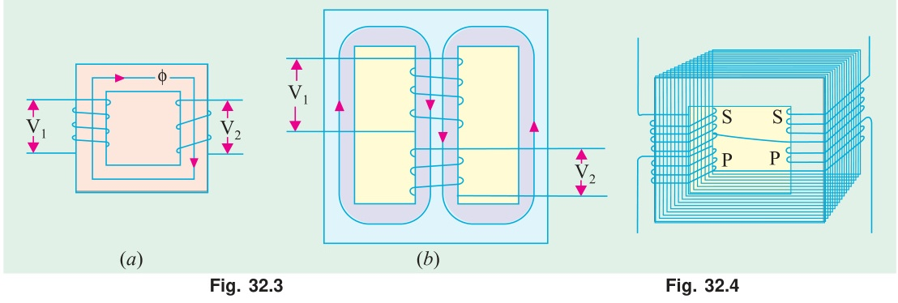

[← T-01: Fundamentals](T-01_Transformer_Fundamentals.md) | [🏠 Index](00_Index.md) | [T-03a: No-Load Operation →](T-03a_No-Load_Operation.md)

---

# T-02: Transformer Construction
> **Section:** A | **Priority:** 🟢 LOW | **Exam Frequency:** 1–2/7 years
> **Sources:** Theraja Ch-32 (Art. 32.2–32.4), VK Mehta Ch-7, Slides L-09 S03

## Why This Topic Matters

Construction questions appear rarely as standalone items (1–2 times in 7 years). But they show up as short 2–3 mark sub-questions: "why are cores laminated?" or "distinguish core type from shell type." These are free marks if you know them. Lamination purpose has been asked directly. Breathing was asked once (2019). Shell-type reverse winding economy was asked once (2019).

---

## 📝 Key Definitions

> **Core-type transformer:** "In core type transformers, the windings surround a considerable part of the core." — Theraja, Art. 32.2. The magnetic circuit forms a single rectangular loop with the windings placed on two opposite limbs.

> **Shell-type transformer:** "In shell-type transformers, the core surrounds a considerable portion of the windings." — Theraja, Art. 32.2. The magnetic circuit provides two parallel paths for the flux. The coils sit inside the core "shell."

> **Leakage flux:** "Some flux lines complete their path through air instead of through the core. This flux, which is not mutual to both windings, is called leakage flux." — Theraja, Art. 32.10. Leakage flux is proportional to the current causing it (air does not saturate).

---

## Core-Type vs Shell-Type Construction

| Feature | Core-Type | Shell-Type |
|:---|:---|:---|
| **Winding position** | Windings surround the core | Core surrounds the windings |
| **Magnetic circuit** | Single loop | Two parallel paths |
| **Flux path** | One path through core | Flux divides into two paths |
| **Cooling** | Better cooling (windings exposed) | Harder to cool (windings enclosed) |
| **Mechanical protection** | Less (windings outside) | Better (core protects windings) |
| **Use** | High voltage transformers | High current, low voltage |
| **Repair** | Easier (windings accessible) | Harder |

---

## Why Cores Are Laminated

"The eddy current loss is minimised by laminating the core, the laminations being insulated from each other by a light coat of core-plate varnish or by an oxide layer on the surface. The thickness of laminations varies from 0.35 mm for a frequency of 50 Hz to 0.5 mm for a frequency of 25 Hz." — Theraja, Art. 32.2

The iron core sits in an alternating magnetic field. This induces voltages inside the core itself (by Faraday's law). Since iron conducts electricity, these voltages drive circulating currents called **eddy currents**. Eddy currents cause $I^2R$ heating. This wastes energy.

**How lamination fixes this:** Cut the core into thin sheets (0.3–0.5 mm thick). Insulate each sheet from its neighbors with varnish or oxide coating. Now eddy currents are confined to each thin lamination.

**Why it works:** Eddy current power loss is proportional to the square of the conducting path thickness:

$$P_e = K_e f^2 B_m^2 t^2 V$$

If you replace one solid block of thickness $T$ with $n$ laminations of thickness $T/n$:

$$P_{e,\text{laminated}} = \frac{P_{e,\text{solid}}}{n}$$

Using 100 laminations cuts eddy current loss to 1/100 of the solid core value.

---

## Transformer Breathing

During operation, the transformer oil heats up and expands. When load decreases, the oil cools and contracts. This causes air to flow in and out of the tank.

**Problem:** Incoming air carries moisture. Moisture degrades the insulation strength of the oil.

**Solution:** A **conservator tank** (expansion chamber) sits above the main tank. Air enters through a **breather** filled with silica gel. The silica gel absorbs moisture before it reaches the oil. Fresh silica gel is blue. Saturated gel turns pink. Replace when pink.

---

## Shell-Type Reverse Winding Economy

In a 3-phase shell-type transformer, three cores sit side by side. For balanced 3-phase supply:

$$\Phi_A + \Phi_B + \Phi_C = 0 \text{ (at every instant)}$$

If the middle phase (B) winding is wound in the **reverse direction**, the effective flux in the middle limb is $-\Phi_B = \Phi_A + \Phi_C$. This makes the flux distribution more symmetric across all yokes.

**Result:** The yoke cross-sections can be reduced. Less iron is needed for the same power rating. This gives a "considerable economy in core material."

---

## 🏆 Golden Questions (Past Exam Archive)

### 🎯 Q1: What is the purpose of laminating the core in a transformer?
> **Appeared:** 2020 Q1(a) — 2 marks

**Full Answer:**

The purpose of laminating the core is to reduce **eddy current losses**. 

When the core is subjected to alternating flux, EMFs are induced in the core itself (by Faraday's law). Since iron is a conductor, these EMFs drive circulating currents called eddy currents, which cause $I^2R$ heating.

Eddy current loss formula: $P_e = K_e f^2 B_m^2 t^2 V$

where $t$ is the thickness of the conducting path. Since $P_e \propto t^2$, if we divide one solid block into $n$ thin insulated laminations, each of thickness $T/n$, eddy current loss reduces by a factor of $n$.

"The eddy current loss is minimised by laminating the core, the laminations being insulated from each other by a light coat of core-plate varnish or by an oxide layer on the surface." — Theraja

Typical lamination thickness: 0.35 mm for 50 Hz, 0.5 mm for 25 Hz.

Note: Lamination does NOT reduce hysteresis loss. Hysteresis loss is reduced by using high-grade silicon steel.

---

### 🎯 Q2: Justify: "Considerable economy is achieved in core material if the middle phase winding of a 3-phase shell-type transformer is wound in reverse direction."
> **Appeared:** 2019 Q3(b) — 4 marks

**Full Answer:**

In a 3-phase shell-type transformer, three single-phase "frames" are placed side by side. The three phase fluxes are $\Phi_A$, $\Phi_B$, $\Phi_C$, displaced by 120° in time. At every instant:

$$\Phi_A + \Phi_B + \Phi_C = 0$$

**Without reverse winding (all same direction):**

The yoke sections between adjacent frames carry flux that is the phasor sum of two phases. The middle yokes must be designed for the full peak flux of the unbalanced distribution. The peak yoke flux can be as high as $\Phi_m$ (the peak of one phase).

**With reverse winding on phase B:**

Reversing the B-phase winding makes its effective core flux $-\Phi_B$. By the constraint $\Phi_A + \Phi_B + \Phi_C = 0$, we get $-\Phi_B = \Phi_A + \Phi_C$. The flux in each yoke section becomes more balanced and symmetric. The peak flux in each yoke is reduced because the reversed middle-phase flux assists cancellation.

**Result:** Each yoke can have a smaller cross-section. Less iron is needed for the same power rating. This gives considerable economy in core material.

---

## ⚡ Exam Tips & Common Mistakes

1. **Don't confuse core-type and shell-type.** Core-type: windings surround core. Shell-type: core surrounds windings. The names are counterintuitive.
2. **Lamination reduces eddy current loss, not hysteresis loss.** Hysteresis loss depends on the B-H loop area and is reduced by using silicon steel, not by laminating.
3. **Breathing is a 1-mark filler question.** Know the conservator + silica gel breather system.

## 🔗 Related Topics

- [T-01: Fundamentals](T-01_Transformer_Fundamentals.md) — Transformer principle
- [T-11: Miscellaneous](T-11_Miscellaneous_Transformer.md) — Hysteresis and eddy current losses in detail
- [T-04: Equivalent Circuit](T-04_Equivalent_Circuit.md) — Leakage flux creates the circuit model

---

[← T-01: Fundamentals](T-01_Transformer_Fundamentals.md) | [🏠 Index](00_Index.md) | [T-03a: No-Load Operation →](T-03a_No-Load_Operation.md)
