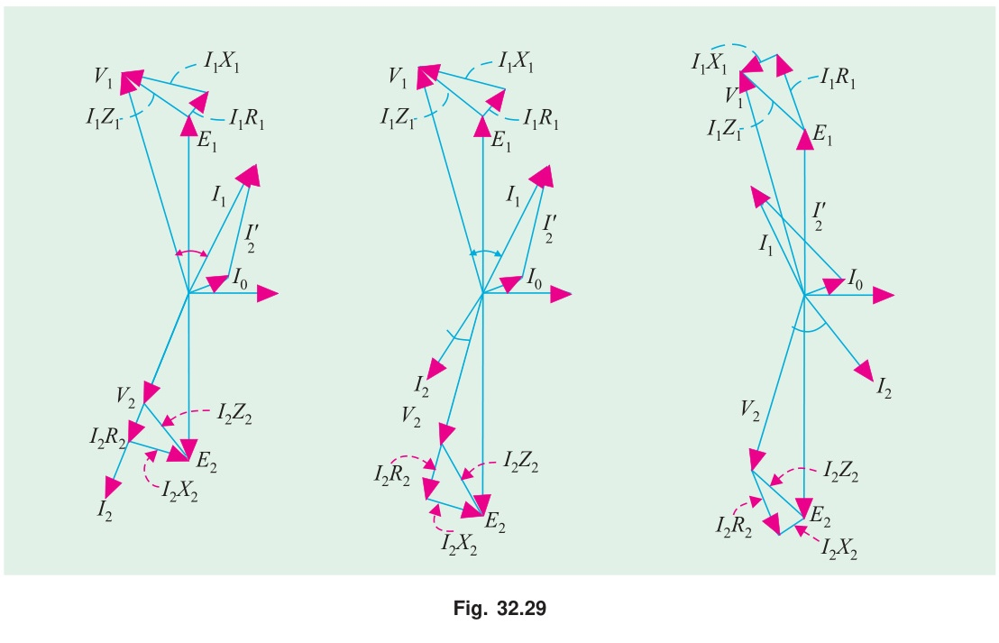
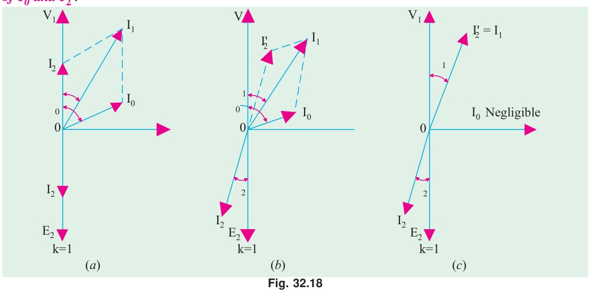

[← T-03a: No-Load Operation](T-03a_No-Load_Operation.md) | [🏠 Index](00_Index.md) | [T-04: Equivalent Circuit →](T-04_Equivalent_Circuit.md)

---

# T-03b: Phasor Diagrams Under Load
> **Section:** A | **Priority:** 🟠 HIGH | **Exam Frequency:** 4/7 years
> **Sources:** Theraja Ch-32 (Art. 32.10–32.15), VK Mehta Ch-7 (Art. 7.7–7.11), Slides L-09

## Why This Topic Matters

The loaded transformer phasor diagram was asked in 4/7 papers (2017, 2018, 2021, 2024). It appears as "draw the phasor diagram considering resistance and leakage reactance" (3–6 marks). In 2024, it was asked both for an ideal transformer (R-L load) and a practical transformer. This topic directly connects to voltage regulation (T-05).

---

## 📝 Key Definitions

> **Leakage flux:** "In practice, all the flux linked with the primary winding does not link the secondary winding. A portion of the flux completes its magnetic circuit through the air, and this portion is called leakage flux. The leakage flux links one winding but not the other." — VK Mehta, Art. 7.9. Leakage flux is proportional to the current causing it (air has constant permeability).

> **Leakage reactance ($X_1$, $X_2$):** "The alternating leakage flux $\Phi_{l1}$ induces an EMF $e_{l1}$ in the primary by Faraday's Law. Since leakage flux is proportional to current and in phase with it, the leakage EMF lags the current by 90°. An EMF that lags the driving current by 90° behaves exactly like the voltage drop across an inductor. So we model the primary leakage as a series inductive reactance $X_1 = 2\pi f L_{l1}$." — From Theraja Art. 32.10

> **Referred current ($I_2'$):** The secondary current reflected to the primary side: $I_2' = (N_2/N_1) I_2 = I_2/a$. "The primary draws this current to counteract the demagnetizing effect of the secondary current, maintaining constant core flux." — Theraja Art. 32.9

---

## Voltage Equations for a Practical Transformer

When a transformer operates under load, each winding has resistance and leakage reactance. Applying KVL:

**Primary side:**
$$\vec{V}_1 = -\vec{E}_1 + \vec{I}_1 R_1 + j\vec{I}_1 X_1$$

**Secondary side:**
$$\vec{V}_2 = \vec{E}_2 - \vec{I}_2 R_2 - j\vec{I}_2 X_2$$

**Current balance (KCL at primary junction):**
$$\vec{I}_1 = \vec{I}_0 + \vec{I}_2'$$

---

## Phasor Diagram for Lagging Power Factor (Practical Transformer)

### Step-by-Step Construction

**Step 1:** Draw $\vec{\Phi}_m$ horizontal as reference (along +X axis).

**Step 2:** Draw $\vec{E}_1$ and $\vec{E}_2$ pointing downward (lagging $\Phi_m$ by 90°).

**Step 3:** Draw $\vec{V}_2$ slightly above $\vec{E}_2$. The secondary current $\vec{I}_2$ lags $\vec{V}_2$ by $\phi_2$ (load pf angle).

**Step 4:** Add secondary drops to get $\vec{E}_2$:
- $\vec{I}_2 R_2$ parallel to $\vec{I}_2$ (resistive drop in phase with current)
- $j\vec{I}_2 X_2$ perpendicular to $\vec{I}_2$ (leading current by 90°)

**Step 5:** Draw $\vec{I}_0 = \vec{I}_w + \vec{I}_\mu$. $I_w$ in phase with $-\vec{E}_1$. $I_\mu$ in phase with $\vec{\Phi}_m$.

**Step 6:** Draw $\vec{I}_2'$ (reflected secondary current): same direction as $\vec{I}_2$, scaled by $N_2/N_1$.

**Step 7:** $\vec{I}_1 = \vec{I}_0 + \vec{I}_2'$ (phasor sum).

**Step 8:** Build $\vec{V}_1$ from $-\vec{E}_1$: add $\vec{I}_1 R_1$ (parallel to $I_1$) then $j\vec{I}_1 X_1$ (perpendicular, leading $I_1$ by 90°).

**Step 9:** Angle between $\vec{V}_1$ and $\vec{I}_1$ is $\phi_1$ (primary pf angle).

---

## Ideal Transformer on R-L Load

For an ideal transformer: $R_1 = R_2 = X_1 = X_2 = 0$, $I_0 = 0$.

$V_1 = E_1$, $V_2 = E_2$, no drops. Primary power factor equals load power factor ($\phi_1 = \phi_2$).

---

## 🏆 Golden Questions (Past Exam Archive)

### 🎯 Q1: Draw the phasor diagram of a transformer considering winding resistance and leakage reactance.
> **Appeared:** 2017 Q6(a) — 3 marks, 2018 Q1(c) — 2 marks, 2021 Q2(a) — 4 marks

**Full Answer:**

A practical transformer has winding resistances ($R_1$, $R_2$) and leakage reactances ($X_1$, $X_2$). The phasor diagram for lagging power factor load ($\cos\phi_2$) is constructed as follows:

**Reference:** Draw mutual flux $\vec{\Phi}_m$ along the horizontal axis.

**EMFs:** $\vec{E}_1$ and $\vec{E}_2$ lag $\vec{\Phi}_m$ by 90° (pointing downward). By Faraday's law, induced EMF lags flux by 90°.

**Secondary side:** Start with secondary terminal voltage $\vec{V}_2$. The load current $\vec{I}_2$ lags $\vec{V}_2$ by load angle $\phi_2$. Applying secondary KVL:

$$\vec{E}_2 = \vec{V}_2 + \vec{I}_2 R_2 + j\vec{I}_2 X_2$$

From the tip of $\vec{V}_2$: draw $\vec{I}_2 R_2$ parallel to $\vec{I}_2$ (resistive drop is always in phase with current), then draw $j\vec{I}_2 X_2$ perpendicular to $\vec{I}_2$ leading by 90° (inductive leakage drop always leads current by 90°). The vector sum reaches $\vec{E}_2$.

**Primary side:** $-\vec{E}_1$ points upward (opposite to $\vec{E}_1$). The no-load current $\vec{I}_0 = \vec{I}_w + \vec{I}_\mu$ where $I_w$ is in phase with $-\vec{E}_1$ and $I_\mu$ is in phase with $\vec{\Phi}_m$. The load component of primary current: $\vec{I}_2' = (N_2/N_1)\vec{I}_2$. Total primary current: $\vec{I}_1 = \vec{I}_0 + \vec{I}_2'$.

Applying primary KVL:

$$\vec{V}_1 = -\vec{E}_1 + \vec{I}_1 R_1 + j\vec{I}_1 X_1$$

From the tip of $-\vec{E}_1$: add $\vec{I}_1 R_1$ parallel to $\vec{I}_1$, then $j\vec{I}_1 X_1$ perpendicular to $\vec{I}_1$ (leading by 90°). The endpoint gives $\vec{V}_1$. The angle between $\vec{V}_1$ and $\vec{I}_1$ is the primary phase angle $\phi_1$.

---

### 🎯 Q2: Draw the phasor diagram of an R-L loaded ideal transformer, stating each step.
> **Appeared:** 2024 Q2(a) — 6 marks

**Full Answer:**

For an ideal transformer: $R_1 = R_2 = 0$, $X_1 = X_2 = 0$, $I_0 = 0$.

**Step 1:** Draw $\vec{\Phi}_m$ along horizontal axis as reference.

**Step 2:** $\vec{E}_1$ and $\vec{E}_2$ lag $\vec{\Phi}_m$ by 90° (point downward along $-Y$). Both are induced by the same mutual flux.

**Step 3:** Since there are no drops: $\vec{V}_1 = -\vec{E}_1$ (upward, opposite to $\vec{E}_1$). $\vec{V}_2 = \vec{E}_2$ (no secondary drops).

**Step 4:** The load is R-L (inductive). Secondary current $\vec{I}_2$ lags $\vec{V}_2$ by load angle $\phi_2$.

**Step 5:** Since $I_0 = 0$ (ideal), the primary current $\vec{I}_1 = \vec{I}_2' = (N_2/N_1)\vec{I}_2$. The direction of $\vec{I}_1$ is such that $\vec{I}_1$ is in antiphase with $\vec{I}_2$ (to satisfy $N_1 I_1 = N_2 I_2$ with opposing MMFs).

**Step 6:** The angle between $\vec{V}_1$ and $\vec{I}_1$ equals $\phi_2$. Primary power factor = load power factor. This is true only for ideal transformers.

Key observation: In an ideal transformer, $\phi_1 = \phi_2$ always. The transformer simply reflects the load power factor to the primary side.

---

### 🎯 Q3: Primary current numerical with phasor addition.
> **Appeared:** 2020 Q1(d) — 3 marks

**Full Answer:**

**Problem:** Transformer with turns ratio 4:1 step-down. No-load: 10 A at pf 0.2 lag. Secondary load: 200 A at 0.85 pf lag. Find primary current and power factor.

**No-load current components** (take $V_1$ as reference):

$$I_w = I_0 \cos\phi_0 = 10 \times 0.2 = 2.0 \text{ A}$$

$$I_\mu = I_0 \sin\phi_0 = 10 \times \sin(78.46°) = 10 \times 0.98 = 9.8 \text{ A}$$

**Referred secondary current:** $I_2' = I_2/a = 200/4 = 50$ A at 0.85 pf lag.

**Phasor addition** (taking $V_1$ as reference, lagging = negative quadrature):

| Component | In-phase (A) | Quadrature (A) |
|:---|---:|---:|
| $I_0$ | +2.0 | $-9.8$ |
| $I_2'$ | $+50 \times 0.85 = +42.5$ | $-50 \times 0.527 = -26.35$ |
| **$I_1$ total** | **+44.5** | **$-36.15$** |

$$I_1 = \sqrt{44.5^2 + 36.15^2} = \sqrt{1980 + 1307} = \sqrt{3287} = \boxed{57.3 \text{ A}}$$

$$\cos\phi_1 = \frac{44.5}{57.3} = \boxed{0.776 \text{ lagging}}$$

---

### 🎯 Q4: Equivalent circuit and complete vector diagram for lagging power factor.
> **Appeared:** 2018 Q1(c) — 2 marks

**Full Answer:**

See the exact equivalent circuit in [T-04: Equivalent Circuit](T-04_Equivalent_Circuit.md), Step 4. For the vector diagram, the construction is identical to Q1 above. The key elements to draw and label are:

1. **Exact equivalent circuit:** Primary series impedance ($R_1 + jX_1$) → shunt branch ($R_c \parallel jX_m$) across $E_1$ → ideal transformer → secondary series impedance ($R_2 + jX_2$) → load $Z_L$.

2. **Vector diagram for lagging pf:** Follow the 9-step construction in Q1. The secondary current $\vec{I}_2$ lags $\vec{V}_2$ by load angle $\phi_2$. Both resistive and reactive drops pull $V_2$ below $E_2$, giving positive voltage regulation.

---

## ⚡ Exam Tips & Common Mistakes

1. **Resistive drop is parallel to current. Reactive drop is perpendicular (leading) to current.** This is the most common error in phasor diagram construction.
2. **$\vec{I}_2'$ is in the same direction as $\vec{I}_2$.** The primary load component flows in the direction that cancels the secondary demagnetizing MMF.
3. **For an ideal transformer, $I_0 = 0$.** Don't draw the no-load current in an ideal transformer diagram.
4. **For phasor addition, break into components first.** Real part = $I\cos\phi$, imaginary part = $-I\sin\phi$ for lagging loads.

## 🔗 Related Topics

- [T-03a: No-Load Operation](T-03a_No-Load_Operation.md) — The phasor diagram without load
- [T-04: Equivalent Circuit](T-04_Equivalent_Circuit.md) — Circuit that produces these phasors
- [T-05: Voltage Regulation](T-05_Voltage_Regulation.md) — Quantifying the voltage drop shown here

---

[← T-03a: No-Load Operation](T-03a_No-Load_Operation.md) | [🏠 Index](00_Index.md) | [T-04: Equivalent Circuit →](T-04_Equivalent_Circuit.md)
