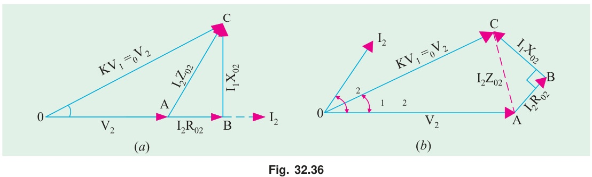

[← T-04: Equivalent Circuit](T-04_Equivalent_Circuit.md) | [🏠 Index](00_Index.md) | [T-06a: OC Test →](T-06a_OC_Test.md)

---

# T-05: Voltage Regulation
> **Section:** A | **Priority:** 🔴 MUST | **Exam Frequency:** 5/7 years
> **Sources:** Theraja Ch-32 (Art. 32.22), VK Mehta Ch-7 (Art. 7.16), Slides L-10

## Why This Topic Matters

Voltage regulation appeared in 5/7 papers (2018, 2019, 2021, 2023, 2024). The pattern is consistent: "define VR and derive the approximate formula for lagging, unity, and leading power factors." Sometimes a numerical follows using OC/SC test data.

---

## 📝 Key Definitions

> **Voltage Regulation:** "The voltage regulation of a transformer is defined as the change in secondary terminal voltage from no-load to full-load, expressed as a percentage of the full-load secondary terminal voltage, with primary voltage held constant." — VK Mehta, Art. 7.16
>
> $$\% \text{VR} = \frac{V_{2(NL)} - V_{2(FL)}}{V_{2(FL)}} \times 100 = \frac{E_2 - V_2}{V_2} \times 100$$

> **Good regulation** means small VR%. A perfect transformer has 0% VR. Typical power transformers have 2–5% VR.

---

## The Approximate VR Formula

Using the approximate voltage drop expression (VK Mehta, Art. 7.16):

$$\boxed{\% \text{VR} = \frac{I_2 R_{02}\cos\phi_2 \pm I_2 X_{02}\sin\phi_2}{V_2} \times 100}$$

Use $+$ for **lagging** pf (inductive load), $-$ for **leading** pf (capacitive load).

Alternatively, in fractional (percentage) form:

$$\% \text{VR} = v_r \cos\phi_2 \pm v_x \sin\phi_2$$

where $v_r = (I_2 R_{02}/V_2) \times 100$ and $v_x = (I_2 X_{02}/V_2) \times 100$.

---

## Physical Understanding

| PF Case | What Happens | VR Sign |
|:---|:---|:---|
| **Lagging** (inductive) | Both $IR$ and $IX$ drops reduce $V_2$. Reactive drop adds to voltage depression. | Positive (large) |
| **Unity** (resistive) | Only $IR$ drop matters. Reactive drop is perpendicular, barely changes magnitude. | Positive (small) |
| **Leading** (capacitive) | Reactive drop acts in voltage-boosting direction. Can overcome $IR$ drop. | Can be negative |

---

## 🏆 Golden Questions (Past Exam Archive)

### 🎯 Q1: What is voltage regulation? Derive the expression for VR with neat phasor diagrams for lagging, unity, and leading pf loads.
> **Appeared:** 2019 Q2(b) — 4 marks

**Full Answer:**

**Definition:** "The voltage regulation of a transformer is the change in secondary terminal voltage from no-load to full-load, expressed as a percentage of full-load secondary terminal voltage, with primary voltage held constant." — VK Mehta

$$\% \text{VR} = \frac{E_2 - V_2}{V_2} \times 100$$

**Derivation:** From the simplified equivalent circuit, $\vec{V}_1 = \vec{V}_2' + \vec{I}_2'(R_{01} + jX_{01})$. At no-load, $V_{2,NL} = V_1$ (referred). At full-load, $V_{2,FL} = V_2'$. The regulation depends on the impedance drop.

Take $\vec{V}_2$ as reference. Load current $\vec{I}_2 = I_2(\cos\phi - j\sin\phi)$ for lagging load.

The voltage drop across series impedance:

$$\vec{I}_2(R_{02} + jX_{02}) = I_2(\cos\phi - j\sin\phi)(R_{02} + jX_{02})$$

The component of this drop in phase with $\vec{V}_2$ (which changes the voltage magnitude):

$$\Delta V_2 \approx I_2 R_{02}\cos\phi + I_2 X_{02}\sin\phi \quad \text{(lagging pf)}$$

$$\boxed{\% \text{VR} = \frac{I_2(R_{02}\cos\phi + X_{02}\sin\phi)}{V_2} \times 100 \quad \text{(lagging)}}$$

**For leading pf:** The load current leads $V_2$. The reactive drop $jI_2X_{02}$ now acts in the voltage-boosting direction:

$$\boxed{\% \text{VR} = \frac{I_2(R_{02}\cos\phi - X_{02}\sin\phi)}{V_2} \times 100 \quad \text{(leading)}}$$

This can be **negative**, meaning $V_{2,FL} > V_{2,NL}$. The terminal voltage actually rises under capacitive load. Capacitor banks on transmission lines exploit this principle.

**For unity pf:** $\phi = 0$, $\sin\phi = 0$:

$$\boxed{\% \text{VR} = \frac{I_2 R_{02}}{V_2} \times 100 \quad \text{(unity)}}$$

Only the resistive drop matters. VR is small and positive.

---

### 🎯 Q2: VR numerical — 3300/220V, 50 kVA transformer with given R and X values.
> **Practice problem (not from a past paper)**

**Full Answer:**

Given: 3300/220V, 50 Hz, 50 kVA. $R_1 = 3.96\,\Omega$, $R_2 = 0.0176\,\Omega$, $X_1 = 15.8\,\Omega$, $X_2 = 0.07\,\Omega$. Find VR at 0.8 pf lagging.

**Turns ratio:** $a = 3300/220 = 15$

**Refer to primary:**

$$R_{01} = R_1 + a^2 R_2 = 3.96 + 225 \times 0.0176 = 3.96 + 3.96 = 7.92\,\Omega$$

$$X_{01} = X_1 + a^2 X_2 = 15.8 + 225 \times 0.07 = 15.8 + 15.75 = 31.55\,\Omega$$

**Rated primary current:** $I_1 = S/V_1 = 50000/3300 = 15.15$ A

**VR at 0.8 pf lag** ($\cos\phi = 0.8$, $\sin\phi = 0.6$):

$$\text{VR\%} = \frac{I_1(R_{01}\cos\phi + X_{01}\sin\phi)}{V_1} \times 100$$

$$= \frac{15.15(7.92 \times 0.8 + 31.55 \times 0.6)}{3300} \times 100 = \frac{15.15 \times 25.27}{3300} \times 100$$

$$= \frac{382.8}{3300} \times 100 = \boxed{11.6\%}$$

---

### 🎯 Q3: VR from SC test data — 20 kVA, 2400/240V transformer.
> **Appeared:** 2021 Q2(c) — 4 marks

**Full Answer:**

Given: SC test on HV side: $V_{sc} = 72$ V, $I_{sc}$ = rated, $W_{sc} = 275$ W.

Rated HV current: $I_1 = 20000/2400 = 8.33$ A

$R_{01} = W_{sc}/I_{sc}^2 = 275/69.39 = 3.964\,\Omega$

$Z_{01} = V_{sc}/I_{sc} = 72/8.33 = 8.643\,\Omega$

$X_{01} = \sqrt{8.643^2 - 3.964^2} = \sqrt{74.70 - 15.71} = 7.681\,\Omega$

VR at 0.8 pf lag:

$$\text{VR\%} = \frac{8.33(3.964 \times 0.8 + 7.681 \times 0.6)}{2400} \times 100 = \frac{8.33 \times 7.78}{2400} \times 100 = \boxed{2.70\%}$$

### 🎯 Q4: Define voltage regulation of transformer.
> **Appeared:** 2024 Q3(a) — 2 marks

**Full Answer:**

The voltage regulation of a transformer is the change in secondary terminal voltage from no-load to full-load, expressed as a percentage of the full-load secondary terminal voltage, with the primary voltage held constant. — VK Mehta, Art. 7.16

$$\% \text{VR} = \frac{V_{2(NL)} - V_{2(FL)}}{V_{2(FL)}} \times 100 = \frac{E_2 - V_2}{V_2} \times 100$$

On open circuit $I_2 = 0$, so there are no winding drops and $V_{2(NL)} = E_2$. Good regulation means small VR%. A perfect transformer has 0%. Typical power transformers sit at 2–5%.

**Sign by load type:**

- **Lagging pf** (inductive): both $I_2R$ and $I_2X$ drops reduce $V_2$, so VR is positive and largest.
- **Unity pf**: only the resistive drop counts, so VR is small and positive.
- **Leading pf** (capacitive): the reactive drop boosts $V_2$ and can overcome $IR$. VR can be negative, meaning the terminal voltage rises on load. Capacitor banks exploit this.

---

### 🎯 Q5: 33/6.6 kV Δ/Y, 2-MVA, 3-φ transformer. $R_1 = 8\,\Omega/ph$, $R_2 = 0.08\,\Omega/ph$, %Z = 7%. Find the secondary voltage at full load, 0.75 pf lagging.
> **Appeared:** 2023 Q4(c) — 4 marks

**Full Answer:**

**Step 1. Per-phase quantities.** Primary delta at 33 kV, so $V_{1,ph} = 33000$ V. Secondary star at 6.6 kV line, so $V_{2,ph} = 6600/\sqrt{3} = 3810.5$ V. Full-load secondary current (star, line = phase):
$$I_2 = \frac{2 \times 10^6}{\sqrt{3} \times 6600} = 174.95\text{ A}$$

**Step 2. Per-phase transformation ratio.**
$$K = \frac{3810.5}{33000} = 0.11547, \qquad K^2 = 0.013333$$

**Step 3. Total resistance referred to the secondary.**
$$R_{02} = R_2 + K^2 R_1 = 0.08 + 0.013333 \times 8 = 0.08 + 0.10667 = 0.1867\ \Omega$$

**Step 4. Total impedance from the 7% figure.**
$$Z_{02} = \frac{0.07 \times 3810.5}{174.95} = 1.5246\ \Omega$$

**Step 5. Leakage reactance.**
$$X_{02} = \sqrt{1.5246^2 - 0.1867^2} = \sqrt{2.3244 - 0.0348} = 1.5131\ \Omega$$

**Step 6. Voltage drop at 0.75 pf lagging.** $\cos\phi = 0.75$, $\sin\phi = \sqrt{1 - 0.5625} = 0.6614$:
$$\Delta V = 174.95\,(0.1867 \times 0.75 + 1.5131 \times 0.6614) = 174.95 \times 1.1409 = 199.6\text{ V per phase}$$

**Step 7. Secondary voltage on load.**
$$V_{2,ph} = 3810.5 - 199.6 = 3610.9\text{ V}, \qquad V_{2,\text{line}} = \sqrt{3} \times 3610.9 = 6254\text{ V}$$

$$\boxed{V_2 = 6254\text{ V} \approx 6.25\text{ kV (line)}, \quad \text{regulation} = 5.24\%}$$

> [!info] Percentage cross-check
> $\%R = (174.95 \times 0.1867/3810.5) \times 100 = 0.857\%$, so $\%X = \sqrt{7^2 - 0.857^2} = 6.947\%$.
> $\%\text{Reg} = 0.857 \times 0.75 + 6.947 \times 0.6614 = 5.24\%$, giving $V_2 = 6600(1 - 0.0524) = 6254$ V. Same answer.

---

---

## ⚡ Exam Tips & Common Mistakes

1. **Sign convention: $+$ for lagging, $-$ for leading.** Lagging = inductive = voltage drops = positive VR.
2. **Use consistent units.** If parameters are on primary side, use $V_1$ and $I_1$.
3. **Negative VR is physically real.** At leading pf, the secondary voltage really does increase from no-load to full-load.
4. **VR is defined as percentage of full-load voltage, not no-load voltage.**

## 🔗 Related Topics

- [T-04: Equivalent Circuit](T-04_Equivalent_Circuit.md) — The circuit from which VR is derived
- [T-06b: SC Test](T-06b_SC_Test.md) — Finds $R_{01}$, $X_{01}$ used in VR formula

---

[← T-04: Equivalent Circuit](T-04_Equivalent_Circuit.md) | [🏠 Index](00_Index.md) | [T-06a: OC Test →](T-06a_OC_Test.md)
