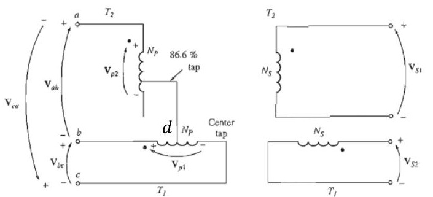
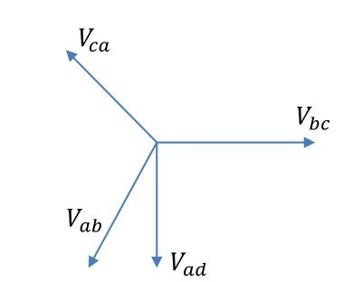

[← T-07b: Open Delta](T-07b_Open_Delta.md) | [🏠 Index](00_Index.md) | [T-09: Vector Groups →](T-09_Vector_Groups.md)

---

# T-08: Scott (T-T) Connection
> **Section:** A | **Priority:** 🟡 MEDIUM | **Exam Frequency:** 3/7 years
> **Sources:** Theraja Ch-33 (Art. 33.10), VK Mehta Ch-7 (Art. 7.37), Slides L-11 S20–S24

## Why This Topic Matters

The Scott connection appeared in 3/7 papers (2018, 2019, 2024). When asked, it carries 4-6 marks. The question is always: "Explain the Scott connection with a diagram" and sometimes includes a numerical.

---

## 📝 Key Definitions

> **Scott (T-T) connection:** "The Scott connection is a means of converting a 3-phase supply to a 2-phase supply, or vice versa, using two single-phase transformers. One transformer is called the 'main' (or 'T') transformer and the other is called the 'teaser' transformer. The teaser primary has $\sqrt{3}/2$ (= 86.6%) of the main transformer primary turns." — VK Mehta, Art. 7.37

---

## How the Scott Connection Works

**Main transformer:** Primary connected between phases A and B (full line voltage $V_{AB}$). Secondary provides one phase of the 2-phase output.

**Teaser transformer:** Primary connected from the midpoint (M) of the main transformer primary to phase C. The voltage from M to C:

$$V_{MC} = \frac{\sqrt{3}}{2} \times V_L$$

This is the height of the equilateral voltage triangle. The teaser primary needs $\frac{\sqrt{3}}{2} = 86.6\%$ of the main transformer turns.

**Why the outputs are 90° apart:**

$V_{AB}$ is a line voltage. $V_{MC}$ is perpendicular to $V_{AB}$ in the phasor diagram (midpoint M bisects AB, so MC is the perpendicular bisector). The two secondary voltages inherit this 90° separation. Result: balanced 2-phase output.

---

## 🏆 Golden Questions (Past Exam Archive)

### 🎯 Q1: Explain the Scott connection with necessary diagrams.
> **Appeared:** 2018 Q4(a), 2024 Q4(d) — 4 marks

**Full Answer:**

The Scott (T-T) connection converts 3-phase power to 2-phase power using two single-phase transformers.

**Two transformers required:**

**(1) Main transformer:** Standard transformer. Primary connected between two phases (e.g., A and B). Full line voltage $V_{AB}$ appears across its primary.

**(2) Teaser transformer:** Primary connected from the midpoint (M) of the main transformer primary to the third phase (C). Its primary has $\sqrt{3}/2 = 86.6\%$ of the main transformer's turns, because the voltage from midpoint M to C is $V_{MC} = (\sqrt{3}/2) V_L$ (the height of the equilateral voltage triangle).

**Why 90° separation:** In a balanced 3-phase system, the voltage from the midpoint of one line voltage to the third phase is always perpendicular to that line voltage. $V_{AB}$ is horizontal in the phasor diagram, $V_{MC}$ is vertical. The two secondaries inherit this 90° separation, producing a balanced 2-phase output.

**Applications:** Electric arc furnace power supplies, powering 2-phase induction motors, converting 2-phase to 3-phase (reverse operation is possible because transformers are reciprocal devices).

---

### 🎯 Q2: Can you convert 3-phase to 2-phase or vice versa? If yes, explain.
> **Appeared:** 2019 Q4(b) — 4 marks

**Full Answer:**

Yes. This is done using the **Scott (T-T) connection.**

Two single-phase transformers are needed:

**(1) Main transformer:** Primary connected between two phases of the 3-phase supply (e.g., lines A and B). Secondary provides one phase of the 2-phase output.

**(2) Teaser transformer:** Primary connected from the mid-point of the main transformer primary to the third line (C). The teaser primary has $\sqrt{3}/2$ (86.6%) of the main transformer's turns. Secondary provides the second phase of the 2-phase output, exactly 90° displaced from the first.

**Why it works:** The two primary voltages are 90° apart geometrically in the phasor diagram. The line-to-midpoint voltage ($V_{MC}$) is perpendicular to the line-to-line voltage ($V_{AB}$) in a balanced 3-phase system. This 90° separation transfers to the two secondary voltages, giving a balanced 2-phase output.

**Reverse (2-phase to 3-phase):** Connect the two-phase supply to the secondaries. The 3-phase supply comes from the primaries. The same transformation works in reverse because transformers are reciprocal devices.

---

### 🎯 Q3: Two T-connected transformers supply 440V, 33 kVA balanced load from 3300V 3-phase. Find ratings.
> **Appeared:** 2018 Q4(b) — 4 marks

**Full Answer:**

Given: Supply $V_L = 3300$ V (3-phase). Load: 440V, 33 kVA (2-phase).

**Secondary voltages (2-phase, equal):** $V_{2} = 440$ V per phase.

**Secondary current per phase:** $I_2 = (S/2)/V_2 = (33000/2)/440 = \boxed{37.5 \text{ A}}$

**Main transformer primary:** Connected across A-B: $V_{1,\text{main}} = V_L = 3300$ V

$$I_{1,\text{main}} = \frac{S/2}{V_{1,\text{main}}} = \frac{16500}{3300} = \boxed{5.0 \text{ A}}$$

**Teaser transformer primary:** Connected from midpoint of AB to C:

$$V_{1,\text{teaser}} = \frac{\sqrt{3}}{2} \times V_L = 0.866 \times 3300 = \boxed{2858 \text{ V}}$$

$$I_{1,\text{teaser}} = \frac{S/2}{V_{1,\text{teaser}}} = \frac{16500}{2858} = \boxed{5.77 \text{ A}}$$

**kVA ratings:**

$$\text{Main} = 3300 \times 5.0 = \boxed{16.5 \text{ kVA}}$$

$$\text{Teaser} = 2858 \times 5.77 = \boxed{16.5 \text{ kVA}}$$

Both transformers have the same kVA rating. Total = 33 kVA ✓

---

## ⚡ Exam Tips & Common Mistakes

1. **Teaser has $\sqrt{3}/2$ = 86.6% turns, not 50%.** This is the most common error.
2. **Both transformers have the same kVA rating.** The teaser has fewer turns but higher current.
3. **The 90° comes from geometry, not from any special winding.**

## 🔗 Related Topics

- [T-07a: 3-Phase Connections](T-07a_3Phase_Connections.md) — Standard 3-phase configurations
- [T-10: Auto-Transformer](T-10_Auto_Transformer.md) — Another special transformer type

---

[← T-07b: Open Delta](T-07b_Open_Delta.md) | [🏠 Index](00_Index.md) | [T-09: Vector Groups →](T-09_Vector_Groups.md)
