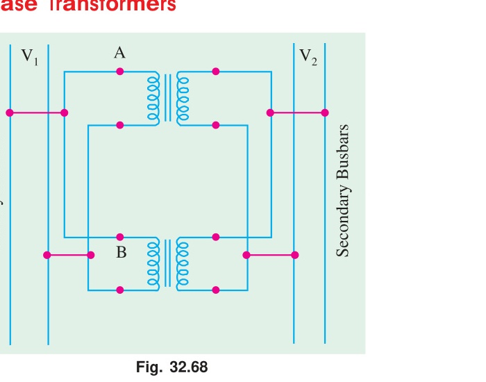

[← T-08: Scott Connection](T-08_Scott_Connection.md) | [🏠 Index](00_Index.md) | [T-10: Auto-Transformer →](T-10_Auto_Transformer.md)

---

# T-09: Vector Groups & Parallel Operation
> **Section:** A | **Priority:** 🟡 MEDIUM | **Exam Frequency:** 3/7 years
> **Sources:** Theraja Ch-33 (Art. 33.11–33.14), VK Mehta Ch-7 (Art. 7.34–7.35), Slides L-11 S25–S30

## Why This Topic Matters

Vector group notation was asked in 3/7 papers (2019, 2021, 2023). Parallel operation conditions appeared in 3/7 papers (2017, 2021, 2023). These are short-answer theory questions worth 3-4 marks each.

---

## 📝 Key Definitions

> **Vector group:** "A standardized notation (IEC) that describes the connection of the windings and the phase displacement between the primary and secondary voltages of a three-phase transformer. The notation consists of: an uppercase letter for the HV winding connection (Y, D, or Z), a lowercase letter for the LV winding connection (y, d, or z), optionally 'n' for neutral availability, and a clock number indicating the phase displacement (each hour = 30°)." — Theraja, Ch-33

> **Parallel operation of transformers:** "Two or more transformers are said to operate in parallel when their primaries are connected to the same supply buses and their secondaries feed a common load. For satisfactory parallel operation, several conditions must be fulfilled." — VK Mehta, Art. 7.34

---

## Reading Vector Group Notation

**Example: Dyn11**

| Symbol | Meaning |
|:---|:---|
| **D** | HV (primary) winding: Delta |
| **y** | LV (secondary) winding: Star (Y) |
| **n** | Neutral conductor available on LV side |
| **11** | Phase displacement = 11 × 30° = 330° = -30° |

The "11" means: if the HV voltage phasor points to 12 o'clock, the LV voltage phasor points to 11 o'clock.

---

## Conditions for Parallel Operation

### Five Conditions:

1. **Same voltage ratio.** Otherwise circulating current flows at no-load.
2. **Same polarity.** Reversed polarity causes short-circuit.
3. **Same phase sequence.** Reversed sequence creates phase difference.
4. **Same vector group (zero phase displacement).** Mismatched groups cause large circulating currents.
5. **Same per-unit impedance.** Otherwise load sharing is disproportionate.

---

## 🏆 Golden Questions (Past Exam Archive)

### 🎯 Q1: What does the vector group of a transformer indicate? What does "Dyn5" represent?
> **Appeared:** 2021 Q8(b) — 3 marks

**Full Answer:**

**Vector group** is a standardized notation that tells you:
1. The connection of the primary (HV) winding: uppercase letter (Y = Star, D = Delta, Z = Zigzag).
2. The connection of the secondary (LV) winding: lowercase letter (y, d, z).
3. Whether a neutral is available on the LV side: letter 'n'.
4. The phase displacement between primary and secondary voltages: clock notation (number × 30°).

**"Dyn5" means:**
- **D** → Primary winding connected in Delta (Δ)
- **y** → Secondary winding connected in Star (Y)
- **n** → Neutral conductor available on the secondary side
- **5** → Phase displacement = 5 × 30° = **150°** (secondary voltage lags primary by 150°)

In clock notation: 12 o'clock = 0°, 1 o'clock = 30°, 5 o'clock = 150°. So Dyn5 means the secondary star voltage phasor points to "5 o'clock" relative to the primary delta voltage phasor at "12 o'clock."

---

### 🎯 Q2: State the conditions for parallel operation of two 3-phase transformers.
> **Appeared:** 2023 Q4(a) — 3 marks (plus 2017 Q7(b), 2021 Q4(a) in earlier papers)
>
> Note: 2023 Q4(b) was the closed-Δ vs open-Δ kVA proof, which sits in [T-07b](T-07b_Open_Delta.md).

**Full Answer:**

For satisfactory parallel operation of two (or more) 3-phase transformers, **all five** of the following conditions must be satisfied:

**(1) Same voltage ratio:** The primary and secondary rated voltages must be identical. If voltage ratios differ, a circulating current flows in the secondary loop even at no load. This circulating current wastes energy and may overload one transformer.

**(2) Same polarity:** Corresponding terminals must have the same instantaneous polarity. If polarity is reversed, the two secondary voltages add instead of cancelling, causing a short-circuit current of enormous magnitude.

**(3) Same phase sequence:** Both transformers must be connected to the same phase sequence (R-Y-B). A reversed sequence causes a large phase difference between secondary voltages.

**(4) Same vector group (zero phase displacement):** The vector group numbers must be the same. If the phase displacements differ (e.g., one is Yd11 and the other is Dy1), the secondary voltages will have a phase difference, causing circulating currents even at no load.

**(5) Same per-unit (or percentage) impedance:** For proportional load sharing, the per-unit impedances must be equal. If one transformer has lower impedance, it takes a disproportionately large share of the load and may overload while the other runs light.

---

### 🎯 Q3: Can Yd11 operate in parallel with Dy1?
> **Appeared:** 2019 Q3(c) — 4 marks

**Full Answer:**

**Vector group numbers:**

- Yd11: Clock number 11 = 11 × 30° = 330° of lag, which is the same as 30° of lead. Secondary (LV) **leads** primary by 30°.
- Dy1: Clock number 1 = 1 × 30° = 30° of lag. Secondary (LV) **lags** primary by 30°.

**Phase difference between their secondaries:**

$$330° - 30° = 300° \quad \text{(or equivalently } 360° - 300° = 60° \text{ lag)}$$

This is a **60° phase displacement** between the secondary voltages of the two transformers.

For parallel operation, the secondary voltages must be exactly in phase (same vector group number). A 60° difference means that even at no load, a very large circulating current would flow: $I_{circ} = \Delta V / (Z_1 + Z_2)$ where $\Delta V$ is the phasor difference of the two secondary voltages. For 60° displacement, $\Delta V$ is approximately equal to the rated voltage itself.

**Conclusion: Direct parallel operation is NOT possible.** The vector groups are incompatible.

A phase-shifting transformer or rearranging external connections can sometimes compensate for a 30° difference, but a 60° difference is generally not bridgeable by simple reconnection.

---

## ⚡ Exam Tips & Common Mistakes

1. **Clock number × 30° = phase displacement.** Don't forget the multiplication.
2. **Uppercase = HV side, lowercase = LV side.**
3. **For parallel operation, ALL 5 conditions must be satisfied.**
4. **Same group number, not same group family.** Yy0 can parallel with Dd0, but Yd11 cannot parallel with Dy1.

## 🔗 Related Topics

- [T-07a: 3-Phase Connections](T-07a_3Phase_Connections.md) — The connections that create different vector groups
- [T-07b: Open Delta](T-07b_Open_Delta.md) — Special case of Δ-Δ

---

[← T-08: Scott Connection](T-08_Scott_Connection.md) | [🏠 Index](00_Index.md) | [T-10: Auto-Transformer →](T-10_Auto_Transformer.md)
