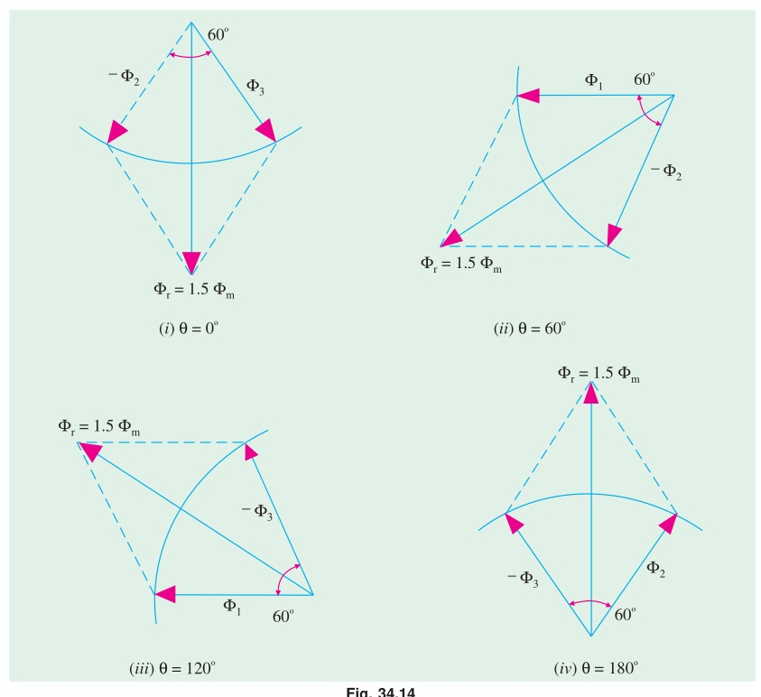
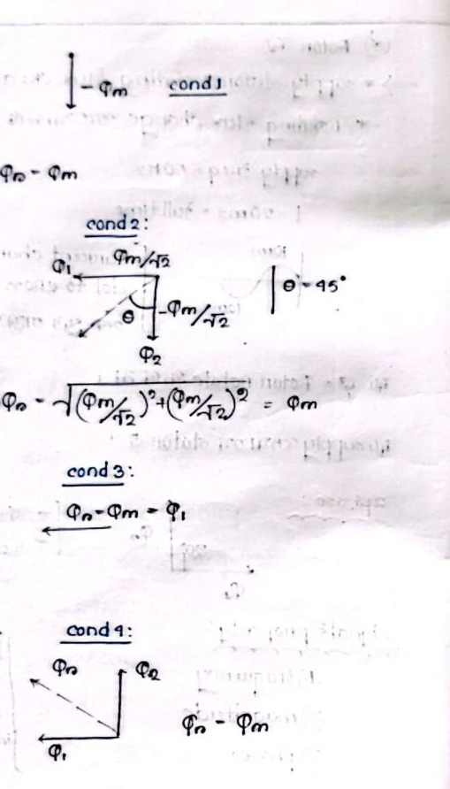

[← T-11: Miscellaneous Transformer Topics](T-11_Miscellaneous_Transformer.md) | [🏠 Index](00_Index.md) | [T-13: Slip & Basics →](T-13_Slip_and_Basics.md)

---

# T-12: Rotating Magnetic Field (RMF)
> **Section:** B | **Priority:** 🔴 MUST | **Exam Frequency:** 5/7 years
> **Sources:** Theraja Ch-34 (Art. 34.6-34.8), VK Mehta Ch-8 (Art. 8.3-8.4), Slides L-01, L-02

## Why This Topic Matters

The 3-phase RMF proof appeared in 5 out of 7 papers (2017, 2018, 2020, 2021, 2024). It is the foundation of every induction motor. Without a rotating field, there is no torque. This proof carries 5-8 marks and is one of the highest-scoring derivations in Section B. The 2-phase RMF proof appeared in 2021.

---

## 📝 Key Definitions

> **Induction Motor:** "In a.c. motors, the rotor does not receive electric power by conduction but by induction in exactly the same way as the secondary of a 2-winding transformer receives its power from the primary. That is why such motors are known as induction motors. In fact, an induction motor can be treated as a rotating transformer i.e. one in which primary winding is stationary but the secondary is free to rotate." — Theraja, Art. 34.2

> **Rotating Magnetic Field:** "When stationary coils, wound for two or three phases, are supplied by two or three-phase supply respectively, a uniformly-rotating (or revolving) magnetic flux of constant value is produced." — Theraja, Art. 34.6

> **Synchronous Speed:** "The speed at which the rotating magnetic field revolves is called the synchronous speed ($N_s$). For a machine with $P$ poles: $N_s = 120f/P$ r.p.m." — VK Mehta, Art. 8.3

---

## How a 3-Phase Supply Creates a Rotating Field

Three stator windings are placed 120° apart in space. Each carries current that is 120° apart in time. Each winding creates a pulsating flux along its own axis. The vector sum of these three pulsating fluxes is a rotating flux of constant magnitude.

The key insight: no individual flux rotates. Each flux pulsates along a fixed axis. But the vector sum sweeps around the stator at synchronous speed.

---

## 3-Phase RMF: Mathematical Proof

This is the most important proof in Section B. Know every step.

**Setup:** Three windings 120° apart in space. Balanced 3-phase supply:

$$\Phi_R = \Phi_m\sin\omega t$$

$$\Phi_Y = \Phi_m\sin(\omega t - 120°)$$

$$\Phi_B = \Phi_m\sin(\omega t + 120°)$$

**Step 1: Resolve into X and Y components.**

Take R-phase axis as the +X reference. Y-phase axis is at 120° from X. B-phase axis is at 240° from X.

**X-component:**

$$\Phi_x = \Phi_R\cos 0° + \Phi_Y\cos 120° + \Phi_B\cos 240°$$

$$= \Phi_m\sin\omega t + \Phi_m\sin(\omega t - 120°)\left(-\frac{1}{2}\right) + \Phi_m\sin(\omega t + 120°)\left(-\frac{1}{2}\right)$$

**Step 2: Simplify using trig identity** $\sin(A-B) + \sin(A+B) = 2\sin A\cos B$:

$$\Phi_x = \Phi_m\sin\omega t - \frac{1}{2}\Phi_m \cdot 2\sin\omega t\cos 120°$$

$$= \Phi_m\sin\omega t - \frac{1}{2}\Phi_m \cdot 2\sin\omega t \cdot \left(-\frac{1}{2}\right)$$

$$= \Phi_m\sin\omega t + \frac{1}{2}\Phi_m\sin\omega t = \frac{3}{2}\Phi_m\sin\omega t$$

**Y-component:**

$$\Phi_y = \Phi_Y\sin 120° + \Phi_B\sin 240°$$

$$= \Phi_m\sin(\omega t - 120°)\cdot\frac{\sqrt{3}}{2} + \Phi_m\sin(\omega t + 120°)\cdot\left(-\frac{\sqrt{3}}{2}\right)$$

Using $\sin(A-B) - \sin(A+B) = -2\cos A\sin B$:

$$= \frac{\sqrt{3}}{2}\Phi_m \cdot (-2\cos\omega t\sin 120°) = \frac{\sqrt{3}}{2}\Phi_m \cdot (-2\cos\omega t) \cdot \frac{\sqrt{3}}{2}$$

$$= -\frac{3}{2}\Phi_m\cos\omega t$$

**Step 3: Find magnitude.**

$$\Phi_r = \sqrt{\Phi_x^2 + \Phi_y^2} = \sqrt{\left(\frac{3}{2}\Phi_m\right)^2(\sin^2\omega t + \cos^2\omega t)}$$

$$\boxed{\Phi_r = \frac{3}{2}\Phi_m = 1.5\Phi_m = \text{constant}}$$

**Step 4: Find rotation speed.**

$$\theta = \tan^{-1}\!\left(\frac{\Phi_y}{\Phi_x}\right) = \tan^{-1}\!\left(\frac{-\cos\omega t}{\sin\omega t}\right) = \omega t - 90°$$

$$\frac{d\theta}{dt} = \omega = 2\pi f \implies N_s = \frac{120f}{P} \text{ rpm}$$

**Conclusion:** The 3-phase supply produces a rotating magnetic field of constant magnitude $1.5\Phi_m$, rotating at synchronous speed $N_s = 120f/P$ rpm. *(Proved)*

---

## 2-Phase RMF: Mathematical Proof

**Setup:** Two windings placed 90° apart in space. Balanced 2-phase supply:

$$\Phi_a = \Phi_m\sin\omega t \quad \text{(along X-axis)}$$

$$\Phi_b = \Phi_m\sin(\omega t - 90°) = -\Phi_m\cos\omega t \quad \text{(along Y-axis)}$$

**Magnitude:**

$$\Phi_r = \sqrt{\Phi_a^2 + \Phi_b^2} = \sqrt{\Phi_m^2\sin^2\omega t + \Phi_m^2\cos^2\omega t} = \Phi_m = \text{constant}$$

**Space angle:**

$$\theta = \tan^{-1}\!\left(\frac{-\cos\omega t}{\sin\omega t}\right) = \omega t - 90°$$

$$\frac{d\theta}{dt} = \omega \implies N_s = \frac{120f}{P} \text{ rpm}$$

**Result:** 2-phase produces RMF of magnitude $\Phi_m$ at synchronous speed. Compare: 3-phase produces $1.5\Phi_m$ (50% stronger).

---

## Reversing Direction of Rotation

To reverse the direction of rotation of a 3-phase IM, interchange any two of the three supply lines. This changes the phase sequence from R-Y-B to R-B-Y. The rotating field now rotates in the opposite direction.

---

## 🏆 Golden Questions (Past Exam Archive)

### 🎯 Q1: Prove that a 3-phase supply produces a rotating magnetic field of constant magnitude $1.5\Phi_m$ at synchronous speed.
> **Appeared:** 2017 Q1(b), 2018 Q6(b), 2024 Q5(a) — (5-8 marks)

**Full Answer:**

See [3-Phase RMF: Mathematical Proof](#3-phase-rmf-mathematical-proof) above for the complete derivation. The proof shows:

1. Three windings 120° apart in space carry currents 120° apart in time
2. Resolve all three pulsating fluxes into X and Y components
3. X-component = $\frac{3}{2}\Phi_m\sin\omega t$
4. Y-component = $-\frac{3}{2}\Phi_m\cos\omega t$
5. Magnitude = $\sqrt{(\frac{3}{2}\Phi_m)^2(\sin^2\omega t + \cos^2\omega t)} = 1.5\Phi_m$ (constant)
6. Space angle $\theta = \omega t - 90°$, so field rotates at $\omega = 2\pi f$, giving $N_s = 120f/P$ rpm

---

### 🎯 Q2: Show that a 2-phase supply produces a rotating magnetic field at synchronous speed.
> **Appeared:** 2021 Q5(c) — (5 marks)

**Full Answer:**

Two windings placed 90° apart in space. Balanced 2-phase supply creates fluxes:

$$\Phi_a = \Phi_m\sin\omega t \quad \text{(X-axis)}, \qquad \Phi_b = -\Phi_m\cos\omega t \quad \text{(Y-axis)}$$

Magnitude: $\Phi_r = \sqrt{\Phi_m^2\sin^2\omega t + \Phi_m^2\cos^2\omega t} = \Phi_m$ (constant)

Space angle: $\theta = \tan^{-1}(-\cos\omega t / \sin\omega t) = \omega t - 90°$

Speed: $d\theta/dt = \omega = 2\pi f \implies N_s = 120f/P$ rpm

The 2-phase supply produces a rotating field of constant magnitude $\Phi_m$ (not $1.5\Phi_m$ as in 3-phase) at synchronous speed. *(Proved)*

---

### 🎯 Q3: What is an electrical machine? Describe the principle of operation of a 3-phase induction motor.
> **Appeared:** 2019 Q5(a) — (4 marks)

**Full Answer:**

**Electrical machine:** A device that converts electrical energy to mechanical energy (motor) or mechanical energy to electrical energy (generator) using electromagnetic induction.

**3-phase IM operating principle:**

1. Three-phase balanced AC supply to the stator creates a rotating magnetic field of magnitude $1.5\Phi_m$ at synchronous speed $N_s = 120f/P$ rpm.
2. The RMF sweeps across the stationary rotor conductors. The relative motion induces EMF in the rotor bars (Faraday's law).
3. The induced EMF drives current through the short-circuited rotor bars (squirrel cage) or through external resistance (slip-ring motor).
4. Current-carrying rotor conductors in the stator magnetic field experience a force (Lorentz force). This force produces torque.
5. The rotor spins in the direction of the RMF (Lenz's law: rotor tries to reduce relative motion).
6. The motor always runs at $N < N_s$ (slip $s > 0$). If $N = N_s$, relative motion is zero, EMF is zero, current is zero, torque is zero. So the motor can never reach synchronous speed.

---

## Exam Variants

| Year | Question | Key Points |
|:---|:---|:---|
| 2017 Q1(b) | Prove 3-phase RMF | $\Phi_r = 1.5\Phi_m$, rotates at $N_s$ |
| 2018 Q6(b) | Prove 3-phase RMF | Same proof |
| 2019 Q5(a) | IM operating principle | RMF + Faraday + Lenz |
| 2021 Q5(c) | Prove 2-phase RMF | $\Phi_r = \Phi_m$, rotates at $N_s$ |
| 2024 Q5(a) | Prove 3-phase RMF (8 marks) | Full vector proof |

---

## ⚡ Exam Tips & Common Mistakes

1. **State assumptions at the start.** Write "three identical windings, 120° apart in space, carrying balanced 3-phase currents 120° apart in time." This earns setup marks.
2. **Don't confuse $1.5\Phi_m$ with $3\Phi_m$.** All three phases never peak at the same time. The maximum vector sum is $1.5\Phi_m$.
3. **Show the trig identity you use.** The examiner wants to see $\sin(A-B) + \sin(A+B) = 2\sin A\cos B$. Don't skip this step.
4. **2-phase produces $\Phi_m$, not $1.5\Phi_m$.** If asked to compare, state this clearly.
5. **Know how to reverse rotation.** Swap any two supply lines. One sentence, but it carries 1-2 marks.

## 🔗 Related Topics

- [T-13: Slip & Basics](T-13_Slip_and_Basics.md) — What happens once the RMF starts spinning
- [T-22: DFRT & 1-Phase IM](T-22_DFRT_and_1Phase_IM.md) — What happens with only one phase (no RMF, just pulsating field)
- [T-15c: Torque-Speed Curves](T-15c_Torque_Speed_Curves.md) — How torque depends on slip

---

[← T-11: Miscellaneous Transformer Topics](T-11_Miscellaneous_Transformer.md) | [🏠 Index](00_Index.md) | [T-13: Slip & Basics →](T-13_Slip_and_Basics.md)
