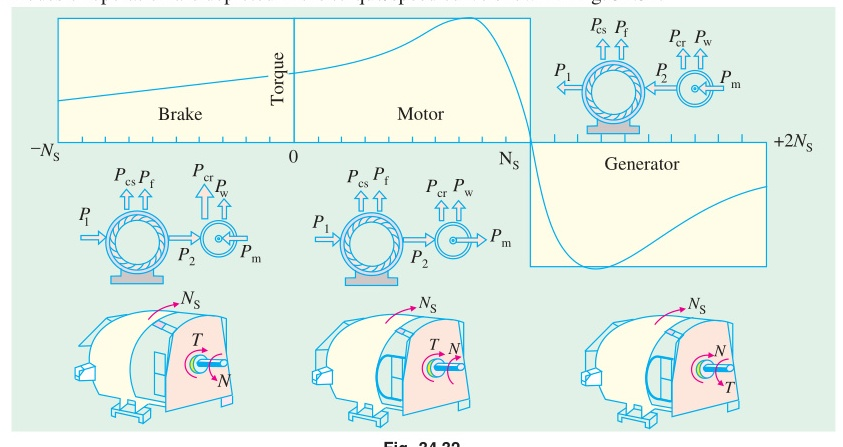

[← T-15b: Running & Max Torque](T-15b_Torque_Running_and_Max.md) | [🏠 Index](00_Index.md) | [T-16: Power Flow →](T-16_Power_Flow.md)

---

# T-15c: Torque-Speed Characteristics
> **Section:** B | **Priority:** 🟠 HIGH | **Exam Frequency:** 4/7 years
> **Sources:** Theraja Ch-34 (Art. 34.26-34.30), VK Mehta Ch-8 (Art. 8.16), Slides L-04

## Why This Topic Matters

"Draw and explain the torque-speed/torque-slip curve" appeared in 4 out of 7 papers. It is a 3-5 mark question every time. You need to draw the curve accurately, label all key points, and explain the stable vs unstable regions. The effect of $R_2$ on the curve shape is also tested.

---

## 📝 Key Definitions

> **Torque-Slip Characteristic:** "The curve showing the relation between the torque and the slip (or speed) of an induction motor is called its torque-slip (or torque-speed) characteristic." — Theraja, Art. 34.26

---

## The Torque-Slip Curve

From the torque equation: $T = ksE_2^2R_2/(R_2^2 + s^2X_2^2)$

**Key points on the curve:**

| Point | Slip | Speed | Torque | Notes |
|:---|:---:|:---:|:---|:---|
| Synchronous | $s = 0$ | $N_s$ | $T = 0$ | No relative motion |
| Full load | $s_f \approx 0.03$ | $\approx 0.97N_s$ | $T_f$ | Normal operating point |
| Breakdown | $s_{mT} = R_2/X_2$ | $N_s(1-s_{mT})$ | $T_{\max}$ | Peak torque |
| Standstill | $s = 1$ | $0$ | $T_{st}$ | Starting torque |

---

## Two Operating Regions

### Low-Slip Region ($0 < s < s_{mT}$): STABLE

When $s$ is small, $(sX_2)^2 \ll R_2^2$, so:

$$T \approx \frac{ksE_2^2R_2}{R_2^2} = \frac{ksE_2^2}{R_2} \propto s$$

Torque is approximately proportional to slip. The curve is nearly linear.

**Why this region is stable:** If load increases, the motor slows down slightly. Slip increases. Torque increases to match the new load. A self-correcting equilibrium.

### High-Slip Region ($s_{mT} < s \leq 1$): UNSTABLE

When $s$ is large, $(sX_2)^2 \gg R_2^2$, so:

$$T \approx \frac{ksE_2^2R_2}{s^2X_2^2} = \frac{kE_2^2R_2}{sX_2^2} \propto \frac{1}{s}$$

Torque is inversely proportional to slip. The curve falls.

**Why this region is unstable:** If load increases, the motor slows down. Slip increases. But now torque DECREASES. The motor slows further. Torque drops more. The motor stalls.

---

## Complete Torque-Speed Curve (All Three Regions)

| Region | Speed Range | Slip Range | Description |
|:---|:---|:---|:---|
| **Motoring** | $0 < N < N_s$ | $0 < s < 1$ | Normal operation |
| **Generating** | $N > N_s$ | $s < 0$ | Driven above $N_s$, feeds power back |
| **Braking (Plugging)** | $N < 0$ | $s > 1$ | Rotor rotates against stator field |

---

## Effect of Rotor Resistance on Torque-Speed Curve

Increasing $R_2$ (by adding external resistance in wound-rotor motor):

1. **$T_{\max}$ stays the same** ($kE_2^2/2X_2$, no $R_2$ in formula)
2. **$s_{mT}$ increases** ($s_{mT} = R_2/X_2$, peak shifts to higher slip = lower speed)
3. **Starting torque $T_{st}$ increases** (up to $R_2 = X_2$, where $T_{st} = T_{\max}$)
4. **Beyond $R_2 = X_2$:** $T_{st}$ decreases again

Practical use: In wound-rotor motors, external resistance gives maximum starting torque and smooth acceleration of heavy loads.

---

## 🏆 Golden Questions (Past Exam Archive)

### 🎯 Q1: Derive torque-slip characteristics of a 3-phase IM and explain.
> **Appeared:** 2020 Q8(b) — (3 marks)

**Full Answer:**

Torque equation: $T = ksE_2^2R_2/(R_2^2 + s^2X_2^2)$

**At $s = 0$:** $T = 0$ (synchronous speed, no relative motion).

**As $s$ increases from 0:** Torque increases. In the low-slip region, $T \propto s$ (linear).

**At $s = s_{mT} = R_2/X_2$:** $T = T_{\max}$ (breakdown torque).

**For $s > s_{mT}$:** Torque decreases. $(sX_2)^2$ term dominates the denominator. $T \propto 1/s$.

**At $s = 1$:** $T = T_{st}$ (starting torque, typically 1.5-2 times $T_f$).

The motor operates stably only in the region $0 < s < s_{mT}$. In this region, if load increases, slip increases and torque increases to match. Beyond $s_{mT}$, the motor is unstable and will stall if load exceeds $T_{\max}$.

---

### 🎯 Q2: Draw the complete torque-speed curve of an induction motor.
> **Appeared:** 2021 Q3(c) — (3 marks)

**Full Answer:**

The complete curve covers three regions:

**Motoring region ($0 < N < N_s$, $0 < s < 1$):**
- At $N = 0$ ($s = 1$): Starting torque $T_{st}$
- Maximum torque $T_{\max}$ at $s_{mT} = R_2/X_2$
- At $N = N_s$ ($s = 0$): Torque = 0

**Generating region ($N > N_s$, $s < 0$):**
- Rotor driven above synchronous speed by external prime mover
- Negative torque: machine delivers power back to supply

**Braking/Plugging region ($N < 0$, $s > 1$):**
- Rotor rotates opposite to stator RMF direction
- Large braking torque developed
- Used for rapid stopping

---

### 🎯 Q3: Explain the effect of rotor resistance on the torque-speed characteristic curve.
> **Appeared:** 2024 Q7(b) — (3 marks)

**Full Answer:**

From $s_{mT} = R_2/X_2$ and $T_{\max} = kE_2^2/(2X_2)$:

**Increasing rotor resistance $R_2$:**

1. **$s_{mT}$ increases:** The peak torque shifts to higher slip (lower speed).
2. **$T_{\max}$ remains unchanged:** No $R_2$ in the formula.
3. **Starting torque $T_{st}$ increases** as $R_2$ increases, up to $R_2 = X_2$ where $T_{st} = T_{\max}$.

By selecting appropriate external resistance, the wound-rotor motor can develop maximum torque at any desired speed. This is used for smooth starting of heavy loads and step-speed control.

---

### 🎯 Q4: Derive the torque expression $T = ksE_2^2R_2/(R_2^2 + s^2X_2^2)$.
> **Appeared:** 2023 Q5(a) — (8 marks)

**Full Answer:**

At running slip $s$, per-phase rotor quantities:

Rotor EMF: $E_{2s} = sE_2$. Rotor reactance: $X_{2s} = sX_2$.

Rotor current: $I_2 = sE_2/\sqrt{R_2^2 + s^2X_2^2}$

Rotor power factor: $\cos\phi_2 = R_2/\sqrt{R_2^2 + s^2X_2^2}$

Air-gap power using $R_2/s$ model:

$$P_g = 3I_2^2 \cdot \frac{R_2}{s} = 3 \cdot \frac{s^2E_2^2}{R_2^2 + s^2X_2^2} \cdot \frac{R_2}{s} = \frac{3sE_2^2R_2}{R_2^2 + s^2X_2^2}$$

Torque = air-gap power / synchronous angular speed:

$$T = \frac{P_g}{\omega_s} = \frac{P_g}{2\pi n_s} = \frac{3sE_2^2R_2}{(R_2^2 + s^2X_2^2) \cdot 2\pi n_s}$$

$$\boxed{T = \frac{ksE_2^2R_2}{R_2^2 + s^2X_2^2}, \qquad k = \frac{3}{2\pi n_s}}$$

---

### 🎯 Q5: What happens to torque and speed if supply frequency increases suddenly?
> **Appeared:** 2021 Q6(a) — (4 marks)

**Full Answer:**

If supply frequency $f$ increases suddenly (with voltage $V$ unchanged):

1. **$N_s$ increases** ($N_s = 120f/P$). Rotor cannot follow instantly, so slip increases momentarily.

2. **$X_2 = 2\pi fL_2$ increases** proportionally with $f$.

3. **$T_{\max} = kE_2^2/(2X_2) \propto V^2/f^2$ decreases.** Since $X_2 \propto f$ and $V$ is constant, $T_{\max}$ drops significantly.

4. **Operating slip increases** because the motor must develop the same load torque with reduced $T_{\max}$. The motor operates closer to pull-out: less stable.

5. **Speed may change:** New $N_s$ is higher, but the rotor only partially catches up.

This is why VFDs change $V$ and $f$ together (constant V/f ratio) to maintain constant flux and torque capability.

---

### 🎯 Q6: 6-pole, 400V, 50 Hz, star. $R_2' = 0.5\,\Omega$, $X_2' = 2.0\,\Omega$. $s_f = 4\%$. Find $T_{st}$, $T_f$, $T_{\max}$, efficiency (mech losses = 500 W).
> **Appeared:** 2024 Q6(b) — (5 marks)

**Full Answer:**

$N_s = 1000$ rpm $= 50/3$ rps. $k = 3/(2\pi \times 50/3) = 0.02865$

$V_\phi = 400/\sqrt{3} = 231.0$ V. $E_2' \approx V_\phi = 231.0$ V.

**Starting torque ($s = 1$):**
$$T_{st} = \frac{0.02865 \times 1 \times 231^2 \times 0.5}{0.25 + 4.0} = \frac{764.7}{4.25} = \boxed{179.9 \text{ N-m}}$$

**Full-load torque ($s = 0.04$):**
$$T_f = \frac{0.02865 \times 0.04 \times 53361 \times 0.5}{0.25 + 0.0064} = \frac{30.55}{0.2564} = \boxed{119.2 \text{ N-m}}$$

**Maximum torque:**
$$T_{\max} = \frac{0.02865 \times 53361}{4.0} = \boxed{382.2 \text{ N-m}}$$

**Efficiency:** $P_g = T_f \times \omega_s = 119.2 \times 104.72 = 12483$ W

$P_m = (1-s)P_g = 0.96 \times 12483 = 11983$ W

$P_{out} = 11983 - 500 = 11483$ W

$$\eta \approx \frac{11483}{12483} \times 100 = \boxed{92.0\%}$$

---

## Exam Variants

| Year | Question | Key Focus |
|:---|:---|:---|
| 2020 Q8(b) | Derive and explain T-s characteristics | Theory |
| 2021 Q3(c) | Draw complete T-speed curve (all 3 regions) | Drawing |
| 2021 Q6(a) | Effect of frequency change on torque/speed | Conceptual |
| 2023 Q5(a) | Derive torque expression (8 marks) | Full derivation |
| 2024 Q6(b) | 6-pole numerical with efficiency | Numerical |
| 2024 Q7(b) | Effect of $R_2$ on T-speed curve | Theory |

---

## ⚡ Exam Tips & Common Mistakes

1. **Label ALL key points on the curve:** $T_{st}$, $T_{\max}$, $T_f$, $s_{mT}$, $N_s$. Missing labels lose marks.
2. **Stable region is LEFT of the peak** (low slip side). Unstable is RIGHT of the peak.
3. **Draw the curve starting from $s = 0$ (right side) going to $s = 1$ (left side)** if plotting vs speed. Or $s = 0$ (left) to $s = 1$ (right) if plotting vs slip. Be consistent.
4. **When sketching effect of $R_2$:** Draw 3-4 curves with the SAME $T_{\max}$ but peaks at different slips.

## 🔗 Related Topics

- [T-15a: Starting Torque](T-15a_Torque_Starting.md) — The $s = 1$ end of the curve
- [T-15b: Running & Max Torque](T-15b_Torque_Running_and_Max.md) — The equations behind the curve
- [T-20: Speed Control](T-20_Speed_Control_and_Braking.md) — Practical use of $R_2$ variation

---

[← T-15b: Running & Max Torque](T-15b_Torque_Running_and_Max.md) | [🏠 Index](00_Index.md) | [T-16: Power Flow →](T-16_Power_Flow.md)
