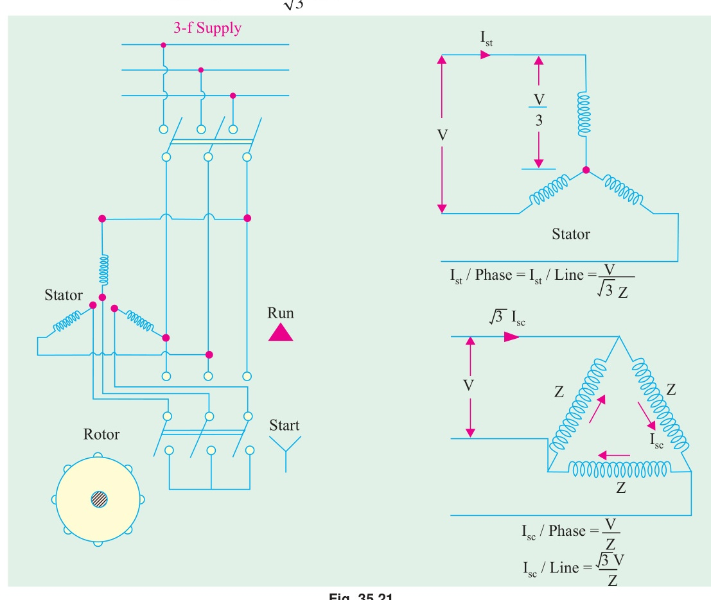

[← T-18: Circle Diagram](T-18_Circle_Diagram.md) | [🏠 Index](00_Index.md) | [T-20: Speed Control & Braking →](T-20_Speed_Control_and_Braking.md)

---

# T-19: Starting Methods (3-Phase IM)
> **Section:** B | **Priority:** 🟡 MEDIUM | **Exam Frequency:** 3/7 years
> **Sources:** Theraja Ch-34 (Art. 34.39-34.44), Slides L-06

## Why This Topic Matters

Starting methods appeared in 3 out of 7 papers. The star-delta starter proof (equivalent to auto-transformer of ratio $1/\sqrt{3}$) appeared in 2018 and 2020 for 5 marks. The DOL starting limitations appeared in 2019. These are straightforward theory/proof questions worth 3-5 marks.

---

## 📝 Key Definitions

> **Direct-On-Line (DOL) Starting:** "The simplest method of starting. The motor is directly connected to full supply voltage. Starting current is 5-8 times rated. Limited to small motors (< 5 kW)." — Theraja, Art. 34.39

> **Star-Delta Starter:** "The motor windings are first connected in star during starting, then switched to delta for running. Starting current and torque are reduced to 1/3 of DOL values." — Theraja, Art. 34.42

---

## The Starting Problem

At standstill ($s = 1$), rotor impedance is low: $Z_2 = \sqrt{R_2^2 + X_2^2}$. The starting current is:

$$I_{st} = \frac{V}{\sqrt{(R_1+R_2')^2 + (X_1+X_2')^2}} \approx 5\text{-}8 \times I_{\text{rated}}$$

This high current causes:
1. Voltage dips in the supply affecting other loads
2. High mechanical stress on shaft and couplings
3. Thermal stress on windings
4. Utility restrictions for motors > 5 kW

---

## Starting Methods Summary

| Method | Current Ratio | Torque Ratio | Applications |
|:---|:---|:---|:---|
| DOL | 1 (full) | 1 (full) | Small motors < 5 kW |
| Star-Delta | $1/3$ | $1/3$ | Medium motors, light start |
| Auto-transformer ($x$) | $x^2$ | $x^2$ | Large motors, adjustable |
| Rotor resistance | Varies | Up to $T_{\max}$ | Slip-ring motors, heavy loads |
| Soft starter | Gradual | Gradual | Smooth, electronic |

---

## Star-Delta Starter Proof

**Prove:** Star-delta starter is equivalent to auto-transformer of ratio $1/\sqrt{3}$ (57.7%).

**DOL starting (delta connection):**

Each phase sees full line voltage $V_L$. Per-phase starting current:

$$I_{\phi,\text{DOL}} = \frac{V_L}{Z_s}$$

Line current: $I_{L,\text{DOL}} = \sqrt{3} I_{\phi,\text{DOL}} = \frac{\sqrt{3}V_L}{Z_s}$

**Star-delta starting (star connection):**

Each phase sees $V_L/\sqrt{3}$. Per-phase starting current:

$$I_{\phi,Y} = \frac{V_L/\sqrt{3}}{Z_s} = \frac{V_L}{\sqrt{3}Z_s}$$

Line current (star): $I_{L,Y} = I_{\phi,Y} = \frac{V_L}{\sqrt{3}Z_s}$

**Ratio:**

$$\frac{I_{L,Y}}{I_{L,\text{DOL}}} = \frac{V_L/(\sqrt{3}Z_s)}{\sqrt{3}V_L/Z_s} = \frac{1}{3}$$

Starting current reduced to $1/3$ of DOL. Starting torque also reduced to $1/3$ (since $T \propto V^2 \propto I^2$).

**Auto-transformer equivalence:**

For ratio $x$: supply current $= x^2 I_{\text{DOL}}$. Here $x^2 = 1/3$:

$$x = \frac{1}{\sqrt{3}} = 0.577 = 57.7\%$$

$$\boxed{\text{Star-delta starter} \equiv \text{Auto-transformer of ratio } 1/\sqrt{3} = 57.7\%}$$

---

## 🏆 Golden Questions (Past Exam Archive)

### 🎯 Q1: Prove that star-delta starter is equivalent to auto-transformer of ratio $1/\sqrt{3}$.
> **Appeared:** 2018 Q7(a), 2020 Q7(c) — (5 marks)

**Full Answer:**

See [Star-Delta Starter Proof](#star-delta-starter-proof) above. Key results:

- DOL (delta): $I_{L,\text{DOL}} = \sqrt{3}V_L/Z_s$
- Star starting: $I_{L,Y} = V_L/(\sqrt{3}Z_s)$
- Ratio: $I_{L,Y}/I_{L,\text{DOL}} = 1/3$
- Auto-transformer ratio: $x^2 = 1/3 \implies x = 1/\sqrt{3} = 57.7\%$

---

### 🎯 Q2: Effects of DOL starting for motors > 25 kW. How to minimize?
> **Appeared:** 2019 Q7(b) — (4 marks)

**Full Answer:**

**Effects of DOL starting:**
1. Starting current = 5-8 times rated. Causes voltage dips affecting other loads.
2. High mechanical stress on shaft, couplings, and driven equipment.
3. Thermal stress on windings. Repeated DOL starting can overheat motor.
4. Utility often prohibits DOL for motors > 25 kW.

**Methods to minimize:**
1. **Star-delta starter:** Starting current = $1/3$ of DOL.
2. **Auto-transformer starter:** Adjustable ratio gives flexible current/torque trade-off.
3. **Rotor resistance (slip-ring motor):** High starting torque with reduced current.
4. **Soft starter:** Thyristor-based gradual voltage ramp. Smooth, no current surge.
5. **VFD:** Controls both voltage and frequency. Best control, highest cost.

---

## Exam Variants

| Year | Question | Marks |
|:---|:---|:---|
| 2018 Q7(a) | Y-Δ = auto-transformer proof | 5 |
| 2019 Q7(b) | DOL effects + minimization | 4 |
| 2020 Q7(c) | Y-Δ = auto-transformer proof | 5 |

---

## ⚡ Exam Tips & Common Mistakes

1. **Current ratio is $1/3$, not $1/\sqrt{3}$.** The voltage ratio is $1/\sqrt{3}$. Since $I \propto V$ for fixed impedance, and we have TWO factors (voltage AND connection change), the current ratio squares to $1/3$.
2. **Torque also reduces to $1/3$.** Since $T \propto V^2 \propto I_{line}$.
3. **Y-Δ starter only works for motors designed to run in delta.** The windings must be rated for line voltage in delta.

## 🔗 Related Topics

- [T-15a: Starting Torque](T-15a_Torque_Starting.md) — Why high $R_2$ helps starting
- [T-20: Speed Control](T-20_Speed_Control_and_Braking.md) — Related control methods

---

[← T-18: Circle Diagram](T-18_Circle_Diagram.md) | [🏠 Index](00_Index.md) | [T-20: Speed Control & Braking →](T-20_Speed_Control_and_Braking.md)
