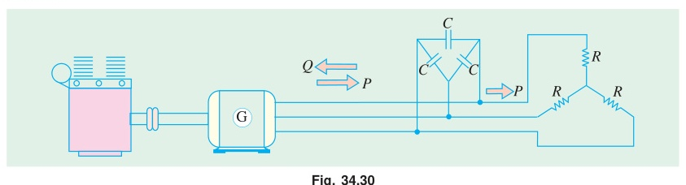

[← T-20: Speed Control & Braking](T-20_Speed_Control_and_Braking.md) | [🏠 Index](00_Index.md) | [T-22: DFRT & 1-Phase IM →](T-22_DFRT_and_1Phase_IM.md)

---

# T-21: Induction Generator
> **Section:** B | **Priority:** 🟡 MEDIUM | **Exam Frequency:** 3/7 years
> **Sources:** Theraja Ch-34 (Art. 34.47), Slides L-07

## Why This Topic Matters

Induction generator questions appeared in 3 out of 7 papers (2018, 2023, 2024). This is a rising trend. The 2018 question was a full numerical (capacitance calculation + engine speed). The concept connects slip, power flow, and reactive power. It is worth 3-4 marks per appearance.

---

## 📝 Key Definitions

> **Induction Generator:** "When an induction motor is driven by an external prime mover at a speed above synchronous speed ($N > N_s$), slip becomes negative ($s < 0$). The machine reverses power flow and delivers active power to the supply while absorbing reactive power for its magnetization. This mode of operation is called induction generator or asynchronous generator mode." — Theraja, Art. 34.47

---

## How It Works

1. An external prime mover (engine, turbine) drives the IM rotor above synchronous speed ($N > N_s$).
2. Slip becomes negative: $s = (N_s - N)/N_s < 0$.
3. The air-gap power reverses direction: power flows from rotor to stator to supply.
4. The machine generates active (real) power.
5. It still draws reactive power (VARs) from the grid for excitation.

**Grid-connected IG:** The grid provides the reactive power and sets the frequency/voltage.

**Self-Excited IG (SEIG):** When not connected to the grid, shunt capacitors supply the reactive power. The capacitor bank must provide enough VARs to magnetize the machine.

---

## 🏆 Golden Questions (Past Exam Archive)

### 🎯 Q1: 440V, 4-pole, 1470 rpm, 30 kW IM used as generator. Rated current 40A, pf = 0.85. Find (i) capacitance per phase (delta-connected), (ii) engine speed for 50 Hz.
> **Appeared:** 2018 Q5(c) — (4 marks)

**Full Answer:**

$N_s = 120 \times 50/4 = 1500$ rpm

**(i) Capacitance per phase (delta):**

Reactive power needed: $Q = \sqrt{3} V_L I_L \sin\phi$

$\sin\phi = \sqrt{1 - 0.85^2} = 0.527$

$Q = \sqrt{3} \times 440 \times 40 \times 0.527 = 16082$ VAR

Per phase (delta): $Q_\phi = 16082/3 = 5361$ VAR

Phase voltage (delta) = line voltage = 440 V

$X_C = V^2/Q_\phi = 440^2/5361 = 36.11\,\Omega$

$$C = \frac{1}{2\pi f X_C} = \frac{1}{2\pi \times 50 \times 36.11} = \boxed{88.2\,\mu\text{F per phase}}$$

**(ii) Engine speed for 50 Hz:**

Motor slip at full load: $s = (1500 - 1470)/1500 = 0.02$

As generator, slip magnitude is same but negative: $s_{\text{gen}} = -0.02$

$$N = N_s(1 - s_{\text{gen}}) = 1500(1 + 0.02) = \boxed{1530 \text{ rpm}}$$

---

### 🎯 Q2: What happens if the slip of a 3-phase IM becomes negative?
> **Appeared:** 2017 Q1(d) — (1 mark)

**Full Answer:**

If $N > N_s$, slip is negative. The motor acts as an **induction generator**. It delivers active electrical power back to the supply. It still absorbs reactive power from the supply for magnetization.

---

### 🎯 Q3: How can the direction of rotation of a 3-phase IM be reversed?
> **Appeared:** 2020 Q6(a) — (2 marks)

**Full Answer:**

Interchange any two of the three supply phase connections. This reverses the phase sequence (e.g., R-Y-B to R-B-Y), which reverses the direction of the rotating magnetic field. The rotor follows the RMF and reverses direction.

---

## Exam Variants

| Year | Question | Marks |
|:---|:---|:---|
| 2017 Q1(d) | Negative slip meaning | 1 |
| 2018 Q5(c) | IG capacitance + engine speed numerical | 4 |
| 2020 Q6(a) | Reverse rotation of IM | 2 |
| 2023 Q6(b) | Improve pf at light loads | 3 |

---

## ⚡ Exam Tips & Common Mistakes

1. **Generator slip is negative.** $N > N_s$ means $s < 0$. The machine delivers power.
2. **Capacitors must supply ALL the VARs** for self-excited IG. No grid = no reactive power source.
3. **Engine speed = $N_s(1 + |s|)$.** Don't subtract; the generator runs ABOVE synchronous speed.

## 🔗 Related Topics

- [T-13: Slip & Basics](T-13_Slip_and_Basics.md) — Negative slip concept
- [T-20: Speed Control & Braking](T-20_Speed_Control_and_Braking.md) — Regenerative braking = generator mode
- [T-16: Power Flow](T-16_Power_Flow.md) — Reversed power flow at $s < 0$

---

[← T-20: Speed Control & Braking](T-20_Speed_Control_and_Braking.md) | [🏠 Index](00_Index.md) | [T-22: DFRT & 1-Phase IM →](T-22_DFRT_and_1Phase_IM.md)
