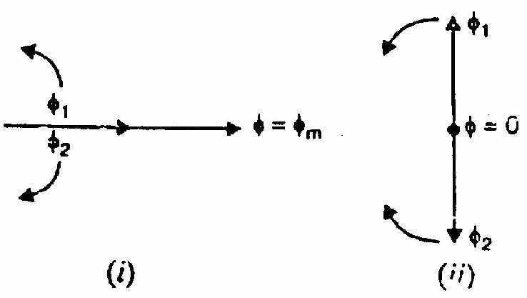

[← T-21: Induction Generator](T-21_Induction_Generator.md) | [🏠 Index](00_Index.md) | [T-23: 1-Phase IM Starting Methods →](T-23_1Phase_Starting_Methods.md)

---

# T-22: Double Revolving Field Theory (DFRT) & 1-Phase IM
> **Section:** B | **Priority:** 🔴 MUST | **Exam Frequency:** 5/7 years
> **Sources:** VK Mehta Ch-9 (Art. 9.1-9.4), Theraja Ch-35 (Art. 35.1), Slides L-08, L-09

## Why This Topic Matters

This question appeared in 5 out of 7 papers (2018, 2019, 2020, 2021, 2023). It is the single most repeated topic in Section B. "Explain why a 1-phase IM is not self-starting using DFRT" appeared in 2017, 2018, 2019, 2020, 2021, 2023, and 2024. This is a guaranteed 5-6 mark question. Write it perfectly.

---

## 📝 Key Definitions

> **Double Revolving Field Theory (Ferraris Theorem):** "Any pulsating magnetic field can be resolved into two rotating fields, each having half the amplitude of the pulsating field. These two rotating fields revolve at synchronous speed in opposite directions." — VK Mehta, Art. 9.2

> **Single-Phase Induction Motor:** "A single-phase induction motor has one stator winding carrying single-phase AC and a squirrel-cage rotor. It produces a pulsating magnetic field, not a rotating one. It is NOT self-starting." — VK Mehta, Art. 9.1

---

## Why a 1-Phase IM is Not Self-Starting

### Step 1: Pulsating Field

A single-phase stator winding carrying AC current produces a pulsating flux:

$$\Phi = \Phi_m\sin\omega t$$

This field oscillates along one axis. It does not rotate.

### Step 2: Ferraris Decomposition (DFRT)

This pulsating field can be decomposed into two counter-rotating fields of equal magnitude:

$$\Phi = \underbrace{\frac{\Phi_m}{2}\sin(\omega t - \theta)}_{\text{Forward field } \Phi_f} + \underbrace{\frac{\Phi_m}{2}\sin(\omega t + \theta)}_{\text{Backward field } \Phi_b}$$

Both rotate at synchronous speed $N_s$: one forward, one backward.

### Step 3: At Standstill ($N = 0$)

For the rotor at rest:
- Forward field slip: $s_f = (N_s - 0)/N_s = 1$
- Backward field slip: $s_b = (N_s + 0)/N_s = 1$

Both fields see the same slip ($s = 1$). Both produce equal torques in opposite directions:

$$T_f = T_b \implies T_{\text{net}} = T_f - T_b = 0$$

**Zero net starting torque. The motor cannot start by itself.**

### Step 4: Once Given a Push

If the rotor is pushed to speed $N$ in the forward direction:

$$s_f = \frac{N_s - N}{N_s} = s \quad (\text{small, e.g., 0.05})$$

$$s_b = \frac{N_s + N}{N_s} = 2 - s \quad (\text{large, e.g., 1.95})$$

From the torque-slip curve:
- Forward field at small slip: $T_f$ is large (high torque, stable region)
- Backward field at slip $\approx 2$: $T_b$ is small (past the peak)

$$T_{\text{net}} = T_f - T_b > 0$$

The motor accelerates and reaches a stable running speed.

### Step 5: Direction is Arbitrary

If pushed backward, it runs backward. The motor does not care which direction it was started. Whatever direction it receives an initial push, it continues in that direction.

---

## Quantitative Torque Expression

$$T = T_f(s) - T_b(2-s)$$

$$T_f = \frac{k_1 s R_2}{R_2^2 + s^2X_2^2}, \qquad T_b = \frac{k_1 (2-s) R_2}{R_2^2 + (2-s)^2X_2^2}$$

At $s = 1$: $T_f = T_b$, net = 0. *(Not self-starting)*

At $s \approx 0.05$: $T_f \gg T_b$, net positive. *(Runs in forward direction)*

---

## 🏆 Golden Questions (Past Exam Archive)

### 🎯 Q1: Explain the principle of operation of a 1-phase IM and why it is not self-starting using DFRT.
> **Appeared:** 2017 Q4(a), 2018 Q8(a), 2019 Q8(b), 2020 Q8(c), 2021 Q7(a) — (5-6 marks)
>
> Note: 2023 Q8(a) was crawling and cogging (see [T-20](T-20_Speed_Control_and_Braking.md)) and 2024 Q8(a) was the torque-slip curve (see [T-15c](T-15c_Torque_Speed_Curves.md)). Neither is a DFRT question.

**Full Answer:**

A single-phase IM has one stator winding carrying AC and a squirrel-cage rotor.

**The pulsating field:** AC through the stator winding creates a pulsating flux $\Phi = \Phi_m\sin\omega t$ along one axis. This is NOT a rotating field.

**Double Revolving Field Theory (Ferraris, 1885):** This pulsating field decomposes into two equal counter-rotating fields:

$$\Phi = \frac{\Phi_m}{2}\sin(\omega t - \theta) + \frac{\Phi_m}{2}\sin(\omega t + \theta)$$

Forward field $\Phi_f = \Phi_m/2$ rotates at $+N_s$. Backward field $\Phi_b = \Phi_m/2$ rotates at $-N_s$.

**At standstill ($N = 0$):** Both fields see slip = 1. Both produce equal torques:

$$T_f = T_b \implies T_{\text{net}} = 0$$

Motor cannot start itself. **Zero starting torque.**

**Once pushed to speed $N$:** Forward field slip = $s$ (small). Backward field slip = $2-s$ (large). From the torque-slip curve, $T_f \gg T_b$, so $T_{\text{net}} > 0$. The motor continues running.

**Conclusion:** A 1-phase IM is not self-starting because the forward and backward torques cancel at standstill. An auxiliary starting mechanism (capacitor, split phase, or shaded pole) is needed to create an initial asymmetry.

### 🎯 Q2: Explain the double field revolving theory for the operation of a 1-φ induction motor.
> **Appeared:** 2023 Q7(c) — 3 marks

**Full Answer:**

**Statement.** Any alternating (pulsating) flux can be resolved into two rotating fluxes of equal magnitude, each half the peak of the pulsating flux, revolving in opposite directions at synchronous speed.

**Mathematical form.** The single stator winding produces $\Phi = \Phi_m \cos\omega t$. Write it as the sum of two counter-rotating vectors of magnitude $\Phi_m/2$:
$$\Phi = \underbrace{\frac{\Phi_m}{2}\angle{+\omega t}}_{\text{forward field } \Phi_f} + \underbrace{\frac{\Phi_m}{2}\angle{-\omega t}}_{\text{backward field } \Phi_b}$$

Their components across the winding axis always cancel. Their components along the axis always add to $\Phi_m \cos\omega t$. So the two rotating fields are an exact equivalent of the one pulsating field.

**Torque production.** Let the rotor turn at speed $N$. The two fields see different slips:
$$s_f = \frac{N_s - N}{N_s} = s \qquad \text{(forward field)}$$
$$s_b = \frac{N_s - (-N)}{N_s} = 2 - s \qquad \text{(backward field)}$$

The forward torque $T_f$ is positive, the backward torque $T_b$ is negative, and the net torque is $T = T_f - T_b$.

**At standstill ($N = 0$, $s = 1$):** both fields see the same slip of 1. So $T_f = T_b$ and
$$\boxed{T_{st} = 0 \quad \text{so the 1-φ induction motor is not self-starting}}$$

**Once it is turning:** suppose the rotor is pushed forward. Then $s < 1$ for the forward field and $2 - s > 1$ for the backward field. The forward torque grows and the backward torque shrinks, so the net torque is positive and the motor runs up to near $N_s$. It keeps running in whichever direction it was started.

---

### 🎯 Q3: Following step by step process, draw and describe the vector diagram of a 1-φ IM.
> **Appeared:** 2024 Q6(b) — 4 marks

**Full Answer:**

**Take the supply voltage $\vec{V}$ as the reference**, drawn horizontally to the right.

**Step 1 — Main winding.** $\vec{I}_m$ lags $\vec{V}$ by $\phi_m = \tan^{-1}(X_m/R_m)$, because the main winding is inductive.

**Step 2 — Split the pulsating field into two counter-rotating fields.** By DFRT the field $\Phi_m \cos\omega t$ is equivalent to a forward field of magnitude $\Phi_m/2$ rotating at $+N_s$ and a backward field of magnitude $\Phi_m/2$ rotating at $-N_s$.

**Step 3 — Slips seen by the two fields.** For a rotor running forwards at speed $N$:
$$s_f = \frac{N_s - N}{N_s} = s, \qquad s_b = \frac{N_s + N}{N_s} = 2 - s$$

**Step 4 — Currents and torques.** Each field induces its own rotor current and hence its own torque, using the standard 3-φ torque formula $T \propto \dfrac{sE_2^2 R_2}{R_2^2 + (sX_2)^2}$:
- forward: evaluate at $s_f = s$, which is small, so $T_f$ is large and in the forward direction
- backward: evaluate at $s_b = 2 - s$, which is well above 1 and therefore above $s_{maxT} = R_2/X_2$, so the backward torque is small and opposes rotation

**Step 5 — Net torque.** $T_{net} = T_f - T_b$ (shown as two opposite arrows).

**Step 6 — Starting point.** At $s = 1$: $s_f = s_b = 1$, so $T_f = T_b$ and $T_{net} = 0$. The motor is not self-starting.

**Step 7 — Running point.** As $N$ rises, $s_f$ falls towards 0 while $s_b$ rises towards 2, so $T_f$ grows and $T_b$ shrinks. The net torque becomes positive and the motor continues to run in the direction it was pushed.

**Conclusion.** The backward field is the reason a 1-φ motor cannot start itself, and the reason it runs at slightly lower speed and worse power factor than the forward field alone would give.

---

---

## Exam Variants

| Year | Question | Marks |
|:---|:---|:---|
| 2017 Q4(a) | 1-phase IM principle + why not self-starting | 5 |
| 2018 Q8(a) | Same (DFRT) | 6 |
| 2019 Q8(b) | Same (DFRT) | 5 |
| 2020 Q8(c) | Same (DFRT) | 5 |
| 2021 Q7(a) | Same (DFRT) | 5 |
| 2023 Q8(a) | Same (DFRT) + CO4 | 6 |
| 2024 Q8(a) | Same (DFRT) + CO4 | 6 |

---

## ⚡ Exam Tips & Common Mistakes

1. **This is a GUARANTEED question.** 7/7 years. Write it cleanly and earn full marks.
2. **Name Ferraris.** Mentioning "Ferraris theorem" shows you know the origin. Extra credit in some years.
3. **Show the math.** Write $s_f = 1$, $s_b = 1$ at standstill. Show $T_f = T_b$. Show $T_{\text{net}} = 0$.
4. **Draw the torque-speed diagram** if possible. Show $T_f$, $T_b$, and $T_{\text{net}}$ curves.
5. **Don't forget the conclusion:** "needs an auxiliary starting mechanism."

## 🔗 Related Topics

- [T-23: 1-Phase IM Starting Methods](T-23_1Phase_Starting_Methods.md) — How to solve the starting problem
- [T-12: Rotating Magnetic Field](T-12_Rotating_Magnetic_Field.md) — 3-phase creates RMF; 1-phase doesn't

---

[← T-21: Induction Generator](T-21_Induction_Generator.md) | [🏠 Index](00_Index.md) | [T-23: 1-Phase IM Starting Methods →](T-23_1Phase_Starting_Methods.md)
