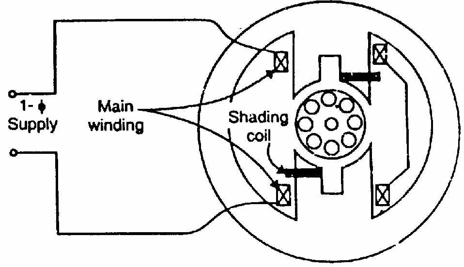
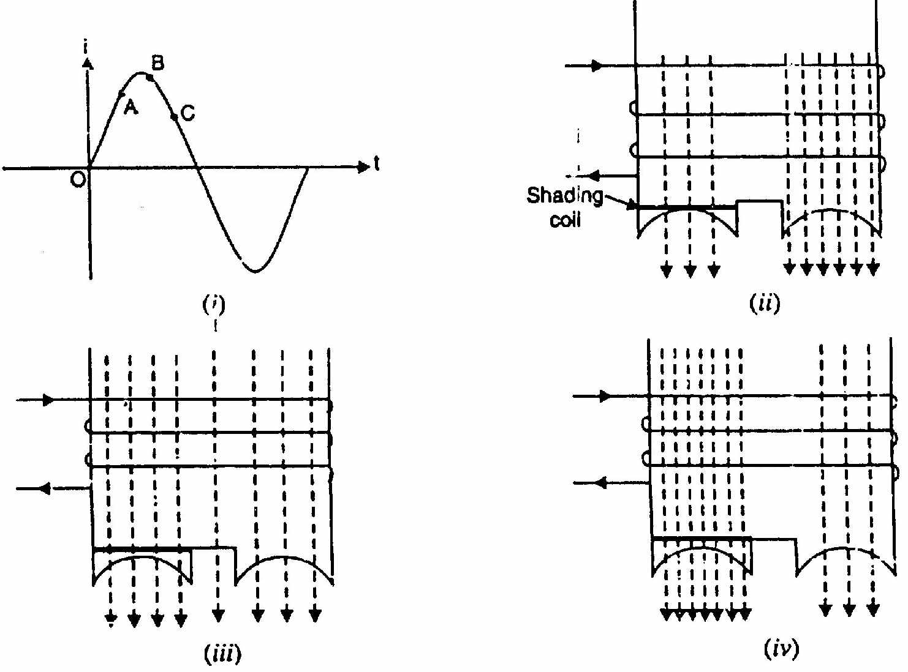
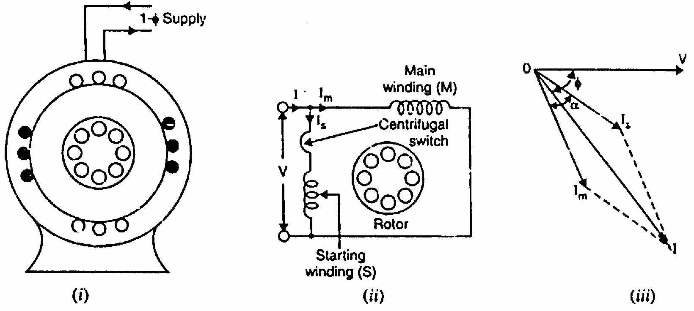

[← T-22: DFRT & 1-Phase IM](T-22_DFRT_and_1Phase_IM.md) | [🏠 Index](00_Index.md) | [T-24: Miscellaneous IM Topics →](T-24_Miscellaneous_IM.md)

---

# T-23: Single-Phase IM Starting Methods
> **Section:** B | **Priority:** 🔴 MUST | **Exam Frequency:** 6/7 years
> **Sources:** VK Mehta Ch-9 (Art. 9.5-9.14), Theraja Ch-35, Slides L-08, L-09

## Why This Topic Matters

1-phase IM starting methods appeared in 6 out of 7 papers. Types include: split-phase (2017, 2018, 2023), capacitor-start (2017, 2020, 2021, 2023), capacitor-start-capacitor-run (2021), shaded pole, and capacitor calculation numericals (2018, 2019, 2021). 2023 Q8(c) asked for two methods of making a 1-ϕ IM self-starting, for 4 marks. These questions range from 3-4 marks. This is the second most guaranteed topic after DFRT.
---

## 📝 Key Definitions

> **Capacitor-Start Motor:** "An auxiliary winding with a capacitor in series is placed 90° apart from the main winding. The capacitor advances the phase of auxiliary current. With proper capacitor value, the phase difference between main and auxiliary current approaches 90°, creating a rotating field for starting." — VK Mehta, Art. 9.8

> **Shaded-Pole Motor:** "A short-circuited copper band (shading band) is placed around a portion of each stator pole face. The flux in the shaded portion lags behind the flux in the unshaded portion, creating a sweeping effect from unshaded to shaded side." — VK Mehta, Art. 9.12

---

## Classification of 1-Phase IM Starting Methods

| Motor Type | Principle | Starting Torque | Running pf | Applications |
|:---|:---|:---|:---|:---|
| **Split-Phase** | High-$R_a$ auxiliary winding | 150-200% FL | Moderate | Fans, pumps, small tools |
| **Capacitor-Start** | Capacitor in series with auxiliary | 200-400% FL | Moderate | Compressors, conveyors |
| **Permanent-Split Cap** | Capacitor always in circuit | 50-100% FL | Good | Fans, blowers (quiet) |
| **Cap-Start, Cap-Run** | $C_{st}$ (start) + $C_{run}$ (run) | 200-350% FL | Good | Compressors, pumps |
| **Shaded-Pole** | Copper band on pole face | 40-60% FL | Poor | Small fans, timers |

---

## Capacitor-Start Motor

**Construction:**
- Main winding (M) and auxiliary winding (A) placed 90° apart in space
- Capacitor in series with auxiliary winding
- Centrifugal switch disconnects auxiliary winding at ~75% of $N_s$

**Operation:**
1. The capacitor makes the auxiliary current $I_a$ LEAD the voltage
2. The main current $I_m$ LAGS the voltage
3. Total phase difference between $I_a$ and $I_m$ approaches 90°
4. 90° time displacement + 90° space displacement = rotating field
5. Starting torque is high (200-400% FL)
6. At ~75% speed, switch opens. Motor runs on main winding only.

---

## Capacitor-Start, Capacitor-Run Motor

**Two capacitors:**
- $C_{st}$ (large, starting): in circuit only during starting. Switched out by centrifugal switch.
- $C_{run}$ (small, running): permanently in circuit.

**Starting:** $C_{st} \| C_{run}$ gives large capacitance. Nearly 90° phase split. High starting torque.

**Running:** Only $C_{run}$ in circuit. Optimized for running efficiency and power factor. Smoother, quieter than capacitor-start-only motor.

---

## Shaded-Pole Motor

**Construction:** Salient stator poles. Short-circuited copper band (shading ring) around part of each pole.

**Operation:**
1. Alternating flux through the pole induces current in the shading ring (Lenz's law)
2. Ring current opposes flux change in shaded portion
3. Flux in shaded portion LAGS behind flux in unshaded portion
4. This time lag creates a sweeping effect: unshaded $\to$ shaded
5. Small starting torque in one direction

**Characteristics:** Very simple, no switches, no capacitors. Low starting torque (40-60% FL). Low efficiency. Fixed direction. Small sizes only (fans, display motors, hair dryers).

---

## Split-Phase (Resistance) Motor

**Construction:** Auxiliary winding has higher resistance and lower reactance than main winding. Placed 90° apart in space.

**Operation:** Higher $R_a/X_a$ ratio makes $I_a$ lag less than $I_m$. Phase difference = 30°-40° (not 90°). Moderate starting torque.

---

## Capacitor Calculation

Two different conditions get asked. They give different answers. Do not mix them up.

**Condition A: quadrature currents.** Here $I_m$ and $I_a$ are exactly 90° apart in time.
1. Find main winding angle: $\phi_m = \tan^{-1}(X_m/R_m)$
2. For 90° total: $I_a$ must lead $V$ by $(90° - \phi_m)$
3. Auxiliary circuit must be capacitive: net angle = $(90° - \phi_m)$ leading
4. $X_C = X_a + R_a\tan(90° - \phi_m)$

**Condition B: maximum starting torque.** Here $I_a$ must lead $V$ by only HALF that angle, $\phi_a = (90° - \phi_m)/2$. Starting torque goes as $I_m I_a \sin(\phi_m + \phi_a)$, and $I_a$ itself falls as $\phi_a$ grows. The product peaks at the half angle.

$$\boxed{X_C = X_a + \frac{R_a R_m}{Z_m + X_m} = X_a + \frac{R_a(Z_m - X_m)}{R_m}}$$

Both conditions finish the same way: $C = 1/(2\pi f X_C)$.

---

## 🏆 Golden Questions (Past Exam Archive)

### 🎯 Q1: How is a single phase induction motor is made self-starting? Describe two methods of making a single phase induction motor self-starting.
> **Appeared:** 2023 Q8(c) — 4 marks

**Full Answer:**

**The core idea.** A single winding gives a pulsating field, which splits into two equal and opposite rotating fields, so the starting torque is zero. To get a starting torque, the field at standstill must be made to **rotate**, not pulsate.

That needs two conditions together:
1. **Two windings displaced in space**, ideally by $90°$ electrical.
2. **Their currents displaced in time**, ideally by $90°$.

A main winding plus an auxiliary (starting) winding, fed through a phase-splitting element, produces an unbalanced two-phase supply. That gives a rotating field and a real starting torque. The auxiliary winding is then cut out by a **centrifugal switch** at about 75% of full speed.

**Method 1: Split-phase (resistance-start) motor**

The starting winding uses fewer turns of thin wire, so it has **high resistance and low reactance**. The main winding uses many turns of thick wire, so it has **low resistance and high reactance**. Both sit across the supply, with a centrifugal switch in series with the starting winding.

$I_s$ in the high-resistance starting winding is nearly in phase with $V$, while $I_m$ in the highly inductive main winding lags $V$ by a large angle. The phase split is about $25°$ to $30°$, which is enough to produce a rotating field:
$$\alpha \approx 25°\text{--}30°, \qquad T_{st} \approx 1.5\text{ to } 2 \times T_{FL}$$

At about 75% of full speed the centrifugal switch opens and the motor carries on with the main winding alone. **Uses:** fans, blowers, small grinders, office machinery. Cheap, but low starting torque.

**Method 2: Capacitor-start motor**

A **capacitor** is put in series with the starting winding, along with the centrifugal switch. An electrolytic capacitor is used because it is needed only for a few seconds.

The capacitive branch makes $I_s$ **lead** the supply voltage while $I_m$ still lags it, so the phase split is far larger:
$$\alpha \approx 80°\text{--}90°, \qquad T_{st} \approx 3\text{ to } 4.5 \times T_{FL}$$

With the split close to the ideal $90°$, the field at standstill is almost a true two-phase rotating field. **Uses:** compressors, pumps, refrigerators, air conditioners, conveyors.

| Feature | Split-phase | Capacitor-start |
|:---|:---|:---|
| Phase-splitting element | High-resistance winding | Series capacitor |
| Phase split $\alpha$ | $25°$–$30°$ | $80°$–$90°$ |
| Starting torque | $1.5$–$2\, T_{FL}$ | $3$–$4.5\, T_{FL}$ |
| Starting current | High | Moderate |
| Cost | Low | Higher |
| Typical use | Fans, blowers | Compressors, pumps |

> [!success] Other methods worth naming
> Capacitor-start capacitor-run (two capacitors, better running power factor), permanent-split capacitor, and shaded-pole (a copper shading ring gives a weak sweeping field, used in tiny fans).

---

### 🎯 Q2: Describe two types of single-phase induction motors commonly used in practice.
> **Practice problem (not from a past paper)**

**Full Answer:**

**Type 1: Capacitor-Start, Capacitor-Run Motor (Two-Value Capacitor Motor):**

This motor has:
- Main winding (M): always in circuit.
- Auxiliary winding (A): permanently in circuit.
- Starting capacitor $C_s$: in circuit only during starting (switched out by centrifugal switch after ~75% speed).
- Running capacitor $C_r$: permanently in circuit.

**Starting:** $C_s + C_r$ (combined large capacitance) gives nearly 90° phase split between $I_m$ and $I_a$. High starting torque (200-350% of FL).

**Running:** $C_s$ disconnected. $C_r$ (smaller value) is optimized for running. Better running efficiency, power factor, and quieter operation compared to single capacitor motors.

**Applications:** Refrigerator compressors, pumps, air conditioners, power tools.

---

**Type 2: Shaded-Pole Motor:**

This is the simplest single-phase induction motor. It has:
- Salient poles (projecting poles like a DC machine).
- A short-circuited copper band (shading ring) placed around a portion of each pole face.

**Operating principle:**
The alternating flux in each pole induces a current in the shading ring. By Lenz's Law, this current opposes the flux change in the shaded portion. The flux in the shaded portion lags behind the flux in the unshaded portion in time, though they are in the same physical space. This time lag produces a sweeping effect from unshaded to shaded, like a weak rotating field. This gives a small, unidirectional starting torque.

**Characteristics:**
- Very low starting torque (40-60% of FL)
- Very low efficiency (copper ring always dissipates heat)
- Very simple and reliable: no capacitors, no switches, no auxiliary winding
- Only for small sizes (fans, relays, small appliances)
- Fixed rotation direction (cannot be reversed without mechanical modification)

**Applications:** Small cooling fans, hair dryers, small exhaust fans, record turntables, display motors.

---

### 🎯 Q3: 230V, 50 Hz capacitor-start motor. Main: 100V, 2A, 40W. Auxiliary: 80V, 1A, 50W. Find capacitance for max starting torque.
> **Appeared:** 2018 Q8(c) — (4 marks)

**Full Answer:**

**Main winding:** $Z_m = 100/2 = 50\,\Omega$, $R_m = 40/4 = 10\,\Omega$, $X_m = \sqrt{50^2 - 10^2} = 48.99\,\Omega$

$\phi_m = \cos^{-1}(10/50) = 78.46°$ lagging

**Auxiliary winding:** $Z_a = 80/1 = 80\,\Omega$, $R_a = 50/1 = 50\,\Omega$, $X_a = \sqrt{80^2 - 50^2} = 62.45\,\Omega$

**Maximum starting torque needs $I_a$ to lead $V$ by $\phi_a = (90° - 78.46°)/2 = 5.77°$:**

$X_C = X_a + \dfrac{R_a R_m}{Z_m + X_m} = 62.45 + \dfrac{50 \times 10}{50 + 48.99}$

$X_C = 62.45 + 5.05 = 67.50\,\Omega$

$$C = \frac{1}{2\pi \times 50 \times 67.50} = \boxed{47.1\,\mu\text{F}}$$

---

### 🎯 Q4: 250W, 230V, 50 Hz motor. $Z_m = (4.5 + j3.7)\,\Omega$, $Z_a = (9.5 + j3.5)\,\Omega$. Find starting capacitor for quadrature currents.
> **Appeared:** 2021 Q7(c) — (4 marks)

**Full Answer:**

$\phi_m = \tan^{-1}(3.7/4.5) = 39.43°$ lagging

For $I_a$ 90° ahead of $I_m$: $I_a$ must lead $V$ by $(90° - 39.43°) = 50.57°$

$\tan(50.57°) = (X_C - X_a)/R_a = (X_C - 3.5)/9.5$

$X_C - 3.5 = 9.5 \times 1.213 = 11.52$

$X_C = 15.02\,\Omega$

$$C = \frac{1}{2\pi \times 50 \times 15.02} = \boxed{211.8\,\mu\text{F}}$$

---

### 🎯 Q5: How does a capacitor-start-and-run motor operate?
> **Appeared:** 2021 Q7(b) — (4 marks)

**Full Answer:**

Two capacitors: $C_{st}$ (large) for starting, $C_{run}$ (small) for running.

**Starting:** $C_{st}$ and $C_{run}$ in parallel. Large capacitance gives nearly 90° phase split. High starting torque (200-350% FL).

**Running:** Centrifugal switch disconnects $C_{st}$ at ~75% speed. Motor runs with $C_{run}$ only. Optimized for efficiency, power factor, and quiet operation. Better than capacitor-start (auxiliary stays on) or permanent-split (higher starting torque).

---

### 🎯 Q6: Why does a permanent-split capacitor motor run more quietly than a capacitor-start motor?
> **Appeared:** 2017 Q4(b) — (4 marks)

**Full Answer:**

In a **capacitor-start motor**, the auxiliary winding is disconnected by a centrifugal switch at ~75% speed. After disconnection, the motor runs on the main winding only. This produces a pulsating field (not rotating). Pulsating torque causes vibration and noise. The switch click itself adds noise.

In a **permanent-split capacitor motor**, the auxiliary winding and capacitor remain connected at all times. The motor operates as a two-phase machine (approximate 90° phase shift) during both starting and running. The field is more nearly rotating at all speeds. No switch click. No current surge. Smoother, quieter operation.

---

### 🎯 Q7: Prove $X_c = X_a + r_a r_m/(Z_m + X_m)$ for max starting torque of capacitor split-phase motor.
> **Appeared:** 2019 Q6(b) — (4 marks)

**Full Answer:**

Starting torque goes as $T_{st} \propto I_m I_a \sin(\phi_m + \phi_a)$.

Main winding: $Z_m = r_m + jX_m$. Main current $I_m$ lags $V$ by $\phi_m$.

Auxiliary branch with the capacitor: $I_a$ leads $V$ by $\phi_a$, and $I_a = V\cos\phi_a/r_a$. So

$$T_{st} \propto \cos\phi_a \sin(\phi_m + \phi_a) = \tfrac{1}{2}\left[\sin(2\phi_a + \phi_m) + \sin\phi_m\right]$$

This peaks when $2\phi_a + \phi_m = 90°$, so $\phi_a = (90° - \phi_m)/2$. Using the half-angle identity with $\cos(90° - \phi_m) = X_m/Z_m$ and $\sin(90° - \phi_m) = r_m/Z_m$:

$$\tan\phi_a = \frac{Z_m - X_m}{r_m} = \frac{r_m}{Z_m + X_m}$$

Since $\tan\phi_a = (X_c - X_a)/r_a$:

$$X_c = X_a + \frac{r_a r_m}{X_m + Z_m}$$

Note that $I_a$ leads $I_m$ by $\phi_m + \phi_a$, which is LESS than 90°. The 90° rule is the quadrature-current condition, not this one.

---

## Exam Variants

| Year | Question | Marks | Type |
|:---|:---|:---|:---|
| 2017 Q4(b) | Permanent-split vs cap-start noise | 4 | Conceptual |
| 2017 Q4(c) | How auxiliary winding gives starting torque | 4 | Theory |
| 2018 Q8(b) | Split-phase phasor diagram | 4 | Theory |
| 2018 Q8(c) | Capacitor calculation numerical | 4 | Numerical |
| 2019 Q6(b) | Prove $X_c$ formula | 4 | Derivation |
| 2020 Q7(a) | Describe one starting method | 3 | Theory |
| 2021 Q7(b) | Cap-start cap-run operation | 4 | Theory |
| 2021 Q7(c) | Capacitor calculation | 4 | Numerical |
| 2023 Q8(c) | How is a 1-ϕ IM made self-starting? Describe two methods | 4 | Theory |

---

## ⚡ Exam Tips & Common Mistakes

1. **Capacitor-start is the most commonly tested.** Know the circuit, phasor diagram, and principle.
2. **Read the capacitor numerical carefully.** For QUADRATURE currents use $\tan(90° - \phi_m) = (X_C - X_a)/R_a$. For MAXIMUM STARTING TORQUE use $X_C = X_a + R_a R_m/(Z_m + X_m)$, which is the half-angle condition. Using the 90° rule for a max-torque question is the single most common mistake here.
3. **Don't confuse the three capacitor motor types.** Start-only, run-only (permanent-split), and start+run (two-value).
4. **Shaded-pole direction is fixed:** unshaded to shaded. Cannot be reversed without physical modification.
5. **The centrifugal switch operates at ~75% of $N_s$.** Not at full speed.

## 🔗 Related Topics

- [T-22: DFRT & 1-Phase IM](T-22_DFRT_and_1Phase_IM.md) — Why starting methods are needed
- [T-24: Miscellaneous IM Topics](T-24_Miscellaneous_IM.md) — Single phasing, AC motor classification

---

[← T-22: DFRT & 1-Phase IM](T-22_DFRT_and_1Phase_IM.md) | [🏠 Index](00_Index.md) | [T-24: Miscellaneous IM Topics →](T-24_Miscellaneous_IM.md)
