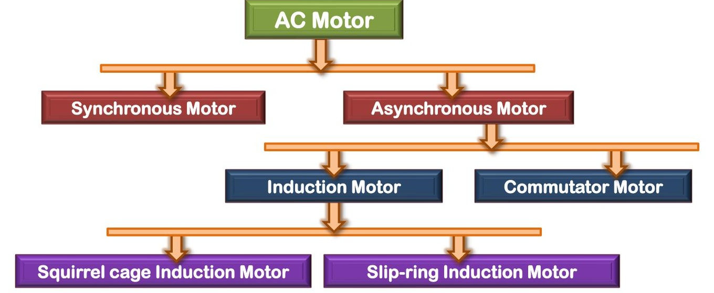

[← T-23: 1-Phase IM Starting Methods](T-23_1Phase_Starting_Methods.md) | [🏠 Index](00_Index.md) | [99: Master Formula Sheet →](99_Master_Formula_Sheet.md)

---

# T-24: Miscellaneous IM Topics
> **Section:** B | **Priority:** 🟠 HIGH | **Exam Frequency:** 4/7 years
> **Sources:** Theraja Ch-34, VK Mehta Ch-8, Slides L-02

## Why This Topic Matters

This catch-all topic covers several standalone questions that appear irregularly: AC motor classification (2020), single phasing (2018), methods of generating magnetic fields (2021), improving IM power factor (2023), why synchronous motor is not self-starting (2020), and V-curve of synchronous motor (2020). Each is worth 2-4 marks. They are easy marks if you know the short answers.

---

## AC Motor Classification

Two main categories:

**1. Synchronous Motors:** Rotor runs at exactly $N_s = 120f/P$. Needs DC excitation on rotor. Not self-starting.

**2. Asynchronous (Induction) Motors:**
- **Squirrel-Cage:** Simple, rugged, no brushes. Fixed $R_2$.
- **Slip-Ring (Wound Rotor):** Variable $R_2$ through slip rings. Higher starting torque.

Induction motors can be single-phase or three-phase.

---

## Single Phasing

**What is single phasing?** One of the three supply phases is lost while the motor is running. Causes: blown fuse, broken wire, faulty contactor.

**Effects on a running motor:**

1. **Unbalanced supply:** Only two phases feed the stator. Field becomes pulsating and unbalanced.
2. **Higher current in remaining phases:** Current increases by 1.5-2 times to maintain torque. Causes overheating.
3. **Speed drops:** Motor runs with higher slip and reduced torque.
4. **Oscillating torque:** Pulsating field component causes vibration and noise.
5. **Motor burns out:** Without protection, sustained single-phase operation causes winding failure.

**Protection:** Use negative-sequence relays, single-phase preventers, or thermal overload relays.

---

## Why a Synchronous Motor is Not Self-Starting

1. At starting, the stator RMF rotates at $N_s$ immediately.
2. The rotor (with field winding energized) is at rest.
3. The stator field tries to pull the rotor poles around.
4. But the rotor has inertia. Before it can respond, the stator field has rotated 180° and now pulls in the opposite direction.
5. Net average torque over one cycle = 0.

Solution: Start it as an induction motor using damper windings (squirrel-cage bars on rotor pole faces). Then energize the DC field winding to pull the rotor into synchronism.

---

## Improving Power Factor at Light Loads

At light load, the motor draws mostly magnetizing (reactive) current. The working (active) component is small. Power factor is very low.

**Methods:**
1. **Avoid running at light load.** Switch off idling motors.
2. **Capacitor banks.** Connect shunt capacitors at motor terminals.
3. **Use correctly-sized motor.** Don't oversize.
4. **Synchronous condenser.** Overexcited synchronous motor supplies VARs.
5. **Variable Frequency Drive (VFD).** Reduces voltage at light load, reduces magnetizing current.

---

## Reversing Direction of Rotation

Interchange any two of the three supply leads. This reverses the phase sequence (R-Y-B to R-B-Y). The RMF reverses direction. The rotor follows.

---

## Methods of Generating Magnetic Field

1. **Permanent magnets:** Iron, alnico, neodymium. Static field. BLDC, PMSMs.
2. **DC electromagnets:** DC coil on iron core. Constant field. DC machines, synchronous motors.
3. **AC electromagnets:** AC coil. Pulsating field. Transformers, contactors.
4. **3-phase RMF:** Three-phase AC in 120°-spaced windings. Rotating field of constant magnitude. 3-phase IM, synchronous motors.
5. **2-phase RMF:** Two-phase in 90°-spaced windings. Rotating field. Servo systems.
6. **1-phase with auxiliary:** Capacitor/resistance creates phase split. Weak rotating field. 1-phase IM.

---

## 🏆 Golden Questions (Past Exam Archive)

### 🎯 Q1: What is single phasing? Explain its effects on a 3-phase IM.
> **Appeared:** 2018 Q6(a) — (4 marks)

**Full Answer:**

**Single phasing:** Loss of one supply phase while motor runs. Causes: blown fuse, broken wire, contactor fault.

**Effects:** (1) Supply becomes unbalanced. Field becomes pulsating. (2) Current in remaining phases increases 1.5-2x. Causes overheating. (3) Speed drops, slip increases. (4) Oscillating torque causes vibration. (5) Without protection, motor burns out.

**Protection:** Negative-sequence relays, thermal overloads, single-phase preventers.

---

### 🎯 Q2: Classify AC motors.
> **Appeared:** 2020 Q5(a) — (2 marks)

**Full Answer:**

AC motors: (A) **Synchronous** (plain, super), (B) **Asynchronous/Induction** -- (i) Squirrel-cage, (ii) Slip-ring/wound rotor.

Also classified by: phases (1-phase, 3-phase), speed (constant, variable, adjustable), construction (open, enclosed, ventilated).

---

### 🎯 Q3: How can speed of rotation be reversed?
> **Appeared:** 2020 Q6(a) — (2 marks)

**Full Answer:**

Interchange any two of the three supply phase connections. This reverses the phase sequence (e.g., R-Y-B to R-B-Y), reversing the RMF direction. The rotor reverses.

---

### 🎯 Q4: What methods can generate magnetic field?
> **Appeared:** 2021 Q4(b) — (4 marks)

**Full Answer:**

See [Methods of Generating Magnetic Field](#methods-of-generating-magnetic-field) above. Six methods: permanent magnets, DC electromagnets, AC electromagnets, 3-phase RMF, 2-phase RMF, and 1-phase with auxiliary winding.

---

### 🎯 Q5: Why is a synchronous motor not self-starting?
> **Appeared:** 2020 Q6(c) — (2 marks)

**Full Answer:**

The stator RMF rotates at $N_s$ instantly. The rotor, at rest, has inertia. The stator field alternately pulls and pushes the rotor poles. Net average torque = 0 over each cycle. The rotor cannot accelerate from rest. Solution: damper windings start it as IM, then DC field pulls it into sync.

---

### 🎯 Q6: How to improve poor power factor of IM at light loads?
> **Practice problem (not from a past paper)**

**Full Answer:**

At light load, mostly magnetizing current flows. PF is very low. Improve by: (1) Avoid running at no-load. (2) Add shunt capacitor banks. (3) Size motor correctly for the load. (4) Use synchronous condenser. (5) Use VFD to reduce V at light load.

---

## Exam Variants

| Year | Question | Marks |
|:---|:---|:---|
| 2018 Q6(a) | Single phasing definition + effects | 4 |
| 2020 Q5(a) | Classify AC motors | 2 |
| 2020 Q6(a) | Reverse rotation | 2 |
| 2020 Q6(c) | Why synchronous motor not self-starting | 2 |
| 2021 Q4(b) | Methods to generate magnetic field | 4 |
| 2023 Q6(b) | Improve pf at light load | 3 |

---

## ⚡ Exam Tips & Common Mistakes

1. **Single phasing is about losing ONE phase.** Not about single-phase motors.
2. **Know the classification tree.** Draw it as a diagram if asked.
3. **Reversing = swap TWO leads, not all three.** Swapping all three gives the same sequence.
4. **These are all short-answer questions.** Write concisely. Don't over-explain.

## 🔗 Related Topics

- [T-12: RMF](T-12_Rotating_Magnetic_Field.md) — Foundation for classification
- [T-22: DFRT](T-22_DFRT_and_1Phase_IM.md) — 1-phase IM theory
- [T-21: Induction Generator](T-21_Induction_Generator.md) — Another operating mode

---

[← T-23: 1-Phase IM Starting Methods](T-23_1Phase_Starting_Methods.md) | [🏠 Index](00_Index.md) | [99: Master Formula Sheet →](99_Master_Formula_Sheet.md)
