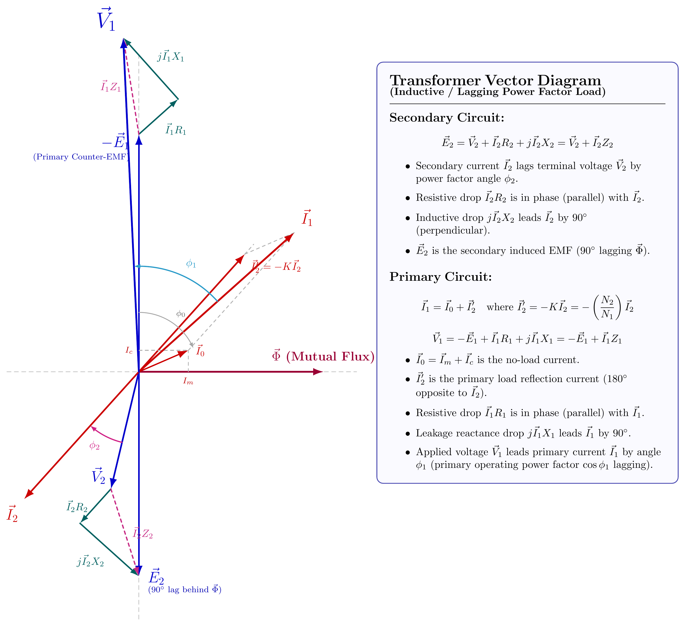

[← T-02: Construction & Core](T-02_Transformer_Construction_and_Core.md) | [🏠 Index](README.md) | [T-04: Equivalent Circuit →](T-04_Equivalent_Circuit.md)

---

# T-03: No-Load Operation & Phasor Diagrams

**ECE 2207 — Exam-Style Answers (Sorted by Topic)**

> **Topic Overview:** This document compiles all semester final questions and exam-style answers on **No-Load Operation & Phasor Diagrams** from 7 years of exams (2017–2024).
> Repeated questions appear once with all exam appearances noted.

---

### [2017 Q6(a)]
> 📋 **Appeared in:** 2017 Q6(a)

**(a) Draw the full-load phasor diagram of a single-phase transformer. [03]**

**Phasor diagram features:**
- $\vec{\Phi}_m$ as reference (horizontal)
- $\vec{E}_1$, $\vec{E}_2$ lagging $\Phi_m$ by 90°
- $\vec{I}_2$ lagging $\vec{V}_2$ by $\phi_2$ (load angle)
- $\vec{V}_2 = \vec{E}_2 - I_2R_2 - jI_2X_2$ (drops subtracted from induced EMF)
- $\vec{I}_0$ (no-load current) components: $I_c$ (core loss), $I_m$ (magnetizing)
- $\vec{I}_1 = \vec{I}_0 + \vec{I}_2'$ where $I_2' = (N_2/N_1)I_2$
- $\vec{V}_1 = -\vec{E}_1 + I_1R_1 + jI_1X_1$

---

### [2018 Q1(c)]
> 📋 **Appeared in:** 2018 Q1(c)

**(c) Draw the equivalent circuit of a transformer with vector diagram for lagging pf. [02]**

#### 1. Equivalent Circuit of a Transformer

#### 2. Vector (Phasor) Diagram for Lagging Power Factor ($\cos\phi_2$ lagging)

**Governing Relations:**
- **Secondary:** $\vec{E}_2 = \vec{V}_2 + \vec{I}_2 R_2 + j\vec{I}_2 X_2 = \vec{V}_2 + \vec{I}_2 Z_2$ (where $\vec{I}_2$ lags $\vec{V}_2$ by $\phi_2$).
- **Primary:** $\vec{I}_1 = \vec{I}_0 + \vec{I}_2'$ with $\vec{I}_2' = -\left(\frac{N_2}{N_1}\right)\vec{I}_2$, and $\vec{V}_1 = -\vec{E}_1 + \vec{I}_1 R_1 + j\vec{I}_1 X_1 = -\vec{E}_1 + \vec{I}_1 Z_1$.

---

### [2019 Q1(c)]
> 📋 **Appeared in:** 2019 Q1(c)

**(c) Why does current flow in primary when secondary is open? Explain how primary current increases as secondary load increases. [04]**

**Why current flows at no-load:**
When $V_1$ is applied, the primary winding behaves as a coil with resistance $R_1$ and inductance $L_1$. To set up the alternating core flux $\Phi_m$ (which induces $E_1 \approx V_1$ to balance applied voltage), a small magnetizing current $I_m$ must flow. Also, a small active component $I_c$ flows to supply core losses (hysteresis + eddy). Together:
$$I_0 = \sqrt{I_c^2 + I_m^2} \approx 2\text{-10\%\ of rated current}$$

**How primary current increases with secondary load:**
When a load is connected and secondary current $I_2$ flows, it creates a demagnetizing MMF $= N_2 I_2$. This tends to reduce the core flux. But $E_1 \approx V_1$ (supply voltage is fixed), so the flux must stay essentially constant. To maintain the flux, the primary must draw additional current $I_2' = I_2 \times N_2/N_1$. Total primary current:
$$I_1 = I_0 + I_2' = I_0 + \frac{N_2}{N_1}I_2$$

As load current $I_2$ increases, $I_1$ increases proportionally.

---

### [2020 Q1(c)]
> 📋 **Appeared in:** 2020 Q1(c)

**(c) Explain the working of a transformer under no-load with neat sketch. [03]**

When primary voltage $V_1$ is applied with secondary open ($I_2 = 0$):

1. Primary current $I_0$ flows (small, 2–10% of rated).
2. $I_0$ has two components:
   - **Magnetizing component $I_m$** (90° lagging from $V_1$): sets up the alternating core flux $\Phi_m$.
   - **Core-loss component $I_c$** (in phase with $V_1$): supplies hysteresis and eddy current losses.
3. Core flux $\Phi_m$ induces primary EMF $E_1 = 4.44 f N_1 \Phi_m$ (opposing $V_1$).
4. Same flux induces secondary EMF $E_2 = 4.44 f N_2 \Phi_m$.
5. Since secondary is open, $V_2 = E_2$. No output current flows.

$$I_0 = \sqrt{I_c^2 + I_m^2}, \qquad \cos\phi_0 = \frac{I_c}{I_0} = \frac{P_0}{V_1 I_0}$$

---

### [2020 Q1(d)]
> 📋 **Appeared in:** 2020 Q1(d)

**(d) Transformer: turns ratio 4:1 step-down. No-load: 10A at pf 0.2 lag. Secondary load: 200A at 0.85 pf lag. Find primary current and pf. [03]**

**Given:** $I_0 = 10$ A, $\cos\phi_0 = 0.2$, $a = 4$ (step-down), $I_2 = 200$ A, $\cos\phi_2 = 0.85$ lag.

**No-load current components:**
$$I_c = I_0\cos\phi_0 = 10 \times 0.2 = 2.0 \text{ A}$$
$$I_m = I_0\sin\phi_0 = 10 \times \sin(78.46°) = 10 \times 0.9798 = 9.798 \text{ A}$$

**Secondary current referred to primary:** $I_2' = I_2/a = 200/4 = 50$ A at $\phi_2 = 31.79°$ lag.

**Phasor addition** (taking $V_1$ as reference, lagging components negative):

| Component | In-phase (A) | Quadrature (A) |
|:---|:---:|:---:|
| $I_0$ | $+2.0$ | $-9.798$ |
| $I_2'$ | $+50 \times 0.85 = +42.5$ | $-50 \times 0.527 = -26.35$ |
| $I_1$ total | $+44.5$ | $-36.15$ |

$$I_1 = \sqrt{44.5^2 + 36.15^2} = \sqrt{1980.25 + 1306.82} = \sqrt{3287.07} = \boxed{57.33 \text{ A}}$$

$$\cos\phi_1 = \frac{44.5}{57.33} = \boxed{0.776 \text{ lagging}}$$

---

### [2021 Q2(a)]
> 📋 **Appeared in:** 2021 Q2(a)

**(a) Draw the phasor diagram of transformer considering winding resistance and leakage reactance. [04]**

**Phasor diagram step by step:**
> 1. **Reference:** $\vec{\Phi}_m$ horizontal (+X axis).
> 2. **Induced EMFs:** $\vec{E}_1$ and $\vec{E}_2$ pointing downward (lag $\Phi_m$ by 90°).
> 3. **Secondary terminal voltage:** $\vec{V}_2 = \vec{E}_2 - \vec{I}_2 R_2 - j\vec{I}_2 X_2$ (draw from tip of $E_2$, subtract drops).
> 4. **Secondary current:** $\vec{I}_2$ lags $\vec{V}_2$ by $\phi_2$ (load power factor angle).
> 5. **No-load current:** $\vec{I}_0 = I_c - jI_m$ (in phase with $E_1$ component and lagging component).
> 6. **Primary current:** $\vec{I}_1 = \vec{I}_0 + \vec{I}_2'$ where $\vec{I}_2' = (N_2/N_1)\vec{I}_2$.
> 7. **Primary voltage:** $\vec{V}_1 = \vec{E}_1 + \vec{I}_1 R_1 + j\vec{I}_1 X_1$ (draw from tip of $E_1$, add drops).

The angle between $\vec{V}_1$ and $\vec{I}_1$ gives the primary power factor angle $\phi_1$.

---

### [2024 Q1(b)]
> 📋 **Appeared in:** 2024 Q1(b)

**(b) Explain the no-load operation of a 1-phase transformer with a neat phasor diagram. [06, CO1]**

**Operation at no-load ($I_2 = 0$):**

When primary voltage $V_1$ is applied and the secondary is open, a small no-load current $I_0$ flows in the primary. This current has two components:

1. **Magnetizing component $I_m$:** In quadrature with $V_1$ (lagging by 90°). Creates the alternating core flux $\Phi_m$.

2. **Core-loss component $I_c$:** In phase with $V_1$. Supplies hysteresis and eddy current losses in the core.

$$I_0 = \sqrt{I_c^2 + I_m^2}, \qquad \cos\phi_0 = \frac{I_c}{I_0} = \frac{W_0}{V_1 I_0}$$

The core flux $\Phi_m$ induces:
$$E_1 = 4.44fN_1\Phi_m \approx V_1, \qquad E_2 = 4.44fN_2\Phi_m = V_2 \text{ (open secondary)}$$

**Phasor diagram (no-load):**

- Reference $\vec{\Phi}_m$ horizontal (+X axis).
- $\vec{E}_1$ and $\vec{E}_2$ pointing downward (lagging $\Phi_m$ by 90°).
- $\vec{I}_c$ in phase with $-\vec{E}_1$ (upward, opposing $E_1$ to balance $V_1$).
- $\vec{I}_m$ lagging $-\vec{E}_1$ by 90°.
- $\vec{I}_0 = \vec{I}_c + \vec{I}_m$ at angle $\phi_0$ from $\vec{V}_1$.
- $\vec{V}_1 = -\vec{E}_1$ (upward), $\vec{V}_2 = \vec{E}_2$ (downward).

Key relationships:
- $V_1 \approx E_1$ (small $I_0R_1$ drop neglected for ideal core)
- $V_2 = E_2$ (secondary open, no drop)
- $V_2/V_1 = N_2/N_1 = K$

---

### [2024 Q2(a)]
> 📋 **Appeared in:** 2024 Q2(a)

**(a) Draw the phasor diagram of a R-L loaded ideal transformer, stating each step. [06, CO1]**

**Ideal transformer assumptions:** $R_1 = R_2 = X_1 = X_2 = 0$, $I_0 = 0$, so $V_2 = E_2$ and $V_1 = -E_1$.

For R-L load: secondary current lags secondary voltage by $\theta_2 = \tan^{-1}(X_L/R_L)$.

**Step 1:** Draw reference $\vec{\Phi}_m$ horizontal (along +X axis).

**Step 2:** Draw $\vec{E}_1$ and $\vec{E}_2$ vertically downward (lagging $\vec{\Phi}_m$ by 90°).

**Step 3:** Since ideal: $\vec{V}_2 = \vec{E}_2$ (downward).

**Step 4:** R-L load: $\vec{I}_2$ lags $\vec{V}_2$ by $\theta_2$. Draw $\vec{I}_2$ clockwise from $\vec{E}_2$ by $\theta_2$.

**Step 5:** Ampere-turn balance: $N_1\vec{I}_1 = -N_2\vec{I}_2 \Rightarrow \vec{I}_1 = -(N_2/N_1)\vec{I}_2$. So $\vec{I}_1$ is $180°$ opposite to $\vec{I}_2$.

**Step 6:** $\vec{V}_1 = -\vec{E}_1$ (vertically upward, +Y direction).

**Step 7:** Angle between $\vec{V}_1$ and $\vec{I}_1$ is $\theta_1 = \theta_2$. Primary power factor equals load power factor.

**Phasor summary table:**

| Phasor | Angle |
|:---:|:---:|
| $\vec{\Phi}_m$ | 0° |
| $\vec{E}_1, \vec{E}_2, \vec{V}_2$ | −90° |
| $\vec{V}_1$ | +90° |
| $\vec{I}_2$ | $-90° - \theta_2$ |
| $\vec{I}_1$ | $+90° - \theta_1$ |

---

[← T-02: Construction & Core](T-02_Transformer_Construction_and_Core.md) | [🏠 Index](README.md) | [T-04: Equivalent Circuit →](T-04_Equivalent_Circuit.md)
