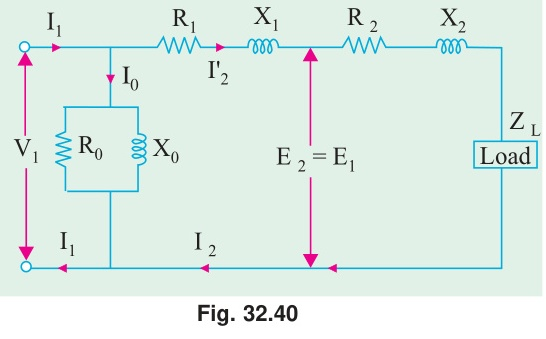
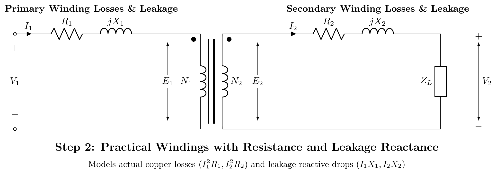

[← T-03: No-Load & Phasors](T-03_No-Load_Operation_and_Phasor_Diagrams.md) | [🏠 Index](README.md) | [T-05: Voltage Regulation →](T-05_Voltage_Regulation.md)

---

# T-04: Equivalent Circuit

**ECE 2207 — Exam-Style Answers (Sorted by Topic)**

> **Topic Overview:** This document compiles all semester final questions and exam-style answers on **Equivalent Circuit** from 7 years of exams (2017–2024).
> Repeated questions appear once with all exam appearances noted.

---

### [2017 Q8(c)]
> 📋 **Appeared in:** 2017 Q8(c)

**(c) 200/400V step-up transformer, parameters referred to LV side: $R_{eq} = 0.15\,\Omega$, $X_{eq} = 0.37\,\Omega$, $R_c = 600\,\Omega$, $X_m = 300\,\Omega$. Load: 10A at 0.8 pf lag (secondary). Find: (i) primary current, (ii) secondary terminal voltage. [05]**

**Given:** Turns ratio $a = N_1/N_2 = 200/400 = 0.5$ (step-up), all parameters on LV (primary) side.

Load referred to primary side:
- Secondary current $I_2 = 10$ A. Referred to primary: $I_2' = I_2/a = 10/0.5 = 20$ A (but we need to be careful: referred secondary current to primary = $I_2 \times (N_2/N_1) = 10 \times 2 = 20$ A).

Wait: parameters are referred to LV side. Secondary current (HV side) = 10 A. Referred to LV (primary): $I_2' = 10 \times (N_2/N_1) = 10 \times 2 = 20$ A at pf $= 0.8$ lag.

**Taking $V_2'$ as reference on primary side:**

Secondary terminal voltage referred to primary: $V_2' = 200$ V (at rated voltage the secondary is 400V, referred to primary = 400 × 0.5 = 200V).

Let $\vec{V}_2' = 200\angle 0°$ V, $\vec{I}_2' = 20\angle -36.87°$ A

**Approximate primary voltage (neglecting shunt branch for initial calc):**
$$\vec{V}_1 = \vec{V}_2' + \vec{I}_2'(R_{eq} + jX_{eq})$$
$$= 200\angle 0° + 20\angle -36.87° \times (0.15 + j0.37)$$

$\vec{I}_2' = 20(0.8 - j0.6) = 16 - j12$

$\vec{I}_2'(R_{eq} + jX_{eq}) = (16 - j12)(0.15 + j0.37)$
$= 16(0.15) + 16(j0.37) + (-j12)(0.15) + (-j12)(j0.37)$
$= 2.4 + j5.92 - j1.8 + 4.44$
$= 6.84 + j4.12$

$$\vec{V}_1 = (200 + 6.84) + j4.12 = 206.84 + j4.12$$
$$|V_1| = \sqrt{206.84^2 + 4.12^2} \approx \boxed{206.88 \text{ V}}$$

**Primary current (including magnetizing branch):**

$$I_c = \frac{V_1}{R_c} = \frac{206.88}{600} = 0.345 \text{ A (in phase with }V_1)$$
$$I_m = \frac{V_1}{X_m} = \frac{206.88}{300} = 0.690 \text{ A (lagging }V_1\text{ by 90°)}$$

No-load current: $\vec{I}_0 = I_c - jI_m = 0.345 - j0.690$

$$\vec{I}_1 = \vec{I}_0 + \vec{I}_2' = (0.345 - j0.690) + (16 - j12) = 16.345 - j12.69$$

$$|I_1| = \sqrt{16.345^2 + 12.69^2} = \sqrt{267.2 + 161.1} = \sqrt{428.3} \approx \boxed{20.70 \text{ A}}$$

**Secondary terminal voltage (actual):** Referred back to secondary side:
$$V_{2,\text{actual}} = |V_2'| \times (N_2/N_1) = 200 \times 2 = 400 \text{ V}$$

(In this simplified case, since we set $V_2' = 200$ V as reference, actual secondary $= 400$ V with the given load conditions.)

---

---

### [2020 Q1(b)]
> 📋 **Appeared in:** 2020 Q1(b)

**(b) Derive the equivalent circuit of a single-phase two-winding transformer. [04]**

**Step 1: Ideal transformer with no losses, no leakage:**
$$\frac{V_1}{V_2} = \frac{N_1}{N_2} = a, \qquad I_1 = \frac{I_2}{a}$$

**Step 2: Add core loss and magnetizing current (shunt branch):**
Primary draws no-load current $I_0 = I_c + jI_m$ even at no load.
- $I_c$ in phase with $V_1$: represented by $R_c = V_1/I_c$ in shunt.
- $I_m$ lags $V_1$ by 90°: represented by $X_m = V_1/I_m$ in shunt.

**Step 3: Add primary winding resistance and leakage reactance:**
Series elements $R_1$ and $jX_1$ on the primary side.

**Step 4: Refer secondary to primary:**
Replace $R_2$, $jX_2$ with $a^2 R_2 = R_2'$, $ja^2 X_2 = jX_2'$ on the primary side.

**Step 5: Final approximate equivalent circuit (shunt branch at input):**

$$V_1 \to [R_1 + jX_1 + R_2' + jX_2'] \to E_1$$

Shunt branch ($R_c \| jX_m$) connected across $V_1$.

For simplicity, combine series elements:
$$R_{01} = R_1 + R_2', \quad X_{01} = X_1 + X_2'$$

---

### [2020 Q3(c)]
> 📋 **Appeared in:** 2020 Q3(c)

**(c) Step-by-step equivalent circuit of a transformer referred to primary side. [05]**

**1. Ideal Transformer Core Model:**
Start with an ideal core (zero winding resistance, zero leakage flux, infinite permeability, zero core loss).
$$E_1 = aE_2, \quad I_1 = I_2/a \quad \text{where } a = N_1/N_2$$

**2. Winding Resistances and Leakage Reactances:**
Add practical winding series resistance ($R_1, R_2$) and leakage reactance ($X_1, X_2$) on both sides.
$$V_1 = E_1 + I_1(R_1 + jX_1), \quad E_2 = V_2 + I_2(R_2 + jX_2)$$

**3. Core Excitation Shunt Branch:**
Add a parallel branch across $E_1$ to model core iron loss ($R_c$) and magnetizing reactance ($X_m$). The total no-load current is $I_0 = I_c + I_m$.

**4. Transferring Secondary to Primary (Exact Equivalent Circuit):**
To eliminate the ideal transformer, transfer secondary parameters to the primary using $a^2$:
$$R_2' = a^2R_2, \quad X_2' = a^2X_2, \quad V_2' = aV_2, \quad I_2' = I_2/a$$

**5. Approximate Equivalent Circuit:**
Since $I_0$ is small and the primary voltage drop $I_0(R_1+jX_1)$ is negligible, move the shunt branch to the primary terminals. The series impedances combine to $R_{01} = R_1 + R_2'$ and $X_{01} = X_1 + X_2'$.

---

### [2024 Q4(c)]
> 📋 **Appeared in:** 2024 Q4(c)

**(c) Obtain the equivalent circuit of a transformer referred to the primary side. [03, CO1]**

**Referring secondary to primary:**

Replace all secondary quantities with primary-referred (primed) values:
$$R_2' = a^2 R_2, \quad X_2' = a^2 X_2, \quad E_2' = aE_2 = E_1, \quad Z_L' = a^2 Z_L$$

**Final equivalent circuit referred to primary:**

Series branch: $R_{01} = R_1 + R_2'$, $X_{01} = X_1 + X_2'$ (total series impedance).

Shunt branch: $R_c \| jX_m$ (at primary terminals: approximate circuit).

In the approximate equivalent circuit, the shunt branch is moved to the primary input terminals (before $R_1$, $X_1$). This simplifies calculation without significant error for most power transformers.

---

[← T-03: No-Load & Phasors](T-03_No-Load_Operation_and_Phasor_Diagrams.md) | [🏠 Index](README.md) | [T-05: Voltage Regulation →](T-05_Voltage_Regulation.md)
