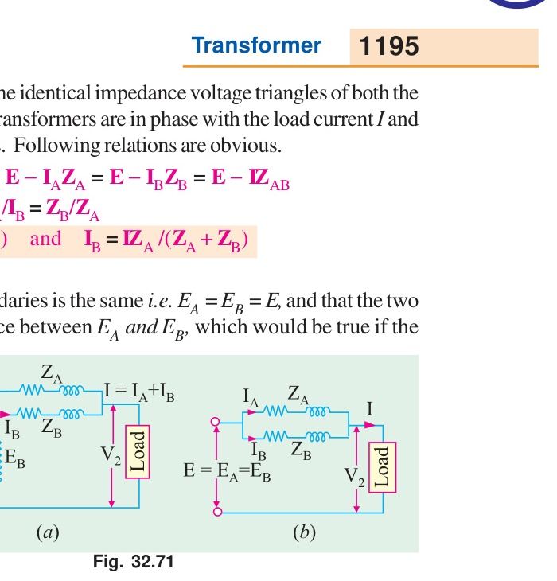
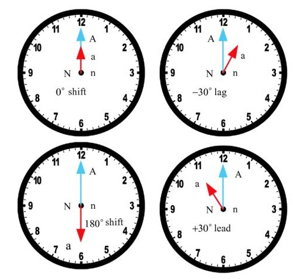

[← T-08: Scott T-T Connection](T-08_Scott_T-T_Connection.md) | [🏠 Index](README.md) | [T-10: Auto-Transformer →](T-10_Auto-Transformer.md)

---

# T-09: Vector Groups & Parallel Operation

**ECE 2207 — Exam-Style Answers (Sorted by Topic)**

> **Topic Overview:** This document compiles all semester final questions and exam-style answers on **Vector Groups & Parallel Operation** from 7 years of exams (2017–2024).
> Repeated questions appear once with all exam appearances noted.

---

### [2019 Q3(c)]
> 📋 **Appeared in:** 2019 Q3(c)

**(c) Yd11 in parallel with Dy1: possible? [04]**

**Vector group numbers:** Each unit represents a 30° phase shift (clock notation: 12 = 0°, 11 = 330° = −30°, 1 = 30°).

- Yd11: Phase displacement = 11 × 30° = 330° (= −30°): secondary lags primary by 30°.
- Dy1: Phase displacement = 1 × 30° = 30°: secondary leads primary by 30°.

The difference in secondary voltage phase angles: $330° - 30° = 300°$ (or equivalently $60°$ lag). This is a 60° phase displacement between their secondary voltages.

Two transformers can only be paralleled if their secondary voltages are exactly in phase (same vector group number). A 60° difference means a large circulating current would flow even at no load.

**Direct parallel: not possible** due to the 60° phase displacement.

**Possible workaround:** Yes, it is possible if a phase-shifting transformer or external connection rearrangement shifts one transformer's output by 60° to match the other. In practice, rearranging the external secondary connections (changing the bus-bar connections) can sometimes compensate for a 30° difference: but a 60° difference is generally not bridgeable by simple reconnection.

**Conclusion:** Direct parallel operation is **not possible** without modification.

---

### [2021 Q4(a)]
> 📋 **Appeared in:** 2017 Q7(b), 2021 Q4(a), 2023 Q4(b) (Years: 2017, 2021, 2023)

**(a) Conditions for parallel operation of two 3-phase transformers. [04]**

1. **Same voltage ratio:** Primary and secondary rated voltages must be equal. Otherwise a circulating current flows in the secondary loop even at no load.

2. **Same per-unit (or percentage) impedance:** Ensures load sharing is proportional to rated kVA. If impedances differ, the transformer with lower impedance takes a disproportionate share and may overload.

3. **Same polarity:** Corresponding terminals must have the same instantaneous polarity. For 3-phase, this means the same phase sequence of secondary voltages.

4. **Same phase sequence:** Both transformers must be connected to the same phase sequence (A-B-C). A reversed sequence causes a voltage difference and large circulating currents.

5. **Same vector group (zero phase displacement):** Both transformers must have the same vector group or have zero phase angle between their secondary voltages. A 30° phase difference (e.g., Yy0 with Yd11) causes very large circulating currents.

---

### [2021 Q8(b)]
> 📋 **Appeared in:** 2021 Q8(b)

**(b) What does vector group of a transformer indicate? What does "Dyn5" represent? [03]**

**Vector group:** A standardized notation that tells you:
1. The connection of the primary winding (uppercase letter: Y, D, or Z).
2. The connection of the secondary winding (lowercase letter: y, d, or z).
3. Whether a neutral is available (letter n).
4. The phase displacement between primary and secondary voltages (clock notation: number × 30°).

**"Dyn5" means:**
- **D** → Primary winding connected in Delta (Δ)
- **y** → Secondary winding connected in Star (Y)
- **n** → Neutral conductor available on the secondary side
- **5** → Phase displacement = 5 × 30° = 150° (secondary voltage lags primary voltage by 150°)

In clock notation: 12 = 0°, 1 = 30°, 5 = 150°. So Dyn5 means the secondary star voltage phasor points to "5 o'clock" relative to the primary delta voltage phasor at "12 o'clock."

---

[← T-08: Scott T-T Connection](T-08_Scott_T-T_Connection.md) | [🏠 Index](README.md) | [T-10: Auto-Transformer →](T-10_Auto-Transformer.md)
